# 4. 处理文本

每个用户界面都需要在屏幕上显示信息。虽然信息可以以多种形式呈现，但用户界面上一种常见的显示信息类型涉及**文本**。如果你想要在用户界面上显示文本，你需要定义一个字符串，让其出现在`Text`视图中，例如：

```
Text("Hello World")
```

为了获得更大的灵活性，你可以将字符串存储在变量或常量中，然后在`Text`视图中使用该变量或常量的名称，例如：

```
let myString = "显示一个字符串变量"
Text(myString)
```

通过使用字符串变量，你可以在变量中存储不同的字符串，从而使`Text`视图显示新的文本。为了更灵活，`Text`视图还可以使用**字符串插值**来显示非字符串数据，例如：

```
let myString = 46
Text("这是我的年龄 = \(myString)")
```

字符串插值允许任何非字符串数据显示在字符串中。最重要的是，字符串插值不需要将数据转换为字符串，因此它是在`Text`视图中显示数据的一种快速简单的方法。

`Text`视图可以显示任意长度的字符串。然而，显示字符串的长度可能会因应用程序运行所在的屏幕尺寸而异，例如较大的 iPad 屏幕或较小的 iPhone 屏幕。为了自定义字符串的显示方式，SwiftUI 允许你定义以下内容：

- **行数限制** – 定义`Text`视图可以显示的最大行数，例如 2 行或 4 行
- **截断** – 定义如果无法显示整个字符串时，如何截断或切断字符串

行数限制修饰符允许你定义要显示的最大行数。如果你没有指定行数限制值，SwiftUI 将显示尽可能多的行数。要定义行数限制，请在 Swift 代码中添加`lineLimit`修饰符，如下所示：

```
Text("这是我的年龄 \(myString)。由于我已经退休，现在有资格领取养老金和社会保障金，所以我可以安享晚年，享受生活，而无需再为收入而工作。")
.lineLimit(2)
```

图 4-1 展示了两个相同的`Text`视图，但顶部的`Text`视图没有行数限制。因此，它显示了全部文本。底部的`Text`视图将行数限制设为 2，因此它只显示前两行文本。

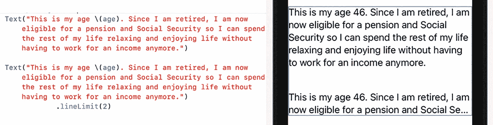

**图 4-1** – `lineLimit`修饰符可能会截断部分文本

除了键入 Swift 代码来定义行数限制，你还可以点击`Text`视图并打开检查器。然后，你可以在检查器面板中定义行数限制，如图 4-2 所示。

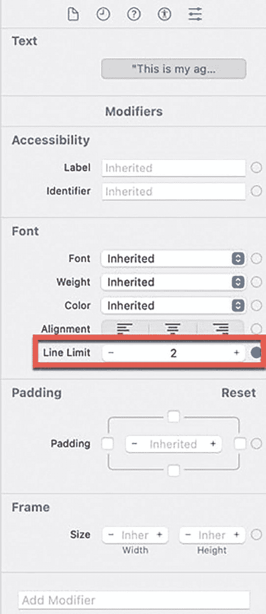

**图 4-2** – 在检查器面板中定义行数限制

如果你定义了一个行数限制（例如两行），而你的文本超出了该限制（例如显示三行或更多行），SwiftUI 将切断或截断文本。SwiftUI 提供了三种截断超出其行数限制的文本的方法，如图 4-3 所示：

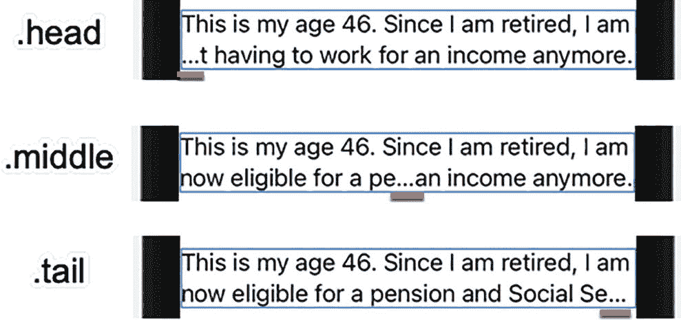

**图 4-3** – 三种不同的截断超出其行数限制文本的方法

- `.head` – 截断最后一行开头
- `.middle` – 截断最后一行中间
- `.tail` – 截断最后一行末尾

默认情况下，SwiftUI 会在行尾截断文本（`.tail`），但你可以在`Text`视图上同时使用`truncationMode`修饰符和`lineLimit`修饰符来定义`.head`或`.middle`截断选项，例如：

```
.truncationMode(.middle)
```

如果你将光标移动到一个`Text`视图中，然后点击检查器面板底部的“添加修饰符”按钮，你可以将“截断模式”修饰符添加到检查器面板。然后，你可以在检查器面板中定义截断选项，如图 4-4 所示。

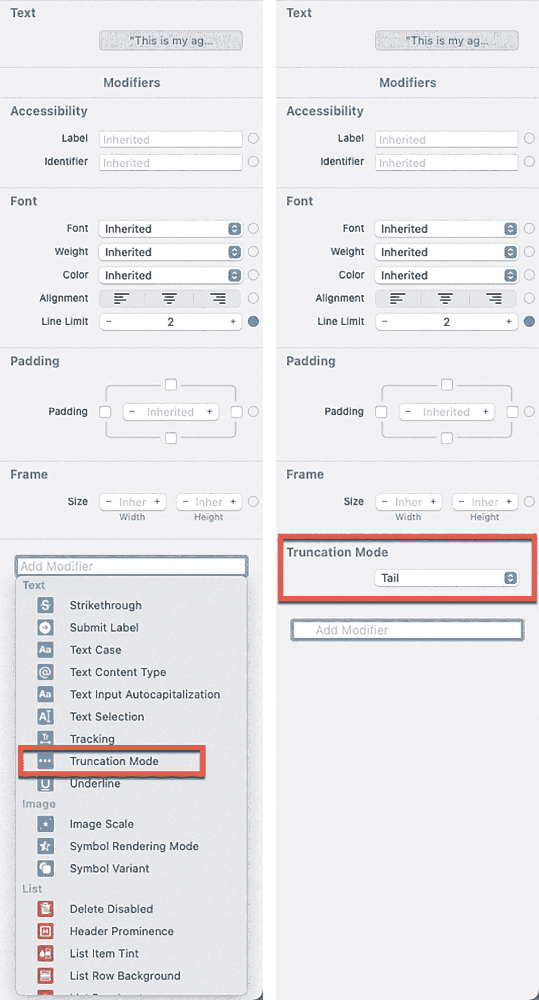

**图 4-4** – 在检查器面板中定义截断选项


## 改变文本外观

`Text` 视图通常显示纯文本。为了丰富文本的外观，SwiftUI 允许你通过 Swift 代码编写修饰符或在检查器面板中定义字体大小、字重和颜色。字体大小选项包含特定的文本样式，这些样式能够自动适应 iPhone 或 iPad 上定义的无障碍设置。可用的字体大小选项如图 4-5 所示：

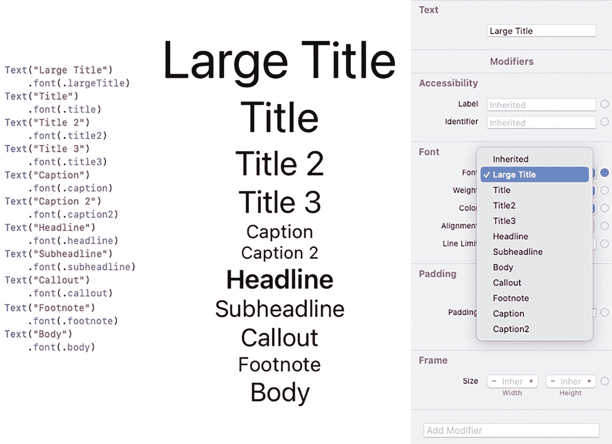

一组共 3 张截图。第一张显示了用于大标题、标题、标题 2、标题 3、说明、说明 2 和头条等文本的字体命令。第二张显示了各种字体大小的文本。第三张是一个窗口，其中包含字体选项的选项菜单等。

**图 4-5** 显示文本的不同字体大小

- 大标题
- 标题
- 标题 2
- 标题 3
- 说明
- 说明 2
- 头条
- 副标题
- 标注
- 脚注
- 正文

如果你想为 `Text` 视图选择特定的字体，可以使用自定义字体修饰符，如下所示：

```
.font(.custom("Courier", size: 36))
```

在上述代码中，你先定义了字体家族，后跟字体大小。请记住，Xcode 可能不支持所有字体。如果你只想定义自定义字体大小，可以省略字体名称，例如：

```
.font(.custom("", size: 36))
```

> **注意：** 当你定义自定义字体和字体大小时，`Text` 视图不会根据用户的 iOS 设置自动调整文本大小。因此，除非绝对必要，最好避免使用自定义字体。

除了字体大小，你还可以选择字重，它定义了文本显示的粗细程度。字重选项包括以下内容，如图 4-6 所示：

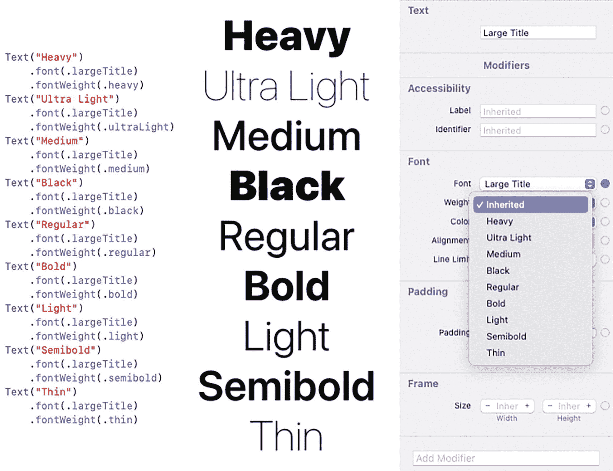

一组共 3 张截图。第一张显示了用于大标题、标题、标题 2 和标题 3 等文本的字重命令。第二张显示了各种字重的文本，包括超粗和极细等。第三张是一个窗口，其中包含字体选项的选项菜单。

**图 4-6** 显示文本的不同字重

- 超粗
- 半粗
- 粗体
- 常规
- 细体
- 特黑
- 中等
- 轻细
- 极细

修改文本外观的第三种方法是选择文本颜色。你可以在 Swift 代码中键入颜色修饰符，或从检查器面板中选择标准颜色，例如红色、绿色或橙色，如图 4-7 所示。

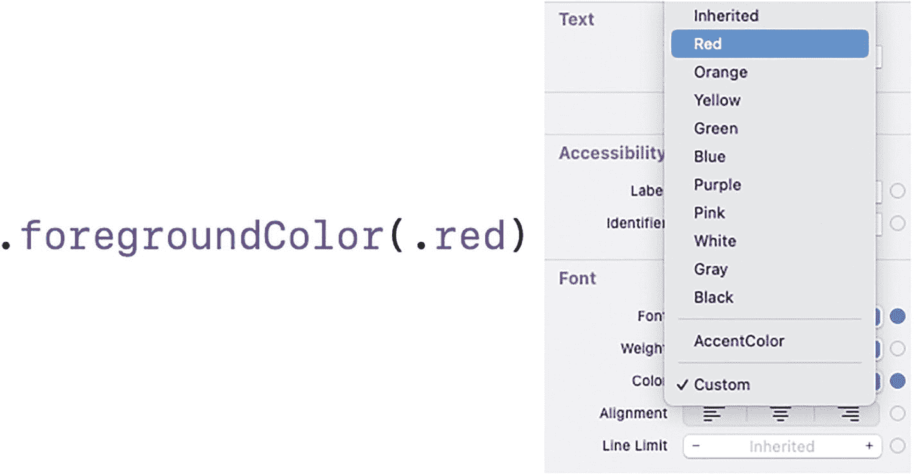

一组共 2 张截图，分别显示了前景色命令和一个裁剪后的窗口，其中包含文本选项的选项菜单，菜单中列出了各种颜色。

**图 4-7** 定义文本颜色

使用颜色时，你可以选择标准颜色选项，例如绿色、蓝色或黄色。如果你不想使用标准颜色，还可以选择“自定”，它允许你定义不同的颜色值以及从 0（不可见）到 1（完全可见）的不透明度值。当你选择自定颜色选项时，会弹出一个颜色对话框，让你选择非标准颜色，如图 4-8 所示。

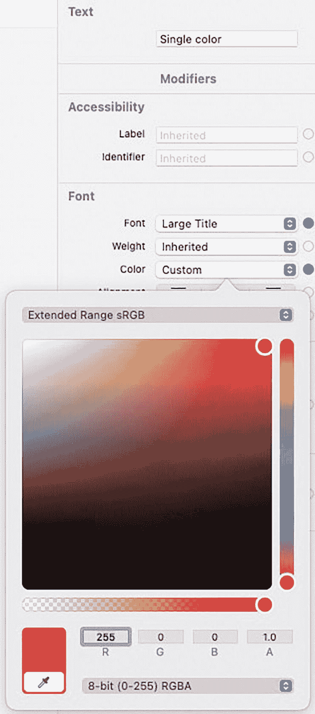

一张“扩展范围 sRGB”对话框的截图，其中包含一个颜色框、两个颜色滑块和其他选项。背景中有一个窗口，提供了文本、辅助功能和字体选项。该对话框来自字体选项中的颜色微调框。

**图 4-8** 为文本定义自定颜色

定义颜色的另外两种方式包括定义：
- 色相、饱和度和亮度
- 红色、绿色和蓝色（RGB）

色相值（介于 0.0 和 1.0 之间）基于色轮定义颜色。0.0 或 1.0 的值是相同的。其他值则显示色轮周围的不同颜色，如图 4-9 所示。

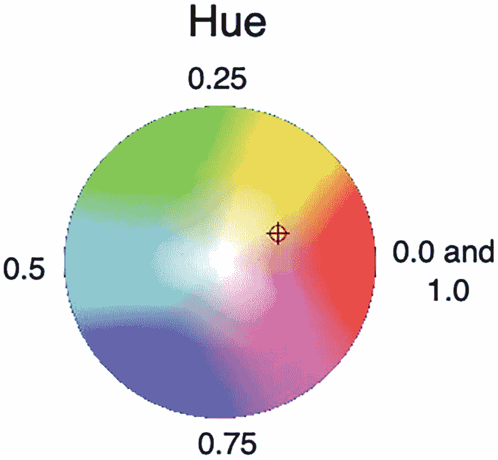

一个带有各种颜色的色轮插图。上面有“色相”标题，以及色轮周围的数值 0.25、0.0 和 1.0、0.75、0.5。

**图 4-9** 使用色相值从色轮中选择颜色

饱和度值定义颜色的显现程度，其中 0.0 显示灰色，而 1.0 显示该颜色的最强形态。亮度值定义颜色的可见度，其中 0.0 显示无色，而 1.0 显示最亮的颜色。

红色、蓝色、绿色（RGB）值允许你定义 0.0 到 1.0 之间的值，其中 0.0 表示完全没有该颜色。通过对红色、蓝色和绿色使用不同的值，你可以创建有趣且独特的颜色。

要定义色相、饱和度和亮度，请使用以下代码：

```
Color(hue: 0.75, saturation: 1.0, brightness: 1.0)
```

要定义红色、绿色和蓝色值，请使用以下代码：

```
Color(red: 0.9, green: 0.2, blue: 0.6)
```

使用 0.0 到 1.0 之间的不同值来定义每个选项，例如为色相设置 0.84，或为绿色设置 0.62。

就像文字处理软件一样，SwiftUI 也允许你将文本修改为斜体、粗体、下划线或删除线。要为文本添加这些效果，你可以键入以下命令：

```
.bold()
.italic()
.underline()
.strikethrough()
```

除了键入这些修饰符，你还可以单击检查器面板中的“添加修饰符”弹出菜单，如图 4-10 所示。

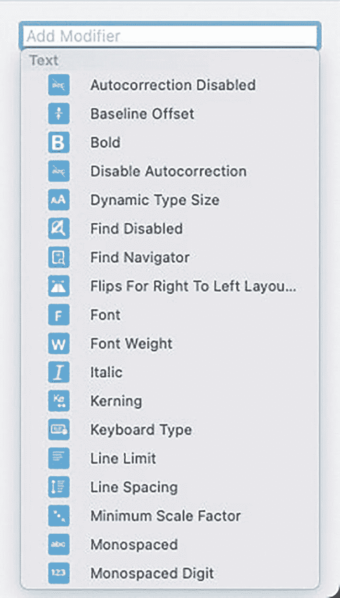

一张“添加修饰符”搜索栏的截图。其中有一个“文本”部分，提供了禁用自动更正、基线偏移、粗体、禁用自动更正、动态类型大小、查找禁用、字体、字重、斜体、字间距、键盘类型和行间距等选项。

**图 4-10** 为文本添加粗体、斜体、下划线或删除线

修改文本的另一种方式是定义其对齐方式。三种对齐方式如图 4-11 所示：

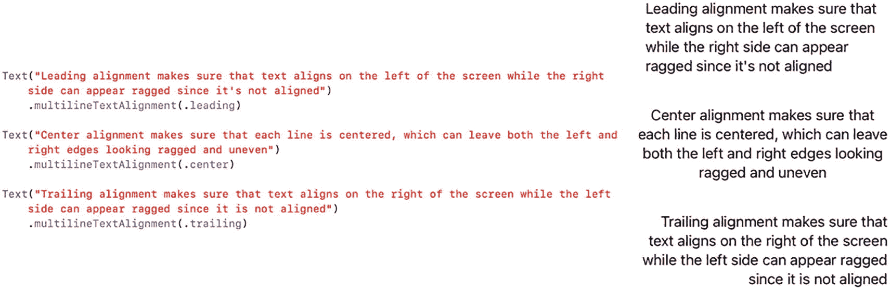

一组共 3 个命令，分别是文本和多行文本对齐，以及它们各自的描述和左对齐、居中对齐、右对齐。

**图 4-11** 对齐文本的三种方式

- **左对齐** – 文本沿左边缘对齐。
- **居中** – 每行文本显示在左边缘和右边缘的中间。
- **右对齐** – 文本沿右边缘对齐。

你可以通过使用 `.multilineTextAlignment` 修饰符，或在属性检查器中选择文本对齐选项来定义文本对齐，如图 4-12 所示。

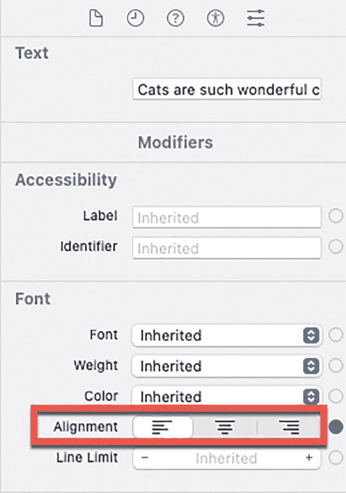

一张裁剪后的窗口截图。其中包含文本、辅助功能和字体选项。字体选项中，对齐选项被一个边界框高亮显示。

**图 4-12** 在检查器面板中对齐文本


## 使用标签视图

标签视图（Label view）与文本视图（Text view）类似。文本视图仅显示单行文本字符串，而标签视图则可以并排显示字符串和图像，如图 4-13 所示。

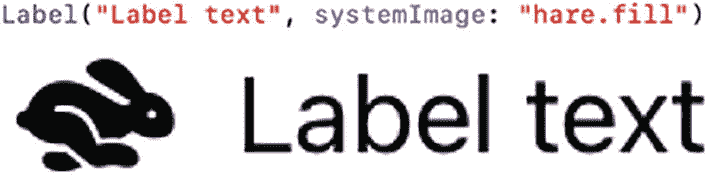

一个标签和系统图像的示例，包含一只野兔的插图和文本“标签文本”。

图 4-13

标签视图可以同时显示图像和文本

标签视图可以使用苹果免费 SF Symbols 应用（`https://developer.apple.com/sf-symbols/`）中的任何图像，该应用展示了所有可用的系统图像，如图 4-14 所示。

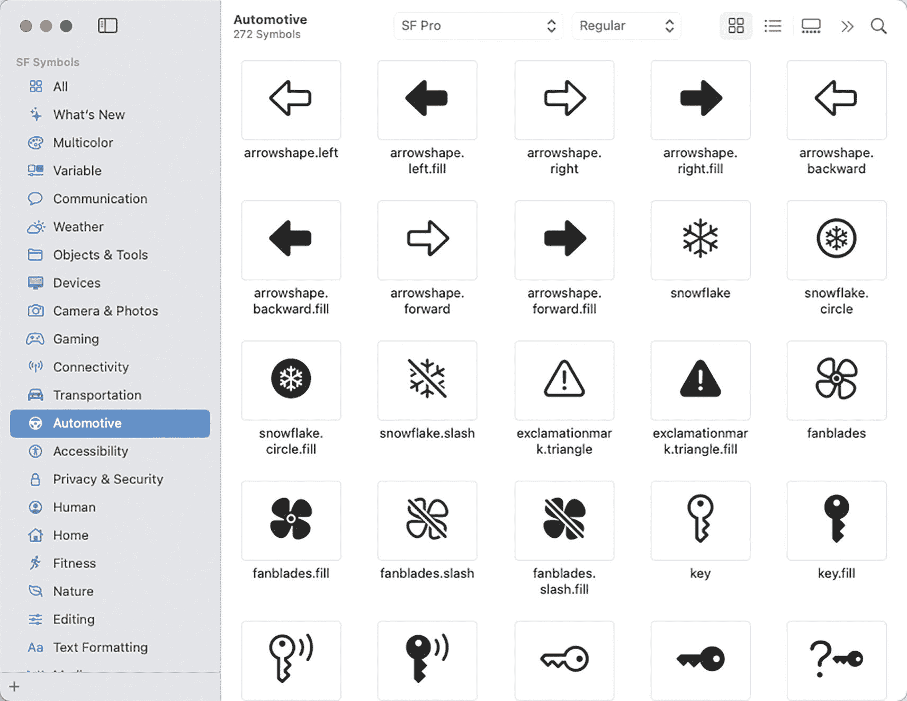

一个窗口截图，左侧面板选中了“汽车”选项。右侧面板中显示了汽车相关的符号，包括：箭头形状左点、箭头形状前进点、雪花点圆圈填充、扇叶点填充、钥匙以及钥匙点填充等。

图 4-14

SF Symbols 应用显示了可以包含在 Xcode 项目中的图标

如果你想在标签视图中显示 SF Symbol 图标，可以使用以下代码：

```
Label("文本", systemImage: "此处为 SF Symbol 图像名称")
```

文本可以是任何字符串或字符串变量，而 SF Symbol 的名称必须完全用双引号括起来，例如 `"creditcard"` 或 `"banknote.fill"`。请确保你输入的 SF Symbol 图标名称与 SF Symbols 应用中显示的完全一致。你也可以在 SF Symbols 应用中右键点击任意图标，在弹出的菜单中选择“复制名称”，如图 4-15 所示。然后你就可以将此名称粘贴到标签视图中。

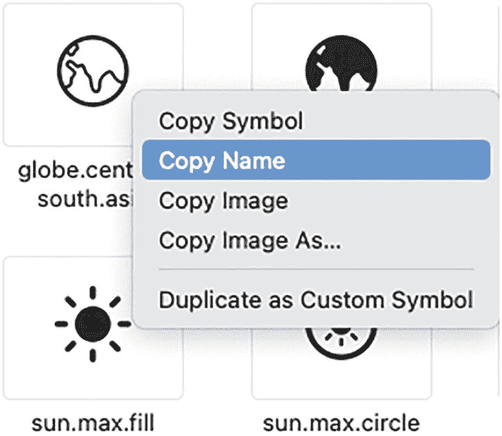

一个选项菜单的截图，其中“复制名称”选项被高亮显示。背景中有 4 个符号。

图 4-15

右键点击图标可以在 SF Symbols 应用中复制其名称

如果你想使用自己的图像，则需要将它们拖放到 Assets 文件夹中，如图 4-16 所示。

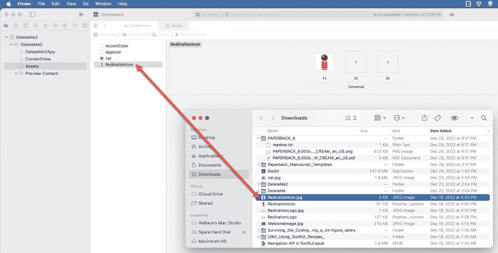

一个窗口截图，从左到右依次选中了资产选项、redination 图标选项，以及一个包含 redination 图标.jpg 的下载窗口。

图 4-16

你可以将图像拖放到 Xcode 项目的 Assets 文件夹中

如果你想显示存储在 Xcode 项目 Assets 文件夹中的图像，可以使用以下代码：

```
Label("文本", image: "此处为图像名称")
```

文本可以是任何字符串或字符串变量，而图像名称必须与 Assets 文件夹中的图像文件名完全匹配，但不包含文件扩展名。

**注意**

在将图像添加到 Xcode 项目的 Assets 文件夹之前，你可能需要调整其大小。否则，如果图像太大，标签视图会以其原始尺寸显示图像，这可能会比你想要的尺寸大得多。

定义标签视图最简单的方法是定义一个 `systemImage`（来自 SF Symbols 库）或一个存储在 Assets 文件夹中的常规图像：

```
Label("文本", systemImage: "此处为 SF Symbol 图像名称")
Label("文本", image: "此处为来自 Assets 文件夹的图像名称")
```

然而，如果你想自定义文本和/或图像的外观，可以使用以下代码创建一个标签视图：

```
Label {
Text("备用标签定义")
} icon: {
Image(systemName: "此处为 SF Symbol 图像名称")
}
```

或

```
Label {
Text("备用标签定义")
} icon: {
Image("此处为图像名称")
}
```

**注意**

使用 SF Symbol 图标时，你必须在 Image 视图中定义 `systemName:` 参数；但当使用存储在 Assets 文件夹中的图像时，你只需在 Image 视图中直接定义图像名称，不带任何参数。

当你使用文本和图像视图定义标签视图时，可以单独自定义每个部分，例如为文本选择字体和为图像设置不透明度，如下所示：

```
Label {
Text("修饰符")
.font(.title)
} icon: {
Image("旗帜")
.opacity(0.25)
}
```

上述标签使用 `.title` 字体显示文本，并以 `0.25` 的不透明度显示一面旗帜图像，如图 4-17 所示。

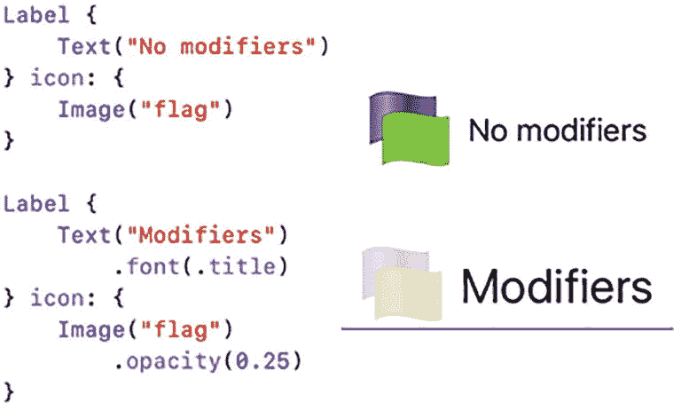

两套标签、文本、图像和不透明度命令的示例，包含旗帜符号、文本“无修饰符”和“修饰符”。

图 4-17

在标签视图中修改文本和图像

创建标签视图时，你有三种选项，如图 4-18 所示：

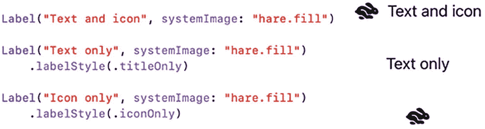

三套标签、文本和图标、仅文本、仅图标、系统图像以及标签样式的命令示例，分别对应其文本和图标：一只野兔、仅文本以及一只野兔图标。

图 4-18

标签视图显示信息的三种不同方式

*   文本和图标（默认）
*   仅文本
*   仅图标

### 为文本或标签视图添加边框

为了突出显示文本视图和标签视图，你可以为它们添加边框。边框可以由颜色和宽度组成，例如：

```
.border(Color.red, width: 3)
```

当你对文本或标签视图使用 `.border` 修饰符时，边框会紧密包裹在内部文本周围，如图 4-19 所示。

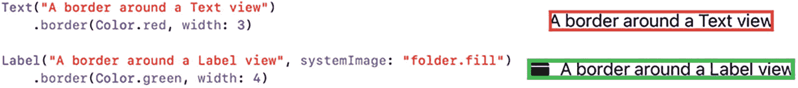

两套文本、边框、标签、系统图像和颜色命令的示例，分别对应文本视图周围的边框和带文件夹图标的标签视图周围的边框。

图 4-19

边框紧密包裹在文本或标签视图内部的文本周围

如果你不希望边框如此紧密地包裹文本，可以首先为文本或标签视图添加内边距（padding），然后再应用 `.border` 修饰符，如图 4-20 所示。

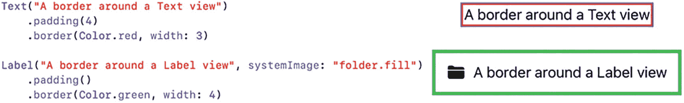

两套文本、边框、标签、内边距、系统图像和颜色命令的示例，分别对应文本视图周围带空间的边框和带文件夹图标的标签视图周围带空间的边框。

图 4-20

内边距修饰符可以为文本或标签视图周围的边框添加空间

**注意**

请确保在 `.border` 修饰符之前应用 `.padding` 修饰符。否则，如果 `.border` 修饰符出现在前面，SwiftUI 会先绘制边框，然后在文本或标签视图周围应用内边距。

## 总结

文本视图非常适合在用户界面上显示任何类型的文本信息。即使你需要显示数字、日期或任何其他数据类型，你也可以使用字符串插值在文本视图中显示数据。与文本视图类似的是标签视图。

文本视图仅显示文本，而标签视图可以并排显示图像和文本。标签视图可以显示 SF Symbols 应用中列出的图标，也可以显示你添加到 Xcode 项目 Assets 文件夹中的任何图像。通过对标签视图应用不同的样式，你可以显示文本和图标、仅文本或仅图标。通过使用文本视图或标签视图，你的应用可以在用户界面上显示信息，供用户查看。


