# 5. 处理图像

多数用户界面由文本构成，但纯文本难免显得单调。因此，屏幕上第二常见的信息展示方式便是图像。图像可以纯粹用于装饰，也可以帮助用户在用户界面中进行导航。

最常见的显示图像是图标。SF Symbols 应用（[`https://developer.apple.com/sf-symbols`](https://developer.apple.com/sf-symbols)）列出了所有可用于 App 用户界面的图标。除了这些图标，你还可以包含任何拖入 Xcode 项目 Assets 文件夹的图像。此外，你还可以包含矩形或圆形等常见形状，这些形状都可以显示在屏幕上。

通过显示彩色或信息丰富的图形，图像可以让你美化任何用户界面的外观。每当你创建用户界面时，思考如何添加图形图像，让你的用户界面在视觉上更吸引用户。

## 显示形状

最简单地添加到用户界面的图像是常见的几何形状。几何形状可以单独使用，也可以作为其他类型视图（例如 `Text` 视图）的背景进行装饰。五种常见的几何形状如图 5-1 所示：

一组 5 张深色插图，分别展示胶囊形、圆形、椭圆形、矩形和圆角矩形及其对应的命令。圆角矩形额外有一个圆角半径命令。

**图 5-1**: SwiftUI 中五种不同类型的几何形状

- `Capsule`（胶囊形）
- `Circle`（圆形）
- `Ellipse`（椭圆形）
- `Rectangle`（矩形）
- `Rounded rectangle(cornerRadius: x)`（圆角矩形）

要创建这些几何形状中的任何一个，只需声明你想要的形状名称，例如 `Circle()`。唯一的例外是圆角矩形，它需要一个定义圆角弯曲程度的圆角半径值。该值越低，角看起来越尖锐，圆角半径为 0 时会创建出与普通矩形一样的 90 度角。圆角半径值越高，圆角矩形就越像胶囊形。

你可以通过两种方式定义圆角矩形：

- 通过圆角半径
- 通过定义曲线的宽度和高度

通过圆角半径定义圆角矩形需要一个数值。较低的值（例如 10）会使圆角几乎不明显。较高的值（例如 100）会在矩形的每个角创建更平滑、更突出的圆角曲线，如图 5-2 所示。

一组 2 张圆角矩形插图及其对应的命令。它们分别具有 10 和 100 的圆角半径。

**图 5-2**: 更改圆角半径值会改变圆角效果

在矩形上定义圆角的第二种方法是像这样定义圆角曲线的宽度和高度：

```
RoundedRectangle(cornerSize: CGSize(width: 100, height: 25))
```

宽度定义了曲线沿 X 轴（水平方向）的长度，而高度定义了曲线沿 Y 轴（垂直方向）的大小。通过选择不同的宽度和高度值，你可以为矩形创建不对称形状的圆角，如图 5-3 所示。

一张深色圆角矩形插图，其高度为 25，宽度为 100。

**图 5-3**: 使用宽度和高度定义圆角

### 为形状着色

由于每个几何形状的默认颜色都是黑色，你可能希望为形状选择不同的颜色。要为形状添加颜色，你可以像这样使用 `fill` 修饰符：

```
Capsule()
.fill(Color.yellow)
```

如果你不喜欢使用任何标准颜色（绿色、红色、黄色、蓝色等），你也可以通过定义红色、绿色和蓝色值，或色相、饱和度和亮度值来定义自己的颜色，示例如下：

```
Circle()
.fill(Color(red: 1.0, green: 0.0, blue: 0.0, opacity: 1.0))
```

或

```
Ellipse()
.fill(Color(hue: 1.7, saturation: 2.9, brightness: 0.58))
```

另外两种改变形状外观的方式是：

- 不透明度
- 阴影

不透明度定义了形状的实体或透明程度，低不透明度值使形状几乎透明，而高不透明度值使形状看起来更实体，如图 5-4 所示。

一组 2 条 ZStack、Text、Ellipse、fill、color 和 opacity 命令及其值，以及相应的文字“不透明度使形状变透明”。

**图 5-4**: 不透明度可以使形状呈现透明或实体效果

要为形状定义不透明度，只需在定义颜色后添加 `.opacity` 修饰符，例如：

```
.fill(Color.purple.opacity(0.25))
.fill(Color(hue: 1.7, saturation: 2.9, brightness: 0.58).opacity(0.79))
```

另一种改变形状外观的方法是使用阴影。阴影可以出现在形状的外部边缘或内部边缘，如图 5-5 所示。

一组 2 张彩色渐变矩形插图及其对应的 fill、color、shadow、drop、inner 和 radius 命令。

**图 5-5**: 阴影可以出现在形状边缘外部或边缘内部

要使阴影出现在形状外部，请使用 `.shadow` 修饰符并定义投影半径。高投影半径值使阴影更大，而低投影半径值使阴影更小但也更清晰。投影修饰符如下所示：

```
.fill(Color.yellow.shadow(.drop(radius: 15)))
```

要使阴影出现在形状内部，请使用 `.shadow` 修饰符并定义内阴影半径。高内阴影半径使阴影更大，而低内阴影半径使阴影更小。内阴影修饰符如下所示：

```
.fill(Color.yellow.shadow(.inner(radius: 145)))
```


### 使用渐变为形状着色

另一种添加颜色的方式是使用渐变，它能以不同方式扩散两种或多种颜色。SwiftUI 提供了三种类型的渐变，如图 5-6 所示：

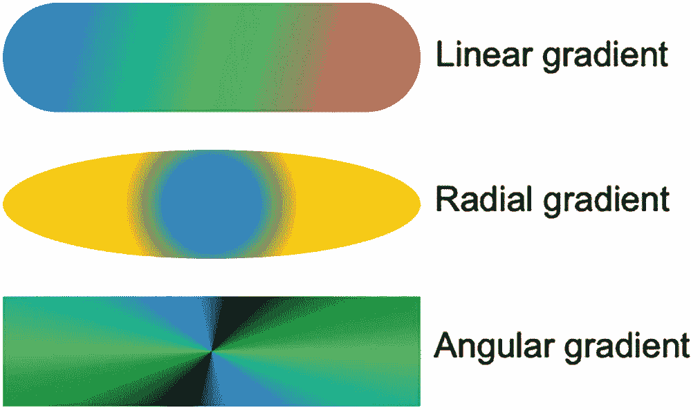

一组三张插图，分别展示了胶囊形状、椭圆形状和矩形形状上的线性渐变、径向渐变和角度渐变。

图 5-6  
可用的三种渐变类型

- 线性渐变
- 径向渐变
- 角度渐变

线性渐变需要定义两种或多种颜色，以及一个起点和一个终点。颜色存储在中括号内，起点和终点可以定义如图 5-7 所示的以下位置之一：

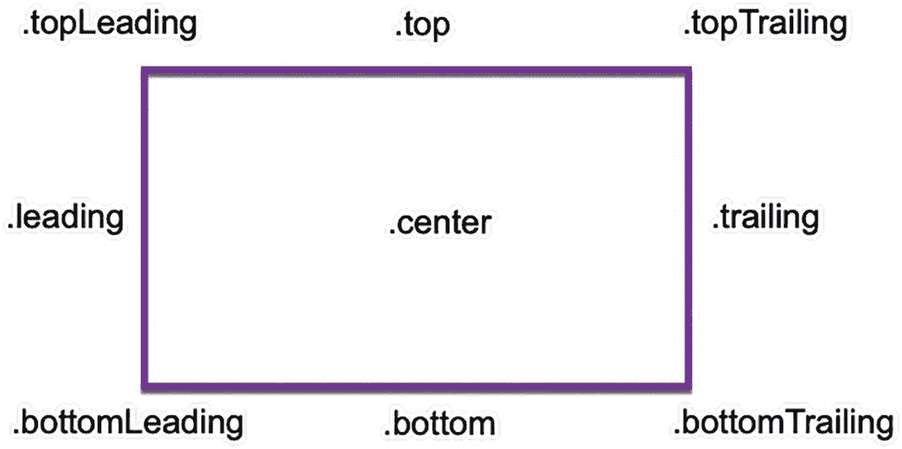

一张矩形颜色渐变边框的截图，上面带有 `dot top leading`、`dot top`、`dot top trailing`、`dot trailing`、`dot bottom trailing`、`dot bottom`、`dot bottom leading`、`dot leading` 和 `dot center` 等命令。

图 5-7  
线性渐变不同起点/终点的位置

- `bottom`
- `bottomLeading`
- `bottomTrailing`
- `center`
- `leading`
- `top`
- `topLeading`
- `topTrailing`
- `trailing`

要创建线性渐变，只需定义两种或多种颜色，以及起点和终点，如下所示：

```
Capsule()
.fill(LinearGradient(gradient: Gradient(colors: [.blue, .green, .pink]), startPoint: .topLeading, endPoint: .bottomTrailing))
```

径向渐变会在由 `center` 参数（例如 `.center` 或 `.top`）指定的特定位置绘制一个圆形颜色。如果你选择 `.top` 这样的值，那么渐变中心将从形状的顶部中心开始，如图 5-8 所示：

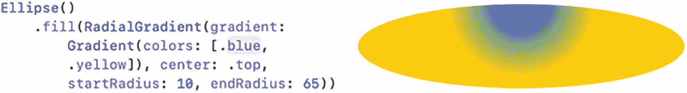

一组针对椭圆、填充、径向渐变、渐变、颜色、中心、起始半径和结束半径的命令，并附有对应的椭圆颜色渐变插图。

图 5-8  
`center` 参数定义了径向渐变中心开始的位置

第一种颜色的大小由 `startRadius` 定义。`startRadius` 值越小，第一种颜色的半径就越小。与 `startRadius` 值相比，`endRadius` 值越大，颜色混合得越扩散。与 `startRadius` 相比，`endRadius` 值越小，颜色之间的边界就越清晰，如图 5-9 所示：

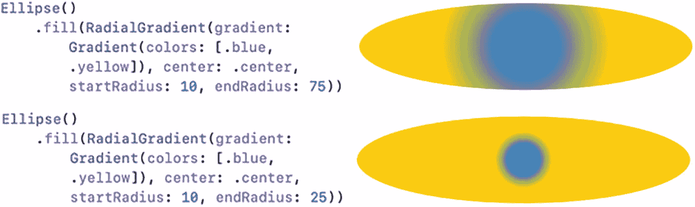

一组针对椭圆、填充、径向渐变、渐变、颜色、中心、起始半径和结束半径的两条命令，并附有对应的椭圆颜色渐变插图。

图 5-9  
比较径向渐变中的 `startRadius` 和 `endRadius` 值

要创建径向渐变，需定义两种或多种颜色、渐变中心出现的位置（例如 `.center` 或 `.topLeading`），以及 `startRadius` 和 `endRadius`，如下所示：

```
Ellipse()
.fill(RadialGradient(gradient: Gradient(colors: [.blue, .yellow]), center: .top, startRadius: 10, endRadius: 65))
```

虽然线性渐变和径向渐变使用两种颜色就能很好地工作，但角度渐变在使用更多颜色时效果最佳。如果你只为角度渐变定义两种颜色，SwiftUI 会将这两种颜色并排显示，然后它们会逐渐融合，如图 5-10 所示：

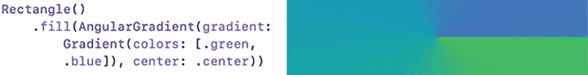

一组针对矩形、填充、角度渐变、渐变、颜色和中心的命令，并附有对应的矩形颜色渐变插图。

图 5-10  
仅显示两种不同颜色的角度渐变

在角度渐变中，你定义的颜色越多，它们就越能相互融合。除了定义多种颜色之外，你只需定义角度渐变的中心，例如 `.center` 或 `.bottomTrailing`。要创建角度渐变，需定义多种颜色或多次重复相同的颜色（如图 5-11 所示），以及 `center` 参数，例如：

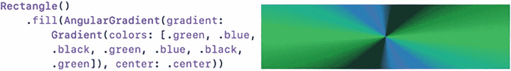

一组针对矩形、填充、角度渐变、渐变、颜色和中心的命令，并附有对应的矩形颜色渐变插图。

图 5-11  
多次显示相同颜色的角度渐变

```
Rectangle()
.fill(AngularGradient(gradient: Gradient(colors: [.green, .blue, .black, .green, .blue, .black, .green]), center: .center))
```


## 显示图片

就像 `Text` 视图允许你在用户界面上显示文本一样，`Image` 视图允许你在用户界面上显示图标和图形文件。如果你想显示存储在 SF Symbols 应用中的图标，可以使用如下 Swift 代码：

```
Image(systemName: "hare.fill")
```

当你想要显示一个 SF Symbol 图标时，必须使用 `systemName` 参数。由于图标通常很小，你可能希望放大它们。最简单的放大图标方法是定义一个更大的字体，例如`.largeTitle` 或 `.custom`，如图 5-12 所示。

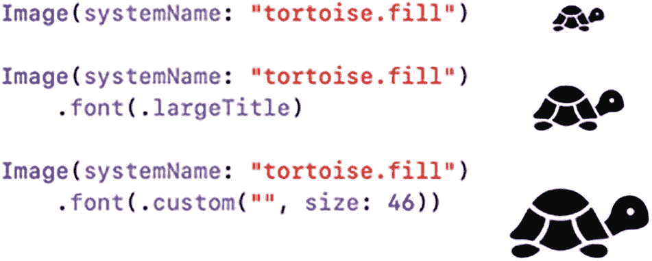

一组由 3 个命令（image、system name、font、large title、custom、size）和 3 个不同大小的乌龟图标构成的集合。

图 5-12

通过改变字体大小来修改 SF Symbol 图标的大小

要显示一张图片，首先需要将其拖放到 Assets 文件夹中。然后，要显示存储在 Assets 文件夹中的图片，你可以使用 `Image` 视图并像这样指定图片名称：

```
Image("flag")
```

图片可以是任意尺寸，但如果它们太大或太小，`Image` 视图会以其原始尺寸显示。由于你可能需要调整图片大小以适配用户界面，你需要在 `Image` 视图上使用以下三个修饰符：

- `.resizable()`
- `.aspectRatio(contentMode: z)`
- `.frame(width: x, height: y)`

`.resizable()` 修饰符允许 `Image` 视图改变所显示图片的大小。如果 `Image` 视图缺少这个 `.resizable()` 修饰符，那么无论 `Image` 视图的尺寸如何，图片都会保持其原始大小。

`.frame(width: x, height: y)` 修饰符允许你定义 `Image` 视图的尺寸。与 `.resizable()` 修饰符一起使用时，`.frame` 修饰符可以让你定义图片固定的宽度和高度。

由于拉伸 `Image` 视图的宽度和高度可能会扭曲其内部显示的图片，`.aspectRatio` 修饰符允许你定义图片应如何响应。`.fill` 选项将图片扩展至 `.frame` 修饰符定义的较大宽度或高度。`.fit` 选项将图片缩小至 `.frame` 修饰符定义的较小宽度或高度，如图 5-13 所示。

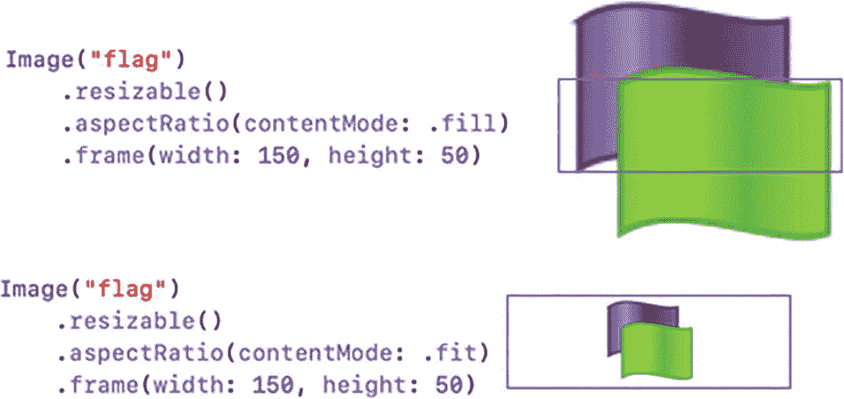

一组由 2 个命令（image、resizable、aspect ratio、content mode、fill、fit、frame width、height）及其各自的 2 个不同尺寸的旗帜图标（在一个边框内外）构成的集合。

图 5-13

在图片上使用 `.fill` 和 `.fit` 宽高比

如果你想进一步调整宽高比，可以包含一个宽高比值，例如：

```
Image("flag")
.resizable()
.frame(width: 150, height: 150)
.aspectRatio(0.5, contentMode: .fill)
```

这个宽高比定义了宽度与高度的比例，因此值 `0.5` 表示宽度与高度之比为 1:2，而值 `0.75` 则表示宽度与高度之比为 3:4。

除了使用 `.aspectRatio` 修饰符并定义 `.fill` 或 `.fit` 的 `contentMode`，Swift 还提供了另外两种选择：

- `.scaleToFill()`
- `.scaleToFit()`

只需像这样用 `.scaleToFit` 或 `.scaleToFill` 修饰符替换 `.aspectRatio` 修饰符：

```
Image("flag")
.resizable()
.frame(width: 150, height: 150)
.scaleToFill()
```

### 裁剪图片

`Image` 视图可以显示别人绘制的剪贴画图片，也可以显示用数码相机拍摄的照片。通常，`Image` 视图会在 `.frame` 修饰符定义的矩形内显示任何图片。然而，为了创造更独特的视觉效果，你可以通过使用 `.clipShape` 修饰符，用几何形状覆盖来裁剪图片。

`.clipShape` 修饰符接受任何常见的几何形状，例如：

```
.clipShape(Circle())
```

当使用其他几何形状（如 `Ellipse()` 或 `Capsule()`）时，请确保框架宽度足够宽。如果框架的宽度和高度相同，那么 `Ellipse()` 和 `Capsule()` 形状看起来就像 `Circle()` 一样。图 5-14 展示了 `.clipShape(Circle())` 修饰符如何改变通常显示为矩形图片的外观。

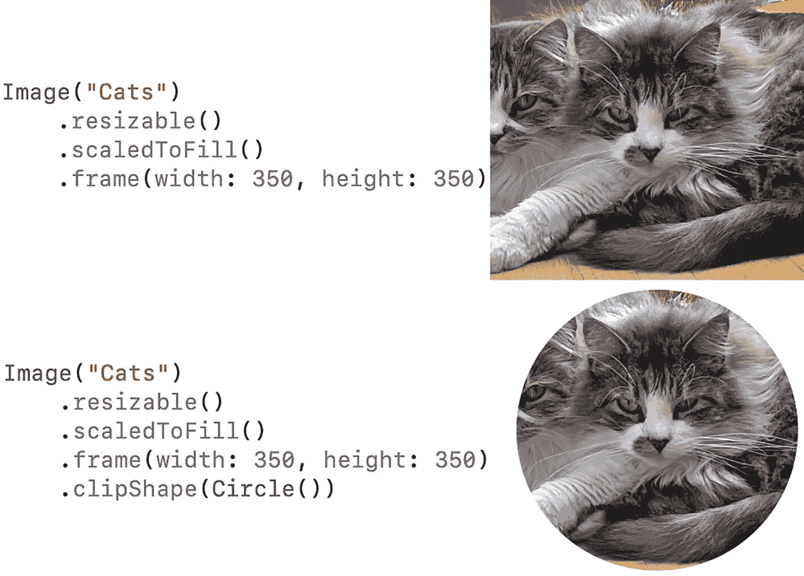

一组由 2 个命令（image、resizable、scaled to fill、frame width、height、clip shape）及其各自的 2 张猫的照片（矩形和圆形）构成的集合。

图 5-14

使用 `.clipShape()` 修饰符

### 为图片添加阴影

突出显示 `Image` 视图外观的另一种方法是使用 `.shadow` 修饰符，它会在视图周围添加阴影。你可以通过定义其半径来调整阴影在视图周围出现的程度，例如：

```
.shadow(color: .red, radius: 46, x: 0, y: 0)
```

`.shadow` 修饰符需要以下参数：

- **Color** – 定义阴影的颜色。
- **Radius** – 定义阴影在视图周围的大小。
- **X** – 定义阴影的 x（水平）偏移量。值为 `0` 时，阴影在水平方向上围绕视图居中。
- **Y** – 定义阴影的 y（垂直）偏移量。值为 `0` 时，阴影在垂直方向上围绕视图居中。

如果 `x` 和 `y` 的值非零，则阴影会偏离 `Image` 视图。如果 `x` 和 `y` 的值都为 `0`，则阴影会均匀地出现在 `Image` 视图的所有四个边缘周围，如图 5-15 所示。

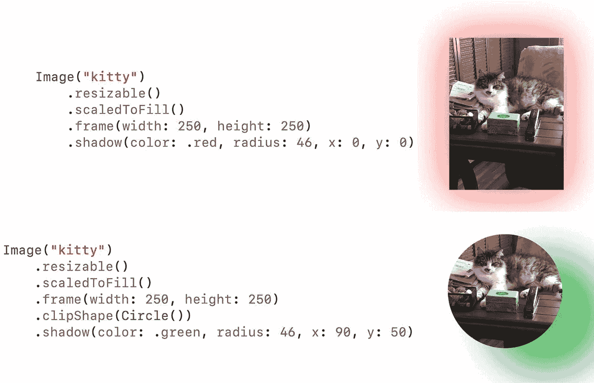

一组由 2 个命令（image、resizable、scaled to fill、frame width、height、clip shape、shadow、radius）及其各自的 2 张猫在桌子上的照片（矩形和圆形，带有渐变色阴影）构成的集合。

图 5-15

使用不同的 `x` 和 `y` 值向 `Image` 视图添加阴影

### 为图片添加边框

为了进一步突出 `Image` 视图，你可以使用 `.overlay` 修饰符在其周围添加边框，如下所示：

```
.overlay(Rectangle().stroke(Color.blue, lineWidth: 10))
```

`.overlay` 修饰符需要以下参数：

- **Shape** – 定义边框的形状以匹配 `Image` 视图的形状
- **Color** – 定义边框的颜色
- **lineWidth** – 定义 `Image` 视图周围边框线的粗细

图 5-16 展示了 `.overlay` 修饰符的两种用法，它们使用了不同的形状、颜色和线条宽度。

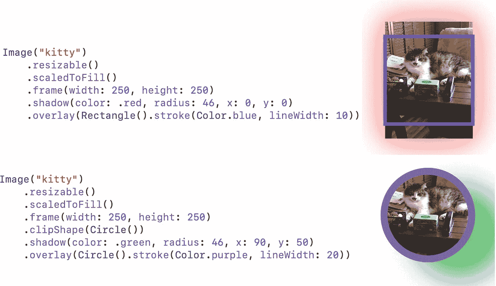

一组由 2 个命令（image、resizable、scaled to fill、frame width、height、clip shape、shadow、radius、overlay、stroke、line width）及其各自的 2 张猫在桌子上的照片（矩形和圆形，带有渐变色边框和阴影）构成的集合。

图 5-16

为 `.overlay` 修饰符使用不同的值


好的，作为一名高级文档工程师和翻译员，我将严格按照您提供的格式和注意事项，将给定的英文文本翻译成中文。


### 定义图像的不透明度

另一种修改图像外观的方法是通过定义其不透明度。不透明度为 `0` 意味着图像完全不可见。不透明度为 `1` 意味着图像没有任何改变。不透明度越接近 `0`，图像越淡。不透明度越接近 `1`，图像越清晰。

要使用 `opacity` 修饰符，只需定义一个从 `0` 到 `1` 的不透明度值，如下所示：

```
.opacity(0.75)
```

图 5-17 展示了不同的不透明度值如何修改图像的外观。

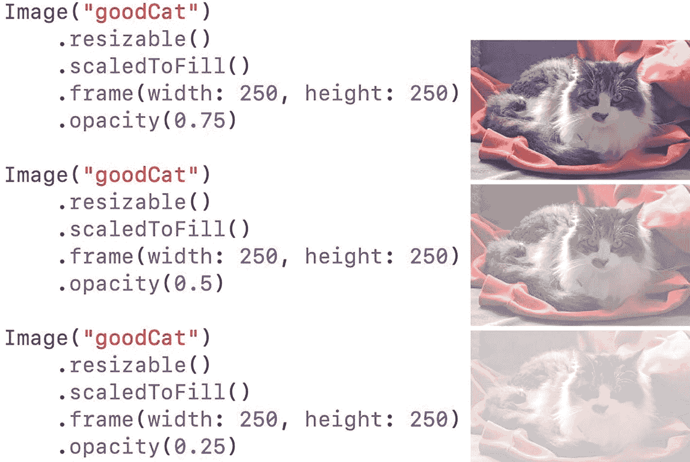

一组共 3 条命令，分别针对图像、可调整大小、缩放填充、框架宽高和不透明度值，以及相应的坐在布上的猫的照片。

**图 5-17.** 对 `.opacity` 修饰符使用不同的值

通过改变不同视图的不透明度，你可以将它们堆叠在 `ZStack` 中，从而创造出有趣的视觉效果，如图 5-18 所示。

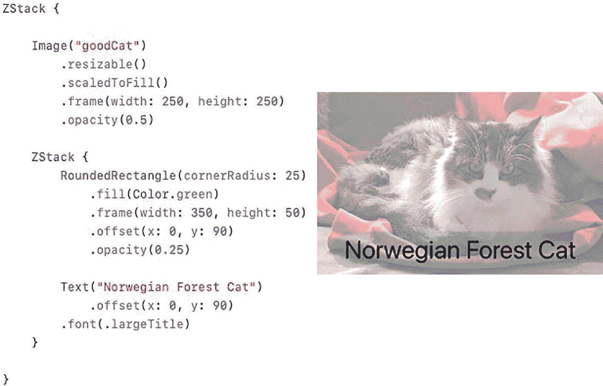

一组命令，包括 `ZStack`、图像、可调整大小、缩放填充、框架宽高、不透明度、圆角矩形、圆角半径、填充、颜色、偏移、文本和字体，以及一张不透明的坐在布上的猫的照片和“挪威森林猫”文本。

**图 5-18.** `.opacity` 修饰符与 `ZStack` 结合可以创造视觉效果

## 总结

图像是在用户界面上提供信息的另一种方式。图像可以是常见的几何形状（如圆形、椭圆和圆角矩形）、可以在 SF Symbols 应用中找到的图标、图形图像，或者是你拖放到 Xcode 项目 Assets 文件夹中的数码照片。

如果你正在创建几何形状，你可以使用纯色、自定义颜色或渐变色填充它们，以创建多种颜色的有趣视觉混合。如果你使用的是 SF Symbol 图标，你可以使用 `.font` 修饰符调整它们的大小。如果你使用的是存储在 Xcode 项目 Assets 文件夹中的图像，你可以使用 `.resizable`、`.frame` 和 `.aspectRatio`/`.scaleToFit`/`.scaleToFill` 修饰符来定义图像的大小和外观。

为了创建额外的视觉效果，你可以将图像裁剪成几何形状（如圆形）、在图像周围添加边框和阴影，以及修改不透明度。有了这么多调整图像外观的方法，你应该能够按照自己的意愿，精确地定义图像在用户界面上的显示效果。

