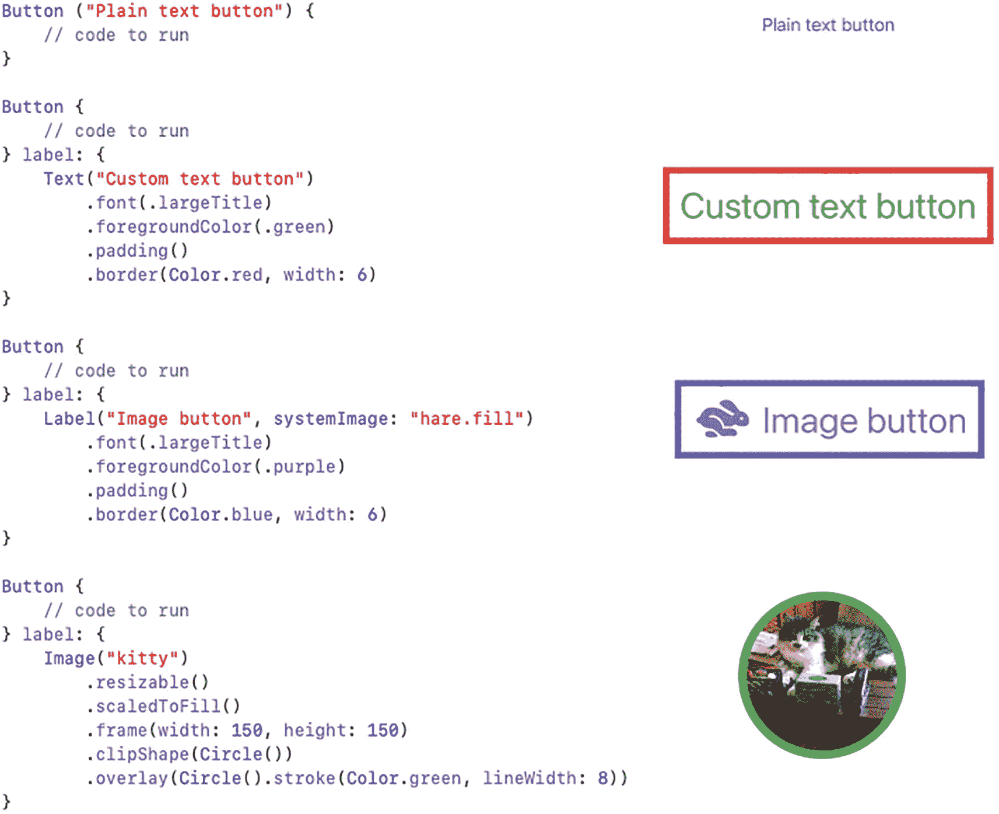
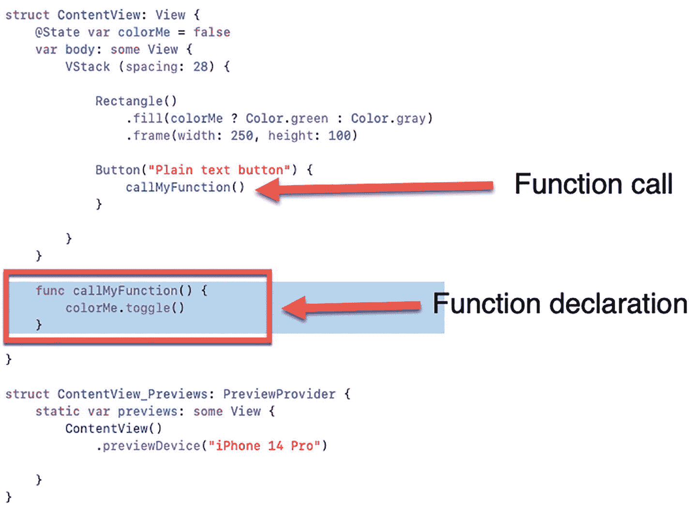
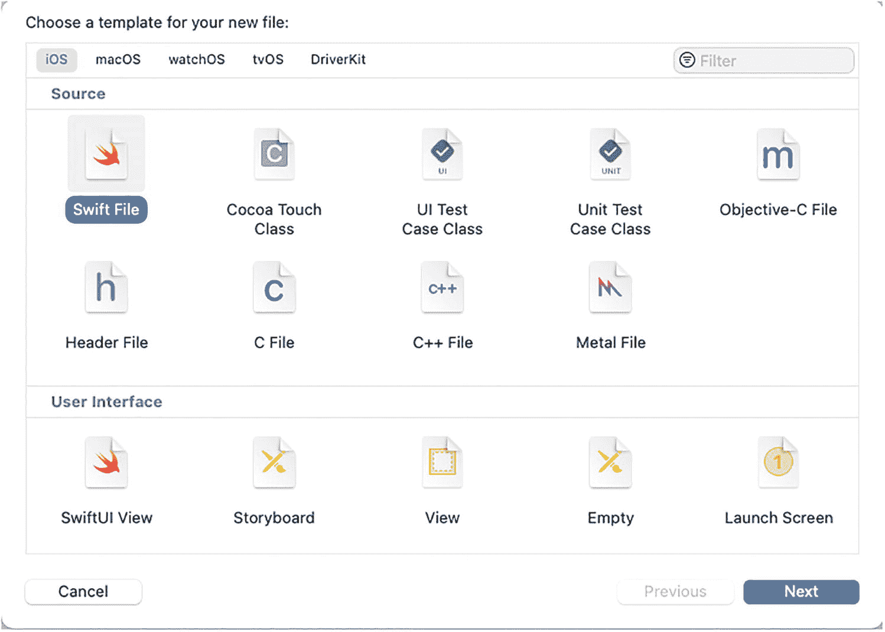
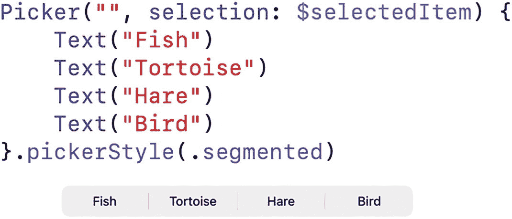
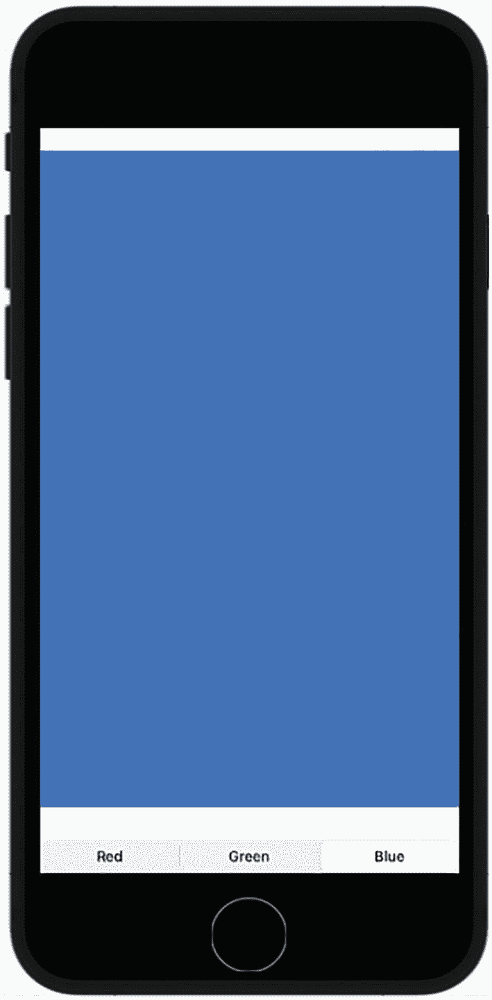
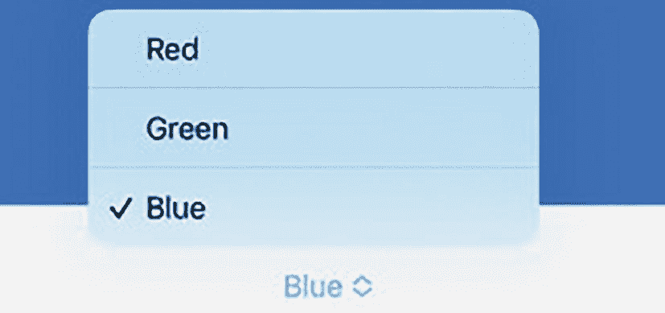
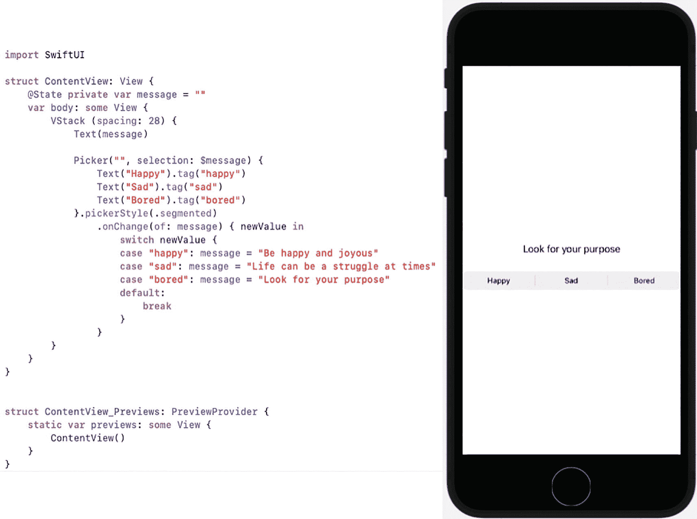

# 6. 使用按钮和分段控件响应用户

每个用户界面都需要向用户显示信息，无论是文本还是图像。然而，用户界面的另一个特性是接受用户的命令。通过用户界面接受命令的最简单方式是通过按钮实现。

按钮代表一个单一的命令，可以像确认（如“确定”或“取消”）一样简单。要创建一个按钮，你需要定义：

-   按钮上显示文本的标题
-   用户点击按钮时运行的 Swift 代码

SwiftUI 为你提供了两种创建按钮的方法。最简单的方法只需定义标题中要显示的文本，后跟用户选择按钮时要运行的 Swift 代码，如下所示：

```
Button("点击此处") {
    // 要运行的代码
}
```

创建按钮的第二种方法为你提供了更大的灵活性，可以修改按钮上文本的外观，例如：

```
Button {
    // 要运行的代码
} label: {
    Text("点击此处")
        .font(.largeTitle)
        .foregroundColor(.green)
        .padding()
        .border(Color.red, width: 6)
}
```

第二种方法使用 `Text` 视图来定义标题上显示的文本。然后，它使用 `.font` 修饰符定义字体大小，使用 `.foregroundColor` 修饰符将文本显示为绿色，使用 `.padding` 修饰符在 `Text` 视图周围添加间距，并使用 `.border` 修饰符为 `Text` 视图添加一个宽度为 6 点的红色边框。

除了使用 `Text` 视图来定义按钮的标题，你还可以使用 `Label` 视图同时显示文本和图标，如下所示：

```
Button {
    // 要运行的代码
} label: {
    Label("图片按钮", systemImage: "hare.fill")
        .font(.largeTitle)
        .foregroundColor(.purple)
        .padding()
        .border(Color.blue, width: 6)
}
```

这个 `Label` 视图定义了要显示的文本和图标，然后使用 `.font` 修饰符定义文本和图标的大小。它使用 `.foregroundColor` 修饰符将文本和图标显示为紫色，使用 `.padding` 修饰符在 `Label` 视图周围添加间距，并使用 `.border` 修饰符在 `Label` 视图周围显示一个宽度为 6 点的蓝色边框。

你也可以使用 `Image` 视图来使图像像按钮一样显示，如下所示：

```
Button {
    // 要运行的代码
} label: {
    Image("browncat")
        .resizable()
        .frame(width: 150, height: 150)
        .clipShape(Circle())
        .overlay(Circle().stroke(Color.yellow, lineWidth: 4))
}
```

这个 `Image` 视图使用了存储在 Assets 文件夹中的图像（名为 `"browncat"`），然后使用 `.frame` 修饰符将图像压缩成一个宽高均为 150 的正方形。接着，它使用 `.clipShape` 修饰符将图像显示在一个圆形内，然后使用 `.overlay` 修饰符显示一个线宽为 4 的黄色边框。

通过使用第二种方法来定义按钮的标题，你可以看到如何对按钮标题的外观拥有更多控制，特别是与使用纯文本定义按钮的简单方法相比，如图 6-1 所示。



左侧是一段代码片段，右侧是相应的输出。代码用于定义 3 个不同的按钮：1. 纯文本按钮、2. 自定义文本按钮、3. 带有兔子的图片按钮、4. 一个带有深色阴影轮廓的圆形小猫图像。

**图 6-1.** 使用 `Text` 视图、`Label` 视图或 `Image` 视图定义按钮的标题


## 在按钮中运行代码

你可以在按钮中存储任意代码，以便在用户点击时执行。按钮内常见的一种代码类型是用于改变状态的代码。在 SwiftUI 中，你可以像这样将特殊变量声明为 `State`（状态）变量：

```
@State var colorMe = false
```

当你将更新后的数据存储到普通变量中时，程序中任何使用该变量的其他部分都无法获知数据已更新。要确保程序的所有部分都能接收到变量中存储的更新数据，过程可能既繁琐又容易出错。正因如此，SwiftUI 提供了 `State` 变量来解决这个问题。

当你更改 `State` 变量的值时，任何使用该 `State` 变量的部分都会自动获取该变量中存储的最新数据，无需编写任何额外代码。当一个变量持有一个值时，它处于一种状态；当同一个变量持有另一个不同的值时，则处于另一种状态。SwiftUI 的 `State` 变量只是自动化了确保程序所有部分都能知晓变量值或状态变化的过程。

前面的示例通过使用 `@State` 关键字创建了一个 `State` 变量，后跟一个变量声明（`var`），该声明定义了变量的名称（`colorMe`）、数据类型（推断为布尔类型）和初始值（`false`）。

在使用表示布尔数据类型的 `State` 变量时，一个常用的命令是 `.toggle()` 命令，它可以将布尔变量从 `true` 变为 `false`（或从 `false` 变为 `true`），例如：

```
colorMe.toggle()
```

如果 `colorMe` 这个 `State` 变量的值是 `true`，那么 `.toggle()` 命令会将其值改为 `false`。如果 `colorMe` 这个 `State` 变量的值是 `false`，那么 `.toggle()` 命令会将其值改为 `true`。

布尔类型的 `State` 变量常用于进行 if-else 判断。通常情况下，修饰符只包含单个值，例如：

```
.fill(Color.green)
```

然而，如果在修饰符中嵌入一个 if-else 三元运算符，你可以将传统的 if-else 语句压缩成一行，像这样：

```
.fill(colorMe ? Color.green : Color.gray)
```

上述 Swift 代码会检查 `colorMe` 变量的布尔值。如果为 `true`，则使用绿色；否则，使用灰色。

现在，让我们看看如何将 `State` 变量、`.toggle()` 命令和 if-else 三元运算符结合起来，使按钮能够响应用户操作。

1.  创建一个新的 SwiftUI iOS App 项目，并为其指定任意名称，例如 `Buttons`。

2.  在导航器面板中点击 `ContentView` 文件。

3.  在 `struct ContentView: View` 这行代码下方添加一个 `State` 变量，如下所示：

    ```
    struct ContentView: View {
    @State var colorMe = false
    var body: some View {
    ```

    这定义了一个名为 `colorMe`（具体名称可任意）的 `State` 变量，将其初始值设为 `false`，并声明它仅能容纳布尔数据类型。

4.  在 `var body: some View` 内部创建一个间距值为 28 的 `VStack`，如下所示：

    ```
    struct ContentView: View {
    @State var colorMe = false
    var body: some View {
    VStack (spacing: 28) {
    }
    }
    }
    ```

    间距 28 会将 `VStack` 内的所有视图分隔开，使它们不显得拥挤。

5.  在 `VStack` 内输入以下代码：

    ```
    Rectangle()
    .fill(colorMe ? Color.green : Color.gray)
    .frame(width: 250, height: 100)
    ```

    这会创建一个矩形，其中 `.frame` 修饰符将其宽度定义为 250，高度定义为 100。请注意，`.fill` 修饰符使用了 `colorMe` 这个布尔型 `State` 变量来决定显示哪种颜色。如果 `colorMe` 是 `true`，矩形显示为绿色；如果 `colorMe` 是 `false`，矩形显示为灰色。

6.  在 `VStack` 内的 `Rectangle()` 下方输入以下代码以创建一个纯文本按钮：

    ```
    Button("Plain text button") {
    colorMe.toggle()
    }
    ```

    这定义了一个显示纯文本的按钮。每次用户点击此 `Button` 时，它都会使用 `.toggle()` 命令将 `colorMe` 的值从 `true` 变为 `false`（或从 `false` 变为 `true`）。

7.  在 `VStack` 内的 `Button` 下方输入以下代码，以创建一个使用自定义 `Text` 视图显示标题的按钮：

    ```
    Button {
    colorMe.toggle()
    } label: {
    Text("Custom text button")
    .font(.largeTitle)
    .foregroundColor(.green)
    .padding()
    .border(Color.red, width: 6)
    }
    ```

    这定义了一个同样使用 `.toggle()` 命令来改变 `colorMe` 变量布尔值的按钮。不过，它使用 `Text` 视图来显示按钮标题。`.font` 修饰符更改了 `Text` 视图的字号，`.foregroundColor` 修饰符将文本显示为绿色，`.padding` 修饰符在 `Text` 视图周围添加了间距，`.border` 修饰符在 `Text` 视图周围显示了一个宽度为 6 的红色边框。

8.  在 `VStack` 内的上一个 `Button` 下方输入以下代码，以使用 `Label` 视图定义按钮标题：

    ```
    Button {
    colorMe.toggle()
    } label: {
    Label("Image button", systemImage: "hare.fill")
    .font(.largeTitle)
    .foregroundColor(.purple)
    .padding()
    .border(Color.blue, width: 6)
    }
    ```

    这定义了一个使用 `.toggle()` 命令来改变 `colorMe` 变量布尔值的按钮。但它使用了 `Label` 视图来显示文本（"Image button"）以及一个名为 `hare.fill` 的图标。然后，它使用 `.font` 修饰符放大文本和图标，使用 `.foregroundColor` 修饰符将文本和图标显示为紫色。最后，它使用 `.padding` 修饰符在 `Label` 视图周围添加间距，并在 `Label` 视图周围放置了一个宽度为 6 的蓝色边框。

9.  在 `VStack` 内的上一个 `Button` 下方输入以下代码，以使用 `Image` 视图定义按钮标题：

    ```
    Button {
    colorMe.toggle()
    } label: {
    Image("browncat")
    .resizable()
    .frame(width: 150, height: 150)
    .clipShape(Circle())
    .overlay(Circle().stroke(Color.yellow, lineWidth: 4))
    }
    ```

    这定义了一个使用 `.toggle()` 命令来改变 `colorMe` 变量布尔值的按钮。`Image` 视图假设存在一张名为 `browncat` 的图片，它已存储在 Xcode 项目的 `Assets` 文件夹中。然后，它使用 `.resizable` 和 `.frame` 修饰符将图片大小调整为一个宽度和高度均为 150 的方块。最后，它使用 `.clipShape` 修饰符将图片裁剪成圆形，并使用 `.overlay` 修饰符在图片周围放置一个线宽为 4 的黄色圆形边框。

完整的 SwiftUI 代码应如下所示：

```
import SwiftUI
struct ContentView: View {
@State var colorMe = false
var body: some View {
VStack (spacing: 28) {
Rectangle()
.fill(colorMe ? Color.green : Color.gray)
.frame(width: 250, height: 100)
Button("Plain text button") {
colorMe.toggle()
}
Button {
colorMe.toggle()
} label: {
Text("Custom text button")
.font(.largeTitle)
.foregroundColor(.green)
.padding()
.border(Color.red, width: 6)
}
Button {
colorMe.toggle()
} label: {
Label("Image button", systemImage: "hare.fill")
.font(.largeTitle)
.foregroundColor(.purple)
.padding()
.border(Color.blue, width: 6)
}
Button {
colorMe.toggle()
} label: {
Image("browncat")
.resizable()
.frame(width: 150, height: 150)
.clipShape(Circle())
.overlay(Circle().stroke(Color.yellow, lineWidth: 4))
}
}
}
}
struct ContentView_Previews: PreviewProvider {
static var previews: some View {
ContentView()
}
}
```

10. 在画布面板中点击“Live”图标。

11. 点击任意按钮。注意，每次点击按钮时，它都会切换 `colorMe` 这个布尔变量，使得矩形在绿色和灰色之间交替显示。


### 在用户界面视图中存储要运行的代码

当您创建一个与用户交互的按钮或类似类型的用户界面视图时，需要编写 Swift 代码来让该用户界面视图做出响应。最简单的方法是直接在定义用户界面的同一文件中编写代码，例如：

```
Button("Plain text button") {
colorMe.toggle()
}
```

当代码只有几行时，这种方式没问题。然而，如果需要存储数十行代码来定义用户界面视图如何响应用户，这可能会使整个 `.swift` 文件变得难以理解。这样的文件将同时包含设计用户界面和响应用户操作的 Swift 代码。

与其将多行代码塞入定义用户界面的代码中，不如将代码存储在一个单独的函数中。这样，用户界面代码只需调用一行代码，如下所示：

```
Button("Click Me") {
callMyFunction()
}
```

这种方法有助于将执行操作的 Swift 代码与定义用户界面的 Swift 代码分离开来。存储函数的一个位置是在包含定义用户界面的 Swift 代码的同一文件中，例如在定义用户界面的结构体底部附近，如图 6-2 所示。



该代码片段定义了一个 Swift UI 内容视图结构体，包含一个 `colorMe` 状态变量和一个 `body` 属性，该属性包含一个 `Rectangle` 和一个用于切换 `colorMe` 值的 `Plain` 文本按钮。它还包含一个单独的 `callMyFunction` 函数和一个用于在 iPhone 14 Pro 设备上预览视图的 `ContentView_Previews` 结构体。

**图 6-2** 函数可以出现在定义用户界面的同一结构体内部

将函数存储在包含定义用户界面 Swift 代码的同一文件中，可以将所有内容集中在一个地方。然而，如果函数包含大量代码，这种方法可能仍然会显得杂乱，因为文件中同时包含了定义用户界面的代码和使界面具有响应性的代码。

更好的解决方案是将函数存储在一个完全独立的文件中。这样，一个文件包含用于定义用户界面的 Swift 代码，另一个文件包含执行特定任务的 Swift 代码（存储在函数中）。要了解如何将函数存储在单独的文件中，请按照以下步骤操作：

1. 创建一个新的 iOS App 项目，确保界面是 SwiftUI，并为其起一个描述性的名称，例如 `CodeFile`。
2. 创建一个名为 `randomNumber` 的 `State` 变量，如下所示：

```
@State var randomNumber = 0
```

3. 在 `VStack` 内部创建一个 `Text` 视图和一个 `Button`，如下所示：

```
VStack (spacing: 28) {
    Text("Random number = \(randomNumber)")
    Button("Roll dice") {
        randomNumber = rollDice()
    }
}
```

请注意，`Button` 调用了一个名为 `rollDice()` 的函数。整个 `ContentView` 文件应如下所示：

```
import SwiftUI
struct ContentView: View {
    @State var randomNumber = 0
    var body: some View {
        VStack (spacing: 28) {
            Text("Random number = \(randomNumber)")
            Button("Roll dice") {
                randomNumber = rollDice()
            }
        }
    }
}
struct ContentView_Previews: PreviewProvider {
    static var previews: some View {
        ContentView()
    }
}
```

4. 选择 `File` ➤ `New` ➤ `File`。出现一个窗口，如图 6-3 所示。



屏幕显示了用于创建新文件的模板选择，包括 `macOS`、`watchOS`、`tvOS`、`DriverKit`、`Filter`、`Source`、`Swift File`、`Cocoa Touch Class`、`C`、`UI Test Case Class`、`C++`、`Unit Test Case Class`、`h`、`Header File`、`C File`、`C++ File`、`m`、`Objective-C File`、`UI`、`UNIT`、`Metal File`、`User Interface`、`SwiftUI View`、`Storyboard`、`View`、`Empty`、`Launch Screen`、`Cancel`、`Previous` 和 `Next` 等选项。

5. 点击 iOS 标签，然后点击 `Swift File`。
6. 点击 `Next` 按钮。出现一个窗口，要求您为文件选择名称。
7. 输入一个描述性的名称，例如 `StoreFunctions`，然后点击 `Create` 按钮。Xcode 会在导航窗格中创建一个新的 `.swift` 文件。
8. 点击新创建的 `.swift` 文件。新创建的 `.swift` 文件中唯一的代码如下：

```
import Foundation
```

`Foundation` 框架为在 Apple 的所有操作系统（包括 iOS、macOS、watchOS 和 tvOS）中创建应用程序提供了基本功能。

9. 在 `import Foundation` 行下方输入以下内容：

```
func rollDice() -> Int {
    let firstDie = Int.random(in: 1...6)
    let secondDie = Int.random(in: 1...6)
    return firstDie + secondDie
}
```

此函数模拟掷两个六面骰子并将结果相加。

10. 在导航窗格中点击 `ContentView` 文件。Xcode 会在画布窗格中显示用户界面。
11. 点击用户界面上的 `Roll dice` 按钮。每次点击此按钮时，`Text` 视图都会显示不同的随机数，这表明 `ContentView` 文件中对 `rollDice()` 函数的调用可以成功访问存储在另一个独立 `.swift` 文件中的 `rollDice()` 函数。

**注意：** 将函数存储在单独文件中的一个优点是，您可以轻松地将一个 `.swift` 文件从一个项目复制并粘贴到另一个项目中。这使得在项目之间重用代码变得容易。


## 使用分段控件

按钮代表单个命令，因此如果你想让用户在多个命令之间做出选择，就需要使用多个按钮。不幸的是，在用户界面上塞入多个按钮会很麻烦。为了解决这个问题，SwiftUI 提供了分段控件。

**注意**

尽管分段控件理论上可以显示大量选项，但显示的选项越多，分段控件看起来就越杂乱。一般来说，如果分段控件包含的选项过多，可以考虑改用其他方式（如转盘或菜单选择器）来让用户进行选择，详见第 8 章。

分段控件的主要思想是在紧凑的空间内显示两个或更多选项，而不是使用多个按钮。要创建分段控件，你需要以下内容：

- 一个 `State` 变量，用于表示用户选择了哪个分段（选项）
- 一个列出了两个或更多选项的 `Picker` 视图
- 一个与每个选项关联的 `tag` 属性
- `SegmentedPickerStyle` 修饰符

要在分段控件上显示选项，最简单的方法是使用多个 `Text` 视图，如下所示：

```
Picker("", selection: $selectedItem) {
    Text("鱼")
    Text("龟")
    Text("兔")
    Text("鸟")
}.pickerStyle(.segmented)
```

这将创建一个分段控件，按顺序显示 `Text` 视图中的项目，因此最左侧的项目将是"鱼"，最右侧的项目将是"鸟"，如图 6-4 所示。



这一段代码定义了一个使用分段样式的 `Picker`，允许从鱼、龟、兔和鸟等选项中进行选择。

**图 6-4** 创建一个简单的分段控件

在 `Picker` 视图中放置多个 `Text` 视图可以定义显示的选项，但分段控件无法知道用户选择了哪个选项。如果你通过使用多个 `Text` 视图在 `Picker` 视图中定义选项，则需要在每个 `Text` 视图后添加一个 `.tag` 属性。

这个 `.tag` 属性提供了代表分段控件上每个项目的实际数据。`.tag` 属性可以是任何数据类型（如 `String` 或 `Int`），但每个 `.tag` 属性都应包含相同的数据类型。

要了解如何使用分段控件——通过 `Picker` 视图中的多个 `Text` 视图和 `.tag` 属性来显示选项——请按照以下步骤操作：



一个底部显示红、绿、蓝文本的移动屏幕。

**图 6-5** 分段控件的完整用户界面

1.  创建一个新的 SwiftUI iOS App 项目，并为其命名（例如 "SegmentedControl"）。

2.  在导航面板中点击 `ContentView` 文件。

3.  在 `struct ContentView: View` 这行代码下方添加一个 `State` 变量，如下所示：

    ```
    struct ContentView: View {
        @State private var selectedColor = Color.gray
        var body: some View {
    ```

    这将创建一个名为 `selectedColor` 的 `State` 变量。注意，`private` 关键字是可选的，它仅表示该变量只能在 `ContentView` 结构体内部使用。`selectedColor` 变量的初始值是 `Color.gray`，这意味着其推断的数据类型是 `Color`。

4.  在 `var body: some View` 内部创建一个间距为 28 的 `VStack`，如下所示：

    ```
    struct ContentView: View {
        @State private var selectedColor = Color.gray
        var body: some View {
            VStack (spacing: 28) {
            }
        }
    }
    ```

    间距值可以是任意你想要的数值，它会在你添加到 `VStack` 内部的任何视图之间增加间距，使它们在用户界面上不会显得拥挤。

5.  输入以下内容，在 `VStack` 内部创建一个彩色矩形：

    ```
    Rectangle()
        .fill(selectedColor)
    ```

    这将创建一个矩形，其颜色由 `selectedColor` 状态变量定义。初始状态下，该矩形填充为 `Color.gray`。


6.  在`VStack`内部键入以下代码，创建一个分段控件：

```
Picker("Favorite Color", selection: $selectedColor) {
    Text("Red").tag(Color.red)
    Text("Green").tag(Color.green)
    Text("Blue").tag(Color.blue)
}.pickerStyle(.segmented)
```

这段代码创建了一个`Picker`视图，在分段控件上列出了三个选项（"Red"、"Green"和"Blue"）。每个选项后面都有一个与之关联的`.tag`。虽然用户看到的是三个`Text`视图显示的选项（"Red"、"Green"和"Blue"），但`selectedColor`状态变量实际存储的是`.tag`值，即`Colors`（`.red`、`.green`和`.blue`）。`.pickerStyle`修饰符通过定义`.segmented`（而不是`.wheel`或`.menu`），将`Picker`视图显示为分段控件。

完整的 SwiftUI 代码应如下所示：

```
import SwiftUI
struct ContentView: View {
    @State private var selectedColor = Color.gray
    var body: some View {
        VStack (spacing: 28) {
            Rectangle()
                .fill(selectedColor)
            Picker("Favorite Color", selection: $selectedColor) {
                Text("Red").tag(Color.red)
                Text("Green").tag(Color.green)
                Text("Blue").tag(Color.blue)
            }.pickerStyle(.segmented)
        }
    }
}
struct ContentView_Previews: PreviewProvider {
    static var previews: some View {
        ContentView()
    }
}
```

7.  点击画布面板中的“Live”图标。

8.  点击分段控件上的“Red”、“Green”和“Blue”选项。每次从分段控件中选择不同的选项时，`selectedColor`状态变量都会发生变化。随后，该状态变量会自动更改矩形的颜色，如图 6-5 所示。

**注意**  
如果省略了`.pickerStyle(.segmented)`修饰符，`Picker`视图会以菜单形式显示三个选项（"Red"、"Green"和"Blue"），如图 6-6 所示。

  
屏幕显示红色、绿色和蓝色。其中蓝色选项被选中。  
**图 6-6** 未使用`.pickerStyle`修饰符时的`Picker`视图外观会显示为菜单

通过键入多个`Text`视图来填充分段控件是可行的，但重复的代码往往意味着代码可以简化。对于`Picker`视图，你可以使用数组和`ForEach`循环来替代多个`Text`视图，示例如下：

```
Picker("", selection: $selectedItem) {
    ForEach(animalArray, id: \.self) {
        Text($0)
    }
}.pickerStyle(.segmented)
```

这个`ForEach`循环指定了一个包含分段控件选项的数组（例如名为`animalArray`的数组），并使用`id`属性标识每个数组项，以便在单个`Text`视图中显示。该`Text`视图使用`$0`简写参数名来表示每个数组项。

除了减少定义分段控件选项时使用多个`Text`视图的需求外，`ForEach`循环还免去了为每个选项单独添加`.tag`属性的步骤。取而代之的是，数组项本身既代表分段控件上显示的选项，也代表用户所选的选择。

要了解如何使用`ForEach`循环填充`Picker`视图的分段控件，请按以下步骤操作：

1.  创建一个新的 SwiftUI iOS 应用项目，并为其任意命名，例如“SegmentedControlForEach”。

2.  在导航器面板中点击`ContentView`文件。

3.  在`struct ContentView: View`行下方添加一个状态变量，如下所示：

```
@State var selectedItem = ""
```

这将创建一个名为`selectedItem`的状态变量。`selectedItem`变量的初始值为空字符串，这意味着其推断的数据类型为`String`。

4.  在`var body: some View`内部创建一个`VStack`，如下所示：

```
struct ContentView: View {
    @State var selectedItem = ""
    let animalArray = ["Fish", "Tortoise", "Hare", "Bird"]
    var body: some View {
        VStack {
        }
    }
}
```

5.  在`VStack`内部键入以下代码，创建一个`Picker`视图和一个`Text`视图：

```
VStack {
    Picker("", selection: $selectedItem) {
        ForEach(animalArray, id: \.self) {
            Text($0)
        }
    }.pickerStyle(.segmented)
    Text(selectedItem)
}
```

这段代码使用`ForEach`循环来填充由`Picker`视图创建的分段控件。`Text`视图显示用户所选的内容。

完整的 SwiftUI 代码应如下所示：

```
import SwiftUI
struct ContentView: View {
    @State var selectedItem = ""
    let animalArray = ["Fish", "Tortoise", "Hare", "Bird"]
    var body: some View {
        VStack {
            Picker("", selection: $selectedItem) {
                ForEach(animalArray, id: \.self) {
                    Text($0)
                }
            }.pickerStyle(.segmented)
            Text(selectedItem)
        }
    }
}
struct ContentView_Previews: PreviewProvider {
    static var previews: some View {
        ContentView()
    }
}
```

6.  点击画布面板中的“Live”图标。

7.  点击分段控件上的“Fish”、“Tortoise”、“Hare”和“Bird”选项。每次从分段控件中选择不同的选项时，`selectedItem`状态变量都会发生变化。随后，该状态变量会自动更改`Text`视图中显示的内容。


### 从分段控件中运行代码

仅通过选择分段控件上的选项，分段控件只能更改一个 `State` 变量。如果你想根据用户在分段控件上选择的选项来运行代码，需要添加一个 `.onChange` 修饰符，如下所示：

```
.onChange(of: stateVariable) { newValue in
// code to run
}
```

每当用户在分段控件上选择不同的选项时，它就会更改一个 `State` 变量。`.onChange` 修饰符会在 `State` 变量每次发生变化时运行代码。`newValue` 变量包含了这个最新的变化，然后可以据此运行代码。要了解其工作原理，请遵循以下步骤：

1.  新建一个 SwiftUI iOS 应用项目，并命名为任意你喜欢的名称，例如“SegmentedControl Code”。
2.  在导航窗格中单击 `ContentView` 文件。
3.  在 `struct ContentView: View` 这行下方添加一个 `State` 变量，如下所示：

```
struct ContentView: View {
@State private var message = ""
var body: some View {
```

这会创建一个名为 `message` 的 `State` 变量。注意，`private` 关键字是可选的，它仅表示此变量只能在 `ContentView` 结构体内部使用。其初始值是一个空字符串，因此它的数据类型被推断为 `String`。

4.  在 `var body: some View` 内部创建一个间距值为 28 的 `VStack`，如下所示：

```
struct ContentView: View {
@State private var message = ""
var body: some View {
VStack (spacing: 28) {
}
}
}
```

间距值可以是任何你想要的数字，但它在添加到 `VStack` 内部的任何视图之间增加间距，以免它们在用户界面上显得拥挤。

5.  在 `VStack` 内输入以下内容来创建一个 `Text` 视图：

```
Text(message)
```

这会创建一个 `Text` 视图，用于显示 `message` 状态变量的内容。



屏幕显示了一个 Swift UI 代码片段，其中使用了一个带有分段样式的 `Picker` 来选择如“开心”、“悲伤”和“无聊”等选项。右侧是移动屏幕，显示文字“寻找你的目标”以及“开心”、“悲伤”和“无聊”三个选项。

**图 6-7** `.onChange` 修饰符可以在 `Text` 视图中显示不同的文本

1.  在 `VStack` 内输入以下内容来创建一个分段控件：

```
Picker("", selection: $message) {
Text("Happy").tag("happy")
Text("Sad").tag("sad")
Text("Bored").tag("bored")
}.pickerStyle(.segmented)
```

这会创建一个 `Picker` 视图，列出在分段控件上显示的三个选项（“Happy”、“Sad”和“Bored”）。每个选项后面都有一个 `.tag` 与该选项关联。虽然在用户界面上显示的是三个 `Text` 视图（“Happy”、“Sad”和“Bored”）提供的选项，但 `message` 状态变量实际上存储的是 `.tag` 的值，即字符串（“happy”、“sad”、“bored”）。`.pickerStyle` 修饰符通过指定 `.segmented` 将 `Picker` 视图显示为分段控件。

2.  在 `.pickerStyle` 修饰符之后输入以下内容：

```
.onChange(of: message) { newValue in
switch newValue {
case "happy": message = "Be happy and joyous"
case "sad": message = "Life can be a struggle at times"
case "bored": message = "Look for your purpose"
default:
break
}
}
```

当 `.onChange` 修饰符检测到 `message` 状态变量发生变化时（即用户在分段控件上选择了不同选项时），便会运行代码。当用户选择了不同选项时，`newValue` 变量会存储该选中的选项（例如 `.tag("happy")`）。

根据 `newValue` 的值，`switch` 语句决定将哪个文本存储到 `message` 状态变量中。一旦 `message` 状态变量获得新值，它就会显示在 `Text` 视图中。

完整的 SwiftUI 代码应如下所示：

```
import SwiftUI
struct ContentView: View {
@State private var message = ""
var body: some View {
VStack (spacing: 28) {
Text(message)
Picker("", selection: $message) {
Text("Happy").tag("happy")
Text("Sad").tag("sad")
Text("Bored").tag("bored")
}.pickerStyle(.segmented)
.onChange(of: message) { newValue in
switch newValue {
case "happy": message = "Be happy and joyous"
case "sad": message = "Life can be a struggle at times"
case "bored": message = "Look for your purpose"
default:
break
}
}
}
}
}
struct ContentView_Previews: PreviewProvider {
static var previews: some View {
ContentView()
}
}
```

3.  单击画布面板中的“Live”图标。
4.  单击分段控件上的“Happy”、“Sad”和“Bored”选项。每次你在分段控件上选择不同的选项时，`message` 状态变量都会发生变化。然后 `.onChange` 修饰符运行代码来更改 `message` 状态变量。这个新文本随后会出现在 `Text` 视图中，如图 6-7 所示。

通过将 `.onChange` 修饰符与分段控件结合使用，你可以在用户选择分段控件上的不同选项时运行任何你想要的 Swift 代码。前面的示例使用了多个 `Text` 视图和 `.tag` 属性来填充 `Picker` 视图。以下是使用数组和 `ForEach` 循环代替的相同项目代码：

```
import SwiftUI
struct ContentView: View {
@State var selectedItem = ""
@State var message = ""
let moodArray = ["Happy", "Sad", "Bored"]
var body: some View {
VStack {
Text(message)
Picker("", selection: $selectedItem) {
ForEach(moodArray, id: \.self) {
Text($0)
}
}.pickerStyle(.segmented)
.onChange(of: selectedItem) { newValue in
switch newValue {
case "Happy": message = "Be happy and joyous"
case "Sad": message = "Life can be a struggle at times"
case "Bored": message = "Look for your purpose"
default:
break
}
}
}
}
}
struct ContentView_Previews: PreviewProvider {
static var previews: some View {
ContentView()
}
}
```

## 总结

按钮是让用户向程序发出命令的最简单方式。在最简单的层面上，一个按钮由文本和一段代码列表组成，每次用户点击该按钮时都会运行这段代码。要自定义按钮，你可以使用带有修饰符的 `Text` 视图或 `Label` 视图，或者使用可以显示图标或数码照片等图像的 `Image` 视图。

分段控件就像两个或更多按钮被挤在单个控件中。通过使用分段控件，你可以在比使用多个按钮小得多的空间内向用户显示多个选项。

在使用按钮和分段控件时，你通常需要创建一个 `State` 变量。当程序的任何部分更改了 `State` 变量的值时，更新后的数据会自动出现在整个程序中。

虽然按钮可以在用户每次点击时运行一行或多行 Swift 代码，但分段控件只有与 `.onChange` 修饰符结合使用时才能运行代码。按钮和分段控件都允许你在用户界面上显示不同的选项供用户选择。


