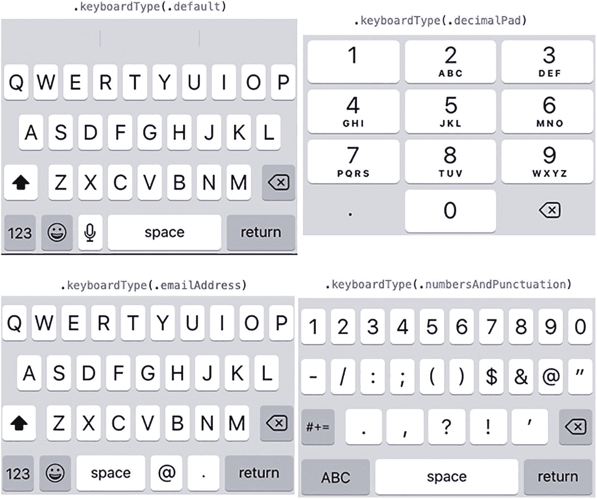
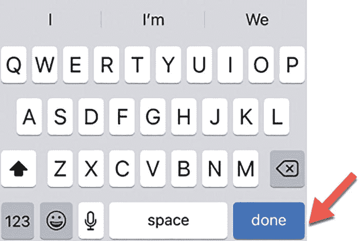

# 7. 从文本字段和文本编辑器中检索文本

用户界面通常需要从用户处检索文本。有时这些文本可能是一个单词或短句，但其他时候可能包含多个段落。为了从用户处检索文本，SwiftUI 提供了三种类型的视图：

- `Text` 字段
- `Secure` 字段
- `Text` 编辑器

`Text` 字段允许用户输入单行文本，例如姓名或地址。可选择地，文本字段可以显示占位符文本，该文本以浅灰色显示，用于说明该 `Text` 字段期望接收的信息类型。

`Secure` 字段的工作方式与 `Text` 字段完全相同，区别在于它会屏蔽用户输入的任何文本。这在要求用户输入信用卡号等敏感信息时非常有用。

`Text` 编辑器显示为一个大型文本框，用户可以在其中输入和编辑多行文本，例如多个段落。

由于 `Text` 字段、`Secure` 字段和 `Text` 编辑器需要存储数据，因此它们需要与一个可以保存 `String` 数据类型的 State 变量配合使用，例如：

```
@State private var message = ""
```

## 使用文本字段

`Text` 字段的主要目的是接受用户输入的简短文本。可以是单个单词或一个短句。为促使用户输入预期的文本，`Text` 字段可以显示占位符文本，该文本以浅灰色显示，如图 7-1 所示。

一个文本示例：`TextField("占位符文本", text: $message)`。`message` 变量中的占位符文本，以较浅的色调显示在下方平行线之间。

**图 7-1** 文本字段可以显示占位符文本以引导用户

当用户在 `Text` 字段中输入内容时，该文本会存储到由 `text:` 参数定义的 State 变量中。在图 7-1 中，这个 State 变量名为 `"message"`，美元符号（`$`）表示该 State 变量已绑定到此 `Text` 字段。这意味着更改 `Text` 字段的内容会自动更改 `message` 这个 State 变量。

### 定义可扩展的文本字段

尽管 `Text` 字段旨在接受简短的文本（例如地址或电话号码），但用户实际上可以输入任意数量的文本。当用户输入过多文本时，`Text` 字段可以自动水平（默认设置）或垂直扩展。

要定义可扩展的 `Text` 字段，请添加一个 `axis` 参数，其值为 `.horizontal` 或 `.vertical`，如下所示：

```
TextField("垂直", text: $message, axis: .vertical)
```

当 `Text` 字段水平扩展时，用户可以继续输入，文本将显示在一行上，直到滚动出视野。当 `Text` 字段垂直扩展时，`Text` 字段的宽度保持不变，但高度会扩展以显示多行文本，如图 7-2 所示。

一个定义可扩展文本字段的代码截图。包含 3 段文本，间隔为 75 垂直堆叠，用于指示消息水平和垂直扩展。

**图 7-2** 文本字段可以水平或垂直扩展

当 `Text` 字段垂直扩展时，其高度会随着用户继续输入文本而不断增加。如果想指定垂直扩展的 `Text` 字段可以显示多少行文本，请使用 `.lineLimit` 修饰符，如下所示：

```
TextField("垂直", text: $message, axis: .vertical)
.lineLimit(3)
```

上述代码将 `Text` 字段限制为最多显示三行文本。在定义行数限制时，垂直扩展的 `Text` 字段仍然可以容纳大量文本，但随着用户继续输入，文本将向上滚动并超出视野。

除了为 `.lineLimit` 修饰符定义固定值，你还可以定义一个范围，例如：

```
.lineLimit(2...5)
```

范围意味着 `Text` 字段会扩展并显示最小行数的文本，然后继续扩展直到达到最大限制。使用 `.lineLimit(2...5)`（定义两到五行文本）时，`Text` 字段将扩展到两行文本。然后，如果用户继续添加更多文本，它将扩展到显示三行，接着四行，最后停在五行。达到五行文本后，`Text` 字段将停止扩展，并将额外的文本行滚动出视野。

要查看可扩展 `Text` 字段的工作原理，请按照以下步骤操作：

1. 创建一个新的 SwiftUI iOS App 项目，并为其取任意名称，例如 `"ExpandableTextField"`。
2. 在导航器窗格中点击 `ContentView` 文件。
3. 在 `struct ContentView: View` 行下方添加一个 State 变量，如下所示：

    ```
    struct ContentView: View {
    @State var message = ""
    ```

4. 在 body 中添加一个 `TextField`，如下所示：

    ```
    var body: some View {
    VStack {
    TextField("垂直", text: $message, axis: .vertical)
    .lineLimit(3)
    }
    }
    ```

    整个 `ContentView` 文件应该如下所示：

    ```
    import SwiftUI
    struct ContentView: View {
    @State var message = ""
    var body: some View {
    VStack {
    TextField("垂直", text: $message, axis: .vertical)
    .lineLimit(3)
    }
    }
    }
    struct ContentView_Previews: PreviewProvider {
    static var previews: some View {
    ContentView()
    }
    }
    ```

5. 点击实时图标。
6. 点击 `Text` 字段并输入大量文本。注意 `Text` 字段的高度会扩展，直到最多显示三行文本。然后文本会开始向上滚动超出 `Text` 字段顶部。
7. 按上/下箭头键上下滚动，查看隐藏在 `Text` 字段顶部或底部的任何文本。

### 更改文本字段样式

使 `Text` 字段更易于识别的一种方法是显示以浅灰色出现的占位符文本，让用户知道输入什么以及在哪里输入。第二种强调 `Text` 字段的方法是添加圆角边框，如图 7-3 所示。

一个 3 行代码的截图，用于在较浅色调的占位符文本消息周围生成圆角边框。

**图 7-3** 文本字段周围圆角边框的外观

`.textFieldStyle` 修饰符为你提供了 `.plain` 或 `.rounded` 边框的选项：

```
.textFieldStyle(.roundedBorder)
```

`.roundedBorder` 在 `Text` 字段周围显示边框，而 `.plain` 修饰符则消除边框，使 `Text` 字段看起来如同没有使用 `.textFieldStyle` 修饰符一样。

### 创建安全文本字段

当你在 `Text` 字段中输入时，该文本在屏幕上是可见的。虽然在大多数情况下这很方便，但在输入密码或信用卡号等敏感信息时就不合适了。为了屏蔽用户输入的任何文本，SwiftUI 提供了一种特殊的文本字段，称为 `SecureField`。

与 `Text` 字段一样，`SecureField` 会显示占位符文本，并将其绑定到一个 State 变量，如下所示：

```
SecureField("密码", text: $message)
```

`SecureField` 在用户界面上看起来与 `TextField` 完全相同。唯一的区别是，当你在 `SecureField` 中输入时，它会屏蔽你的文本，如图 7-4 所示。

一个安全字段的截图，输入栏中有星号，还有一个显示文本“我的密码”的文本字段。

**图 7-4** `SecureField` 会屏蔽文本，而 `Text` 字段则显示用户输入的所有内容

任何可以在 `Text` 字段上使用的修饰符，都可以在 `SecureField` 上使用，例如 `.textFieldStyle` 修饰符。


## 使用自动更正与文本内容

默认情况下，文本字段会启用自动更正功能，这意味着当您输入时，文本字段会尝试猜测您要输入的单词。在某些情况下，这可能会很有帮助，但如果您试图输入一个名字，您可能不希望自动更正功能将名字改为常见单词。

要关闭自动更正功能，只需添加以下修饰符：

```
.disableAutocorrection(true)
```

如果您想重新打开自动更正功能，可以删除整个 `.disableAutocorrection` 修饰符，或者像这样传入一个 `false` 值：

```
.disableAutocorrection(false)
```

虽然禁用自动更正可以阻止文本字段提供不相关的建议，另一种解决方案是使用 `.textContentType` 修饰符来定义文本字段应期望的文本类型，例如姓名、电子邮件地址或电话号码。要使用 `.textContentType` 修饰符，您只需指定期望的文本类型，例如

```
TextField("请输入您的电子邮件地址", text: $emailAddress)
.textContentType(.emailAddress)
```

通过定义特定的 `.textContentType`，自动更正功能将减少其提供的不相关建议的数量。不同的 `.textContentType` 修饰符选项如下：

*   `.URL` – 用于输入网址数据
*   `.namePrefix` – 用于输入前缀或头衔，例如博士或先生
*   `.name` – 用于输入姓名
*   `.nameSuffix` – 用于输入姓名后缀，例如小
*   `.givenName` – 用于输入名字
*   `.middleName` – 用于输入中间名
*   `.familyName` – 用于输入姓氏或家族名
*   `.nickname` – 用于输入别名
*   `.organizationName` – 用于输入组织名称
*   `.jobTitle` – 用于输入职位
*   `.location` – 用于输入地点（包括地址）
*   `.fullStreetAddress` – 用于输入完整的街道地址
*   `.streetAddressLine1` – 用于输入街道地址的第一行
*   `.streetAddressLine2` – 用于输入街道地址的第二行
*   `.addressCity` – 用于输入地址中的城市名
*   `.addressCityAndState` – 用于输入地址中的城市和州名
*   `.postalCode` – 用于输入地址中的邮政编码
*   `.sublocality` – 用于输入地址中的子区域
*   `.countryName` – 用于输入地址中的国家或地区名称
*   `.username` – 用于输入账户或登录名
*   `.password` – 用于输入密码
*   `.newPassword` – 用于输入新密码
*   `.oneTimeCode` – 用于输入一次性代码
*   `.emailAddress` – 用于输入电子邮件地址
*   `.telephoneNumber` – 用于输入电话号码
*   `.creditCardNumber` – 用于输入信用卡号
*   `.dateTime` – 用于输入日期、时间或持续时间
*   `.flightNumber` – 用于输入航班号
*   `.shipmentTrackingNumber` – 用于输入包裹追踪号

### 定义不同的键盘

在真实的 iOS 设备上，应用会显示一个虚拟键盘，用户可以通过点击键盘来输入数字或字符。由于文本字段可能期望输入特定类型的信息，例如姓名、数字或电子邮件地址，您可以为用户界面上的每个文本字段定义要使用的特定类型的虚拟键盘。文本字段可以显示的一些不同的虚拟键盘包括：

*   `.default` – 通常显示的默认虚拟键盘，除非您另行指定
*   `.asciiCapable` – 显示标准的 ASCII 字符
*   `.numbersAndPunctuation` – 显示数字和标点符号
*   `.URL` – 显示针对网址输入优化的键盘
*   `.numberPad` – 显示用于输入 PIN 码的数字键盘
*   `.phonePad` – 显示用于输入电话号码的拨号键盘
*   `.namePhonePad` – 显示用于输入人名和电话号码的拨号键盘
*   `.emailAddress` – 显示用于输入电子邮件地址的键盘
*   `.decimalPad` – 显示带有数字和小数点的键盘
*   `.twitter` – 显示用于 Twitter 文本输入的键盘
*   `.webSearch` – 显示用于网络搜索词和网址输入的键盘
*   `.asciiCapableNumberPad` – 显示仅输出 ASCII 数字的数字键盘
*   `.alphabet` – 显示用于字母输入的键盘

图 7-5 展示了虚拟键盘的四种不同外观。



四张虚拟键盘截图。左边是 QWERTY 键盘，右边是数字和标点键盘。

图 7-5

虚拟键盘的不同外观

要为文本字段定义特定的键盘类型，请像这样使用 `.keyboardType` 修饰符：

```
TextField("输入姓名", text: $message)
.keyboardType(.phonePad)
```

注意

要查看虚拟键盘，您必须在模拟器或实际的 iOS 设备上测试您的项目。在模拟器中，您可以通过选择 I/O ➤ Keyboard ➤ Toggle Software Keyboard 或按 Command+K 来切换隐藏或显示虚拟键盘。您无法在画布窗格中查看虚拟键盘。

### 关闭虚拟键盘

当用户想要在文本字段中输入时，虚拟键盘会出现，并且用户界面会自动向上滑动。然而，一旦输入完毕，您需要让虚拟键盘再次消失。

一种技术是使用 `.submitLabel` 修饰符，它在虚拟键盘上定义一个特定的按键。通过点击 `.submitLabel` 修饰符定义的此按键，用户可以使虚拟键盘消失，如图 7-6 所示。`.submitLabel` 修饰符看起来像这样：



一张虚拟键盘截图，其中高亮显示了空格键旁边的一个“完成”按钮。

图 7-6

`.submitLabel(.done)` 修饰符在虚拟键盘上显示一个“完成”按钮

```
.submitLabel(.done)
```

如果您没有指定 `.submitLabel` 修饰符，SwiftUI 默认会在虚拟键盘的右下角显示一个“回车”按钮。无论右下角按键上显示的标签是什么，点击它都会使虚拟键盘消失。

`.submitLabel` 修饰符可以放置在虚拟键盘上的不同类型按钮包括：

*   `.continue` – 添加一个“继续”按钮
*   `.done` – 添加一个“完成”按钮
*   `.go` – 添加一个“前往”按钮
*   `.join` – 添加一个“加入”按钮
*   `.next` – 添加一个“下一个”按钮
*   `.return` – 添加一个“回车”按钮
*   `.route` – 添加一个“路线”按钮
*   `.search` – 添加一个“搜索”按钮
*   `.send` – 添加一个“发送”按钮

要了解如何使用您可以定义的虚拟键盘按钮来隐藏虚拟键盘，请遵循以下步骤：

1.  创建一个新的 SwiftUI iOS App 项目，并为其指定任意名称，例如“DismissKeyboard”。

2.  在导航器窗格中点击 ContentView 文件。

3.  在 `struct ContentView: View` 行下方添加一个状态变量，如下所示：

    ```
    struct ContentView: View {
    @State var message = ""
    ```

4.  在 body 中添加一个 TextField，如下所示：

    ```
    var body: some View {
    TextField("在此输入", text: $message)
    .submitLabel(.done)
    .padding()
    }
    ```

    整个 ContentView 文件应如下所示：

    ```
    import SwiftUI
    struct ContentView: View {
    @State var message = ""
    var body: some View {
    TextField("在此输入", text: $message)
    .submitLabel(.done)
    .padding()
    }
    }
    struct ContentView_Previews: PreviewProvider {
    static var previews: some View {
    ContentView()
    }
    }
    ```

5.  点击“运行”按钮或选择 Product ➤ Run 在模拟器中运行您的应用。

6.  当您的应用在模拟器中显示时，点击文本字段。如果虚拟键盘未出现，请按 Command+K 或选择 I/O ➤ Keyboard ➤ Toggle Software Keyboard。

7.  点击虚拟键盘右下角的“完成”按钮，使虚拟键盘消失。


### 使用文本编辑器

`TextField` 允许用户输入单词或短句，而 `TextEditor` 则允许用户输入多行文本，就像一个文字处理器。当你在用户界面上放置一个 `TextEditor` 时，它会扩展以填充所有可用空间。因此，最好使用 `.frame` 修饰符为 `TextEditor` 定义特定大小。

对于 `TextField`，点击虚拟键盘右下角的按钮可以使其消失。由于 `TextEditor` 可以容纳多行文本，虚拟键盘右下角的按钮仅将光标移动到下一行，并且始终显示“换行”标签。

因此，如果你想在使用 `TextEditor` 时隐藏虚拟键盘，需要执行以下操作：

-   创建一个表示布尔值的 `FocusState` 变量。
-   为 `TextEditor` 添加 `.focused` 修饰符，并使用该 `FocusState` 变量。
-   创建一个额外的控件（例如按钮），将该 `FocusState` 变量设置为 `false`。

> **注意：** 这种将 `FocusState` 变量与 `.focused` 修饰符以及单独控件结合使用的方法同样适用于 `TextField`。

首先，你需要像这样创建一个 `@FocusState` 变量：

```
@FocusState var dismissKeyboard: Bool
```

定义 `@FocusState` 变量后，你需要在 `TextEditor`（或 `TextField`）上使用 `.focused` 修饰符来链接到 `@FocusState` 变量，就像这样：

```
TextEditor(text: $message)
    .focused($dismissKeyboard)
```

然后，你可以通过一个单独的控件将 `@FocusState` 变量的值设置为 `false`，从而使虚拟键盘消失，就像这样：

```
Button("隐藏键盘") {
    dismissKeyboard = false
}
```

要了解 `FocusState` 变量如何工作，请遵循以下步骤：

1.  创建一个新的 SwiftUI iOS App 项目，并为其指定任何你喜欢的名称，例如“DismissKeyboardTextEditor”。
2.  在导航器窗格中单击 `ContentView` 文件。
3.  创建一个 `@State` 变量来保存 `TextEditor` 的内容，并创建一个 `@FocusState` 变量来使虚拟键盘消失，如下所示：

    ```
    struct ContentView: View {
        @State var message = ""
        @FocusState var dismissKeyboard: Bool
    ```

4.  在 `VStack` 内部添加一个 `Button` 和一个 `TextEditor`。为防止 `TextEditor` 扩展，请确保为 `TextEditor` 添加 `.frame` 修饰符。`ContentView` 文件内的完整代码如下所示：

    ```
    import SwiftUI

    struct ContentView: View {
        @State var message = ""
        @FocusState var dismissKeyboard: Bool

        var body: some View {
            VStack {
                TextEditor(text: $message)
                    .focused($dismissKeyboard)
                    .frame(width: 250, height: 150)
                    .padding()
                Button("隐藏键盘") {
                    dismissKeyboard = false
                }
            }
        }
    }

    struct ContentView_Previews: PreviewProvider {
        static var previews: some View {
            ContentView()
        }
    }
    ```

5.  点击**运行**按钮或选择**产品** ➤ **运行**，在模拟器中运行你的应用程序。
6.  当你的应用程序出现在模拟器中时，点击 `TextEditor`。如果虚拟键盘没有出现，请按下 **Command+K** 或选择 **I/O** ➤ **键盘** ➤ **切换软件键盘**。
7.  输入一些文本，然后点击你在 `TextEditor` 下方创建的**“隐藏键盘”**按钮。这将把 `@FocusState` 变量 `dismissKeyboard` 设置为 `false`，从而使虚拟键盘消失。

你必须使用 `@FocusState` 变量才能使虚拟键盘随 `TextEditor` 一起消失。

## 总结

用户向应用程序输入数据最常见的方式之一是通过键入文本。`TextField` 可以接受较短的文本，例如姓名或句子。默认情况下，`TextField` 会水平扩展，这意味着用户可以随意输入尽可能多的文本，并且这些文本将显示为单行。

如果将 `TextField` 改为垂直扩展，当用户继续输入文本时，`TextField` 的高度会增加并显示多行文本。为了防止 `TextField` 无限扩展，可以使用 `.lineLimit` 修饰符来定义 `TextField` 中显示的最大行数。

如果用户需要输入不应显示在屏幕上的敏感信息，可以使用 `SecureField`，它会屏蔽所有键入的内容。若要显示多行文本，可以使用 `TextEditor`，它就像一个微型文字处理器。

为了使文本输入更轻松，可以使用 `.contentType` 修饰符来定义 `TextField` 预期的信息类型，例如姓名或电子邮件地址。然后使用 `.keyboardType` 修饰符来定义针对特定信息类型（例如电话号码或姓名）优化的特定虚拟键盘。

当用户不再需要虚拟键盘时，`TextField` 和 `SecureField` 可以依靠右下角的按钮来关闭虚拟键盘。通过使用 `.submitLabel` 修饰符，你可以为此虚拟键盘右下角按钮定义常见的标题类型，例如**完成**、**发送**或**下一步**。

创建 `TextEditor` 时，它会扩展以填充所有可用空间，因此你可能需要使用 `.frame` 修饰符为 `TextEditor` 定义特定的宽度和高度。要隐藏使用 `TextEditor` 时的虚拟键盘，请使用带有 `.focused` 修饰符的 `@FocusState` 变量。然后创建一个单独的控件（例如按钮），将 `@FocusState` 变量设置为 `false`。这将使虚拟键盘消失。

文本是输入数据最常见的方式，因此请使用户能够轻松地将数据输入到 `TextField`、`SecureField` 或 `TextEditor` 中。

