# 8. 使用选取器限制选择

文本字段非常适合让用户输入任何类型的信息，例如姓名或简短的问题答案。问题是，如果用户可以自由输入任何内容，他们可能会意外（或故意）输入无效数据。

例如，如果一个 `TextField` 要求输入地址，你希望用户自由输入任何内容。但是，如果一个 `TextField` 要求输入州、语言或性别，你就不希望用户输入“狗”、“1258dke3”或“我在找鞋子”，因为这些都不是有效输入，很可能会导致程序崩溃。

一种解决方案是让用户输入任何数据，然后编写 Swift 代码来验证输入是否有效。不幸的是，这很可能会花费大量时间，而且仍然不准确。一个更好的解决方案是，当只有少数可接受的选项时，最好将用户限制在从有限范围内进行选择。

`Picker` 显示多个选项，并让用户有机会点击选择其中一个选项。由于所有选项都是有效的，`Picker` 确保用户只能输入有效数据。普通的 `Picker` 非常适合让用户从一系列文本选项中进行选择。对于选择颜色或日期，SwiftUI 还提供了特殊的 `ColorPicker` 和 `DatePicker`。

`DatePicker` 甚至允许你定义一个有效的日期范围。`Picker` 的全部目的是确保用户在任意时刻只能向程序输入有效数据。


## 使用选择器（Picker）

`Picker` 会显示一个由多个 `Text` 视图定义的选项列表。虽然 `Picker` 使用文本字符串来展示可用选项，但用户选择的选项实际上可以代表任何值，例如字符串、十进制数、整数或由枚举定义的值。（分段控件是 `Picker` 视图的一种特殊类型，已在第 6 章介绍过。）

要创建一个 `Picker`，需使用多个 `Text` 视图来显示选项，并为每个选项附加一个 `.tag` 修饰符。`.tag` 修饰符定义了用户所选的实际值，例如：

```
Picker(selection: $choice, label: Text("选择器")) {
    Text("一").tag("one")
    Text("二").tag("two")
    Text("三").tag("three")
    Text("四").tag("four")
    Text("五").tag("five")
}
```

在此示例中，可用选项是数字，但当用户选择一个数字时，实际选择会以字符串形式存储，例如 `"three"` 或 `"five"`，如图 8-1 所示。


**图 8-1** – `Picker` 使用 `Text` 视图在用户界面上显示选项

`Text` 视图上的 `.tag` 修饰符可以包含任何数据类型，但同一个 `Picker` 内的所有 `.tag` 修饰符必须是相同的数据类型，并且要与它所链接的 `State` 变量类型匹配。以下 Swift 代码定义了一个 `Picker`，其中多个 `Text` 视图显示诸如 `"Cat"` 或 `"Bird"` 之类的单词，但 `.tag` 修饰符存储的是诸如 `0` 或 `2` 之类的整数：

```
Picker("", selection: $choice) {
    Text("鸟").tag(1)
    Text("猫").tag(2)
    Text("蜥蜴").tag(3)
    Text("狗").tag(4)
    Text("仓鼠").tag(5)
}
```

因为 `.tag` 修饰符包含整数，所以 `choice` `State` 变量现在需要存储 `Int` 数据类型，例如：

```
@State private var choice = 0
```

要了解 `Picker` 的工作原理，请按以下步骤操作：

1. 创建一个新的 SwiftUI iOS App 项目，并为其指定任意名称，例如 `"Picker"`。

2. 在导航器窗格中点击 `ContentView` 文件。

3. 在 `struct ContentView: View` 代码行下方添加以下 `State` 变量：

```
struct ContentView: View {
    @State private var choice = 0
```

这将创建一个初始设置为 `0` 的 `State` 变量，它是一个整数，因此 `choice` `State` 变量被定义为持有 `Int` 数据类型。

4. 在 `var body: some View` 代码行内创建一个 `VStack`，并在其中创建一个 `Picker` 和一个 `Text` 视图：

```
var body: some View {
    VStack {
        Picker("", selection: $choice) {
            Text("鸟").tag(1)
            Text("猫").tag(2)
            Text("蜥蜴").tag(3)
            Text("狗").tag(4)
            Text("仓鼠").tag(5)
        }
        Text("选择结果 = \(choice)")
    }
}
```

`ContentView` 文件中的完整代码应如下所示：

```
import SwiftUI

struct ContentView: View {
    @State var choice = 0

    var body: some View {
        VStack {
            Picker("", selection: $choice) {
                Text("鸟").tag(1)
                Text("猫").tag(2)
                Text("蜥蜴").tag(3)
                Text("狗").tag(4)
                Text("仓鼠").tag(5)
            }
            Text("选择结果 = \(choice)")
        }
    }
}

struct ContentView_Previews: PreviewProvider {
    static var previews: some View {
        ContentView()
    }
}
```

5. 点击画布窗格中的 `Live` 图标。

6. 在 `Picker` 中选择不同的选项。请注意，每次选择不同的选项时，`Text` 视图都会显示 `"选择结果 = __"`，其中 `__` 是用户选择的 `Text` 视图所附加的 `.tag` 值。

7. 按如下方式更改 `State` 变量，以使其持有 `Double` 数据类型：

```
@State private var choice = 0.0
```

由于此 `choice` `State` 变量的初始值为 `0.0`，它是一个十进制数，因此 Swift 推断 `choice` 变量现在只能持有 `Double` 数据类型。

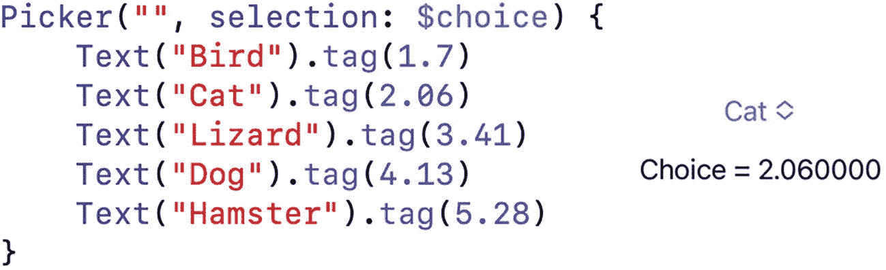

**图 8-2** – 一个在 `.tag` 修饰符中使用 `Double` 值的 `Picker` 视图

8. 按如下方式更改 `Picker` 中的 `.tag` 修饰符：

```
Picker("", selection: $choice) {
    Text("鸟").tag(1.7)
    Text("猫").tag(2.06)
    Text("蜥蜴").tag(3.41)
    Text("狗").tag(4.13)
    Text("仓鼠").tag(5.28)
}
```

由于 `choice` 状态变量已被重新定义为持有 `Double` 数据类型，因此 `.tag` 修饰符的值现在也必须全部表示 `Double` 数据类型。

9. 点击画布窗格中的 `Live` 图标。

10. 在 `Picker` 中选择不同的选项。请注意，每次选择不同的选项时，`Text` 视图都会显示 `"选择结果 = __"`，其中 `__` 是作为 `Double` 值的 `.tag` 值，如图 8-2 所示。

默认情况下，`Picker` 视图显示为菜单。然而，`.pickerStyle` 修饰符提供了三种不同的方式来显示 `Picker` 视图，如图 8-3 所示：

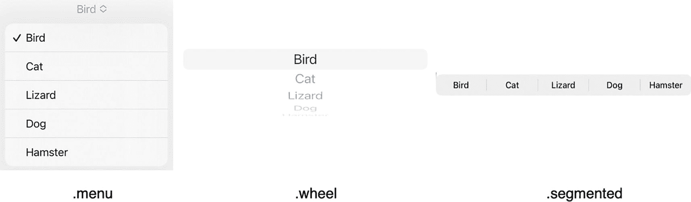

**图 8-3** – 三种不同的 `Picker` 视图样式

- `.pickerStyle(.menu)`
- `.pickerStyle(.wheel)`
- `.pickerStyle(.segmented)`


### 在 Picker 中显示选项

在 Picker 中显示选项最直接的方式是使用多个 `Text` 视图。对于少量选项，这种方式效果不错，但当你需要显示大量选项时，尤其是在使用 `.wheel` 拾取器样式时，使用 `ForEach` 循环从数组中获取选项通常更为方便。

首先，创建一个数组，用于存放你想在 `Picker` 视图中显示的所有选项，例如：

```
let myArray = ["Fish", "Tortoise", "Hare", "Bird"]
```

接着，为 `Picker` 视图创建一个可供访问的 `State` 变量：

```
@State var selectedItem = ""
```

最后，使用 `ForEach` 循环创建 `Picker` 视图来获取数组中的每个元素，如下所示：

```
Picker("", selection: $selectedItem) {
ForEach(myArray, id: \.self) {
Text($0)
}
```

`ForEach` 循环需要知道要访问哪个数组，然后它使用 `id` 参数来标识要在 `Text` 视图中显示的每个不同的数组项。`Text` 视图使用快捷方式 `$0` 来表示每个数组项。

要了解如何使用数组和 `ForEach` 循环来填充 `Picker` 视图，请执行以下步骤：

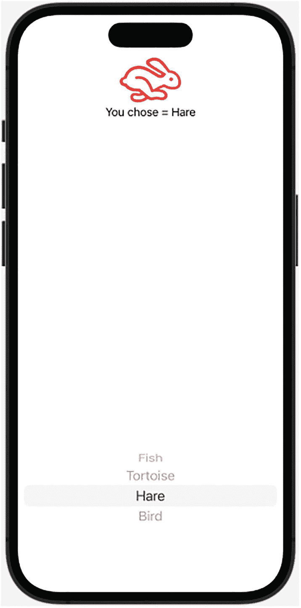  
**图 8-4** – 用户界面上的 `Image` 视图、`Text` 视图和 `Picker` 视图

1. 创建一个新的 SwiftUI iOS App 项目，并为其取一个你喜欢的名称，例如 “PickerWheel”。
2. 在导航器面板中点击 `ContentView` 文件。
3. 在 `struct ContentView: View` 行下方添加以下 `State` 变量和数组声明：

    ```
    struct ContentView: View {
    let myArray = ["Fish", "Tortoise", "Hare", "Bird"]
    @State var selectedItem = ""
    ```

4. 创建一个 `VStack`，在其中放入一个 `Picker` 视图，并为其拾取器样式使用 `.wheel` 选项。`Picker` 视图必须绑定到 `State` 变量 `selectedItem`。在 `Picker` 视图内部，添加一个 `ForEach` 循环，从数组中获取每个元素，如下所示：

    ```
    var body: some View {
    VStack {
    Picker("", selection: $selectedItem) {
    ForEach(myArray, id: \.self) {
    Text($0)
    }
    }.pickerStyle(.wheel)
    }
    }
    ```

5. 在 `Picker` 视图上方，添加一个 `Image` 视图、一个 `Text` 视图和一个 `Spacer`，如下所示：

    ```
    VStack {
    Image(systemName: selectedItem.lowercased())
    .font(.custom("", size: 60))
    .foregroundColor(Color.red)
    Text("You chose = \(selectedItem)")
    Spacer()
    Picker("", selection: $selectedItem) {
    ForEach(myArray, id: \.self) {
    Text($0)
    }
    }.pickerStyle(.wheel)
    }
    ```

    `Image` 视图获取 `selectedItem` `State` 变量并将其转换为小写。这是因为 `Picker` 视图中显示的每个选项（来自数组）都代表一个图标的名称，但每个图标名称都由小写字母组成。为了使此图标可见，`.font` 修饰符将大小更改为 60，`.foregroundColor` 修饰符将颜色更改为红色。

    `Text` 视图显示用户从 `Picker` 视图中选择的项目名称。`Spacer` 将 `Image` 和 `Text` 视图推到屏幕顶部，同时将 `Picker` 视图推到屏幕底部，如图 8-4 所示。

6. 在画布面板中点击 Live 图标。
7. 从 `Picker` 视图的轮盘中选择一个选项。每次你选择不同的选项时，请注意，`Text` 视图会显示你选择的名称，而 `Image` 视图会为每个选择显示相应的图像。

### 使用枚举填充 Picker

数组是填充 `Picker` 视图的一种方式。另一种方式是从枚举中检索选项。枚举允许你定义自己的数据类型，并附带一个有限的有效选项列表。要创建一个枚举，你需要定义枚举名称及其数据类型（例如 `String`），如下所示：

```
enum ColorItems: String, CaseIterable, Identifiable {
case rose
case grass
case sky
var id: Self { self }
}
```

在枚举名称（例如 `ColorItems`）之后是 `CaseIterable` 和 `Identifiable`。`CaseIterable` 意味着我们可以访问枚举中列出的选项，并将这些选项（`rose`、`grass` 和 `sky`）作为数据（例如 `String`）处理。`Identifiable` 意味着 `ForEach` 循环可以使用 `id: Self { self }` 变量来计数枚举中的每个项。

要了解如何使用枚举填充 `Picker` 视图，请执行以下步骤：

1. 创建一个新的 SwiftUI iOS App 项目，并为其取一个你喜欢的名称，例如 “PickerEnumeration”。
2. 在导航器面板中点击 `ContentView` 文件。
3. 在 `struct ContentView: View` 行下方添加以下 `State` 变量和枚举声明：

```
    struct ContentView: View {
    @State private var selectedColor = ColorItems.rose
    @State var myColor = Color.red
    enum ColorItems: String, CaseIterable, Identifiable {
    case rose
    case grass
    case sky
    var id: Self { self }
    }
    ```

`selectedColor` `State` 变量代表 `ColorItems` 枚举数据类型。`myColor` `State` 变量代表 `Color` 数据类型。`ColorItems` 枚举定义了三个有效选项：`rose`、`grass` 或 `sky`。

4. 创建一个 `VStack`，并添加一个 `Rectangle` 和一个拾取器样式为 `.wheel` 的 `Picker` 视图。`Picker` 视图必须绑定到 `State` 变量 `selectedColor`。在 `Picker` 视图内部，添加一个 `ForEach` 循环，从枚举中获取每个元素，如下所示：

```
    var body: some View {
    VStack  {
    Rectangle()
    .fill(myColor)
    Picker("Favorite Color", selection: $selectedColor) {
    ForEach(ColorItems.allCases, id: \.self) {catFood in
    Text(catFood.rawValue.capitalized)
    }
    }.pickerStyle(.wheel)
    }
    ```

`Rectangle` 包含由 `myColor` `State` 变量定义的颜色。`Picker` 视图使用 `ForEach` 循环从 `ColorItems` 枚举中检索每个项。因为 `ColorItems` 枚举被定义为 `CaseIterable`，所以 `ForEach` 循环可以使用 `.allCases` 和 `id` 参数来检索每个项。

`ForEach` 循环使用一个任意命名的变量 (`catFood`) 来存储枚举中的每个项。然后，`Text` 视图使用每个枚举项，检索其 `.rawValue`（即字符串类型的 "rose"、"grass" 和 "sky"），并以大写形式在 `Picker` 视图中显示该项（"Rose"、"Grass" 和 "Sky"）。

5. 为 `Picker` 视图添加 `.onChange`，如下所示：

```
    .onChange(of: selectedColor) { newValue in
    switch newValue {
    case ColorItems.rose: myColor = Color.red
    case ColorItems.grass: myColor = Color.green
    case ColorItems.sky: myColor = Color.blue
    }
    }
    ```

当 `.onChange` 检测到用户从 `Picker` 视图选择了不同的项时，它会将该选中的项存储在 `newValue` 变量中。然后，`switch` 语句会检查用户从 `Picker` 视图中选择了哪个选项（`rose`、`grass` 或 `sky`）。根据用户从 `Picker` 视图中选择的项，`switch` 语句会为 `myColor` `State` 变量分配一个颜色。`myColor` `State` 变量会立即将颜色发送给 `Rectangle`。

完整的 `ContentView` 文件应如下所示：


```swift
import SwiftUI

struct ContentView: View {
    @State private var selectedColor = ColorItems.rose
    @State var myColor = Color.red

    enum ColorItems: String, CaseIterable, Identifiable {
        case rose
        case grass
        case sky
        var id: Self { self }
    }

    var body: some View {
        VStack {
            Rectangle()
                .fill(myColor)
            Picker("Favorite Color", selection: $selectedColor) {
                ForEach(ColorItems.allCases, id: \.self) { catFood in
                    Text(catFood.rawValue.capitalized)
                }
            }
            .pickerStyle(.wheel)
            .onChange(of: selectedColor) { newValue in
                switch newValue {
                case ColorItems.rose: myColor = Color.red
                case ColorItems.grass: myColor = Color.green
                case ColorItems.sky: myColor = Color.blue
                }
            }
        }
    }
}

struct ContentView_Previews: PreviewProvider {
    static var previews: some View {
        ContentView()
    }
}
```

6.  在画布面板中点击“Live”图标。
7.  点击`Picker`视图并选择一个选项。无论你选择哪个选项，相应的颜色都会显示在`Rectangle`中。

## 使用颜色选择器

普通的`Picker`可以让用户选择`Text`视图中显示的不同选项。但是，如果你想让用户选择特定的颜色呢？你可以在`Picker`中列出几种颜色，但用户想选择自定义颜色怎么办？这时你就可以使用颜色选择器（Color Picker）。

颜色选择器允许用户从网格、色谱或红绿蓝滑块中选择标准颜色（红色、蓝色、绿色、黄色等）或自定义颜色，如图 8-5 所示。

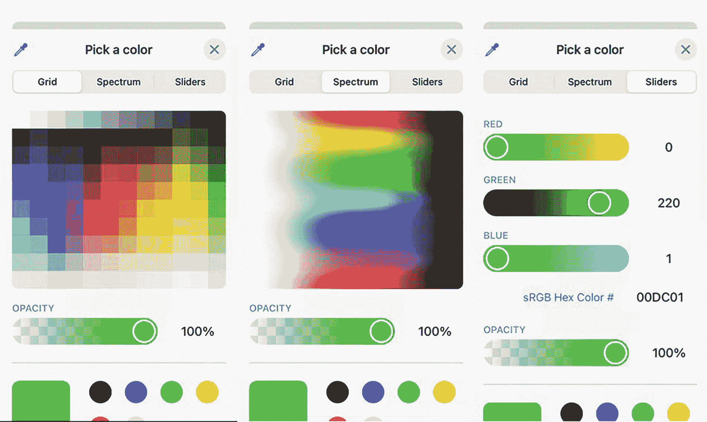

三个选取颜色窗口的截图，包含颜色框和不同颜色的滑块以及透明度选项。第一个选中了网格选项卡。第二个选中了光谱选项卡。第三个选中了滑块选项卡，并显示红、绿、蓝滑块。

**图 8-5** 颜色选择器提供了三种不同的选项用于选择自定义颜色

要创建颜色选择器，必须首先创建一个`State`变量来保存`Color`数据类型，例如：

```
@State var myColor = Color.red
```

然后，可以通过定义一个描述性标题，后跟指向代表`Color`的`State`变量的链接，来创建一个颜色选择器，如下所示：

```
ColorPicker("Pick a color", selection: $myColor)
```

要了解颜色选择器的工作原理，请按照以下步骤操作：

1.  创建一个新的 SwiftUI iOS 应用项目，并为其命名，例如“ColorPicker”。
2.  在导航器面板中点击`ContentView`文件。
3.  在`struct ContentView: View`行下方添加以下`State`变量：

```
struct ContentView: View {
    @State var myColor = Color.gray
```

4.  创建一个`VStack`，并在其中放入一个`Rectangle`。由于`Rectangle`会扩展以填满整个屏幕，请务必在其上添加`.frame`修饰符，并使用之前定义的`State`变量设置其`.foregroundColor`：

```
var body: some View {
    VStack {
        Rectangle()
            .frame(width: 200, height: 150)
            .foregroundColor(myColor)
    }
}
```

5.  在`Rectangle()`下方，定义一个链接或绑定到`State`变量的颜色选择器：

```
ColorPicker("Pick a color", selection: $myColor)
```

整个`ContentView`文件应如下所示：

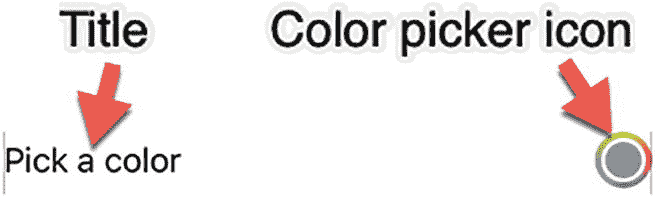

一个截图显示，文字标题指向左侧的“Pick a color”，文字“颜色选择器图标”指向右侧的一个圆形渐变颜色图标。

**图 8-6** 颜色选择器图标

6.  点击画布面板中的“Live”图标。请注意，由于`State`变量`myColor`的初始值为灰色，因此`Rectangle`最初显示为灰色。
7.  点击颜色选择器图标，如图 8-6 所示，以显示不同的颜色选项（见图 8-4）。

```
import SwiftUI

struct ContentView: View {
    @State var myColor = Color.gray

    var body: some View {
        VStack {
            Rectangle()
                .frame(width: 200, height: 150)
                .foregroundColor(myColor)
            ColorPicker("Pick a color", selection: $myColor)
        }
    }
}

struct ContentView_Previews: PreviewProvider {
    static var previews: some View {
        ContentView()
    }
}
```

8.  点击一种颜色，然后点击颜色选择器对话框右上角的关闭（X）图标将其关闭。请注意，`Rectangle`现在显示为你选择的颜色。

颜色选择器不仅允许用户选择颜色，还可以选择透明度。默认情况下，透明度是开启的，但如果想关闭它，可以通过将`supportsOpacity`参数更改为`false`来关闭，如下所示：

```
ColorPicker("Pick a color", selection: $myColor, supportsOpacity: false)
```

当`supportsOpacity`参数为`true`（或省略）时，会显示透明度滑块。当`supportsOpacity`参数为`false`时，透明度滑块不会显示，如图 8-7 所示。

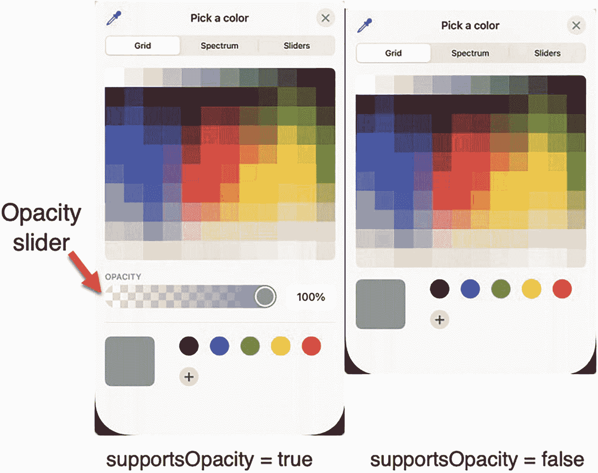

选取颜色窗口的两个截图都选中了网格选项卡，下方显示网格格式的各种颜色的颜色框。一个有透明度选项，另一个没有透明度选项。它们还分别对应命令`supportsOpacity = true`和`supportsOpacity = false`。

**图 8-7** 透明度开启和关闭的颜色选择器

## 使用日期选择器

用户需要输入的常见数据类型之一是日期和时间。然而，一个人可能会将日期写成“June 14, 2023”，而另一个人可能会将同一日期写成“6/14/23”。在输入时间时，一个人可能会输入“6:45 p.m.”，而另一个人可能会输入“18:45”。

为了让用户轻松输入日期和时间，SwiftUI 提供了日期选择器（Date Picker）。用户无需手动输入日期或时间，只需点击他们想要的日期或时间即可，如图 8-8 所示。

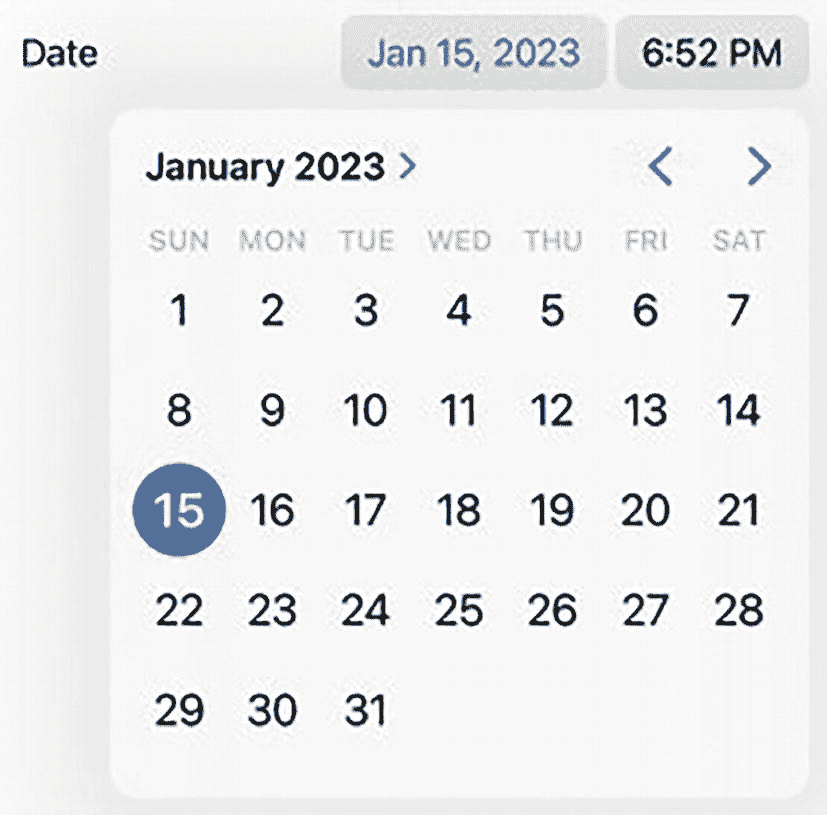

一个日历窗口的截图，月份和年份显示为 2023 年 1 月，选中的日期为 15 日。右上角显示日期 January 15, 2023 和时间 6 52 PM。

**图 8-8** 日期选择器

要创建日期选择器，只需定义一个描述性文本和一个用于存储用户所选日期和/或时间的`State`变量，如下所示：

```
DatePicker(selection: $myDate, label: { Text("Date") })
```

### 选择日期选择器样式

默认情况下，日期选择器以可编辑字段的形式显示日期和时间。如果您不喜欢日期选择器的默认紧凑格式，可以使用`.datePickerStyle()`修饰符自定义日期选择器的外观，如图 8-9 所示。

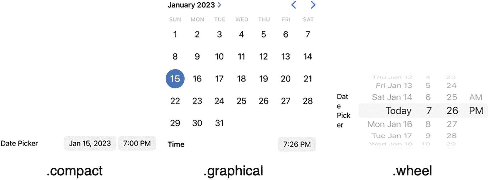

一组三张截图，分别展示了`.compact`、`.graphical`和`.wheel`样式。Compact 样式显示文本日期选择器和日期时间“January 15, 2023, 7 PM”。Graphical 样式显示日历，选中日期 15，月份和年份为 January 2023。Wheel 样式选中了 today 和 7 26 PM。

**图 8-9** 日期选择器的不同样式

*   `.compact` – 显示日期和时间的默认方式。当用户选择日期时，会像`.graphical`样式一样显示日历。当用户选择时间时，会像`.wheel`样式一样显示不同的时间选项。
*   `.graphical` – 以日历形式显示日期，时间则以字段形式显示。当用户选择时间时，会像`.wheel`样式一样显示不同的时间选项。
*   `.wheel` – 以滚轮形式显示日期和时间。

创建日期选择器的 Swift 代码只需添加一个`State`变量来存储日期，然后使用该`State`变量。此外，当日期选择器样式为`.compact`时，日期选择器允许你定义显示的文本：

```
@State var myDate = Date.now
DatePicker(selection: $myDate, label: { Text("Date") })
    .datePickerStyle(.graphical)
```


### 显示日期和/或时间

虽然`DatePicker`可以让用户同时选择日期和时间，但你可能只想让`DatePicker`选择日期或时间中的一项。要限制`DatePicker`仅显示日期或时间，可以添加`displayedComponents`参数，并指定为`[.date]`或`[.hourAndMinute]`，示例如下：

```
DatePicker(selection: $myDate, displayedComponents: [.date], label: { Text("日期") })
DatePicker(selection: $myDate, displayedComponents: [.hourAndMinute], label: { Text("时间") })
```

### 限制日期范围

当允许用户选择日期时，你可能需要限制有效日期的范围。例如，如果你在询问某人的出生日期，让`DatePicker`允许用户选择一个异常古老的日期（如 1737 年 2 月 3 日）是不合理的。

要为`DatePicker`限制日期范围，你首先需要定义起始和结束日期范围，例如：

```
let dateRange: ClosedRange = {
    let calendar = Calendar.current
    let startComponents = DateComponents(year: 2024, month: 1, day: 1)
    let endComponents = DateComponents(year: 2024, month: 12, day: 31, hour: 23, minute: 59, second: 59)
    return calendar.date(from:startComponents)!
    ...
    calendar.date(from:endComponents)!
}()
```

请注意，一个闭区间需要同时定义起始日期和结束日期。用户无法选择早于起始日期的过去日期，也无法选择晚于结束日期的未来日期。

除了闭区间，你还可以选择部分范围。一种方法是定义一个从特定日期开始的部分范围，例如：

```
let dateRange2: PartialRangeFrom = {
    let calendar = Calendar.current
    let startComponents = DateComponents(year: 2023, month: 1, day: 1)
    return calendar.date(from:startComponents)!...
}()
```

上述范围从 2023 年 1 月 1 日开始，允许`DatePicker`选择此起始日期之后的任何日期。另一种定义部分范围的方式是定义一个截止到特定日期的范围，例如：

```
let dateRange3: PartialRangeThrough = {
    let calendar = Calendar.current
    let stopComponents = DateComponents(year: 2024, month: 1, day: 1)
    return ...calendar.date(from:stopComponents)!
}()
```

此范围允许`DatePicker`选择到指定日期（本例中为 2024 年 1 月 1 日）为止的任何日期。定义日期范围后，你需要将该日期范围添加到`DatePicker`中，如下所示：

```
DatePicker(selection: $myDate, in: dateRange, displayedComponents: [.date], label: { Text("日期") })
```

这个`DatePicker`使用一个名为`myDate`的`State`变量，通过`dateRange`常量定义有效范围，并且仅显示日期（不显示时间）。如果`DatePicker`的样式是`.compact`，它还会在`DatePicker`上显示“日期”。

要了解如何使用`DatePicker`，请遵循以下步骤：

1.  创建一个新的 SwiftUI iOS App 项目，并为其取任意名称，例如“DatePicker”。

2.  在导航面板中点击`ContentView`文件。

3.  创建一个`State`变量来保存日期，如下所示：

    ```
    @State var myDate = Date.now
    ```

    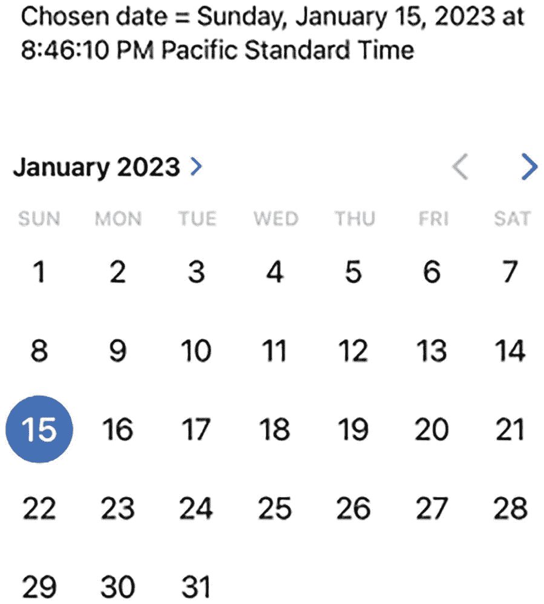

    日历窗口的屏幕截图显示月份和年份为 2023 年 1 月，选中的日期为 15 日。顶部文字显示：所选日期 = 2023 年 1 月 15 日星期日太平洋标准时间晚上 8:46:10。

    **图 8-10** 显示`Text`视图和`DatePicker`的用户界面

4.  定义三个日期范围，如下所示：

    ```
    let dateRange: ClosedRange = {
        let calendar = Calendar.current
        let startComponents = DateComponents(year: 2023, month: 1, day: 1)
        let endComponents = DateComponents(year: 2023, month: 12, day: 31, hour: 23, minute: 59, second: 59)
        return calendar.date(from:startComponents)!
        ...
        calendar.date(from:endComponents)!
    }()
    let dateRange2: PartialRangeFrom = {
        let calendar = Calendar.current
        let startComponents = DateComponents(year: 2023, month: 1, day: 1)
        let endComponents = DateComponents(year: 2023, month: 12, day: 31, hour: 23, minute: 59, second: 59)
        return calendar.date(from:endComponents)!...
    }()
    let dateRange3: PartialRangeThrough = {
        let calendar = Calendar.current
        let startComponents = DateComponents(year: 2023, month: 1, day: 1)
        let endComponents = DateComponents(year: 2023, month: 12, day: 31, hour: 23, minute: 59, second: 59)
        return ...calendar.date(from:startComponents)!
    }()
    ```

5.  创建一个`VStack`来容纳一个`Text`视图和一个`DatePicker`，如下所示：

    ```
    var body: some View {
        VStack {
            Text("所选日期 = \(myDate)")
                .padding()
            DatePicker(selection: $myDate, in: dateRange3, displayedComponents: [.date], label: { Text("日期") })
                .datePickerStyle(.graphical)
                .padding()
        }
    }
    ```

    完整的`ContentView`文件应如下所示：

    ```
    import SwiftUI
    struct ContentView: View {
        @State var myDate = Date.now
        let dateRange: ClosedRange = {
            let calendar = Calendar.current
            let startComponents = DateComponents(year: 2023, month: 1, day: 1)
            let endComponents = DateComponents(year: 2023, month: 12, day: 31, hour: 23, minute: 59, second: 59)
            return calendar.date(from:startComponents)!
            ...
            calendar.date(from:endComponents)!
        }()
        let dateRange2: PartialRangeFrom = {
            let calendar = Calendar.current
            let startComponents = DateComponents(year: 2023, month: 1, day: 1)
            let endComponents = DateComponents(year: 2023, month: 12, day: 31, hour: 23, minute: 59, second: 59)
            return calendar.date(from:endComponents)!...
        }()
        let dateRange3: PartialRangeThrough = {
            let calendar = Calendar.current
            let startComponents = DateComponents(year: 2023, month: 1, day: 1)
            let endComponents = DateComponents(year: 2023, month: 12, day: 31, hour: 23, minute: 59, second: 59)
            return ...calendar.date(from:startComponents)!
        }()
        var body: some View {
            VStack {
                Text("所选日期 = \(myDate)")
                    .padding()
                DatePicker(selection: $myDate, in: dateRange, displayedComponents: [.date], label: { Text("日期") })
                    .datePickerStyle(.graphical)
                    .padding()
            }
        }
    }
    struct ContentView_Previews: PreviewProvider {
        static var previews: some View {
            ContentView()
        }
    }
    ```

6.  在画布面板中点击 Live 图标，然后点击任意日期。请注意，当你选择一个日期时，它会显示在`DatePicker`上方，如图 8-10 所示。

7.  尝试更改`DatePicker`样式（`.compact`、`.graphical`、`.wheel`），并搭配选择不同的日期范围（`dateRange`、`dateRange2`、`dateRange3`）。


### 格式化日期

默认情况下，SwiftUI 会显示包含大量你可能不想展示的细节的日期。要以特定格式显示日期，你可以像这样使用 `DateFormatter`：

```
let formatter = DateFormatter()
```

然后你可以定义一个样式来显示日期和时间，例如以下其中之一：

| 样式 | 日期 | 时间 |
| --- | --- | --- |
| `.short` | 2/15/22 | 7:15 PM |
| `.medium` | Feb 15, 2022 | 7:15:29 PM |
| `.long` | February 15, 2022 | 7:15:29 PM CST |
| `.full` | Tuesday, February 15, 2022 | 7:15:29 PM Central Standard Time |

注意

地区设置可能会改变日期的实际显示方式，例如显示为 15 June 2021 或 June 15, 2021。

要使用日期样式，你必须像这样定义 formatter 的 `dateStyle` 属性：

```
formatter.dateStyle = .medium
```

要使用时间样式，你必须像这样定义 formatter 的 `timeStyle` 属性：

```
formatter.timeStyle = .short
```

创建了 `DateFormatter` 并定义好其 `.dateStyle` 和 `.timeStyle` 属性之后，最后一步就是使用该 formatter 及其 `dateStyle` 来格式化一个日期，例如：

```
formatter.string(from: myDate)
```

要了解如何格式化从日期选择器中选取的日期，请遵循以下步骤：

1. 创建一个新的 SwiftUI iOS App 项目，并为其任意命名，例如“DatePickerFormat”。
2. 在导航面板中点击 `ContentView` 文件。
3. 创建一个 `State` 变量来保存日期，如下所示：
   1. 在 `State` 变量下方输入以下内容来定义一个 `DateFormatter`：

   ```
   @State var myDate = Date.now
   ```

   2. 在 `var body: some View` 行内添加一个 `VStack`，并在 `VStack` 内创建一个 `DatePicker`，如下所示：

   ```
   VStack {
       Text("选择的日期 = \(formatter.string(from: myDate))")
           .padding()
       DatePicker(selection: $myDate, label: { Text("日期") })
   }.onAppear() {
       formatter.dateStyle = .full
       formatter.timeStyle = .full
   }
   ```

   `Text` 视图显示“选择的日期 = ”后跟存储在 `myDate` State 变量中的日期。注意，`formatter.string` 命令定义了该日期的实际显示方式。

   `DatePicker` 将选定的日期存储在 `myDate` State 变量中。然后，每当 `VStack` 定义的用户界面出现时，`.onAppear` 修饰符就会运行 Swift 代码。在这个 `.onAppear` 修饰符内部，有一行代码将 `formatter` 的 `.dateStyle` 定义为 `.full`。如果你将 `.full` 改为 `.short`、`.medium` 或 `.long`，就可以在 `Text` 视图中看到日期格式的不同变化。

   整个 `ContentView` 文件应如下所示：

   ```
   import SwiftUI
   struct ContentView: View {
       @State var myDate = Date.now
       let formatter = DateFormatter()
       var body: some View {
           VStack {
               Text("选择的日期 = \(formatter.string(from: myDate))")
                   .padding()
               DatePicker(selection: $myDate, label: { Text("日期") })
           }.onAppear() {
               formatter.dateStyle = .full
               formatter.timeStyle = .full
           }
       }
   }
   struct ContentView_Previews: PreviewProvider {
       static var previews: some View {
           ContentView()
       }
   }
   ```

4. 点击画布面板中的 Live 图标，然后点击任意日期。注意，当你选择一个日期时，它会显示在 `DatePicker` 上方，并使用 `.onAppear` 修饰符中定义的日期和时间样式，例如 `.full` 或 `.short`。

```
let formatter = DateFormatter()
```

### 创建 MultiDatePicker

普通的日期选择器只允许用户选择单个日期。如果你希望用户能够同时选择多个日期，可以使用 `MultiDatePicker`。由于 `MultiDatePicker` 允许用户选择多个日期，这些日期会存储在一组 `DateComponents` 中。这意味着你需要像这样创建一个 `State` 变量：

```
@State var dates = Set<DateComponents>()
```

要创建一个 `MultiDatePicker`，只需使用这个 State 变量来存储选中的多个日期，代码如下：

```
MultiDatePicker("选择日期", selection: $dates)
```

要了解如何创建一个 `MultiDatePicker`，请遵循以下步骤：

1. 创建一个新的 SwiftUI iOS App 项目，并为其任意命名，例如“MultiDatePicker”。
2. 在导航面板中点击 `ContentView` 文件。
3. 创建一个 `State` 变量来以一个集合的形式保存多个日期，如下所示：

   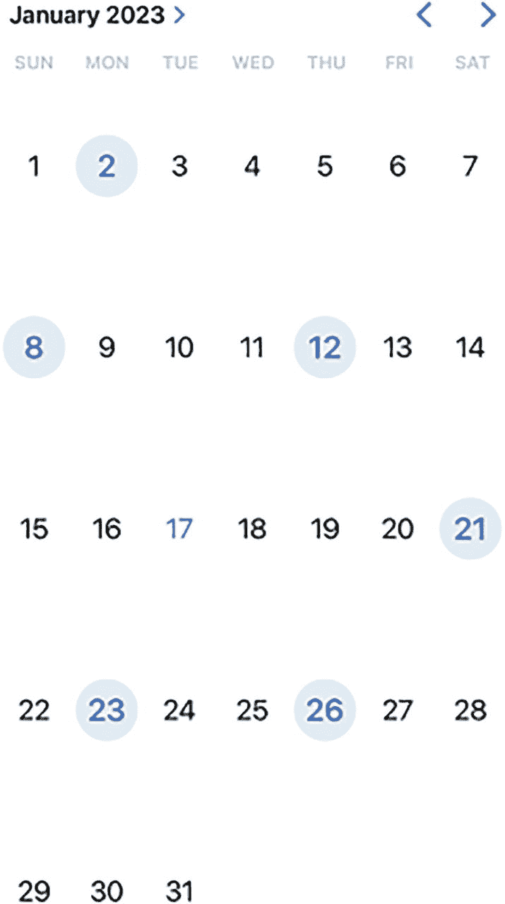
   *一个日历窗口的截图，显示月份和年份为 2023 年 1 月，选中了 2、8、12、17、21、23 和 26 等多个日期。*
   **图 8-11** `MultiDatePicker` 允许用户选择两个或更多日期。

4. 在 `var body: some View` 行内添加一个 `VStack`，并在 `VStack` 内创建一个 `MultiDatePicker`，如下所示：

   ```
   VStack {
       MultiDatePicker("选择日期", selection: $dates)
   }
   .padding()
   ```

5. 点击画布面板中的 Live 图标。`MultiDatePicker` 会出现。
6. 点击两个或更多日期。每次点击一个日期，`MultiDatePicker` 就会将其高亮显示，如图 8-11 所示。如果点击一个已高亮的日期，`MultiDatePicker` 会清除其选中状态。

```
@State var dates = Set<DateComponents>()
```

整个 `ContentView` 文件应如下所示：

```
import SwiftUI
struct ContentView: View {
    @State var dates = Set<DateComponents>()
    var body: some View {
        VStack {
            MultiDatePicker("选择日期", selection: $dates)
        }
        .padding()
    }
}
struct ContentView_Previews: PreviewProvider {
    static var previews: some View {
        ContentView()
    }
}
```

创建好 `MultiDatePicker` 之后，下一步就是获取用户选中的多个日期。首先，所有选中的日期都存储为 `DateComponents` 数据类型，该类型包含的不仅仅是日期，还有大量其他信息。要了解以 `DateComponents` 形式存储的日期是什么样子，请按如下方式修改当前项目：

1. 在当前 MultiDatePicker 项目中，添加以下 `State` 变量：

   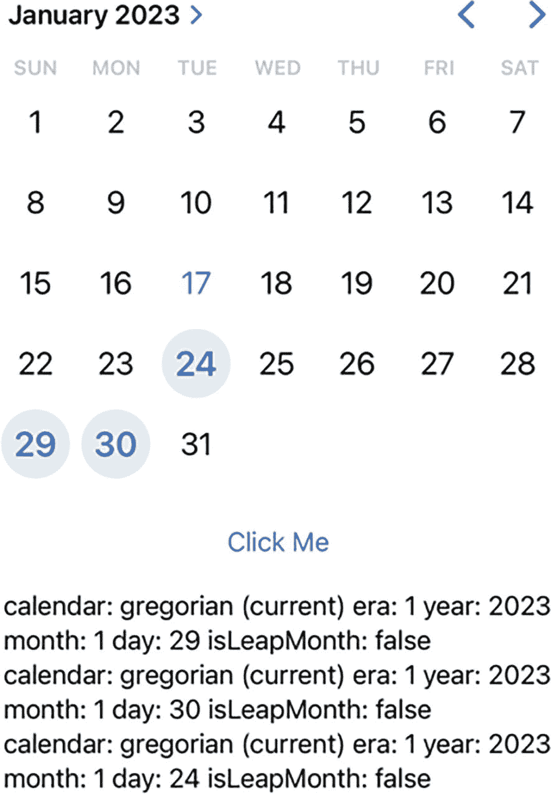
   *一个日历窗口的截图，显示月份和年份为 2023 年 1 月，选中了 17、24、29 和 30 等多个日期。它有一个“点击我”选项，底部有 3 组关于日历、纪元、月份、日以及是否为闰月的命令。*
   **图 8-12** 从 `MultiDatePicker` 中选中的日期。

2. 在 `VStack` 内部的 `MultiDatePicker` 下方添加一个 `Button` 和一个 `TextEditor`，如下所示：

   ```
   Button("点击我") {
       for x in dates {
           message += "\(x)" + "\n"
       }
   }
   TextEditor(text: $message)
   ```

   整个 `ContentView` 文件应如下所示：

   ```
   import SwiftUI
   struct ContentView: View {
       @State var dates = Set<DateComponents>()
       @State var message = ""
       var body: some View {
           VStack {
               MultiDatePicker("选择日期", selection: $dates)
               Button("点击我") {
                   for x in dates {
                       message += "\(x)" + "\n"
                   }
               }
               TextEditor(text: $message)
           }
           .padding()
       }
   }
   struct ContentView_Previews: PreviewProvider {
       static var previews: some View {
           ContentView()
       }
   }
   ```

3. 点击画布面板中的 Live 图标。
4. 在 `MultiDatePicker` 中点击多个日期。
5. 点击 `点击我` 按钮。你选中的日期会出现在 `TextEditor` 中，如图 8-12 所示。

```
@State var message = ""
```

注意，像 2023 年 1 月 24 日这样的日期，实际上被存储为 year: 2023, month: 1, day: 24。这种格式可能没什么用，所以我们需要做的是仅访问 `DateComponents` 结构体中的日期属性。


为了实现这一点，我们需要使用`DateFormatter`，如下所示：

1.  在当前`MultiDatePicker`项目中，在两个状态变量下方添加以下代码：

    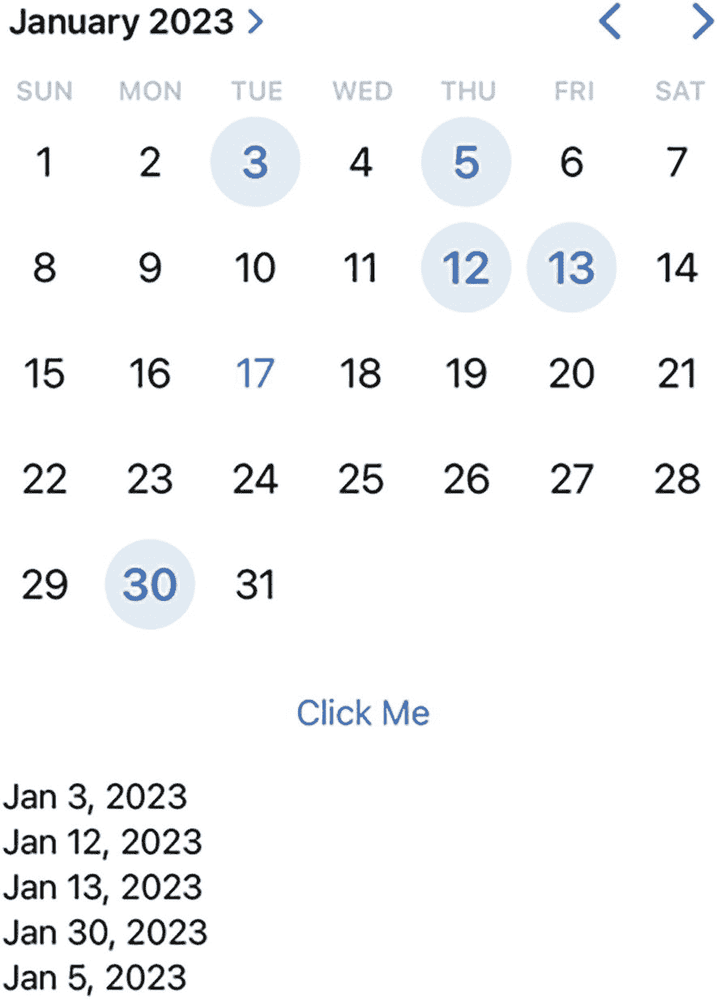

    *一个日历窗口的截图显示月份和年份为 2023 年 1 月，并选择了多个日期：3、5、12、13 和 30。它有一个“Click Me”选项，底部以月、日、年格式列出了上述选择的日期。*

    **图 8-13** 从`MultiDatePicker`中选择的已格式化日期

2.  修改`Button`代码如下：

    ```
    Button("Click Me") {
        for x in dates {
            //                    message += "\(x)" + "\n"
            message += dateFormatter.string(from: x.date!) + "\n"
        }
    }
    ```

    现在，`for`循环将使用`dateFormatter`以更熟悉的格式显示检索到的`date`属性，而不是显示原始的`DateComponents`数据。

3.  在定义`VStack`的最后一个花括号之后添加以下代码：

    ```
        .onAppear() {
            dateFormatter.dateStyle = .medium
            dateFormatter.locale = Locale(identifier: "en_US")
        }
    ```

    这将定义一个显示日期的样式（`.short`、`.medium`、`.long`和`.full`）。此外，它还定义了显示日期的区域设置，例如`"en_US"`。

整个`ContentView`文件应如下所示：

```
import SwiftUI

struct ContentView: View {
    @State var dates = Set<DateComponents>()
    @State var message = ""
    let dateFormatter = DateFormatter()

    var body: some View {
        VStack {
            MultiDatePicker("Select Dates", selection: $dates)
            Button("Click Me") {
                for x in dates {
                    //                    message += "\(x)" + "\n"
                    message += dateFormatter.string(from: x.date!) + "\n"
                }
            }
            TextEditor(text: $message)
        }
        .onAppear() {
            dateFormatter.dateStyle = .medium
            dateFormatter.locale = Locale(identifier: "en_US")
        }
        .padding()
    }
}

struct ContentView_Previews: PreviewProvider {
    static var previews: some View {
        ContentView()
    }
}
```

4.  点击 Canvas 面板中的“Live”图标。
5.  在`MultiDatePicker`中点击两个或更多日期。
6.  点击“Click Me”按钮。您选择的日期将出现在`TextEditor`中，并根据您选择的日期样式（如`.medium`或`.long`）进行格式化，如图 8-13 所示。

```
let dateFormatter = DateFormatter()
```

## 总结

文本字段（`TextField`）可以方便地让用户输入数据。不幸的是，用户可以在文本字段中输入任何内容，甚至是完全无意义的数据。为了将用户限制在有效选择的范围内，您可以使用选择器（`Picker`）。选择器可以提供所有有效选项的列表。这样，用户就无法通过选择器输入无效数据。

创建选择器时，您可以使用`.tag`属性为用户在选择器中的选择分配一个特定值。`.tag`属性可以保存任何类型的数据，例如整数、小数或字符串。所有`.tag`属性必须保存相同的数据类型。

作为使用多个`Text`视图的替代方案，您可以使用`ForEach`循环来检索选择器视图的选项，这些选项可以存储在数组或枚举中。当您需要显示大量选项（例如通过以滚轮形式显示的选择器视图）时，检索要在选择器视图上显示的选项尤其有用。

另一种显示有效选项列表的方式是通过颜色选择器（`ColorPicker`）。通过使用颜色选择器，用户可以选择标准颜色（如红色、绿色或蓝色）或创建自定义颜色。

为了选择日期，SwiftUI 提供了日期选择器（`DatePicker`）。您可以格式化日期的显示方式，例如`6/15/22`或`June 15, 2022`。日期选择器还可以以三种不同的样式（`.compact`、`.graphical`或`.wheel`）显示。这样，您就可以让日期选择器以最适合您应用程序的方式呈现。通过使用选择器，您可以轻松让用户只输入有效数据。

如果用户需要选择多个日期，请使用`MultiDatePicker`。它将选定的日期存储在一个集合中，您可能需要使用`DateFormatter`对其进行格式化。最终，选择器允许您为用户提供一系列固定的有效选项供其选择。

