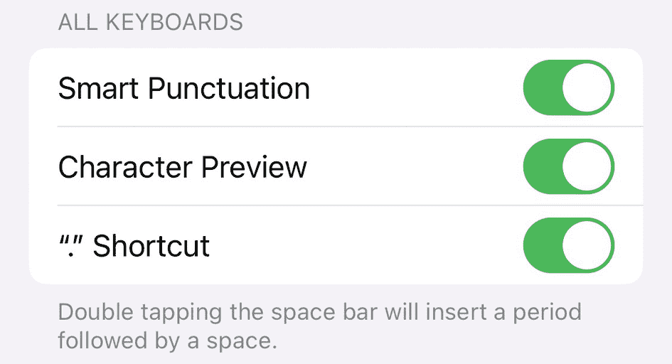
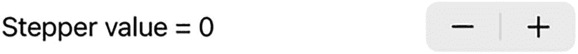
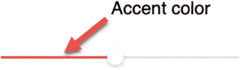
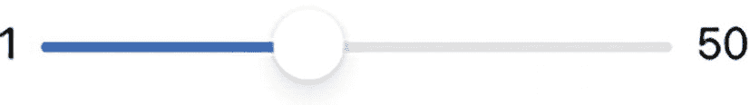

# 9. 使用切换开关（Toggles）、步进器（Steppers）和滑块（Sliders）来限制选择

理想情况下，您希望将用户限制为只选择有效选项。这可以防止用户输入无效数据，例如拼写数字（如“thirty-seven”）而不是输入数字（`37`）。另外三种将用户限制为只选择有效数据的方法是：切换开关、步进器和滑块。

切换开关（`Toggle`）为用户提供恰好两个选择，例如开/关、是/否、真/假。由于切换开关只提供两个选择，它表示一个布尔值（`true`或`false`）。

步进器（`Stepper`）将用户输入限制在有效数据范围内。步进器显示一个减号/加号图标，用户可以单击它来按固定量递增/递减一个值（向上或向下）。通过使用步进器，用户无需输入特定数字即可定义一个值。

滑块（`Slider`）也将用户输入限制在有效数据范围内。滑块允许用户通过拖拽来输入一个特定值，完全无需打字。步进器和滑块都可以定义最小值和最大值，以限制用户只能选择有效的数值。对于许多人来说，点击或拖拽选择一个值比输入数字本身更容易。步进器和滑块都表示一个`Double`值（十进制数）。

切换开关、滑块和步进器的全部目的，是确保用户在任何时候都只能向程序输入有效数据。


## 使用开关

如果你查看 iPhone 或 iPad 的设置，你会看到一系列可以打开或关闭的选项，如图 9-1 所示。



一张标题为“所有键盘”的截图，包含文本、智能标点、字符预览和快捷指令的开关，共三行。下方文字说明：双击空格键将插入一个句点后跟一个空格。

图 9-1

开关的典型用途

要创建一个开关，你需要定义显示在开关旁边的文本，同时将一个状态变量与开关链接或绑定，例如：

```
Toggle(isOn: $settingValue) {
Text("开关文本")
}
```

在这个示例中，开关会改变一个名为 `settingValue` 的状态变量的值，该变量应定义为布尔类型，如下所示：

```
@State var settingValue = true
```

然后，`Text` 视图会在开关旁边显示“开关文本”，如图 9-2 所示。


一张显示单个开关处于开启状态的截图，左侧有文本“开关文本”。

图 9-2

典型开关的外观

要了解开关的工作原理，请按照以下步骤操作：

1.  创建一个新的 SwiftUI iOS 应用项目，并为其任意命名，例如“Toggle”。
2.  点击导航窗格中的 `ContentView` 文件。
3.  在 `struct ContentView: View` 行下方添加以下状态变量：

    ```
    struct ContentView: View {
    @State var myToggle = true
    ```

4.  创建一个 `VStack` 并在其中放入一个 `Rectangle`。由于 `Rectangle` 会扩展以填满整个屏幕，请确保为其添加一个 `.frame` 修饰符，并使用之前定义的状态变量设置其 `.foregroundColor`：

    ```
    var body: some View {
    VStack {
    Rectangle()
    .frame(width: 200, height: 150)
    .foregroundColor(myToggle ? .orange : .green)
    }
    }
    ```

5.  在 `Rectangle` 及其修饰符下方添加开关，如下所示：

```
Toggle(myToggle ? "橙色" : "绿色", isOn: $myToggle)
```

整个 `ContentView` 文件应如下所示：

1.  点击画布窗格中的“实时”图标。注意，由于状态变量 `myToggle` 为 `true`，矩形初始显示为橙色。
2.  点击开关。注意，每次点击开关时，矩形的颜色会在橙色和绿色之间切换，开关上的文本也会在“橙色”和“绿色”之间交替。

```
import SwiftUI
struct ContentView: View {
@State var myToggle = true
var body: some View {
VStack {
Rectangle()
.frame(width: 200, height: 150)
.foregroundColor(myToggle ? .orange : .green)
Toggle(myToggle ? "橙色" : "绿色", isOn: $myToggle)
}
}
}
struct ContentView_Previews: PreviewProvider {
static var previews: some View {
ContentView()
}
}
```

## 使用步进器

当你希望用户输入数值数据时，你可能希望限制可接受数据的范围。毕竟，如果你询问用户的年龄，你不会希望得到 –23 或 938478，因为对于一个人的年龄来说，这两个值显然都是不可能的。为了让用户轻松输入可接受范围内的数值数据，你可以使用 `Stepper`。

`Stepper` 存储一个用户可以通过固定增量（如 1 或 2.5）递增的值。你可以定义 `Stepper` 可以表示的最小值和最大值，例如 1 到 10 的范围。此外，你还可以定义步进器是否循环。循环是指如果你持续增加步进器的值超过其最大值，它会回到最小值。同样，如果你持续减小步进器的值低于其最小值，它会跳转到最大值。这可以让用户轻松选择不同的值，而无需从一个极端值逐步调整到另一个极端值。

要了解 `Stepper` 的工作原理，请按照以下步骤操作：



步进器的截图。它包含文本“步进器值 = 0”，右侧有减号和加号操作符。

图 9-3

一个简单的步进器

1.  创建一个新的 SwiftUI iOS 应用项目，并为其任意命名，例如“Stepper”。
2.  点击导航窗格中的 `ContentView` 文件。
3.  在 `struct ContentView: View` 行下方添加以下状态变量：

    ```
    struct ContentView: View {
    @State var newValue = 0
    ```

4.  在 `var body: some View` 内部创建一个 `VStack` 并添加一个 `Stepper`，如下所示：

    ```
    var body: some View {
    VStack {
    Stepper(value: $newValue) {
    Text("步进器值 = \(newValue)")
    }.padding()
    }
    }
    ```

    这定义了一个简单的 `Stepper`，它可以表示任何值，并以 1 为增量增加或减少其值，如图 9-3 所示。

整个 `ContentView` 文件应如下所示：

1.  点击画布窗格中的“实时”图标来运行你的应用。
2.  点击 `Stepper` 上的减号和加号图标来减小或增加其值。

```
import SwiftUI
struct ContentView: View {
@State var newValue = 0
var body: some View {
VStack {
Stepper(value: $newValue) {
Text("步进器值 = \(newValue)")
}.padding()
}
}
}
struct ContentView_Previews: PreviewProvider {
static var previews: some View {
ContentView()
}
}
```

### 在步进器中定义范围

在许多情况下，你需要定义 `Stepper` 可以表示的有效值范围，例如从 1 到 25。要为 `Stepper` 定义范围，你需要在 `in:` 参数中列出该范围，如下所示：

```
Stepper(value: $newValue, in: 1...10) {
Text("步进器值 = \(newValue)")
}.padding()
```

要了解如何定义 `Stepper` 可以表示的值范围，请添加上述代码，使整个 `ContentView` 文件如下所示：

```
import SwiftUI
struct ContentView: View {
@State var newValue = 0
var body: some View {
VStack {
// 基本步进器
Stepper(value: $newValue) {
Text("步进器值 = \(newValue)")
}.padding()
// 范围步进器
Stepper(value: $newValue, in: 1...10) {
Text("步进器值 = \(newValue)")
}.padding()
}
}
}
struct ContentView_Previews: PreviewProvider {
static var previews: some View {
ContentView()
}
}
```

点击画布窗格中的“实时”图标，然后点击底部的 `Stepper`。注意，由于它的范围被限制在 1 到 10 之间，点击底部 `Stepper` 的减号和加号图标将无法将 `Stepper` 的值减小到 1 以下或增加到 10 以上。


### 在步进器中定义增量/减量值

通常，`Stepper`（步进器）会按 1 来增减其值。有时你可能想要按 1 以外的数值，例如 2 或 5 来增减。要定义一个用于增减 `Stepper` 值的整数，你需要为 `step:` 参数定义一个整数值，如下所示：

```
Stepper(value: $newValue, in: 1...10, step: 2) {
    Text("Stepper value = \(newValue)")
}.padding()
```

完整的 `ContentView` 文件应如下所示：

```
import SwiftUI

struct ContentView: View {
    @State var newValue = 0

    var body: some View {
        VStack {
            Stepper(value: $newValue) {
                Text("Stepper value = \(newValue)")
            }.padding()

            // 在指定范围内的步进器
            Stepper(value: $newValue, in: 1...10) {
                Text("Stepper value = \(newValue)")
            }.padding()

            // 在指定范围内并带增量值的步进器
            Stepper(value: $newValue, in: 1...10, step: 2) {
                Text("Stepper value = \(newValue)")
            }.padding()
        }
    }
}

struct ContentView_Previews: PreviewProvider {
    static var previews: some View {
        ContentView()
    }
}
```

点击画布面板中的“Live”图标，然后点击底部的 `Stepper`。请注意，由于其范围被限制在 1 到 10 之间，点击底部 `Stepper` 的“–”和“+”图标不会将值减至 1 以下或增至 10 以上。然而，点击这些图标会使该 `Stepper` 的值按 2 进行增减。

如果你想为 `step:` 参数定义一个十进制值，你需要确保在 `Stepper` 中使用的所有值都是十进制类型，例如：

```
Stepper(value: $decimalValue,
        in: 1.0...10.0,
        step: 0.25) {
    Text("Stepper value = \(decimalValue)")
}.padding()
```

在上述 `Stepper` 定义中，范围是从 1.0（不仅仅是 1）到 10.0（包含）。然后 `step:` 参数被定义为 0.25。最后，`State` 变量（`decimalValue`）也必须定义为十进制值（`Double` 数据类型），如下所示：

```
@State var decimalValue: Double = 0
```

完整的 `ContentView` 文件应如下所示：

```
import SwiftUI

struct ContentView: View {
    @State var newValue = 0
    @State var decimalValue: Double = 0

    var body: some View {
        VStack {
            // 基础步进器
            Stepper(value: $newValue) {
                Text("Stepper value = \(newValue)")
            }.padding()

            // 在指定范围内的步进器
            Stepper(value: $newValue, in: 1...10) {
                Text("Stepper value = \(newValue)")
            }.padding()

            // 带增量值的步进器
            Stepper(value: $newValue, in: 1...10, step: 2) {
                Text("Stepper value = \(newValue)")
            }.padding()

            // 带十进制增量值的步进器
            Stepper(value: $decimalValue,
                    in: 1.0...10.0,
                    step: 0.25) {
                Text("Stepper value = \(decimalValue)")
            }.padding()
        }
    }
}

struct ContentView_Previews: PreviewProvider {
    static var previews: some View {
        ContentView()
    }
}
```

点击画布面板中的“Live”图标，然后点击底部的 `Stepper`。请注意，由于其范围被限制在 1.0 到 10.0 之间，点击底部 `Stepper` 的“–”和“+”图标不会将值减至 1.0 以下或增至 10.0 以上。然而，点击这些图标会使该 `Stepper` 的值按 0.25 进行增减。

## 使用滑块

与 `Stepper` 类似，`Slider`（滑块）允许用户在不输入特定数字的情况下选择数值。`Stepper` 迫使用户按固定量增减值，而滑块则使用户能够通过简单地改变 `Slider` 的位置，快速在某个值域范围内进行选择。这使得 `Slider` 比 `Stepper` 更适合让用户从大范围的值中做选择。

尽管 `Slider` 可以表示任何 `Double` 数据类型（十进制数），但默认情况下其值域范围为 0 到 1，最左侧代表 0，最右侧代表 1。

要了解 `Slider` 的工作原理，请遵循以下步骤：

1.  创建一个新的 SwiftUI iOS 应用项目，并为其任意命名，例如“Slider”。

2.  在导航器面板中点击 `ContentView` 文件。

3.  在 `struct ContentView: View` 行下方添加以下 `State` 变量：

```
struct ContentView: View {
    @State var sliderValue = 0.0
```

4.  在 `var body: some View` 内部创建一个 `VStack`，并添加一个 `Text` 和一个 `Slider`，如下所示：

```
var body: some View {
    VStack (spacing: 28){
        Text("Slider value = \(sliderValue)")
        Slider(value: $sliderValue)
    }
}
```

5.  点击画布面板中的“Live”图标，然后将 `Slider` 左右拖动。请注意，此 `Slider` 的值域范围为 0 到 1，是一个 `Double` 值，会显示为十进制数。

### 更改滑块的颜色

默认情况下，当你向右拖动 `Slider` 时，它会显示蓝色。如果你想更改该颜色，可以使用 `.accentColor` 修饰符，如图 9-4 所示：



**图 9-4** – `Slider` 上的强调色

```
Slider(value: $sliderValue)
    .accentColor(.red)
```

### 为滑块定义范围

默认情况下，`Slider` 的值域范围是 0 到 1。但是，你可能希望为 `Slider` 定义不同的范围，例如：

```
Slider(value: $sliderValue, in: 1...50)
```

这将 `Slider` 的最小值定义为 1，最大值定义为 50。请记住，这些值实际上是十进制值，例如 1.0 到 50.0。

### 为滑块定义步进增量

如果 `Slider` 的范围大于 1，拖动 `Slider` 会按 1 增减。要为 `Slider` 定义不同的增减量，你需要定义一个 `step:` 参数，例如：

```
Slider(value: $sliderValue, in: 1...50, step: 4)
```

这将把 `Slider` 的值的改变量定义为 4，例如从 1 变为 5，再变为 9。

### 在滑块上显示最小值和最大值标签

为了使 `Slider` 更易于理解，你可以在 `Slider` 的两端显示最小值和最大值的标签。这样你可以清晰地表明`Slider` 的最小值和最大值可能是什么，例如：

```
Slider(value: $sliderValue, in: 1...50, step: 4) {
    Text("Slider")
} minimumValueLabel: {
    Text("1")
} maximumValueLabel: {
    Text("50")
}
```

这将定义一个在左侧显示 0，在右侧显示 50 的 `Slider`，如图 9-5 所示：



**图 9-5** – 在 `Slider` 上显示最小值和最大值标签

要查看所有这些不同滑块的工作方式，请按如下方式编辑 `ContentView` 文件：

```
import SwiftUI

struct ContentView: View {
    @State var sliderValue = 0.0

    var body: some View {
        VStack (spacing: 28){
            Text("Slider value = \(sliderValue)")

            Slider(value: $sliderValue)
                .padding()

            Slider(value: $sliderValue, in: 1...50)
                .padding()

            Slider(value: $sliderValue, in: 1...50, step: 4)
                .padding()

            Slider(value: $sliderValue, in: 1...50, step: 4) {
                Text("Slider")
            } minimumValueLabel: {
                Text("1")
            } maximumValueLabel: {
                Text("50")
            }.padding()
        }
    }
}

struct ContentView_Previews: PreviewProvider {
    static var previews: some View {
        ContentView()
    }
}
```

当你运行这个项目时，顶部的 `Slider` 的值域范围为 0 到 1。这意味着当你拖动其他滑块时，顶部的 `Slider` 会立即移动到最右侧。这是因为顶部 `Slider` 的最大值只能是 1，而其他滑块的值域范围是 1 到 50。因此，拖动其他滑块时，总是会将顶部 `Slider` 固定在最右侧，以表示值 1，这是它能表示的最大值。


