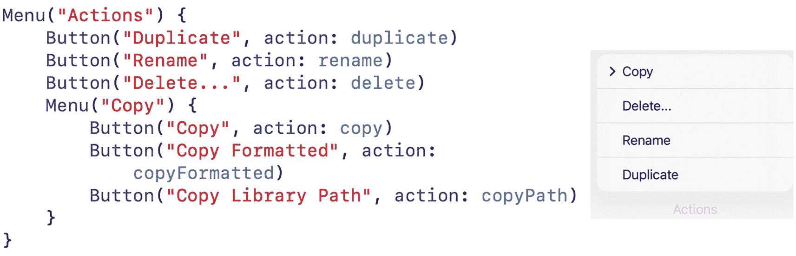
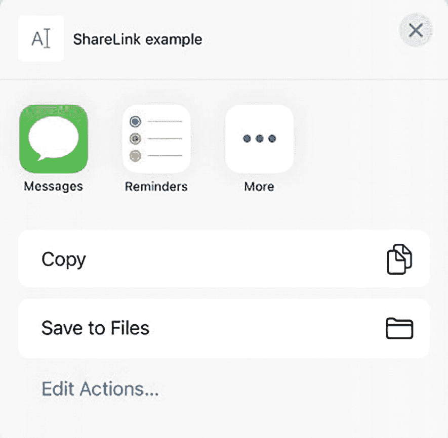
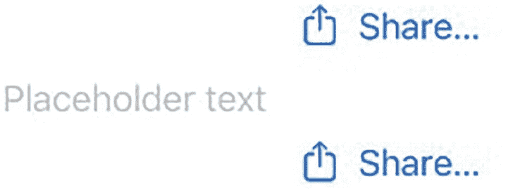
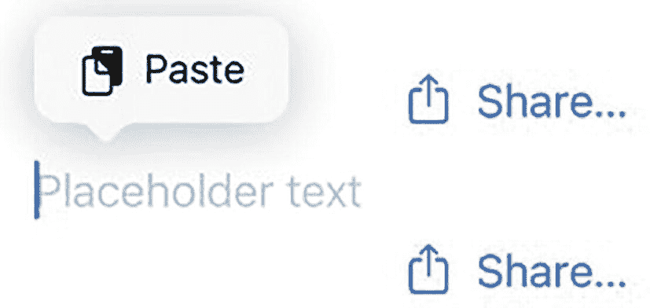
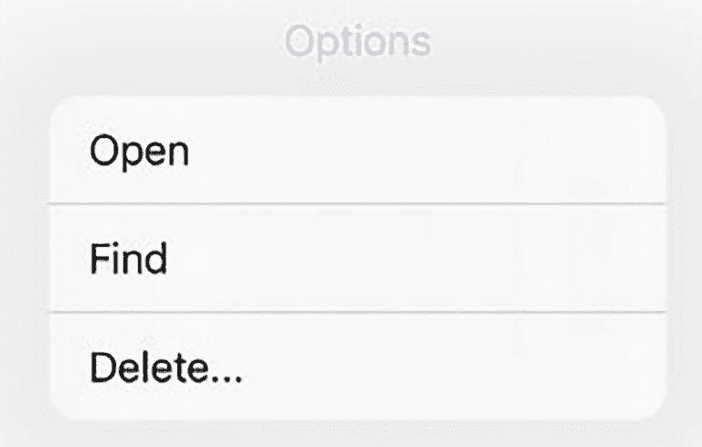
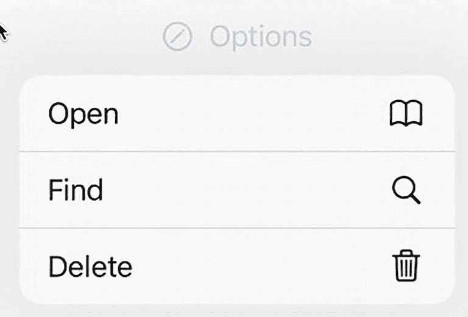
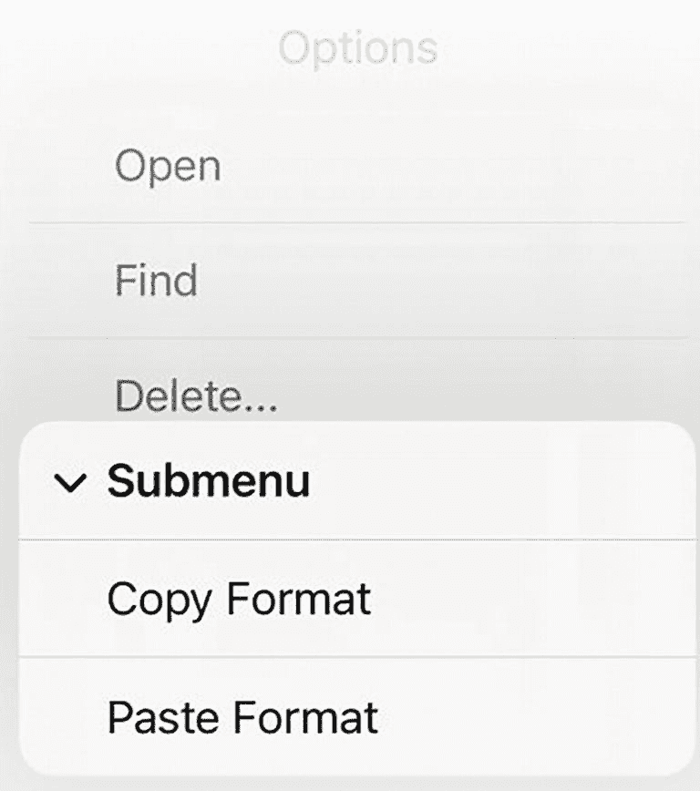
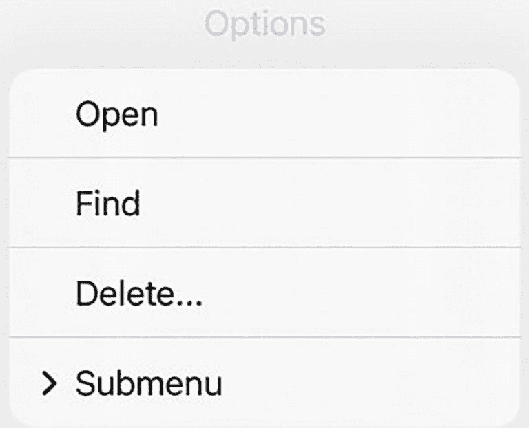

# 10. 使用链接和菜单提供选项

曾经，App 只需要按钮就能让用户选择命令。随着 iPhone 和 iPad App 变得越来越复杂，允许用户选择命令的替代方式的需求也随之增长。两种常见的向用户显示可选项以供选择的方式是链接和菜单。

`Link`（链接）类似于 `Button`（按钮），不同之处在于它会打开浏览器来显示网站内容。`Menu`（菜单）允许你显示一个选项列表，其中还可以包含子菜单，如图 10-1 所示。



**图 10-1**：一个显示选项列表（包含子菜单）的 `Menu`。

## 使用链接

链接提供了一种便捷的方式，让用户可以在 App 内访问网站。`Link` 定义一个网址，例如：

```swift
Link(destination: URL(string: "https://www.apple.com")! ) {
    Text("Apple")
}
```

`Text` 视图定义了链接上显示的文本。你可以向此 `Text` 视图添加任何你想要的修饰符，例如定义字体或背景颜色。

`Link` 必须将 `destination` 定义为 `URL`。确保网址准确的一种方法是访问所需网站，然后从浏览器中复制其地址，再粘贴到你的 Swift 代码中。

**注意**：要测试 `Link` 是否成功加载网址，你需要在模拟器或实际的 iOS 设备上测试项目。画布窗格无法像模拟器或 iOS 设备那样打开 Safari 浏览器。

## 使用 ShareLink

普通的 `Link` 就像一个超链接，可以将用户带到特定的网页。`ShareLink`（共享链接）让用户可以点击一个链接，该链接会显示一个共享表单，为用户提供复制数据或与其他 App 共享数据的选项，如图 10-2 所示。



**图 10-2**：一个 `ShareLink` 显示一个共享表单，其中包含用于与其他 App 共享数据的选项。

最简单的 `ShareLink` 只定义一个要共享的项目，它可以是一个字符串或 `URL`，例如：

```swift
ShareLink(item: "This text will be shared")
ShareLink(item: URL(string: "https://www.apple.com")!)
```

除了直接在 `ShareLink` 中输入字符串或 `URL`，你也可以使用变量，例如：

```swift
let shareText = "This text will be shared"
ShareLink(item: shareText)
let url = URL(string: "https://www.apple.com")!
ShareLink(item: url)
```

默认情况下，`ShareLink` 只显示一个共享图标和“Share…”字样，如图 10-3 所示。


**图 10-3**：`ShareLink` 的默认外观显示一个共享图标和“Share…”字样

当用户点击 `ShareLink` 时，会出现一个共享表单（见图 10-2），允许用户将 `ShareLink` 中的数据与其他 App 共享。要了解其工作原理，请按照以下步骤操作：



**图 10-4**：包含两个 `ShareLink` 和一个 `TextField` 的用户界面。

1. 创建一个新的 SwiftUI iOS App 项目，并为其指定任意名称，例如“ShareLink”。
2. 在导航器窗格中点击 `ContentView` 文件。
3. 在 `struct ContentView: View {` 代码行下方添加以下 `@State` 变量和常量：

   ```swift
   @State var message = ""
   let shareText = "This text will be shared"
   let url = URL(string: "https://www.apple.com")!
   ```

4. 将 `var body: some View {` 代码行下方的 `VStack` 编辑为如下所示：

   ```swift
   VStack {
       ShareLink(item: "This text will be shared")
       TextField("Placeholder text", text: $message)
       ShareLink(item: URL(string: "https://www.apple.com")!)
   }
   ```

   这将创建两个 `ShareLink`，中间由一个 `TextField` 隔开，如图 10-4 所示。

整个 `ContentView` 文件应如下所示：



**图 10-5**：`TextField` 上方的粘贴菜单。

5. 点击画布窗格中的“Live”图标。
6. 点击顶部或底部的 `ShareLink`。将出现一个共享表单（见图 10-2）。
7. 点击共享表单上的“Copy”。共享表单消失。
8. 点击 `TextField` 并按住鼠标左键（或触控板），直到弹出粘贴菜单，如图 10-5 所示。

   ```swift
   import SwiftUI
   struct ContentView: View {
       @State var message = ""
       let shareText = "This text will be shared"
       let url = URL(string: "https://www.apple.com")!
       var body: some View {
           VStack {
               ShareLink(item: "This text will be shared")
               TextField("Placeholder text", text: $message)
               ShareLink(item: URL(string: "https://www.apple.com")!)
           }
           .padding()
       }
   }
   struct ContentView_Previews: PreviewProvider {
       static var previews: some View {
           ContentView()
       }
   }
   ```

9. 点击“Paste”。由 `ShareLink` 定义的项目（“This text will be shared”或 `https://www.apple.com`）将出现在 `TextField` 中。


### 自定义 `ShareLink`

除了显示默认的分享图标和“分享…”字样外，你还可以通过定义分享内容和 `ShareLink` 的外观（使用文本、图标或两者结合）来自定义 `ShareLink` 的样式。

要在 `ShareLink` 上显示自定义文本，你需要像这样先定义自定义文本，再定义要分享的项目，这将创建一个如图 10-6 所示的 `ShareLink`：


图 10-6 — 定义 `ShareLink` 中显示的自定义文本

```
ShareLink("自定义文本此处", item: URL(string: "https://www.apple.com")!)
```

如果你复制并粘贴了上面的 `ShareLink`，你将会分享 [`https://www.apple.com`](https://www.apple.com) 这个网站地址。请注意，上面的 `ShareLink` 仍然显示默认的分享图标。如果你不想显示这个分享图标，你需要使用 `Text` 视图来定义 `ShareLink` 中显示的文本，如下所示：

```
ShareLink(item: "这段文本将被分享") {
    Text("自定义 ShareLink 文本")
}
```

上面的 `ShareLink` 将在用户界面上只显示“自定义 ShareLink 文本”，但不会显示分享图标。如果你只想显示一个图标而不显示任何文本，你可以像这样使用 `Image` 视图：

```
ShareLink(item: "ShareLink 示例") {
    Image(systemName: "tortoise")
}
```

这个 `ShareLink` 会显示一个乌龟图标。你可以从苹果免费程序 SF Symbols 的图标列表中选择你想要的任何图标（[`https://developer.apple.com/sf-symbols`](https://developer.apple.com/sf-symbols)）。

如果你想为 `ShareLink` 同时显示自定义图标和文本，请使用 `Label` 视图，它可以让你同时自定义 `Text` 视图和 `Image` 视图，如图 10-7 所示：


图 10-7 — 使用图标和文本自定义 `ShareLink`

```
ShareLink(item: "ShareLink 示例") {
    Label {
        Text("自定义 ShareLink 文本")
    } icon: {
        Image(systemName: "hare")
    }
}
```

`ShareLink` 会分享 `item:` 参数定义的任何内容，比如一个字符串（“ShareLink 示例”）或一个 URL（“[`www.apple.com`](http://www.apple.com)”）。

1.  创建一个新的 SwiftUI iOS App 项目，并任意取名，例如“ShareLink Custom”。
2.  在导航窗格中点击 `ContentView` 文件。
3.  在 `struct ContentView: View` 代码行下方添加以下 `State` 变量：
    ```
    @State var message = ""
    ```
4.  像这样修改 `var body: some View` 代码行下方的 `VStack`：
    ```
    VStack (spacing: 55) {
        ShareLink(item: "这段文本将被分享") {
            Text("自定义 ShareLink 文本")
        }
        ShareLink(item: "仅一个图标可分享") {
            Image(systemName: "tortoise")
        }
        ShareLink(item: "自定义图标和文本") {
            Label {
                Text("自定义 ShareLink 文本")
            } icon: {
                Image(systemName: "hare")
            }
        }
        TextField("占位符文本", text: $message)
    }
    ```

这将创建三个 `ShareLink` 和一个 `TextField`。第一个 `ShareLink` 仅显示文本，第二个 `ShareLink` 仅显示图标，第三个 `ShareLink` 同时显示自定义图标和文本。

整个 `ContentView` 文件应该如下所示：

```
import SwiftUI
struct ContentView: View {
    @State var message = ""
    var body: some View {
        VStack (spacing: 55) {
            ShareLink(item: "这段文本将被分享") {
                Text("自定义 ShareLink 文本")
            }
            ShareLink(item: "仅一个图标可分享") {
                Image(systemName: "tortoise")
            }
            ShareLink(item: "自定义图标和文本") {
                Label {
                    Text("自定义 ShareLink 文本")
                } icon: {
                    Image(systemName: "hare")
                }
            }
            TextField("占位符文本", text: $message)
        }
        .padding()
    }
}
struct ContentView_Previews: PreviewProvider {
    static var previews: some View {
        ContentView()
    }
}
```

2.  点击画布窗格中的“Live”图标。
3.  点击任意一个 `ShareLink`。将出现一个分享表单（见图 10-2）。
4.  点击“复制”。分享表单消失。
5.  点击 `TextField` 并按住鼠标左键（或触控板），直到出现“粘贴”菜单（见图 10-5）。
6.  点击“粘贴”。你选择的 `ShareLink` 中的文本现在会出现在 `TextField` 中。


## 使用菜单

有时您可能想为用户提供多个选项。在屏幕上塞满多个按钮可能显得笨拙，就连分段控件也可能限制过多。当您需要在狭小空间内展示多个选项时，就可以使用 `Menu`。

`Menu` 在用户界面上仅以 `Button` 的形式呈现。当用户点击它时，`Menu` 会显示一个选项列表（见图 10-1）。现在用户可以点击某个选项，或打开另一个子菜单以查看更多选项。`Menu` 使得在有限空间中隐藏多个选项变得轻而易举。

最简单的 `Menu` 由标题和由 `Button` 定义的选项列表组成，如下所示：

```
Menu("Options") {
    Button("打开 ", action: openFile)
    Button("查找", action: findFile)
    Button("删除...", action: deleteFile)
}
```

上述代码会在屏幕上显示一个带有“Options”文字的 `Menu`。当用户点击“Options”时，会出现一个菜单，列出三个选项——打开、查找和删除……——如图 10-8 所示。



*Options 选项卡的截图。列出的三个选项分别为“打开”、“查找”和“删除”。*

**图 10-8** — `Menu` 在下拉菜单中显示一组 `Button`

当用户点击某个 `Button` 时，该 `Button` 会调用如 `openFile`、`findFile` 或 `deleteFile` 等函数。请注意，这些函数调用不包含参数列表，例如 `openFile()`。要了解如何创建简单的 `Menu`，请按以下步骤操作：

1. 创建一个新的 SwiftUI iOS App 项目，并随意命名，例如“MenuSimple”。

2. 在导航器窗格中点击 `ContentView` 文件。

3. 在 `struct ContentView: View` 行下方添加以下 `State` 变量：

    ```
    @State var message = ""
    ```

4. 将 `var body: some View` 下的 `VStack` 修改如下：

    ```
    var body: some View {
        VStack {
            Text(message)
                .padding()
            Menu("Options") {
                Button("打开 ", action: openFile)
                Button("查找", action: findFile)
                Button("删除...", action: deleteFile)
            }
            Spacer()
        }
    }
    ```

    所有三个 `Button` 都调用函数来执行操作。因此我们需要创建函数来让这些 `Button` 生效。

5. 在 `struct ContentView: View` 的最后一个右花括号上方，添加以下三个函数：

    ```
    func openFile() {
        message = "已选择打开"
    }
    func findFile() {
        message = "已选择查找"
    }
    func deleteFile() {
        message = "已选择删除"
    }
    ```

    完整的 `ContentView` 文件应如下所示：

    ```
    import SwiftUI

    struct ContentView: View {
        @State var message = ""

        var body: some View {
            VStack {
                Text(message)
                    .padding()
                Menu("Options") {
                    Button("打开 ", action: openFile)
                    Button("查找", action: findFile)
                    Button("删除...", action: deleteFile)
                }
            }
        }

        func openFile() {
            message = "已选择打开"
        }

        func findFile() {
            message = "已选择查找"
        }

        func deleteFile() {
            message = "已选择删除"
        }
    }

    struct ContentView_Previews: PreviewProvider {
        static var previews: some View {
            ContentView()
        }
    }
    ```

6. 在画布窗格中点击“Live”图标。

7. 在模拟的 iOS 设备中间点击“Options”按钮。会出现一个菜单，列出由三个 `Button` 视图定义的三个选项：打开、查找和删除……

8. 点击任意选项。请注意，无论选择哪个选项，它都会在 `Menu` 上方的 `Text` 视图中显示略有不同的消息。

请注意，`Menu` 中的每个 `Button` 都调用了由 `action:` 参数定义的函数。除了调用函数，您也可以将一条或多条命令直接放在花括号内，如下所示：

```
Menu("Options") {
    Button("打开 ", action: {
        message = "已选择打开"
    })
    Button("查找", action: {
        message = "已选择查找"
    })
    Button("删除...", action: {
        message = "已选择删除"
    })
}
```

### 格式化菜单和按钮的标题

`Menu` 允许您定义一个像标准 `Button` 一样显示的标题。但是，如果您想格式化标题，还有一种替代方式来定义 `Menu`。除了仅定义要显示为标题的文字外，您还可以定义一个 `label:` 参数，在其中使用 `Text` 或 `Label` 视图，如下所示：

```
Menu {
    Button("打开 ", action: {
        message = "已选择打开"
    })
    Button("查找", action: {
        message = "已选择查找"
    })
    Button("删除...", action: {
        message = "已选择删除"
    })
} label: {
    Text("Options")
        .font(.largeTitle)
        .foregroundColor(.purple)
        .italic()
}
```

此示例使用 `.largeTitle` 字体、紫色和斜体显示 `Menu` 的标题。除了使用 `Text` 视图，您还可以使用 `Label` 视图来并排显示图标和文字，例如：

```
Menu {
    Button("打开 ", action: {
        message = "已选择打开"
    })
    Button("查找", action: {
        message = "已选择查找"
    })
    Button("删除...", action: {
        message = "已选择删除"
    })
} label: {
    Label("Options", systemImage: "pencil.circle")
}
```

通过使用 `label:` 参数来定义 `Menu` 的标题，您可以通过多种方式定制 `Menu` 的标题。使用上述 `Label` 视图会显示带有图标和文字的 `Menu`，如图 10-9 所示。


*一个选项图标。*

**图 10-9** — `Label` 视图为 `Menu` 标题显示图标和文字

您还可以使用 `Label` 视图（而非 `Text` 视图）来格式化 `Button` 标题，如下所示：

```
Menu {
    Button(action: {
        message = "已选择打开"
    }) {
        Label("打开", systemImage: "book")
    }
    Button(action: {
        message = "已选择查找"
    }) {
        Label("查找", systemImage: "magnifyingglass")
    }
    Button(action: {
        message = "已选择删除"
    }) {
        Label("删除", systemImage: "trash")
    }
} label: {
    Label("Options", systemImage: "pencil.circle")
}
```

上述代码会显示一个 `Menu` 列表，如图 10-10 所示。



*Options 选项卡的截图。三个选项分别标记为“打开”、“查找”和“删除”，并带有对应符号。*

**图 10-10** — 使用 `Label` 视图在 `Menu` 列表中显示 `Button`


### 添加子菜单

一个`Menu`可以显示由`Button`定义的选项列表。但除此之外，`Menu`还可以显示子菜单，用于列出额外的相关命令，如图 10-11 所示。



*选项标签页的截图。三个选项分别标注为“打开”、“查找”和“删除”。子菜单包含“复制格式”和“粘贴格式”。*

**图 10-11** — 显示子菜单

要创建子菜单，只需定义另一个`Menu`来代替`Button`。然后在子菜单内部包含额外的`Button`，如下所示：

```
Menu("选项") {
    Button("打开", action: openFile)
    Button("查找", action: findFile)
    Button("删除...", action: deleteFile)
    Menu("子菜单") {
        Button("复制格式", action: copyFormat)
        Button("粘贴格式", action: pasteFormat)
    }
}
```

**注意**

在子菜单内部创建子菜单是可行的。但通常作为一般规则，只使用一级子菜单，否则过多的选项列表可能会让用户感到困惑。

要了解子菜单的工作原理，请按照以下步骤操作：



*选项标签页的截图。三个选项分别标注为“打开”、“查找”和“删除”。子菜单由右箭头符号表示。*

**图 10-12** — `>`符号标识一个子菜单

1.  创建一个新的 SwiftUI iOS App 项目，并为其任意命名，例如“Submenu”。
2.  在导航器面板中点击`ContentView`文件。
3.  编辑`ContentView`文件，使其全部内容如下所示：

    ```
    import SwiftUI
    struct ContentView: View {
        @State var message = ""
        var body: some View {
            VStack {
                Text(message)
                    .padding()
                Menu("选项") {
                    Button("打开", action: openFile)
                    Button("查找", action: findFile)
                    Button("删除...", action: deleteFile)
                    Menu("子菜单") {
                        Button("复制格式", action: copyFormat)
                        Button("粘贴格式", action: pasteFormat)
                    }
                }
                Spacer()
            }
        }
        func openFile() {
            message = "已选择打开"
        }
        func findFile() {
            message = "已选择查找"
        }
        func deleteFile() {
            message = "已选择删除"
        }
        func copyFormat() {
            message = "已选择复制格式"
        }
        func pasteFormat() {
            message = "已选择粘贴格式"
        }
    }
    struct ContentView_Previews: PreviewProvider {
        static var previews: some View {
            ContentView()
        }
    }
    ```

4.  在画布面板中点击“实时”图标。
5.  点击由`Menu`定义的“选项”。这将显示一个选项列表，其中包含由`>`符号标识的子菜单，如图 10-12 所示。
6.  点击子菜单，即可看到额外的选项列表出现。

子菜单便于将相关选项分组在一起，但由于这些选项最初是隐藏的，请谨慎使用子菜单，以免让用户感到困惑。

## 本章小结

链接和菜单是用户界面为用户提供可选选项的另外两种方式。`Link`用于打开浏览器并跳转至特定网站。`ShareLink`允许你与其他应用共享信息。菜单则显示由`Button`和其他用于定义子菜单的`Menu`组成的选项列表。

通过在`Menu`中使用`Label`视图，你可以将图标与文本并排组合。通过在`Menu`中使用`Text`视图，你可以自定义用户界面上显示的文本外观，例如选择字体或颜色。菜单提供了一种在不占用太多屏幕空间的情况下向用户显示多个选项的方式。

