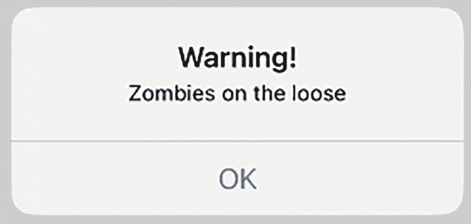
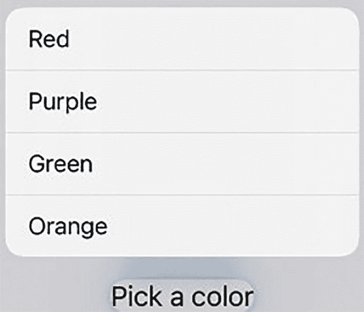
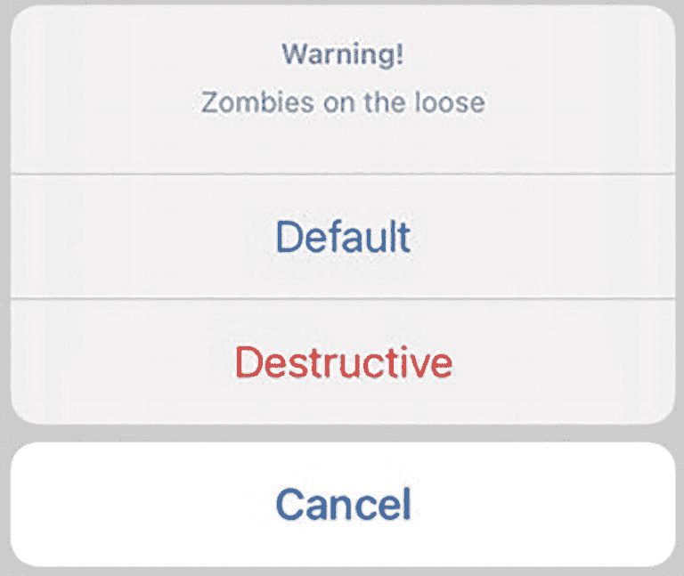
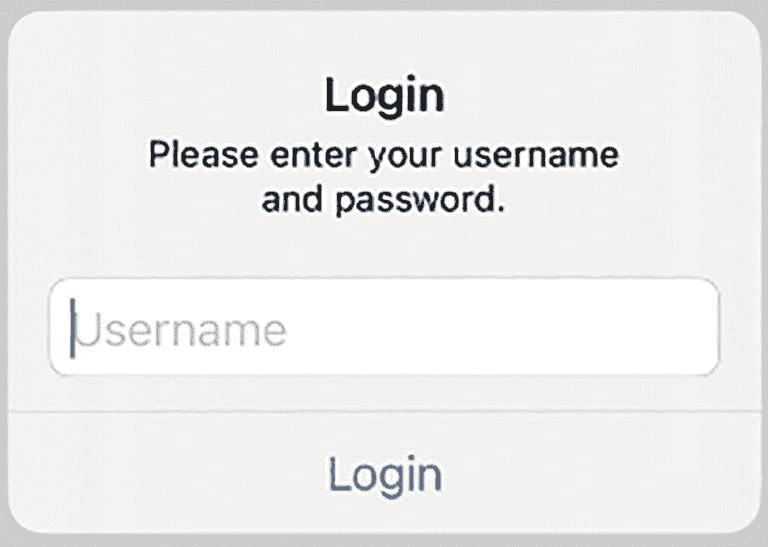
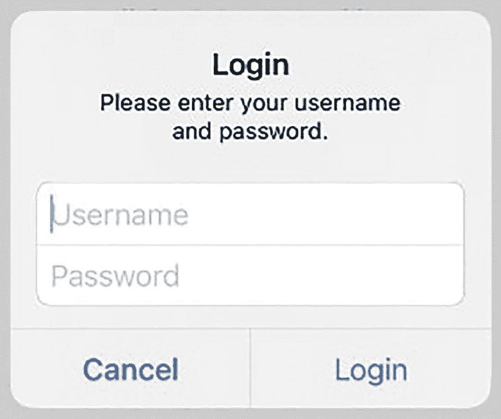

# 12. 使用警告框、操作列表和上下文菜单

几乎每个应用都需要向用户显示并接收数据。显示数据的最简单方式是通过`Text`视图，但有时你需要展示数据并给用户提供回应方式。此时，你可以使用`Alert`（警告框）或`Action Sheet`（操作列表）。另一种向用户显示选项的方式是上下文菜单。

`Alert`会在屏幕上弹出，让用户有机会做出回应。用户可以通过点击一个或多个按钮来关闭`Alert`，如图 12-1 所示。



一个显示警告信息的对话框截图。文字显示"僵尸出没"。底部有一个"确定"按钮。

图 12-1

一个`Alert`通常显示一条消息和一个或多个按钮

`Action Sheet`看起来与`Alert`几乎相同，区别在于`Alert`出现在屏幕中央，而`Action Sheet`从底部滑入并显示在屏幕底部。`Alert`更侧重于吸引用户注意，例如在你要删除无法恢复或撤销的数据时发出警告。而操作列表则更侧重于作为提醒，可能不那么关键或具有破坏性。

上下文菜单在长按`Text`视图等视图后出现。它会弹出一个选项列表供用户选择，如图 12-2 所示。



一个上下文菜单的截图，包含红色、紫色、绿色和橙色等颜色选项列表。底部文字显示"选择一种颜色"。

图 12-2

上下文菜单列出多个选项供选择

## 显示警告框/操作列表

每个用户界面都需要向用户回显数据。在某些情况下，这些数据可以仅通过标签显示，但有时你需要确保用户看到特定信息。在这些情况下，你应该使用警告控制器。

`Alert`/`Action Sheet`会覆盖在应用的用户界面之上，并可通过更改以下属性进行自定义：

*   标题 – 显示在`Alert`/`Action Sheet`顶部的文本，通常为粗体大字号
*   消息 – 显示在标题下方、字号较小的文本
*   一个或多个按钮 – 可关闭`Alert`/`Action Sheet`的按钮

标题通常由单个单词或短语组成，用以说明警告控制器的用途，例如显示"警告"或"登录"。要关闭`Alert`/`Action Sheet`，你至少需要一个按钮。

要了解如何创建一个仅显示标题、消息和关闭按钮的简单`Alert`/`Action Sheet`，请按照以下步骤操作：

1.  创建一个新的 SwiftUI iOS App 项目，并为其任意命名，例如"Alert"。
2.  在导航器窗格中点击`ContentView`文件。
3.  在`struct ContentView: View`行下添加以下`State`变量：

    ```
    @State var showAlert = false
    ```

4.  添加一个包含`Button`的`VStack`，如下所示：

    ```
    var body: some View {
        VStack {
            Button("Show Alert") {
                showAlert.toggle()
            }
        }
    }
    ```

5.  向`Button`添加`.alert`修饰符，如下所示：

    ```
    .alert(isPresented: $showAlert) {
        Alert(title: Text("Warning!"), message: Text("Zombies on the loose"), dismissButton: .default(Text("OK")))
    }
    ```

    当`showAlert`的`State`变量为`true`时，此`.alert`修饰符会显示一个`Alert`。它使用一个`Text`视图显示"Warning!"，并使用第二个`Text`视图显示"Zombies on the loose"。最后，它使用第三个`Text`视图在`Button`上显示"OK"。

注意
    `Alert`使用`dismissButton:`参数来定义单个显示的按钮。为简化代码，你可以直接使用样式（`.default`）来定义`Button`的外观，而不是使用更长的版本，例如：`Alert.Button.default`。

整个`ContentView`文件应如下所示：

```
import SwiftUI

struct ContentView: View {
    @State var showAlert = false
    
    var body: some View {
        VStack {
            Button("Show Alert") {
                showAlert.toggle()
            }
            .alert(isPresented: $showAlert) {
                Alert(title: Text("Warning!"), message: Text("Zombies on the loose"), dismissButton: .default(Text("OK")))
            }
        }
    }
}

struct ContentView_Previews: PreviewProvider {
    static var previews: some View {
        ContentView()
    }
}
```

6.  点击画布窗格中的"Live"图标，然后点击`Button`以显示屏幕中央的`Alert`（参见图 12-1）。
7.  点击"OK"关闭`Alert`。
8.  将`.alert`替换为`.actionSheet`，如下所示：

    ```
    .actionSheet(isPresented: $showAlert) {
        ActionSheet(title: Text("Warning!"), message: Text("Zombies on the loose"), buttons: [.default(Text("OK"))])
    }
    ```

注意
    在`Alert`使用`dismissButton:`参数定义`Button`的地方，`ActionSheet`使用`buttons:`参数，并将一个或多个按钮用方括号`[ ]`括起来（类似数组）。为简化代码，你可以直接使用样式（`.default`）来定义`Button`的外观，而不是使用更长的版本，例如：`ActionSheet.Button.default`。

9.  点击模拟 iOS 屏幕上的`Button`。注意，现在屏幕底部会出现一个`Action Sheet`。
10. 点击"OK"按钮关闭`Action Sheet`。

创建`Alert`或`Action Sheet`几乎完全相同，仅在定义按钮以及使用`.alert`（和`Alert`）还是`.actionSheet`（`ActionSheet`）时略有差异。


### 显示与响应多个按钮

最简单的 `Alert`/`ActionSheet` 会显示一个允许用户关闭它的单一按钮。然而，你可能希望为用户提供多个选项以供选择，并根据用户点击的按钮做出不同的响应。

`Alert` 最多可以显示两个按钮，分别称为 `primaryButton` 和 `secondaryButton`。而 `ActionSheet` 最多可以显示三个按钮。对于你希望显示的每个按钮，可以从如图 12-3 所示的三种样式中选择一种：



一张上下文菜单的截图，顶部显示一条警告信息。底部显示三个选项，分别标注为默认、破坏性和取消。

图 12-3

按钮的三种不同样式

- `.default` – 以蓝色显示文本
- `.destructive` – 以红色显示文本
- `.cancel` – 以粗体显示文本

要了解如何创建一个显示两个按钮的 `Alert`，请按照以下步骤操作：

1. 创建一个新的 SwiftUI iOS 应用项目，并为其指定任意名称，例如“AlertTwoButtons”。
2. 在导航器窗格中点击 `ContentView` 文件。
3. 在 `struct ContentView: View` 一行下方添加以下 `State` 变量：

```
@State var showAlert = false
```

4. 在 `var body: some View` 内部添加一个 `VStack` 和一个 `Button`，如下所示：

```
var body: some View {
    VStack {
        Button("Show Alert") {
            showAlert.toggle()
        }
    }
}
```

5. 为 `Button` 添加一个 `.alert` 修饰符，如下所示：

```
.alert(isPresented: $showAlert) {
    Alert(title: Text("Warning!"),
          message: Text("Zombies on the loose"),
          primaryButton: .default(Text("Default")),
          secondaryButton: .cancel(Text("Cancel")))
}
```

无论是 `primaryButton` 还是 `secondaryButton`，你都可以改用 `.destructive` 按钮类型，仅用于观察按钮在 `Alert` 中的外观变化。整个 `ContentView` 文件应如下所示：

```
import SwiftUI
struct ContentView: View {
    @State var showAlert = false
    var body: some View {
        VStack {
            Button("Show Alert") {
                showAlert.toggle()
            }
            .alert(isPresented: $showAlert) {
                Alert(title: Text("Warning!"),
                      message: Text("Zombies on the loose"),
                      primaryButton: .default(Text("Default")),
                      secondaryButton: .cancel(Text("Cancel")))
            }
        }
    }
}
struct ContentView_Previews: PreviewProvider {
    static var previews: some View {
        ContentView()
    }
}
```

6. 在画布窗格中点击“实时”图标，然后点击“Show Alert”按钮。`Alert` 将会显示。
7. 点击“Default”或“Cancel”按钮以关闭 `Alert`。

要了解如何创建一个显示三个按钮的 `ActionSheet`，请按照以下步骤操作：

1. 创建一个新的 SwiftUI iOS 应用项目，并为其指定任意名称，例如“ActionSheetButtons”。
2. 在导航器窗格中点击 `ContentView` 文件。
3. 在 `struct ContentView: View` 一行下方添加以下 `State` 变量：

```
@State var showAlert = false
```

4. 在 `var body: some View` 内部添加一个 `VStack` 和一个 `Button`，如下所示：

```
var body: some View {
    VStack {
        Button("Show Action Sheet") {
            showAlert.toggle()
        }
    }
}
```

5. 为 `Button` 添加一个 `.actionSheet` 修饰符，如下所示：

```
.actionSheet(isPresented: $showAlert) {
    ActionSheet(title: Text("Warning!"),
                message: Text("Zombies on the loose"),
                buttons: [
                    .default(Text("Default")),
                    .cancel(Text("Cancel")),
                    .destructive(Text("Destructive"))])
}
```

整个 `ContentView` 文件应如下所示：

```
import SwiftUI
struct ContentView: View {
    @State var showAlert = false
    var body: some View {
        VStack {
            Button("Show Action Sheet") {
                showAlert.toggle()
            }
            .actionSheet(isPresented: $showAlert) {
                ActionSheet(title: Text("Warning!"),
                            message: Text("Zombies on the loose"),
                            buttons: [
                                .default(Text("Default")),
                                .cancel(Text("Cancel")),
                                .destructive(Text("Destructive"))])
            }
        }
    }
}
struct ContentView_Previews: PreviewProvider {
    static var previews: some View {
        ContentView()
    }
}
```

6. 在画布窗格中点击“实时”图标，然后点击“Show Action Sheet”按钮。`ActionSheet` 将会显示在模拟的 iOS 屏幕底部。
7. 点击“Default”、“Cancel”或“Destructive”按钮以关闭 `ActionSheet`。


### 让警告框/操作表按钮具备响应能力

仅仅向警告框或操作表添加按钮，只能让用户在点击任意按钮时关闭警告框或操作表。通常情况下，你希望按钮能够执行某种操作。为此，你首先需要创建一个函数，其中包含用户点击特定按钮时要运行的代码。然后，你需要在用户点击按钮时调用这个函数。

要让按钮具备响应能力，你需要添加 `action:` 参数，如下所示：

```
.alert(isPresented: $showAlert) {
Alert(title: Text("Warning!"),
message: Text("Zombies on the loose"),
primaryButton: .default(Text("Default"), action: {
message = "Default chosen"
}),
secondaryButton: .cancel(Text("Cancel"), action: cancelFunction))
}
}
}
func cancelFunction() {
message = "Cancel chosen"
}
```

使用 `action:` 参数的第一种方法涉及花括号，你可以在其中输入任意多行代码。然而，代码写得越多，整个 `.alert` 或 `.actionSheet` 看起来就越杂乱。

使用 `action:` 参数的第二种方法是调用一个函数。这样，`action:` 的代码被隔离在一个独立的函数中，同时让 `.alert` 或 `.actionSheet` 的代码更简短、更易读。

无论你选择哪种方法，点击任意按钮都会从屏幕上关闭警告框或操作表。这就是为什么如果你完全省略了 `action:` 参数，点击该按钮也会关闭警告框或操作表。

要了解如何在警告框中让按钮具备响应能力，请按照以下步骤操作：

1.  创建一个新的 SwiftUI iOS App 项目，并为其任意命名，例如 "AlertResponsiveButtons"。
2.  在导航器窗格中点击 `ContentView` 文件。
3.  在 `struct ContentView: View` 行下方添加以下 State 变量：

```
    @State var showAlert = false
    @State var message = ""
```

4.  在 `var body: some View` 中添加一个 `VStack`，并在 `VStack` 中放置一个 `Text` 视图和一个 `Button`，如下所示：

```
    var body: some View {
    VStack {
    Text(message)
    .padding()
    Button("Show Alert") {
    showAlert.toggle()
    }
    }
    }
}
```

5.  为 `Button` 添加一个 `.alert` 修饰符，如下所示：

```
    .alert(isPresented: $showAlert) {
    Alert(title: Text("Warning!"),
    message: Text("Zombies on the loose"),
    primaryButton: .default(Text("Default"), action: {
    message = "Default chosen"
    }),
    secondaryButton: .cancel(Text("Cancel"), action: cancelFunction))
    }
```

6.  在 `struct ContentView: View` 的最后一个花括号上方添加以下函数，如下所示：

```
    func cancelFunction() {
    message = "Cancel chosen"
    }
```

整个 `ContentView` 文件应如下所示：

```
    import SwiftUI
    struct ContentView: View {
    @State var showAlert = false
    @State var message = ""
    var body: some View {
    VStack {
    Text(message)
    .padding()
    Button("Show Alert") {
    showAlert.toggle()
    }
    .alert(isPresented: $showAlert) {
    Alert(title: Text("Warning!"),
    message: Text("Zombies on the loose"),
    primaryButton: .default(Text("Default"), action: {
    message = "Default chosen"
    }),
    secondaryButton: .cancel(Text("Cancel"), action: cancelFunction))
    }
    }
    }
    func cancelFunction() {
    message = "Cancel chosen"
    }
    }
    struct ContentView_Previews: PreviewProvider {
    static var previews: some View {
    ContentView()
    }
    }
```

7.  在画布窗格中点击“实时”图标，然后点击“Show Alert”按钮。一个警告框会出现。
8.  点击“Cancel”或“Default”按钮。请注意，会出现一条消息，告知你选择了哪个按钮。

要了解如何在操作表中让按钮具备响应能力，请按照以下步骤操作：

1.  创建一个新的 SwiftUI iOS App 项目，并为其任意命名，例如 "ActionSheetResponsiveButtons"。
2.  在导航器窗格中点击 `ContentView` 文件。
3.  在 `struct ContentView: View` 行下方添加以下 State 变量：

```
    @State var showAlert = false
    @State var message = ""
```

4.  在 `var body: some View` 中添加一个 `VStack`，并在 `VStack` 中放置一个 `Text` 视图和一个 `Button`，如下所示：

```
    var body: some View {
    VStack {
    Text(message)
    .padding()
    Button("Show Action Sheet") {
    showAlert.toggle()
    }
    }
    }
}
```

5.  为 `Button` 添加一个 `.actionSheet` 修饰符，如下所示：

```
    .actionSheet(isPresented: $showAlert) {
    ActionSheet(title: Text("Warning!"),
    message: Text("Zombies on the loose"),
    buttons: [
    .default(Text("Default"), action: {
    message = "Default chosen"
    }),
    .cancel(Text("Cancel"), action: cancelFunction),
    .destructive(Text("Destructive"), action: {
    message = "Destructive chosen"
    })])
    }
```

6.  在 `struct ContentView: View` 的最后一个花括号上方添加以下函数，如下所示：

```
    func cancelFunction() {
    message = "Cancel chosen"
    }
```

整个 `ContentView` 文件应如下所示：

```
    import SwiftUI
    struct ContentView: View {
    @State var showAlert = false
    @State var message = ""
    var body: some View {
    VStack {
    Text(message)
    .padding()
    Button("Show Action Sheet") {
    showAlert.toggle()
    }
    .actionSheet(isPresented: $showAlert) {
    ActionSheet(title: Text("Warning!"),
    message: Text("Zombies on the loose"),
    buttons: [
    .default(Text("Default"), action: {
    message = "Default chosen"
    }),
    .cancel(Text("Cancel"), action: cancelFunction),
    .destructive(Text("Destructive"), action: {
    message = "Destructive chosen"
    })])
    }
    }
    }
    func cancelFunction() {
    message = "Cancel chosen"
    }
    }
    struct ContentView_Previews: PreviewProvider {
    static var previews: some View {
    ContentView()
    }
    }
```

7.  在画布窗格中点击“实时”图标，然后点击“Show Action Sheet”按钮。一个操作表会出现。
8.  点击“Cancel”、“Default”或“Destructive”按钮。请注意，会出现一条消息，告知你选择了哪个按钮。


## 在警告框中显示文本输入框

`Alert`（但`ActionSheet`不行）支持显示一个或多个`TextField`，供用户输入数据。随后`Alert`可以检索用户在`TextField`中输入的数据，并将其传递给程序的其他部分。

我们需要将`.alert`修饰器附加到用户界面元素上，但与创建`Alert`对话框不同，我们需要像这样分别定义`TextField`和`Button`：

```
.alert("登录", isPresented: $showAlert, actions: {
    TextField("用户名", text: $username)
    SecureField("密码", text: $password)
    Button("登录", action: {
        message = "login"
    })
}, message: {
    Text("请输入您的用户名和密码。")
})
```

上述代码创建了一个简单的`Alert`，其中显示了一个文本输入框和一个按钮，如图 12-4 所示。



一个用于输入登录凭证的对话框截图。文本提示输入用户名和密码。有一个文本框用于输入用户名。

**图 12-4** 在警告对话框中显示文本输入框

要了解如何创建带有文本输入框的`Alert`，请按照以下步骤操作：



一个对话框截图显示输入登录凭证的提示信息。有用于输入用户名和密码的文本框，以及登录和取消按钮。

**图 12-5** 显示`TextField`和`SecureField`的警告对话框

1. 创建一个新的 SwiftUI iOS App 项目，并为其命名，例如 "AlertTextField"。

2. 在导航窗格中点击 `ContentView` 文件。

3. 在 `struct ContentView: View` 行下方添加以下 `State` 变量：

    ```
    @State var showAlert = false
    @State var username: String = ""
    @State var password: String = ""
    @State var message = ""
    ```

4. 在 `var body: some View` 中添加一个 `VStack`，并在其中放入三个 `Text` 视图和一个 `Button`，如下所示：

    ```
    var body: some View {
        VStack (spacing: 50) {
            Text("您点击了 " + message + " 按钮！")
            Text("您的用户名是： " + username)
            Text("您的密码是： " + password)
            Button("显示警告") {
                showAlert = true
            }
        }
    ```

5. 在 `Button` 的闭合大括号上附加一个 `.alert`，如下所示：

    ```
    .alert("登录", isPresented: $showAlert, actions: {
        TextField("用户名", text: $username)
        SecureField("密码", text: $password)
        Button("登录", action: {
            message = "login"
        })
        Button("取消", role: .cancel, action: {
            message = "cancel"
        })
    }, message: {
        Text("请输入您的用户名和密码。")
    })
    ```

整个 `ContentView` 文件应如下所示：

```
import SwiftUI
struct ContentView: View {
    @State var showAlert = false
    @State var username: String = ""
    @State var password: String = ""
    @State var message = ""
    var body: some View {
        VStack (spacing: 50) {
            Text("您点击了 " + message + " 按钮！")
            Text("您的用户名是： " + username)
            Text("您的密码是： " + password)
            Button("显示警告") {
                showAlert = true
            }
            .alert("登录", isPresented: $showAlert, actions: {
                TextField("用户名", text: $username)
                SecureField("密码", text: $password)
                Button("登录", action: {
                    message = "login"
                })
                Button("取消", role: .cancel, action: {
                    message = "cancel"
                })
            }, message: {
                Text("请输入您的用户名和密码。")
            })
        }
    }
}
struct ContentView_Previews: PreviewProvider {
    static var previews: some View {
        ContentView()
    }
}
```

6. 点击画布窗格中的 Live 图标。

7. 点击用户界面上的 "显示警告" 按钮。出现一个登录警告，如图 12-5 所示。

8. 点击用户名 `TextField` 并输入一个名称。

9. 点击密码 `SecureField` 并输入一个密码。注意 `SecureField` 会屏蔽你输入的所有字符。

10. 点击登录按钮。用户界面会识别出你点击了登录按钮，并输入了用户名和密码。

## 使用上下文菜单

`Contextual Menu`（上下文菜单）可以在用户界面中隐藏多个选项。只有当在视图（例如`Text`视图）上检测到长按手势时，它才会出现。当`Contextual Menu`列出选项时，用户可以选择其中一个。

`Contextual Menu`定义了一个`Button`列表，每个`Button`显示文本，并指定用户选择该`Button`时要执行的操作。该操作可以调用函数，或在花括号内包含 Swift 代码，如下所示：

```
.contextMenu(menuItems: {
    Button("红色", action: {
        myColor = Color.red
    })
    Button("紫色", action: purple)
    Button("绿色", action: green)
    Button("橙色", action: orange)
})
```

在这个示例中，显示 "红色" 为标题的`Button`使用花括号来定义要运行的代码。其他三个`Button`（"紫色"、"绿色" 和 "橙色"）调用函数。注意，每个函数调用仅使用函数名，如果参数列表为空，则无需提供参数列表。

要了解如何创建`Contextual Menu`，请按照以下步骤操作：

1. 创建一个新的 SwiftUI iOS App 项目，并为其命名，例如 "ContextualMenu"。

2. 在导航窗格中点击 `ContentView` 文件。

3. 在 `struct ContentView: View` 行下方添加以下 `State` 变量：

    `@State var myColor = Color.gray`

4. 在 `var body: some View` 中添加一个 `VStack`，并在其中放入一个 `Rectangle` 和一个 `Text` 视图，如下所示：

    ```
    var body: some View {
        VStack {
            Rectangle()
                .foregroundColor(myColor)
            Text("选择一种颜色")
                .padding()
        }
    }
    ```

    上述代码定义了一个`Rectangle`，并根据`myColor` `State`变量（初始设置为`Color.gray`）为其着色。然后显示一个`Text`视图。

5. 在 `Text` 视图上添加一个 `.contextualMenu` 修饰器，如下所示：

    ```
    .contextMenu(menuItems: {
        Button("红色", action: {
            myColor = Color.red
        })
        Button("紫色", action: purple)
        Button("绿色", action: green)
        Button("橙色", action: orange)
    })
    ```

6. 在 `struct ContentView: View` 的最后一个大括号上方添加以下函数，如下所示：

    ```
    func purple() {
        myColor = Color.purple
    }
    func green() {
        myColor = Color.green
    }
    func orange() {
        myColor = Color.orange
    }
    ```

    整个 `ContentView` 文件应如下所示：

    ```
    import SwiftUI
    struct ContentView: View {
        @State var myColor = Color.gray
        var body: some View {
            VStack {
                Rectangle()
                    .foregroundColor(myColor)
                Text("选择一种颜色")
                    .padding()
                    .contextMenu(menuItems: {
                        Button("红色", action: {
                            myColor = Color.red
                        })
                        Button("紫色", action: purple)
                        Button("绿色", action: green)
                        Button("橙色", action: orange)
                    })
            }
        }
        func purple() {
            myColor = Color.purple
        }
        func green() {
            myColor = Color.green
        }
        func orange() {
            myColor = Color.orange
        }
    }
    struct ContentView_Previews: PreviewProvider {
        static var previews: some View {
            ContentView()
        }
    }
    ```

7. 点击画布窗格中的 Live 图标。

8. 将鼠标指针移到 "选择一种颜色" `Text` 视图上，并按住鼠标左键模拟长按手势。片刻之后，`Contextual Menu` 会出现。

9. 点击 `Contextual Menu` 中显示的任何选项。注意，`Rectangle` 会根据你选择的选项改变颜色。


