# 13. 显示列表

向用户显示大量相关数据的一种常见方式是通过列表（也称为 Table 视图）。列表只是将多行相似类型的数据垂直堆叠显示。最简单的列表类型定义一个或多个 `Text` 视图，这些视图会出现在不同的行中，如图 13-1 所示：

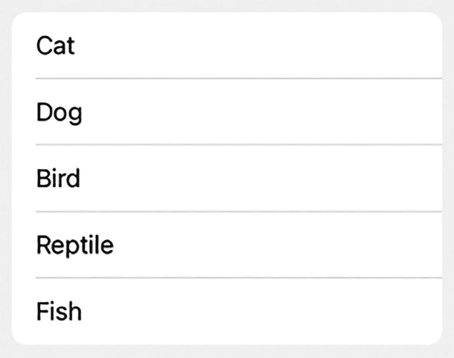

一张屏幕截图显示了一个单词列表，依次为 cat、dog、bird、reptile 和 fish。

**图 13-1** – 一个包含多个 `Text` 视图的简单列表

```
List {
    Text("Cat")
    Text("Dog")
    Text("Bird")
    Text("Reptile")
    Text("Fish")
}
```

如果列表包含的项数超过屏幕一次可显示的数量，列表将允许用户上下滑动以查看所有数据。最棒的是，这种滚动功能无需任何额外编码。

创建列表时，你可以使用多个 `Text` 视图，但如果要显示大量可能随时间增长或缩减的项，手动输入多个 `Text` 视图是行不通的。相反，你可能需要使用循环来检索数据，并将其显示在列表中的 `Text` 视图内。

要了解如何使用循环创建列表以及上下滑动查看所有列表项，请按照以下步骤操作：

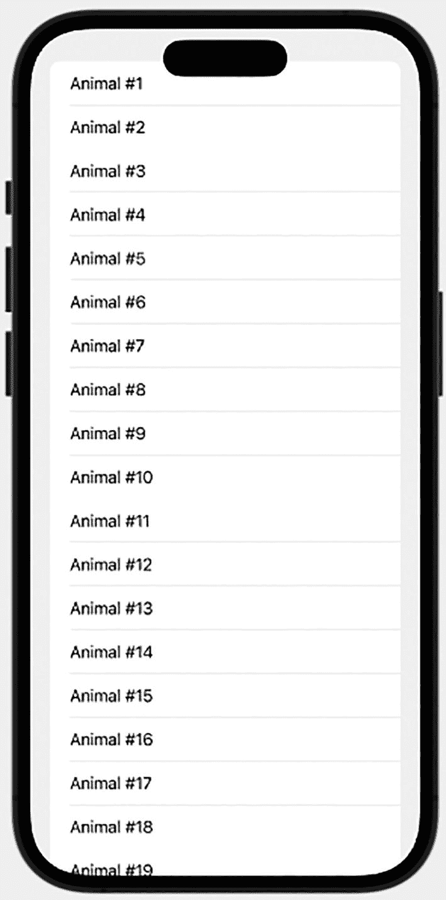

一张智能手机的插图显示其屏幕上有一个文本列表，内容从动物编号 1 到动物编号 19。

**图 13-2** – 由 `ForEach` 循环定义的列表外观

1.  创建一个新的 SwiftUI iOS 应用项目，并为其任意命名，例如 "SimpleList"。

2.  在导航器面板中点击 `ContentView` 文件。

3.  在 `var body: some View` 中添加一个 `List`，如下所示：

    ```
    var body: some View {
        List {
            ForEach(1...25, id: \.self) { index in
                Text("Animal #\(index)")
            }
        }
    }
    ```

    这段代码使用一个 `ForEach` 循环创建了 25 个独立的项。每次 `ForEach` 循环运行时，`index` 变量都会递增，因此 `index` 的值将从 1 开始，到 25 结束。整个 `ContentView` 文件应如下所示：

    ```
    import SwiftUI
    struct ContentView: View {
        var body: some View {
            List {
                ForEach(1...25, id: \.self) { index in
                    Text("Animal #\(index)")
                }
            }
        }
    }
    struct ContentView_Previews: PreviewProvider {
        static var previews: some View {
            ContentView()
        }
    }
    ```

4.  点击画布面板中的 Live 图标。请注意，即使列表包含 25 个项，但如图 13-2 所示，并非所有项都同时显示在屏幕上。

5.  上下拖动鼠标以模拟滑动手势。请注意，列表会自动向上/向下滚动，以显示其余内容。

## 在列表中显示数组数据

列表中显示的数据通常存储在数组中。数组中的项数可以是固定的，但更常见的是项数会随时间变化。这意味着随着数组随时间增长和缩减，列表的内容也可能会发生变化。

要了解如何在列表中显示数组内容，请按照以下步骤操作：

1.  创建一个新的 SwiftUI iOS 应用项目，并为其任意命名，例如 "ListArray"。

2.  在导航器面板中点击 `ContentView` 文件。

3.  在 `struct ContentView: some View` 这行下方定义一个数组，如下所示：

    ```
    var myArray = ["Cat", "Dog", "Turtle", "Ferret", "Parrot", "Goldfish", "Lizard", "Canary", "Tarantula", "Hamster"]
    ```

4.  在 `var body: some View` 中添加一个 `VStack`，并创建一个 `List`，如下所示：

    ```
    var body: some View {
        VStack {
            List {
                ForEach(0...myArray.count - 1, id: \.self) { index in
                    Text(myArray[index])
                }
            }
        }
    }
    ```

这将创建一个列表，并使用 `ForEach` 循环从 0 计数到数组中的最后一个项。（请记住，数组中的第一个项索引值为 0，因此数组中最后一个项的索引值等于数组中的总项数减 1。）然后它使用此索引值从数组中检索每个项，以显示在列表中，如图 13-3 所示。

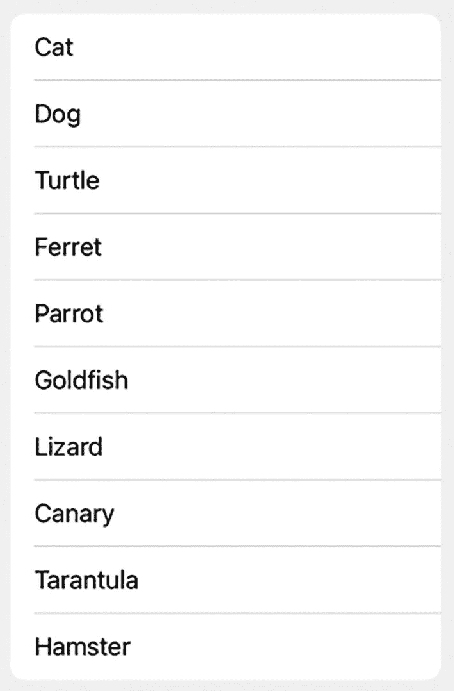

一个矩形块显示了一个单词列表。从上到下依次为 cat、dog、turtle、ferret、parrot、goldfish、lizard、canary、tarantula 和 hamster。

**图 13-3** – 在列表中显示数组的内容

整个 `ContentView` 文件应如下所示：

```
import SwiftUI
struct ContentView: View {
    var myArray = ["Cat", "Dog", "Turtle", "Ferret", "Parrot", "Goldfish", "Lizard", "Canary", "Tarantula", "Hamster"]
    var body: some View {
        VStack {
            List {
                ForEach(0...myArray.count - 1, id: \.self) { index in
                    Text(myArray[index])
                }
            }
        }
    }
}
struct ContentView_Previews: PreviewProvider {
    static var previews: some View {
        ContentView()
    }
}
```


### 在列表中显示结构体数组

之前的代码使用 `ForEach` 循环通过索引值获取数组项。另一种存储数据的方法是使用结构体，然后创建结构体数组。  
这样做的目的是定义你想要存储的数据，同时附带一个唯一 ID，你可以用这个 ID 来标识每个结构体，例如：

```
struct Animals: Identifiable {
    let pet: String
    let id = UUID()
}
```

一旦定义了 `Identifiable` 结构体，就可以像这样将其存储在数组中：

```
var myAnimals = [
    Animals(pet: "Cat"),
    Animals(pet: "Dog"),
    Animals(pet: "Turtle"),
    Animals(pet: "Ferret"),
    Animals(pet: "Parrot"),
    Animals(pet: "Goldfish"),
    Animals(pet: "Lizard"),
    Animals(pet: "Canary"),
    Animals(pet: "Tarantula"),
    Animals(pet: "Hamster")
]
```

这个数组不仅在 `pet` 字段中存储了字符串，还通过 ID 唯一标识了每个结构体。现在，你可以使用这个唯一 ID 在 `List` 中显示每个项，如下所示：

```
List(myAnimals) {
    Text($0.pet)
}
```

请注意，上述代码不需要循环。要了解这段代码的工作原理，请按照以下步骤操作：

1.  创建一个新的 SwiftUI iOS App 项目，并为其任意命名，例如 "ListOfStructures"。
2.  在导航器窗格中点击 `ContentView` 文件。
3.  在 `struct ContentView: some View` 行下方定义一个结构体和一个数组，如下所示：

    ```
    struct ContentView: View {
        struct Animals: Identifiable {
            let pet: String
            let id = UUID()
        }
        var myAnimals = [
            Animals(pet: "Cat"),
            Animals(pet: "Dog"),
            Animals(pet: "Turtle"),
            Animals(pet: "Ferret"),
            Animals(pet: "Parrot"),
            Animals(pet: "Goldfish"),
            Animals(pet: "Lizard"),
            Animals(pet: "Canary"),
            Animals(pet: "Tarantula"),
            Animals(pet: "Hamster")
        ]
    ```

4.  在 `var body: some View` 内部添加一个 `List`，如下所示：

    ```
    var body: some View {
        List(myAnimals) {
            Text($0.pet)
        }
    }
    ```

    完整的 `ContentView` 文件应如下所示：

    ```
    import SwiftUI

    struct ContentView: View {
        struct Animals: Identifiable {
            let pet: String
            let id = UUID()
        }
        var myAnimals = [
            Animals(pet: "Cat"),
            Animals(pet: "Dog"),
            Animals(pet: "Turtle"),
            Animals(pet: "Ferret"),
            Animals(pet: "Parrot"),
            Animals(pet: "Goldfish"),
            Animals(pet: "Lizard"),
            Animals(pet: "Canary"),
            Animals(pet: "Tarantula"),
            Animals(pet: "Hamster")
        ]
        var body: some View {
            List(myAnimals) {
                Text($0.pet)
            }
        }
    }

    struct ContentView_Previews: PreviewProvider {
        static var previews: some View {
            ContentView()
        }
    }
    ```

请注意，与之前需要 `ForEach` 循环的版本相比，创建 `List` 的代码要简洁得多。

### 在列表中创建分组

如果 `List` 中显示了很多项，那么滚动浏览所有这些数据以找到想要的项可能会很困难。为了解决这个问题，列表允许你创建分区，如图 13-4 所示。

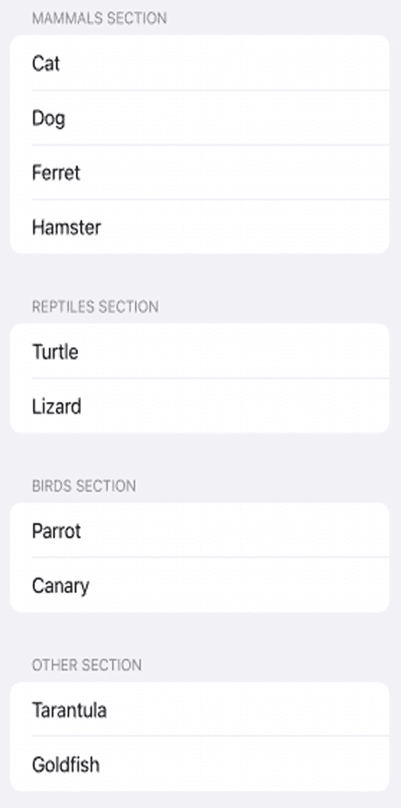  
一张截图显示了哺乳动物、爬行动物、鸟类和其他分区下的生物列表。哺乳动物分区包括猫、狗、雪貂和仓鼠。乌龟和蜥蜴属于爬行动物分区。鸟类分区有鹦鹉和金丝雀。其他分区有狼蛛和金鱼。

**图 13-4** — 按分区显示 `List` 的内容

要定义分区，你需要创建两个结构体。一个结构体定义分区标题，另一个结构体定义要显示的数据。要定义分区标题，你需要定义：

- 一个 `String` 常量，用于保存每个分区的名称
- 一个数组常量，用于保存包含实际显示数据的结构体数组
- 一个 `ID`，用于为每个分区定义唯一 ID

结构体名称必须定义为 `Identifiable` 以创建唯一 ID，例如：

```
struct SectionHeading: Identifiable {
    let name: String
    let animalList: [Animals]
    let id = UUID()
}
```

上述结构体使用 `animalList` 来存储一个名为 `Animals` 的结构体数组。这个 `Animals` 结构体需要：

- 一个 `String` 常量，用于保存在 `List` 中要显示的数据
- 一个 `ID`，用于为 `List` 中的每个项定义唯一 ID

第二个结构体必须定义为 `Hashable` 和 `Identifiable`，例如：

```
struct Animals: Hashable, Identifiable {
    let pet: String
    let id = UUID()
}
```

最后，你可以创建一个数组来定义分区以及每个分区内的项，例如：

```
var myAnimals = [
    SectionHeading(name: "Mammals",
        animalList: [
            Animals(pet: "Cat"),
            Animals(pet: "Dog"),
            Animals(pet: "Ferret"),
            Animals(pet: "Hamster")])
    ]
```

然后，要在 `List` 中显示项，你需要使用嵌套的 `ForEach` 循环。外层的 `ForEach` 循环定义分区名称，例如：

```
ForEach(myAnimals) { heading in
    Section(header: Text("\(heading.name) Section")) {
    }
}
```

然后，内层的 `ForEach` 循环定义每个分区内要显示的项，例如：

```
ForEach(heading.animalList) { creature in
    Text(creature.pet)
}
```

要了解如何创建分成多个分区的 `List`，请按照以下步骤操作：

1.  创建一个新的 SwiftUI iOS App 项目，并为其任意命名，例如 "ListSections"。
2.  在导航器窗格中点击 `ContentView` 文件。
3.  在 `struct ContentView: some View` 行下方定义一个结构体，以定义要在 `List` 中显示的数据，如下所示：

    ```
    struct Animals: Hashable, Identifiable {
        let pet: String
        let id = UUID()
    }
    ```

4.  在其下方添加第二个结构体，以定义要在 `List` 中显示的分区名称，如下所示：

    ```
    struct SectionHeading: Identifiable {
        let name: String
        let animalList: [Animals]
        let id = UUID()
    }
    ```

5.  添加一个数组，列出分区以及每个分区内要显示的项，如下所示：

    ```
    var myAnimals = [
        SectionHeading(name: "Mammals",
            animalList: [
                Animals(pet: "Cat"),
                Animals(pet: "Dog"),
                Animals(pet: "Ferret"),
                Animals(pet: "Hamster")]),
        SectionHeading(name: "Reptiles",
            animalList: [
                Animals(pet: "Turtle"),
                Animals(pet: "Lizard")]),
        SectionHeading(name: "Birds",
            animalList: [
                Animals(pet: "Parrot"),
                Animals(pet: "Canary")]),
        SectionHeading(name: "Other",
            animalList: [
                Animals(pet: "Tarantula"),
                Animals(pet: "Goldfish")])
    ]
    ```

6.  在 `var body: some View` 内部添加一个 `List`，如下所示：

    ```
    var body: some View {
        List {
        }
    ```

7.  在 `List` 内部添加一个 `ForEach` 循环来定义分区名称，如下所示：

    ```
    var body: some View {
        List {
            ForEach(myAnimals) { heading in
                Section(header: Text("\(heading.name) Section")) {
                }
            }
        }
    }
    ```


### 关于 `Text` 视图和 `ForEach` 循环

注意，`Text` 视图显示了每个分区的 `name` 属性，该属性之前由数组 `("Mammals", "Reptiles", "Birds", "Other")` 定义。

8.  添加第二个 `ForEach` 循环来定义要在 `List` 中显示的实际数据，如下所示：

```swift
var body: some View {
    List {
        ForEach(myAnimals) { heading in
            Section(header: Text("\(heading.name) Section")) {
                ForEach(heading.animalList) { creature in
                    Text(creature.pet)
                }
            }
        }
    }
}
```

注意，这个第二个 `ForEach` 循环使用了之前由数组 `("Cat", "Dog", "Ferret", "Hamster", "Turtle", "Lizard", "Parrot", "Canary", "Tarantula", "Goldfish")` 定义的 `pet` 属性。整个 `ContentView` 文件应该如下所示：

```swift
import SwiftUI
struct ContentView: View {
    struct Animals: Hashable, Identifiable {
        let pet: String
        let id = UUID()
    }
    struct SectionHeading: Identifiable {
        let name: String
        let animalList: [Animals]
        let id = UUID()
    }
    var myAnimals = [
        SectionHeading(name: "Mammals",
                       animalList: [
                           Animals(pet: "Cat"),
                           Animals(pet: "Dog"),
                           Animals(pet: "Ferret"),
                           Animals(pet: "Hamster")]),
        SectionHeading(name: "Reptiles",
                       animalList: [
                           Animals(pet: "Turtle"),
                           Animals(pet: "Lizard")]),
        SectionHeading(name: "Birds",
                       animalList: [
                           Animals(pet: "Parrot"),
                           Animals(pet: "Canary")]),
        SectionHeading(name: "Other",
                       animalList: [
                           Animals(pet: "Tarantula"),
                           Animals(pet: "Goldfish")])
    ]
    var body: some View {
        List {
            ForEach(myAnimals) { heading in
                Section(header: Text("\(heading.name) Section")) {
                    ForEach(heading.animalList) { creature in
                        Text(creature.pet)
                    }
                }
            }
        }
    }
}
struct ContentView_Previews: PreviewProvider {
    static var previews: some View {
        ContentView()
    }
}
```

## 向 `List` 添加行分隔线

列表通常会在项目之间显示线条。`SwiftUI` 允许你选择隐藏或显示这些线条，或者用特定颜色给线条着色。

要隐藏或显示 `List` 中的线条，请像这样使用 `.listRowSeparator` 修饰符，并传入 `.visible` 或 `.hidden`：

```swift
.listRowSeparator(.hidden)
```

要为 `List` 中的分隔线着色，请像这样使用 `.listRowSeparatorTint` 修饰符，并传入一个颜色值，例如 `.red` 或 `.blue`：

```swift
.listRowSeparatorTint(.red)
```

你可以在 `List` 内部同时使用这两个修饰符，来修改用于定义 `List` 显示内容的 `ForEach` 循环。要了解如何在 `List` 中显示和着色行分隔线，请按照以下步骤操作：

1.  创建一个新的 `SwiftUI iOS App` 项目，并为其指定任意名称，例如 `"ListLines"`。
2.  在导航器窗格中单击 `ContentView` 文件。
3.  在 `struct ContentView: View` 行下面添加一个数组，如下所示：
    ```swift
    var myArray = ["Cat", "Dog", "Turtle", "Ferret", "Parrot", "Goldfish", "Lizard", "Canary", "Tarantula", "Hamster"]
    ```
4.  在 `var body: some View` 行下面的 `VStack` 内添加一个 `List`，如下所示：
    ```swift
    var body: some View {
        VStack {
            List {
            }
        }
    }
    ```
5.  在 `List` 内部添加一个 `ForEach` 循环，以查找数组中的所有项目，索引从 `0` 到数组项目总数减 `1`，如下所示：
    ```swift
    var body: some View {
        VStack {
            List {
                ForEach(0...myArray.count - 1, id: \.self) { index in
                    Text(myArray[index])
                }
            }
        }
    }
    ```
6.  向 `ForEach` 循环添加一个 `.listRowSeparator` 修饰符，如下所示：
    ```swift
    var body: some View {
        VStack {
            List {
                ForEach(0...myArray.count - 1, id: \.self) { index in
                    Text(myArray[index])
                }.listRowSeparator(.visible)
            }
        }
    }
    ```
    这个 `.listRowSeparator` 会显示线条 (`.visible`)。
7.  向 `ForEach` 循环添加一个 `.listRowSeparatorTint` 修饰符，如下所示：
    ```swift
    var body: some View {
        VStack {
            List {
                ForEach(0...myArray.count - 1, id: \.self) { index in
                    Text(myArray[index])
                }.listRowSeparator(.visible)
                .listRowSeparatorTint(.red)
            }
        }
    }
    ```
    你可以选择任何你想要的颜色，例如 `.orange` 或 `.purple`。整个 `ContentView` 文件应该如下所示：
    ```swift
    import SwiftUI
    struct ContentView: View {
        var myArray = ["Cat", "Dog", "Turtle", "Ferret", "Parrot", "Goldfish", "Lizard", "Canary", "Tarantula", "Hamster"]
        var body: some View {
            VStack {
                List {
                    ForEach(0...myArray.count - 1, id: \.self) { index in
                        Text(myArray[index])
                    }.listRowSeparator(.visible)
                    .listRowSeparatorTint(.red)
                }
            }
        }
    }
    struct ContentView_Previews: PreviewProvider {
        static var previews: some View {
            ContentView()
        }
    }
    ```
8.  在画布窗格中单击“Live”图标。注意，`List` 会以你定义的颜色在每一项之间显示线条。


### 为列表交替显示颜色

当`List`（列表）内容较长时，浏览起来可能不太方便。虽然用线条（有无颜色均可）分隔列表中的项目可以让列表更易读，但另一种方法是像图 13-5 所示，在列表行中使用交替颜色。

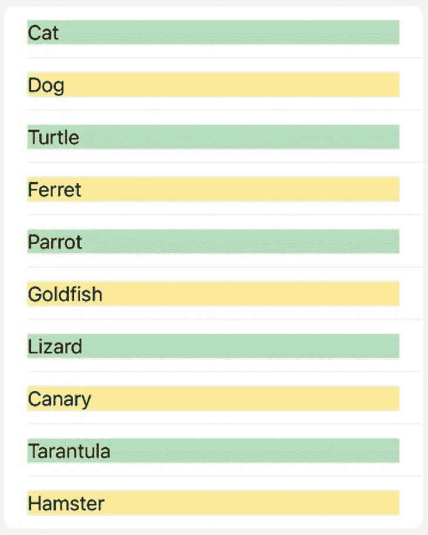

一个单列表格表示一个单词列表，包含猫、狗、乌龟、雪貂、鹦鹉、金鱼、蜥蜴、金丝雀、狼蛛和仓鼠，并交替使用两种高亮颜色。

**图 13-5** 交替颜色可以使列表更易读

SwiftUI 允许你这样定义颜色：

```
Color.green
```

颜色的一个问题在于它们可能过于鲜艳，导致列表每行中的文本难以阅读。为了调整颜色的强度，我们可以添加一个 `.opacity` 修饰符来降低颜色的饱和度。值为 0 时颜色完全消失，值为 1 时颜色完全显示。因此，小于 1 的不透明度值会降低颜色的视觉效果，例如：

```
Color.green.opacity(0.4)
```

如果用一个数组来填充列表，那么可以根据数组索引是奇数还是偶数来交替设置行的颜色。要判断数组索引（或任何数字）是否为偶数，可以使用 Swift 的模运算符（`%`）将该数字除以 2。如果余数为 0，则该数字是偶数；否则为奇数。

因此，要定义列表中每一行的背景颜色，我们需要使用 `.background` 修饰符来识别数组索引的奇偶性，如下所示：

```
.background(index % 2 == 0 ? Color.green : Color.yellow)
```

要了解如何让列表显示交替颜色，请按照以下步骤操作：

1. 创建一个新的 SwiftUI iOS App 项目，并为其任意命名，例如“ListAlternatingColors”。
2. 在导航器窗格中点击 `ContentView` 文件。
3. 在 `struct ContentView: View` 这行下方添加一个数组，如下所示：

```
var myArray = ["Cat", "Dog", "Turtle", "Ferret", "Parrot", "Goldfish", "Lizard", "Canary", "Tarantula", "Hamster"]
```

4. 在 `var body: some View` 这行下方的 `VStack` 内添加一个 `List`（列表），如下所示：

```
var body: some View {
    VStack {
        List {
        }
    }
}
```

5. 在 `List` 内部添加一个 `ForEach` 循环，以遍历从 0 到数组元素总数减 1 的所有数组项，如下所示：

```
var body: some View {
    VStack {
        List {
            ForEach(0...myArray.count - 1, id: \.self) { index in
                Text(myArray[index])
            }
        }
    }
}
```

如果我们只是在 `ForEach` 循环内的 `Text` 视图上添加背景颜色，那么仅仅高亮显示 `Text` 视图本身，而不是整个行。我们需要做的是将 `Text` 视图嵌入到一个 `HStack` 中，然后添加一个 `Spacer()`，以将 `HStack` 的边界扩展到 iOS 屏幕的边缘。

6. 将 `Text` 视图嵌入到包含 `Spacer()` 的 `HStack` 中，如下所示：

```
var body: some View {
    VStack {
        List {
            ForEach(0...myArray.count - 1, id: \.self) { index in
                HStack {
                    Text(myArray[index])
                    Spacer()
                }
            }
        }
    }
}
```

现在我们可以为 `HStack` 添加背景颜色，这将同时包含 `Text` 视图和 `HStack` 的宽度（通过 `Spacer()` 向右扩展）。

7. 在定义 `HStack` 的最后那个花括号上添加背景修饰符，如下所示：

```
var body: some View {
    VStack {
        List {
            ForEach(0...myArray.count - 1, id: \.self) { index in
                HStack {
                    Text(myArray[index])
                    Spacer()
                }.background(index % 2 == 0 ? Color.green.opacity(0.4) : Color.yellow.opacity(0.4))
            }
        }
    }
}
```

你可以随意选择不同的颜色和不透明度值。请注意，如果数组索引是偶数，该行将显示为绿色；如果数组索引是奇数，则该行将显示为黄色。整个 `ContentView` 文件应如下所示：

```
import SwiftUI
struct ContentView: View {
    var myArray = ["Cat", "Dog", "Turtle", "Ferret", "Parrot", "Goldfish", "Lizard", "Canary", "Tarantula", "Hamster"]
    var body: some View {
        VStack {
            List {
                ForEach(0...myArray.count - 1, id: \.self) { index in
                    HStack {
                        Text(myArray[index])
                        Spacer()
                    }.background(index % 2 == 0 ? Color.green.opacity(0.4) : Color.yellow.opacity(0.4))
                }
            }
        }
    }
}
struct ContentView_Previews: PreviewProvider {
    static var previews: some View {
        ContentView()
    }
}
```

8. 点击 Canvas 窗格中的 Live 图标。SwiftUI 会显示颜色和不透明度交替的行（参见图 13-5）。

### 为列表添加轻扫手势

许多常见的应用程序，如邮件、信息和照片，都会在 `List` 中显示项目。通过这些列表，用户可以向左或向右轻扫，以显示可供选择的附加选项，如图 13-6 所示。

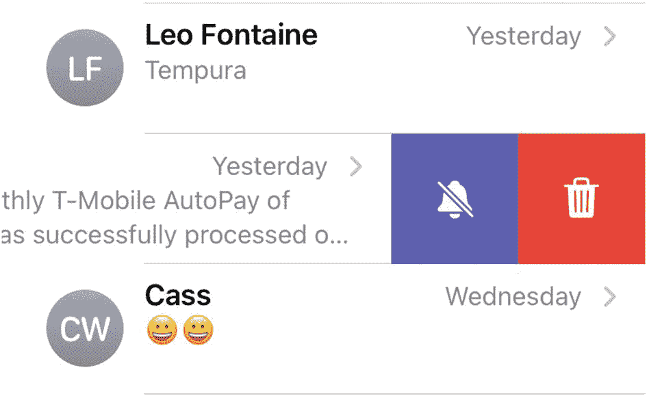

一张屏幕截图显示了包含 3 条消息的列表。中间的消息被轻扫，并在右端显示了附加选项，用于静音通知和删除消息。

**图 13-6** 在 `List` 上轻扫可以显示附加选项

列表的两个常见操作是删除和移动项目。从 `List` 中删除项目通常是在用户从右向左轻扫后移除该项目。在 `List` 中移动项目则是指滑动手指将某个项目放置到列表中的新位置。


### 从列表中删除项目

在 iOS 中，从`List`中删除项目最常见的快捷方式是从右向左滑动以显示**删除**按钮。另外，用户也可以继续从右向左滑动来直接删除项目，而无需点击**删除**按钮。由于这种滑动删除手势很常用，SwiftUI 让实现变得非常简单。

第一步是在`List`内的`ForEach`循环中添加`.onDelete`修饰符，如下所示：

```swift
List {
    ForEach(0...myArray.count - 1, id: \.self) { index in
    }.onDelete(perform: delete)
}
```

这会调用一个删除函数，该函数使用包含`List`中显示项目的数组名称（以下示例中称为`myArray`），并调用`remove`方法，如下所示：

```swift
func delete(at offsets: IndexSet) {
    myArray.remove(atOffsets: offsets)
}
```

要了解如何在`List`中创建滑动删除手势，请按照以下步骤操作：

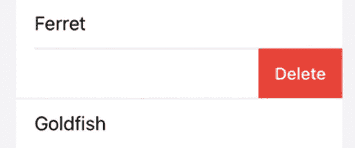

**图 13-7** – 由`.onDelete`修饰符创建的**删除**按钮。

1.  创建一个新的 SwiftUI iOS 应用程序项目，并为其指定任意名称，例如“ListDelete”。
2.  点击导航器窗格中的`ContentView`文件。
3.  在`struct ContentView`行下添加一个`@State`变量数组，如下所示：

    ```swift
    @State var myArray = ["Cat", "Dog", "Turtle", "Ferret", "Parrot", "Goldfish", "Lizard", "Canary", "Tarantula", "Hamster"]
    ```

    输入的具体字符串无关紧要，只要输入几个字符串来填充数组即可。

4.  在`var body: some View`行下添加一个`List`，如下所示：

    ```swift
    var body: some View {
        List {
        }
    }
    ```

5.  在此`List`内添加一个`ForEach`循环，从 0 计数到数组项目总数减 1。然后在一个`Text`视图中显示数组项目，如下所示：

    ```swift
    var body: some View {
        List {
            ForEach(0...myArray.count - 1, id: \.self) { index in
                Text(myArray[index])
            }
        }
    }
    ```

6.  向`ForEach`循环添加`.onDelete`修饰符，以调用一个名为`delete`的函数，如下所示：

    ```swift
    var body: some View {
        List {
            ForEach(0...myArray.count - 1, id: \.self) { index in
                Text(myArray[index])
            }.onDelete(perform: delete)
        }
    }
    ```

7.  在`struct ContentView: View`中的最后一个花括号上方添加以下函数，如下所示：

    ```swift
    func delete(at offsets: IndexSet) {
        myArray.remove(atOffsets: offsets)
    }
    ```

    整个`ContentView`文件应如下所示：

    ```swift
    import SwiftUI
    struct ContentView: View {
        @State var myArray = ["Cat", "Dog", "Turtle", "Ferret", "Parrot", "Goldfish", "Lizard", "Canary", "Tarantula", "Hamster"]
        var body: some View {
            List {
                ForEach(0...myArray.count - 1, id: \.self) { index in
                    Text(myArray[index])
                }.onDelete(perform: delete)
            }
        }
        func delete(at offsets: IndexSet) {
            myArray.remove(atOffsets: offsets)
        }
    }
    struct ContentView_Previews: PreviewProvider {
        static var previews: some View {
            ContentView()
        }
    }
    ```

8.  点击画布窗格中的**Live**图标。
9.  在`List`中的任意项目上从右向左滑动。注意，`.onDelete`修饰符会自动显示**删除**按钮，如图 13-7 所示。
10. 点击**删除**按钮。注意，包含该项目的行消失了。

### 在列表中移动项目

另一种使用列表的常见方式是在`List`内重新排列或移动项目。在 iOS 中，这通常是一个两步过程。首先，您必须编辑`List`，使其在`List`中每个项目的右侧显示三横线图标。其次，您使用三横线图标滑动`List`项目，将其放置到新位置，如图 13-8 所示。

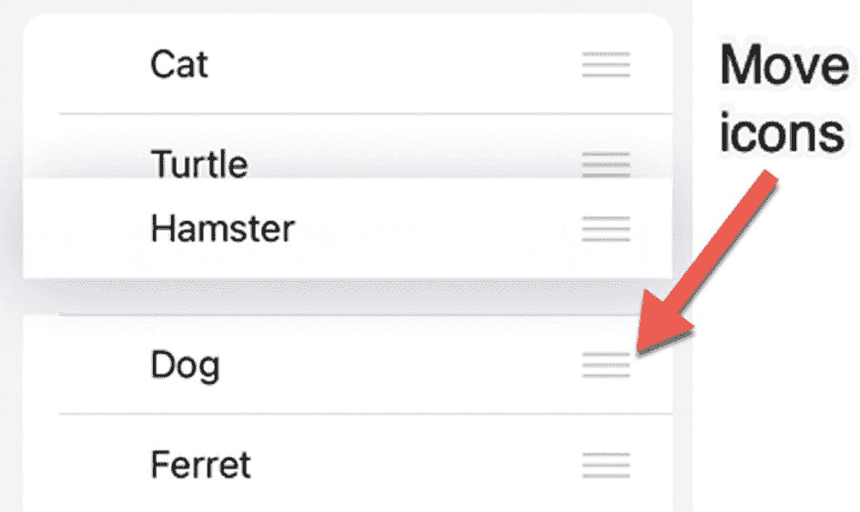

**图 13-8** – 移动图标显示在`List`中项目的右侧

第一步是在`List`内的`ForEach`循环中添加`.onMove`修饰符，如下所示：

```swift
ForEach(0...myArray.count - 1, id: \.self) { index in
}.onMove(perform: move)
```

这会调用一个移动函数，该函数使用包含`List`中显示项目的数组名称（以下示例中称为`myArray`），并调用`move`方法，如下所示：

```swift
func move(from source: IndexSet, to destination: Int) {
    myArray.move(fromOffsets: source, toOffset: destination)
}
```

要了解如何在`List`中显示移动图标，请按照以下步骤操作：

1.  创建一个新的 SwiftUI iOS 应用程序项目，并为其指定任意名称，例如“ListMove”。
2.  点击导航器窗格中的`ContentView`文件。
3.  在`struct ContentView`行下添加一个`@State`变量数组，如下所示：

    ```swift
    @State var myArray = ["Cat", "Dog", "Turtle", "Ferret", "Parrot", "Goldfish", "Lizard", "Canary", "Tarantula", "Hamster"]
    ```

    输入的具体字符串无关紧要，只要输入几个字符串来填充数组即可。

4.  在`var body: some View`行下添加一个`NavigationView`，如下所示：

    ```swift
    var body: some View {
        NavigationView {
        }
    }
    ```

    `NavigationView`对于在屏幕右上角显示**编辑**按钮是必需的。

5.  在`NavigationView`内部添加一个`List`，如下所示：

    ```swift
    var body: some View {
        NavigationView {
            List {
            }
        }
    }
    ```

6.  在此`List`内添加一个`ForEach`循环，从 0 计数到数组项目总数减 1。然后在一个`Text`视图中显示数组项目，如下所示：

    ```swift
    var body: some View {
        NavigationView {
            List {
                ForEach(0...myArray.count - 1, id: \.self) { index in
                    Text(myArray[index])
                }
            }
        }
    }
    ```

7.  向`List`添加`.toolbar`修饰符，如下所示：

    ```swift
    var body: some View {
        NavigationView {
            List {
                ForEach(0...myArray.count - 1, id: \.self) { index in
                    Text(myArray[index])
                }
            }.toolbar {
                EditButton()
            }
        }
    }
    ```

    这段`.toolbar { EditButton() }`代码会在`NavigationView`的右上角添加一个**编辑**按钮。

8.  向`ForEach`循环添加`.onMove`修饰符，以调用一个名为`move`的函数，如下所示：

    ```swift
    var body: some View {
        NavigationView {
            List {
                ForEach(0...myArray.count - 1, id: \.self) { index in
                    Text(myArray[index])
                }.onMove(perform: move)
            }.toolbar {
                EditButton()
            }
        }
    }
    ```

9.  在`struct ContentView: View`中的最后一个花括号上方添加以下函数，如下所示：

    ```swift
    func move(from source: IndexSet, to destination: Int) {
        myArray.move(fromOffsets: source, toOffset: destination)
    }
    ```

    整个`ContentView`文件应如下所示：

    ```swift
    import SwiftUI
    struct ContentView: View {
        @State var myArray = ["Cat", "Dog", "Turtle", "Ferret", "Parrot", "Goldfish", "Lizard", "Canary", "Tarantula", "Hamster"]
        var body: some View {
            NavigationView {
                List {
                    ForEach(0...myArray.count - 1, id: \.self) { index in
                        Text(myArray[index])
                    }.onMove(perform: move)
                }.toolbar {
                    EditButton()
                }
            }
        }
        func move(from source: IndexSet, to destination: Int) {
            myArray.move(fromOffsets: source, toOffset: destination)
        }
    }
    struct ContentView_Previews: PreviewProvider {
        static var previews: some View {
            ContentView()
        }
    }
    ```


10.  点击`Canvas`面板中的`Live`图标。

11.  点击屏幕右上角的`Edit`按钮。`List`中每个项目的右侧会出现三条水平线图标（见图 13-8）。请注意，当你点击`Edit`按钮时，它会变成一个`Done`按钮。

12.  向上或向下滑动任意水平线图标，即可将项目移动到`List`中的新位置。

13.  点击屏幕右上角的`Done`按钮，可隐藏`List`中每个项目右侧的水平线图标。

### 为列表创建自定义滑动操作

SwiftUI 还允许在`List`项目上实现自定义的从左到右和从右到左手势。第一步是在显示`List`项目的视图（例如`Text`视图）上添加`.swipeActions`修饰符。然后，像这样定义你是想要`.leading`（从左到右）还是`.trailing`（从右到左）滑动手势：

```
.swipeActions(edge: .trailing)
```

每个`.swipeActions`修饰符都需要定义一个`Button`（包括`Button`的标题以及选中时要运行的代码），同时搭配一个`.tint`修饰符，以便在选中时显示特定颜色，例如：

```
.swipeActions(edge: .trailing) {
    Button {
        //  要运行的代码
    } label: {
        //  要显示的图标
    }.tint(.red)
}
```

要了解如何在`List`中创建自定义滑动操作，请按照以下步骤操作：

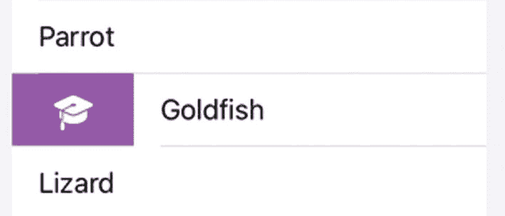
一张屏幕截图，显示了一个包含三个单词`parrot`、`goldfish`和`lizard`的列表。`goldfish`一词被滑动，左侧显示一个毕业帽图标。

**图 13-9** – 从左到右滑动后`List`项目的外观

1.  创建一个新的 SwiftUI iOS App 项目，并为其任意命名，例如`"ListCustomSwipes"`。

2.  点击`Navigator`面板中的`ContentView`文件。

3.  在`struct ContentView`代码行下方添加一个`State`变量和一个`State`变量数组，如下所示：

```
    @State var myArray = ["Cat", "Dog", "Turtle", "Ferret", "Parrot", "Goldfish", "Lizard", "Canary", "Tarantula", "Hamster"]
    @State var message = ""
```

4.  在`var body: some View`代码行下方添加一个`VStack`、`Text`视图和一个`List`，如下所示：

```
    var body: some View {
        VStack {
            Text("\(message)")
            List {
            }
        }
    }
```

5.  在这个`List`内部添加一个`ForEach`循环，从 0 计数到数组中项目的总数减 1。然后在`Text`视图中显示数组项目，如下所示：

```
    var body: some View {
        VStack {
            Text("\(message)")
            List {
                ForEach(0...myArray.count - 1, id: \.self) { index in
                    Text(myArray[index])
                }
            }
        }
    }
```

6.  在`ForEach`循环内的`Text`视图上添加多个`.swipeActions`修饰符，如下所示：

```
    var body: some View {
        VStack {
            Text("\(message)")
            List {
                ForEach(0...myArray.count - 1, id: \.self) { index in
                    Text(myArray[index])
                        .swipeActions(edge: .trailing) {
                            Button {
                                message = "Item = \(myArray[index]) -- Index = \(index)"
                            } label: {
                                Image(systemName: "calendar.circle")
                            }.tint(.yellow)
                        }
                        .swipeActions(edge: .trailing) {
                            Button {
                                message = "Green button selected"
                            } label: {
                                Image(systemName: "book")
                            }.tint(.green)
                        }
                        .swipeActions(edge: .leading) {
                            Button {
                                message = "Left to right swipe"
                            } label: {
                                Image(systemName: "graduationcap")
                            }.tint(.purple)
                        }
                }
            }
        }
    }
```

整个`ContentView`文件应如下所示：

```
    import SwiftUI
    struct ContentView: View {
        @State var myArray = ["Cat", "Dog", "Turtle", "Ferret", "Parrot", "Goldfish", "Lizard", "Canary", "Tarantula", "Hamster"]
        @State var message = ""
        var body: some View {
            VStack {
                Text("\(message)")
                List {
                    ForEach(0...myArray.count - 1, id: \.self) { index in
                        Text(myArray[index])
                            .swipeActions(edge: .trailing) {
                                Button {
                                    message = "Item = \(myArray[index]) -- Index = \(index)"
                                } label: {
                                    Image(systemName: "calendar.circle")
                                }.tint(.yellow)
                            }
                            .swipeActions(edge: .trailing) {
                                Button {
                                    message = "Green button selected"
                                } label: {
                                    Image(systemName: "book")
                                }.tint(.green)
                            }
                            .swipeActions(edge: .leading) {
                                Button {
                                    message = "Left to right swipe"
                                } label: {
                                    Image(systemName: "graduationcap")
                                }.tint(.purple)
                            }
                    }
                }
            }
        }
    }
    struct ContentView_Previews: PreviewProvider {
        static var previews: some View {
            ContentView()
        }
    }
```

7.  点击`Canvas`面板中的`Live`图标。

8.  从左向右滑动，即可看到`.leading`滑动手势`Button`出现，如图 13-9 所示。

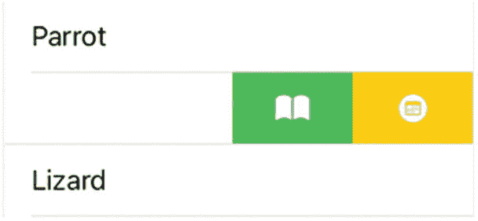
一张屏幕截图，显示了一个包含三个单词的列表。中间一行被滑动，右侧显示一个书和一个日历图标。

**图 13-10** – 从右到左滑动后`List`项目的外观

9.  点击紫色毕业帽图标。屏幕顶部附近会显示消息`"Left to right swipe"`。

10. 从右向左滑动，即可看到两个`.trailing`滑动手势`Button`出现，如图 13-10 所示。

11. 点击绿色书图标。会显示消息`"Green button selected"`。

12. 从右向左滑动，即可看到两个`.trailing`滑动手势`Button`出现（见图 13-10）。

13. 点击黄色日历圆圈图标。该项目的名称及其在数组中的索引位置会显示在屏幕顶部。

**注意**

如果你创建了自定义的从右到左滑动手势，它将覆盖`.onDelete`手势。


### 搜索列表

由于列表通常显示大量数据，因此滚动浏览一个长的`List`会变得很麻烦。为了让在大型`List`中搜索特定数据变得更容易，你可以添加一个搜索栏。现在用户可以输入一个或多个字符来过滤长的`List`，这样他们只能看到想要的、相关的数据。

要给`List`添加搜索栏，你需要将一个`List`嵌入到`NavigationView`中，并为`List`添加一个`.searchable`修饰符，操作如下：

```
NavigationView {
    List (arrayName, id: \.self) { x in
        Text(x)
    }.searchable(text: $stateVariable)
}
```

在这个示例中，你需要将`"arrayName"`替换为包含`List`项的实际数组名称。然后，你需要将`"stateVariable"`替换为一个持有`String`数据类型的`State`变量的名称。

要了解如何搜索`List`，请按照以下步骤操作：

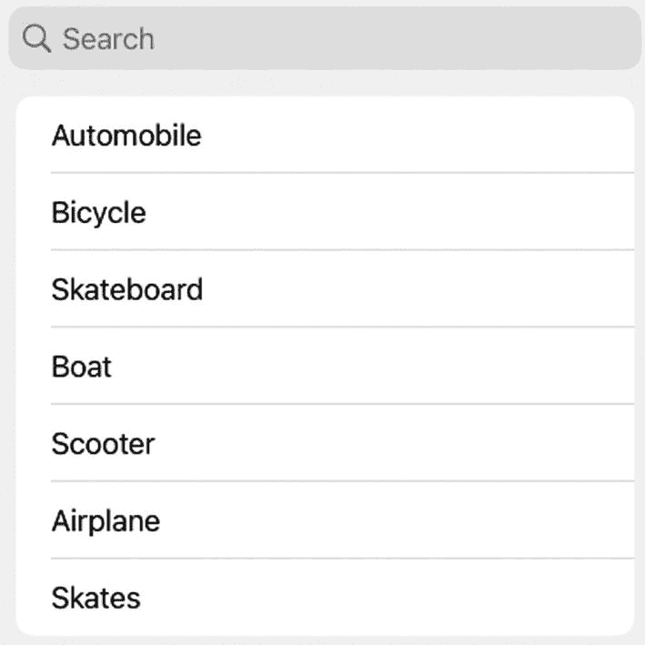

屏幕截图显示了一个单词列表，包括 automobile、bicycle、skateboard、boat、scooter、airplane 和 skates。顶部有一个搜索栏。

**图 13-11** – 搜索栏和`List`项的初始外观

1.  创建一个新的 SwiftUI iOS 应用项目，并给它取任意你喜欢的名字，例如`"ListSearch"`。

2.  在导航器窗格中点击`ContentView`文件。

3.  在`import SwiftUI`行下方，添加一个返回字符串数组的函数，如下所示：

    ```
    func newList() -> [String] {
        return ["Automobile", "Bicycle", "Skateboard", "Boat", "Scooter", "Airplane", "Skates"]
    }
    ```

    该函数简单地返回一个`Strings`数组。这个函数稍后将在用户完成对`List`的搜索后，用于刷新整个`List`。

4.  在`struct ContentView`行下方添加两个`State`变量，如下所示：

    ```
    @State var search = ""
    @State var transportation = newList()
    ```

    `search`状态变量将存储从搜索栏输入的数据。`transportation`状态变量存储一个`Strings`数组，该数组通过调用`newList()`函数获取。

5.  在`VStack`内部添加一个`NavigationView`，如下所示：

    ```
    var body: some View {
        VStack {
            NavigationView {
            }
        }
    }
    ```

6.  在`NavigationView`内部添加一个`List`，如下所示：

    ```
    var body: some View {
        VStack {
            NavigationView {
                List (transportation, id: \.self) { x in
                    Text(x)
                }
            }
        }
    }
    ```

    这将用存储在`transportation`状态变量中的项（一个`Strings`数组）填充`List`。

7.  将`.searchable`修饰符添加到`List`的最后一个花括号后面，如下所示：

    ```
    var body: some View {
        VStack {
            NavigationView {
                List (transportation, id: \.self) { x in
                    Text(x)
                }.searchable(text: $search)
            }
        }
    }
    ```

    这会在屏幕顶部添加一个搜索栏。用户在搜索栏中输入的所有内容都将存储在`search`状态变量中。目前这个搜索栏还不起作用，因此我们需要为其添加一个`.onChange`修饰符。

8.  将`.onChange`修饰符添加到`List`中，如下所示：

    ```
    var body: some View {
        VStack {
            NavigationView {
                List (transportation, id: \.self) { x in
                    Text(x)
                }.searchable(text: $search)
                .onChange(of: search) { newValue in
                    if !newValue.isEmpty && newValue.count >= 1 {
                        transportation = transportation.filter {
                            $0.lowercased().hasPrefix(newValue.lowercased())
                        }
                    } else {
                        transportation = newList()
                    }
                }
            }
        }
    }
    ```

    每次搜索栏内容发生变化时，`.onChange`修饰符都会运行。如果搜索栏完全为空，则`.onChange`修饰符会运行`newList()`函数来重新填充`List`。如果搜索栏不为空且至少包含一个字符，则搜索栏会使用过滤器来匹配用户输入的内容与每个`List`项。`.hasPrefix`修饰符仅仅检查用户输入的内容是否匹配构成每个`List`项的部分或全部字母。

整个`ContentView`文件应该如下所示：

```
import SwiftUI
func newList() -> [String] {
    return ["Automobile", "Bicycle", "Skateboard", "Boat", "Scooter", "Airplane", "Skates"]
}
struct ContentView: View {
    @State var search = ""
    @State var transportation = newList()
    var body: some View {
        VStack {
            NavigationView {
                List (transportation, id: \.self) { x in
                    Text(x)
                }.searchable(text: $search)
                .onChange(of: search) { newValue in
                    if !newValue.isEmpty && newValue.count >= 1 {
                        transportation = transportation.filter {
                            $0.lowercased().hasPrefix(newValue.lowercased())
                        }
                    } else {
                        transportation = newList()
                    }
                }
            }
        }
    }
}
struct ContentView_Previews: PreviewProvider {
    static var previews: some View {
        ContentView()
    }
}
```

9.  点击画布（Canvas）窗格中的“Live”图标。项目将出现在`List`中，顶部有一个搜索栏，如图 13-11 所示。

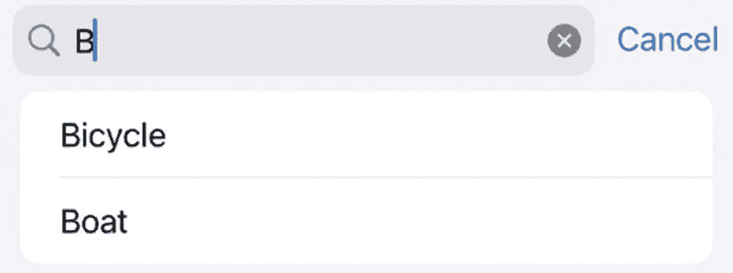

屏幕截图显示搜索栏下方有一个包含 2 个单词的列表，其中包括 bicycle 和 boat。搜索栏中键入了字母 B。

**图 13-12** – 搜索栏过滤掉了所有与搜索栏中键入文本不匹配的项目

10. 点击搜索栏并键入`"b"`。请注意，`List`现在过滤掉了所有项目，除了那些以`"b"`开头的项目，例如`"Boat"`和`"Bicycle"`，如图 13-12 所示。

11. 点击“取消”或关闭图标（x）。请注意，`List`再次显示了所有项目。

## 总结

列表是在一个位置显示多个相关项的常见方式。为了帮助组织`List`中的项目，你可以将相关的项目分组。

除了在`List`中显示项目，你还可以检测从左到右或从右到左的滑动手势。通过使用`.onDelete`修饰符，你可以允许用户从`List`中删除项目。通过使用`NavigationView`和一个“编辑”按钮，你可以使用`.onMove`修饰符允许用户在`List`内移动项目。

你还可以为`List`自定义滑动手势。当你创建自定义滑动手势时，可以为每个按钮定义图标和颜色。通过对列表使用滑动手势，用户可以用不同的方式修改`List`项。

为了让列表更易于阅读，可以考虑添加分隔线来分隔项目，或者使用交替颜色。搜索栏也可以让用户轻松找到他们想要的项目，特别是当`List`包含大量项目时。通过使用列表，你可以显示组织好的信息供用户查看和选择。


