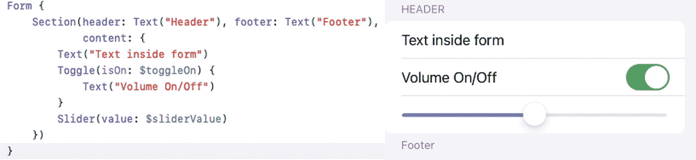
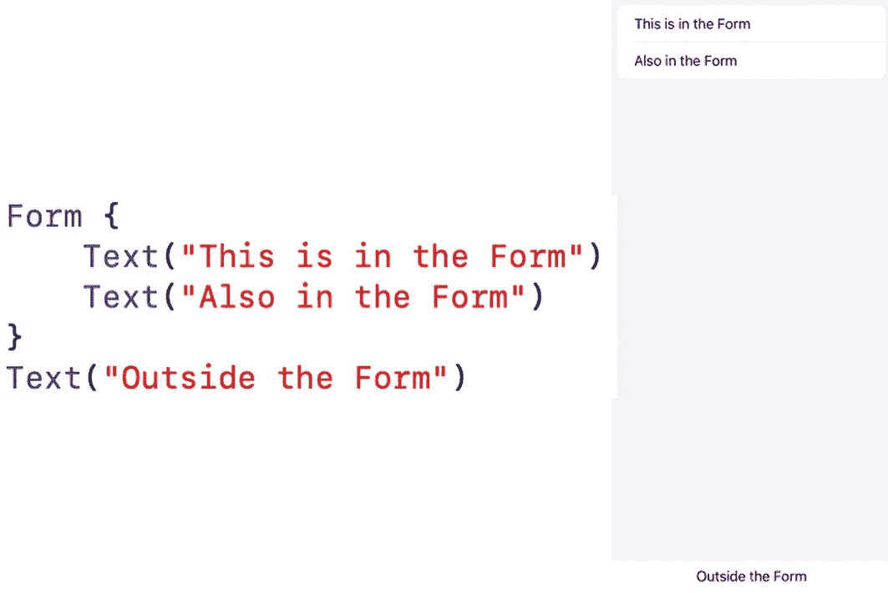
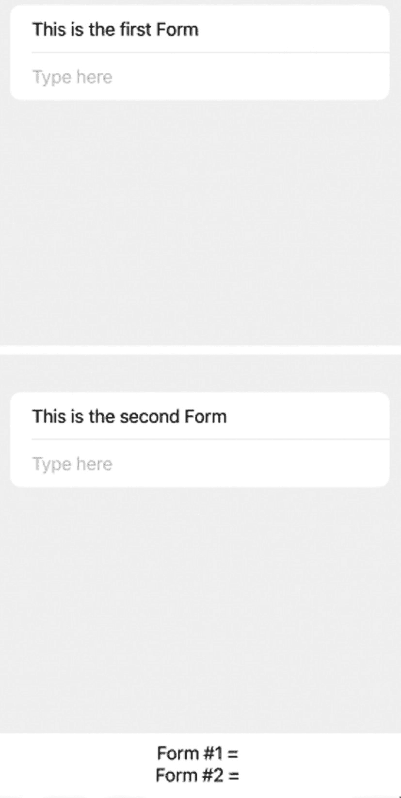
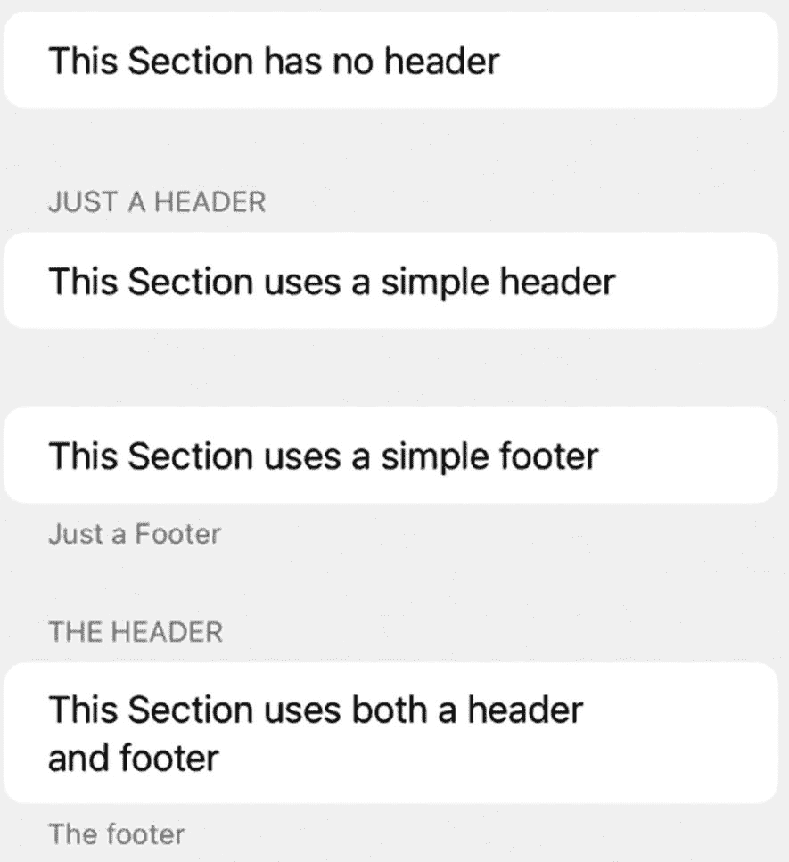
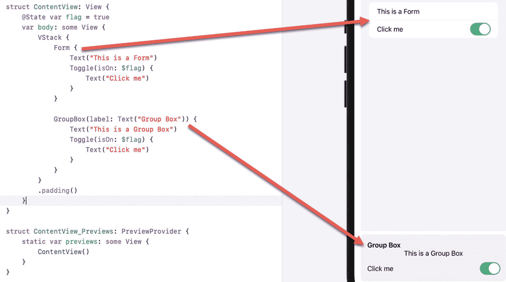

# 14. 使用表单和分组框

在填写纸质表单时，你可能会注意到纸质表单会将相关项分组在一起。例如，表单可能会在某个区域要求你填写姓名、地址和电话号码，而在另一个区域则要求你填写性别、种族背景和婚姻状况。纸质表单能让你轻松地在同一区域输入相关数据。

SwiftUI 的 `Form` 的工作原理类似，它将提供用户可选选项和设置的关联视图分组在一起。表单由可选的头部、尾部以及内部由 `Text`、`Slider` 或 `Toggle` 等视图定义的内容组成，如图 14-1 所示。



一组两张截图。左侧显示了一段代码片段，用于定义节标题的名称和切换开关的设置。右侧显示了代码在用户界面中渲染后的输出结果。

图 14-1

`Form` 的典型组成部分

`Form` 像堆栈一样将相关视图分组在一起。区别在于，`Form` 还会在用户界面上将视图进行视觉上的分组。`Form` 内的所有视图会一起显示，而任何不在 `Form` 内的视图则会通过灰色区域分隔开，如图 14-2 所示。



一个图示展示了一段代码片段，用于显示在表单内和表单外的文本。右侧显示了代码渲染后的输出，其中上方的文本位于表单内部，下方的文本位于表单外部。

图 14-2

`Form` 在用户界面上将视图分组在一起

与表单类似的是分组框，它提供了一种更简单的方法来在用户界面上将相关视图进行视觉分组。当你需要将视图分组时，可以在 `Form` 和 `GroupBox` 之间进行选择。

## 创建简单的表单

最简单的 `Form` 只是将一个或多个视图分组在一起。要创建一个 `Form`，你只需这样做：

```
Form {
    //
}
```

要了解如何创建简单的 `Form`，请遵循以下步骤：



一组两张截图，每张各显示一个矩形文本框。上面的文本框显示“这是第一个表单”。下面的文本框显示“这是第二个表单”。

图 14-3

用户界面上显示两个表单

1. 新建一个 SwiftUI iOS App 项目，并为其任意命名，例如“SimpleForm”。
2. 在导航面板中点击 `ContentView` 文件。
3. 在 `struct ContentView: View` 代码行下方，添加两个 `State` 变量，如下所示：

    ```
    @State var messageOne = ""
    @State var messageTwo = ""
    ```

4. 在 `VStack` 内部添加两个 `Form` 和两个 `Text` 视图，如下所示：

    ```
    var body: some View {
        VStack {
            Form {
                Text("This is the first Form")
                TextField("Type here", text: $messageOne)
            }
            Form {
                Text("This is the second Form")
                TextField("Type here", text: $messageTwo)
            }
            Text("Form #1 = \(messageOne)")
            Text("Form #2 = \(messageTwo)")
        }
    }
    ```

    完整的 `ContentView` 文件应如下所示：

    ```
    import SwiftUI
    
    struct ContentView: View {
        @State var messageOne = ""
        @State var messageTwo = ""
        
        var body: some View {
            VStack {
                Form {
                    Text("This is the first Form")
                    TextField("Type here", text: $messageOne)
                }
                Form {
                    Text("This is the second Form")
                    TextField("Type here", text: $messageTwo)
                }
                Text("Form #1 = \(messageOne)")
                Text("Form #2 = \(messageTwo)")
            }
        }
    }
    
    struct ContentView_Previews: PreviewProvider {
        static var previews: some View {
            ContentView()
        }
    }
    ```

    这段代码创建了一个用户界面，在屏幕上显示两个表单，以及两个不属于任何表单的 `Text` 视图，如图 14-3 所示。

5. 点击画布面板中的 Live 图标。
6. 点击顶部的 `TextField` 并输入一些文本。请注意，此文本现在会出现在屏幕底部的 `Text` 视图（“Form #1 =”）中。
7. 点击中间的 `TextField` 并输入一些文本。请注意，此文本现在会出现在屏幕底部的 `Text` 视图（“Form #2 =”）中。

## 将表单划分为多个分区

一个 `Form` 可以包含一个或多个视图。然而，`Form` 中的视图越多，所有视图就会显得越拥挤。为了将相关视图分组，你可以将 `Form` 划分为多个分区（Section），每个 `Section` 可以包含一个或多个要在屏幕上显示的视图。此外，分区还可以显示可选的头部和/或尾部。

最简单的 `Section` 只是将相关视图分组在一起，如下所示：

```
Section {
    // 在此处添加视图
}
```

尽管 `Section` 在用户界面上看起来是截然不同的，但你还可以通过使用头部和/或尾部来进一步区分 `Section`。如果你只想定义一个头部，可以使用如下代码：

```
Section("Header text here") {
    // 在此处添加视图
}
```

这种方法会自动将文本显示为大写，即使你不是以这种方式输入的。另一种定义头部的方法如下所示：

```
Section(content: {
    // 在此处添加视图
}, header: {
    // 在此处定义头部文本
})
```

你也可以使用此方法仅定义一个尾部，如下所示：

```
Section(content: {
    // 在此处添加视图
}, footer: {
    // 在此处定义尾部文本
})
```

> 注意：尾部中的文本会按照你输入的原样显示，这与自动将所有文本显示为大写的头部不同。

如果你想同时定义头部和尾部，可以使用以下代码：

```
Section {
    // 在此处添加视图
} header: {
    // 在此处定义头部文本
} footer: {
    // 在此处定义尾部文本
}
```

要了解如何在分区中创建头部和尾部，请遵循以下步骤：



一张截图显示了一个矩形分区，从上到下排列着四个文本框。这些文本框分别表示：无头部分区、简单头部分区、简单尾部分区以及同时包含头部和尾部的分区。

图 14-4

显示 `Section` 的四种不同方式

1. 新建一个 SwiftUI iOS App 项目，并为其任意命名，例如“HeaderFormSections”。
2. 在导航面板中点击 `ContentView` 文件。
3. 在 `var body: some View` 内部添加一个 `Form`，如下所示：

    ```
    var body: some View {
        Form {
        }
    }
    ```

4. 在 `Form` 内部添加四个以不同方式定义的 `Section`，如下所示：

    ```
    var body: some View {
        Form {
            Section {
                Text("This Section has no header")
            }
            Section("Just a Header") {
                Text("This Section uses a simple header")
            }
            Section {
                Text("This Section uses a simple footer")
            } footer: {
                Text("Just a Footer")
            }
            Section {
                Text("This Section uses both a header and footer")
            } header: {
                Text("The header")
            } footer: {
                Text("The footer")
            }
        }
    }
    ```

    完整的 `ContentView` 文件应如下所示：

    ```
    import SwiftUI
    
    struct ContentView: View {
        var body: some View {
            Form {
                Section {
                    Text("This Section has no header")
                }
                Section("Just a Header") {
                    Text("This Section uses a simple header")
                }
                Section {
                    Text("This Section uses a simple footer")
                } footer: {
                    Text("Just a Footer")
                }
                Section {
                    Text("This Section uses both a header and footer")
                } header: {
                    Text("The header")
                } footer: {
                    Text("The footer")
                }
            }
        }
    }
    
    struct ContentView_Previews: PreviewProvider {
        static var previews: some View {
            ContentView()
        }
    }
    ```

    上述代码创建了一个包含四个不同 `Section` 的 `Form`，如图 14-4 所示。


### 在表单中禁用视图

通常情况下，纸质表单可能会询问一系列问题。根据你的回答，另一组问题可能就不相关了。例如，如果一张纸质表单询问你是已婚还是单身，你可能会回答“已婚”。在这种情况下，表单的另一部分可能会询问你配偶的姓名和联系方式。

然而，如果你回答“单身”，那么回答任何关于配偶的额外问题就没有意义了。使用 SwiftUI 表单，你可以通过使用 `.disabled` 修饰符，基于一个布尔值有选择地禁用 `Form` 中的视图，如下所示：

```
.disabled(flag)
```

如果布尔变量的值为 `true`，那么 `.disabled` 修饰符会阻止用户与所选视图交互。如果布尔变量为 `false`，那么 `.disabled` 修饰符允许用户与所选视图交互。

要了解如何在 `Form` 中使用 `.disabled` 修饰符，请按照以下步骤操作：

1.  创建一个新的 SwiftUI iOS App 项目，并为其指定任意名称，例如“FormDisable”。
2.  在导航器窗格中点击 `ContentView` 文件。
3.  在 `struct ContentView: View` 代码行下方添加如下的 `State` 变量：

    ```
    @State var flag = false
    ```

4.  在 `var body: some View` 内部添加一个 `Form`，如下所示：

    ```
    var body: some View {
        Form {
        }
    }
    ```

5.  在 `Form` 内部添加一个 `Section` 来定义页眉和页脚，如下所示：

    ```
    var body: some View {
        Form {
            Section {
            } header: {
                Text("Header")
            } footer: {
                Text("Footer")
            }
        }
    }
    ```

6.  在 `Section` 内部添加一个 `Toggle` 和一个 `Button`，如下所示：

    ```
    var body: some View {
        Form {
            Section {
                Toggle(isOn: $flag) {
                    Text("Are you married?")
                }
                Button(flag ? "Disabled" : "Click Me") {
                }.disabled(flag)
            } header: {
                Text("Header")
            } footer: {
                Text("Footer")
            }
        }
    }
    ```

    请注意，`.disabled` 修饰符会影响 `Button`。如果 `flag` 布尔变量为 `true`，那么 `Button` 将被禁用。如果 `flag` 布尔变量为 `false`，那么 `Button` 将被启用。整个 `ContentView` 文件应如下所示：

    ```
    import SwiftUI
    struct ContentView: View {
        @State var flag = false
        var body: some View {
            Form {
                Section {
                    Toggle(isOn: $flag) {
                        Text("Are you married?")
                    }
                    Button(flag ? "Disabled" : "Click Me") {
                    }.disabled(flag)
                } header: {
                    Text("Header")
                } footer: {
                    Text("Footer")
                }
            }
        }
    }
    struct ContentView_Previews: PreviewProvider {
        static var previews: some View {
            ContentView()
        }
    }
    ```

7.  在画布窗格中点击 Live 图标。注意，`Button` 以蓝色显示标题“Click Me”。
8.  点击 `Toggle`。这会将 `flag` `State` 变量从 `false` 变为 `true`（或从 `true` 变为 `false`）。当 `flag` `State` 变量等于 `true` 时，`.disabled` 修饰符会使 `Button` 变灰，使用户无法选中它。

## 使用分组框

分组框提供了一种更简单的方法来将相关的视图组织在一起。虽然与 `Form` 类似，但`Group Box` 可以显示标签，并在灰色矩形内直观地显示多个视图，而 `Form` 则在白色矩形内显示多个视图，如图 14-5 所示。



**图 14-5** – Form 和 Group Box 之间的视觉差异

要了解如何使用 `Group Box`，请按照以下步骤操作：

1.  创建一个新的 SwiftUI iOS App 项目，并为其指定任意名称，例如“GroupBox”。
2.  在导航器窗格中点击 `ContentView` 文件。
3.  在 `struct ContentView: View` 代码行下方添加如下的 `State` 变量：

    ```
    struct ContentView: View {
        @State var flag = true
        @State var message = ""
    ```

4.  在 `var body: some View` 内部添加一个 `GroupBox`，如下所示：

    ```
    var body: some View {
        GroupBox(label: Text("Group Box")) {
        }
    }
    ```

5.  在 `GroupBox` 内部添加一个 `Toggle` 和一个 `TextField`，如下所示：

    ```
    var body: some View {
        GroupBox(label: Text("Group Box")) {
            Toggle(isOn: $flag) {
                Text("Click me")
            }
            TextField("Type here", text: $message)
        }
    }
    ```

    整个 `ContentView` 文件应如下所示：

    ```
    import SwiftUI
    struct ContentView: View {
        @State var flag = true
        @State var message = ""
        var body: some View {
            GroupBox(label: Text("Group Box")) {
                Toggle(isOn: $flag) {
                    Text("Click me")
                }
                TextField("Type here", text: $message)
            }
        }
    }
    struct ContentView_Previews: PreviewProvider {
        static var previews: some View {
            ContentView()
        }
    }
    ```

上述代码创建了一个`Group Box`，如图 14-6 所示。


**图 14-6** – Group Box 的外观

## 总结

`Form` 让你可以在用户界面上直观地将相关视图组合在一起。为了进一步区分 `Form` 上的视图，你可以将 `Form` 划分为多个部分，每个 `Section` 允许你定义一个可选的页眉和/或可选的页脚。一个 `Section` 可以有页眉、页脚、既有页眉又有页脚，或者什么都没有。

根据用户对用户界面的响应方式，你可能希望禁用一个或多个视图，以防止用户与之交互。禁用一个或多个视图可以防止用户输入不必要的数据。

表单和分组框都只是两种不同的方式，用于将相关的视图分组和组织在一起，使你的应用程序用户界面更易于理解。

