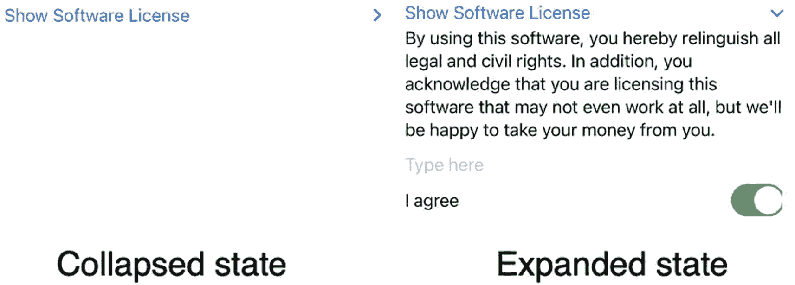
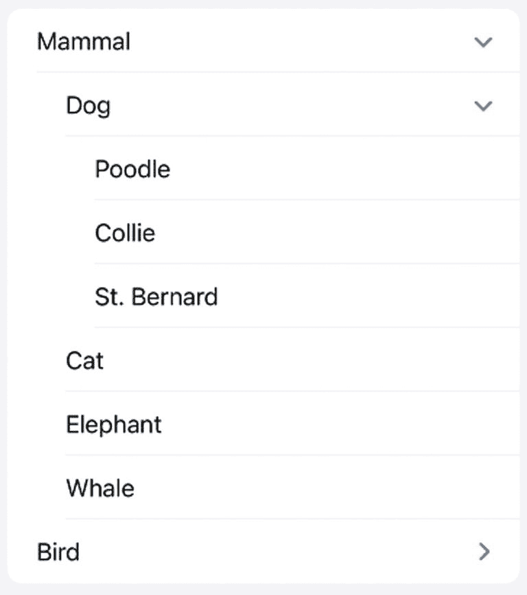
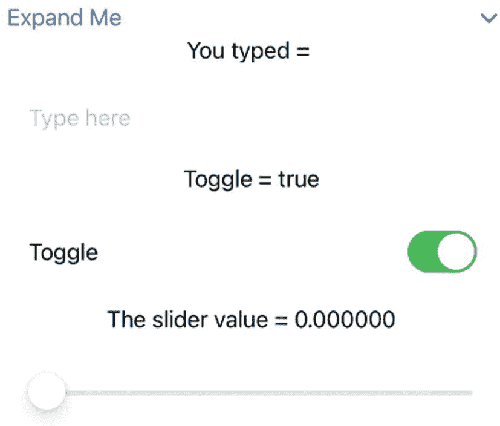
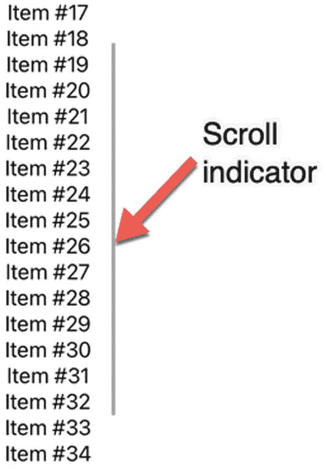
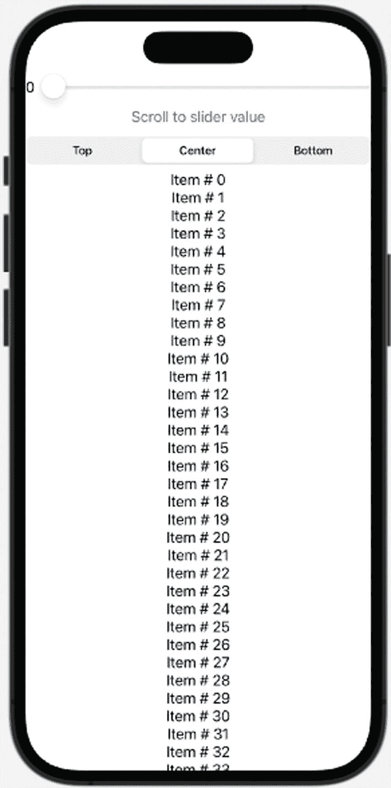
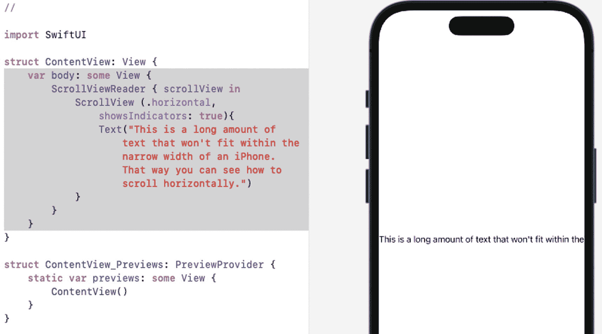

# 15. 使用 Disclosure Groups、Scroll Views 和 Outline Groups

许多应用程序包含大量信息，例如姓名和地址。但是，你可能不希望同时查看所有存储的信息，以免屏幕杂乱。当你希望让用户有选择地隐藏或显示信息时，就可以使用 `Disclosure Group` 或 `Outline Group`。

一个 `Disclosure Group` 可以呈现两种状态。首先，它可以显示为代表链接的单行文本。其次，当用户点击此链接时，它会展开以显示一个或多个额外的视图，如图 15-1 所示。



**图 15-1** – Disclosure Group 的两种状态

`Disclosure Group` 可以可选地隐藏或显示一组相关视图，而 `Outline Group` 可以可选地在 `List`（参见第 13 章）中隐藏或显示文本组，如图 15-2 所示。



**图 15-2** – Outline Group 的外观


## 使用公开组

`DisclosureGroup` 旨在隐藏一个或多个视图（如 `Text`、`Slider`、`Toggle` 等），直到用户点击 `DisclosureGroup` 名称将其展开。当展开时，`DisclosureGroup` 会在用户界面上显示一个或多个视图。

**注意：** 与堆栈类似，`DisclosureGroup` 最多可容纳十（10）个视图。但其中部分视图可以是能够容纳多个视图的堆栈。此外，你还可以在其他公开组中嵌套公开组。

要创建一个 `DisclosureGroup`，首先需要创建一段描述性的文本，它在用户界面上代表一个链接。这段文本最右侧会显示 `>` 符号，向用户表明此链接包含隐藏项目。其次，你需要创建一个视图列表（最多十个），这些视图将在用户选择 `DisclosureGroup` 链接时显示。

要了解如何创建 `DisclosureGroup`，请遵循以下步骤：



**图 15-3** – 展开后的 `DisclosureGroup`

1. 创建一个新的 SwiftUI iOS App 项目，并为其任意命名，例如“DisclosureGroup”。
2. 在导航器窗格中点击 `ContentView` 文件。
3. 在 `struct ContentView: View` 这行下方添加三个 `State` 变量，具体如下：

    ```
    @State var sliderValue = 0.0
    @State var message = ""
    @State var flag = true
    ```

4. 在 `var body: some View` 内添加一个 `DisclosureGroup`，具体如下：

    ```
    var body: some View {
    DisclosureGroup("展开我") {
    }.padding()
    }
    ```

5. 在 `DisclosureGroup` 内部添加以下内容：

    ```
    var body: some View {
    DisclosureGroup("展开我") {
    Text("你输入了 = \(message)")
    TextField("在此输入", text: $message)
    .padding()
    Text(flag ? "开关 = true" : "开关 = false")
    Toggle(isOn: $flag) {
    Text("开关")
    }.padding()
    Text("滑动条值 = \(sliderValue)")
    Slider(value: $sliderValue, in: 0...15)
    .padding()
    }.padding()
    }
    ```

    完整的 `ContentView` 文件应如下所示：

    ```
    import SwiftUI
    struct ContentView: View {
    @State var sliderValue = 0.0
    @State var message = ""
    @State var flag = true
    var body: some View {
    DisclosureGroup("展开我") {
    Text("你输入了 = \(message)")
    TextField("在此输入", text: $message)
    .padding()
    Text(flag ? "开关 = true" : "开关 = false")
    Toggle(isOn: $flag) {
    Text("开关")
    }.padding()
    Text("滑动条值 = \(sliderValue)")
    Slider(value: $sliderValue, in: 0...15)
    .padding()
    }.padding()
    }
    }
    struct ContentView_Previews: PreviewProvider {
    static var previews: some View {
    ContentView()
    }
    }
    ```

6. 在画布窗格中点击 Live 图标。
7. 点击“展开我” `DisclosureGroup` 链接，以显示隐藏在内的所有视图，如图 15-3 所示。
8. 点击文本字段并输入一些文字。请注意，无论你输入什么，都会显示在显示“你输入了 =”的 `Text` 视图中。
9. 点击 `Toggle`。请注意，每次点击 `Toggle`，`Toggle` 上方的 `Text` 视图都会显示“开关 = true”或“开关 = false”。
10. 左右拖动 `Slider`。请注意，当你拖动 `Slider` 时，其数值会显示在 `Slider` 上方显示“滑动条值 =”的 `Text` 视图中。
11. 再次点击 `DisclosureGroup` 链接以隐藏所有视图。每次点击 `DisclosureGroup` 链接时，它都会在显示 `DisclosureGroup` 内的所有视图和隐藏它们之间切换。

## 使用滚动视图

当你在 `VStack` 内排列多个视图时，这些视图会固定在用户界面上。如果你显示的视图超出用户界面所能显示的范围，部分视图会被截断或隐藏于视线之外。为了解决这个问题，SwiftUI 提供了一个名为 `ScrollView` 的特殊容器。

与堆栈类似，`ScrollView` 可以容纳多个视图。但与堆栈不同的是，`ScrollView` 允许用户垂直或水平滚动，以查看 `ScrollView` 的全部内容。滚动视图可以用于任何可能使用堆栈的地方，包括在 `DisclosureGroup` 内部。

创建 `ScrollView` 最简单的方法是像这样定义一个 `ScrollView`：

```
ScrollView {
//  多个视图在此
}
```

这样你可以垂直滚动，右侧会有一个滚动指示器。滚动指示器让你了解当前滚动位置距离项目列表开头或结尾有多近（或多远），如图 15-4 所示。



**图 15-4** – 垂直滚动的 `ScrollView` 右侧显示滚动指示器

创建 `ScrollView` 的另一种方式是定义滚动方向（`Axis.Set.horizontal` 或 `Axis.Set.vertical`）以及是否显示滚动指示器（`showsIndicators:` 参数），具体如下：

```
ScrollView(Axis.Set.horizontal, showsIndicators: false, content: {
}
```

要了解 `ScrollView` 的工作原理，请遵循以下步骤：

1. 创建一个新的 SwiftUI iOS App 项目，并为其任意命名，例如“ScrollView”。
2. 在导航器窗格中点击 `ContentView` 文件。
3. 在 `var body: some View` 这行下方添加一个 `ScrollView`，具体如下：

    ```
    var body: some View {
    VStack {
    ScrollView(Axis.Set.vertical, showsIndicators: true, content: {
    })
    }
    .padding()
    }
    ```

    为了缩短 `ScrollView` 的代码，你可以这样写：

    ```
    var body: some View {
    VStack {
    ScrollView {
    }
    }
    ```

4. 在 `ScrollView` 内部添加一个 `ForEach` 循环，具体如下：

    ```
    var body: some View {
    VStack {
    ScrollView(Axis.Set.vertical, showsIndicators: true, content: {
    ForEach(0..<50) {
    Text("项目 #\($0)     ")
    }
    })
    }
    .padding()
    }
    ```

    完整的 `ContentView` 文件应如下所示：

    ```
    import SwiftUI
    struct ContentView: View {
    var body: some View {
    VStack {
    ScrollView(Axis.Set.vertical, showsIndicators: true, content: {
    ForEach(0..<50) {
    Text("项目 #\($0)     ")
    }
    })
    }
    .padding()
    }
    }
    struct ContentView_Previews: PreviewProvider {
    static var previews: some View {
    ContentView()
    }
    }
    ```

5. 在画布窗格中点击 Live 图标。
6. 在用户界面上显示的项目列表中上下滚动。请注意，当你上下滚动时，可以在右侧看到滚动指示器（参见图 15-4）。


### 跳转到指定位置

`ScrollView` 可以显示大量项目。然而，显示的项目越多，就越难找到某个特定的项目。与其强迫用户无休止地滚动，SwiftUI 提供了在 `ScrollView` 中跳转到指定位置的功能。

因此，如果一个 `ScrollView` 显示了 100 个项目，你可以直接跳转到 `ScrollView` 中的某个特定位置，比如第 54 个项目或第 12 个项目。这使得用户可以轻松地在 `ScrollView` 的大量项目列表中快速跳转到特定的数字位置。

当跳转到 `ScrollView` 中的特定位置时，你可以选择该项目的显示或锚定位置：`.top`、`.center` 或 `.bottom`。`.top` 锚点将所选项目显示在屏幕顶部，`.center` 锚点将所选项目显示在屏幕中央，`.bottom` 锚点将所选项目显示在屏幕底部。

要了解如何在 `ScrollView` 中跳转到特定位置，请按照以下步骤操作：



一张智能手机的示意图，屏幕上显示了一个项目列表。方向设置为居中。顶部有一个设置，用于调整滚动到滑块的值。

图 15-5 — 完整的用户界面

1. 创建一个新的 SwiftUI iOS App 项目，并为其任意命名，例如 “ScrollViewJumpTo”。
2. 在导航器窗格中点击 `ContentView` 文件。
3. 在 `struct ContentView` 行下方添加两个状态变量，如下所示：

```
    @State var sliderValue = 0.0
    @State var anchorPosition = UnitPoint.center
```

4. 在 `var body: some View` 行下方添加一个 `ScrollViewReader`，如下所示：

```
    var body: some View {
    ScrollViewReader { scrollView in
    }
    }
```

5. 在 `ScrollViewReader` 内部添加一个 `HStack`，并在 `HStack` 内放置一个 `Text` 视图和一个 `Slider`，如下所示：

```
    var body: some View {
    ScrollViewReader { scrollView in
    HStack {
    Text("\(Int(sliderValue))")
    Slider(value: $sliderValue, in: 0...99)
    }
    }
    }
```

`Text` 视图将 `Slider` 的值显示为整数，因为 `Slider` 的值是 `Double` 数据类型。`Slider` 的取值范围是 0 到 99。

6. 在 `HStack` 下方添加一个 `Button`。这个 `Button` 将允许我们滚动到 `ScrollView` 列表中由 `Slider` 定义的特定位置：

```
    var body: some View {
    ScrollViewReader { scrollView in
    HStack {
    Text("\(Int(sliderValue))")
    Slider(value: $sliderValue, in: 0...99)
    }
    Button("滚动到滑块值") {
    withAnimation{
    scrollView.scrollTo(Int(sliderValue), anchor: anchorPosition)
    }
    }
    }
    }
```

`Button` 获取 `Slider` 中存储的值，并跳转到 `ScrollView` 中的该位置。`withAnimation` 使 `ScrollView` 逐渐移动到由锚点定义的位置。

7. 在 `Button` 下方添加一个 `Picker`，如下所示：

```
    var body: some View {
    ScrollViewReader { scrollView in
    HStack {
    Text("\(Int(sliderValue))")
    Slider(value: $sliderValue, in: 0...99)
    }
    Button("滚动到滑块值") {
    withAnimation{
    scrollView.scrollTo(Int(sliderValue), anchor: anchorPosition)
    }
    }
    Picker("位置", selection: $anchorPosition, content: {
    Text("顶部").tag(UnitPoint.top)
    Text("中间").tag(UnitPoint.center)
    Text("底部").tag(UnitPoint.bottom)
    }).pickerStyle(.segmented)
    }
    }
```

`Picker` 显示一个包含三个选项的分段控件：顶部、中间和底部。这样用户就可以决定使用哪种类型的锚点来滚动到 `ScrollView` 中的特定项目。

8. 在 `Picker` 视图下方添加 `ScrollView`，如下所示：

```
    var body: some View {
    ScrollViewReader { scrollView in
    HStack {
    Text("\(Int(sliderValue))")
    Slider(value: $sliderValue, in: 0...99)
    }
    Button("滚动到滑块值") {
    withAnimation{
    scrollView.scrollTo(Int(sliderValue), anchor: anchorPosition)
    }
    }
    Picker("位置", selection: $anchorPosition, content: {
    Text("顶部").tag(UnitPoint.top)
    Text("中间").tag(UnitPoint.center)
    Text("底部").tag(UnitPoint.bottom)
    }).pickerStyle(.segmented)
    ScrollView {
    }
    }
    }
```

9. 在 `ScrollView` 内部添加一个 `ForEach` 循环来创建项目列表：

```
    var body: some View {
    ScrollViewReader { scrollView in
    HStack {
    Text("\(Int(sliderValue))")
    Slider(value: $sliderValue, in: 0...99)
    }
    Button("滚动到滑块值") {
    withAnimation{
    scrollView.scrollTo(Int(sliderValue), anchor: anchorPosition)
    }
    }
    Picker("位置", selection: $anchorPosition, content: {
    Text("顶部").tag(UnitPoint.top)
    Text("中间").tag(UnitPoint.center)
    Text("底部").tag(UnitPoint.bottom)
    }).pickerStyle(.segmented)
    ScrollView {
    ForEach(0..<100) { index in
    Text("项目 # \(index)")
    .id(index)
    }
    }
    }
    }
```

请注意，`ScrollView` 内部的 `Text` 视图包含一个 `.id` 修饰符，它跟踪从 0 到 99（不包括 100）的索引值。`.scrollTo` 命令将使用此 `.id` 值来跳转到 `ScrollView` 中的特定项目。用户界面应如图 15-5 所示。

1. 点击画布窗格中的“实时”图标。
2. 将 `Slider` 拖动到一个较大的值，例如 67。
3. 点击“滚动到滑块值”`Button`。注意，您选择的位置会出现在屏幕中央。
4. 点击分段控件并选择“顶部”或“底部”，然后点击“滚动到滑块值”`Button`。您选择的值将出现在屏幕顶部或底部附近。

### 定义水平滚动视图

默认情况下，`ScrollView` 是垂直滚动的。但是，你也可以将滚动方向更改为水平，这对于滚动浏览可能因太宽而无法在屏幕上完全显示的信息（例如大量文本）非常方便。

要了解如何使 `ScrollView` 水平滚动，请按照以下步骤操作：



左侧是一个代码插图，用于展示以下文本。这是一段很长的文本，无法适应 iPhone 的狭窄宽度。右侧是一张智能手机的示意图，屏幕上部分显示了该文本。

图 15-6 — 水平滚动让你能够查看被 iOS 屏幕边界截断的文本

1. 创建一个新的 SwiftUI iOS App 项目，并为其任意命名，例如 “ScrollViewHorizontal”。
2. 在导航器窗格中点击 `ContentView` 文件。
3. 在 `var body: some View` 行下方添加一个 `ScrollViewReader`，如下所示：

```
    var body: some View {
    ScrollViewReader { scrollView in
    }
    }
```

4. 在 `ScrollViewReader` 内部添加 `ScrollView`，如下所示：

```
    var body: some View {
    ScrollViewReader { scrollView in
    ScrollView (.horizontal, showsIndicators: true){
    Text("这是一段很长的文本，无法适应 iPhone 的狭窄宽度。这样你就能看到如何水平滚动了。")
    }
    }
    }
```

5. 点击画布窗格中的“实时”图标。文本在模拟 iOS 设备的右侧被截断，如图 15-6 所示。
6. 将鼠标指针移到文本上，并左右拖动，以查看文本如何水平滚动。


## 使用大纲组

大纲组就像一个超级公开组。主要区别在于，公开组最多只能显示十个视图，而大纲组可以显示在单独类中定义的无限数量的项目。此外，大纲组会自动缩进类别，便于查看项目之间的层级关系（见图 15-2）。

大纲组用于显示定义关系的对象数组。要使用大纲组，你需要执行以下操作：

-   创建一个类，用于存放你想要显示的数据。
-   创建一个数组，用于存放由该类定义的多个对象。
-   创建一个大纲组，用于显示存储在对象中的数据。

要创建存放待显示数据的类，你需要使其遵循 `Identifiable` 协议。这样，基于该类的每个对象都会拥有一个唯一的标识号，如下所示：

```
class Species: Identifiable {
    let id = UUID()
}
```

接下来，你需要定义要在大纲组中显示的数据，例如一个字符串：

```
class Species: Identifiable {
    let id = UUID()
    var name: String
}
```

下一步是创建一个可选的数组，用于存放子类别。这些子类别项目也必须是同一个类，如下所示：

```
class Species: Identifiable {
    let id = UUID()
    var name: String
    var classification: [Species]?
}
```

最后，该类需要一个初始化器，因为该类的属性都没有初始值。这意味着每次创建对象时，都必须为其属性赋值。在这种情况下，唯一需要赋值的属性是 `name` 属性，它持有一个绝对必要的 `String` 数据类型。另一个名为 `classification` 的属性可以持有一个对象数组，但也可以是 `nil` 值：

```
class Species: Identifiable {
    let id = UUID()
    var name: String
    var classification: [Species]?

    init(name: String, classification: [Species]? = nil) {
        self.name = name
        self.classification = classification
    }
}
```

定义类之后，下一步是定义一个数组，用于存放基于该类的对象，如下所示：

```
var Animals: [Species] = [
    Species(name: "Mammal", classification: [
        Species(name: "Dog", classification: [
            Species(name: "Poodle"),
            Species(name: "Collie"),
        ]),
    ]),
]
```

注意，这个数组被定义为存放基于已定义类（本例中为 `Animals`）的对象。数组中的每个对象都需要一个名称（例如 `Mammal` 或 `Collie`）。有些对象不包含子类别列表，但对于那些包含子类别的对象，你需要指定一个基于同一类（`Species`）的对象数组。在上面的例子中，`Dog` 对象定义了一个包含 `Poodle` 和 `Collie` 的对象数组。

第三步是定义一个大纲组：

```
OutlineGroup(Animals, id: \.id, children: \.classification) { creature in
    Text(creature.name)
}
```

这定义了要使用的数组（`Animals`），并使用唯一 ID（由类声明中的 `UUID()` 定义）来显示数组中的每个项目。如果对象中存储了任何子项或子类别，则由 `children:` 参数指定。最后，`OutlineGroup` 内的 `Text` 视图会显示每个对象的 `name` 属性。

要了解如何使用大纲组，请按照以下步骤操作：

1.  创建一个新的 SwiftUI iOS App 项目，并为其任意命名，例如 `OutlineGroup`。
2.  在导航器窗格中点击 `ContentView` 文件。
3.  在 `import SwiftUI` 行下方添加以下类声明，如下所示：

```
    class Species: Identifiable {
        let id = UUID()
        var name: String
        var classification: [Species]?

        init(name: String, classification: [Species]? = nil) {
            self.name = name
            self.classification = classification
        }
    }
```

4.  在 `struct ContentView: View` 行下方添加以下数组，如下所示：

```
    struct ContentView: View {
        var Animals: [Species] = [
            Species(name: "Mammal", classification: [
                Species(name: "Dog", classification: [
                    Species(name: "Poodle"),
                    Species(name: "Collie"),
                    Species(name: "St. Bernard"),
                ]),
                Species(name: "Cat"),
                Species(name: "Elephant"),
                Species(name: "Whale"),
            ]),
            Species(name: "Bird", classification: [
                Species(name: "Canary"),
                Species(name: "Parakeet"),
                Species(name: "Eagle"),
            ]),
        ]
```

5.  在 `var body: some View` 行下方添加 `OutlineGroup`，如下所示：

```
    var body: some View {
        List {
            OutlineGroup(Animals, id: \.id, children: \.classification) { creature in
                Text(creature.name)
            }
        }
    }
```

整个 `ContentView` 文件应如下所示：

```
    import SwiftUI

    class Species: Identifiable {
        let id = UUID()
        var name: String
        var classification: [Species]?

        init(name: String, classification: [Species]? = nil) {
            self.name = name
            self.classification = classification
        }
    }

    struct ContentView: View {
        var Animals: [Species] = [
            Species(name: "Mammal", classification: [
                Species(name: "Dog", classification: [
                    Species(name: "Poodle"),
                    Species(name: "Collie"),
                    Species(name: "St. Bernard"),
                ]),
                Species(name: "Cat"),
                Species(name: "Elephant"),
                Species(name: "Whale"),
            ]),
            Species(name: "Bird", classification: [
                Species(name: "Canary"),
                Species(name: "Parakeet"),
                Species(name: "Eagle"),
            ]),
        ]

        var body: some View {
            List {
                OutlineGroup(Animals, id: \.id, children: \.classification) { creature in
                    Text(creature.name)
                }
            }
        }
    }

    struct ContentView_Previews: PreviewProvider {
        static var previews: some View {
            ContentView()
        }
    }
```

6.  点击 Canvas 窗格中的 Live 图标。
7.  点击大纲组中任何在右侧显示 `>` 字符的项目。这表示该项目包含可展开显示的附加列表（见图 15-2）。

大纲组对于存储和显示用户可以隐藏或展开的项目列表非常方便。由于大纲组使用数组，因此你可以在大纲组中显示的项目数量没有限制（不同于公开组的十视图限制）。

## 总结

公开组可以方便地将一个或多个视图临时隐藏起来。通过点击公开组标题，你可以在查看附加视图和隐藏它们之间切换。可以将公开组视为可折叠的视图列表。

虽然公开组使得隐藏或显示数据变得容易，但滚动视图使得上下滚动（或左右滚动）以查看更多数据变得容易。你甚至可以在公开组内部使用滚动视图。

如果你需要以层级结构显示数据，请考虑使用大纲组。使用大纲组需要定义一个类，其中包含你想要存储的属性，以及一个 `UUID()` 来为每条数据自动创建唯一的 ID 号。然后，你需要根据定义的类创建一个对象数组。最后，你可以使用 `OutlineGroup` 在屏幕上显示数据。

公开组、滚动视图和大纲组只是将相关数据分组到一起的不同方式。公开组像可折叠的列表。滚动视图让用户看到通常可能被截断的数据。大纲组像多个公开组，可以有选择地隐藏或显示数据。这三种视图的全部目的就是提供向用户展示信息的不同方式。


