# 16. 创建图表

应用程序需要向用户展示信息。无论这些信息是文本还是数字，大量的数据都可能难以理解。这就是为什么许多应用会将信息转化为图表，以便轻松追踪趋势、进行比较或识别比例。图表能将数字数据转换成一目了然的彩色图像。

创建任何图表的关键在于识别你拥有的数据，并确定你想要讲述关于这些数据的什么故事。例如，一份销售清单可以用来展示销售额是如何增长（或萎缩）的，哪些时间段的利润最高（以及哪些最低），不同销售人员的业绩对比，或者哪些产品可能比其他产品卖得更好。

用数据创建图表没有绝对正确或错误的方法。由于图表的目的是沟通，你唯一可能犯的错误是创建了一个无法讲述你想表达的关于数据故事的图表。`SwiftUI` 可以创建如图 16-1 所示的几种图表类型：

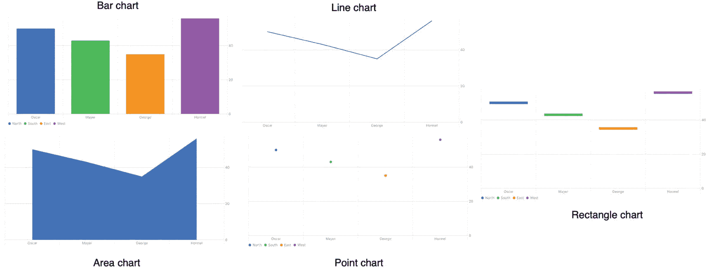

**图 16-1** 可用的不同图表类型

- 条形图
- 散点图
- 折线图
- 面积图
- 矩形图

图表使用数字数据来定义坐标轴上的标记。标记以视觉方式衡量数据，而坐标轴则像一把尺子，帮助用户确定每个标记所代表的数量。在条形图中，单个条形是一个标记；在折线图中，单条线是一个标记，如图 16-2 所示。

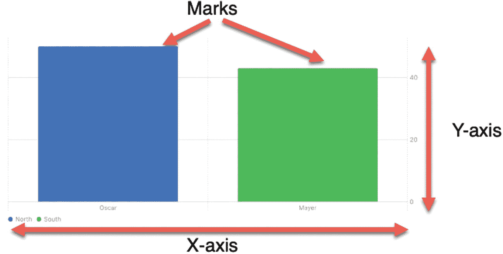

**图 16-2** 识别图表中的标记和坐标轴

要创建图表，你必须像这样导入 `Charts` 框架：

```
import Charts
```

然后，你可以在 body 中像这样定义一个图表：

```
Chart {
}
```

## 创建条形图

要创建条形图，你需要使用 `BarMark` 来定义 x 和 y 值，如下所示：

```
BarMark(x: .value("类别", "图表标签"),
y: .value("数量", 0))
```

x 值定义了数据的类别（帮助你理解每个标记代表什么）以及在图表上显示的标签。y 值定义了数据的数量，后跟一个数值，如图 16-3 所示。

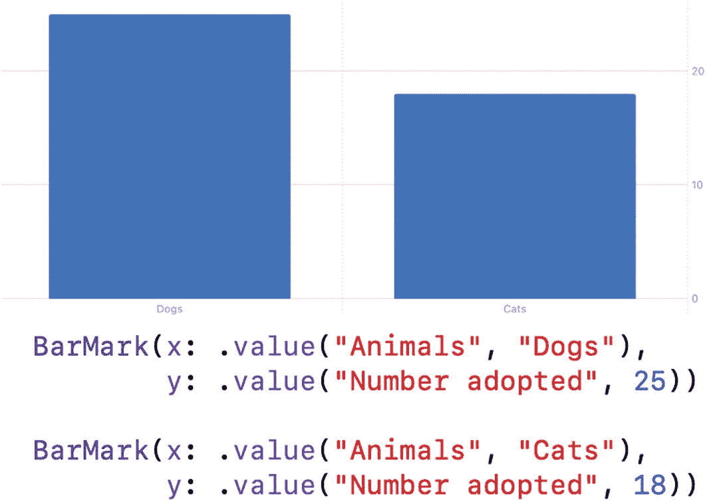

**图 16-3** `BarMark` 如何定义条形图

注意，在图 16-3 中，“狗”和“猫”的文字显示在每个标记下方，而数值 25 和 18 定义了每个标记的高度。“动物”这个文本有助于识别“狗”和“猫”所属的类别，“领养数量”这个文本则有助于理解每个数值的含义。

请注意，“动物”和“领养数量”都不会显示在图表上，因为这些文本旨在帮助你理解每个标记所展示的数据。另外需要注意的是，你可以用一个或多个变量替换固定的数值。这样，当数值发生变化时，图表的外观也会随之改变。

要了解如何创建一个简单的条形图，请遵循以下步骤：

1.  创建一个新的 `SwiftUI` iOS 应用项目，并给它起一个你喜欢的名字，例如“BarChartSimple”。
2.  在导航器窗格中点击 `ContentView` 文件。
3.  在 `SwiftUI` 框架下方添加 `Charts` 框架，如下所示：

```
import Charts
```

1.  在 `struct ContentView: View` 这行代码下方添加一个 `@State` 变量，如下所示：

```
@State var sliderValue = 50.0
```

1.  在 `VStack` 内部添加一个 `Chart`，如下所示：

```
var body: some View {
VStack {
Chart {
}
}
}
```

1.  在 `Chart` 内部添加两个 `BarMark` 来定义两个条形，如下所示：

```
var body: some View {
VStack {
Chart {
BarMark(x: .value("姓名", "Oscar"),
y: .value("销售额", 50))
BarMark(x: .value("姓名", "Mayer"),
y: .value("销售额", Int(sliderValue)))
}
}
}
```

这段代码定义了一个包含两个垂直条形的条形图。

1.  在 `Chart` 下方添加如下的 `HStack`：

```
var body: some View {
VStack {
Chart {
BarMark(x: .value("姓名", "Oscar"),
y: .value("销售额", 50))
BarMark(x: .value("姓名", "Mayer"),
y: .value("销售额", Int(sliderValue)))
}
HStack {
Text("\(Int(sliderValue))")
Slider(value: $sliderValue, in: 1...100)
}.padding()
}
}
```

`HStack` 显示了一个 `Text` 视图和一个 `Slider`，其中 `Text` 视图显示了 `Slider` 的当前值，其范围可以从 1 到 100。整个 `ContentView` 文件应该如下所示：

```
import SwiftUI
import Charts
struct ContentView: View {
@State var sliderValue = 50.0
var body: some View {
VStack {
Chart {
BarMark(x: .value("姓名", "Oscar"),
y: .value("销售额", 50))
BarMark(x: .value("姓名", "Mayer"),
y: .value("销售额", Int(sliderValue)))
}
HStack {
Text("\(Int(sliderValue))")
Slider(value: $sliderValue, in: 1...100)
}.padding()
}
}
}
struct ContentView_Previews: PreviewProvider {
static var previews: some View {
ContentView()
}
}
```

1.  在画布窗格中点击“实时”图标。
2.  拖动 `Slider`，观察 `Slider` 的值如何调整第二个条形的高度。当你拖动 `Slider` 改变其值时，注意 `Charts` 框架如何自动将 Y 轴的值调整到最大值 100。


### 使用循环和数组定义图表

对于小型图表，定义一两个标记（例如 `BarMarks`）很容易。然而，如果你需要为大量数据绘制图表，逐一定义每个标记就会变得很繁琐。更糟糕的是，对于大小会变化的数据，你可能无法事先知道图表需要的确切标记数量。

因此，更好的做法不是单独定义标记，而是依靠数据结构和循环来定义图表中每个标记的数量和高度。首先，我们需要定义一个结构来存放要绘制图表的数据：

```swift
struct SalesPeople: Identifiable {
    var name: String
    var sales: Int
    var id: String { name }
}
```

该结构让你能定义两种数据类型来定义你的图表。在这个示例中，它们是 `String`（姓名）和 `Int`（销售额数量）。该结构需要一个 `ID` 来标识它自己，因此整个结构必须定义为 `Identifiable`，并且 `id` 被定义为基于 `name` 属性的 `String`。

其次，我们需要像这样创建一个刚刚定义的结构体的数组：

```swift
var mySalesArray: [SalesPeople] = [
    .init(name: "Oscar", sales: 50),
    .init(name: "Mayer", sales: 43),
    .init(name: "George", sales: 62),
    .init(name: "Hormel", sales: 26)
]
```

一旦我们拥有一个结构体数组，其中数组定义了类别（`name`）和值（`sales`），我们就可以在图表中使用它。这意味着要定义包含图表数据的数组名，以及一个临时存储每个数组元素的任意变量名，就像这样：

```swift
Chart(mySalesArray) { x in
}
```

最后，我们需要定义一个 `BarMark`，用于访问每个数组元素的 `name` 和 `sales` 属性，就像这样：

```swift
Chart(mySalesArray) { x in
    BarMark(x: .value("Name", x.name),
            y: .value("Sales", x.sales))
}
```

要了解如何使用结构体数组来定义条形图，请遵循以下步骤：

1.  创建一个新的 SwiftUI iOS App 项目，并给它任意你喜欢的名字，比如“BarChartArray”。
2.  在导航器窗格中点击 `ContentView` 文件。
3.  在 `SwiftUI` 框架下方添加 `Charts` 框架，像这样：

    ```swift
    import Charts
    ```

4.  在 `import Charts` 行下方添加一个结构体，像这样：

    ```swift
    struct SalesPeople: Identifiable {
        var name: String
        var sales: Int
        var id: String { name }
    }
    ```

5.  在结构体下方添加一个数组，像这样：

    ```swift
    var mySalesArray: [SalesPeople] = [
        .init(name: "Oscar", sales: 50),
        .init(name: "Mayer", sales: 43),
        .init(name: "George", sales: 62),
        .init(name: "Hormel", sales: 26)
    ]
    ```

6.  在 `VStack` 内部添加一个 `Chart`，像这样：

    ```swift
    VStack {
        Chart(mySalesArray) { x in
        }
    }
    ```

7.  在 `Chart` 内部添加一个 `BarMark`，像这样：

    ```swift
    VStack {
        Chart(mySalesArray) { x in
            BarMark(x: .value("Name", x.name),
                    y: .value("Sales", x.sales))
        }
    }
    ```

    整个 `ContentView` 文件应该看起来像这样：

    ```swift
    import SwiftUI
    import Charts

    struct SalesPeople: Identifiable {
        var name: String
        var sales: Int
        var id: String { name }
    }

    var mySalesArray: [SalesPeople] = [
        .init(name: "Oscar", sales: 50),
        .init(name: "Mayer", sales: 43),
        .init(name: "George", sales: 62),
        .init(name: "Hormel", sales: 26)
    ]

    struct ContentView: View {
        var body: some View {
            VStack {
                Chart(mySalesArray) { x in
                    BarMark(x: .value("Name", x.name),
                            y: .value("Sales", x.sales))
                }
            }
        }
    }

    struct ContentView_Previews: PreviewProvider {
        static var previews: some View {
            ContentView()
        }
    }
    ```

8.  点击画布窗格中的 Live 图标。 注意，图表创建了四个不同的标记（条形），它们显示了一个底部标签（`name`）。 每个标记（条形）的高度表示其数值的大小。

### 为条形图定义颜色

通常，条形图会以默认的蓝色显示每个标记（条形）。 但是，你可以通过使用 `.foregroundStyle` 修改器来选择不同的颜色，就像这样：

```swift
BarMark(x: .value("Name", x.name),
        y: .value("Sales", x.sales))
    .foregroundStyle(.orange)
```

`.foregroundStyle` 修改器定义单一颜色。 要以不同颜色显示标记（条形），我们需要定义第三个类别。 这样每个类别就会以它自己的颜色出现。 在前面的例子中，我们仅基于 `name` 和 `sales` 创建了标记（条形），像这样：

```swift
.init(name: "Hormel", sales: 26)
```

`name` 标识每个标记（条形），而 `sales` 定义了标记（条形）的外观。 要创建不同的颜色，我们需要添加第三个类别，比如：

```swift
.init(name: "Hormel", department: "West", sales: 26)
```

这个新类别（`department`）将定义颜色。 每个部门都会获得一种独特的颜色，如图 16-4 所示。

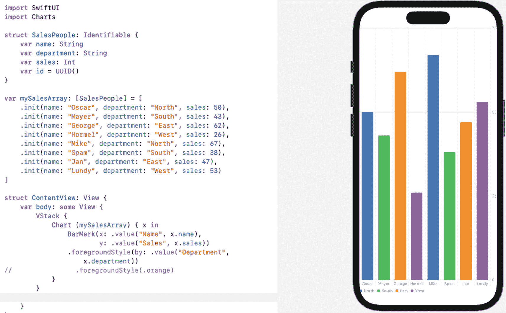

**图 16-4** 为每个标记（条形）显示不同的颜色

要了解如何为条形图创建多种颜色，请遵循以下步骤：

1.  创建一个新的 SwiftUI iOS App 项目，并给它任意你喜欢的名字，比如“BarChartMultipleColors”。
2.  在导航器窗格中点击 `ContentView` 文件。
3.  在 `SwiftUI` 框架下方添加 `Charts` 框架，像这样：

    ```swift
    import Charts
    ```

4.  在 `import Charts` 行下方添加一个结构体，像这样：

    ```swift
    struct SalesPeople: Identifiable {
        var name: String
        var department: String
        var sales: Int
        var id = UUID()
    }
    ```

    注意，我们添加了一个名为“department”的新类别。 还要注意，`id` 被设置为 `UUID()` 以便为每个结构体创建唯一的标识符。 这基本上等同于之前项目结构中从 `name` 创建 `id` 的方式，像这样：

    ```swift
    var id: String { name }
    ```

    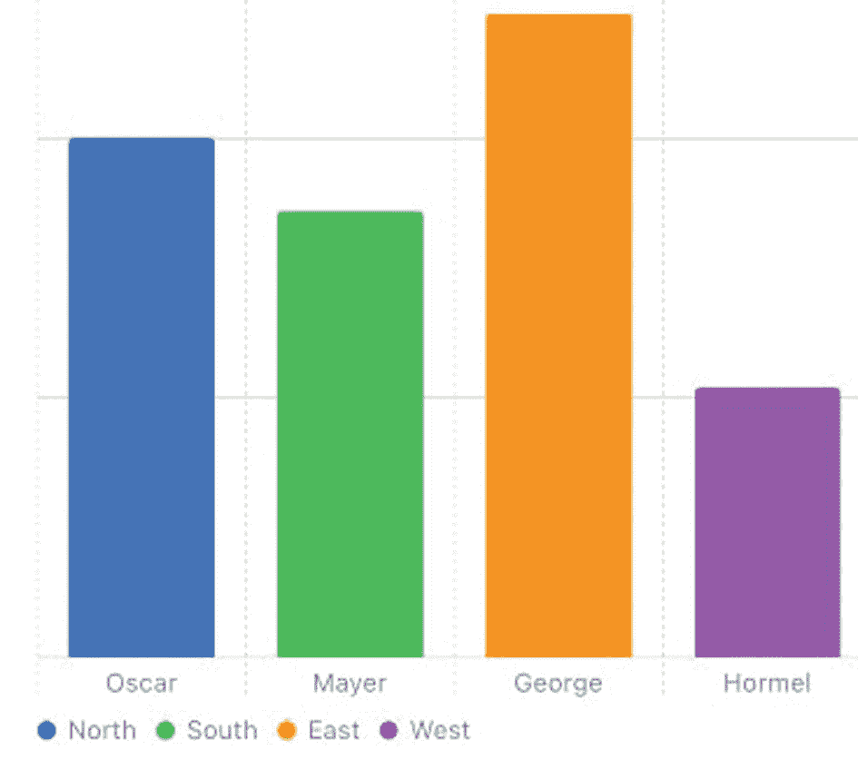

    **图 16-5** 每个标记（条形）由不同的颜色标识

5.  在结构体下方添加一个数组，像这样：

    ```swift
    var mySalesArray: [SalesPeople] = [
        .init(name: "Oscar", department: "North", sales: 50),
        .init(name: "Mayer", department: "South", sales: 43),
        .init(name: "George", department: "East", sales: 62),
        .init(name: "Hormel", department: "West", sales: 26),
        .init(name: "Mike", department: "North", sales: 67),
        .init(name: "Spam", department: "South", sales: 38),
        .init(name: "Jan", department: "East", sales: 47),
        .init(name: "Lundy", department: "West", sales: 53)
    ]
    ```

    注意，这个数组定义了不同的部门：North、South、East 和 West。 我们将使用这个 `department` 值来让每个部门以不同的颜色显示。

6.  在 `VStack` 内部添加一个 `Chart`，像这样：

    ```swift
    VStack {
        Chart(mySalesArray) { x in
        }
    }
    ```

7.  在 `Chart` 内部添加一个 `BarMark`，像这样：

    ```swift
    VStack {
        Chart(mySalesArray) { x in
            BarMark(x: .value("Name", x.name),
                    y: .value("Sales", x.sales))
        }
    }
    ```

8.  添加一个 `.foregroundStyle` 修改器，像这样：

    ```swift
    VStack {
        Chart(mySalesArray) { x in
            BarMark(x: .value("Name", x.name),
                    y: .value("Sales", x.sales))
                .foregroundStyle(by: .value("Department", x.department))
        }
    }
    ```

整个 `ContentView` 文件应该看起来像这样：

```swift
import SwiftUI
import Charts

struct SalesPeople: Identifiable {
    var name: String
    var department: String
    var sales: Int
    var id = UUID()
}

var mySalesArray: [SalesPeople] = [
    .init(name: "Oscar", department: "North", sales: 50),
    .init(name: "Mayer", department: "South", sales: 43),
    .init(name: "George", department: "East", sales: 62),
    .init(name: "Hormel", department: "West", sales: 26),
    .init(name: "Mike", department: "North", sales: 67),
    .init(name: "Spam", department: "South", sales: 38),
    .init(name: "Jan", department: "East", sales: 47),
    .init(name: "Lundy", department: "West", sales: 53)
]

struct ContentView: View {
    var body: some View {
        VStack {
            Chart(mySalesArray) { x in
                BarMark(x: .value("Name", x.name),
                        y: .value("Sales", x.sales))
                    .foregroundStyle(by: .value("Department", x.department))
            }
        }
    }
}

struct ContentView_Previews: PreviewProvider {
    static var previews: some View {
        ContentView()
    }
}
```


```swift
import SwiftUI
import Charts

struct SalesPeople: Identifiable {
    var name: String
    var department: String
    var sales: Int
    var id = UUID()
}

var mySalesArray: [SalesPeople] = [
    .init(name: "Oscar", department: "North", sales: 50),
    .init(name: "Mayer", department: "South", sales: 43),
    .init(name: "George", department: "East", sales: 62),
    .init(name: "Hormel", department: "West", sales: 26),
    .init(name: "Mike", department: "North", sales: 67),
    .init(name: "Spam", department: "South", sales: 38),
    .init(name: "Jan", department: "East", sales: 47),
    .init(name: "Lundy", department: "West", sales: 53)
]

struct ContentView: View {
    var body: some View {
        VStack {
            Chart (mySalesArray) { x in
                BarMark(x: .value("Name", x.name),
                        y: .value("Sales", x.sales))
                .foregroundStyle(by: .value("Department", x.department))
                //                .foregroundStyle(.orange)
            }
        }
    }
}

struct ContentView_Previews: PreviewProvider {
    static var previews: some View {
        ContentView()
    }
}
```

5.  单击画布（Canvas）面板中的 Live 图标。注意，每个标记（条形）现在都显示为不同的颜色，并带有如图 16-5 所示的标签。

```swift
var id: String { name }
```

### 使用 RuleMark 显示平均值

当你有大量标记（条形）时，会比较不同值之间的差异。哪些高于平均值？哪些低于平均值？为了清晰显示这种区别，图表提供了 `RuleMark`，它可以在你所显示数据的精确平均值处显示一条线。

`RuleMark` 命令如下所示：

```swift
RuleMark (y: .value("Average Sales", (mySalesArray.map{Int($0.sales)}).reduce(0, +)/Set(mySalesArray.map({$0.sales})).count))                                       .foregroundStyle(.purple)
```

首先，我们需要定义 Y 轴上显示的是哪个数值数据。上述代码假设每个标记（条形）的高度由一个名为“销售额”的数值定义，该数值是结构体数组（`mySalesArray`）的一部分。

其次，我们需要通过将各项（如销售额）的值相加并除以总项数来计算平均值。如果有两项（3 和 5），平均值就是 (3 + 5)/2。

`.map{Int($0.sales)}.reduce(0,+)` 将所有销售额（`.map`）相加，并将其归约为单个数值。

`Set(mySalesArray.map({$0.sales})).count` 只是简单统计了销售额的总数。然后，`.foregroundStyle` 修饰符定义了 `RuleMark` 的颜色。

> **注意**：`RuleMarks` 可用于突出显示图表的任何部分。

要了解如何在图表上显示 `RuleMark`，请按照以下步骤操作：

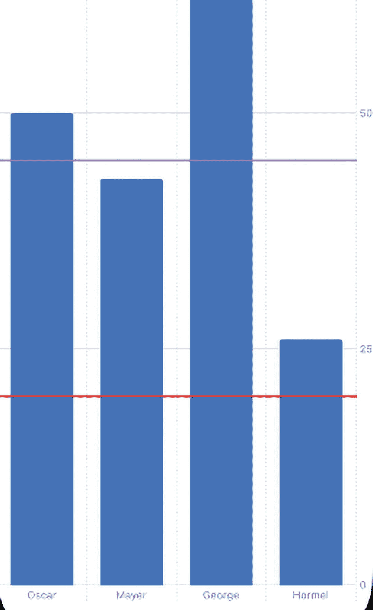

一个条形图表示了 Oscar、Mayer、George 和 Hormel 的值。它指示了同色的条形。两条不同颜色的水平线标记在条形之间。

**图 16-6** – `RuleMarks` 显示水平线以标识条形图中的特定值

1.  新建一个 SwiftUI iOS App 项目，并为其任意命名，例如“BarChartRuleMark”。

2.  在导航器面板中单击 `ContentView` 文件。在 `SwiftUI` 框架下方添加 `Charts` 框架，如下所示：

```swift
    import Charts
```

3.  在 `import Charts` 行下方添加一个结构体，如下所示：

```swift
    struct SalesPeople: Identifiable {
        var name: String
        var department: String
        var sales: Int
        var id = UUID()
    }
```

4.  在结构体下方添加一个数组，如下所示：

```swift
    var mySalesArray: [SalesPeople] = [
        .init(name: "Oscar", sales: 50),
        .init(name: "Mayer", sales: 43),
        .init(name: "George", sales: 62),
        .init(name: "Hormel", sales: 26)
    ]
```

5.  在 `VStack` 内部添加一个 `Chart`，如下所示：

```swift
    var body: some View {
        VStack {
            Chart (mySalesArray) { x in
            }
        }
    }
```

6.  在 `Chart` 内部添加一个 `BarMark`，如下所示：

```swift
    VStack {
        Chart (mySalesArray) { x in
            BarMark(x: .value("Name", x.name),
                    y: .value("Sales", x.sales))
        }
    }
```

`Chart` 内的 `BarMark` 会创建一个简单的条形图。

7.  在 `BarMark` 下方添加以下两个 `RuleMarks`，如下所示：

```swift
    VStack {
        Chart (mySalesArray) { x in
            BarMark(x: .value("Name", x.name),
                    y: .value("Sales", x.sales))
            RuleMark(y: .value("Average Sales", (mySalesArray.map{Int($0.sales)}).reduce(0, +)/Set(mySalesArray.map({$0.sales})).count))
                .foregroundStyle(.purple)
            RuleMark(y: .value("Sales must not go below this line",20))
                .foregroundStyle(.red)
        }
    }
```

整个 `ContentView` 文件应如下所示：

```swift
    import SwiftUI
    import Charts

    struct SalesPeople: Identifiable {
        var name: String
        var sales: Int
        var id = UUID()
    }

    var mySalesArray: [SalesPeople] = [
        .init(name: "Oscar", sales: 50),
        .init(name: "Mayer", sales: 43),
        .init(name: "George", sales: 62),
        .init(name: "Hormel", sales: 26)
    ]

    struct ContentView: View {
        var body: some View {
            VStack {
                Chart (mySalesArray) { x in
                    BarMark(x: .value("Name", x.name),
                            y: .value("Sales", x.sales))
                    RuleMark(y: .value("Average Sales", (mySalesArray.map{Int($0.sales)}).reduce(0, +)/Set(mySalesArray.map({$0.sales})).count))
                        .foregroundStyle(.purple)
                    RuleMark(y: .value("Sales must not go below this line",20))
                        .foregroundStyle(.red)
                }
            }
        }
    }

    struct ContentView_Previews: PreviewProvider {
        static var previews: some View {
            ContentView()
        }
    }
```

8.  单击画布（Canvas）面板中的 Live 图标。注意，紫色线条显示平均值，而红色线条则出现在任意指定的位置 20 处，如图 16-6 所示。


## 创建堆叠条形图

条形图可以追踪趋势，但堆叠条形图能让你看到整体的组成部分，例如每个季度哪些产品销量最好，或每个月哪位销售员业绩最高。创建堆叠条形图涉及三组数据：

- 用于定义标记（条形）的数值数据（y 值）
- 定义每个堆叠条形的重复数据（x 值）
- 用于分隔每个条形的类别

要在条形图中堆叠数据，x 值需要像这样重复：

```
var mySalesArray: [SalesPeople] = [
.init(name: "Oscar", department: "North", sales: 50),
.init(name: "Oscar", department: "South", sales: 43),
.init(name: "Oscar", department: "East", sales: 62),
.init(name: "Oscar", department: "West", sales: 26),
.init(name: "Mayer", department: "North", sales: 67),
.init(name: "Mayer", department: "South", sales: 38),
.init(name: "Mayer", department: "East", sales: 47),
.init(name: "Mayer", department: "West", sales: 53)
]
```

在这个数组中，`name` 代表单个堆叠条形，`department` 代表单个堆叠条形中不同的颜色部分，而 `sales` 代表堆叠条形中每个颜色部分的高度，如图 16-7 所示。

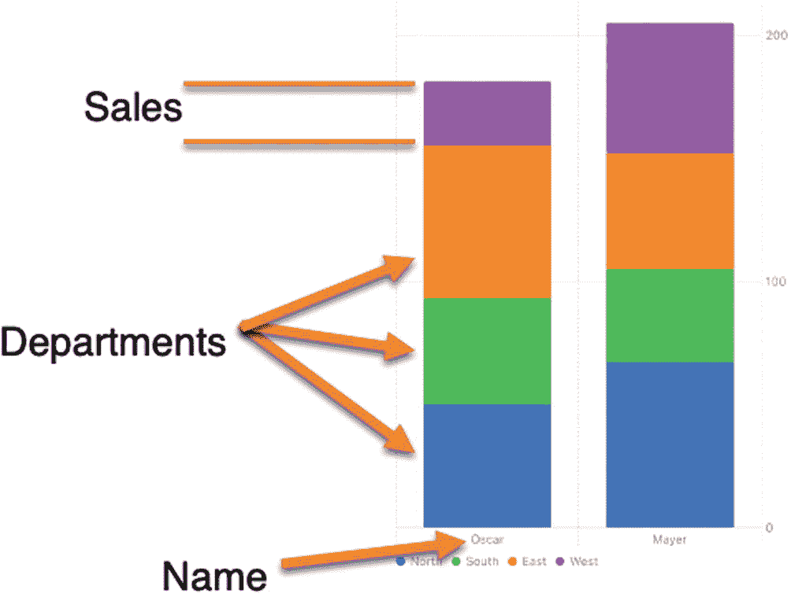

一个堆叠条形图代表 2 个条形。这些条形自上而下有 4 种不同颜色，分别代表销售额和部门。底部标示的名称分别为 Oscar 和 Mayer。

**图 16-7** 数据如何定义堆叠条形图

要了解如何创建堆叠条形图，请遵循以下步骤：

1. 创建一个新的 SwiftUI iOS App 项目，并为其任意命名，例如 `BarChartStacked`。
2. 在导航器窗格中点击 `ContentView` 文件。在 `SwiftUI` 框架下方添加 `Charts` 框架，如下所示：

```
import Charts
```

3. 在 `import Charts` 行下方添加一个结构体，如下所示：

```
struct SalesPeople: Identifiable {
var name: String
var department: String
var sales: Int
var id = UUID()
}
```

4. 在该结构体下方添加一个数组，如下所示：

```
var mySalesArray: [SalesPeople] = [
.init(name: "Oscar", department: "North", sales: 50),
.init(name: "Oscar", department: "South", sales: 43),
.init(name: "Oscar", department: "East", sales: 62),
.init(name: "Oscar", department: "West", sales: 26),
.init(name: "Mayer", department: "North", sales: 67),
.init(name: "Mayer", department: "South", sales: 38),
.init(name: "Mayer", department: "East", sales: 47),
.init(name: "Mayer", department: "West", sales: 53)
]
```

5. 在 `VStack` 内添加一个 `Chart`，如下所示：

```
var body: some View {
VStack {
Chart (mySalesArray) { x in
}
}
```

6. 在 `Chart` 内添加一个 `BarMark`，如下所示：

```
VStack {
Chart (mySalesArray) { x in
BarMark(x: .value("Name", x.name),
y: .value("Sales", x.sales))
.foregroundStyle(by: .value("Department", $0.department))
}.padding()
Spacer()
}
}
```

7. 在画布窗格中点击“Live”图标。

---

## 创建折线图

折线图在通过高度测量数值方面与条形图类似。主要区别在于，折线图更容易发现上升或下降的趋势。要创建任何图表，只需使用相应的标记，例如：

- `BarMark` – 条形图
- `LineMark` – 折线图
- `PointMark` – 点状图
- `AreaMark` – 面积图
- `RectangleMark` – 矩形图（也称为热力图）

在绘制多组数据时，折线图通常效果最佳。另一方面，在仅绘制两组数据时，条形图仍然显得很有用，如图 16-8 所示。

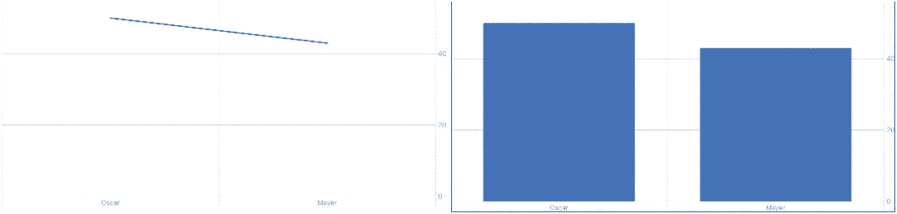

一组折线图和条形图。折线和条形以相同颜色着色。

**图 16-8** 比较条形图与折线图

要了解如何创建折线图，请遵循以下步骤：

1. 创建一个新的 SwiftUI iOS App 项目，并为其任意命名，例如 `LineChart`。
2. 在导航器窗格中点击 `ContentView` 文件。在 `SwiftUI` 框架下方添加 `Charts` 框架，如下所示：

```
import Charts
```

3. 在 `import Charts` 行下方添加一个结构体，如下所示：

```
struct SalesPeople: Identifiable {
var name: String
var department: String
var sales: Int
var id = UUID()
}
```

4. 在该结构体下方添加一个数组，如下所示：

```
var mySalesArray: [SalesPeople] = [
.init(name: "Oscar", sales: 50),
.init(name: "Mayer", sales: 43),
.init(name: "George", sales: 62),
.init(name: "Hormel", sales: 26),
.init(name: "Jan", sales: 47),
.init(name: "Lundy", sales: 53)
]
```

5. 在 `VStack` 内添加一个 `Chart`，如下所示：

```
var body: some View {
VStack {
Chart (mySalesArray) { x in
}
}
```

6. 在 `Chart` 内添加一个 `LineMark`，如下所示：

```
VStack {
Chart (mySalesArray) { x in
LineMark(x: .value("Name", x.name),
y: .value("Sales", x.sales))
}
}
```

整个 `ContentView` 文件应如下所示：

```
import SwiftUI
import Charts

struct SalesPeople: Identifiable {
var name: String
var sales: Int
var id = UUID()
}

var mySalesArray: [SalesPeople] = [
.init(name: "Oscar", sales: 50),
.init(name: "Mayer", sales: 43),
.init(name: "George", sales: 62),
.init(name: "Hormel", sales: 26),
.init(name: "Jan", sales: 47),
.init(name: "Lundy", sales: 53)
]

struct ContentView: View {
var body: some View {
VStack {
Chart (mySalesArray) { x in
LineMark(x: .value("Name", x.name),
y: .value("Sales", x.sales))
}
}
}
}

struct ContentView_Previews: PreviewProvider {
static var previews: some View {
ContentView()
}
}
```

7. 在画布窗格中点击“Live”图标。折线图将出现，如图 16-9 所示。

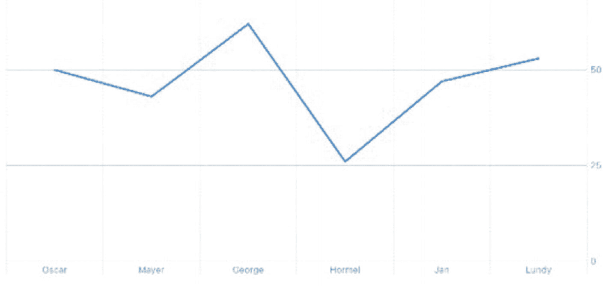

一张折线图展示了 Oscar、Mayer、George、Hormel、Jan 和 Lundy 的趋势。图表呈现波峰和波谷的进展。

**图 16-9** 折线图可以展示多组数据上的趋势


## 创建面积图

面积图本质上是折线图，但通过填充使其更易于阅读，如图 16-10 所示。

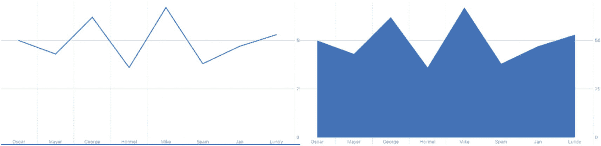

一组两张图，分别是折线图和面积图。两张图都显示了多个峰值和谷值。

图 16-10

面积图比折线图更容易理解

与折线图类似，面积图最适合绘制包含大量数据点的趋势。这样，你可以轻松查看数据随时间的变化情况。

要了解如何创建面积图，请按照以下步骤操作：

1.  创建一个新的 SwiftUI iOS App 项目，并为其任意命名，例如 `"AreaChart"`。
2.  在导航器面板中点击 `ContentView` 文件。在 `SwiftUI` 框架下方添加 `Charts` 框架，如下所示：
1.  在 `"import Charts"` 行下方添加一个结构体，如下所示：

    ```
    struct SalesPeople: Identifiable {
    var name: String
    var sales: Int
    var id = UUID()
    }
    ```

2.  在该结构体下方添加一个数组，如下所示：

    ```
    var mySalesArray: [SalesPeople] = [
    .init(name: "Oscar", sales: 50),
    .init(name: "Mayer", sales: 43),
    .init(name: "George", sales: 62),
    .init(name: "Hormel", sales: 56),
    .init(name: "Mike", sales: 27),
    .init(name: "Spam", sales: 38),
    .init(name: "Jan", sales: 33),
    .init(name: "Lundy",sales: 43)
    ]
    ```

3.  在 `VStack` 内部添加一个 `Chart`，如下所示：

    ```
    var body: some View {
    VStack {
    Chart (mySalesArray) { x in
    }
    }
    ```

4.  在 `Chart` 内部添加一个 `AreaMark`，如下所示：

    ```
    VStack {
    Chart (mySalesArray) { x in
    AreaMark(x: .value("Name", x.name),
    y: .value("Sales", x.sales))
    }
    }
    ```

    完整的 `ContentView` 文件应如下所示：

    ```
    import SwiftUI
    import Charts
    struct SalesPeople: Identifiable {
    var name: String
    var sales: Int
    var id = UUID()
    }
    var mySalesArray: [SalesPeople] = [
    .init(name: "Oscar", sales: 50),
    .init(name: "Mayer", sales: 43),
    .init(name: "George", sales: 62),
    .init(name: "Hormel", sales: 56),
    .init(name: "Mike", sales: 27),
    .init(name: "Spam", sales: 38),
    .init(name: "Jan", sales: 33),
    .init(name: "Lundy",sales: 43)
    ]
    struct ContentView: View {
    var body: some View {
    VStack {
    Chart (mySalesArray) { x in
    AreaMark(x: .value("Name", x.name),
    y: .value("Sales", x.sales))
    }
    }
    }
    }
    struct ContentView_Previews: PreviewProvider {
    static var previews: some View {
    ContentView()
    }
    }
    ```

5.  在画布面板中点击“Live”图标。

```
import Charts
```

### 创建点图

点图与折线图和面积图类似。主要区别在于，点图仅将数据显示为图表上的点。虽然这可能使得识别趋势比折线图或面积图更困难，但点图在识别数据组出现的位置时特别有用。一旦你知道数据通常应该出现在哪里，点图就能轻松识别出超出此正常范围的数据，如图 16-11 所示。

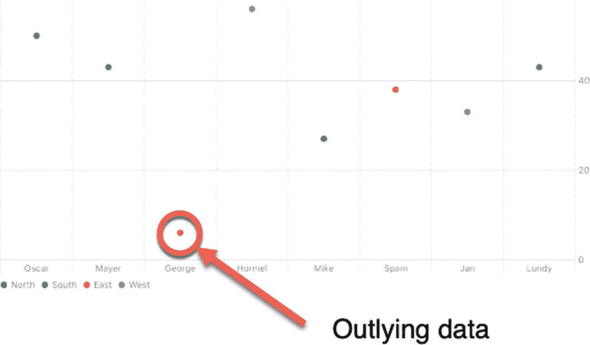

一个点图表示了多个点的分布，分别代表东、西、北、南。它高亮显示了低于正常范围的一个点作为离群数据。

图 16-11

点图使发现偏离常态的离群数据变得容易

要了解如何创建面积图，请按照以下步骤操作：

1.  创建一个新的 SwiftUI iOS App 项目，并为其任意命名，例如 `"PointChart"`。
2.  在导航器面板中点击 `ContentView` 文件。在 `SwiftUI` 框架下方添加 `Charts` 框架，如下所示：
1.  在 `"import Charts"` 行下方添加一个结构体，如下所示：

    ```
    struct SalesPeople: Identifiable {
    var name: String
    var region: String
    var sales: Int
    var id = UUID()
    }
    ```

2.  在该结构体下方添加一个数组，如下所示：

    ```
    var mySalesArray: [SalesPeople] = [
    .init(name: "Oscar", region: "North", sales: 50),
    .init(name: "Mayer", region: "South", sales: 43),
    .init(name: "George", region: "East", sales: 6),
    .init(name: "Hormel", region: "West", sales: 56),
    .init(name: "Mike", region: "North", sales: 27),
    .init(name: "Spam", region: "East", sales: 38),
    .init(name: "Jan", region: "West", sales: 33),
    .init(name: "Lundy",region: "South", sales: 43)
    ]
    ```

3.  在 `VStack` 内部添加一个 `Chart`，如下所示：

    ```
    var body: some View {
    VStack {
    Chart (mySalesArray) { x in
    }
    }
    ```

4.  在 `Chart` 内部添加一个 `PointMark`，如下所示：

    ```
    VStack {
    Chart (mySalesArray) { x in
    PointMark(x: .value("Name", x.name),
    y: .value("Sales", x.sales))
    .foregroundStyle(by: .value("Region", x.region))
    }
    }
    ```

    完整的 `ContentView` 文件应如下所示：

    ```
    import SwiftUI
    import Charts
    struct SalesPeople: Identifiable {
    var name: String
    var region: String
    var sales: Int
    var id = UUID()
    }
    var mySalesArray: [SalesPeople] = [
    .init(name: "Oscar", region: "North", sales: 50),
    .init(name: "Mayer", region: "South", sales: 43),
    .init(name: "George", region: "East", sales: 6),
    .init(name: "Hormel", region: "West", sales: 56),
    .init(name: "Mike", region: "North", sales: 27),
    .init(name: "Spam", region: "East", sales: 38),
    .init(name: "Jan", region: "West", sales: 33),
    .init(name: "Lundy",region: "South", sales: 43)
    ]
    struct ContentView: View {
    var body: some View {
    VStack {
    Chart (mySalesArray) { x in
    PointMark(x: .value("Name", x.name),
    y: .value("Sales", x.sales))
    .foregroundStyle(by: .value("Region", x.region))
    }
    }
    }
    }
    struct ContentView_Previews: PreviewProvider {
    static var previews: some View {
    ContentView()
    }
    }
    ```

5.  在画布面板中点击“Live”图标。

```
import Charts
```


## 创建矩形图

矩形图本质上是显示条形图的顶端，但下方没有颜色填充。这样能清晰看到其所代表的值，而不会被额外的图形干扰，如图 16-12 所示。

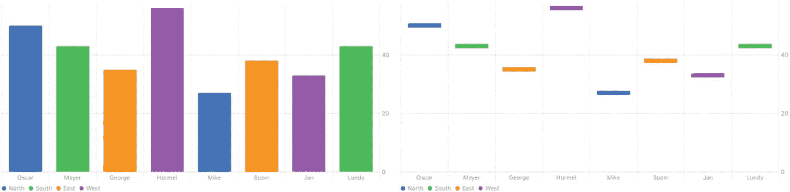

一组图表由两个图形组成，分别是条形图和矩形图，表示 8 个元素的数据。条形和矩形以 4 种不同颜色标示，分别代表东部、西部、北部和南部。

**图 16-12**  
矩形图与等效条形图的比较

要了解如何创建矩形图，请按照以下步骤操作：

1.  新建一个 SwiftUI iOS App 项目，并为其任意命名，例如“RectangleChart”。
2.  在导航器窗格中点击`ContentView`文件。
3.  在`SwiftUI`框架下方添加`Charts`框架，如下所示：
    ```swift
    import Charts
    ```
4.  在`import Charts`行下方添加一个结构体，如下所示：
    ```swift
    struct SalesPeople: Identifiable {
        var name: String
        var region: String
        var sales: Int
        var id = UUID()
    }
    ```
5.  在结构体下方添加一个数组，如下所示：
    ```swift
    var mySalesArray: [SalesPeople] = [
        .init(name: "Oscar", region: "North", sales: 50),
        .init(name: "Mayer", region: "South", sales: 43),
        .init(name: "George", region: "East", sales: 35),
        .init(name: "Hormel", region: "West", sales: 56),
        .init(name: "Mike", region: "North", sales: 27),
        .init(name: "Spam", region: "East", sales: 38),
        .init(name: "Jan", region: "West", sales: 33),
        .init(name: "Lundy", region: "South", sales: 43)
    ]
    ```
6.  在`VStack`内部添加一个`Chart`，如下所示：
    ```swift
    var body: some View {
        VStack {
            Chart (mySalesArray) { x in
            }
        }
    }
    ```
7.  在`Chart`内部添加一个`RectangleMark`，如下所示：
    ```swift
    VStack {
        Chart (mySalesArray) { x in
            RectangleMark(x: .value("Name", x.name),
                          y: .value("Sales", x.sales))
            .foregroundStyle(by: .value("Region", x.region))
        }
    }
    ```
    整个`ContentView`文件应如下所示：
    ```swift
    import SwiftUI
    import Charts

    struct SalesPeople: Identifiable {
        var name: String
        var region: String
        var sales: Int
        var id = UUID()
    }

    var mySalesArray: [SalesPeople] = [
        .init(name: "Oscar", region: "North", sales: 50),
        .init(name: "Mayer", region: "South", sales: 43),
        .init(name: "George", region: "East", sales: 35),
        .init(name: "Hormel", region: "West", sales: 56),
        .init(name: "Mike", region: "North", sales: 27),
        .init(name: "Spam", region: "East", sales: 38),
        .init(name: "Jan", region: "West", sales: 33),
        .init(name: "Lundy", region: "South", sales: 43)
    ]

    struct ContentView: View {
        var body: some View {
            VStack {
                Chart (mySalesArray) { x in
                    RectangleMark(x: .value("Name", x.name),
                                  y: .value("Sales", x.sales))
                    .foregroundStyle(by: .value("Region", x.region))
                }
            }
        }
    }

    struct ContentView_Previews: PreviewProvider {
        static var previews: some View {
            ContentView()
        }
    }
    ```
8.  点击画布面板中的“Live”图标。

```swift
import Charts
```

## 总结

许多应用依赖存储大量数据。但不幸的是，如果用户无法理解这些数据，那么所有数据都毫无意义。因此，您可能需要使用图表将数据可视化，以发现趋势、识别潜在问题或比较数据。通过使数据易于理解，图表可以提升数据的实用性。

折线图有助于识别趋势，例如销售额的下降或上升。面积图通过填充折线下方空白区域，能让此类趋势更易观察。

散点图常用于发现不符合正常数据集群的异常值。矩形图则便于突出显示数值。如同面积图是填充后的折线图，条形图也是填充后的矩形图。

在图表（如条形图）中堆叠数据，可以让你看到整体的各部分占比。添加规则线可以让你绘制线条，以突出显示图表中的特定值，例如平均销售额。

每种图表都基于用户偏好而各有优劣，因此请尝试不同的图表，直到找到适合您应用和用户的类型。

