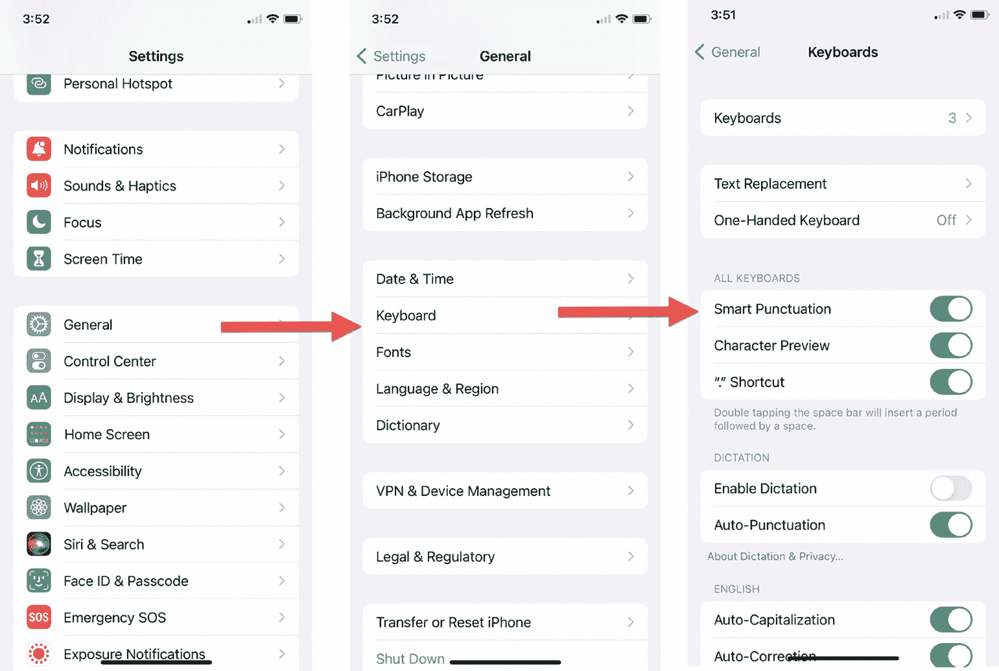
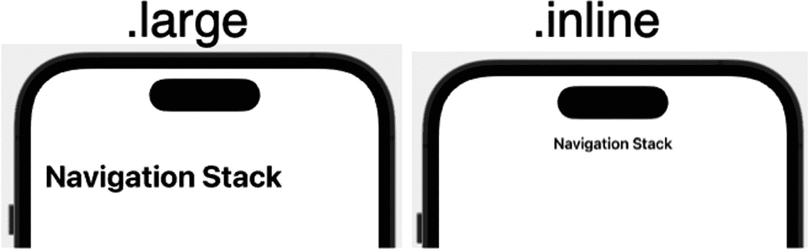
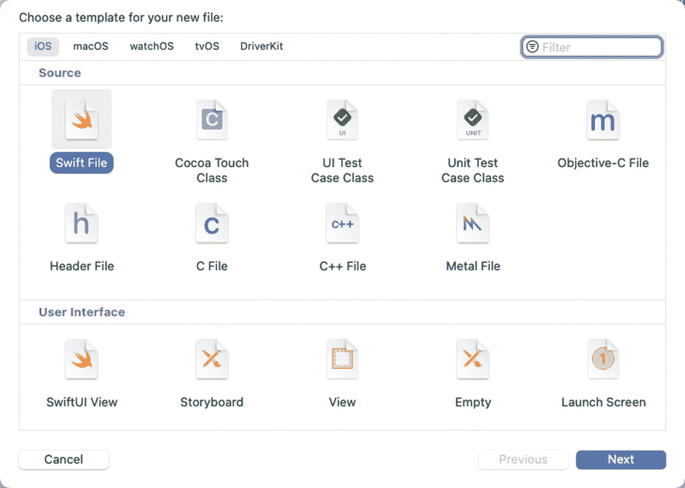
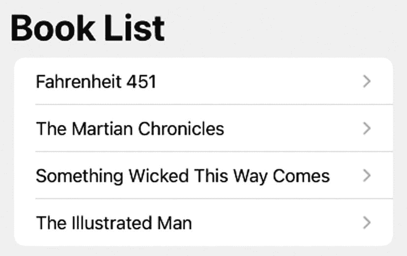
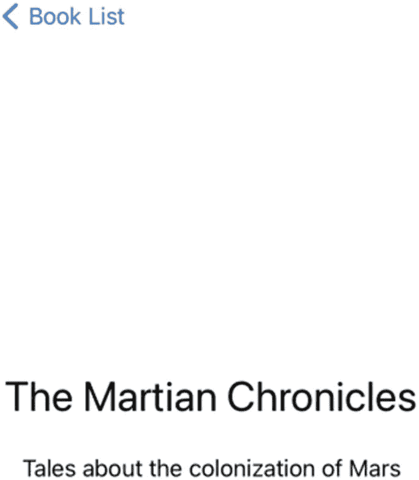

# 17. 使用导航堆栈

只有最简单的应用（如计算器应用）才由单个屏幕组成。然而，大多数应用通常需要两个或更多屏幕来显示信息。在 SwiftUI 中，你可以通过创建独立的结构体来定义应用用户界面的每个屏幕。然后，你需要提供一种从一个屏幕跳转到另一个屏幕的方法。

从一个屏幕跳转到另一个屏幕的最简单方法之一是通过`NavigationStack`，它按顺序显示多个屏幕。许多 iOS 应用（如“设置”）都常用此`NavigationStack`，让用户查看不同的选项，如图 17-1 所示。



一组 3 张手机截图。显示含“通用”选项的设置页面指向通用选项页面。通用选项页面列出多个选项，其中“键盘”选项被选中。键盘选项页面包含所有键盘选项。

**图 17-1**  
`NavigationStack`让从一个屏幕跳转到另一个屏幕变得简单

在图 17-1 中，用户可以点击主屏幕上的“设置”图标来显示设置屏幕。点击“通用”会打开通用屏幕。接着点击“键盘”会打开键盘屏幕。请注意，要返回，只需点击左上角的“返回”按钮即可。

从键盘屏幕，返回按钮会把你带回通用屏幕。从通用屏幕，返回按钮会把你带回设置屏幕。`NavigationStack`的作用仅仅是让用户能够按顺序从一个屏幕跳转到另一个屏幕。


## 使用导航堆栈

与任何其他类型的堆栈（`VStack`、`HStack`、`ZStack`）一样，一个`NavigationStack`最多可以容纳十（10）个视图。一个`NavigationStack`通过如下代码包含多个视图：

```
NavigationStack {
    // 在此处放置多个视图
}
```

在一个`NavigationStack`中，你需要一个或多个`NavigationLink`，每个`NavigationLink`定义一个可点击的视图和另一个要显示的视图。创建`NavigationLink`的一种方法是显示无额外格式的文本，然后定义要显示的视图，如下所示：

```
NavigationLink("链接文本") {
    // 要显示的视图
}
```

用户选择`NavigationLink`时显示的视图可以是单个视图（如`Text`视图），也可以是包含多个视图的堆栈。

创建`NavigationLink`的第二种方法允许你设置链接的外观并定义要显示的视图，如下所示：

```
NavigationLink {
    // 要显示的视图
} label: {
    // 定义导航链接的视图
}
```

要了解如何通过不同的方式创建`NavigationLink`来创建一个简单的导航堆栈，请按照以下步骤操作：

1. 创建一个新的 SwiftUI iOS 应用程序项目，并为其命名，例如"NavigationStack"。
2. 在导航器窗格中单击`ContentView`文件。
3. 在`var body: some View`下方添加一个`NavigationStack`，如下所示：

    ```
    var body: some View {
        NavigationStack {
        }
    }
    ```

4. 在`NavigationStack`内部添加四个`NavigationLink`，如下所示：

    ```
    var body: some View {
        NavigationStack {
            NavigationLink {
                Text("第一个视图")
            } label: {
                Text("第一个链接")
                    .font(.largeTitle)
            }.padding()
            NavigationLink {
                Text("第二个视图")
            } label: {
                Label {
                    Text("第二个链接")
                } icon: {
                    Image(systemName: "sun.and.horizon.circle")
                }
            }.padding()
            NavigationLink {
                Image(systemName: "ellipsis.message")
                    .font(.system(size: 125))
            } label: {
                VStack {
                    Text("第三个视图")
                    Image(systemName: "figure.archery")
                }.font(.largeTitle)
            }.padding()
            NavigationLink("第四个视图") {
                VStack {
                    Image(systemName: "airplane.departure")
                        .font(.system(size: 120))
                    Text("出发时间是 12:15")
                        .font(.largeTitle)
                }
            }.padding()
        }
    }
    ```

    请注意，每个`NavigationLink`定义了创建导航链接和用户选择该特定导航链接时显示的视图的不同方式。

    整个`ContentView`文件应如下所示：

    ```
    import SwiftUI
    struct ContentView: View {
        var body: some View {
            NavigationStack {
                NavigationLink {
                    Text("第一个视图")
                } label: {
                    Text("第一个链接")
                        .font(.largeTitle)
                }.padding()
                NavigationLink {
                    Text("第二个视图")
                } label: {
                    Label {
                        Text("第二个链接")
                    } icon: {
                        Image(systemName: "sun.and.horizon.circle")
                    }
                }.padding()
                NavigationLink {
                    Image(systemName: "ellipsis.message")
                        .font(.system(size: 125))
                } label: {
                    VStack {
                        Text("第三个视图")
                        Image(systemName: "figure.archery")
                    }.font(.largeTitle)
                }.padding()
                NavigationLink("第四个视图") {
                    VStack {
                        Image(systemName: "airplane.departure")
                            .font(.system(size: 120))
                        Text("出发时间是 12:15")
                            .font(.largeTitle)
                    }
                }.padding()
            }
        }
    }
    struct ContentView_Previews: PreviewProvider {
        static var previews: some View {
            ContentView()
        }
    }
    ```

5. 在画布窗格中单击**LIVE**图标。所有四个`NavigationLink`都会显示在用户界面上。
6. 单击任意显示的`NavigationLink`。该`NavigationLink`定义的视图就会显示出来。

### 为导航堆栈添加标题

一个`NavigationStack`只是在屏幕上显示一个或多个`NavigationLink`。但是，你可能希望通过在其上添加标题来确保用户理解这些`NavigationLink`的用途。标题可以以两种样式（`.large`或`.inline`）之一显示，如图 17-2 所示。



**图 17-2** 比较导航堆栈上方`.large`和`.inline`标题的外观

要在导航堆栈上方显示标题，请使用以下修饰符：

```
.navigationTitle("导航堆栈")
```

要更改标题的外观，请使用以下修饰符：

```
.navigationBarTitleDisplayMode(.inline)
```

> **注意：** 当将`.navigationTitle`和`.navigationBarTitleDisplayMode`修饰符添加到`NavigationStack`时，请将这些修饰符放在`NavigationStack`的最后一个花括号内，如下所示：
>
> ```
> NavigationStack {
>     .navigationTitle("导航堆栈标题")
>     .navigationBarTitleDisplayMode(.inline)
> }
> ```

`.navigationTitle`修饰符定义了将显示在屏幕顶部、导航堆栈上方的文本。`.navigationBarTitleDisplayMode`修饰符定义了该标题在屏幕上的显示方式。两个选项是`.large`和`.inline`（见图 17-2）。如果你没有定义`.navigationBarTitleDisplayMode`，则默认值为`.large`。

要了解如何为导航堆栈显示标题并更改其外观，请按照以下步骤操作：

1. 创建一个新的 SwiftUI iOS 应用程序项目，并为其命名，例如"NavigationStackTitle"。
2. 在导航器窗格中单击`ContentView`文件。
3. 在`struct ContentView: View`下方添加一个状态变量，如下所示：

    ```
    @State var titleType = NavigationBarItem.TitleDisplayMode.large
    ```

4. 在`var body: some View`内部添加一个`NavigationStack`，如下所示：

    ```
    var body: some View {
        NavigationStack {
        }
    }
    ```

5. 在`NavigationStack`内部添加一个`NavigationLink`，如下所示：

    ```
    var body: some View {
        NavigationStack {
            NavigationLink {
                Text("第一个视图")
            } label: {
                Text("第一个链接")
                    .font(.largeTitle)
            }.padding()
        }
    }
    ```

6. 添加`.navigationTitle`和`.navigationBarTitleDisplayMode`修饰符，如下所示：

    ```
    var body: some View {
        NavigationStack {
            NavigationLink {
                Text("第一个视图")
            } label: {
                Text("第一个链接")
                    .font(.largeTitle)
            }.padding()
            .navigationTitle("导航堆栈")
            .navigationBarTitleDisplayMode(titleType)
        }
    }
    ```

> **注意：** `.navigationTitle`修饰符不仅定义了导航堆栈上方的标题，还定义了返回按钮中显示的文本。如果`.navigationTitle`修饰符不存在，返回按钮将只显示"返回"。

7. 添加一个包含两个`Button`的`HStack`，如下所示：

    ```
    var body: some View {
        NavigationStack {
            NavigationLink {
                Text("第一个视图")
            } label: {
                Text("第一个链接")
                    .font(.largeTitle)
            }.padding()
            .navigationTitle("导航堆栈")
            .navigationBarTitleDisplayMode(titleType)
            HStack(spacing: 50) {
                Button(".large") {
                    titleType = NavigationBarItem.TitleDisplayMode.large
                }
                Button(".inline") {
                    titleType = NavigationBarItem.TitleDisplayMode.inline
                }
            }
        }
    }
    ```

8. 在画布窗格中单击**LIVE**图标。
9. 单击`.large`和`.inline`按钮，查看导航堆栈标题的外观如何变化。


## 向导航栈添加按钮

除了在导航栈上方显示标题外，你还可以在屏幕顶部显示一个或多个按钮。这些按钮会出现在一个工具栏上，你可以通过在导航栈内部使用 `.toolbar` 修饰符来添加这个工具栏，具体方法如下：

```
NavigationStack {
    .navigationTitle("导航标题")
    .toolbar {
    }
}
```

默认情况下，在 `.toolbar` 内部定义的任何按钮或图标的颜色都是蓝色。如果你想定义不同的颜色，可以像这样为 `NavigationStack` 添加 `.accentColor` 修饰符：

```
NavigationStack {
    .navigationTitle("导航标题")
    .toolbar {
    }
}.accentColor(.purple)
```

在 `.toolbar` 修饰符内部，你可以定义一个或多个 `ToolbarItem`。对于你添加的每一个 `ToolbarItem`，你都可以定义其放置位置（左上角设置为 `.navigationBarLeading`，或右上角设置为 `.navigationBarTrailing`）。此外，你必须定义按钮的外观以及用户点击该按钮时要运行的代码，如下所示：

```
.toolbar {
    ToolbarItem(placement: .navigationBarLeading) {
        Button {
            //  要运行的代码
        } label: {
            //  在此处定义按钮的外观
        }
    }
    ToolbarItem(placement: .navigationBarTrailing) {
        Button {
            //  要运行的代码
        } label: {
            //  在此处定义按钮的外观
        }
    }
}
```

要了解如何在导航栈中定义按钮，请按照以下步骤操作：


**图 17-3.** 使用 `.toolbar` 修饰符的工具栏按钮外观

1.  创建一个新的 SwiftUI iOS App 项目，并为其取任意你喜欢的名称，例如“NavigationStackButtons”。
2.  在导航窗格中点击 `ContentView` 文件。
3.  在 `struct ContentView: View` 一行下方添加两个状态变量，如下所示：

    ```
    @State var titleType = NavigationBarItem.TitleDisplayMode.large
    @State var message = ""
    ```

4.  在 `var body: some View` 内部添加一个 `NavigationStack`，如下所示：

    ```
    var body: some View {
        NavigationStack {
        }
    }
    ```

5.  为 `NavigationStack` 添加 `.accentColor` 修饰符，如下所示：

    ```
    var body: some View {
        NavigationStack {
        }.accentColor(.purple)
    }
    ```

6.  在 `NavigationStack` 内部添加一个 `NavigationLink`，如下所示：

    ```
    var body: some View {
        NavigationStack {
            NavigationLink {
                Text("第一个视图")
            } label: {
                Text("第一个链接")
                    .font(.largeTitle)
            }.padding()
            .navigationTitle("导航栈")
            .navigationBarTitleDisplayMode(titleType)
        }.accentColor(.purple)
    }
    ```

7.  添加 `.toolbar` 修饰符，如下所示：

    ```
    var body: some View {
        NavigationStack {
            NavigationLink {
                Text("第一个视图")
            } label: {
                Text("第一个链接")
                    .font(.largeTitle)
            }.padding()
            .navigationTitle("导航栈")
            .navigationBarTitleDisplayMode(titleType)
            .toolbar {
                ToolbarItem(placement: .navigationBarLeading) {
                    Button {
                        message = "iCloud 图标被点击"
                    } label: {
                        Image(systemName: "icloud")
                    }
                }
                ToolbarItem(placement: .navigationBarTrailing) {
                    Button {
                        message = "完成按钮被点击"
                    } label: {
                        Text("完成")
                    }
                }
            }
        }.accentColor(.purple)
    }
    ```

对于每个 `ToolbarItem`，你可以使用 `Text` 视图或 `Image` 视图来定义按钮的外观。上述代码在左上角显示一个云形图标，在右上角显示单词“Done”（完成），如图 17-3 所示。

8.  添加一个 `Text` 视图和一个包含两个 `Button` 的 `HStack`，如下所示：

    ```
    var body: some View {
        NavigationStack {
            NavigationLink {
                Text("第一个视图")
            } label: {
                Text("第一个链接")
                    .font(.largeTitle)
            }.padding()
            .navigationTitle("导航栈")
            .navigationBarTitleDisplayMode(titleType)
            .toolbar {
                ToolbarItem(placement: .navigationBarLeading) {
                    Button {
                        message = "iCloud 图标被点击"
                    } label: {
                        Image(systemName: "icloud")
                    }
                }
                ToolbarItem(placement: .navigationBarTrailing) {
                    Button {
                        message = "完成按钮被点击"
                    } label: {
                        Text("完成")
                    }
                }
            }
            Text(message)
            HStack (spacing: 50) {
                Button (".large") {
                    titleType = NavigationBarItem.TitleDisplayMode.large
                }
                Button (".inline") {
                    titleType = NavigationBarItem.TitleDisplayMode.inline
                }
            }
        }.accentColor(.purple)
    }
    ```

整个 `ContentView` 文件应如下所示：

```
import SwiftUI
struct ContentView: View {
    @State var titleType = NavigationBarItem.TitleDisplayMode.large
    @State var message = ""
    var body: some View {
        NavigationStack {
            NavigationLink {
                Text("第一个视图")
            } label: {
                Text("第一个链接")
                    .font(.largeTitle)
            }.padding()
            .navigationTitle("导航栈")
            .navigationBarTitleDisplayMode(titleType)
            .toolbar {
                ToolbarItem(placement: .navigationBarLeading) {
                    Button {
                        message = "iCloud 图标被点击"
                    } label: {
                        Image(systemName: "icloud")
                    }
                }
                ToolbarItem(placement: .navigationBarTrailing) {
                    Button {
                        message = "完成按钮被点击"
                    } label: {
                        Text("完成")
                    }
                }
            }
            Text(message)
            HStack (spacing: 50) {
                Button (".large") {
                    titleType = NavigationBarItem.TitleDisplayMode.large
                }
                Button (".inline") {
                    titleType = NavigationBarItem.TitleDisplayMode.inline
                }
            }
        }.accentColor(.purple)
    }
}
struct ContentView_Previews: PreviewProvider {
    static var previews: some View {
        ContentView()
    }
}
```

9.  点击画布窗格中的“Live”图标。
10. 点击由 `ToolbarItem` 定义的按钮。注意，每次点击工具栏按钮时，`Text` 视图中都会出现一条消息，例如“iCloud 图标被点击”或“完成按钮被点击”。


## 在导航堆栈中显示视图

在某些情况下，在`NavigationStack`中仅显示单个视图（例如`Text`或`Image`视图）可能没问题。然而，很多时候你希望显示一个完全不同的用户界面。由于你可以使用结构体定义用户界面屏幕，因此可以创建多个结构体来生成多个屏幕，这些屏幕都能在`NavigationStack`中显示。

创建新结构体的最简单方法是在`ContentView`文件内部。但这可能会使代码变得杂乱，因此第二种方法是将结构体存储在单独的文件中。

要了解如何创建定义另一个用户界面屏幕的结构体，请按照以下步骤操作：



该屏幕展示了用于创建新文件的模板选择，例如 macOS、watchOS、tvOS、DriverKit 等。它还包含 Swift 文件、C 文件、用户界面、UI 测试用例类和 SwiftUI 视图等选项，以及用于取消、查看、空文件、启动屏幕和上一步或下一步的导航按钮。

图 17-4
选择要创建的文件的对话框

1. 创建一个新的 SwiftUI iOS 应用程序项目，并为其任意命名，例如 `NavigationStackStructures`。
2. 在导航器窗格中点击 `ContentView` 文件。
3. 在 `var body: some View` 这行内部添加一个 `NavigationStack` 和一个 `VStack`，如下所示：

```
var body: some View {
    NavigationStack {
        VStack {
        }
    }
}
```

4. 向 `VStack` 添加两个 `NavigationLink` 和一个 `.navigationTitle` 修饰符，如下所示：

```
var body: some View {
    NavigationStack {
        VStack {
            NavigationLink(destination: FileView()) {
                Text("Link to structure in same file")
            }
            NavigationLink(destination: SeparateFileView()) {
                Text("Separate file link")
            }
            .navigationTitle("Navigation Title")
        }
    }
}
```

第一个 `NavigationLink` 将显示一个名为 `FileView` 的结构体。第二个 `NavigationLink` 将显示一个名为 `SeparateFileView` 的结构体。由于这两个结构体都还不存在，我们需要创建它们。

5. 在完整的 `struct ContentView: View` 结构体下方添加以下结构体，如下所示：

```
struct FileView: View {
    var body: some View {
        HStack {
            Spacer()
            VStack {
                Spacer()
                Text("This is a separate structure")
                Text("that's stored in the same file")
                Spacer()
            }
            Spacer()
        }.background(Color.yellow)
    }
}
```

整个 `ContentView` 文件应如下所示：

```
import SwiftUI

struct ContentView: View {
    var body: some View {
        NavigationStack {
            VStack {
                NavigationLink(destination: FileView()) {
                    Text("Link to structure in same file")
                }
                NavigationLink(destination: SeparateFileView()) {
                    Text("Separate file link")
                }
                .navigationTitle("Navigation Title")
            }
        }
    }
}

struct FileView: View {
    var body: some View {
        HStack {
            Spacer()
            VStack {
                Spacer()
                Text("This is a separate structure")
                Text("that's stored in the same file")
                Spacer()
            }
            Spacer()
        }.background(Color.yellow)
    }
}

struct ContentView_Previews: PreviewProvider {
    static var previews: some View {
        ContentView()
    }
}
```

我们可以在 `ContentView` 文件内继续添加新的结构体，但这有使文件变得杂乱的风险。创建结构体的第二种方法是将它们存储在单独的文件中，接下来的步骤将帮助我们实现这一点。在创建单独文件存储结构体时，我们可以使用完全空白的 Swift 文件或 SwiftUI View 文件。

我们将使用一个空白的 Swift 文件来查看创建 SwiftUI 视图所需的所有代码，但 SwiftUI View 文件也同样适用，并且会提供创建用户界面所需的基本代码。

6. 选择 `文件` ➤ `新建` ➤ `文件`。会弹出一个对话框，如图 17-4 所示。
   - 点击对话框顶部的“iOS”，然后点击 `Swift 文件`，再点击 `下一步`。Xcode 会要求你为新创建的文件命名。
   - 输入 `SeparateFile` 并点击 `创建`。Xcode 会创建一个新的 Swift 文件。
   - 删除 `SeparateFile` 中当前的所有代码，并将其替换为以下内容：

```
import SwiftUI

struct SeparateFileView: View {
    var body: some View {
        HStack {
            Spacer()
            VStack {
                Spacer()
                Text("This is another structure")
                Text("but stored in a separate file")
                Spacer()
            }
            Spacer()
        }.background(Color.orange)
    }
}

struct SeparateFileView_Previews: PreviewProvider {
    static var previews: some View {
        SeparateFileView()
    }
}
```

> **注意**：当将结构体存储在单独的文件中时，你需要第二个结构体（`PreviewProvider`）才能在画布窗格中显示该用户界面。

1. 在导航器窗格中点击 `ContentView` 文件。
2. 在画布窗格中点击“实时”图标。
3. 点击 `"Link to structure in same file"`。注意，这会显示存储在 `ContentView` 文件中的 `FileView` 结构体。
4. 点击“返回”按钮回到原始屏幕。
5. 点击 `"Separate file link"`。注意，这会显示存储在名为 `SeparateFile` 文件中的 `SeparateFileView` 结构体。

如果结构体很短，将其与 `NavigationStack` 存储在同一个文件中可能更为方便。然而，通常将结构体存储在单独文件中更有用，这样可以更好地组织它们，使每个文件更易于阅读。


### 在导航栈中结构体之间传递数据

上一个项目创建了两个结构体，其中一个结构体存储在 `ContentView` 文件中，另一个结构体存储在一个单独的文件中。在这两种情况下，结构体都定义了显示静态信息的用户界面，这些信息与原始结构体（`ContentView`）中的任何内容都无关。

在许多情况下，您可能希望一个结构体中的数据出现在另一个结构体中。这意味着我们必须将数据从一个结构体传递到另一个结构体。

幸运的是，这个任务类似于在函数之间传递数据。当一个结构体需要接收数据时，我们只需声明一个属性：创建一个变量，为该变量起一个描述性的名称，并定义该变量可以保存的数据类型，例如 `String` 或 `Double`，如下所示：

```
struct FileView: View {
    var choice: String
```

这定义了一个名为 `choice` 的变量，它可以保存一个 `String` 类型的值。要向此结构体传递数据，我们可以通过调用结构体名称（`FileView`）并后跟 `choice` 变量作为参数的方式来加载该结构体，如下所示：

```
FileView(choice: "Heads")
```

当向存储在同一个文件中的结构体传递数据时，我们只需要遵循以下两步流程：

- 在结构体内部声明一个或多个变量以接收数据。
- 使用这些变量作为参数来调用该结构体。

然而，当向存储在单独文件中的结构体传递数据时，还需要一个额外的步骤。因为存储在单独文件中的结构体还包含另一个用于在画布窗格中显示用户界面的结构体，所以这个预览结构体必须包含该结构体的参数，并向其传递数据，如下所示：

```
struct SeparateFileView_Previews: PreviewProvider {
    static var previews: some View {
        SeparateFileView(passedData: "")
    }
}
```

要了解如何在结构体之间传递数据，请按照以下步骤操作：

1. 创建一个新的 SwiftUI iOS App 项目，并为其指定任意名称，例如 `NavigationStackPassData`。
2. 点击导航器窗格中的 `ContentView` 文件。
3. 像这样编辑 `struct ContentView` 结构体：

```swift
struct ContentView: View {
    var body: some View {
        NavigationStack {
            VStack (spacing: 26) {
                Text("Choose Heads or Tails")
                NavigationLink(destination: FileView(choice: "Heads")) {
                    Text("Heads")
                }
                NavigationLink(destination: SeparateFileView(passedData: "Tails")) {
                    Text("Tails")
                }
                .navigationTitle("Flip a Coin")
            }
        }
    }
}
```

上述代码定义了两个 `NavigationLink`，其中一个链接调用了一个名为 `FileView` 的结构体，参数为 `choice:`，并传入了 `"Heads"`。第二个 `NavigationLink` 调用了一个名为 `SeparateFileView` 的结构体，参数为 `passedData:`，并传入了 `"Tails"`。

4. 在 `struct ContentView` 下方添加一个新的结构体，如下所示：

```swift
struct FileView: View {
    var choice: String
    var body: some View {
        HStack {
            Spacer()
            VStack {
                Spacer()
                Text("You chose = \(choice)")
                Spacer()
            }
            Spacer()
        }.background(Color.yellow)
    }
}
```

这个 `FileView` 结构体声明了一个可以保存 `String` 类型的 `choice` 变量。然后，它在一个显示 `"You chose = "` 的 `Text` 视图中展示了这个 `choice` 变量。整个 `ContentView` 文件应该如下所示：

```swift
import SwiftUI
struct ContentView: View {
    var body: some View {
        NavigationStack {
            VStack (spacing: 26) {
                Text("Choose Heads or Tails")
                NavigationLink(destination: FileView(choice: "Heads")) {
                    Text("Heads")
                }
                NavigationLink(destination: SeparateFileView(passedData: "Tails")) {
                    Text("Tails")
                }
                .navigationTitle("Flip a Coin")
            }
        }
    }
}
struct FileView: View {
    var choice: String
    var body: some View {
        HStack {
            Spacer()
            VStack {
                Spacer()
                Text("You chose = \(choice)")
                Spacer()
            }
            Spacer()
        }.background(Color.yellow)
    }
}
struct ContentView_Previews: PreviewProvider {
    static var previews: some View {
        ContentView()
    }
}
```

这段代码创建了一个名为 `FileView` 的结构体，但现在我们需要创建第二个名为 `SeparateFileView` 的结构体，它声明一个 `String` 类型的 `passedData` 变量。

5. 选择“文件” ➤ “新建” ➤ “文件”。出现一个对话框（见图 17-4）。
6. 点击对话框顶部的“iOS”，点击“Swift 文件”，然后点击“下一步”。Xcode 会要求为您新创建的文件命名。
7. 输入 `SeparateFile` 并点击“创建”。Xcode 会创建一个新的 Swift 文件。
8. 删除 `SeparateFile` 中当前的所有代码，并将其替换为以下内容：

```swift
import SwiftUI
struct SeparateFileView: View {
    var passedData: String
    var body: some View {
        HStack {
            Spacer()
            VStack {
                Spacer()
                Text("You chose = \(passedData)")
                Spacer()
            }
            Spacer()
        }.background(Color.orange)
    }
}
struct SeparateFileView_Previews: PreviewProvider {
    static var previews: some View {
        SeparateFileView(passedData: "")
    }
}
```

这个文件创建了一个 `SeparateFileView` 结构体，它声明了一个 `String` 类型的 `passedData` 变量。由于这个 `SeparateFileView` 结构体存储在一个单独的文件中，它包含一个 `struct PreviewProvider`，我们在此也必须使用 `passedData` 参数。

9. 点击导航器窗格中的 `ContentView`，返回到 `ContentView` 结构体。
10. 点击画布窗格中的“实时”图标。
11. 点击“Heads”导航链接。将出现 `FileView` 结构体，显示“You chose = Heads”。
12. 点击左上角的“返回”按钮。
13. 点击“Tails”导航链接。将出现 `SeparateFileView` 结构体，显示“You chose = Tails”。


### 在导航栈中更改结构体之间的数据

之前的项目创建了两个结构体，一个存储在 `ContentView` 文件中，另一个存储在单独的文件中。在这两种情况下，这些结构体都定义了用于接收和显示数据的用户界面。

如果我们将数据传递给一个结构体，然后允许该结构体修改这些数据，情况会怎样？这需要进行几项更改：

-   创建一个 `@State` 变量。
-   使用 `NavigationLink` 打开另一个结构体，并向该结构体传递一个指向 `@State` 变量的绑定（使用 `$` 符号），例如：
-   在接收数据的结构体中定义一个 `@Binding` 变量。
-   在接收数据的结构体中更改该 `@Binding` 变量。

```
FileView(choice: $message)
```

要了解如何在导航栈中的结构体之间更改数据，请按照以下步骤操作：

1.  创建一个新的 SwiftUI iOS App 项目，并为其任意命名，例如 `"NavigationStackBindingData"`。

2.  在导航器窗格中点击 `ContentView` 文件。

3.  在 `struct ContentView: View` 一行下方创建一个 `@State` 变量，如下所示：

```
    struct ContentView: View {
    @State var message = ""
    ```

4.  在 `var body: some View` 一行内部添加一个 `NavigationStack` 和一个 `VStack`，如下所示：

```
    var body: some View {
    NavigationStack {
    VStack {
    }
    }
    ```

5.  在 `VStack` 内部添加一个 `Text` 视图和两个 `NavigationLink`，如下所示：

```
    NavigationStack {
    VStack (spacing: 26) {
    TextField("Type here", text: $message)
    NavigationLink(destination: FileView(choice: $message)) {
    Text("Send a message")
    }
    NavigationLink(destination: SeparateFileView(passedData: $message)) {
    Text("Separate file")
    }
    .navigationTitle("Passing Data")
    }
    }
    ```

注意，第一个 `NavigationLink` 打开一个名为 `FileView` 的结构体，并将一个绑定变量（`$message`）发送给 `choice:` 参数。第二个 `NavigationLink` 打开一个名为 `SeparateFileView` 的结构体，并将同一个绑定变量（`$message`）发送给 `passedData` 参数。

6.  在 `struct ContentView: View` 结构体下方添加以下结构体：

```
    struct FileView: View {
    @Binding var choice: String
    var body: some View {
    HStack {
    Spacer()
    VStack {
    Spacer()
    TextField("Type here:", text: $choice)
    Spacer()
    }
    Spacer()
    }.background(Color.yellow)
    }
    }
    ```

注意，该结构体声明了一个名为 `choice` 的 `@Binding` 变量，它可以存储一个 `String`。此结构体使用 `TextField` 来更改该 `@Binding` 变量（`$choice`），这会自动将更改发送回 `ContentView` 结构体。

7.  选择 `File` ➤ `New` ➤ `File`。一个对话框会出现（见图 17-4）。

8.  点击对话框顶部附近的 `iOS`，点击 `Swift File`，然后点击 `Next`。Xcode 会询问您为新创建的文件命名。

9.  输入 `SeparateFile` 并点击 `Create`。Xcode 会创建一个新的 Swift 文件。

10. 删除 `SeparateFile` 中当前的所有代码，并将其替换为以下内容：

```
    import SwiftUI
    struct SeparateFileView: View {
    @Binding var passedData: String
    var body: some View {
    HStack {
    Spacer()
    VStack {
    Spacer()
    TextField("Type here", text: $passedData)
    Spacer()
    }
    Spacer()
    }.background(Color.orange)
    }
    }
    struct SeparateFileView_Previews: PreviewProvider {
    static var previews: some View {
    SeparateFileView(passedData: .constant(""))
    }
    }
    ```

注意，该结构体声明了一个名为 `passedData` 的 `@Binding` 变量，它可以存储一个 `String`。`TextField` 可以更改此变量（`$passedData`）并自动将更改发送回 `ContentView` 结构体。

另外请注意，由于此结构体存储在单独的文件中，因此 `PreviewProvider` 结构体也必须通过提供 `.constant("")` 来包含 `passedData` 参数。

11. 在导航器窗格中点击 `ContentView` 文件。

12. 在画布窗格中点击 `Live` 图标。

13. 点击 `TextField` 并输入一个短语。

14. 点击 `"Send a message"` 导航链接，该链接会将字符串传递给存储在 `ContentView` 文件中的 `FileView` 结构体。

15. 点击 `FileView` 结构体显示的 `TextField` 并编辑数据。然后点击 `Back` 按钮返回到 `ContentView` 结构体，该结构体会显示修改后的数据。

16. 点击 `"Separate file"` 导航链接，该链接会将字符串传递给存储在单独文件中的 `SeparateFileView` 结构体。

17. 点击 `SeparateFileView` 结构体显示的 `TextField` 并编辑数据。然后点击 `Back` 按钮返回到 `ContentView` 结构体，该结构体会显示修改后的数据。


### 在导航堆栈中的结构体之间共享数据

使用 `@State` 和 `@Binding` 变量可以让多个视图共享和修改数据。但是，假设你创建了一个按顺序链接四个结构体的导航堆栈。如果你在第一个结构体中更改了数据，并想将其传递给第四个结构体，则还必须通过第二个和第三个结构体来传递该数据。

虽然这种方法可行，但很笨拙。更好的办法是直接将数据传递给需要数据的结构体。为此，SwiftUI 提供了另一种在结构体间共享数据的方式。首先，创建一个 `ObservableObject` 类，其中包含一个或多个要共享的变量。每个变量都必须标记为 `@Published`，如下所示：

```
class ShareString: ObservableObject {
@Published var message = ""
}
```

包含 `NavigationStack` 的结构体（例如 `ContentView`）需要定义一个 `@StateObject` 变量，该变量用于定义来自 `ObservableObject` 类的对象，如下所示：

```
@StateObject var showMe = ShareString()
```

由于我们希望在导航堆栈内的所有视图之间共享这个 `ObservableObject`，因此需要将 `.environmentObject` 修饰符与要共享的 `StateObject` 一起添加到 `NavigationStack` 上，如下所示：

```
NavigationStack {
}.environmentObject(showMe)
```

`NavigationLink` 不再需要将数据传递给每个视图，它只需要指定要显示的视图名称即可，例如：

```
NavigationLink(destination: FileView()) {
Text("发送消息")
}
```

在需要访问 `ObservableObject` 的每个结构体中，我们需要声明一个使用 `ObservableObject` 类的 `@EnvironmentObject` 变量，如下所示：

```
@EnvironmentObject var choice: ShareString
```

最后，在每个定义了 `@EnvironmentObject` 的结构体中，我们可以通过使用 `@EnvironmentObject` 名称加上 `@Published` 属性名称来访问要共享的实际数据，如下所示：

```
$choice.message
```

在这个例子中，`"choice"` 是 `@EnvironmentObject` 的名称，而 `"message"` 是在 `ObservableObject` 中定义的 `@Published` 属性。要了解如何使用 `ObservableObject` 共享数据，请遵循以下步骤：

1.  创建一个新的 SwiftUI iOS App 项目，并为其取任意名称，例如 `"NavigationStackObservable"`。

2.  在导航器面板中点击 `ContentView` 文件。

3.  在 `import SwiftUI` 行下方创建一个 `ObservableObject` 类，如下所示：

```
    class ShareString: ObservableObject {
    @Published var message = ""
    }
    ```

    `@Published` 变量将包含要在导航堆栈内的结构体之间共享的数据。

4.  在 `struct ContentView: View` 行下方创建一个 `StateObject` 变量，如下所示：

```
    struct ContentView: View {
    @StateObject var showMe = ShareString()
    ```

    这会基于 `ShareString` `ObservableObject` 创建一个新对象（`showMe`）。

5.  在 `var body: some View` 行内部添加一个 `NavigationStack` 和一个 `VStack`，如下所示：

```
    var body: some View {
    NavigationStack {
    VStack (spacing: 26) {
    }
    }
    ```

6.  在 `VStack` 内部添加一个 `Text` 视图、两个 `NavigationLink` 以及一个 `.navigationTitle` 修饰符，如下所示：

```
    NavigationStack {
    VStack (spacing: 26) {
    TextField("在此输入", text: $showMe.message)
    NavigationLink(destination: FileView()) {
    Text("发送消息")
    }
    NavigationLink(destination: SeparateFileView()) {
    Text("单独文件")
    }
    .navigationTitle("共享数据")
    }
    }.environmentObject(showMe)
    ```

    请确保在 `NavigationStack` 末尾添加 `.environmentObject(showMe)` 修饰符。这样允许共享 `showMe` 这个 `ObservableObject` `ShareString` 类。前面的 `NavigationLink` 将打开我们需要创建的结构体，名为 `FileView` 和 `SeparateFileView`。

7.  在 `struct ContentView` 结构体下方添加以下结构体，如下所示：

```
    struct FileView: View {
    @EnvironmentObject var choice: ShareString
    var body: some View {
    HStack {
    Spacer()
    VStack {
    Spacer()
    TextField("在此输入:", text: $choice.message)
    Spacer()
    }
    Spacer()
    }.background(Color.yellow)
    }
    }
    ```

    注意，这个结构体定义了一个 `@EnvironmentObject` 变量，它可以持有一个 `ShareString` `ObservableObject`。在 `TextField` 中，我们必须将文本存储在 `"choice"` 这个 `@EnvironmentObject` 中，该对象使用了 `"message"` 这个 `@Published` 属性（`$choice.message`）。完整的 `ContentView` 文件应该如下所示：

```
    import SwiftUI
    class ShareString: ObservableObject {
    @Published var message = ""
    }
    struct ContentView: View {
    @StateObject var showMe = ShareString()
    var body: some View {
    NavigationStack {
    VStack (spacing: 26) {
    TextField("在此输入", text: $showMe.message)
    NavigationLink(destination: FileView()) {
    Text("发送消息")
    }
    NavigationLink(destination: SeparateFileView()) {
    Text("单独文件")
    }
    .navigationTitle("共享数据")
    }
    }.environmentObject(showMe)
    }
    }
    struct FileView: View {
    @EnvironmentObject var choice: ShareString
    var body: some View {
    HStack {
    Spacer()
    VStack {
    Spacer()
    TextField("在此输入:", text: $choice.message)
    Spacer()
    }
    Spacer()
    }.background(Color.yellow)
    }
    }
    struct ContentView_Previews: PreviewProvider {
    static var previews: some View {
    ContentView()
    }
    }
    ```

8.  选择 文件 ➤ 新建 ➤ 文件。会弹出一个对话框（见图 17-4）。

9.  在对话框顶部附近点击 **iOS**，点击 **Swift 文件**，然后点击 **下一步**。Xcode 会要求你为新创建的文件命名。

10.  输入 `SeparateFile` 并点击 **创建**。Xcode 会创建一个新的 Swift 文件。

11.  删除 `SeparateFile` 中当前的所有代码，并将其替换为以下内容：

```
    import SwiftUI
    struct SeparateFileView: View {
    @EnvironmentObject var passedData: ShareString
    var body: some View {
    HStack {
    Spacer()
    VStack {
    Spacer()
    TextField("在此输入", text: $passedData.message)
    Spacer()
    }
    Spacer()
    }.background(Color.orange)
    }
    }
    struct SeparateFileView_Previews: PreviewProvider {
    static var previews: some View {
    SeparateFileView()
    }
    }
    ```

    注意，这个结构体也声明了一个 `@EnvironmentObject`，它可以持有一个 `ShareString` `ObservableObject`。然后，`TextField` 使用 `"passedData"` 这个 `@EnvironmentObject` 来访问 `"message"` 这个 `@Published` 属性（`$passedData.message`）。

12.  在导航器面板中点击 `ContentView` 文件。

13.  在画布面板中点击 **Live** 图标。

14.  在 `TextField` 中点击并输入一个短语。

15.  点击 `"发送消息"` 导航链接以打开 `FileView` 结构体。注意，你在步骤 14 中输入的文本现在显示在 `FileView` 的 `TextField` 中。

16.  编辑 `TextField` 中的文本，然后点击 **返回** 按钮。注意，修改后的文本现在显示在 `ContentView` 的 `TextField` 中。

17.  编辑 `TextField` 中的文本，然后点击 `"单独文件"` 导航链接。编辑后的文本现在显示在 `SeparateFileView` 的 `TextField` 中。

18.  编辑 `TextField` 中的文本，然后点击 **返回** 按钮。注意，修改后的文本现在显示在 `ContentView` 的 `TextField` 中。所有这些展示了不同的结构体如何访问 `ObservableObject` 中的 `@Published` 属性。


## 在导航栈中使用列表

与其单独显示`NavigationLink`，一种常见技巧是创建一个`List`（参见第 13 章），其中`List`的每一项都充当链接。通过在`List`中选择一项，导航栈即可打开一个新视图。导航栈中嵌套列表的这种组合方式在 iOS 的“设置”应用中极为常见。

在前面的项目中创建导航链接时，我们按照如下方式定义了链接上显示的文本以及要显示的目标视图：

```
NavigationLink {
    Text("目标视图")
} label: {
    Text("链接上显示的文本")
}
```

然而，在处理列表时，将目标视图与导航链接分离开来会更方便。这样一来，导航链接只需定义其外观即可。为了定义目标视图，我们可以使用一个`navigationDestination`修饰符，该修饰符用于定义当用户选择导航链接时显示的内容。

要了解如何在`NavigationStack`中使用`List`，请按照以下步骤操作：



一段文字显示了一个书籍列表，其标题包括《华氏 451 度》、《火星纪事》、《邪恶降临》和《纹身人》。最后一项似乎由一个非英文字符表示。

图 17-5 — 导航链接列表

1.  创建一个新的 SwiftUI iOS App 项目，并为其任意命名，例如“NavigationStackList”。

2.  在导航器窗格中点击`ContentView`文件。

3.  在`import SwiftUI`这一行下方添加如下结构体：

```
struct Books: Identifiable, Hashable {
    var id = UUID()
    var title: String
    var summary: String
}
```

请注意，该结构体需要遵循`Identifiable`协议以创建唯一 ID，并且必须遵循`Hashable`协议，以便能用在与`.navigationDestination`修饰符配合使用的位置，该修饰符将定义用户选择导航链接后打开的视图。

4.  在`struct ContentView: View`这一行下方添加一个结构体数组，如下所示：

```
let books: [Books] = [
    Books(title: "华氏 451 度", summary: "关于焚书的反乌托邦小说"),
    Books(title: "火星纪事", summary: "关于火星殖民的故事"),
    Books(title: "邪恶降临", summary: "一个邪恶的马戏团来到小镇"),
    Books(title: "纹身人", summary: "围绕一个纹身男子展开的短篇故事集")
]
```

5.  在`struct ContentView_Previews: PreviewProvider`这一行上方添加如下结构体：

```
struct BookView: View {
    var bookInfo: Books
    var body: some View {
        VStack (spacing: 24) {
            Text("\(bookInfo.title)")
                .font(.largeTitle)
            Text("\(bookInfo.summary)")
                .font(.body)
        }
    }
}
```

此结构体定义了用户在点击导航链接后显示的视图（用户界面）。它需要从之前定义的`Books`结构体中检索数据。然后，它获取`title`和`summary`，并在`VStack`内的两个`Text`视图中显示。

6.  在`var body: some View`内部添加一个`NavigationStack`、`List`和`NavigationLink`，如下所示：

```
var body: some View {
    NavigationStack {
        List(books) { book in
            NavigationLink("\(book.title)", value: book)
        }.navigationTitle(Text("书籍列表"))
        .navigationDestination(for: Books.self) { x in
            BookView(bookInfo: x)
        }
    }
}
```

`List`获取`books`数组。然后，它创建了一个任意命名的变量“book”，用于将`book.title`显示为导航链接。请注意，导航链接还定义了一个值（`book`），该值对于显示的每个导航链接都是唯一的。

整个`ContentView`文件应如下所示：

```
import SwiftUI
struct Books: Identifiable, Hashable {
    var id = UUID()
    var title: String
    var summary: String
}
struct ContentView: View {
    let books: [Books] = [
        Books(title: "华氏 451 度", summary: "关于焚书的反乌托邦小说"),
        Books(title: "火星纪事", summary: "关于火星殖民的故事"),
        Books(title: "邪恶降临", summary: "一个邪恶的马戏团来到小镇"),
        Books(title: "纹身人", summary: "围绕一个纹身男子展开的短篇故事集")
    ]
    var body: some View {
        NavigationStack {
            List(books) { book in
                NavigationLink("\(book.title)", value: book)
            }.navigationTitle(Text("书籍列表"))
            .navigationDestination(for: Books.self) { x in
                BookView(bookInfo: x)
            }
        }
    }
}
struct BookView: View {
    var bookInfo: Books
    var body: some View {
        VStack (spacing: 24) {
            Text("\(bookInfo.title)")
                .font(.largeTitle)
            Text("\(bookInfo.summary)")
                .font(.body)
        }
    }
}
struct ContentView_Previews: PreviewProvider {
    static var previews: some View {
        ContentView()
    }
}
```

7.  点击画布窗格中的“Live”图标。注意，`List`将书籍标题显示为导航链接，如图 17-5 所示。



一个屏幕显示了一个书籍列表，其中包括《火星纪事》，其内容是关于火星殖民的故事。

图 17-6 — 选择导航链接后出现的用户界面

1.  点击任意书籍标题（导航链接）。由结构体`BookView`定义的用户界面将出现，并在左上角显示一个“返回”按钮，如图 17-6 所示。

列表可以成为在导航栈内创建导航链接的一种便捷方式。由于列表通常依赖数组来提供数据，因此你可能需要创建一个结构体来存储在数组中。

## 总结

导航栈是显示多个视图的便捷工具。一个结构体定义一个导航栈，其中包含一个或多个`NavigationLink`。这些`NavigationLink`打开的视图可以像`Text`或`Image`视图那样简单，但更常见的是由结构体定义的视图。这些结构体可以存储在同一个文件中，也可以存储在单独的文件中。

`NavigationLink`可以将数据传递给另一个视图，很像将数据传递给函数。另一个视图需要定义一个属性，然后`NavigationLink`就可以将数据传递给该属性。如果要将数据传递给另一个可以修改数据的视图，可以使用两种不同的方法。

第一种方法使用`@State`和`@Binding`变量，强制`NavigationLink`将数据传递给它打开的每个视图。第二种方法使用`ObservableObject`、`StateObject`和`EnvironmentObject`在多个视图之间共享数据。

导航栈通常与列表一起使用。通过点击`List`中的某个项目，用户可以跳转到新视图。列表通常检索存储在数组中的数据。该数组可以存储像字符串这样的单个数据类型，但更常见的是数组存储结构体以将相关数据分组到一起。`List`中的项目可以自然地创建指向另一个视图的导航链接，例如 iOS 的“设置”应用中的项目。

当使用`List`创建导航栈时，使用导航链接来定义链接，然后使用`.navigationDestination`修饰符来定义要显示的目标视图，通常会更简单。导航栈使得连续显示数据屏幕变得容易。


