# 18. 使用标签视图

多数应用都包含多个屏幕。第 17 章解释了如何创建使用导航堆栈的应用，让用户可以按顺序从一个屏幕跳转到另一个屏幕。这对于显示更多详细信息非常方便，例如 iOS 中的“设置”应用，它允许你选择各种选项，然后查看多个屏幕来选取不同的设置。

然而，导航堆栈的一个问题是，如果你将太多屏幕链接在一起，导航会变得笨重，因为你必须从第一个屏幕导航到第二个，再到第三个，才能到达第四个屏幕。然后你必须反转整个过程，从第四个屏幕返回到第一个屏幕。

为了提供另一种从一个屏幕跳转到另一个屏幕的方式，你可以使用标签视图，它会在屏幕底部显示图标和/或文本。选择一个标签（图标和/或文本）即可跳转到一个新屏幕。例如，“时钟”应用在屏幕底部显示图标/文本，让你跳转到不同的功能，如图 18-1 所示。

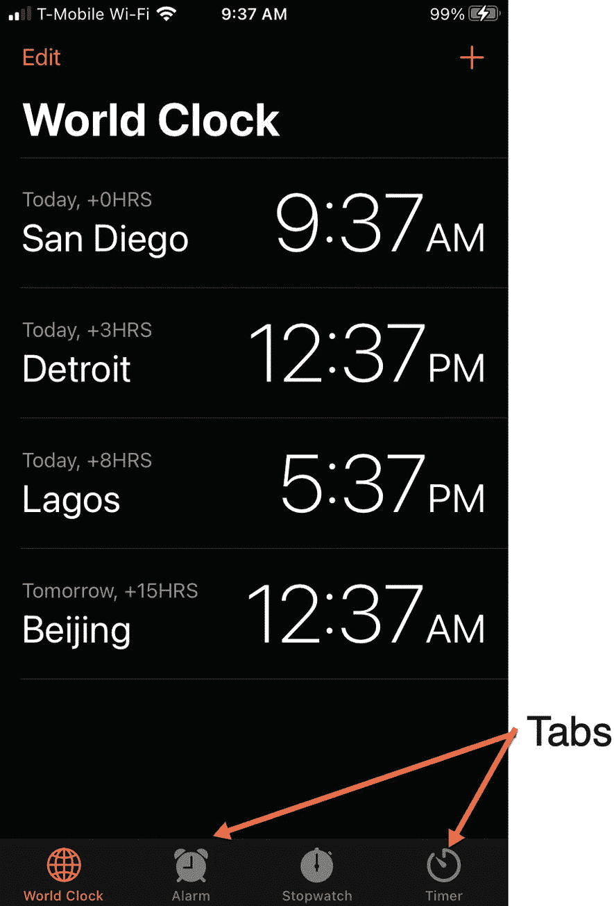

一张手机屏幕显示了一个世界时钟，展示了不同国家/地区的不同时间，包括圣地亚哥、底特律、拉各斯和北京。它包含了用于闹钟和计时器图标的标签。

图 18-1

标签视图让你可以轻松从一个屏幕跳转到另一个屏幕

由于无论你正在查看哪个屏幕，标签栏都显示在屏幕底部，因此标签视图让你可以随时轻松跳转到想要查看的屏幕。

## 使用标签视图

一个标签视图通过如下代码包含多个视图：

```
TabView {
// 在此放置多个视图
}
```

存储在标签视图中的每个视图，可以简单到单个视图（如 `Text` 或 `Image` 视图），也可以更详细，例如定义一个视图的结构体。创建标签视图的第一步就是简单地列出你想要在标签视图内使用的所有视图，如下所示：

```
TabView {
Text("一")
Text("二")
Text("三")
Text("四")
}
```

在定义了要在标签视图内显示的视图之后，下一步是为每个视图定义一个图标和/或文本来表示它。为此，需要为每个视图添加一个 `.tabItem` 修饰符，并使用 `Image` 和 `Text` 视图，如下所示：

```
Text("一")
.tabItem {
Image(systemName: "heart.fill")
Text("标签 1")
}
```

通过为每个视图附加一个 `.tabItem` 修饰符，并使用 `Image` 和 `Text` 视图来定义其内容，你可以创建一个显示在屏幕底部的标签栏，如图 18-2 所示。

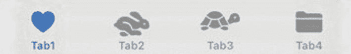

一段显示四个图标（标签 1、标签 2、标签 3、标签 4）的片段。标签 1 是心形符号，标签 2 是兔子，标签 3 是乌龟，标签 4 是文件夹。

图 18-2

一个典型的标签栏显示图标和文本

`Image` 视图可以显示任何图像，但通常显示你可以在 SF Symbols 应用（[`https://developer.apple.com/sf-symbols`](https://developer.apple.com/sf-symbols)）中看到的图标。

> **注意**  
> 标签可以显示为图像和文本、仅图像或仅文本。为了清晰起见，通常最好将标签同时定义为图像和文本。

要了解如何创建一个简单的标签视图，请遵循以下步骤：

1. 创建一个新的 SwiftUI iOS 应用项目，并为其起一个你喜欢的名称，例如 `"TabViewSimple"`。
2. 在导航器窗格中点击 `ContentView` 文件。
3. 在 `var body: some View` 内部添加以下视图，如下所示：

```
    var body: some View {
    TabView {
    Text("一")
    Text("二")
    Text("三")
    Text("四")
    }
    }
```

为了在屏幕底部创建一个标签栏，我们需要添加使用 `Image` 和 `Text` 视图的 `.tabItem` 修饰符。

4. 为每个视图添加如下的 `.tabItem` 修饰符：

```
    var body: some View {
    TabView {
    Text("一")
    .tabItem {
    Image(systemName: "heart.fill")
    Text("一")
    }
    Text("二")
    .tabItem {
    Image(systemName: "hare.fill")
    Text("二")
    }
    Text("三")
    .tabItem {
    Image(systemName: "tortoise.fill")
    Text("三")
    }
    Text("四")
    .tabItem {
    Image(systemName: "folder.fill")
    Text("四")
    }
    }
    }
```

你可以随意使用不同的 SF Symbols 图标和文本来定制屏幕底部标签栏中的按钮。除了使用 `Image` 和 `Text` 视图的组合，你也可以使用单个 `Label` 视图，如下所示：

1. 在画布窗格中点击“实时”图标。
2. 点击屏幕底部的不同标签，查看不同的视图。

```
Label("四", systemImage: "folder.fill")
```

> **注意**  
> 由于标签视图将每个视图表示为图标/文本，因此标签视图在屏幕底部最多只能显示五 (5) 个项目。如果你在标签视图中存储了超过五个视图，标签视图会自动创建一个“更多”图标，将任何额外的视图隐藏到第二个标签栏中。

要了解如果你在标签视图中显示超过五个视图，标签视图如何自动在标签栏中创建一个“更多”按钮，请遵循以下步骤：

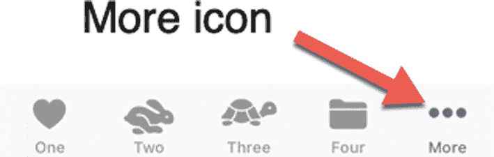

一段显示四个图标（一、二、三、四）的片段。右侧的“更多”图标被高亮显示。1 是心形符号，2 是兔子，3 是乌龟，4 是文件夹。“更多”是三个点。

图 18-3

当标签视图包含超过五个标签时，“更多”图标会自动出现

1. 打开你先前创建的 Xcode 项目（`"TabViewSimple"`）。
2. 编辑 `ContentView` 文件，使整个代码如下所示：

```
    import SwiftUI
    struct ContentView: View {
    var body: some View {
    TabView {
    Text("一")
    .tabItem {
    Image(systemName: "heart.fill")
    Text("一")
    }
    Text("二")
    .tabItem {
    Image(systemName: "hare.fill")
    Text("二")
    }
    Text("三")
    .tabItem {
    Image(systemName: "tortoise.fill")
    Text("三")
    }
    Text("四")
    .tabItem {
    Image(systemName: "folder.fill")
    Text("四")
    }
    Text("五")
    .tabItem {
    Image(systemName: "internaldrive.fill")
    Text("五")
    }
    Text("六")
    .tabItem {
    Image(systemName: "cloud.drizzle.fill")
    Text("六")
    }
    }.accentColor(.purple)
    }
    }
    struct ContentView_Previews: PreviewProvider {
    static var previews: some View {
    ContentView()
    }
    }
```

注意，标签视图上的 `.accentColor` 修饰符允许你为标签栏定义一种颜色。

3. 在画布窗格中点击“实时”图标。标签栏出现，但现在最右侧会出现一个“更多”图标，如图 18-3 所示。

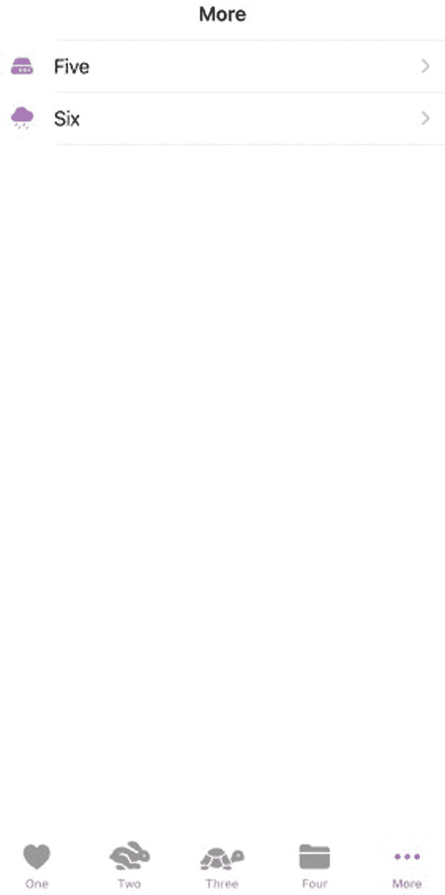

一张手机屏幕显示了带有五个和六个标签的更多标签。底部有四个图标：一、二、三、四。右侧的“更多”图标被高亮显示。1 是心形符号，2 是兔子，3 是乌龟，4 是文件夹。“更多”是三个点。

图 18-4

“更多”图标显示一个导航堆栈

4. 点击“更多”图标。注意，出现一个导航堆栈，以列表形式列出了你的额外标签，如图 18-4 所示。

5. 点击导航堆栈中的“五”或“六”项，查看相应的 `Text` 视图。

由于标签栏最多只能显示五个图标，因此最好将选项数量限制在五个或更少。


### 在标签栏中通过编程方式选择按钮

要切换到不同的视图，用户只需点击标签栏中的某个标签即可。默认情况下，最左侧的第一个标签会高亮显示。但有时您可能需要通过代码来选择标签。此时，您需要使用 `.tag` 修饰符来标识每个 `.tabItem`。

`.tag` 修饰符允许您通过一个固定值（例如 `2`）来标识每个标签。当每个 `.tabItem` 都有唯一的 `.tag` 值时，您就可以通过 Swift 代码引用其 `.tag` 值来选择特定的标签。

要了解如何通过 Swift 代码访问标签视图中的标签，请按照以下步骤操作：

1.  创建一个新的 SwiftUI iOS App 项目，并为其任意命名，例如“TabViewTag”。
2.  在导航窗格中点击 `ContentView` 文件。
3.  在 `struct ContentView: View` 代码行下方添加一个状态变量，如下所示：
    ```
    struct ContentView: View {
    @State var selectedView = 1
    ```
4.  在 `var body: some View` 代码行下方添加一个 `VStack` 和一个 `HStack`，并在 `HStack` 中添加四个按钮，如下所示：
    ```
    var body: some View {
    VStack {
    HStack {
    Button ("1") {
    selectedView = 1
    }
    Button ("2") {
    selectedView = 2
    }
    Button ("3") {
    selectedView = 3
    }
    Button ("4") {
    selectedView = 4
    }
    }
    }
    }
    ```
5.  在 `VStack` 内部、`HStack` 下方添加一个标签视图，如下所示：
    ```
    TabView (selection: $selectedView){
    Text("One")
    .tabItem {
    Image(systemName: "heart.fill")
    Text("One")
    }.tag(1)
    Text("Two")
    .tabItem {
    Image(systemName: "hare.fill")
    Text("Two")
    }.tag(2)
    Text("Three")
    .tabItem {
    Image(systemName: "tortoise.fill")
    Text("Three")
    }.tag(3)
    Text("Four")
    .tabItem {
    Image(systemName: "folder.fill")
    Text("Four")
    }.tag(4)
    }
    ```
    整个 `ContentView` 文件应如下所示：
    ```
    import SwiftUI
    struct ContentView: View {
    @State var selectedView = 1
    var body: some View {
    VStack {
    HStack {
    Button ("1") {
    selectedView = 1
    }
    Button ("2") {
    selectedView = 2
    }
    Button ("3") {
    selectedView = 3
    }
    Button ("4") {
    selectedView = 4
    }
    }
    TabView (selection: $selectedView){
    Text("One")
    .tabItem {
    Image(systemName: "heart.fill")
    Text("One")
    }.tag(1)
    Text("Two")
    .tabItem {
    Image(systemName: "hare.fill")
    Text("Two")
    }.tag(2)
    Text("Three")
    .tabItem {
    Image(systemName: "tortoise.fill")
    Text("Three")
    }.tag(3)
    Text("Four")
    .tabItem {
    Image(systemName: "folder.fill")
    Text("Four")
    }.tag(4)
    }
    }
    }
    }
    struct ContentView_Previews: PreviewProvider {
    static var previews: some View {
    ContentView()
    }
    }
    ```
    此代码会创建一个标签视图，并在屏幕顶部创建四个分别标记为 1、2、3 和 4 的按钮。
6.  点击画布窗格中的“实时”图标。
7.  点击屏幕顶部的编号按钮。请注意，如果您点击按钮 2，标签栏中的第二个标签将被选中。如果您点击按钮 4，标签栏中的第四个标签将被选中。`.tag` 修饰符为您提供了一种通过 Swift 代码访问特定标签的方法。

## 显示页面视图

通常，标签视图会在屏幕底部显示标签，以便用户选择一个标签并跳转到不同的视图。作为一种替代方案，您可以将标签视图转换为页面视图。页面视图会在屏幕底部中央显示代表不同屏幕的标签栏图标。然后，用户可以向左或向右滚动，按顺序查看每个屏幕。

要将标签视图转换为页面视图，只需向标签视图添加 `.tabViewStyle` 修饰符并指定 `.page`，如下所示：

```
TabView {
}.tabViewStyle(.page)
```

现在，用户不必从屏幕底部选择标签来打开视图，而是可以向左或向右滚动以按顺序打开每个视图。为了提供可用视图数量的视觉映射，您可以添加 `.indexViewStyle` 修饰符，并为 `backgroundDisplayMode` 指定 `.always`，如下所示：

```
TabView {
}.tabViewStyle(.page)
.indexViewStyle(PageIndexViewStyle(backgroundDisplayMode: .always))
```

要了解页面视图的工作原理，请按照以下步骤操作：


一个包含 6 个图标的片段，包括一个心形、一个兔子、一只乌龟、一个文件、一个文件夹和一个圆圈。

**图 18-5** 页面视图底部的图标栏

1.  创建一个新的 SwiftUI iOS App 项目，并为其任意命名，例如“PageView”。
2.  在导航窗格中点击 `ContentView` 文件。
3.  在 `var body: some View` 代码行内部添加一个标签视图，如下所示：
    ```
    TabView {
    Text("One")
    .tabItem {
    Image(systemName: "heart.fill")
    }
    Text("Two")
    .tabItem {
    Image(systemName: "hare.fill")
    }
    Text("Three")
    .tabItem {
    Image(systemName: "tortoise.fill")
    }
    Text("Four")
    .tabItem {
    Image(systemName: "folder.fill")
    }
    Text("Five")
    .tabItem {
    Image(systemName: "tray.fill")
    }
    Text("Six")
    .tabItem {
    Image(systemName: "keyboard.fill")
    }
    }
    ```
    您可以为每个 `Text` 视图选择不同的文本，并为每个 `Image` 视图选择不同的 SF Symbol 图标。请注意，您只需为每个 `.tabItem` 添加一个 `Image` 视图，无需添加 `Text` 视图。
4.  向标签视图添加 `.tabViewStyle` 和 `.indexViewStyle` 修饰符，如下所示：
    ```
    TabView {
    Text("One")
    .tabItem {
    Image(systemName: "heart.fill")
    }
    Text("Two")
    .tabItem {
    Image(systemName: "hare.fill")
    }
    Text("Three")
    .tabItem {
    Image(systemName: "tortoise.fill")
    }
    Text("Four")
    .tabItem {
    Image(systemName: "folder.fill")
    }
    Text("Five")
    .tabItem {
    Image(systemName: "tray.fill")
    }
    Text("Six")
    .tabItem {
    Image(systemName: "keyboard.fill")
    }
    }.tabViewStyle(.page)
    .indexViewStyle(PageIndexViewStyle(backgroundDisplayMode: .always))
    ```
    这会将每个 Image 显示为屏幕底部中央的图标列表，如图 18-5 所示。

整个 `ContentView` 文件应如下所示：

1.  点击画布窗格中的“实时”图标。
2.  从右向左（以及从左向右）拖动鼠标，从一个视图滑动到下一个视图。请注意，每次执行此操作时，屏幕底部都会有一个不同的图标高亮显示，以提示您当前位于哪个视图，以及当前显示视图之前和之后还有多少其他视图。

```
import SwiftUI
struct ContentView: View {
var body: some View {
TabView {
Text("One")
.tabItem {
Image(systemName: "heart.fill")
}
Text("Two")
.tabItem {
Image(systemName: "hare.fill")
}
Text("Three")
.tabItem {
Image(systemName: "tortoise.fill")
}
Text("Four")
.tabItem {
Image(systemName: "folder.fill")
}
Text("Five")
.tabItem {
Image(systemName: "tray.fill")
}
Text("Six")
.tabItem {
Image(systemName: "keyboard.fill")
}
}.tabViewStyle(.page)
.indexViewStyle(PageIndexViewStyle(backgroundDisplayMode: .always))
}
}
struct ContentView_Previews: PreviewProvider {
static var previews: some View {
ContentView()
}
}
```


### 在标签视图中显示结构

虽然标签视图可以像 `Text` 或 `Image` 视图那样显示单个视图，但很多时候你可能希望显示一个全新的用户界面。由于你可以使用结构来定义用户界面屏幕，因此你可以创建多个屏幕，每个屏幕使用一个不同的结构，这些屏幕都可以显示在标签视图中。

创建新结构最简单的方法是在 `ContentView` 文件中进行。但是，这可能会使代码变得杂乱，因此第二种方法是将该结构存储在一个单独的文件中。

要了解如何创建定义另一个用户界面屏幕的结构，请按照以下步骤操作：

1.  创建一个新的 SwiftUI iOS App 项目，并为其命名，例如“TabViewStructures”。
2.  在导航窗格中点击 `ContentView` 文件。
3.  在 `var body: some View ` 行内添加一个 `TabView`，如下所示：

```
    var body: some View {
    TabView {
    }
    }
```

4.  在 `TabView` 内部添加如下代码：

```
    var body: some View {
    TabView {
    FileView()
    .tabItem {
    Image(systemName: "heart.fill")
    Text("First")
    }
    SeparateFileView()
    .tabItem {
    Image(systemName: "hare.fill")
    Text("Second")
    }
    }
    }
```

上述代码显示了两个名为 `FileView()` 和 `SeparateFileView()` 的视图，我们需要使用结构来定义它们。

5.  在整个 `struct ContentView: View` 结构下方添加如下结构：

```
    struct FileView: View {
    var body: some View {
    HStack {
    Spacer()
    VStack {
    Spacer()
    Text("This is a separate structure")
    Text("that's stored in the same file")
    Spacer()
    }
    Spacer()
    }.background(Color.yellow)
    }
    }
```

整个 `ContentView` 文件应如下所示：

```
    import SwiftUI
    struct ContentView: View {
    var body: some View {
    TabView {
    FileView()
    .tabItem {
    Image(systemName: "heart.fill")
    Text("First")
    }
    SeparateFileView()
    .tabItem {
    Image(systemName: "hare.fill")
    Text("Second")
    }
    }
    }
    }
    struct FileView: View {
    var body: some View {
    HStack {
    Spacer()
    VStack {
    Spacer()
    Text("This is a separate structure")
    Text("that's stored in the same file")
    Spacer()
    }
    Spacer()
    }.background(Color.yellow)
    }
    }
    struct ContentView_Previews: PreviewProvider {
    static var previews: some View {
    ContentView()
    }
    }
```

我们可以继续在 `ContentView` 文件中添加新的结构，但这有使文件变得杂乱的风险。创建结构的第二种方法是将它们存储在一个单独的文件中，接下来的步骤将指导我们完成此操作。

6.  选择 **文件** ➤ **新建** ➤ **文件**。 将出现一个对话框。
7.  点击对话框顶部的 **iOS**，点击 **Swift 文件**，然后点击 **下一步**。 Xcode 会要求为你刚刚创建的文件命名。
8.  输入 `SeparateFile` 并点击 **创建**。 Xcode 会创建一个新的 Swift 文件。
9.  删除 `SeparateFile` 中当前的所有代码，并将其替换为以下内容：

```
    import SwiftUI
    struct SeparateFileView: View {
    var body: some View {
    HStack {
    Spacer()
    VStack {
    Spacer()
    Text("This is another structure")
    Text("but stored in a separate file")
    Spacer()
    }
    Spacer()
    }.background(Color.orange)
    }
    }
    struct SeparateFileView_Previews: PreviewProvider {
    static var previews: some View {
    SeparateFileView()
    }
    }
```

**注意**

当将结构存储在单独的文件中时，你需要第二个结构（`PreviewProvider`）才能在画布窗格中显示用户界面。

1.  在导航窗格中点击 `ContentView` 文件。
2.  点击画布窗格中的 **Live** 图标。 注意，`FileView` 结构会出现，因为标签栏中的 **First** 图标默认被选中。
3.  点击标签栏中的 **Second** 图标。 注意，这会显示在 `SeparateFile` 文件中定义的 `SeparateFileView` 结构。

在标签视图中显示由结构定义的视图要常见得多。你可以将定义视图的结构存储在同一个文件或不同的文件中。

### 在标签视图中结构间传递数据

之前的项目创建了两个结构，其中一个结构存储在 `ContentView` 文件中，另一个结构存储在一个单独的文件中。在这两种情况下，这些结构都定义了显示静态信息的用户界面，这些信息与原始结构（`ContentView`）中的任何内容都没有关联。

在许多情况下，你可能希望将一个结构中的数据传递到另一个结构中。这意味着我们必须将数据从一个结构传递到另一个结构。

幸运的是，这项任务类似于在函数之间传递数据。当结构需要接收数据时，我们只需要创建一个变量来声明一个属性，给该变量起一个描述性的名称，并定义该变量可以保存的数据类型，例如 `String` 或 `Double`，如下所示：

```
struct FileView: View {
var choice: String
```

这定义了一个名为“choice”的变量，它可以保存一个 `String`。要将数据传递到此结构，我们可以通过调用结构名称（`FileView`）并将此“choice”变量作为参数传入来加载此结构，如下所示：

```
FileView(choice: "Heads")
```

当向存储在同一个文件中的结构传递数据时，我们只需遵循以下两步过程：

*   在结构内部声明一个或多个变量以接收数据。
*   使用其变量作为参数调用该结构。

但是，当向存储在单独文件中的结构传递数据时，还需要额外的一步。因为存储在单独文件中的结构还包含一个在画布窗格中显示用户界面的第二个结构，所以这个预览结构必须包含该结构的参数并同时向其传递数据，如下所示：

```
struct SeparateFileView_Previews: PreviewProvider {
static var previews: some View {
SeparateFileView(passedData: "")
}
}
```

要了解如何在标签视图中结构间传递数据，请按照以下步骤操作：

1.  创建一个新的 SwiftUI iOS App 项目，并为其命名，例如“TabViewPassData”。
2.  在导航窗格中点击 `ContentView` 文件。
3.  像这样编辑 `struct ContentView` 结构：

```
    struct ContentView: View {
    @State var message = ""
    var body: some View {
    TabView {
    TextField("Type here", text: $message)
    .tabItem {
    Image(systemName: "house.fill")
    Text("Home")
    }
    FileView(choice: message)
    .tabItem {
    Image(systemName: "heart.fill")
    Text("First")
    }
    SeparateFileView(passedData: message)
    .tabItem {
    Image(systemName: "hare.fill")
    Text("Second")
    }
    }
    }
    }
```

上述代码定义了一个名为 `FileView` 的结构，其参数为 `choice:`，该参数接收状态变量 `message`。第二个结构名为 `SeparateFileView`，其参数为 `passedData:`，该参数同样接收状态变量 `message`。

4.  在 `struct ContentView` 下方添加一个新结构，如下所示：

```
    struct FileView: View {
    var choice: String
    var body: some View {
    HStack {
    Spacer()
    VStack {
    Spacer()
    Text("You typed = \(choice)")
    Spacer()
    }
    Spacer()
    }.background(Color.yellow)
    }
    }
```

这个 `FileView` 结构声明了一个可以保存 `String` 的 `choice` 变量。然后，它在一个显示“You typed = ”的 `Text` 视图中显示这个 `choice` 变量。整个 `ContentView` 文件应如下所示：


```swift
import SwiftUI

struct ContentView: View {
    @State var message = ""
    var body: some View {
        TabView {
            TextField("在此输入", text: $message)
                .tabItem {
                    Image(systemName: "house.fill")
                    Text("主页")
                }
            FileView(choice: message)
                .tabItem {
                    Image(systemName: "heart.fill")
                    Text("第一个")
                }
            SeparateFileView(passedData: message)
                .tabItem {
                    Image(systemName: "hare.fill")
                    Text("第二个")
                }
        }
    }
}

struct FileView: View {
    var choice: String
    var body: some View {
        HStack {
            Spacer()
            VStack {
                Spacer()
                Text("你输入的内容 = \(choice)")
                Spacer()
            }
            Spacer()
        }.background(Color.yellow)
    }
}

struct ContentView_Previews: PreviewProvider {
    static var previews: some View {
        ContentView()
    }
}
```

这段代码创建了一个名为 `FileView` 的结构体，但现在我们需要创建第二个名为 `SeparateFileView` 的结构体，其中声明了一个 `passedData` 字符串变量。

5. 选择 文件 ➤ 新建 ➤ 文件。此时会弹出一个对话框。

6. 点击对话框顶部的 iOS，点击 Swift 文件，然后点击 下一步。Xcode 会要求你为新创建的文件命名。

7. 输入 `SeparateFile` 并点击 创建。Xcode 会创建一个新的 Swift 文件。

8. 删除 `SeparateFile` 中当前的所有代码，并替换为以下内容：

```swift
import SwiftUI

struct SeparateFileView: View {
    var passedData: String
    var body: some View {
        HStack {
            Spacer()
            VStack {
                Spacer()
                Text("来自文本框的字符串 = \(passedData)")
                Spacer()
            }
            Spacer()
        }.background(Color.orange)
    }
}

struct SeparateFileView_Previews: PreviewProvider {
    static var previews: some View {
        SeparateFileView(passedData: "")
    }
}
```

这个文件创建了一个 `SeparateFileView` 结构体，其中声明了一个 `passedData` 字符串变量。由于这个 `SeparateFileView` 结构体存储在一个单独的文件中，它包含一个 `PreviewProvider` 结构体，其中我们也必须使用 `passedData` 参数。

9. 点击导航面板中的 `ContentView` 以返回 `ContentView` 结构体。

10. 点击画布面板中的实时图标。此时会出现 `TextField`。

11. 点击 `TextField` 并输入一个单词或短句。

12. 点击标签栏中的心形图标。这将把你输入到 `TextField` 中的字符串传递过去，并显示在 `FileView` 结构体中。

13. 点击标签栏中的兔子图标。这将把你输入到 `TextField` 中的字符串传递过去，并显示在 `SeparateFileView` 结构体中。

### 在标签视图中的结构体之间更改数据

之前的项目创建了两个结构体，其中一个存储在 `ContentView` 文件中，另一个存储在单独的文件中。在这两种情况下，结构体都定义了接收数据并显示数据的用户界面。

如果我们想将数据传递到一个结构体中，然后允许该结构体修改这些数据，该怎么办？这需要进行几项更改：

- 创建一个 `State` 变量。
- 打开另一个结构体，并将该结构体与 `State` 变量的绑定（使用 `$` 符号）传递给它，例如：
- 在接收数据的结构体中定义一个 `@Binding` 变量。
- 在接收数据的结构体中更改该 `Binding` 变量。

```
FileView(choice: $message)
```

要了解如何在标签视图中的结构体之间更改数据，请执行以下步骤：

1. 创建一个新的 SwiftUI iOS App 项目，并为其指定任意名称，例如 "TabViewBindingData"。

2. 点击导航面板中的 `ContentView` 文件。

3. 在 `struct ContentView: View` 下方创建一个 `State` 变量，如下所示：

```
struct ContentView: View {
    @State var message = ""
```

4. 在 `var body: some View` 内部添加一个 `TabView`，如下所示：

```
var body: some View {
    TabView {
        TextField("在此输入", text: $message)
            .tabItem {
                Image(systemName: "house.fill")
                Text("主页")
            }
        FileView(choice: $message)
            .tabItem {
                Image(systemName: "heart.fill")
                Text("第一个")
            }
        SeparateFileView(passedData: $message)
            .tabItem {
                Image(systemName: "hare.fill")
                Text("第二个")
            }
    }
}
```

请注意，`FileView` 将一个绑定变量（`$message`）传递给了 `"choice:"` 参数。第二个名为 `SeparateFileView` 的结构体将相同的绑定变量（`$message`）传递给了 `"passedData"` 参数。

5. 在 `struct ContentView: View` 结构体下方添加以下结构体：

```
struct FileView: View {
    @Binding var choice: String
    var body: some View {
        HStack {
            Spacer()
            VStack {
                Spacer()
                TextField("在此输入:", text: $choice)
                Spacer()
            }
            Spacer()
        }.background(Color.yellow)
    }
}
```

请注意，这个结构体声明了一个名为 `"choice"` 的 `@Binding` 变量，它可以保存一个 `String`。该结构体使用一个 `TextField` 来更改这个 `@Binding` 变量（`$choice`），这会自动将更改发送回 `ContentView` 结构体。

整个 `ContentView` 文件应如下所示：

```
import SwiftUI

struct ContentView: View {
    @State var message = ""
    var body: some View {
        TabView {
            TextField("在此输入", text: $message)
                .tabItem {
                    Image(systemName: "house.fill")
                    Text("主页")
                }
            FileView(choice: $message)
                .tabItem {
                    Image(systemName: "heart.fill")
                    Text("第一个")
                }
            SeparateFileView(passedData: $message)
                .tabItem {
                    Image(systemName: "hare.fill")
                    Text("第二个")
                }
        }
    }
}

struct FileView: View {
    @Binding var choice: String
    var body: some View {
        HStack {
            Spacer()
            VStack {
                Spacer()
                TextField("在此输入:", text: $choice)
                Spacer()
            }
            Spacer()
        }.background(Color.yellow)
    }
}

struct ContentView_Previews: PreviewProvider {
    static var previews: some View {
        ContentView()
    }
}
```

6. 选择 文件 ➤ 新建 ➤ 文件。此时会弹出一个对话框。

7. 点击对话框顶部的 iOS，点击 Swift 文件，然后点击 下一步。Xcode 会要求你为新创建的文件命名。

8. 输入 `SeparateFile` 并点击 创建。Xcode 会创建一个新的 Swift 文件。

9. 删除 `SeparateFile` 中当前的所有代码，并替换为以下内容：

```
import SwiftUI

struct SeparateFileView: View {
    @Binding var passedData: String
    var body: some View {
        HStack {
            Spacer()
            VStack {
                Spacer()
                TextField("在此输入", text: $passedData)
                Spacer()
            }
            Spacer()
        }.background(Color.orange)
    }
}

struct SeparateFileView_Previews: PreviewProvider {
    static var previews: some View {
        SeparateFileView(passedData: .constant(""))
    }
}
```

请注意，这个结构体声明了一个名为 `"passedData"` 的 `@Binding` 变量，它可以保存一个 `String`。`TextField` 可以更改这个变量（`$passedData`）并自动将更改发送回 `ContentView` 结构体。

还要注意，由于此结构体存储在一个单独的文件中，`PreviewProvider` 结构体也必须通过为其赋予 `.constant("")` 来包含 `"passedData"` 参数。

10. 点击导航面板中的 `ContentView` 文件。

11. 点击画布面板中的实时图标。

12. 点击 `TextField` 并输入一个短语。

13. 点击心形图标，将字符串传递到存储在 `ContentView` 文件中的 `FileView` 结构体。

14. 点击由 `FileView` 结构体显示的 `TextField` 并编辑数据。然后点击主页标签返回显示修改后数据的 `ContentView` 结构体。

15. 编辑此数据。

16. 点击兔子标签，将字符串传递到存储在单独文件中的 `SeparateFileView` 结构体。请注意，你现在编辑的数据会出现在 `SeparateFileView` 结构体中。

17. 点击由 `SeparateFileView` 结构体显示的 `TextField` 并编辑数据。然后点击主页标签返回显示修改后数据的 `ContentView` 结构体。
```


## 在标签视图中分享结构体之间的数据

使用`@State`和`@Binding`变量可以让多个视图共享和修改数据。不过，SwiftUI 还提供了另一种在结构体之间分享数据的方式。首先，创建一个包含一个或多个待分享变量的 `ObservableObject` 类。每个变量都必须像这样标记为 `@Published`：

```swift
class ShareString: ObservableObject {
    @Published var message = ""
}
```

包含标签视图的结构体（例如 `ContentView`）需要定义一个 `@StateObject` 变量，该变量定义了一个来自 `ObservableObject` 类的对象，示例如下：

```swift
@StateObject var showMe = ShareString()
```

由于我们希望在整个标签视图内的所有视图之间分享这个 `ObservableObject`，我们需要将 `.environmentObject` 修饰符添加到 `TabView` 中，并传入要分享的 `StateObject`，如下所示：

```swift
TabView {
    // ...
}.environmentObject(showMe)
```

在每个需要访问该 `ObservableObject` 的结构体内部，我们需要声明一个 `@EnvironmentObject` 变量，该变量使用该 `ObservableObject` 类，示例如下：

```swift
@EnvironmentObject var choice: ShareString
```

最后，在每个定义了 `@EnvironmentObject` 的结构体内部，我们可以通过使用 `@EnvironmentObject` 的名称加上 `@Published` 属性名来访问要分享的实际数据，如下所示：

```swift
$choice.message
```

在这个例子中，"choice" 是 `@EnvironmentObject` 的名称，而 "message" 是在 `ObservableObject` 中定义的 `@Published` 属性。要了解如何使用 `ObservableObject` 分享数据，请遵循以下步骤：

1. 创建一个新的 SwiftUI iOS App 项目，并为其任意命名，例如 "TabViewObservable"。
2. 在导航器窗格中点击 `ContentView` 文件。
3. 在 `import SwiftUI` 代码行下方创建一个 `ObservableObject` 类，如下所示：

```swift
class ShareString: ObservableObject {
    @Published var message = ""
}
```

`@Published` 变量将包含要在标签视图内的结构体之间分享的数据。

4. 在 `struct ContentView: View` 代码行下方创建一个 `StateObject` 变量，如下所示：

```swift
struct ContentView: View {
    @StateObject var showMe = ShareString()
```

这会基于 `ShareString` 这个 `ObservableObject` 创建一个新对象（`showMe`）。

5. 在 `var body: some View` 代码行内部添加一个 `TabView`，如下所示：

```swift
var body: some View {
    TabView {
        TextField("在此输入", text: $showMe.message)
            .tabItem {
                Image(systemName: "house.fill")
                Text("首页")
            }
        FileView()
            .tabItem {
                Image(systemName: "heart.fill")
                Text("第一页")
            }
        SeparateFileView()
            .tabItem {
                Image(systemName: "hare.fill")
                Text("第二页")
            }
    }.environmentObject(showMe)
}
```

确保在 `TabView` 的末尾添加了 `.environmentObject(showMe)` 修饰符。这允许分享 `showMe` 这个 `ObservableObject`（即 `ShareString` 类）。上述 `TabView` 会打开名为 `FileView` 和 `SeparateFileView` 的结构体，接下来我们需要创建它们。

6. 在 `struct ContentView` 结构体下方添加以下结构体，如下所示：

```swift
struct FileView: View {
    @EnvironmentObject var choice: ShareString
    var body: some View {
        HStack {
            Spacer()
            VStack {
                Spacer()
                TextField("在此输入：", text: $choice.message)
                Spacer()
            }
            Spacer()
        }.background(Color.yellow)
    }
}
```

请注意，此结构体定义了一个可以持有 `ShareString` 这个 `ObservableObject` 的 `@EnvironmentObject` 变量。在 `TextField` 中，我们必须将文本存储在使用 "message" 这个 `@Published` 属性（`$choice.message`）的 "choice" `@EnvironmentObject` 中。整个 `ContentView` 文件应该如下所示：

```swift
import SwiftUI

class ShareString: ObservableObject {
    @Published var message = ""
}

struct ContentView: View {
    @StateObject var showMe = ShareString()
    var body: some View {
        TabView {
            TextField("在此输入", text: $showMe.message)
                .tabItem {
                    Image(systemName: "house.fill")
                    Text("首页")
                }
            FileView()
                .tabItem {
                    Image(systemName: "heart.fill")
                    Text("第一页")
                }
            SeparateFileView()
                .tabItem {
                    Image(systemName: "hare.fill")
                    Text("第二页")
                }
        }.environmentObject(showMe)
    }
}

struct FileView: View {
    @EnvironmentObject var choice: ShareString
    var body: some View {
        HStack {
            Spacer()
            VStack {
                Spacer()
                TextField("在此输入：", text: $choice.message)
                Spacer()
            }
            Spacer()
        }.background(Color.yellow)
    }
}

struct ContentView_Previews: PreviewProvider {
    static var previews: some View {
        ContentView()
    }
}
```

7. 选择**文件** ➤ **新建** ➤ **文件**。会弹出一个对话框。
8. 点击对话框顶部的 **iOS**，点击 **Swift 文件**，然后点击 **下一步**。Xcode 会要求为你新建的文件命名。
9. 输入 `SeparateFile` 并点击 **创建**。Xcode 会创建一个新的 Swift 文件。
10. 删除 `SeparateFile` 中当前的所有代码，并用以下代码替换：

```swift
import SwiftUI

struct SeparateFileView: View {
    @EnvironmentObject var passedData: ShareString
    var body: some View {
        HStack {
            Spacer()
            VStack {
                Spacer()
                TextField("在此输入", text: $passedData.message)
                Spacer()
            }
            Spacer()
        }.background(Color.orange)
    }
}

struct SeparateFileView_Previews: PreviewProvider {
    static var previews: some View {
        SeparateFileView()
    }
}
```

请注意，此结构体也声明了一个可以持有 `ShareString` 这个 `ObservableObject` 的 `@EnvironmentObject`。然后 `TextField` 使用 "passedData" 这个 `@EnvironmentObject` 来访问 "message" 这个 `@Published` 属性（`$passedData.message`）。

11. 在导航器窗格中点击 `ContentView` 文件。
12. 在画布窗格中点击 **Live** 图标。
13. 点击 `TextField` 并输入一个短语。
14. 点击 **心形** 标签。请注意，你在第 13 步输入的内容现在出现在了 `FileView` 的 `TextField` 中。
15. 编辑 `TextField` 中的文本，然后点击 **首页** 标签。请注意，修改后的文本现在出现在了 `ContentView` 的 `TextField` 中。
16. 编辑 `TextField` 中的文本，然后点击 **野兔** 标签。编辑后的文本现在出现在了 `SeparateFileView` 的 `TextField` 中。
17. 编辑 `TextField` 中的文本，然后点击 **首页** 标签。请注意，修改后的文本现在出现在了 `ContentView` 的 `TextField` 中。这一切都展示了各个结构体如何访问 `ObservableObject` 中的 `@Published` 属性。

## 总结

标签视图提供了另一种显示多个视图的方式，其中每个视图都可以通过屏幕底部的标签来代表。标签视图可以打开像 `Text` 或 `Image` 视图这样简单的视图，但更常见的是打开由结构体定义的视图。这些结构体可以存储在同一个文件中，也可以存储在单独的文件中。

标签视图可以将数据传递给另一个视图，这类似于将数据传递给函数。这个其他视图需要定义一个属性，然后标签视图可以将数据传递给该属性。如果你希望将数据传递给另一个可以修改数据的视图，可以使用两种不同的方法。

第一种方法使用 `@State` 和 `@Binding` 变量，并强制标签视图将数据传递给它打开的每一个视图。第二种方法使用 `ObservableObjects`、`StateObjects` 和 `EnvironmentObjects` 在多个视图之间分享数据。

标签视图最多可以在屏幕底部显示五个标签。如果你定义了超过五个标签，SwiftUI 会自动创建一个**更多**标签，并在导航堆栈中显示所有额外的标签。

由于标签视图只能在屏幕底部显示五个标签，你可以将标签视图转换为页面视图。这样你就可以在屏幕底部显示超过五个图标。与标签视图不同，页面视图强制用户按顺序在屏幕之间导航。当用户需要跳转到应用用户界面中的不同屏幕时，标签视图非常方便。


# 使用网格

`Text` 视图适合显示文本，而 `Image` 视图则非常适合显示图形。但是，如果你想要在屏幕上显示多个数据块呢？这时就可以使用网格了，它能以行（水平）或列（垂直）的形式显示数据，如图 19-1 所示。

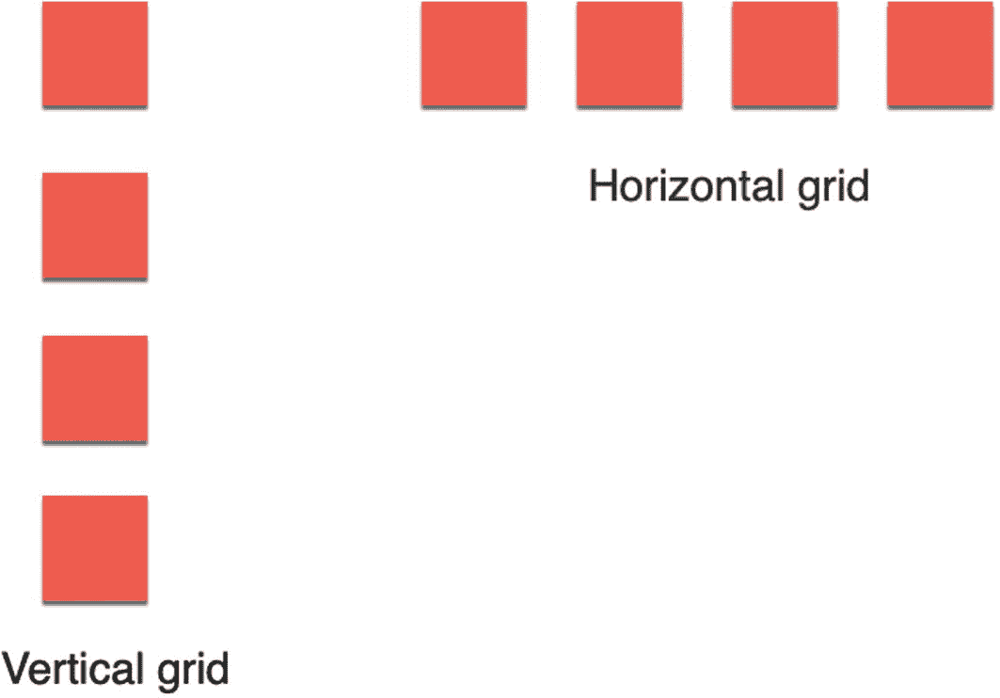

**图 19-1** 网格可以水平或垂直地显示数据

创建网格需要三个要素：

- 你想要显示的数据
- 一个 `GridItem` 数组，用于定义如何在网格中排列数据
- 一个 `LazyVGrid` 或 `LazyHGrid`，用于将数据放置在 `GridItem` 数组中

术语“Lazy”（懒加载）指的是网格加载数据的方式。如果一个网格需要显示 1000 个项目，它可能会将全部 1000 个项目加载到内存中，即使其中大部分项目无法显示在屏幕上。这会造成内存浪费，因此“懒加载”网格只加载那些需要显示的项目。一旦用户滚动以查看更多数据，懒加载网格会立即加载这些项目。通过等到最后一刻才加载数据，懒加载网格使用的内存要少得多，并且能让应用运行更高效，代价是运行速度会略慢一些。

**注意：** 懒加载网格通常嵌入在 `ScrollView` 中，以便用户滚动查看更多存储在网格中的数据。

要了解如何创建一个简单的水平和垂直网格，请遵循以下步骤：

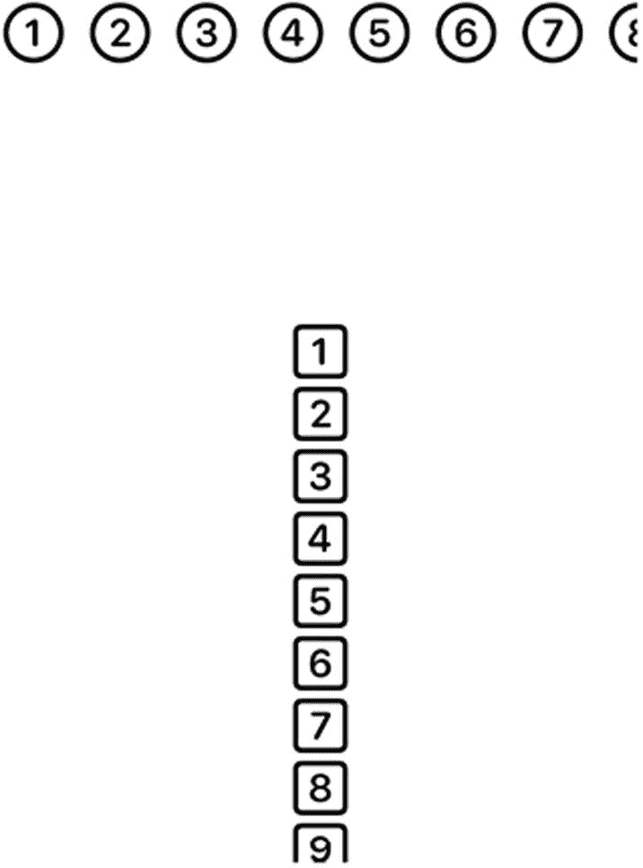

**图 19-2** 在垂直网格上方显示一个水平网格

1. 创建一个新的 SwiftUI iOS App 项目，并随意命名，例如“GridSimple”。
2. 在导航窗格中点击 `ContentView` 文件。
3. 在 `var body: some View` 内部，添加一个 `VStack` 并创建一个 `GridItem` 数组，如下所示：

```
var body: some View {
    VStack {
        let gridItems = [GridItem()]
    }
}
```

`GridItem` 是 SwiftUI 中的一个结构体，允许你定义列与行之间的间距。目前，我们将使用默认值，即保留 `GridItem` 参数列表为空。

4. 在 `gridItems` 数组下方，添加一个 `ScrollView` 和一个 `LazyHGrid`，如下所示：

```
ScrollView(Axis.Set.horizontal, showsIndicators: true, content: {
    LazyHGrid(rows: gridItems) {
        Image(systemName: "1.circle")
        Image(systemName: "2.circle")
        Image(systemName: "3.circle")
        Image(systemName: "4.circle")
        Image(systemName: "5.circle")
        Image(systemName: "6.circle")
        Image(systemName: "7.circle")
        Image(systemName: "8.circle")
        Image(systemName: "9.circle")
        Image(systemName: "10.circle")
    }.font(.largeTitle)
})
```

这段代码定义了一个水平 `ScrollView`（`Axis.Set.horizontal`），其中包含一个 `LazyHGrid`，用于显示一行数据。`LazyHGrid` 最多可以容纳十（10）个视图，因此我们用它填充了十个 `Image` 视图，在圆圈内显示不同的数字。由于圆圈图标较小，`.font(.largeTitle)` 修饰符使它们变得更大，更易于查看。

5. 在另一个 `ScrollView` 下方，添加第二个包含 `LazyVGrid` 的 `ScrollView`，如下所示：

```
ScrollView(Axis.Set.vertical, showsIndicators: true, content: {
    LazyVGrid(columns: gridItems) {
        Image(systemName: "1.square")
        Image(systemName: "2.square")
        Image(systemName: "3.square")
        Image(systemName: "4.square")
        Image(systemName: "5.square")
        Image(systemName: "6.square")
        Image(systemName: "7.square")
        Image(systemName: "8.square")
        Image(systemName: "9.square")
        Image(systemName: "10.square")
    }.font(.largeTitle)
})
```

这段代码定义了一个垂直 `ScrollView`（`Axis.Set.vertical`），其中包含一个 `LazyVGrid`，用于显示一列数据。这些数据由十个 `Image` 视图组成，在方形内显示不同的数字。`.font(.largeTitle)` 修饰符使这些方形图标更大，更易于查看。整个 `ContentView` 文件看起来应该像这样：

```
import SwiftUI
struct ContentView: View {
    var body: some View {
        VStack {
            let gridItems = [GridItem()]
            ScrollView(Axis.Set.horizontal, showsIndicators: true, content: {
                LazyHGrid(rows: gridItems) {
                    Image(systemName: "1.circle")
                    Image(systemName: "2.circle")
                    Image(systemName: "3.circle")
                    Image(systemName: "4.circle")
                    Image(systemName: "5.circle")
                    Image(systemName: "6.circle")
                    Image(systemName: "7.circle")
                    Image(systemName: "8.circle")
                    Image(systemName: "9.circle")
                    Image(systemName: "10.circle")
                }.font(.largeTitle)
            })
            ScrollView(Axis.Set.vertical, showsIndicators: true, content: {
                LazyVGrid(columns: gridItems) {
                    Image(systemName: "1.square")
                    Image(systemName: "2.square")
                    Image(systemName: "3.square")
                    Image(systemName: "4.square")
                    Image(systemName: "5.square")
                    Image(systemName: "6.square")
                    Image(systemName: "7.square")
                    Image(systemName: "8.square")
                    Image(systemName: "9.square")
                    Image(systemName: "10.square")
                }.font(.largeTitle)
            })
        }
    }
}
struct ContentView_Previews: PreviewProvider {
    static var previews: some View {
        ContentView()
    }
}
```

6. 在画布窗格中点击 Live 图标。
7. 左右滚动水平网格，查看所有带数字的圆圈，如图 19-2 所示。
8. 上下滚动垂直网格，查看所有带数字的方块。


## 定义多行/多列

在之前的项目中，我们在 `LazyHGrid` 中创建了单行，在 `LazyVGrid` 中创建了单列。这些单行和单列是由 `GridItem` 数组定义的，如下所示：

```
let gridItems = [GridItem()]
```

如果你想要创建多行或多列，只需定义一个包含多个 `GridItem` 的数组即可，如下所示：

```
let gridItems = [GridItem(),
GridItem()
]
```

这将会在 `LazyHGrid` 中创建两行，或在 `LazyVGrid` 中创建两列。每当你向数组中添加一个额外的 `GridItem`，网格中的行数或列数就会增加。

要了解如何更改网格中的行数或列数，请按照以下步骤操作：

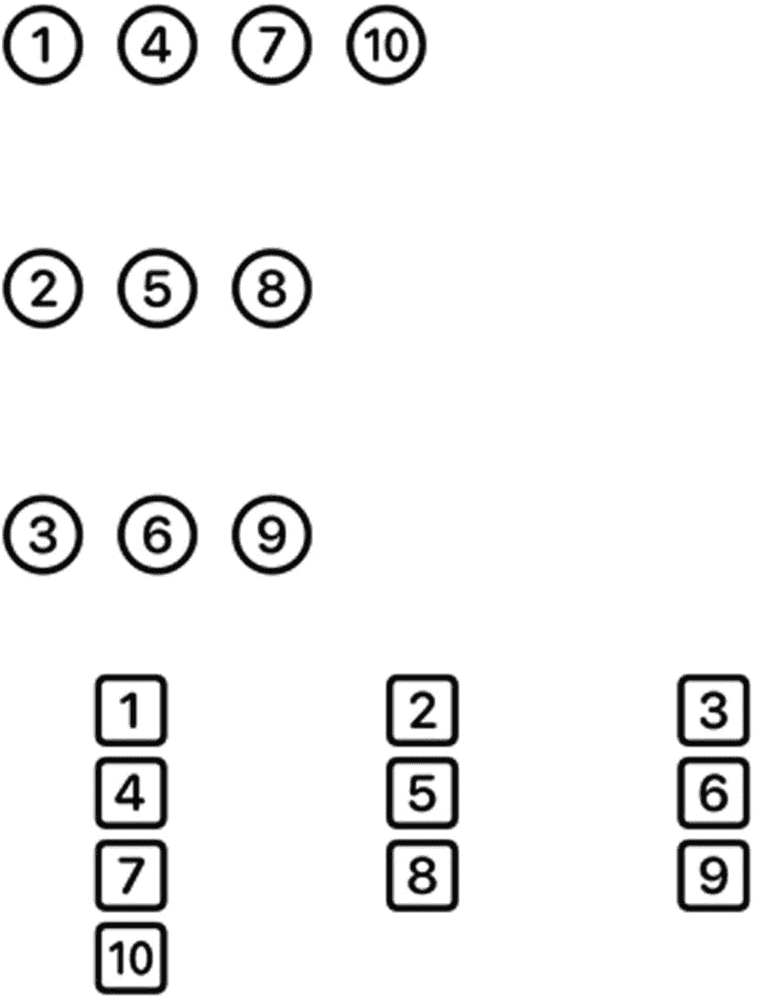

此图展示了数字 1 到 10 排成三行三列，分别位于圆形和方形的盒子内，并沿水平和垂直方向排列。

**图 19-3** – 显示一个三行三列的网格

1.  确保在 Xcode 中加载了之前的项目（“GridSimple”）。
2.  按如下所示编辑数组，以在 `LazyHGrid` 中定义三行，在 `LazyVGrid` 中定义三列：
    ```
    let gridItems = [GridItem(),
    GridItem(),
    GridItem()
    ]
    ```
    整个 `ContentView` 文件应如下所示：
    ```
    import SwiftUI
    struct ContentView: View {
    var body: some View {
    VStack {
    let gridItems = [GridItem(),
    GridItem(),
    GridItem()
    ]
    ScrollView(Axis.Set.horizontal, showsIndicators: true, content: {
    LazyHGrid(rows: gridItems) {
    Image(systemName: "1.circle")
    Image(systemName: "2.circle")
    Image(systemName: "3.circle")
    Image(systemName: "4.circle")
    Image(systemName: "5.circle")
    Image(systemName: "6.circle")
    Image(systemName: "7.circle")
    Image(systemName: "8.circle")
    Image(systemName: "9.circle")
    Image(systemName: "10.circle")
    }.font(.largeTitle)
    })
    ScrollView(Axis.Set.vertical, showsIndicators: true, content: {
    LazyVGrid(columns: gridItems) {
    Image(systemName: "1.square")
    Image(systemName: "2.square")
    Image(systemName: "3.square")
    Image(systemName: "4.square")
    Image(systemName: "5.square")
    Image(systemName: "6.square")
    Image(systemName: "7.square")
    Image(systemName: "8.square")
    Image(systemName: "9.square")
    Image(systemName: "10.square")
    }.font(.largeTitle)
    })
    }
    }
    }
    struct ContentView_Previews: PreviewProvider {
    static var previews: some View {
    ContentView()
    }
    }
    ```
3.  点击 Canvas 面板中的 Live 图标。
4.  左右滚动水平网格，以查看所有编号的圆形，如图 19-3 所示。
5.  上下滚动垂直网格，以查看所有编号的方形。

请注意，在填充 `LazyHGrid` 时，SwiftUI 会将每个项目放置在不同的行中。这就是为什么圆形 1 出现在第一行，圆形 2 出现在第二行，圆形 3 出现在第三行，而圆形 4 又回到第一行的原因。

填充 `LazyVGrid` 时也遵循同样的规则，只不过 SwiftUI 会将每个项目放置在不同的列中。方形 1 出现在第一列，方形 2 出现在第二列，方形 3 出现在第三列，而方形 4 又回到第一列。

> **注意**：只有当网格无法同时显示所有项目时，滚动指示器才会出现。当显示三行或三列时，所有项目都是可见的，因此滚动指示器无需出现。

### 调整行/列间距

通过创建一个 `GridItem` 数组，我们可以定义网格中的行数/列数。为了进一步定制，我们还可以定义行与列之间的间距。在网格中定义行/列间距的三种方式包括：

*   `.fixed`
*   `.flexible`
*   `.adaptive`

`.fixed` 选项允许你定义一个十进制数值（`CGFloat` 数据类型），用于创建一个特定的间距量。图 19-4 展示了不同的固定间距选项，以及它们如何影响网格中行列的外观。

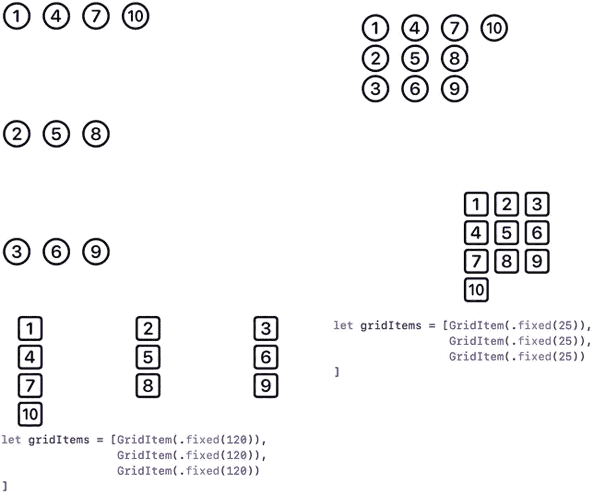

此图展示了数字 1 到 10 排成三行三列，分别位于圆形和方形的盒子内，并沿水平和垂直方向排列。图下方有一段代码片段。

**图 19-4** – 网格的各种 `.fixed` 间距选项

> **注意**：在图 19-4 中，数组中的所有 `GridItem` 元素都使用了相同的 `.fixed` 尺寸值，但如果需要，你可以为每个 `GridItem` 赋予不同的尺寸值。

为网格中的行和列间距定义一个 `.fixed` 值，在任何 iOS 设备上都会产生可预测的结果。然而，在较小或较大的 iOS 设备屏幕上，`.fixed` 值的效果可能并不总是理想。如果你想创建能够根据不同的屏幕尺寸进行调整的网格，可以改用 `.flexible` 或 `.adaptive`。

`.flexible` 选项会尝试尽可能地扩展行/列之间的间距。另一方面，`.adaptive` 选项会尝试尽可能地缩小行/列之间的间距。`.flexible` 和 `.adaptive` 选项都允许你定义最小值和最大值。这定义了网格间距可以使用的值的范围。

如果未选择任何选项，则默认值为 `.flexible`，最大值为 `.infinity`。要了解 `.fixed`、`.flexible` 和 `.adaptive` 选项是如何工作的，请按照以下步骤操作：

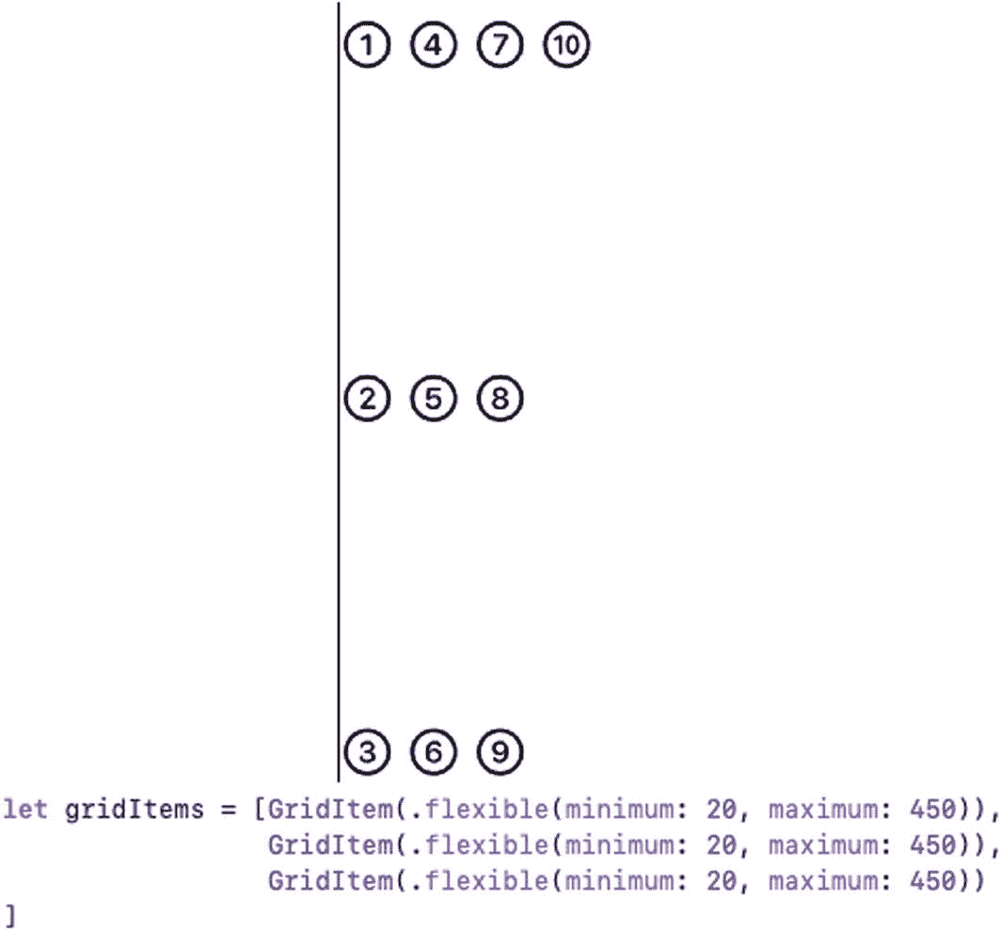

此图展示了数字 1 到 10 垂直排列成三行，位于圆形内，其下方有一段代码片段。

**图 19-5** – `LazyHGrid` 扩展了行之间的间距

1.  确保在 Xcode 中加载了之前的项目（“GridSimple”）。
2.  按如下所示编辑数组，以在 `LazyHGrid` 中定义三行，在 `LazyVGrid` 中定义三列：
    ```
    let gridItems = [GridItem(.fixed(120)),
    GridItem(.fixed(120)),
    GridItem(.fixed(120))
    ]
    ```
    请注意，这会以固定数量分隔网格中的行和列（参见图 19-4）。
3.  按如下所示编辑数组，以在 `LazyHGrid` 中定义三行，在 `LazyVGrid` 中定义三列：
    ```
    let gridItems = [GridItem(.flexible(minimum: 20, maximum: 450)),
    GridItem(.flexible(minimum: 20, maximum: 450)),
    GridItem(.flexible(minimum: 20, maximum: 450))
    ]
    ```
4.  像这样注释掉第二个 `Scroll View`：
    ```
    //            ScrollView(Axis.Set.vertical, showsIndicators: true, content: {
    //                LazyVGrid(columns: gridItems) {
    //                    Image(systemName: "1.square")
    //                    Image(systemName: "2.square")
    //                    Image(systemName: "3.square")
    //                    Image(systemName: "4.square")
    //                    Image(systemName: "5.square")
    //                    Image(systemName: "6.square")
    //                    Image(systemName: "7.square")
    //                    Image(systemName: "8.square")
    //                    Image(systemName: "9.square")
    //                    Image(systemName: "10.square")
    //                }.font(.largeTitle)
    //            })
    ```
    请注意，没有了第二个 `ScrollView`，`LazyHGrid` 现在可以扩展行之间的间距，如图 19-5 所示。

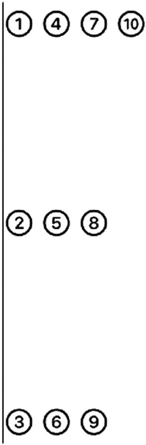

此图展示了数字 1 到 10 垂直排列成三行，位于圆形内。

**图 19-6**


`.adaptive`选项将间距缩小到最小可能值。

1.  如下所示编辑数组，在 `LazyHGrid` 中定义三行，在 `LazyVGrid` 中定义三列：

```swift
let gridItems = [GridItem(.adaptive(minimum: 20, maximum: 45)),
GridItem(.adaptive(minimum: 20, maximum: 450)),
GridItem(.adaptive(minimum: 20, maximum: 450))
]
```

注意，`.adaptive`选项将间距缩小到最小，如图 19-6 所示。

### 使用`GridRow`创建表格

数据通常可以像电子表格或表格一样按行和列组织。为了在`SwiftUI`中模拟表格，有一个特殊的`GridRow`，它允许你定义在网格内组织的数据行，如图 19-7 所示。


一个包含 2 列和 5 行的表格显示了电影列表及其各自的发行商。行条目如下：1. *《火星救援》*，二十世纪福克斯。2. *《E.T.外星人》*，环球影业。3. *《夺宝奇兵》*，派拉蒙。4. *《玩具总动员》*，博伟影业。5. *《敦刻尔克》*，华纳兄弟。

图 19-7

`Grid`和`GridRow`可以创建表格

要创建表格，你必须首先像这样定义一个网格：

```swift
var body: some View {
Grid() {
}
```

然后在`Grid()`内部，定义多个`GridRow`。在每个`GridRow`内部，为你想要创建的每一列定义一个单独的视图。因此，如果你想创建一行分成两列，`GridRow`可能由两个`Text`视图组成，如下所示：

```swift
GridRow {
Text("The Martian")
Text("20th Century")
}
```

要了解如何使用`GridRow`创建表格，请按照以下步骤操作：

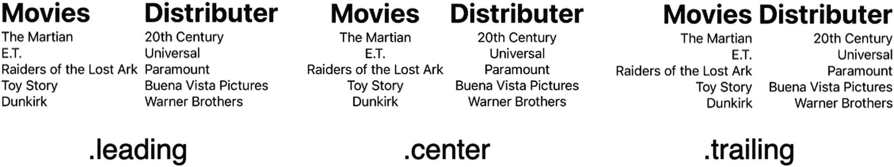

一个表格列出了电影，包括*《火星救援》*、*《E.T.外星人》*、*《夺宝奇兵》*、*《玩具总动员》*和*《敦刻尔克》*，以及它们各自的发行商，如二十世纪福克斯、环球影业、派拉蒙、博伟影业和华纳兄弟。电影和发行商以三种不同的对齐方式列出：左对齐、居中对齐和右对齐。

图 19-8

在`GridRow`中对齐数据的不同方式

1.  创建一个新的`SwiftUI` iOS 应用项目，并赋予你想要的任何名称，例如“GridRows”。

2.  在导航窗格中点击`ContentView`文件。

3.  在`var body: some View`内部添加一个`Grid()`，如下所示：

```swift
var body: some View {
Grid() {
}
```

4.  在`Grid()`内部添加`GridRow`。`GridRow`的数量定义了行数。一个`GridRow`内不同视图的数量定义了列数：

```swift
var body: some View {
Grid() {
GridRow {
Text("Movies")
Text("Distributer")
}.bold()
.font(.largeTitle)
GridRow {
Text("The Martian")
Text("20th Century")
}
GridRow {
Text("E.T.")
Text("Universal")
}
GridRow {
Text("Raiders of the Lost Ark")
Text("Paramount")
}
GridRow {
Text("Toy Story")
Text("Buena Vista Pictures")
}
GridRow {
Text("Dunkirk")
Text("Warner Brothers")
}
}
```

注意，你可以格式化单个 `GridRow`。在前面的示例中，第一个 `GridRow` 以粗体和`.largeTitle`格式设置，以定义表格的标题（见图 19-7）。

整个`ContentView`文件应如下所示：

```swift
import SwiftUI
struct ContentView: View {
var body: some View {
Grid() {
GridRow {
Text("Movies")
Text("Distributer")
}.bold()
.font(.largeTitle)
GridRow {
Text("The Martian")
Text("20th Century")
}
GridRow {
Text("E.T.")
Text("Universal")
}
GridRow {
Text("Raiders of the Lost Ark")
Text("Paramount")
}
GridRow {
Text("Toy Story")
Text("Buena Vista Pictures")
}
GridRow {
Text("Dunkirk")
Text("Warner Brothers")
}
}
}
}
struct ContentView_Previews: PreviewProvider {
static var previews: some View {
ContentView()
}
}
```

5.  在画布窗格中点击“Live”图标。

格式化网格外观的另外两种方式是使用分隔符和对齐。分隔符在每个`GridRow`之间显示一条水平线，而对齐则让你定义数据在每个`GridRow`内的显示方式，例如`.center`（默认）、`.leading`（左对齐）或`.trailing`（右对齐），如图 19-8 所示。

要了解如何在网格和`GridRow`中使用分隔符和对齐，请按照以下步骤操作：

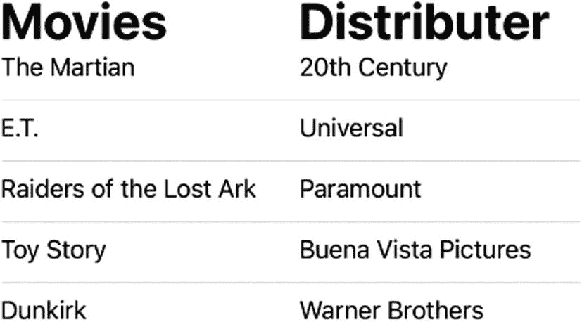

一个包含 2 列和 5 行的表格列出了电影及其各自的发行商。行条目如下：1. *《火星救援》*，二十世纪福克斯。2. *《E.T.外星人》*，环球影业。3. *《夺宝奇兵》*，派拉蒙。4. *《玩具总动员》*，博伟影业。5. *《敦刻尔克》*，华纳兄弟。

图 19-9

对齐网格（`.leading`）并在`GridRow`之间添加分隔符

1.  打开你之前创建的项目“GridRows”。

2.  在导航窗格中点击`ContentView`文件。

3.  编辑`ContentView`文件，为网格添加对齐，并在`GridRow`之间添加分隔符，如下所示：

```swift
Grid(alignment: .leading) {
GridRow {
Text("Movies")
Text("Distributer")
}.bold()
.font(.largeTitle)
GridRow {
Text("The Martian")
Text("20th Century")
}
Divider()
GridRow {
Text("E.T.")
Text("Universal")
}
Divider()
GridRow {
Text("Raiders of the Lost Ark")
Text("Paramount")
}
Divider()
GridRow {
Text("Toy Story")
Text("Buena Vista Pictures")
}
Divider()
GridRow {
Text("Dunkirk")
Text("Warner Brothers")
}
}
```

整个`ContentView`文件应如下所示：

```swift
import SwiftUI
struct ContentView: View {
var body: some View {
Grid(alignment: .leading) {
GridRow {
Text("Movies")
Text("Distributer")
}.bold()
.font(.largeTitle)
GridRow {
Text("The Martian")
Text("20th Century")
}
Divider()
GridRow {
Text("E.T.")
Text("Universal")
}
Divider()
GridRow {
Text("Raiders of the Lost Ark")
Text("Paramount")
}
Divider()
GridRow {
Text("Toy Story")
Text("Buena Vista Pictures")
}
Divider()
GridRow {
Text("Dunkirk")
Text("Warner Brothers")
}
}
}
}
struct ContentView_Previews: PreviewProvider {
static var previews: some View {
ContentView()
}
}
```

4.  在画布窗格中点击“Live”图标。表格现在应如图 19-9 所示。


## 摘要

网格提供了在用户界面上显示视图的另一种方式。`LazyHGrids` 可以水平按行显示视图，而 `LazyVGrids` 可以垂直按列显示视图。要使用网格，你需要准备待显示的数据、一个用于定义数据在网格中排列方式的 `GridItem` 数组，以及一个 `LazyHGrid` 或 `LazyVGrid`。

数组中定义的 `GridItem` 数量决定了网格中显示的行/列数。通过每个 `GridItem`，你可以定义诸如 `.fixed`、`.flexible` 或 `.adaptive` 等间距选项。

`.fixed` 选项允许你定义一个十进制数值作为间距，例如 `25.7`。`.flexible` 选项会尽可能扩展间距，而 `.adaptive` 选项则会尽可能缩小间距。你可以为数组中的每个 `GridItem` 应用不同的间距选项。

通过使用网格，你可以在行和列中显示数据。网格通常嵌入在 `Scroll View` 中，以便用户能够上下或左右滚动，查看那些可能因网格尺寸和 iOS 设备屏幕大小而无法完全显示的数据。

如果你想以表格形式显示数据，请使用网格定义表格结构，然后使用多个 `GridRows` 来定义行数。在每个 `GridRow` 内部，定义一个或多个视图，这些视图的总数决定了表格的列数。网格只是一种组织和显示相关数据的便捷方式，目的是让用户更容易阅读。

# 使用动画

动画可以移动用户界面上的元素，以提供反馈或仅仅增加美感。与手工制作的传统动画（漫画家需要逐帧绘制，每帧略有不同）不同，SwiftUI 中的动画只需定义起始状态和结束状态即可运行。然后 SwiftUI 会负责处理元素在这两种状态之间的动画过渡。

三种最常见的动画类型包括：

*   **移动** – 改变元素在用户界面上的 `x` 和 `y` 位置
*   **缩放** – 通过缩小或放大来改变元素的大小
*   **旋转** – 沿顺时针或逆时针方向改变元素的角度

创建动画涉及定义：要动画化什么、如何动画化（移动、缩放、旋转）以及何时动画化。动画通常发生在用户执行某些操作（如点击按钮）或特定事件发生（如数值达到某个点）时。

## 移动动画

要移动一个视图，我们必须定义其 `x`、`y` 的起始位置和 `x`、`y` 的结束位置。用于指定位置的两个修饰符是 `.position` 和 `.offset`。

`.position` 修饰符将视图放置于相对于 iOS 设备屏幕左上角（被视为原点 (0,0)）的特定 `x` 和 `y` 位置。`.offset` 修饰符则将视图放置于相对于它通常在用户界面上出现位置的特定 `x` 和 `y` 偏移量处。

`.position` 修饰符定义的是屏幕上的固定位置。`.offset` 修饰符定义的是相对于视图在 `.offset` 修饰符的 `x` 和 `y` 值均为 `0` 时正常显示位置的相对位置。在这两种情况下，正的 `x` 值将视图向右移动，正的 `y` 值将视图向下移动，如图 20-1 所示。

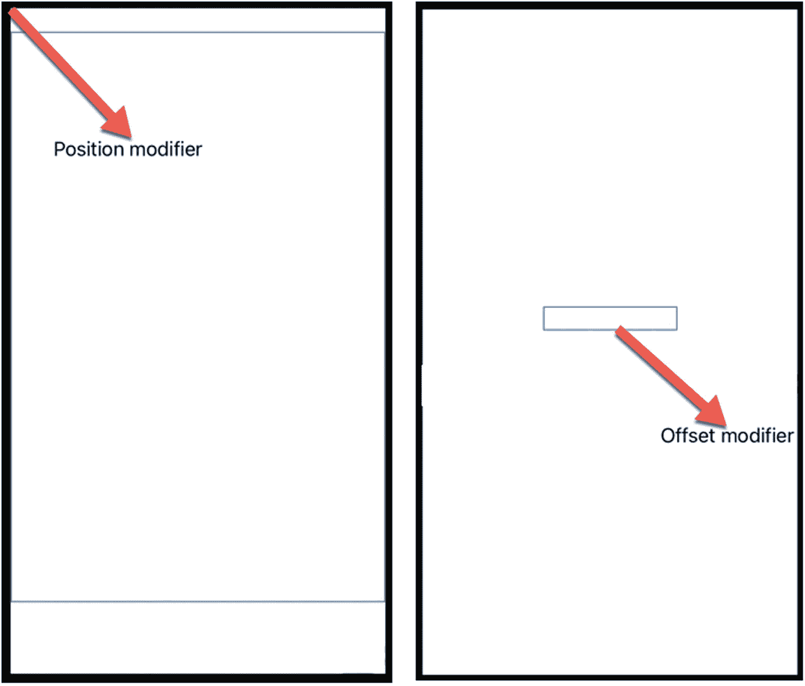

一组两个矩形框。左上角有一个对角箭头，标注为 position 修饰符。位于垂直矩形框中心的一个矩形标注为 offset 修饰符，并用一个对角箭头标记。

图 20-1: `.position` 修饰符与 `.offset` 修饰符之间的区别

**注意：** 使用 `.position` 和 `.offset` 修饰符时，极端的 `x` 或 `y` 值可能会导致视图移出屏幕。

要了解如何使用 `.position` 和 `.offset` 修饰符移动视图，请遵循以下步骤：

1.  创建一个新的 SwiftUI iOS App 项目，并为其指定任何你喜欢的名称，例如 "AnimationMove"。
2.  在导航器面板中点击 ContentView 文件。
3.  在 `struct ContentView: View` 代码行下方添加一个 `State` 变量，如下所示：

```
@State var move = true
```

4.  在 `VStack` 内部添加一个 `Text` 视图和一个 `Toggle`，如下所示：

```
var body: some View {
    VStack {
        Text("A Text view")
            .offset(x: move ? 100 : 0, y: move ? 100 : 0)
        Toggle(isOn: $move) {
            Text("Toggle me")
        }
    }
}
```

整个 `ContentView` 文件应如下所示：

```
import SwiftUI

struct ContentView: View {
    @State var move = true

    var body: some View {
        VStack {
            Text("A Text view")
                .offset(x: move ? 100 : 0, y: move ? 100 : 0)
            Toggle(isOn: $move) {
                Text("Toggle me")
            }
        }
    }
}

struct ContentView_Previews: PreviewProvider {
    static var previews: some View {
        ContentView()
    }
}
```

5.  点击画布面板中的 Live 图标。
6.  点击 Toggle。注意 `.offset` 修饰符将 `Text` 视图从其正常位置移开。
7.  编辑 `ContentView` 文件，将 `.offset` 替换为 `.position`，如下所示：

```
.position(x: move ? 100 : 0, y: move ? 100 : 0)
```

8.  确保 Live 仍处于开启状态，然后点击 Toggle。注意 `Text` 视图现在根据屏幕左上角的原点 (0,0) 进行移动。
9.  为 `Text` 视图添加 `.animation` 修饰符，使移动看起来更平滑。

```
import SwiftUI

struct ContentView: View {
    @State var move = true

    var body: some View {
        VStack {
            Text("A Text view")
                .position(x: move ? 100 : 0, y: move ? 100 : 0)
                .animation(.default, value: move)
            Toggle(isOn: $move) {
                Text("Toggle me")
            }
        }
    }
}

struct ContentView_Previews: PreviewProvider {
    static var previews: some View {
        ContentView()
    }
}
```

10. 确保 Live 仍处于开启状态，然后点击 Toggle。注意 `Text` 视图现在在根据屏幕左上角原点 (0,0) 移动时呈现动画效果。
11. 将 `.position` 修饰符替换为 `.offset` 修饰符。
12. 确保 Live 仍处于开启状态，然后点击 Toggle。注意 `Text` 视图现在在基于其正常位置移动时呈现动画效果。

在这个项目中，`.animation` 修饰符提供了 `Text` 视图在两个不同 `x` 和 `y` 位置之间的过渡。每次 `Toggle` 改变布尔类型的 `State` 变量时，动画都会再次运行。

`.animation` 修饰符需要定义你想要动画的类型（例如 `.default`）以及将触发动画的变量。在这种情况下，每次 `move` 变量改变时，我们都希望有动画效果，这就是为什么 `.animation` 修饰符在其 `value` 参数中显示 `move`，如下所示：

```
@State var move = true
.animation(.default, value: move)
```


### 缩放动画

创建动画的另一种方法是为视图定义两种不同的大小，即缩放。要定义视图大小的起始和结束状态，请使用 `.scaleEffect` 修饰符并定义相对的尺寸变化。例如，`.scaleEffect(1)` 表示视图的当前大小。大于 1 的 `.scaleEffect` 值表示更大的尺寸或缩放比例，而小于 1 的 `.scaleEffect` 值则表示更小的尺寸或缩放比例。

要了解如何通过将视图缩放到不同大小来制作动画，请按以下步骤操作：

1. 创建一个新的 SwiftUI iOS 应用项目，并为其任意命名，例如“AnimationScale”。
2. 在导航器面板中点击 `ContentView` 文件。
3. 在 `struct ContentView: View` 代码行下方添加一个 `State` 变量，如下所示：

```
@State private var changeMe = false
```

4. 在 `var body: some View` 内部添加一个 `Image` 视图，如下所示：

```
var body: some View {
    Image(systemName: "tortoise.fill")
        .font(.system(size:100))
        .foregroundColor(.red)
        .scaleEffect(changeMe ? 1.75 : 1)
}
```

这会在屏幕上显示一个大小为 100 的海龟图标，使其更容易看清。然后将海龟图标着色为红色，并使用 `.scaleEffect` 修饰符在原始大小的 1.75 倍和原始大小之间切换。

5. 像这样为 `Image` 视图添加以下修饰符：

```
.animation(.default, value: changeMe)
.onTapGesture {
    changeMe.toggle()
}
```

这为 `Image` 视图添加了 `.animation` 修饰符，使其大小变化呈现动画效果。然后，`.onTapGesture` 修饰符检测点击手势，将 `changeMe` `State` 变量从 `true` 切换为 `false`（或从 `false` 切换为 `true`）。整个 `ContentView` 文件应如下所示：

```
import SwiftUI
struct ContentView: View {
    @State private var changeMe = false
    var body: some View {
        Image(systemName: "tortoise.fill")
            .font(.system(size:100))
            .foregroundColor(.red)
            .scaleEffect(changeMe ? 1.75 : 1)
            .animation(.default, value: changeMe)
            .onTapGesture {
                changeMe.toggle()
            }
    }
}
struct ContentView_Previews: PreviewProvider {
    static var previews: some View {
        ContentView()
    }
}
```

6. 在画布面板中点击“Live”图标。
7. 点击海龟图像。请注意，每次点击海龟图像时，它都会在缩小和放大之间切换。

### 旋转动画

动画旋转涉及使用 `.rotationEffect` 修饰符改变视图的角度。`.rotationEffect` 值为 0 表示不旋转，而小于或大于 0 的旋转值则分别使视图逆时针或顺时针旋转。

要了解如何通过将视图旋转不同角度来制作动画，请按以下步骤操作：

1. 创建一个新的 SwiftUI iOS 应用项目，并为其任意命名，例如“AnimationRotate”。
2. 在导航器面板中点击 `ContentView` 文件。
3. 在 `struct ContentView: View` 代码行下方添加两个 `State` 变量，如下所示：

```
@State var myDegrees: Double = 0.0
@State var flag = false
```

4. 在 `VStack` 内部添加一个 `Text` 视图，如下所示：

```
var body: some View {
    VStack {
        Text("Hello, world!")
            .padding()
            .rotationEffect(Angle(degrees: flag ? myDegrees : 0))
            .animation(.default, value: flag)
```

此 `Text` 视图使用 `.rotationEffect` 定义起始和结束角度。然后使用 `.animation` 修饰符在 `Text` 视图在起始和结束角度之间旋转时为其添加动画效果。每当 `flag` 变量发生变化时，`.animation` 修饰符就会显示动画。

5. 在 `VStack` 内部的 `Text` 视图下方添加一个 `Button` 和一个 `Slider`，如下所示：

```
var body: some View {
    VStack {
        Text("Hello, world!")
            .padding()
            .rotationEffect(Angle(degrees: flag ? myDegrees : 0))
            .animation(.default, value: flag)
        Button("Animate now") {
            flag.toggle()
        }
        Slider(value: $myDegrees, in: -180...180, step: 1)
            .padding()
    }
}
```

`Slider` 允许你在 -180 度到 180 度之间选择一个角度。整个 `ContentView` 文件应如下所示：

```
import SwiftUI
struct ContentView: View {
    @State var myDegrees: Double = 0.0
    @State var flag = false
    var body: some View {
        VStack {
            Text("Hello, world!")
                .padding()
                .rotationEffect(Angle(degrees: flag ? myDegrees : 0))
                .animation(.default, value: flag)
            Button("Animate now") {
                flag.toggle()
            }
            Slider(value: $myDegrees, in: -180...180, step: 1)
                .padding()
        }
    }
}
struct ContentView_Previews: PreviewProvider {
    static var previews: some View {
        ContentView()
    }
}
```

6. 在画布面板中点击“Live”图标。
7. 向左或向右拖动 `Slider` 来定义结束角度。（起始角度为 0。）
8. 点击 `Button`。请注意，当 `Text` 视图旋转到新角度时，`.animation` 修饰符会为其添加动画效果。

## 动画选项

到目前为止，我们一直在 `.animation` 修饰符中使用 `.default` 设置。虽然这可行，但你还可以选择其他几种动画选项：

- `.easeIn` – 动画开始较慢，然后加速
- `.easeOut` – 动画在接近结束时减慢
- `.easeInOut` – 动画开始较慢，然后加速，最后接近结束时减速（与 `.default` 相同）
- `.linear` – 动画从开始到结束保持恒定速度

通过选择不同的 `.animation` 选项，你可以调整动画运行时的外观。要比较这些不同的 `.animation` 选项，请按以下步骤操作：

1. 创建一个新的 SwiftUI iOS 应用项目，并为其任意命名，例如“CompareAnimation”。
2. 在导航器面板中点击 `ContentView` 文件。
3. 在 `struct ContentView: View` 代码行下方添加一个 `State` 变量，如下所示：

```
@State private var start = false
```

4. 在 `var body: some View` 中添加一个 `VStack`。
5. 在 `VStack` 内部添加一个 `Button`，如下所示：

```
var body: some View {
    VStack {
        Button("Start animation") {
            start.toggle()
        }
```

6. 在 `Button` 下方添加一个包含四个 `Text` 视图的 `HStack`，如下所示：

```
HStack {
    Text("easeIn")
        .offset(x: 0, y: start ? 450 : 0)
        .animation(.easeIn, value: start)
    Text("easeOut")
        .offset(x: 0, y: start ? 450 : 0)
        .animation(.easeOut, value: start)
    Text("easeInOut")
        .offset(x: 0, y: start ? 450 : 0)
        .animation(.easeInOut, value: start)
    Text("linear")
        .offset(x: 0, y: start ? 450 : 0)
        .animation(.linear, value: start)
}.position(x: 150, y: 10)
```

请注意，`.position` 修饰符最初将整个 `HStack` 及其所有四个 `Text` 视图放置在靠近屏幕顶部的位置。整个 `ContentView` 文件应如下所示：

```
import SwiftUI
struct ContentView: View {
    @State private var start = false
    var body: some View {
        VStack {
            Button("Start animation") {
                start.toggle()
            }
            HStack {
                Text("easeIn")
                    .offset(x: 0, y: start ? 450 : 0)
                    .animation(.easeIn, value: start)
                Text("easeOut")
                    .offset(x: 0, y: start ? 450 : 0)
                    .animation(.easeOut, value: start)
                Text("easeInOut")
                    .offset(x: 0, y: start ? 450 : 0)
                    .animation(.easeInOut, value: start)
                Text("linear")
                    .offset(x: 0, y: start ? 450 : 0)
                    .animation(.linear, value: start)
            }.position(x: 150, y: 10)
        }
    }
}
struct ContentView_Previews: PreviewProvider {
    static var previews: some View {
        ContentView()
    }
}
```

7. 在画布面板中点击“Live”图标。
8. 点击 `Button`。请注意，所有四个 `Text` 视图都会向下移动到屏幕底部，但由于它们使用了不同的 `.animation` 选项，即使它们同时开始和停止，动画效果也略有不同。


### 在动画中使用延迟和持续时间

通过两种方式可以按时间修改动画，即延迟和持续时间。延迟让你指定动画开始前等待的秒数。持续时间则让你指定动画应持续多久。较大的时间值会使动画运行得更慢，而较短的时间值会使动画运行得更快。

要定义延迟，请在你希望的 `.animation` 选项上添加 `.delay` 修饰符，例如：

```
.animation(.linear.delay(2.5), value: yourVariableNameHere)
```

要查看延迟的工作原理，请按照以下步骤操作：

1.  加载之前的“CompareAnimation” Xcode 项目。
2.  为每个 `.animation` 选项添加 `.delay` 修饰符，如下所示：

```
    HStack {
    Text("easeIn")
    .offset(x: 0, y: start ? 450 : 0)
    .animation(.easeIn.delay(0.5))
    Text("easeOut")
    .offset(x: 0, y: start ? 450 : 0)
    .animation(.easeOut.delay(1.0))
    Text("easeInOut")
    .offset(x: 0, y: start ? 450 : 0)
    .animation(.easeInOut.delay(1.5))
    Text("linear")
    .offset(x: 0, y: start ? 450 : 0)
    .animation(.linear.delay(2.5))
    }.position(x: 150, y: 10)
```

整个 `ContentView` 文件应如下所示：

```
    import SwiftUI
    struct ContentView: View {
    @State private var start = false
    var body: some View {
    VStack {
    Button("Start animation") {
    start.toggle()
    }
    HStack {
    Text("easeIn")
    .offset(x: 0, y: start ? 450 : 0)
    .animation(.easeIn.delay(0.5), value: start)
    Text("easeOut")
    .offset(x: 0, y: start ? 450 : 0)
    .animation(.easeOut.delay(1.0), value: start)
    Text("easeInOut")
    .offset(x: 0, y: start ? 450 : 0)
    .animation(.easeInOut.delay(1.5), value: start)
    Text("linear")
    .offset(x: 0, y: start ? 450 : 0)
    .animation(.linear.delay(2.5), value: start)
    }.position(x: 150, y: 10)
    }
    }
    }
    struct ContentView_Previews: PreviewProvider {
    static var previews: some View {
    ContentView()
    }
    }
```

3.  在画布窗格中单击“Live”图标。
4.  单击“Button”按钮。请注意，如果每个 `Text` 视图具有不同的 `.delay` 值，它们现在会在不同时间进行动画。

要定义持续时间，请在你希望的 `.animation` 选项上添加持续时间，例如：

```
.animation(.easeIn(duration: 0.7), value: start)
```

> **注意**：你可以将持续时间与延迟结合使用，如下所示：`.animation(.linear(duration: 3.1).delay(1.2), value: start).`

延迟是临时阻止动画启动，而持续时间则定义该动画实际运行的时间。要查看持续时间的工作原理，请按照以下步骤操作：

1.  加载之前的“CompareAnimation” Xcode 项目。
2.  为每个 `.animation` 选项添加持续时间，如下所示：

```
    HStack {
    Text("easeIn")
    .offset(x: 0, y: start ? 450 : 0)
    .animation(.easeIn(duration: 0.7), value: start)
    Text("easeOut")
    .offset(x: 0, y: start ? 450 : 0)
    .animation(.easeOut(duration: 1.7), value: start)
    Text("easeInOut")
    .offset(x: 0, y: start ? 450 : 0)
    .animation(.easeInOut(duration: 2.6), value: start)
    Text("linear")
    .offset(x: 0, y: start ? 450 : 0)
    .animation(.linear(duration: 3.1), value: start)
    }.position(x: 150, y: 10)
```

整个 `ContentView` 文件应如下所示：

```
    import SwiftUI
    struct ContentView: View {
    @State private var start = false
    var body: some View {
    VStack {
    Button("Start animation") {
    start.toggle()
    }
    HStack {
    Text("easeIn")
    .offset(x: 0, y: start ? 450 : 0)
    .animation(.easeIn(duration: 0.7), value: start)
    Text("easeOut")
    .offset(x: 0, y: start ? 450 : 0)
    .animation(.easeOut(duration: 1.7), value: start)
    Text("easeInOut")
    .offset(x: 0, y: start ? 450 : 0)
    .animation(.easeInOut(duration: 2.6), value: start)
    Text("linear")
    .offset(x: 0, y: start ? 450 : 0)
    .animation(.linear(duration: 3.1), value: start)
    }.position(x: 150, y: 10)
    }
    }
    }
    struct ContentView_Previews: PreviewProvider {
    static var previews: some View {
    ContentView()
    }
    }
```

3.  在画布窗格中单击“Live”图标。
4.  单击“Button”按钮。注意不同的持续时间值如何修改各种动画。

### 在动画中使用插值弹簧动画

为了提供更多自定义动画工作方式的方法，你还可以为动画定义一个 `.interpolatingSpring` 修饰符。`.interpolatingSpring` 允许你定义以下一项或多项：

- **质量**——低数值会使动画更慢且阻尼更小；高数值会使动画更快且阻尼更大。
- **刚度**——低数值会使动画更慢；高数值会使动画更快。
- **阻尼**——低数值会产生更多“弹跳”；高数值会抑制“弹跳”。
- **初始速度**——低数值会使动画开始时较慢；高数值会使动画开始时较快。

要查看刚度和阻尼的工作原理，请按照以下步骤操作：

1.  加载之前的“CompareAnimation” Xcode 项目。
2.  将所有 `Text` 视图改为显示相同的字符串，例如“spring”。
3.  为每个 `Text` 视图添加 `.interpolatingSpring` 修饰符，如下所示：

```
    HStack {
    Text("spring")
    .offset(x: 0, y: start ? 450 : 0)
    .animation(.interpolatingSpring(stiffness: 1, damping: 1), value: start)
    Text("spring")
    .offset(x: 0, y: start ? 450 : 0)
    .animation(.interpolatingSpring(stiffness: 1.8, damping: 1), value: start)
    Text("spring")
    .offset(x: 0, y: start ? 450 : 0)
    .animation(.interpolatingSpring(stiffness: 0.5, damping: 1), value: start)
    Text("spring")
    .offset(x: 0, y: start ? 450 : 0)
    .animation(.interpolatingSpring(stiffness: 2, damping: 1), value: start)
    }.position(x: 150, y: 10)
```

确保每个 `.animation` 修饰符的 `damping` 参数相同，并且每个 `.animation` 修饰符的 `stiffness` 参数不同。整个 `ContentView` 文件应如下所示：

```
    import SwiftUI
    struct ContentView: View {
    @State private var start = false
    var body: some View {
    VStack {
    Button("Start animation") {
    start.toggle()
    }
    HStack {
    Text("spring")
    .offset(x: 0, y: start ? 450 : 0)
    .animation(.interpolatingSpring(stiffness: 1, damping: 1), value: start)
    Text("spring")
    .offset(x: 0, y: start ? 450 : 0)
    .animation(.interpolatingSpring(stiffness: 1.8, damping: 1), value: start)
    Text("spring")
    .offset(x: 0, y: start ? 450 : 0)
    .animation(.interpolatingSpring(stiffness: 0.5, damping: 1), value: start)
    Text("spring")
    .offset(x: 0, y: start ? 450 : 0)
    .animation(.interpolatingSpring(stiffness: 2, damping: 1), value: start)
    }.position(x: 150, y: 10)
    }
    }
    }
    struct ContentView_Previews: PreviewProvider {
    static var previews: some View {
    ContentView()
    }
    }
```

4.  在画布窗格中单击“Live”图标。
5.  单击“Button”按钮。注意不同的 `stiffness` 值如何改变每个 `Text` 视图的动画方式。
6.  编辑 `.animation` 修饰符，使得 `stiffness` 值相同，但 `damping` 值不同。
7.  单击“Button”按钮。注意不同的 `damping` 值如何改变每个 `Text` 视图在停止前上下弹跳的方式。

除了 `stiffness` 和 `damping`，你还可以定义 `mass` 和 `initialVelocity`。通过尝试所有四个参数的不同值，你可以进一步自定义动画。

要查看 `mass` 和 `initialVelocity` 如何影响动画，请按照以下步骤操作：

1.  加载之前的“CompareAnimation” Xcode 项目。
2.  为每个 `Text` 视图添加 `.interpolatingSpring` 修饰符，如下所示：


```swift
    HStack {
    Text("spring")
    .offset(x: 0, y: start ? 450 : 0)
    .animation(.interpolatingSpring(mass: 1, stiffness: 1, damping: 1, initialVelocity: 1), value: start)
    Text("spring")
    .offset(x: 0, y: start ? 450 : 0)
    .animation(.interpolatingSpring(mass: 1.9, stiffness: 1, damping: 1, initialVelocity: 1), value: start)
    Text("spring")
    .offset(x: 0, y: start ? 450 : 0)
    .animation(.interpolatingSpring(mass: 2.5, stiffness: 1, damping: 1, initialVelocity: 1), value: start)
    Text("spring")
    .offset(x: 0, y: start ? 450 : 0)
    .animation(.interpolatingSpring(mass: 3.5, stiffness: 1, damping: 1, initialVelocity: 1), value: start)
    }.position(x: 150, y: 10)
    ```

确保每个 `.animation` 修饰符中的 `initialVelocity` 值相同，但每个 `.animation` 修饰符中的 `mass` 值不同。整个 `ContentView` 文件应如下所示：

```swift
    import SwiftUI
    struct ContentView: View {
    @State private var start = false
    var body: some View {
    VStack {
    Button("Start animation") {
    start.toggle()
    }
    HStack {
    Text("spring")
    .offset(x: 0, y: start ? 450 : 0)
    .animation(.interpolatingSpring(mass: 1, stiffness: 1, damping: 1, initialVelocity: 1), value: start)
    Text("spring")
    .offset(x: 0, y: start ? 450 : 0)
    .animation(.interpolatingSpring(mass: 1.9, stiffness: 1, damping: 1, initialVelocity: 1), value: start)
    Text("spring")
    .offset(x: 0, y: start ? 450 : 0)
    .animation(.interpolatingSpring(mass: 2.5, stiffness: 1, damping: 1, initialVelocity: 1), value: start)
    Text("spring")
    .offset(x: 0, y: start ? 450 : 0)
    .animation(.interpolatingSpring(mass: 3.5, stiffness: 1, damping: 1, initialVelocity: 1), value: start)
    }.position(x: 150, y: 10)
    }
    }
    }
    struct ContentView_Previews: PreviewProvider {
    static var previews: some View {
    ContentView()
    }
    }
    ```

3.  在画布面板中点击“Live”图标。

4.  点击“Button”。注意较高的 `mass` 值与较低的 `mass` 值相比，如何影响动画效果。

5.  编辑 `.animation` 修饰符，使 `mass` 值相同，但 `initialVelocity` 值不同。

6.  点击“Button”。注意不同的 `initialVelocity` 值如何改变每个 `Text` 视图开始动画的方式。

通过改变 `mass`、`stiffness`、`damping` 和 `initialVelocity` 的值，你可以为用户界面找到完美的动画效果。

## 使用 withAnimation

通过使用 `.animation` 修饰符，你可以定义想要动画化的视图。`.animation` 修饰符的一个问题是，如果你有五个想要以相同方式动画化的视图，你必须将相同的 `.animation` 修饰符添加到所有五个视图中，如下所示：

```swift
HStack {
Text("One")
.offset(x: 0, y: start ? 450 : 0)
.animation(.default, value: start)
Text("Two")
.offset(x: 0, y: start ? 450 : 0)
.animation(.default, value: start)
Text("Three")
.offset(x: 0, y: start ? 450 : 0)
.animation(.default, value: start)
Text("Four")
.offset(x: 0, y: start ? 450 : 0)
.animation(.default, value: start)
Text("Five")
.offset(x: 0, y: start ? 450 : 0)
.animation(.default, value: start)
}
```

为了解决这个问题，SwiftUI 提供了第二种动画视图的方法。`withAnimation` 允许你指定一个可以动画视图的 `State` 变量。你无需在单独的视图中编写多个 `.animation` 修饰符，只需定义要影响的 `State` 变量，当该 `State` 变量改变时，它会自动动画化任何使用该 `State` 变量的视图，如下所示：

```swift
withAnimation {
start.toggle()
}
```

要了解 `withAnimation` 的工作原理，请按照以下步骤操作：

1.  创建一个新的 SwiftUI iOS App 项目，并为其指定任意名称，例如“WithAnimation”。

2.  在导航面板中点击 `ContentView` 文件。

3.  在 `struct ContentView: View` 行下方添加一个 `State` 变量，如下所示：

4.  在 `var body: some View` 行下方添加一个 `VStack` 和一个 `Button`，如下所示：

```swift
    var body: some View {
    VStack {
    Button("Start animation") {
    start.toggle()
    }
    ```

5.  在 `Button` 下方添加一个包含五个 `Text` 视图的 `HStack`，如下所示：

```swift
    HStack {
    Text("One")
    .offset(x: 0, y: start ? 450 : 0)
    .animation(.default, value: start)
    Text("Two")
    .offset(x: 0, y: start ? 450 : 0)
    .animation(.default, value: start)
    Text("Three")
    .offset(x: 0, y: start ? 450 : 0)
    .animation(.default, value: start)
    Text("Four")
    .offset(x: 0, y: start ? 450 : 0)
    .animation(.default, value: start)
    Text("Five")
    .offset(x: 0, y: start ? 450 : 0)
    .animation(.default, value: start)
    }.position(x: 150, y: 10)
    ```

注意每个 `Text` 视图都具有相同的 `.animation` 修饰符。整个 `ContentView` 文件应如下所示：

```swift
    import SwiftUI
    struct ContentView: View {
    @State private var start = false
    var body: some View {
    VStack {
    Button("Start animation") {
    start.toggle()
    }
    HStack {
    Text("One")
    .offset(x: 0, y: start ? 450 : 0)
    .animation(.default, value: start)
    Text("Two")
    .offset(x: 0, y: start ? 450 : 0)
    .animation(.default, value: start)
    Text("Three")
    .offset(x: 0, y: start ? 450 : 0)
    .animation(.default, value: start)
    Text("Four")
    .offset(x: 0, y: start ? 450 : 0)
    .animation(.default, value: start)
    Text("Five")
    .offset(x: 0, y: start ? 450 : 0)
    .animation(.default, value: start)
    }.position(x: 150, y: 10)
    }
    }
    }
    struct ContentView_Previews: PreviewProvider {
    static var previews: some View {
    ContentView()
    }
    }
    ```

6.  在画布面板中点击“Live”图标。

7.  点击“Button”使所有五个 `Text` 视图以相同方式动画化。

8.  注释掉（或删除）每个 `Text` 视图上的所有 `.animation` 修饰符。

9.  编辑 `ContentView` 文件中的 `Button` 代码，使其包含 `withAnimation` 块，如下所示：

```swift
    Button("Start animation") {
    withAnimation {
    start.toggle()
    }
    }
    ```

整个 `ContentView` 文件应如下所示：

```swift
    import SwiftUI
    struct ContentView: View {
    @State private var start = false
    var body: some View {
    VStack {
    Button("Start animation") {
    withAnimation {
    start.toggle()
    }
    }
    HStack {
    Text("One")
    .offset(x: 0, y: start ? 450 : 0)
    //                    .animation(.default, value: start)
    Text("Two")
    .offset(x: 0, y: start ? 450 : 0)
    //                    .animation(.default, value: start)
    Text("Three")
    .offset(x: 0, y: start ? 450 : 0)
    //                    .animation(.default, value: start)
    Text("Four")
    .offset(x: 0, y: start ? 450 : 0)
    //                    .animation(.default, value: start)
    Text("Five")
    .offset(x: 0, y: start ? 450 : 0)
    //                    .animation(.default, value: start)
    }.position(x: 150, y: 10)
    }
    }
    }
    struct ContentView_Previews: PreviewProvider {
    static var previews: some View {
    ContentView()
    }
    }
    ```

10. 点击“Button”，注意所有五个 `Text` 视图的动画效果与之前每个 `Text` 视图拥有自己的 `.animation` 修饰符时完全相同。

如果你想要添加延迟和持续时间，可以使用如下代码：

```swift
    withAnimation(.easeOut(duration: 2.1).delay(1.2)) {
    }
    ```

你也可以使用 `.interpolatingSpring` 来定义 `stiffness` 和 `damping`，如下所示：

```swift
    withAnimation(.interpolatingSpring(stiffness: 2.4, damping: 1.6)) {
    }
    ```

要包含 `mass` 和 `initialVelocity` 参数，你可以使用如下代码：

```swift
    withAnimation(.interpolatingSpring(mass: 25, stiffness: 1.5, damping: 2.3, initialVelocity: 1.7)) {
    }
    ```

```swift
@State private var start = false
```

任何你可以用 `.animation` 修饰符做到的事情，你也可以用 `withAnimation` 块做到。你可以在同一代码中使用其中一种方法代替另一种方法，或者同时使用两种方法。


# 概述

动画可以通过向用户提供视觉反馈，或仅仅展示有趣的视觉图像来吸引用户，从而让你的用户界面变得生动。一般来说，应谨慎使用动画，因为同时发生过多的视觉变化可能会令人困惑和分心。最好的动画能够突出某个操作，但又不会在过程中给用户带来压力。

动画涉及定义开始状态和结束状态，无论你是要移动、调整大小还是旋转某个视图。然后，你需要某种触发器来定义一个新状态。最后，你需要使用`.animation`修饰符。如果你要使用完全相同的`.animation`修饰符来为多个视图添加动画，可以通过使用`withAnimation`来减少代码重复。

要自定义动画，你可以定义延迟和持续时间值，以延缓动画开始前的时间，并设置完成动画所需的时间。如需更高级的自定义，请使用`.interpolatingSpring`修饰符，并定义`mass`（质量）、`stiffness`（刚度）、`damping`（阻尼）和`initialVelocity`（初始速度）。通过使用动画，你可以让用户界面变得有趣且更具吸引力。

# 21. 使用 `GeometryReader`

iOS 设备的用户界面必须适应不同的屏幕尺寸。不仅 iPhone 和 iPad 的屏幕尺寸不同，市场上不同型号的 iPhone 和 iPad 之间也存在不同的屏幕尺寸。为了解决这个问题，SwiftUI 会居中放置用户界面元素，但如果你需要将用户界面元素精确地放置在特定位置，该怎么办？

具体的 X 和 Y 坐标是行不通的，因为在大屏幕上看起来不错的效果在小屏幕上可能并不合适，反之亦然。当你需要将用户界面元素放置在屏幕上的特定位置时，更安全的方法是使用 `GeometryReader`。

`GeometryReader` 就像一个容器，能够自动适应不同的屏幕尺寸。添加 `GeometryReader` 后，你就可以使用 `GeometryReader` 的相对坐标（而非不同尺寸屏幕的精确坐标）来放置用户界面元素。这样一来，当应用程序在不同尺寸的屏幕上运行时，`GeometryReader` 也会相应地调整其相对坐标。

## 理解 `GeometryReader`

`GeometryReader` 可以像堆栈一样容纳多个视图。关键区别在于，`GeometryReader` 会扩展以占用尽可能多的空间。此外，`GeometryReader` 可以获取自身的宽度和高度。定义 `GeometryReader` 的代码如下所示：

```
GeometryReader { geometry in
// 在此处定义视图
}
```

`GeometryReader` 使用一个任意命名的变量，如上例中的 `geometry`，尽管这个变量可以被命名为任何名称。然后，要获取 `GeometryReader` 的宽度和高度，你可以像这样获取 `size.width` 和 `size.height` 属性：

```
geometry.size.width
geometry.size.height
```

要了解 `GeometryReader` 的工作原理，请按照以下步骤操作：

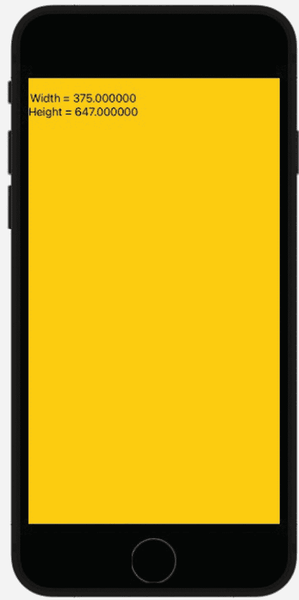

一个移动屏幕显示 `width=374.000000` 和 `height=647.000000`。

图 21-1

`GeometryReader` 在 iPhone SE 中定义的宽度和高度

1.  创建一个新的 SwiftUI iOS 应用项目，并为其指定任意名称，例如“BasicGeometryReader”。

2.  在导航器窗格中点击 `ContentView` 文件。

3.  在 `var body: some View` 内部添加一个 `GeometryReader`，如下所示：

    ```
    var body: some View {
    GeometryReader { geometry in
    }.background(Color.yellow)
    }
    ```

    `.background` 修饰符会为 `GeometryReader` 着色，使其边界易于辨认。

4.  在 `GeometryReader` 内部添加一个 `VStack`。

5.  在 `VStack` 内部添加两个 `Text` 视图，如下所示：

    ```
    var body: some View {
    GeometryReader { geometry in
    VStack {
    Text("Width = \(geometry.size.width)")
    Text("Height = \(geometry.size.height)")
    }
    }.background(Color.yellow)
    }
    ```

    整个 `ContentView` 文件应如下所示：

    ```
    import SwiftUI
    struct ContentView: View {
    var body: some View {
    GeometryReader { geometry in
    VStack {
    Text("Width = \(geometry.size.width)")
    Text("Height = \(geometry.size.height)")
    }
    }.background(Color.yellow)
    }
    }
    struct ContentView_Previews: PreviewProvider {
    static var previews: some View {
    ContentView()
    }
    }
    ```

    请注意，`geometry.size.width` 和 `geometry.size.height` 属性定义了当前 iOS 设备（如图 21-1 所示的 iPhone SE）内 `GeometryReader` 的高度和宽度。

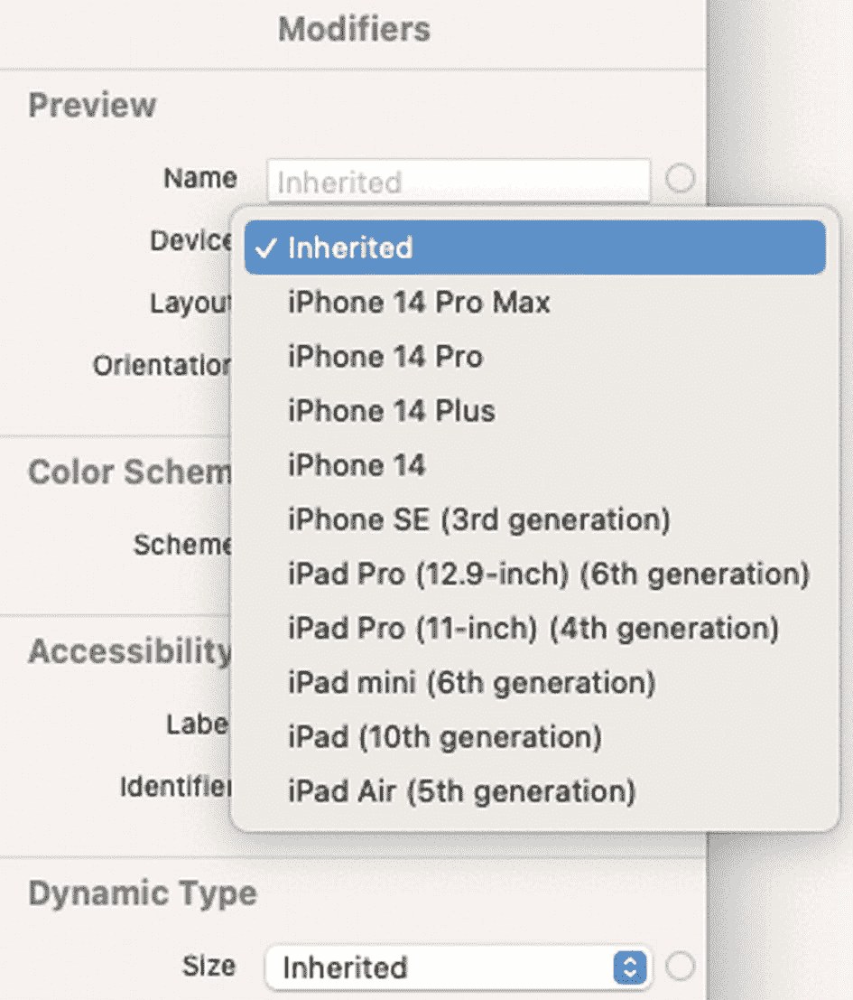

屏幕的一个片段显示了修饰符选项。它包括预览、配色方案、辅助功能和动态类型。预览包括名称、设备、布局和方向。下拉选项列出了多个选项，其中继承的选项以深色高亮显示。

图 21-2

检查器窗格中的设备弹出菜单

1.  在 `struct ContentView_Previews: PreviewProvider` 内部点击 `ContentView()`。Xcode 窗口的右侧会出现检查器窗格。

2.  点击设备弹出菜单，并选择一个不同尺寸的屏幕，例如较大或较小的 iPhone 或 iPad，如图 21-2 所示。

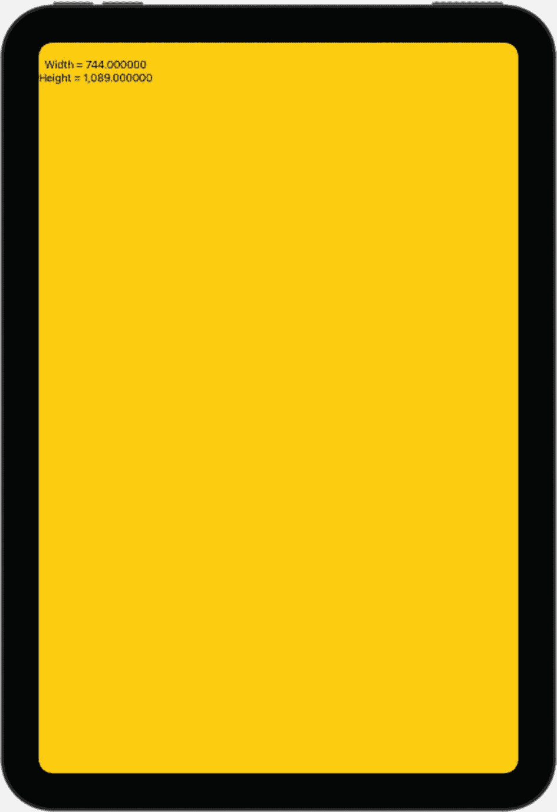

一个平板电脑屏幕显示 `width=744.000000` 和 `height=1089.000000`。

图 21-3

在不同尺寸的 iOS 屏幕中显示 `GeometryReader` 的宽度和高度

1.  选择不同尺寸的 iPhone 或 iPad。请注意，`GeometryReader` 会扩展或收缩以适配新 iOS 屏幕尺寸的边界，并显示不同的宽度和高度，如图 21-3 所示。

尝试使用不同的 iOS 设备，例如小屏幕的 iPhone 或大屏幕的 iPad。无论你选择哪种尺寸的 iOS 设备屏幕，`GeometryReader` 都能扩展或收缩，并返回其宽度和高度。


### 理解全局坐标与局部坐标的区别

当你了解 `GeometryReader` 如何伸缩以适应不同 iOS 屏幕尺寸的宽度和高度后，下一步就是理解 `GeometryReader` 的坐标系统。`GeometryReader` 内部的坐标被称为局部坐标。

另一方面，全局坐标指的是整个 iOS 屏幕。虽然不同 iOS 设备的屏幕之间全局坐标总是不同，但 `GeometryReader` 内部的局部坐标始终保持一致。

要查看局部坐标和全局坐标之间的区别，请按以下步骤操作：

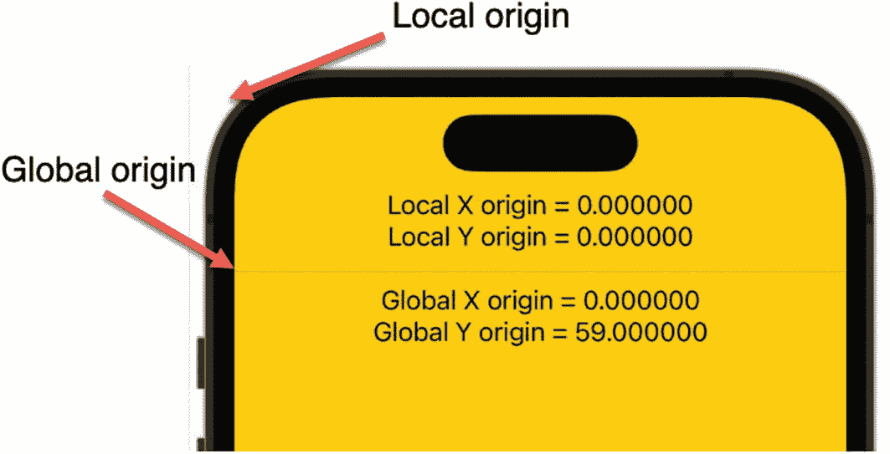

一个手机屏幕显示了局部 X 原点和 Y 原点，以及全局 X 原点和 Y 原点的值，它们分别被标记为全局原点和局部原点，数值分别为 0、0、0 和 59.0000000。

图 21-4

局部原点出现在左上角，而全局原点出现在 `GeometryReader` 的左上角

1. 新建一个 SwiftUI iOS App 项目，并为其取任意名称，例如 "GeometryReaderCoordinates"。

2. 在 Navigator 面板中点击 `ContentView` 文件。

3. 在 `var body: some View` 中添加一个 `GeometryReader`，如下所示：

```
var body: some View {
    GeometryReader { geometry in
    }.background(Color.yellow)
}
```

4. 在 `GeometryReader` 内部添加一个 `VStack`，并添加四个 `Text` 视图和一个 `Divider`，如下所示：

```
GeometryReader { geometry in
    VStack {
        Text("Local X origin = \(geometry.frame(in: .local).origin.x)")
        Text("Local Y origin = \(geometry.frame(in: .local).origin.y)")
        Divider()
        Text("Global X origin = \(geometry.frame(in: .global).origin.x)")
        Text("Global Y origin = \(geometry.frame(in: .global).origin.y)")
    }
}.background(Color.yellow)
```

首先，请注意 `Divider()` 只是在 `VStack` 中绘制一条水平线（在 `HStack` 中则是垂直线）。其次，`frame` 会返回坐标。当使用 `.local` 坐标时，`GeometryReader` 的 x 和 y 原点始终为 `(0,0)`。当使用 `.global` 坐标时，`GeometryReader` 的 x 和 y 原点基于其距离 iOS 屏幕左上角的距离而定。

整个 `ContentView` 文件应如下所示：

```
import SwiftUI
struct ContentView: View {
    var body: some View {
        GeometryReader { geometry in
            VStack {
                Text("Local X origin = \(geometry.frame(in: .local).origin.x)")
                Text("Local Y origin = \(geometry.frame(in: .local).origin.y)")
                Divider()
                Text("Global X origin = \(geometry.frame(in: .global).origin.x)")
                Text("Global Y origin = \(geometry.frame(in: .global).origin.y)")
            }
        }.background(Color.yellow)
    }
}
struct ContentView_Previews: PreviewProvider {
    static var previews: some View {
        ContentView()
    }
}
```

请注意，局部原点是 `(0,0)`，因为它起始于 iOS 屏幕的左上角。但是，全局原点显示为 `(0,59)`。这是因为 `GeometryReader` 实际上出现在 iPhone 14 Pro 机型的刘海屏下方，如图 21-4 所示。

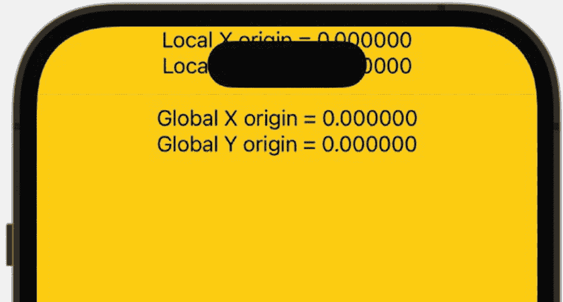

一个手机屏幕显示了局部 X 原点和 Y 原点，以及全局 X 原点和 Y 原点的值，分别为 0、0、0 和 0。

图 21-5

`.ignoresSafeArea()` 修饰符将 `GeometryReader` 推至屏幕顶部，因此局部和全局原点相同

1. 在 `.background(Color.yellow)` 修饰符之后添加一个 `.ignoreAllSafeAreas()` 修饰符，如下所示：

```
}.background(Color.yellow)
.ignoresSafeArea()
```

这会忽略刘海屏周围的区域，因此全局 y 原点现在出现在屏幕的左上角，与局部 y 原点相同，如图 21-5 所示。

1. 按如下方式编辑 `var body: some View` 内部的代码：

```
var body: some View {
    VStack {
        Text("This Text view pushes the GeometryReader down")
        HStack {
            Text("Pushes to the right")
            GeometryReader { geometry in
                VStack {
                    Text("Local X origin = \(geometry.frame(in: .local).origin.x)")
                    Text("Local Y origin = \(geometry.frame(in: .local).origin.y)")
                    Divider()
                    Text("Global X origin = \(geometry.frame(in: .global).origin.x)")
                    Text("Global Y origin = \(geometry.frame(in: .global).origin.y)")
                }
            }.background(Color.yellow)
            .ignoresSafeArea()
        }
    }
}
```

上述代码使用了一个 `VStack` 将 `GeometryReader` 向下推，然后使用了一个 `HStack` 将其向右推。请注意，`GeometryReader` 的局部原点仍然是 `(0,0)`，但全局原点不同，它是从 iOS 屏幕左上角开始测量的，如图 21-6 所示。

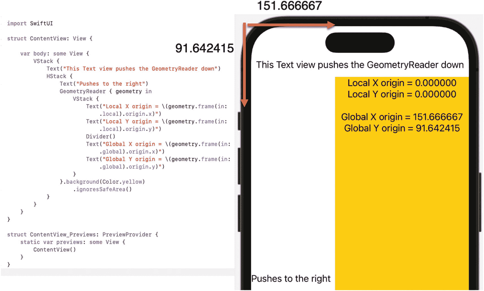

一段 SwiftUI 代码片段显示了一个手机屏幕，其中展示了局部和全局原点的值，全局 X 原点为 151.666667，全局 Y 原点为 91.642415。左侧是 30 行代码。

图 21-6

定义一个 `GeometryReader` 的全局原点


### 识别 GeometryReader 的最小值、中值和最大值

全局坐标取决于当前 iOS 屏幕的尺寸。较小 iOS 屏幕上的最大 X 和 Y 坐标，与较大 iOS 屏幕上的最大 X 和 Y 坐标是不同的。因此，使用全局坐标来定位屏幕上的视图，可能会使视图完全移出屏幕，或导致其部分被截断。

另一方面，在 `GeometryReader` 中使用局部坐标，总能自动适配不同的屏幕尺寸。由于 `GeometryReader` 的宽度或高度会随 iOS 屏幕尺寸变化，因此务必不要使用固定值，而应使用最小值和最大值。

`GeometryReader` 允许你访问以下定义的属性，如图 21-7 所示：

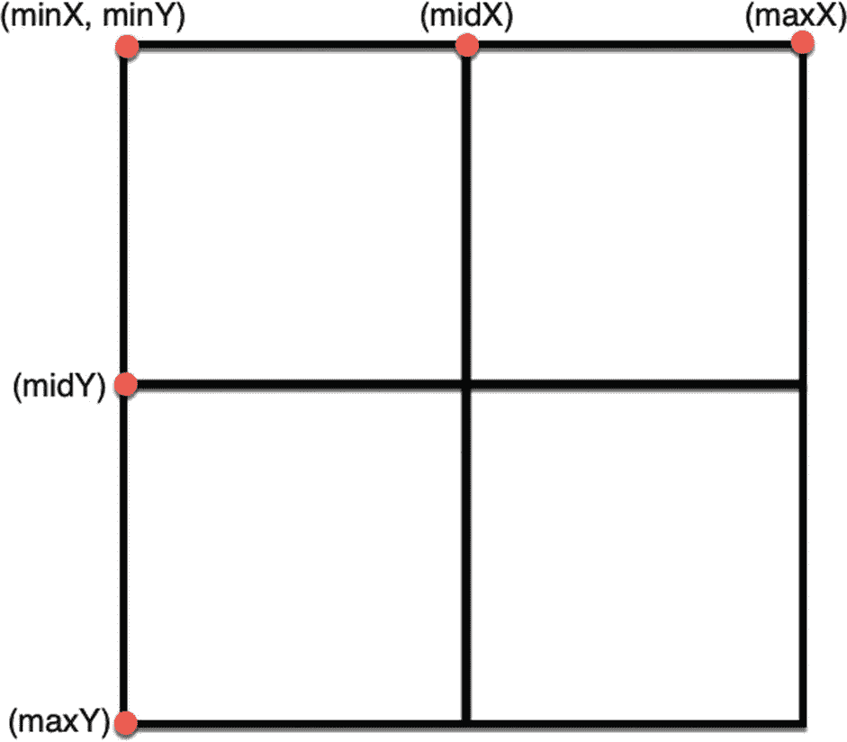

一个 2x2 的方块网格布局，其边角和边被标记为 min X、min Y、mid X、max X、mid Y 和 max Y。

图 21-7：`GeometryReader` 的最小值、中值和最大值 X 与 Y

- `minX`
- `minY`
- `midX`
- `midY`
- `maxX`
- `maxY`

要了解 `GeometryReader` 的最小值、中值和最大值 X 与 Y 是如何工作的，请按以下步骤操作：

1. 创建一个新的 SwiftUI iOS 应用项目，并为其任意命名，例如 "GeometryReaderValues"。
2. 在导航窗格中点击 `ContentView` 文件。
3. 在 `var body: some View` 内部添加一个 `GeometryReader`，如下所示：

    ```
    var body: some View {
        GeometryReader { geometry in
        }.background(Color.yellow)
    }
    ```

4. 在 `GeometryReader` 内部添加一个 `VStack`，并添加六个 `Text` 视图和一个 `Divider`，如下所示：

    ```
    var body: some View {
        GeometryReader { geometry in
            VStack {
                Text("minX = \(geometry.frame(in: .local).minX)")
                Text("midX = \(geometry.frame(in: .local).midX)")
                Text("maxX = \(geometry.frame(in: .local).maxX)")
                Divider()
                Text("minY = \(geometry.frame(in: .local).minY)")
                Text("midY = \(geometry.frame(in: .local).midY)")
                Text("maxY = \(geometry.frame(in: .local).maxY)")
            }
        }.background(Color.yellow)
    }
    ```

   整个 `ContentView` 文件应该如下所示：

    ```
    import SwiftUI
    struct ContentView: View {
        var body: some View {
            GeometryReader { geometry in
                VStack {
                    Text("minX = \(geometry.frame(in: .local).minX)")
                    Text("midX = \(geometry.frame(in: .local).midX)")
                    Text("maxX = \(geometry.frame(in: .local).maxX)")
                    Divider()
                    Text("minY = \(geometry.frame(in: .local).minY)")
                    Text("midY = \(geometry.frame(in: .local).midY)")
                    Text("maxY = \(geometry.frame(in: .local).maxY)")
                }
            }.background(Color.yellow)
        }
    }
    struct ContentView_Previews: PreviewProvider {
        static var previews: some View {
            ContentView()
        }
    }
    ```

   请注意，`maxX` 和 `maxY` 属性只是测量 `GeometryReader` 宽度和高度的一种不同方式。

5. 在 `struct ContentView_Previews: PreviewProvider` 内部点击 `ContentView()`。检查器窗格会出现在 Xcode 窗口的右侧。
6. 点击设备弹出菜单，选择一个不同尺寸的屏幕，例如更大或更小的 iPhone 或 iPad（见图 21-2）。
7. 选择一个不同尺寸的 iPhone 或 iPad。注意 `GeometryReader` 会相应地扩展或收缩以适应新 iOS 屏幕的边界，并显示不同的 `maxX` 和 `maxY` 值。

## 总结

`GeometryReader` 是一个独特的容器，它可以容纳多个视图。通过使用 `GeometryReader` 的局部坐标，你可以在用户界面上放置不同的视图，这些视图能够自动适配不同的 iOS 屏幕尺寸。

`GeometryReader` 可以扩展以填充整个屏幕，也可以与堆栈中的其他视图共享一个屏幕。识别 `GeometryReader` 宽度和高度的两种方法是：检索 `size.height` 和 `size.width` 属性，或者检索 `maxX` 和 `maxY` 属性。

通过在 `GeometryReader` 内使用局部坐标，无论 `GeometryReader` 出现在哪里，你都知道原点 (0,0) 位于 `GeometryReader` 的左上角。通过使用全局坐标，你始终知道原点 (0,0) 位于屏幕的左上角。

`GeometryReader` 只是使用特定的 X 和 Y 坐标在屏幕上定位不同视图的又一种方法。


# 排版后的文本

## A

-   `.accentColor` 修饰符
-   **警告框 / 操作列表**：按钮响应式创建，显示消息、多个按钮，显示/响应属性，`TextFields` 显示
-   **与运算符**
-   **角度渐变**
-   **动画**：延迟/持续时间，`.interpolatingSpring`，移动视图，选项，`rotationEffect`，值缩放，类型，视图，工作原理
-   **Apple TV (tvOS)**
-   **Apple Watch (watchOS)**
-   **面积图**
-   `.aspectRatio` 修饰符

## B

-   `backgroundColor` 属性
-   `@Binding` 变量
-   **分支语句**：布尔运算符，布尔变量，命令，`if` 语句，`switch`
-   **Browncat**
-   **按钮**：创建，`Image` 视图，`Label` 视图，修改外观，运行代码，存储代码，用户界面视图，`Text` 视图

## C

-   **图表**：面积图，条形图，创建，颜色
-   `ContentView` 文件：循环/数组，数值，`RuleMark`，显示平均值，堆叠条形图
-   **定义**：框架，线条标记/轴，识别点，矩形，类型
-   **类/面向对象编程**：封装，特性，继承，方法，多态，属性
-   `.clipShape` 修饰符
-   **colorMe**
-   **颜色选择器**
-   `.contentType` 修饰符
-   **上下文菜单**：定义，示例，隐藏多个选项，Swift 代码

## D

-   **数据结构**：枚举，存储数据，数组，字典，结构体，元组，类型
-   **日期选择器**：日期范围，限制，日期/时间显示，日期/时间格式化，日期状态变量，样式
-   `.datePickerStyle()` 修饰符
-   `.disabled` 修饰符
-   **公开组**：外观，可折叠列表，描述文本，创建，展开，`DisclosureGroup` 两种状态，视图
-   **拖拽手势**

## E

-   **封装**
-   `@EnvironmentObject` 变量

## F

-   `.foregroundColor` 修饰符
-   **表单**：创建简单表单，禁用视图，划分为区段，分组视图，用户界面，纸张，典型部分

## G

-   **GeometryReader**：代码，定义，检查器窗格，iOS 屏幕，iPhone SE，本地/全局坐标，差异，最小/最大值，检索大小，屏幕尺寸，工作原理
-   `.gesture` 修饰符
-   **GridRow**
-   **网格**：数据水平/垂直，`.fixed` 选项，`GridRow`，创建表格，水平/垂直网格项，`Lazy`，多行/列，行与列之间的间距
-   **分组框**：外观，应用的用户界面，*vs.* 表单，多个视图，显示，使用

## H

-   `.highPriorityGesture` 修饰符

## I, J

-   `.ignoreAllSafeAreas()` 修饰符
-   `.ignoresSafeArea()` 修饰符
-   **图像**：显示图标/图形文件，为图像添加阴影，宽高比，图像边框，剪贴画图像，修饰符，不透明度，SF Symbol 图标，图标形状，显示，着色，常见几何形状，渐变，着色形状，阴影
-   `.indexViewStyle` 修饰符
-   `.interpolatingSpring` 修饰符
-   **iOS 编程**：创建应用，设备模拟，更改外观，固定值，框架，部分，软件框架，SwiftUI，在设备间切换，用户界面对象，Xcode，Xcode 窗格，iPhone/iPad

## K

-   `.keyboardType` 修饰符

## L

-   **标签视图**
-   **“懒”网格**：`LazyHGrid`/`LazyVGrid`
-   **线性渐变**
-   **折线图**
-   **行数限制修饰符**
-   **链接**：按钮，`ShareLink`，URL，网站地址
-   `.listRowSeparatorTint` 修饰符
-   **列表，显示**：添加行分隔符，交替颜色，数组数据，结构体数组，创建组，`ForEach` 循环，搜索列表，滑动手势，列表附加选项，自定义滑动操作，删除项，移动项，上/下滑动，文本视图
-   **循环语句**：定义，`for` 循环，`repeat` 循环，`while` 循环

## M

-   **Macintosh (macOS)**
-   **放大手势**
-   **菜单**：添加子菜单，按钮，`Buttons`，调用函数，显示选项列表，格式化标题，`Label` 视图，选项列表，参数，参数列表，`Message`
-   `move()` 方法
-   **多日期选择器**：`ContentView` 文件，`DateComponents`，`DateFormatter`，状态变量，样式
-   `myDictionary.count` 命令

## N

-   `.navigationBarTitleDisplayMode` 修饰符
-   `.navigationDestination` 修饰符
-   **NavigationLink**
-   **导航堆栈**：添加按钮，`ContentView` 文件，显示视图，在结构体间更改数据，选择文件，在结构体间传递数据，在结构体间共享数据，用户界面屏幕，iOS 应用，列表，多个视图，`NavigationLink`，`ObservableObjects`，设置，标题
-   `.navigationTitle` 修饰符
-   `newList()` 函数
-   **非运算符**

## O

-   **Objective-C**
-   `.offset` 修饰符
-   `.onChanged` 修饰符
-   `.onChange` 修饰符
-   `.onDelete` 修饰符
-   `.onEnded` 修饰符
-   `.onTapGesture` 修饰符
-   **不透明度**
-   **或运算符**
-   **大纲组**：分类，类的属性，定义关系，可识别，多个公开组，`name` 属性，对象，子类别项，使用

## P, Q

-   **内边距修饰符**
-   **选择器**：`Color Picker`，颜色/日期，选择，日期显示选项，双值，枚举，`MultiDatePicker`，多个 `Text` 视图，视图样式，工作
-   `.pickerStyle` 修饰符
-   **选择器视图**
-   **捏合手势**
-   **放置视图，用户界面**：对齐视图，堆叠方法，`offset`/`position` 修饰符，`padding` 修饰符，`Spacer`，堆叠间距
-   `.plain` 修饰符
-   **点状图**
-   **多态**
-   `.position` 修饰符

## R

-   **径向渐变**
-   **RectangleChart**
-   **红、绿、蓝 (RGB)**
-   `.resizable()` 修饰符
-   `reversed()` 方法
-   `rollDice()` 函数
-   `.rotationEffect` 修饰符
-   **旋转手势**

## S

-   `.scaleEffect` 修饰符
-   `.scaleToFit`/`.scaleToFill` 修饰符
-   `.scrollTo` 命令
-   **滚动视图**：水平视图，多个视图，滚动指示器，特定位置，跳转，`VStack`，工作
-   **安全文本输入框**
-   **分段控件**：完整用户界面，`ForEach` 循环，使用多个按钮，多个 `Text` 视图，`Picker` 视图，运行代码，`Text` 视图
-   **SF Symbols 应用**
-   `ShareLink`：`ContentView` 文件，自定义文本，默认外观，分享表单，显示，`TextField`，工作
-   `.simultaneousGesture` 修饰符
-   **滑块**：更改颜色，递增/递减，最小/最大值，标签，数值范围，工作
-   **间隔器**
-   **空间点按手势**
-   **堆叠**
-   `@State` 关键字
-   `@StateObject` 变量
-   **步进器**：`ContentView` 文件，定义有效范围，递增/递减值，值，用户，工作
-   `.submitLabel` 修饰符
-   **Swift**：命令，注释，函数，数学/字符串运算符，playground 模板，存储数据，数据类型，示例，限制，可选数据类型，`print` 语句，运行按钮，变量声明，Xcode 颜色
-   **SwiftUI**：`systemName` 参数

## T

-   `.tabItem` 修饰符
-   **标签视图**：创建颜色，显示分页视图，显示图标/文本，图标，跳转到屏幕，更多按钮，多个视图，选择按钮，结构体，显示，在结构体间更改数据，分页视图，在结构体间传递数据，在结构体间共享数据，用户界面视图，文本/图像视图
-   `.tag` 修饰符
-   **点按手势**
-   **文本**：检索用户文本，请参阅 `TextField`
-   `.textContentType` 修饰符
-   **文本编辑器**
-   **文本输入框**：自动更正，更改样式，不同虚拟键盘，水平/垂直扩展，占位文本，`SecureField`，创建，文本内容，`Text Editor`，虚拟键盘，解除
-   **文本视图**：为文本添加边框，更改外观，对齐，选择标准颜色，字号选项，字重选项，`Label` 视图，长度，`line limit` 修饰符，字符串截断
-   **切换开关**：设置，iPhone/iPad，`settingValue`，典型用法，工作
-   `.toggle()` 命令
-   **触摸手势**：检测，拖拽，整个堆栈，修改，高优先级，长按，放大，优先级/同时，旋转，同时，点按，类型，`VStack`，创建
-   `truncationMode` 修饰符

## U

-   **用户界面，SwiftUI**：画布窗格，拖放，`ContentView` 结构，创建界面，编辑器窗格，检查器窗格，修饰符，库窗口，`Live Preview`，堆叠，`Toggle` 视图，Xcode 显示

## V, W

-   **垂直堆叠 (VStack)**

## X, Y, Z

-   **Xcode**：设计用户界面，组织文件夹，项目，选择模板，`ContentView`，`ContentView_Previews`，编辑器/画布窗格，导航器窗格，组织，名称/组织标识符，欢迎屏幕
