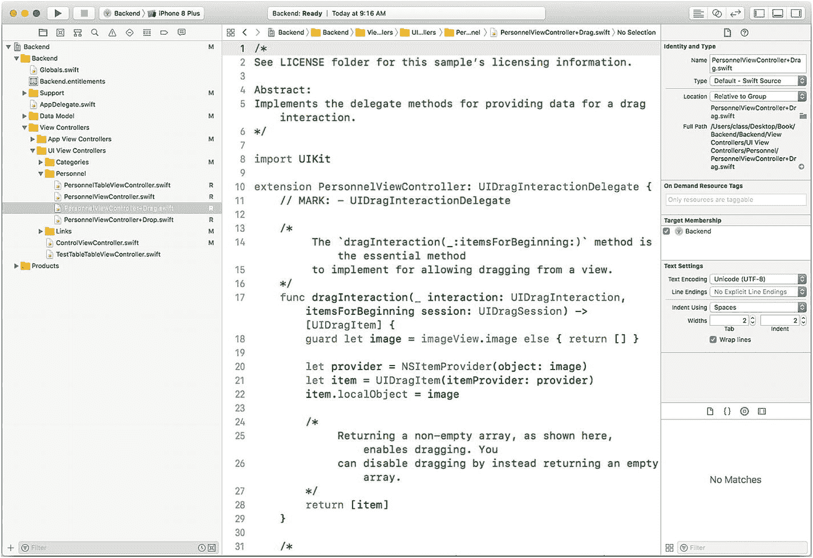
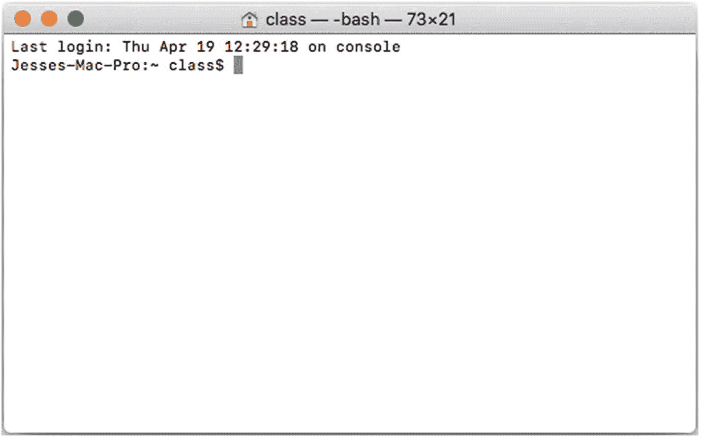
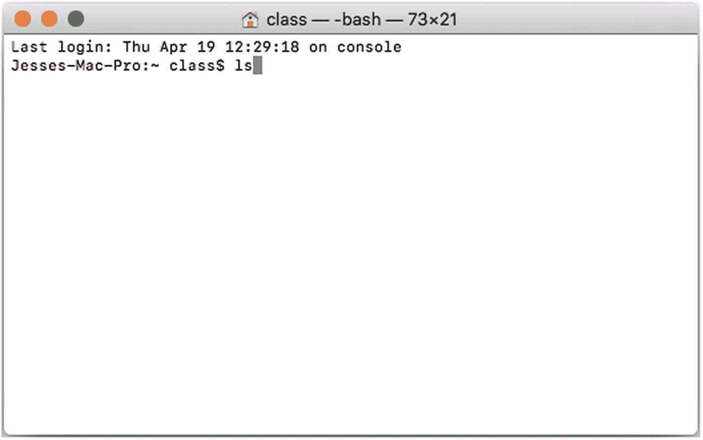
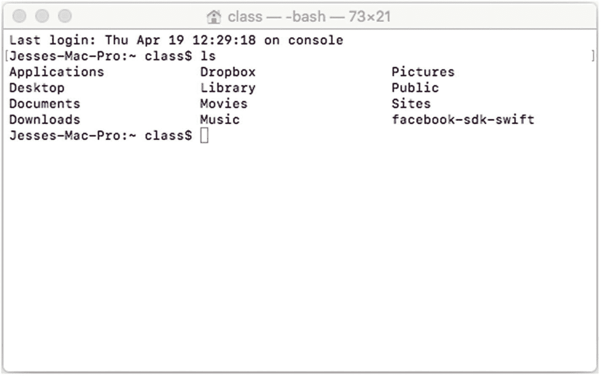
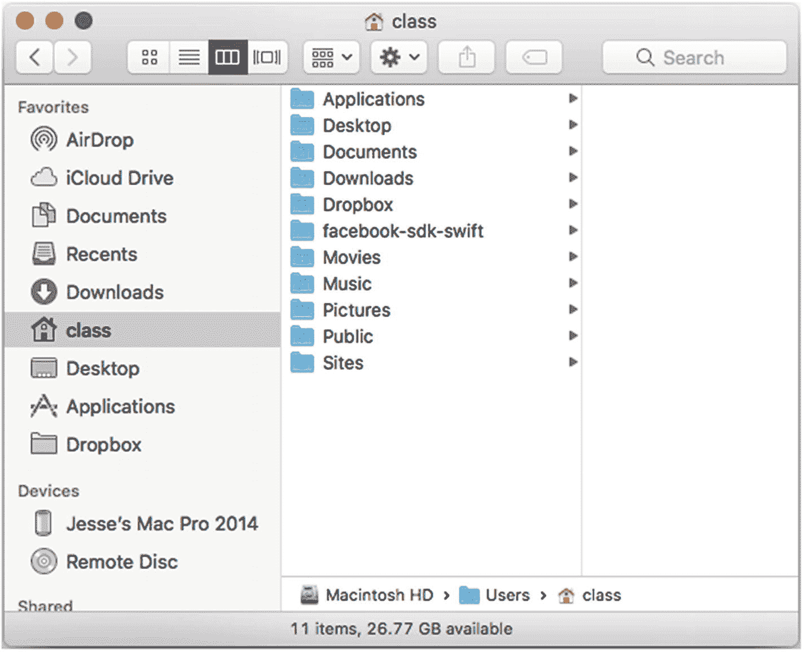

# 第一部分 用 Swift 构建复合型应用

## 1. 构建模块：项目、工作区、扩展、委托与框架

如今构建应用，核心并非编写代码。你可能在学校或速成训练营学过如何写代码，这些经历对于学习编程原理非常有价值。然而，当你开始第一份编程工作时，可能会发现，你的任务只是修正某个现有应用生成的报告中标题的拼写错误。这项简单工作可以拆分为两部分。

首先，找到拼写错误的位置（一个基础应用很容易就有数千行代码——`Windows` 据估计有 5000 万行）。在一行代码中找到拼写错误可能用不了多久，但首先找到那行代码需要多长时间？

其次，修正拼写错误。

一个月后，当你完成了修改标题拼写错误的任务，你可能会发现自己实际上在构建一个应用。这项工作同样可以分解为几个组成部分。

首先，实现用户身份验证流程。你可以使用 `Facebook API` 或来自可信网络来源的开源代码来完成。你只需要找到代码或 API，然后将其集成到你的应用中。

其次，你需要实现认证完成后应用的核心功能。根据应用的具体情况，你可能需要从头编写，但更可能的情况是，你会在类似项目的现有代码基础上进行修改。

第三，你可能需要将新应用移植到不同的平台。

如今的编码工作，常常涉及阅读、理解现有代码，然后将其复用到新的应用和新的组合中。是的，确实有大量从零开始的编码工作，但在开发领域，对现有代码的重用也同样普遍。

多种因素共同作用，创造并支撑了这样一个可重用和可改造代码的世界，而这背后凝聚了无数人无数小时的辛勤努力。重用分析与代码，与重用和回收自然资源同样重要。就代码而言，重用意味着不重复发明轮子。每次创建应用时，如果不必从零开始，整个软件开发世界就能向前迈进。

本章将概述这个可重用代码世界如何运作——尤其是从 iOS、tvOS、macOS 和 watchOS 的角度。你将了解可重用代码构建模块的概览，以及如何使用 `Xcode` 和 Apple 开发者标准工具包中的其他工具将它们组合在一起。本章分为三个部分：

*   **组件架构概述**：让你了解如何从组件构建应用。
*   **iOS 与 macOS 构建模块概览**：提供这些模块的总体介绍。
*   **用构建模块进行构建**：概述如何将它们组合起来。

### 组件架构概述

自 20 世纪 40 年代计算机时代开始以来，就一直存在等待完成的项目积压。（随着互联网的兴起，也出现了相应的积压。）对软件的需求似乎永无止境。各种策略应运而生，而**组件**是其中许多策略的关键部分，无论是对于 Web 还是通用软件而言。

其核心理念是，完全从零开始构建网站、程序和应用是一种不可持续的模式。必须找到某种方式来加速开发——通过重用已经编写并调试过的代码。但这个简单想法的问题在于，代码很难被轻松重用——总是需要修改。

为了加速开发进程而重用代码的一种方法是，提取现有代码的关键函数和特性。这些元素比整个代码库更容易重用。这就是组件化软件开发的起点。

随着时间的推移，这些可重用提取物开始以两种不同的方式被使用：

*   **使用框架或外壳**：在这种模型中，有一个框架，你可以将组件插入其中。

    框架模式在 20 世纪 90 年代非常流行；IBM 的 `SOM`（软件对象模型）是首批框架之一。微软通过 `OLE`（对象链接与嵌入）和 `COM`（组件对象模型）进入了组件软件领域。由 Apple、IBM 和 WordPerfect 组成的联盟则致力于 `OpenDoc`。所有这些框架都允许你将专用组件插入其中（从用户角度看，大多数是你可以插入组件的文档）。

*   **用组件构建产品**：在这种模型中，你将多个可重用组件（现成的或为项目专门编写的）组合成单一产品。通常没有作为外壳的框架或容器；在某些项目中确实存在这样的顶层容器或外壳，但它可能是为每个项目专门创建的。

无论你采用哪种组件模型，一旦开始考虑组件，就会出现一个关键问题：你将使用什么语言？在当今世界，iOS（和 macOS）的语言是 `Swift` 和 `Objective-C`。然而，组件架构的一个特点是，在某些情况下你可以混合使用不同的语言，正如你将在本章稍后的“命令行集成”部分看到的那样。


### 审视 iOS 与 macOS 的构建模块

本部分介绍的构建模块均采用 Swift 和 Objective-C 语言为 iOS 与 macOS 构建，并使用了诸如 iOS 的 `UIKit` 和 macOS 的 `AppKit` 及其配套 API。本节将对这些构建模块进行简要概述；更多信息请查阅 `developer.apple.com`。

#### 扩展

Swift 中的扩展让你能为现有类、结构体、枚举或协议类型添加功能。你可以在 `developer.apple.com` 上的 *在自定义视图中采用拖放* 示例代码中找到一个例子。拖放功能在协议中定义（关于协议和委托的更多信息，请参见下一节），并在扩展中实现。

在图 1-1 中，你可以看到一个使用了 *在自定义视图中采用拖放* 示例代码的应用。在这个例子中，基类是一个自定义视图控制器（`PersonnelViewController`）。定义了一个扩展如下：

```
extension PersonnelViewController: UIDragInteractionDelegate {
```

每个扩展都位于一个引用基类（即要被扩展的类）的文件中。如图 1-1 所示，这些文件的名称是：



图 1-1
在 Swift 类中使用扩展

```
PersonnelViewController+Drag
PersonnelViewController+Drop
```

在运行时，你可以像引用类的元素一样来引用扩展中的函数和其他成员。

扩展可以添加到那些你仅有 API 而无源码的基类和其他结构体中。

#### 委托与协议

委托和协议协同工作。在类或其他结构体的声明中，你会看到声明中的超类（如果有的话），如下面这个 iOS 中 `UIDocument` 子类的声明所示：

```
class MyDocument: UIDocument {
```

协议可以定义一系列函数，这些函数将在任何遵循该协议的类中实现。与扩展添加到基类不同，协议定义了*你*将要添加到基类中的代码。

委托通常与协议配合使用，使得协议代码的实现不被放置到基类中；相反，它被放置在一个名为*委托*的单独文件中。实现该协议的具体文件通常被分配给基类中一个名为 *delegate* 的字段。

#### 框架

如果你经常使用 iOS 或 macOS，你很可能已经熟悉了基本框架，例如 `AppKit`（macOS）和 `UIKit`（iOS），以及一些较小的框架如 `AddressBook`。框架可以包含函数和属性。你可以通过 `import` 语句将它们添加到 Swift 项目中；在使用 Objective-C 时，你可以使用 `#import` 或 `#include` 语句。（在 Objective-C 中，`#import` 指令会导入框架一次；而 `#include` 可能会导入多次。）

### 利用构建模块进行开发

你可以在 Xcode 项目中使用委托、协议、扩展和框架。你可以通过工作区来组合多个项目，也可以使用其他工具来组合多个组件。本节将同时介绍工作区以及构建模块的组合方式。

#### 使用工作区

通过工作区，Xcode 会负责管理构建你希望构建的工作区内的任意目标。各个目标可以共享工作区中的元素，并根据需要将它们用于构建不同的目标（例如，使用同一个工作区构建 iOS 和 watchOS 的目标）。

#### 组合使用构建模块进行开发

来自 Apple 的构建模块（框架、协议、委托以及扩展）通常提供了一种简洁而优雅的方式来扩展和深化你的代码。然而，在某些情况下，单个功能需要同时使用多个构建模块——例如，某个功能可能需要安装一个非常庞大的框架，以及十几个较小的（但相关的）框架。协议和委托如今在许多结构中已司空见惯，而扩展也同样可能被加入到组合中。因此，使用共享代码来实现新功能可能需要在你的代码库中进行大量添加。

需要向应用添加多个构建模块的情况很常见，而且可能难以管理。有几种工具可以帮助你管理此类组合。这些工具使用一种结构来组织对应用的修改，以便脚本或其他工具能够在正确的位置和正确的顺序下应用这些修改。其中最广泛使用的工具之一是 `CocoaPods`，这是第 2 章的主题。

如今，GitHub 已成为使用最广泛的代码共享工具和网站，并且它与大多数包管理器集成在一起。因此，当你运行包管理器时，系统会自动为你下载复杂构建模块的最新 GitHub 版本。

像 `CocoaPods` 这样的包管理器会使用自己的代码和脚本来执行集成。为此，它们——以及你——必须使用一些命令行代码。如果你习惯了 macOS 和 Finder，你可能不经常使用命令行。别担心——这些产品隐藏了大部分语法细节。不过，对于确实需要从命令行访问文件或文件夹的情况，以下部分将提供一些技巧。


### 命令行集成

`终端`是 macOS 系统自动安装的应用程序，它为您提供了访问命令行的途径。启动后，您将看到图 1-2 所示的基本界面。



图 1-2

使用`终端`访问命令行。

第一行显示上次登录的日期和时间。第二行可以看到您正在使用的电脑名称。随后会显示当前运行的用户标识符，并以`$`等符号标记自动生成文本的结尾。您可以在该符号之后输入命令。

##### 注意

您可以自定义`终端`中文本行的格式。

在图 1-3 中，可以看到输入到`终端`的第一个命令。它是列表命令（代码为`ls`）。



图 1-3

输入`ls`命令。

在命令行界面中，您每次只能处理一行。无法复制或粘贴到之前的代码行，但可以在正在编辑的行中使用退格键。以回车键结束该行后，命令即会被执行。

`ls`命令的结果会显示在`终端`窗口中，如图 1-4 所示。



图 1-4

`终端`中`ls`命令的执行结果。

如果您在访达中查看同一目录，会看到如图 1-5 所示的数据。文件的排列顺序可能不同，但这无关紧要。同样需要注意的是，某些在访达中通常不可见的文件可能会在`终端`中显示出来。



图 1-5

访达中的文件。

在使用`终端`时，您可能还需要用到另一个命令：输入`cd`可以切换当前所在的目录。然后您可以输入要进入的目录名称，也可以从访达中拖拽一个目录放到您已输入`cd`的`终端`命令行上。该目录的文本形式路径会被填入`终端`代码行中。按下回车键后，目录即会切换。

### 总结

Xcode 提供了多种工具（可与 Objective-C 和 Swift 配合使用），帮助您通过可重用代码构建复杂应用，从而节省开发和调试时间。本章为入门提供了简要概述。

如需更多信息，请使用标准的在线资源以及`developer.apple.com`上的讨论板。现在，我们开始介绍包管理器。

