# 使用 CocoaPods

CocoaPods 是一个用于管理 Xcode 项目中多个组件的工具。基本流程是：您照常创建 Xcode 项目，然后运行 CocoaPods 将您的 Xcode 项目放入它创建的新工作区中。在工作区中，您的项目旁边会排列着各种您希望安装的更新版 CocoaPods。

CocoaPods 可以从 GitHub 仓库按需下载更新，因此您无需自己操心。CocoaPods 工具会为您维护这些公共更新的版本，但如果您不需要或不想共享，也可以创建自己的私有仓库。

您需要负责管理一个`podfile`，该文件指明了要安装的更新内容。`podfile`是您的原始项目与您安装的更新（CocoaPods 可按需重新安装这些更新）之间的纽带。

本章将快速概述 CocoaPods 的流程，并配有大量分步图解。更多信息请访问 CocoaPods 网站及文档 [`cocoapods.org`](http://cocoapods.org)。如需更具体的信息，请参阅本书中的 Facebook 和 RxSwift 章节；Facebook 和 RxSwift 都是通过 CocoaPods 安装的。

### 安装 CocoaPods

这是一项在开发电脑上只需执行一次的任务。启动`终端`进入命令行。使用以下命令安装 CocoaPods：

```
sudo gem install cocoapods
```

您需要提供系统密码。网站上提供了其他安装 CocoaPods 的方法，但这是对大多数人来说最直接的方式。

在命令行中输入以下命令完成设置：

```
pod setup
```

您将看到一些状态信息，最终显示：

```
Setup completed
```

现在即可继续后续操作。


### 创建简单应用（单视图应用）

你的 CocoaPods 项目将包含三个部分：

-   像往常一样创建初始 Xcode 项目。
-   创建 Podfile 来管理更新并将其链接到你的项目。
-   更新 Podfile 以在项目中安装更新和新功能。

图 2-1 展示了在 Xcode 中创建的最简单内置项目之一：单视图应用。

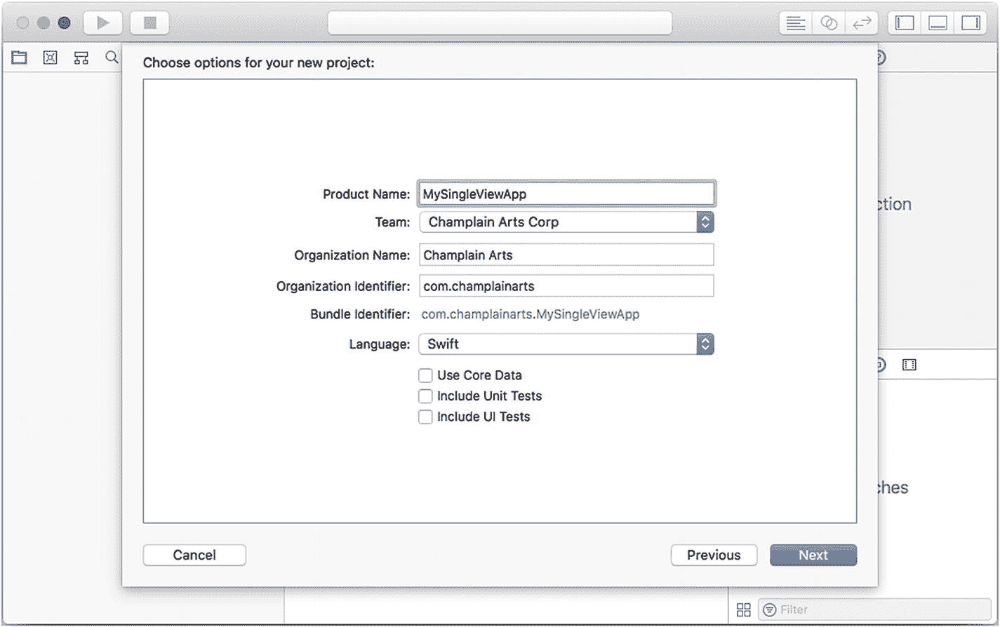

图 2-1
创建新项目

在生成项目文件时，你需要指定存放它们的文件夹。你可以创建一个新文件夹，如图 2-2 所示。

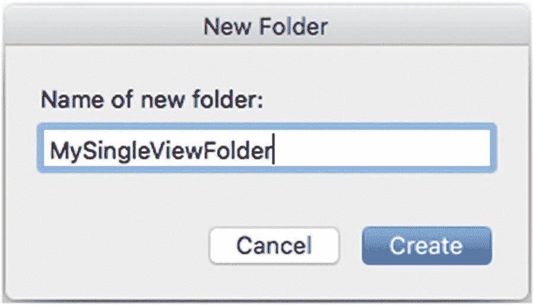

图 2-2
将其放入文件夹中

从模板创建任何新项目后，请测试其能否在 Xcode 中通过设备或模拟器正常构建，如图 2-3 所示。你可以使用“Product ➤ Build”或窗口左上角的箭头（Xcode 文档和帮助中描述了其他方法）。

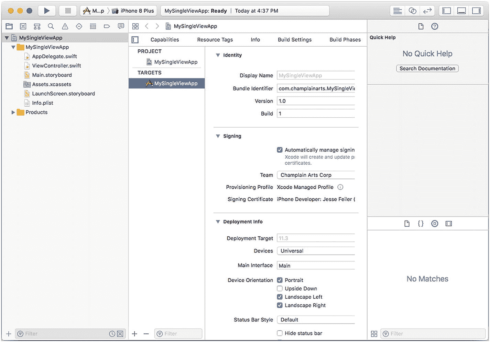

图 2-3
检查项目

在设备或模拟器上检查结果，如图 2-4 所示。

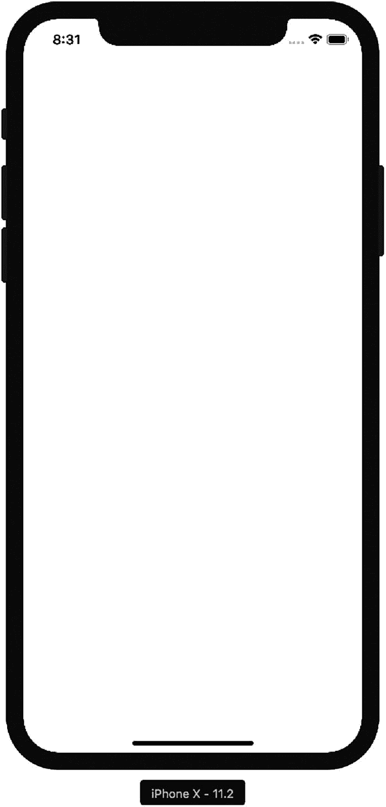

图 2-4
运行应用

在终端中使用命令行，将目录更改为你在图 2-2 中指定或创建的文件夹（记住，你可以输入 `cd` 并加一个空格，然后将文件夹拖入终端窗口，无需键入完整路径名）。图 2-5 展示了以这种方式生成的 `cd` 命令。

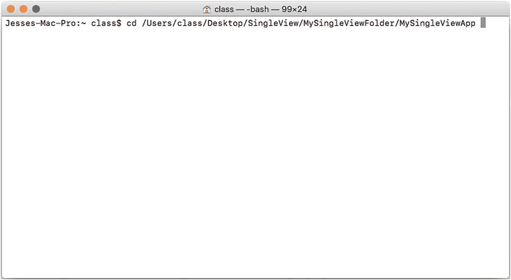

图 2-5
将命令行切换到项目目录

使用列表（`ls`）命令，检查你切换到的文件夹是否确实包含 `xcodeproj` 文件以及 Xcode 模板中创建的源代码文件夹，如图 2-6 所示。

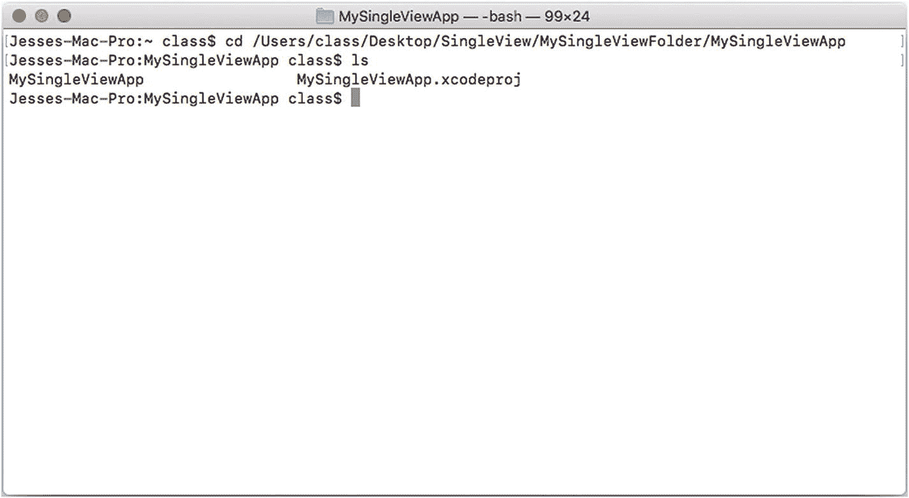

图 2-6
检查目录

在图 2-6 所示的目录的命令行中输入 `pod init` 命令。这会将一个 Podfile 添加到你的目录中，如图 2-7 所示。

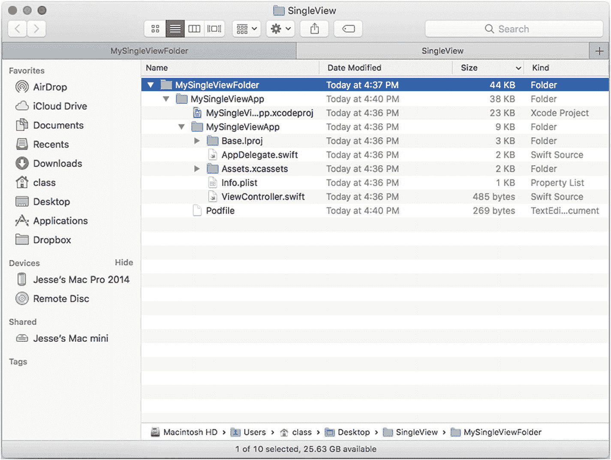

图 2-7
添加 Podfile

你现在可以查看 Podfile，如图 2-8 所示。如果在 Finder 中双击它，TextEdit 将自动打开。你也可以使用 BBEdit 等工具。

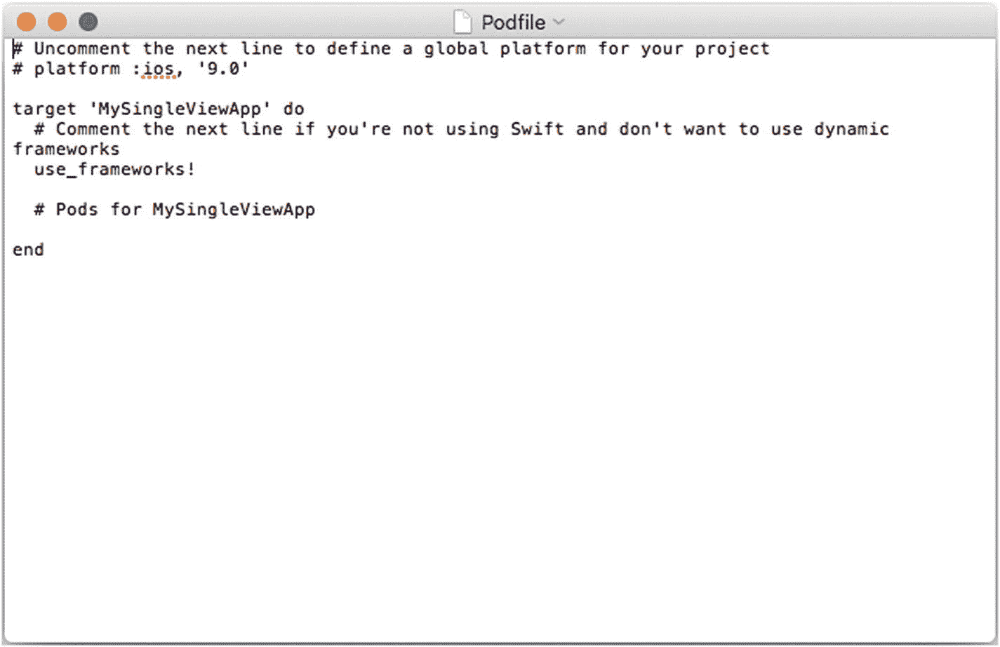

图 2-8
检查 Podfile

从图 2-5 所示的目录运行 `podInstall` 命令。

你现在无需对文件进行更改，但随着开发的继续，你将更新 Podfile 以添加可能需要的新组件。每当更改 Podfile 时，必须随后运行 `pod install` 命令。

如图 2-9 中的消息所示，目前还没有要安装的依赖项。但重要的是，从现在开始，你应该打开刚刚创建的工作区，而不是项目本身。关闭 Xcode 并查看项目文件夹。文件结构现在显示一个工作区和一个用于 Pod 的新项目，如图 2-10 所示。

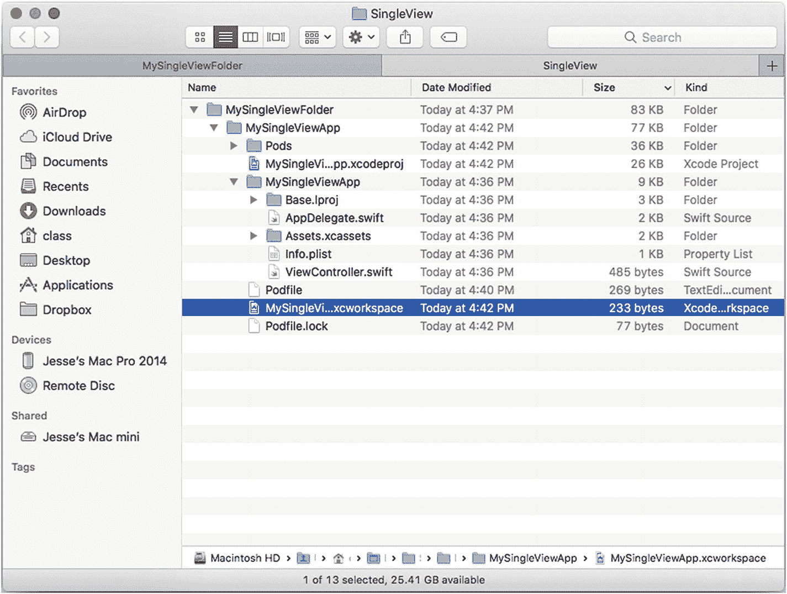

图 2-10
已创建包含 Pod 的工作区窗口

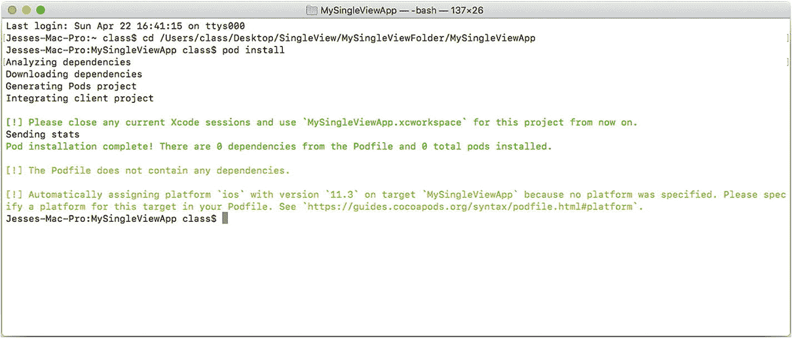

图 2-9
安装与初始化

如果你习惯在分栏视图中查看文件，可以在 Finder 中更改设置，此时你将看到如图 2-11 所示的文件。

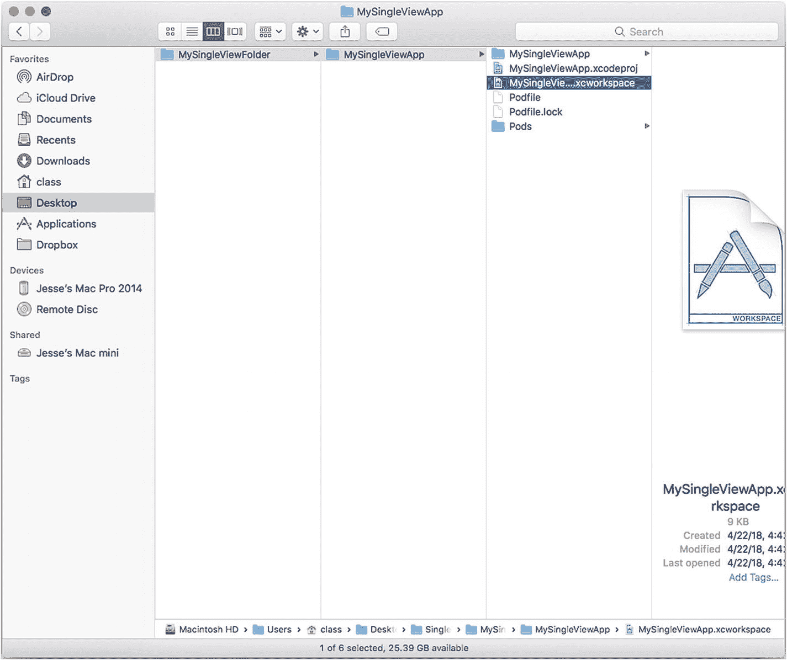

图 2-11
在分栏视图中检查工作区文件

再次构建你的项目，你将看到 Pod 代码和原始代码合并在一起，如图 2-12 所示。

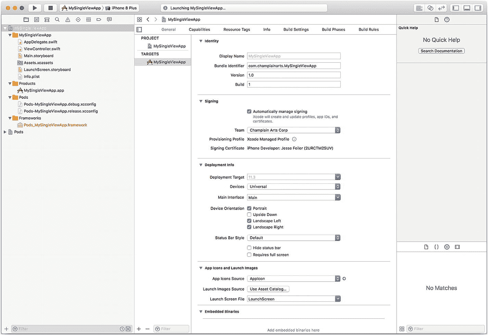

图 2-12
使用添加的 Podfile 构建项目

### 总结

CocoaPods 是一个用于分发众多组件和组件集的工具，这些组件公开存储在 GitHub 上。本章概述了如何使用此工具。现在，是时候进入另一个你将频繁使用的组件了：文件的 JSON 格式。

