# 第二部分 在 Swift 和 iOS 中使用可编码数据

## 3. 读写 JSON 数据

本书讨论的构建块几乎都提供了在应用之间、通常跨平台共享*功能*的方法，例如 Facebook、Amazon Web Services 和响应式编程。本书的这一部分有所不同，因为它侧重于让你能够在应用之间、通常跨平台共享*数据*的组件和构建块。

本章将重点介绍 JSON 的具体细节，JSON 是跨应用和平台共享数据最广泛使用的技术之一。


### 识别需要共享的数据

应用程序既包含功能也包含数据。你可能会认为某个特定应用内部没有数据（比如一款用户通过输入走法或数据进行游玩的游戏），但即便是这种简单情况也是错误的。每个应用都包含元数据——它在应用商店中的名称、分类和描述，以及来自应用商店的相关销售数据记录。尽管这些数据由应用商店和你（作为开发者）管理，但它仍然是应用整体数据的一部分。此外，还有一些与应用相关的数据通常会被放在你的网站上。

我们通常认为是应用组成部分的数据，是内置于应用本身的数据：代码、故事板、以及基于应用的文档和说明。此外，还有一些可能被存储的数据，例如游戏中的走法记录、最高分和最低分，以及其他在用户使用应用过程中积累的数据。这就是我们通常考虑数据共享时所想到的数据。

关于数据共享，有两种类型需要你考虑：

-   **跨应用共享。** 你可能需要在应用之间共享数据。一个简单的例子是，你使用 iPhone 上内置的相机应用拍摄了一张照片。然后你可能将其与“照片”或“文件”应用共享，以便将照片整理到相册中并与他人分享。你还可以从“照片”中以另一种格式（可能是 GIF 而非 JPEG）导出该图片，用于文档或网站。就这样，共享的照片可能会辗转经过你的好几个应用（如果你把文档发给朋友，还会经过其他人的应用）。

-   **跨时间共享。** 当你在玩游戏、写文章或制作电影时，你常常想暂停并保存进度，以便日后继续。这就要求你能够跨时间共享数据。请记住，当应用运行时，其数据存储在内存中，而非持久存储（如磁盘）中。内存是一种稀缺资源，所以当你决定去做其他事情而不是继续玩游戏、写文章或制作电影时，就需要重用内存。数据需要被复制到某种持久存储中，以便在你稍后重新开始游戏或项目时能够重新加载。

需要提醒你的是，许多数据共享同时属于这两种类型：既跨应用又跨时间。进一步考虑，请记住，当你在应用之间共享数据时，也可能是在设备之间共享（从你 iPhone 上的相机到 Mac 上的 Keynote，再到你的同事在 PC 上使用的 Photoshop）。

### 考虑共享数据的安全性

随着人们越来越关注数据安全问题，考虑共享数据的安全性就显得尤为重要。这通常需要在用户易用性和防止恶意行为者利用这种易用性进行不良目的之间进行权衡。

显而易见的一点是，依靠运气并非合理的策略。此外，假设没有人对你的数据感兴趣也同样充满风险。请记住，人们往往会重复使用密码等标识符，因此，即使你分享的是你认为完全无害的数据，也可能在无意中泄露了用户的银行卡 PIN 码或密码。

还要注意欧盟的《通用数据保护条例》（GDPR），该条例于 2018 年 5 月 25 日生效。它管辖欧盟境内的数据保护和隐私，但如果你的应用（现在或将来）受该条例管辖，你必须遵守该条例。

### 共享数据面临的挑战

你的应用在运行时使用的数据，以操作系统所使用的任何格式存储在内存中。从开发者的角度来看，这些数据由变量组成，变量被标识为诸如整数或实数等类型，以及你在应用中创建的类型和类。当数据被移动到持久存储（例如磁盘）时，数据会被重新格式化。对于应用内的任何给定数据，在它从内存移动到持久存储的过程中，所有这些情况都可能发生多次。

从实际角度看，数据在从内存移动到设备再传输出去的过程中，无法保持其格式化结构。这就是为什么我们会根据介质和设备的不同而得到各种不同的数据格式。要使这些重新格式化过程在数据来回移动时正常工作，需要应对几个挑战。本节将对这些挑战进行总结；在下一节中，你将看到如何使用 JSON（JavaScript 对象表示法，但它在除 JavaScript 之外的许多语言中也同样被使用）和其他现代技术来解决这些问题。

以下是共享数据时需要应对的挑战：

-   识别数据元素
-   管理不一致的数据类型
-   探索文档和结构问题

#### 识别数据元素

当你讨论共享数据时，必须明确你谈论的是什么。如本章所述，应用的“数据”可以有多种形式，并且可能不时驻留在多个地方，从计算机的内存到一个或多个持久存储。每个地方都有自己的格式规则，但在研究这些问题之前，你必须具体明确数据是什么。实际共享的数据通常是应用数据的一个子集——游戏中的走法记录或工作文档中的项目目标。

可共享的数据元素通常在用户界面中可以使用普通的非技术术语来标识，例如文本的`段落`、`页面`或`句子`，以及图形的`图像`。如果你能找到一种方法将这些 UI 元素转换为使用标准元素（例如文本字符或表示图像的二进制字符串）的数据，那么你就可以共享这些数据。

一般来说，可共享格式的结构越基础，就越容易共享，但这也需要权衡，因为你编写的、使用基于基础结构的可共享数据的代码可能会更复杂。幸运的是，随着时间的推移，处理器变得越来越强大，因此通常有计算能力来对可共享数据进行必要的前期和后期处理。

#### 管理不一致的数据类型

当你超越了可共享数据的基础层面，可能会遇到数据类型不一致的问题。例如，对于什么是整数（数学家们在几个世纪前就已解决这个问题）存在普遍共识。然而，对于某个特定处理器而言的整数，可能与另一个处理器的整数不同。这可能导致你指定了一个在概念上存在（对数学家而言）但无法在特定操作系统或特定硬件上存储的整数值。这正是使用基本数据类型的原因之一。

#### 探索文档和结构问题

如果你查看 JSON 代码的示例，你会看到它们非常基础，并且只表示数据。它们不提供任何格式，也不提供文档可能呈现方式的任何逻辑结构。有许多基于文档的可共享格式，其中最常用的是可扩展标记语言（XML）。在处理文档时，它更强大，但是，正如可共享数据变得更加复杂时通常出现的情况一样，跨设备和平台共享它可能会更加困难。


### 理解 JSON

在当今世界，JSON 是共享数据的一种常见方式。其元素简单，并通过字符来表示。JSON 将数据表示为对象。一个 JSON 对象由大括号 `{` 和 `}` 界定。在对象内部，空格和换行符无关紧要，除非它们出现在引号内这种特殊情况中。

在 JSON 对象的 `{` 和 `}` 界定符内，以逗号分隔的“名称–值”对定义了 JSON 对象的元素。名称和值都用引号括起来，并用冒号分隔。当值为数字时，则不需要加引号。

```
{
"name": "Claude Debussy"
}
```

值可以是一个数组。在这种情况下，数组的元素用方括号括起来，并用逗号分隔，如下所示：

```
{
"name": "Claude Debussy",
"works": ["La Mer", "Pélleas et Mélisande", "Images"]
}
```

对象可以嵌套，如下所示：

```
{
"French Composers":  [
{
"name": "Claude Debussy",
"works": ["La Mer", "Pélleas et Mélisande", "Images"]
},
{
"name": "Maurice Ravel",
"works":["Boléro", "La Valse"]
}
]
}
```

JSON 是可读的，尤其在处理小片段时。由于其简单性，它没有基于文档的结构或语法检查。它很容易从数据结构生成，你所接触的大部分（或许是全部）JSON 代码都是通过这种方式创建的。（第 5 章将向你展示如何使用 Swift 的 `Codable` 协议来读写 JSON 代码。）

由于 JSON 使用非常普遍，你可以使用许多常用工具来读写它。图 3-1 显示了用于导航应用的部分 JSON 代码在 TextEdit 中打开时的样子。其中的间距是原样输入的。

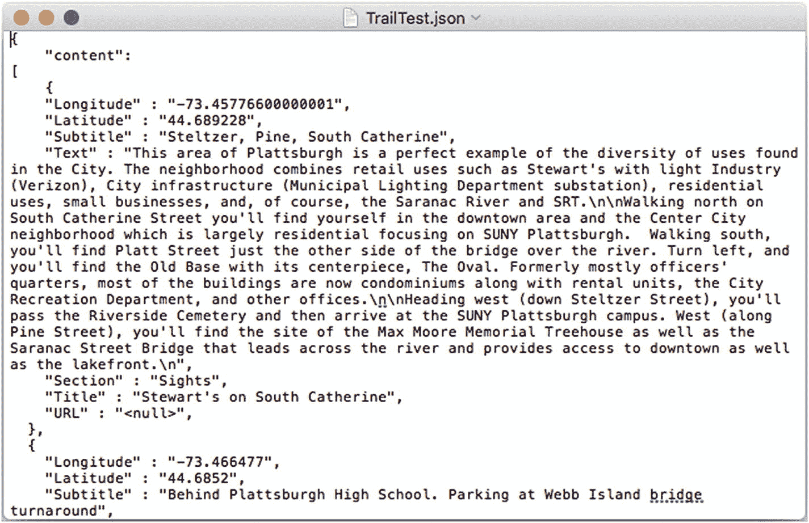

图 3-1

TextEdit 中的 JSON

相同的 JSON 文件在 BBEdit 中打开时如图 3-2 所示。文本由 BBEdit 自动着色。

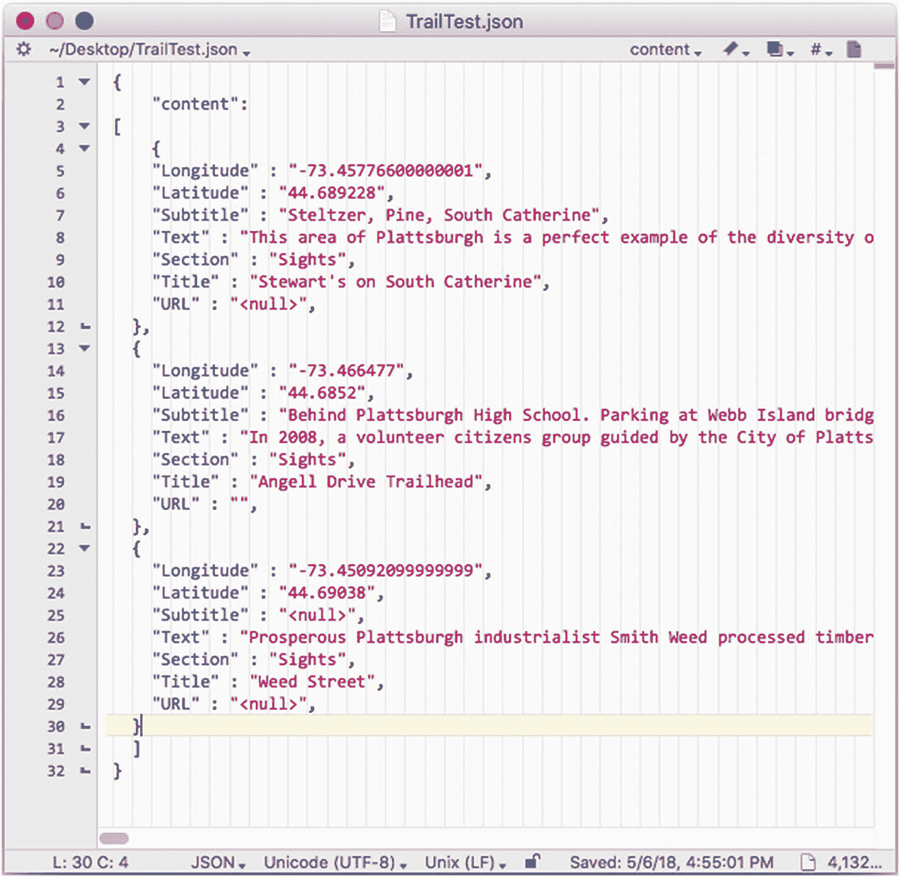

图 3-2

BBEdit 中的 JSON

在图 3-3 中，你可以看到同一个文件在 Excel 中打开的样子。注意内容相同，但电子表格内的间距由 Excel 处理。

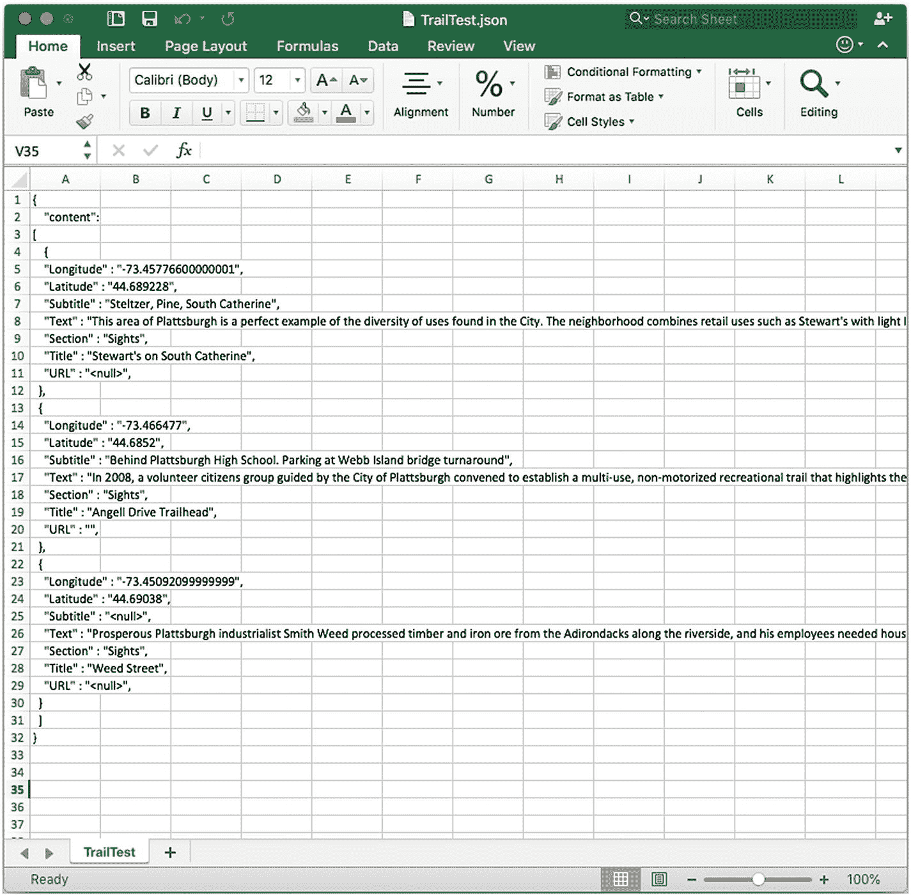

图 3-3

Excel 中的 JSON

最后，在图 3-4 中，你可以看到同一个 JSON 文件在 Xcode 中打开的样子，Xcode 会应用其自身的间距和着色。

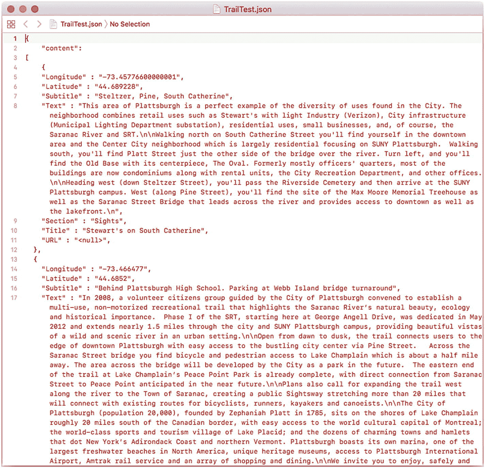

图 3-4

Xcode 中的 JSON

### JSON 基础使用

尽管相同的 JSON 代码在不同应用中显示效果不同，但底层代码的结构是相同的，并且很容易将仅基于字符的原始 JSON 代码通过任何通信渠道进行传输。

如果你自己创建 JSON 代码，很容易放错引号、逗号、大括号或圆括号。由于 JSON 如此直接且应用广泛，你可以在网络上找到大量的 JSON 检查器和验证器——只需使用你喜欢的搜索引擎即可。

如果你已经熟悉 Cocoa 或 Swift，那么你应该对 JSON 的组成部分不陌生。以逗号分隔的列表或键值对是在操作系统中广泛使用的字典的核心。

在 Swift 中内置了可以轻松地将字典转换为 JSON，以及将 JSON 转换为字典的代码。下一章将提供该代码的示例。此外，你将看到如何使用内置的编码器和解码器（在 Swift 4 及更高版本中），它们无需你编写任何额外代码即可执行这些操作。

### 总结

通过使用可共享的代码和标准（如 JSON），可以在不同应用之间、不同设备之间或跨越时间障碍共享数据。JSON 的强大之处在于其简单性：它不对整个文档进行编码，而是让你对基本结构进行编码和解码，例如对象（任何类型，不一定是面向对象编程中的对象）、数字、字符串和数组。这些过程非常快速且易于使用。

下一章将探讨你与 JSON 配合使用的内置工具。

## 4. 在 Swift 中使用 JSON 数据

在本章中，你将了解 JSON 语法的基础知识。你可以将其与许多现代语言一起使用，Swift 也不例外。事实上，Swift 与 JSON 的集成强大、功能丰富且易于使用。如果再加上 iPad 和 Mac 上 Xcode 中均可使用的 Swift Playgrounds，你将获得一个强大的跨平台数据交换格式，并且可以轻松地使用 playground 进行测试（这样你就不必编写一个应用——哪怕是精简版的应用——来探索数据、语法和代码）。

在本章中，你将了解如何通过 Swift Playgrounds 探索 JSON，以及如何探索可用的 iOS/Swift 接口。

> **注意：** 这些功能在 Xcode 9 和 Swift 4 中展示。这些版本相比之前的 Xcode 和 Swift 版本有显著变化。

### 开始使用 JSON Swift Playground

Swift Playgrounds 应用是熟悉 JSON 的完美工具。在本章中，你将看到如何使用 playground 进行实验。首先，你可以创建一个 playground 并向其中添加 JSON 文本，例如第 3 章中展示的例子。使用 Swift Playgrounds，创建一个新的 playground，如图 4-1 所示。

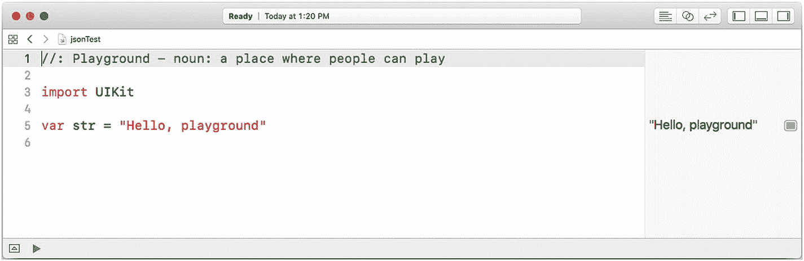

图 4-1

创建一个 Swift playground

> **注意：** 本章中的示例使用 macOS 上 Xcode 中的 Playgrounds 展示。Xcode 是你编写代码的工具，像这样的项目在 macOS 上操作可能比在 iOS 上更方便，但你可以使用任意一种平台。

通过点击窗口右上角的图标，或使用菜单栏的“显示” > “导航器” > “显示项目导航器”命令，打开窗口左侧的项目导航器。打开项目导航器后，你将看到项目内的文件，如图 4-2 所示。

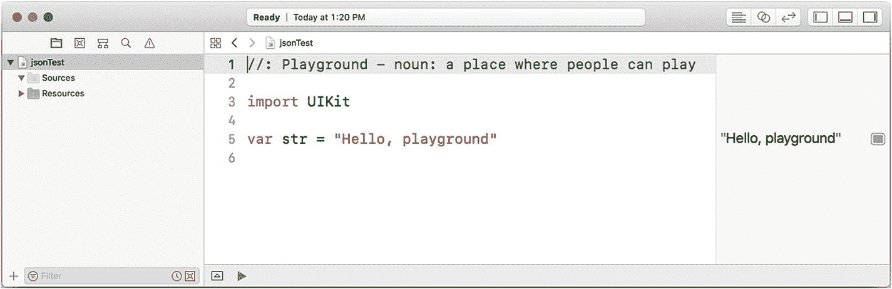

图 4-2

打开 Xcode 窗口左侧的项目导航器


##### 注意

在“访达”中，一个 Swift Playgrounds 项目由一个单一文件组成，但该文件实际上是一个包含你在项目导航器中看到的那些文件的包。你可以通过在“访达”中使用 Control 键点击，或使用鼠标右键点击该包来打开它。在 Swift Playgrounds 和 Xcode 项目导航器内操作更简单、更直接。

你可以使用展开三角形来打开项目的各个部分。要向项目中添加一个文件来存放你的 JSON 代码（或任何你想在 playground 中使用的其他数据），请在“Resources”部分按住 Command 键点击，然后从上下文菜单中选择“New File”。如果需要，你可以点击文件名来更改它。图 4-3 显示了一个已创建的新文件，名为 `test.json`。图中该文件内有两行空行。

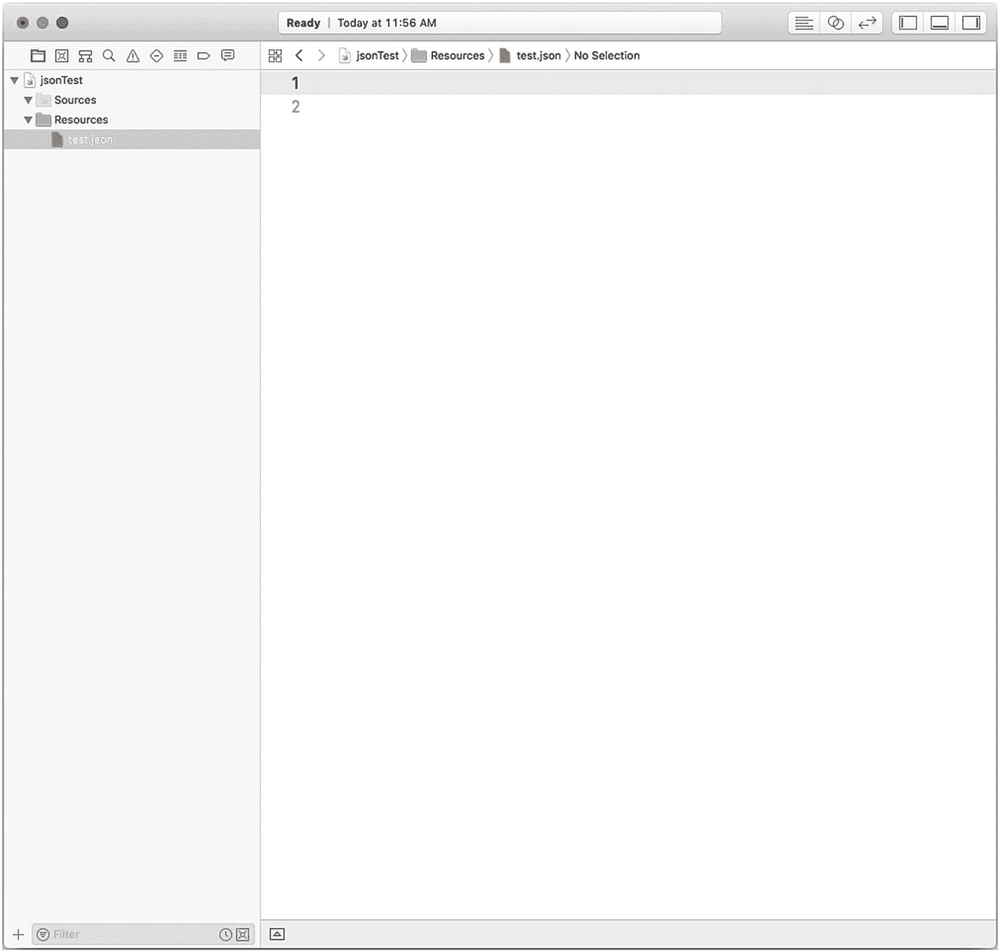

**图 4-3**
创建新文件

你可以在文件中输入代码，或者将代码复制粘贴进去（图 4-4）。（本章的代码可按引言中所述方式下载。）

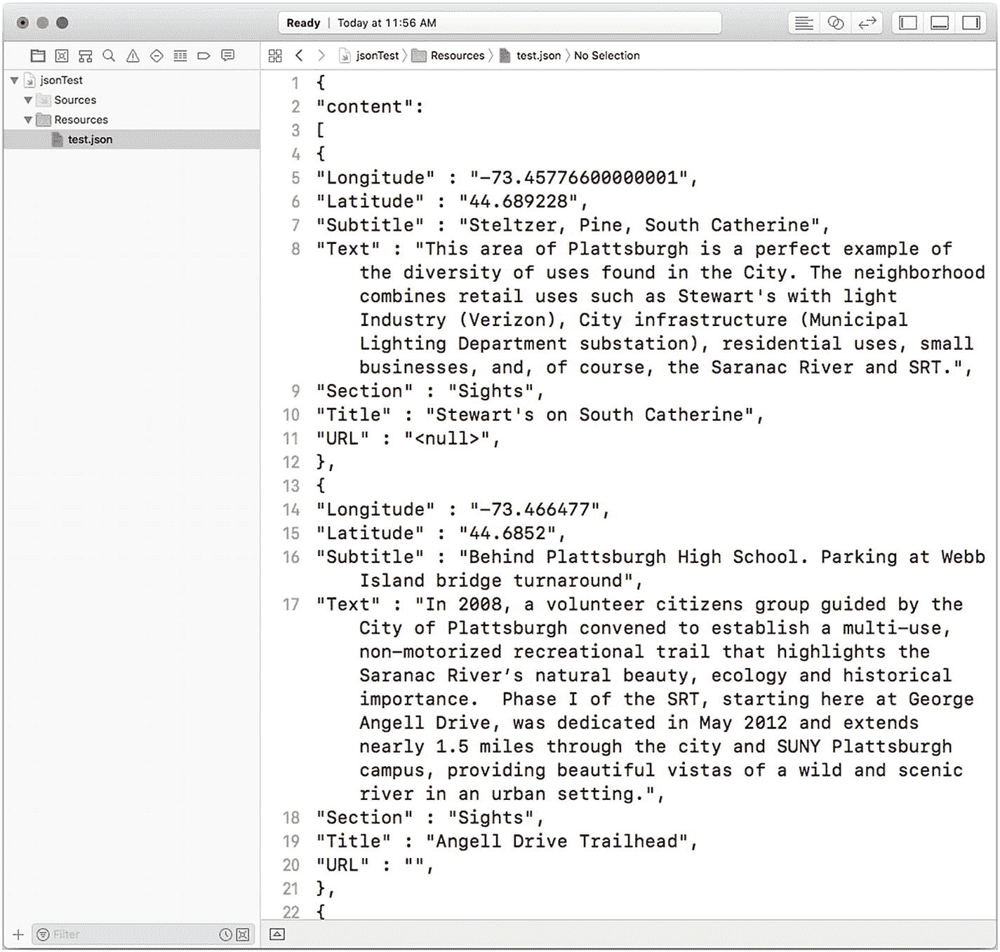

**图 4-4**
在文件中输入或粘贴代码

现在，你需要将你的 playground 连接到该文件。从物理层面看，该文件位于 playground 包内部，如图 4-3 所示，但你需要读取数据。你将使用（并反复使用）两行代码来完成此操作。首先，指定文件名及其位置——即在 playground 包内。以下是这行代码：

```
let url = Bundle.main.url(forResource: "test", withExtension: "json")
```

请根据你的文件更改文件名和扩展名。

然后，使用以下代码从文件中读取字符串：

```
do {
let jsonCode = try String(contentsOf: url!, encoding: .utf8)
}
catch {
fatalError ("handle error properly")
}
```

你可以自定义内容变量名（`jsonCode`）和 `fatalError` 字符串的文本。否则，你可以直接使用这段代码。（如果你愿意，也可以将 `fatalError` 改为其他捕获错误的方法。）

该代码如图 4-5 所示。

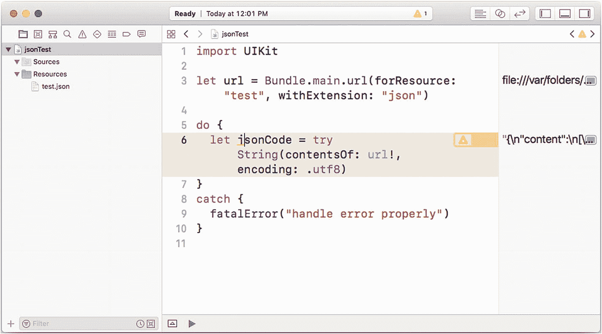

**图 4-5**
输入代码以读取文件

输入代码后，你可以运行它，如图 4-6 所示。

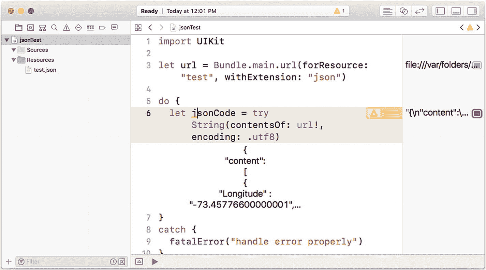

**图 4-6**
运行代码

请检查以确保你正确看到了代码并且没有错误。（在你习惯在 playground 中创建文件之前，这一步可能会困扰你。）

如果你想从侧边栏显示内容，则会弹出一个窗口，如图 4-7 所示。


**图 4-7**
运行过程中查看 JSON 代码

### 在 Swift 中使用 JSON 集成工具

到目前为止，你已经了解了如何在 playground 内部创建文件以及如何读取其内容。无论文件是位于 playground 中还是其他位置——甚至可能是通过网络传输——读取过程都是相同的。

更常见的情况是从文件中读取数据并将其内容作为 JSON 数据而非字符串来处理。这就是本节将要介绍的内容。

#### 集成 Swift 数组

首先，准备一些 JSON 代码，你可以在 BBEdit 或 Xcode（甚至 TextEdit）等编辑器中创建这些代码。

你可以从一个 JSON 数组开始，例如：

```
[3, 69, 8, 66]
```

请注意，数组的元素之间用逗号分隔，并且数组用方括号括起来。你可以创建一个 playground，然后在“Resources”部分添加一个新文件。图 4-8 展示了本章中接下来会发生的情况。

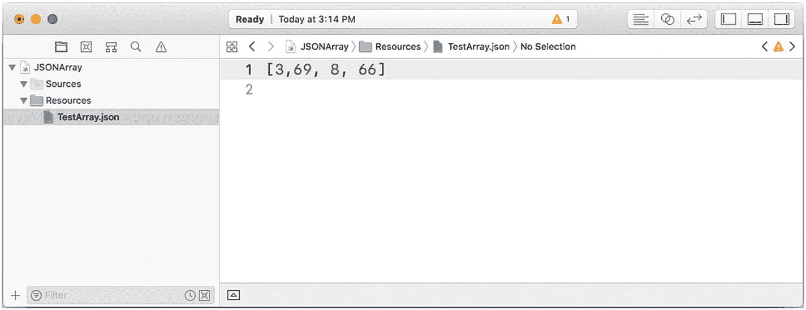

**图 4-8**
在 playground 包内的文件中创建一个 JSON 数组

接下来，像本章之前看到的那样，指定文件的 URL。

```
let url = Bundle.main.url(forResource: "ArrayTest", with Extension: "json"
```

然后，不是将文件中的数据提取为字符串，而是使用 FoundationKit 内置的 `JSONSerialization.json` 文件将其作为 JSON 对象检索。请注意，这应该始终在能够捕获失败的 `do` 代码块内完成，如图 4-9 所示。

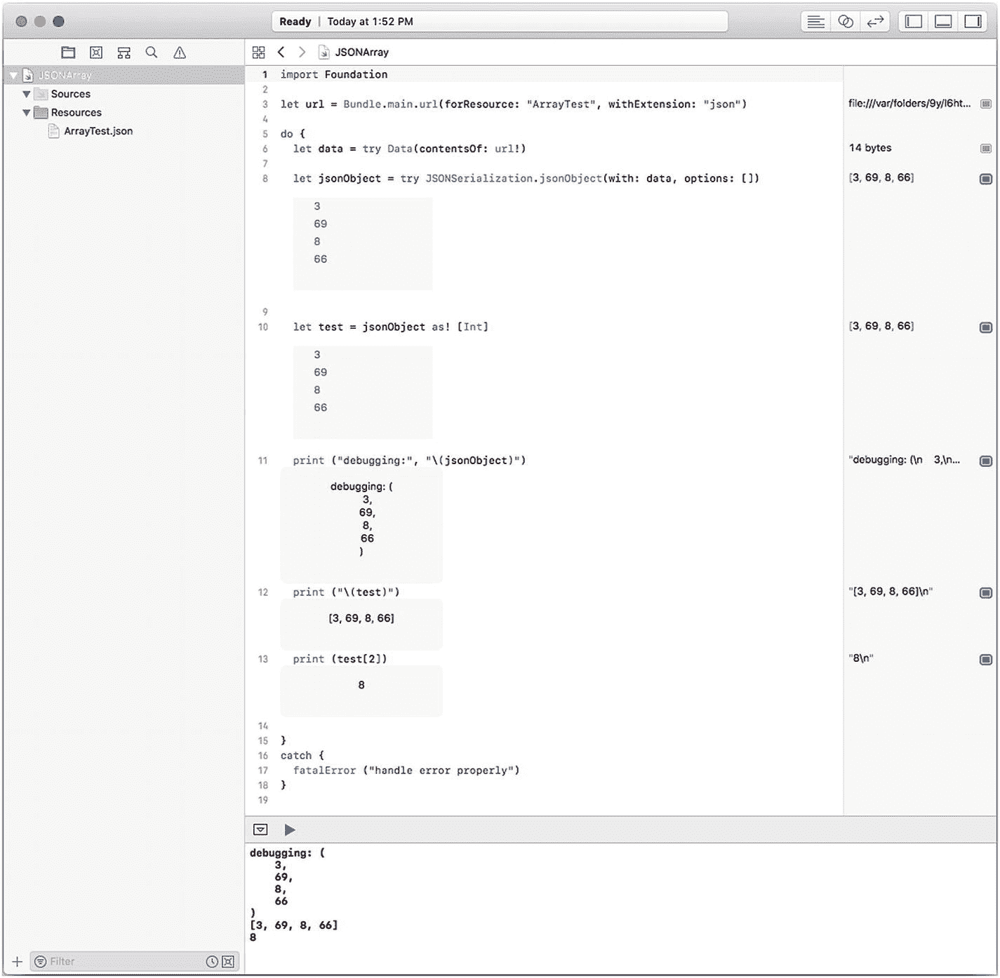

**图 4-9**
捕获失败

一旦创建为 JSON 对象，你就可以使用 Swift 打印它。图 4-9 中的代码最重要的一点是，在 JSON 对象创建之后，它可以像往常一样在 Swift 中被修改。例如，你可以使用以下代码将数组（从 JSON 意义上）转换为 Swift 整数数组：

```
let test = jsonObject as! [Int]
```

你可以在图 4-9 的第 10 行看到这一点。（在实践中，你会使用 `as?` 来捕获转换中的错误。）

图中还显示了几行其他测试和调试代码，但或许最重要的是第 13 行：

```
print (test[2])
```

第 13 行使用类型化数组创建了 `test` 变量，如前所述。第 13 行之所以如此重要，是因为最初可能被指定为输入字符串的 JSON 代码现在被转换为一个真实对象，并且你可以使用下标 `[2]` 来访问数据——就像任何其他 Swift 数据一样。

#### 集成 Swift 字典

如果你想在 Swift 中使用 JSON 数组，其基本步骤是相同的。如图 4-10 所示，你在 playground 的包中创建文件。

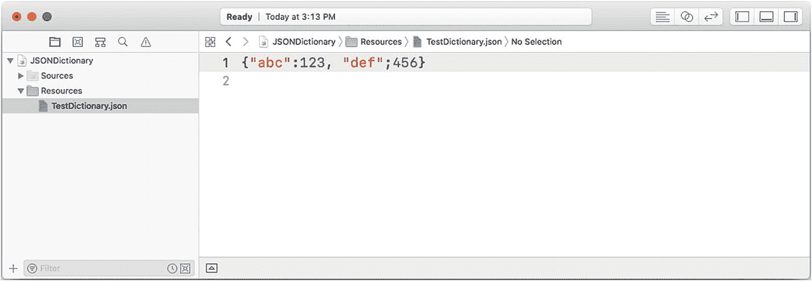

**图 4-10**
在 Swift 和 JSON 中使用字典

请注意，括号是花括号，这是 JSON 用于其对象的样式。方括号（如图 4-8 所示）用于 JSON 数组。

##### 注意

这是你需要关注的地方。JSON 和 Swift 的规则相似但不相同。例如，Swift 数组的元素具有相同类型，但 JSON 中不一定如此。这就是为什么你必须始终捕获使用 `JSONSerialization.json` 时可能出现的失败。

图 4-11 展示了与图 4-9 中用于 JSON/Swift 数组的测试和实验相同类型的内容。

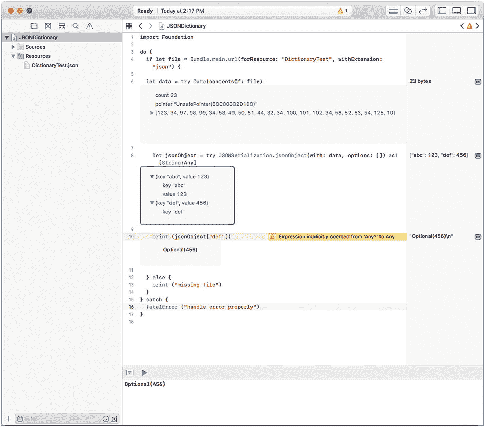

**图 4-11**
使用 JSON/Swift 字典进行实验

### 总结

使用像 JSON 这样的通用语法来来回传输数据的能力，无论对于单个应用内部还是多个应用之间都非常重要。本章向你展示了基础知识。

请注意，从 Xcode 9 开始，提供了 `Codable` 协议，以进一步增强 Swift 的 JSON 能力。

你尚未了解那些允许你在不同应用和平台之间共享代码和数据的基本构建块类型。在下一章中，你将通过研究可用于 iOS（及其他）应用的 Facebook 登录，开始研究这些构建块的非常具体的用途。

