# 第三部分集成 Facebook 登录


## 5. 在 iOS 上设置 Facebook 账户

在本书的这一部分及后续部分中，你将处理 iOS 项目与外部项目（如来自 Facebook、Amazon Web Services 或 RxSwift 的项目）的集成。这类集成与前面章节讨论的集成最大的区别在于，现在的集成更为复杂。这不再是应用之间共享数据、消息或数据结构的问题；而是要让两个组件的部分协同工作。本章将探讨 Facebook 的使用，从某些方面来说，这是最简单的应用集成形式。

##### 注意

至少简要地阅读后续章节中关于 AWS、Facebook 和 RxSwift 的集成内容可能会很有帮助。有些技术在其他环境中也会用到。此外，能够查看不同环境中执行相同功能的代码，有助于你理解所涉及的主要问题。

### 开始探索 Facebook iOS SDK

本书讨论的 API 会不时发生变化。2018 年，由于欧盟采纳了《通用数据保护条例》（GDPR），以及包括 Yahoo!（30 亿用户账户遭泄露）、eBay（1.45 亿用户受影响）、Equifax（1.43 亿用户面临风险）和 Target 商店（1.1 亿用户的信用卡数据被盗）在内的多家社交媒体公司发生多起重大隐私泄露事件，许多 API 都发生了变化。要非常小心地依赖旧技术和旧代码，尤其要谨慎依赖 2018 年中期及更早的代码。这些代码可能没有反映近年来实施的变化。

与本书中提到的其他 API 一样，一个好的起点是 Facebook 的开发者子站点——`developers.facebook.com`，如图 5-1 所示。API 本身随时可能发生变化；此外，欢迎屏幕上会显示新闻和更新，如图所示。新闻和更新会频繁变动。

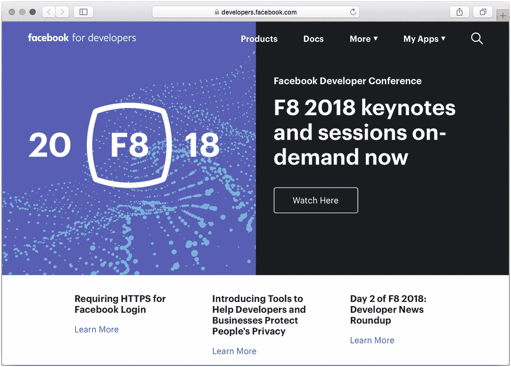

图 5-1

开始使用 Facebook 开发者 API

虽然 Facebook 的开发者站点会发生变化，但其基本结构相当稳定。查看图 5-2 顶部的黑色导航栏，可以了解站点的组织方式。

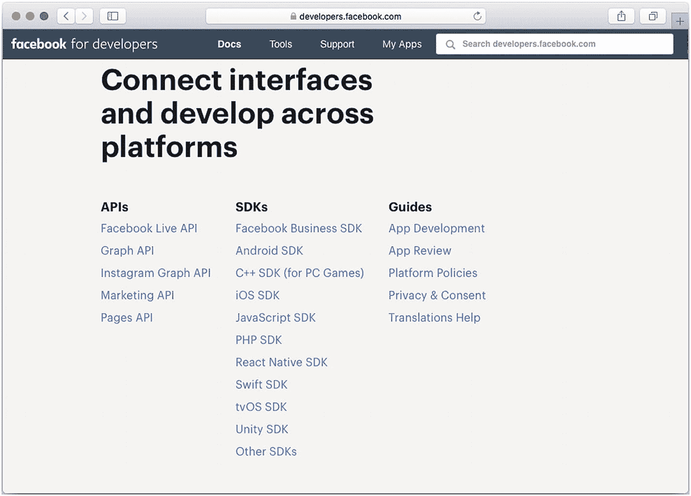

图 5-2

浏览 Facebook 开发者站点

如果你想开始使用 Facebook iOS 集成，请查找 Facebook iOS SDK。你可以在导航栏的 Docs 菜单中找到它，如图 5-2 和 5-3 所示。

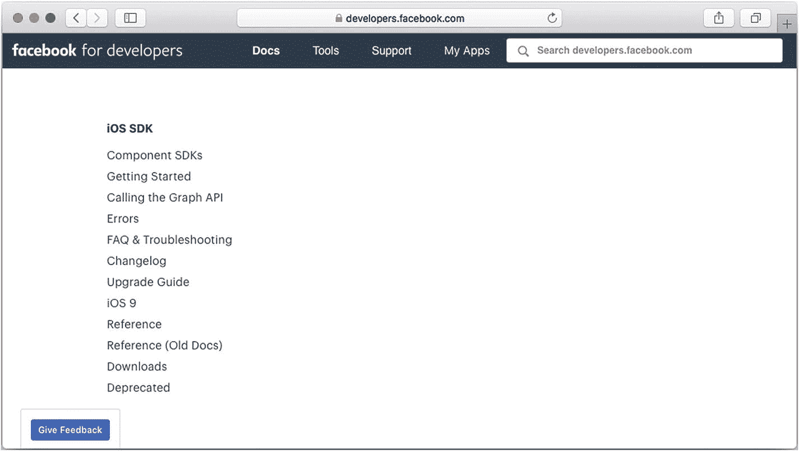

图 5-3

深入查找 iOS 版 Facebook SDK

你正在寻找的内容如图 5-4 所示。

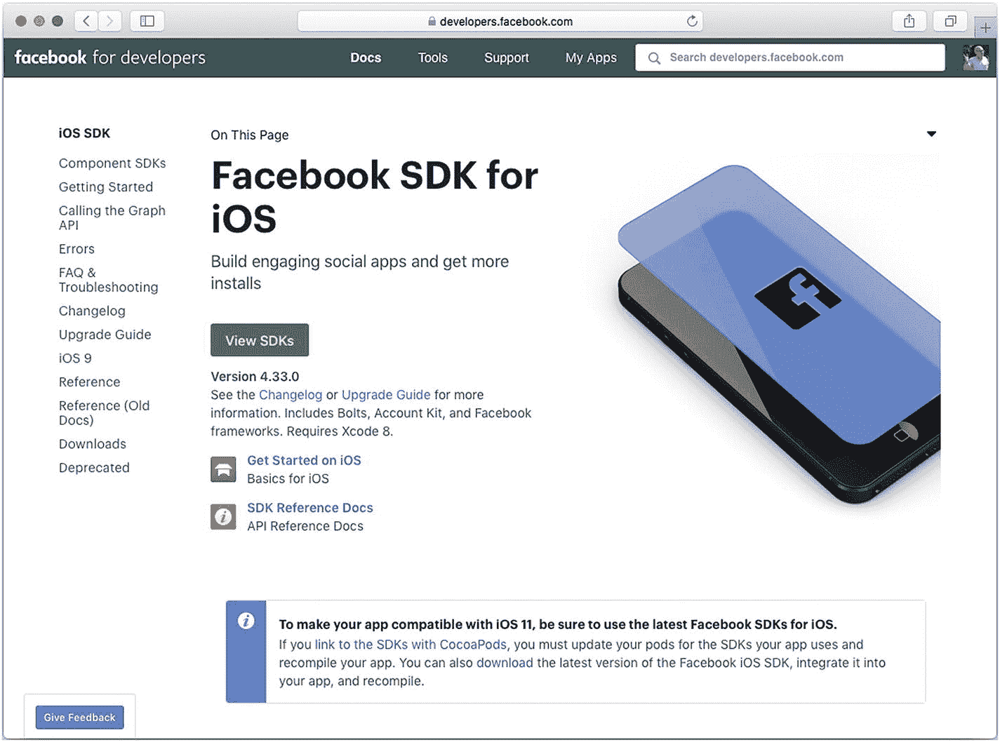

图 5-4

探索 iOS 版 Facebook SDK

### 查看 Facebook iOS SDK 的组件

在图 5-4 中，你可以查看 Facebook/iOS 的主要 SDK。你可以在图 5-5 中看到它们。

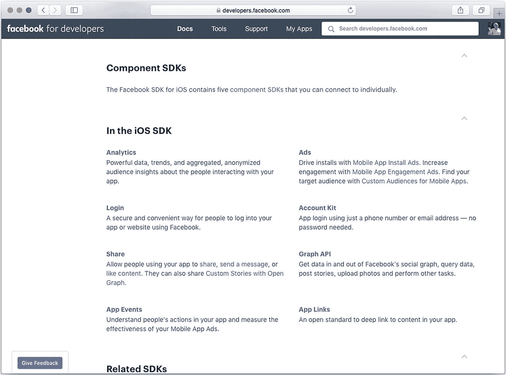

图 5-5

查看基本的 iOS SDK 组件

与 AWS 的情况一样，iOS 版 Facebook 的许多 SDK 都致力于管理广告和用户交互。五个主要的 SDK 如下所示：

- **分析功能 (Analytics)。** 你可以查看谁在使用你的 Facebook 应用的相关信息。这些信息是匿名的，除非用户特别允许，否则你无法看到个人具体信息；但你可以看到关于用户的聚合或匿名数据。对于 Facebook 来说，这基本上就是主页所有者可以在 Insights 中看到的信息。
- **登录功能 (Login)。** 这些工具供用户用来登录你的 Facebook 应用。
- **分享功能 (Share)。** 此 SDK 管理分享、点赞和消息。（这是许多 Facebook 应用开发者首先考虑的 SDK，尽管其实现也需要处理其他 SDK。）
- **应用事件 (App Events)。** 此 SDK 让你可以查看用户在应用中的事件和操作。
- **广告功能 (Ads)。** 对于许多开发者来说，这是关键的 SDK。分享和应用事件可能对用户最重要，但广告通常对业务管理者最重要。

当你更深入地查看 iOS 版 Facebook SDK 时，可以找到相关的 SDK，如图 5-6 所示。

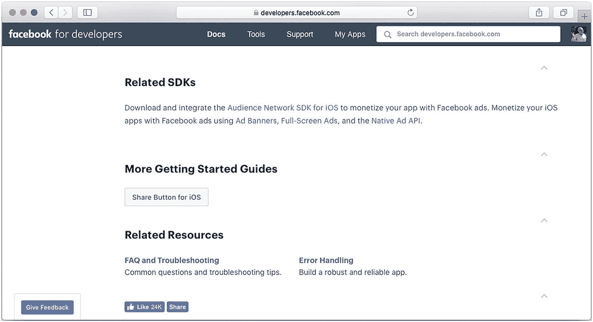

图 5-6

查看其他资源并开始使用

你概览过程的最后一站可能是图 5-6 中显示的资源。

### 总结

将 Facebook API 与 iOS 集成需要持久且复杂的工具，以便 Facebook 本身、你的 Facebook 应用和你的 iOS 应用无缝地协同工作。为了继续进行，你将使用下一章中概述的步骤。

## 6. 管理 Facebook 登录

你需要考虑的第一个登录过程是你自己作为特定应用的 Facebook 开发者的登录。本章将帮助你导航该登录协议。请记住，你可以通过许多步骤序列来达到你想要的结果——访问 Facebook iOS API。

### 开始 Facebook SDK 登录过程

首先，登录你的 Facebook 开发者账户。如果你接着上一章进行，现在可以使用图 6-1 中显示的 iOS 快速入门按钮。

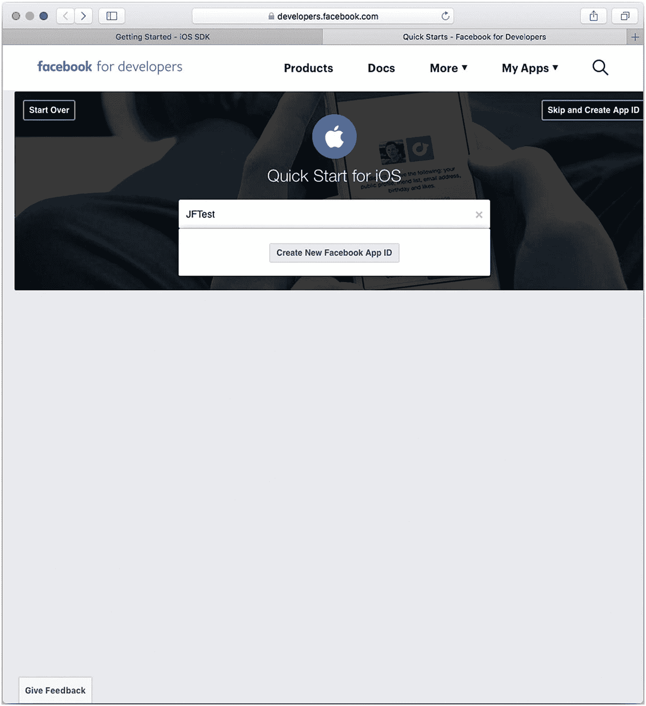

图 6-1

通过创建新的 Facebook 应用 ID 开始

你需要提供你的应用名称和联系人电子邮件地址。（请记住，要进入此对话框，你需要已登录你的 Facebook 开发者账户，因此该信息已经是正在创建的应用的一部分。）图 6-2 显示了应用创建步骤。

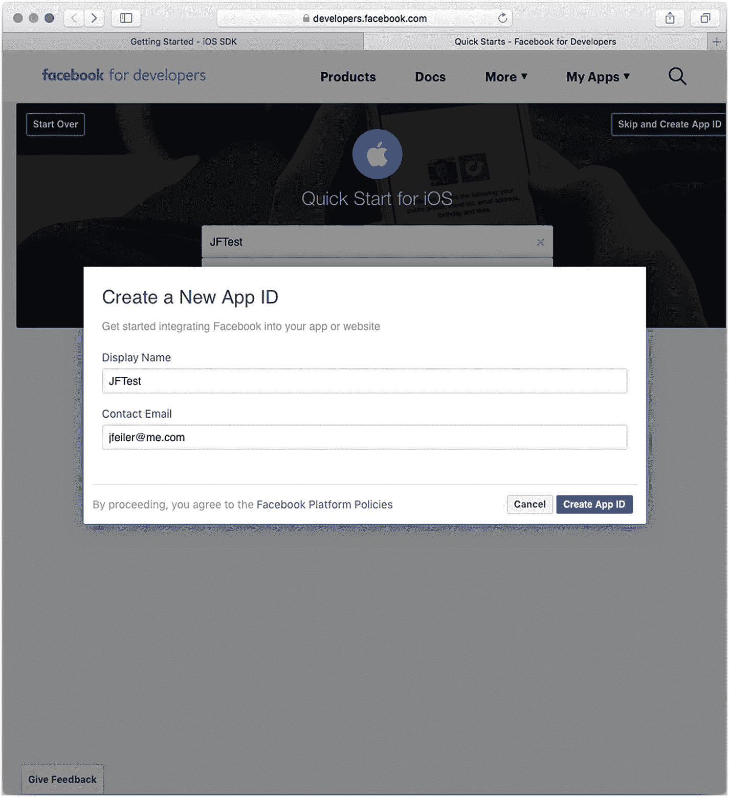

图 6-2

命名你的新 Facebook 应用并提供联系人电子邮件地址

创建应用的过程具有多个安全层级，如图 6-3 所示。请记住，你的 iOS 应用（或任何非原生应用）将能够访问重要的 Facebook 和个人资源，因此安全性很严格，并且自 2017 年和 2018 年初出现一些问题以来已显著增强。

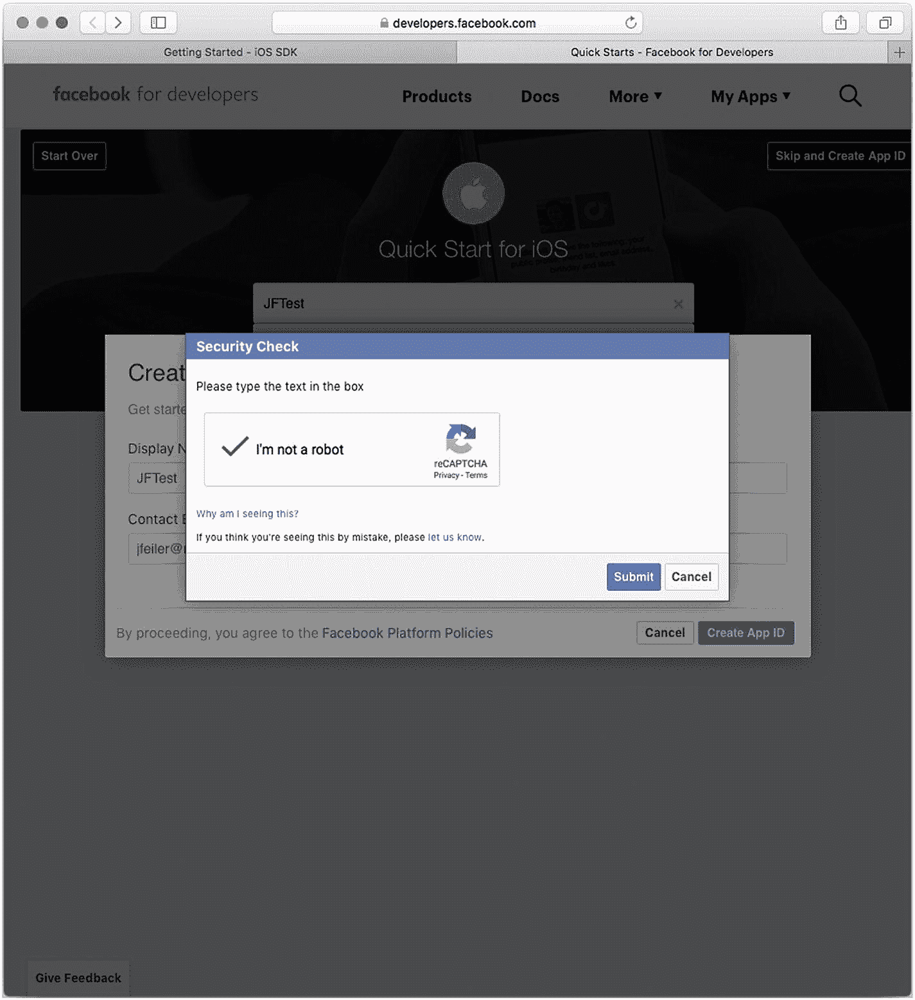

图 6-3

通过 Facebook 安全流程


### 提供基本的 iOS/Facebook 集成

如图 6-4 所示，你将继续使用 Facebook for iOS SDK。

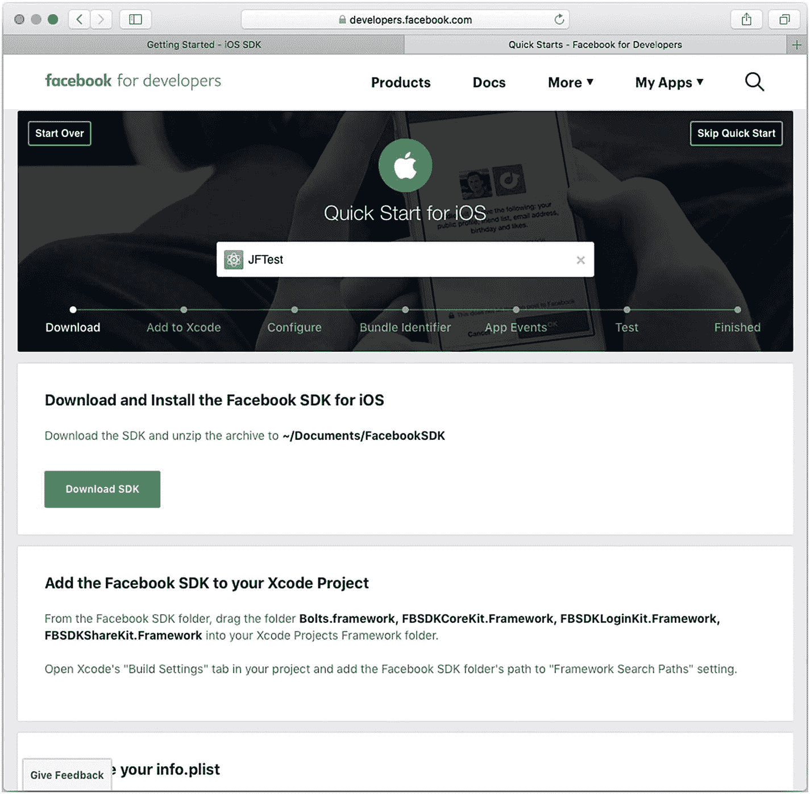

图 6-4 集成 Facebook SDK for iOS

你下载并创建好的 SDK，如图 6-4 所示，会将新的 Facebook 应用 ID 集成到你应用的属性列表中。请注意 `info.plist` 第 2 节末尾的代码，如图 6-5 所示。

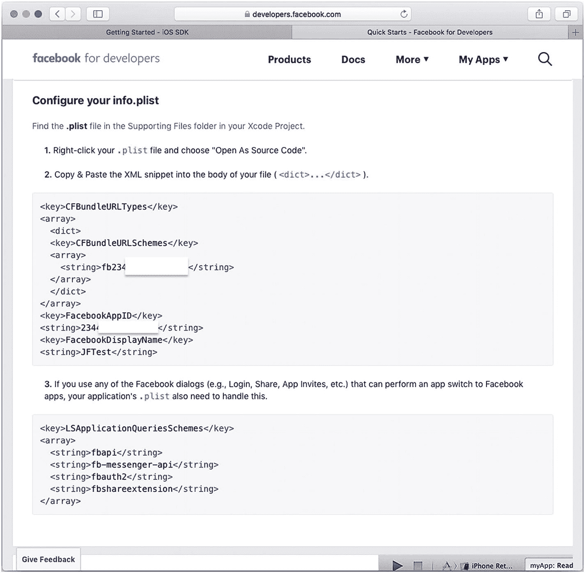

图 6-5 你的 Facebook ID 已集成到下载的 `info.plist` 文件中

清单 6-1 中所示的代码是任何 iOS 应用的标准代码。

```
CFBundleURLTypes
CFBundleURLSchemes
FacebookAppID
FacebookDisplayName
JFTest
```

清单 6-1 Facebook 与你应用的属性列表集成

Facebook ID 在内部使用；应用显示名称对用户可见。如果你需要在某个时候更改名称，请记住这一点：很可能你需要保留 `FacebookAppID`。但是，如果你正在修改一个现有的 Facebook 应用以快速上手，则需要同时更改 `FacebookAppID` 和 `FacebookDisplayName`。

##### 注意

通常情况下，使用前面图 6-4 所示的快速入门下载 SDK 按钮，比调整现有的 plist 文件要更容易。

### 将 iOS 应用连接到你的 Facebook 应用

你下载的 plist 文件中已插入了 Facebook 名称，以便 iOS 应用可以正确使用它。你现在需要手动向 Facebook 提供 iOS 应用包标识符（用于唯一标识每个 iOS 应用）。

在图 6-5 和清单 6-1 所示的代码下方，你会看到一个表单，如图 6-6 所示，你可以在其中输入你的包标识符。

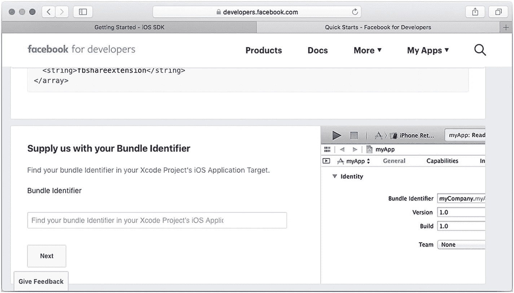

图 6-6 从 iOS 向 Facebook 提供你的包标识符

提醒一下，包标识符显示在你的 iOS 应用常规设置的顶部（在身份部分；参见图 6-7）。

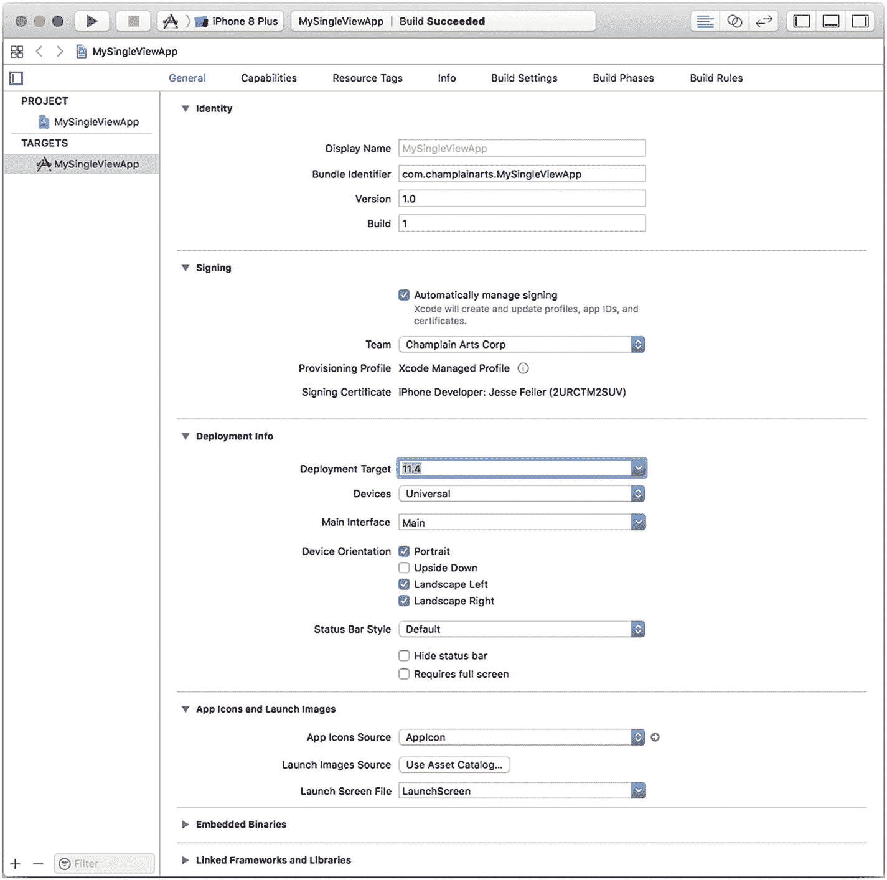

图 6-7 为你的 Facebook 应用使用 iOS 包标识符

##### 注意

更改包标识符时一定要小心。它在许多地方被用来保持 iOS 应用各部分的一致性。

### 总结

本章概述了 iOS 应用与 Facebook 应用之间的双向连接。不要为了改动而随意改动。不止一位开发者曾决定在某个时候“清理”包标识符，使其符合内部标准或出于其他原因。很可能，这种“清理”会让你花费数小时（甚至数天）的工作时间。

至此，你应该准备好实际尝试将 iOS 应用与 Facebook 一起运行了。

## 7. 向 iOS 应用添加 Facebook 登录

拥有 Facebook 开发者账户，你可以向 iOS 应用添加 Facebook 功能（如登录）。本章将引导你完成此过程。这对于你可能想要与 iOS 应用集成的许多 Facebook 工具都很有用。此外，集成 Facebook 工具的步骤在某些方面与你集成其他工具（例如 Amazon Web Services (AWS)）的步骤相似，而 AWS 是本书下一部分的主题。

同样重要的是，要注意有多种方式可以处理这种集成。CocoaPods（在第 2 章中描述）是一种非常常见的处理集成的方式。如果你研究一下 CocoaPods，你会发现你拥有的是一种自动化工具，用于管理你的 Xcode 项目文件，并通过 CocoaPods 从 GitHub 自动下载版本。

集成的核心是 Xcode、其文件及其框架。尽管 Facebook 接口提供了 CocoaPods 接口，但本章将展示源代码/Xcode 层面的实际情况。请记住，无论你使用哪种集成技术，都需要执行相同的基本结构（更新和集成你的 Xcode 项目）。

不过，首先，先介绍 Facebook 登录。

### 开始将 Facebook SDK 与 iOS 应用集成

你开始需要两个组件：

- 你需要一个 Facebook 开发者账户（参见前一章）。
- 你需要 Xcode 并对它基本熟悉。

虽然在开发应用时你可以离线使用 Xcode，但你无法离线为 Facebook 或 iOS 创建应用，因为你需要与 Facebook 和 iOS 环境交互。如果你的网络连接不是普通的互联网连接（例如，你处于限制可访问网站的防火墙后面），请查看开始使用的基本步骤，以确保你不需要获得组织中其他部分的许可。

##### 注意

Facebook 和 iOS 开发者网站都会不时发生变化，因此你可能需要搜索才能找到已移动的章节。

首先，创建一个用于测试的 Xcode 项目。在本章中，将使用 Xcode 附带的“单视图”示例应用。图 7-1 展示了如何创建它。

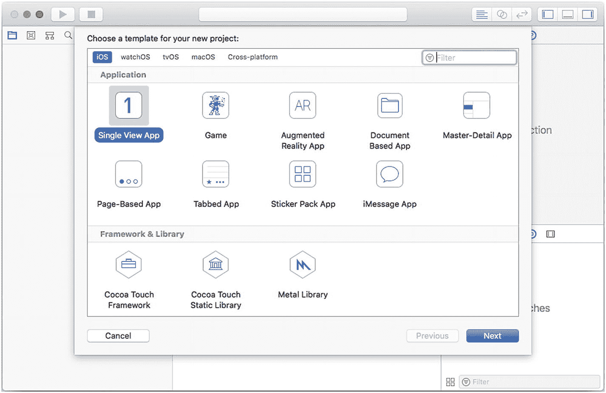

图 7-1 创建一个单视图应用以测试 Facebook

记录基于你为应用输入的数据而创建的应用包标识符。如图 7-2 所示，此应用的包标识符是 `com.champlainarts.MySingleViewApp`。

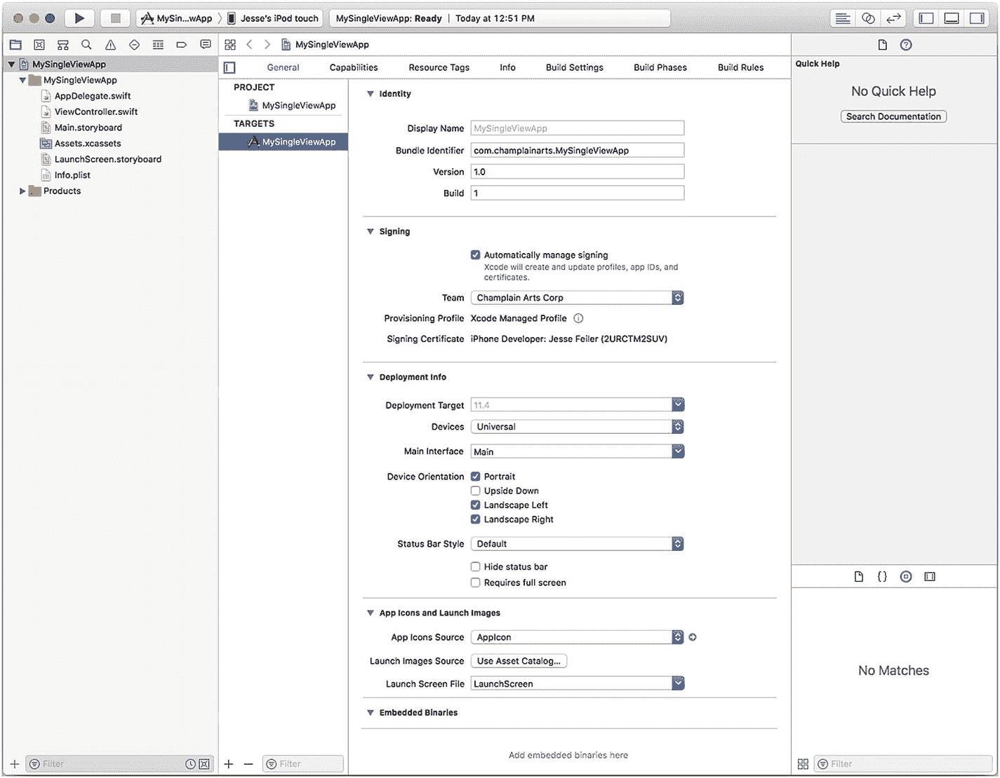

图 7-2 记录包标识符

与往常一样，当你从 Xcode 中的模板创建新应用时，请在设备或模拟器上运行该应用，以确保其正常运行。图 7-3 显示了如果在 iPhone 8 模拟器上运行它，你应该会看到的内容。

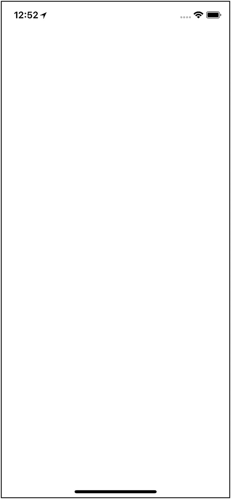

图 7-3 测试应用

是的，成功实现的单视图应用不会显示任何内容。正如你在本章后面将看到的，你可以轻松地添加一个标签。此时你唯一需要关注的是，当你在 Xcode 上运行该应用时，它不会失败或崩溃。


### 下载 Facebook Swift SDK

登录你在 `developers.facebook.com` 上的开发者账户。你会看到下载 Facebook SDK 的选项，适用于 iOS、Android、PHP 以及其他平台。在撰写本文时，基础的 iOS SDK 仍是用 **Objective-C** 编写的，但如果你愿意，也可以下载 Swift 版本（本节将介绍具体操作方法）。

iOS SDK 的 Swift 版本位于文档中。登录后，使用顶部导航栏中的 Docs 菜单项进入文档页面，如图 7-4 所示。

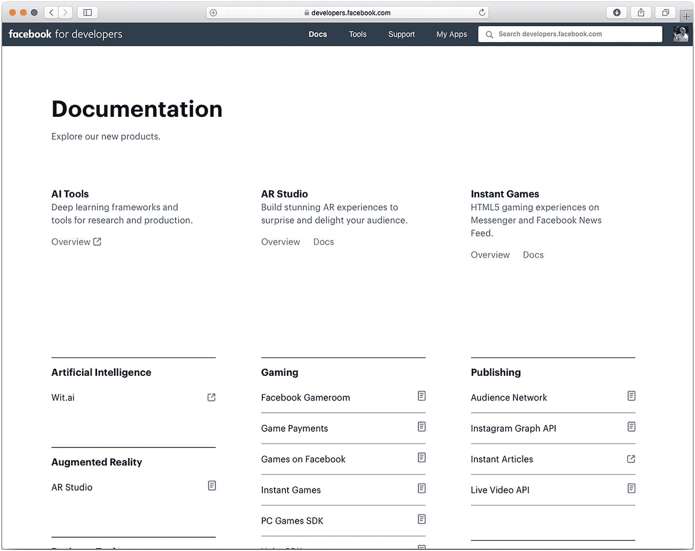

图 7-4

在文档中查找适用于 iOS/Swift 的 Facebook SDK

你可能需要向下滚动，如图 7-5 所示，才能找到 Swift SDK。

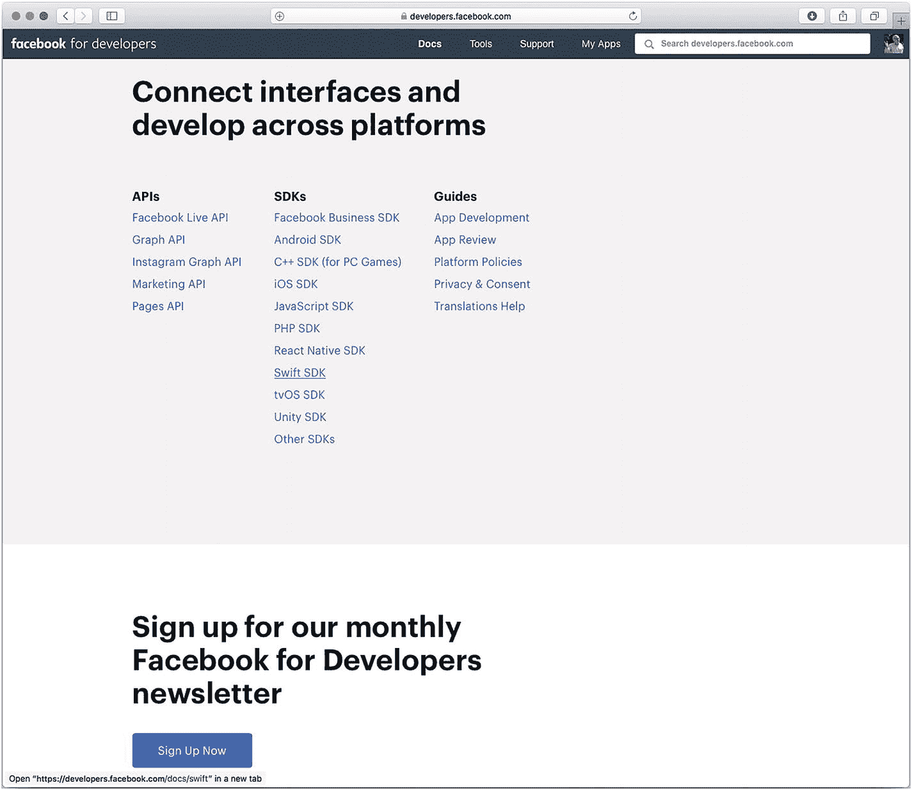

图 7-5

Facebook Swift SDK 与其他所有 SDK 一同提供

找到“SDK for Swift”链接后，点击打开，如图 7-6 所示。

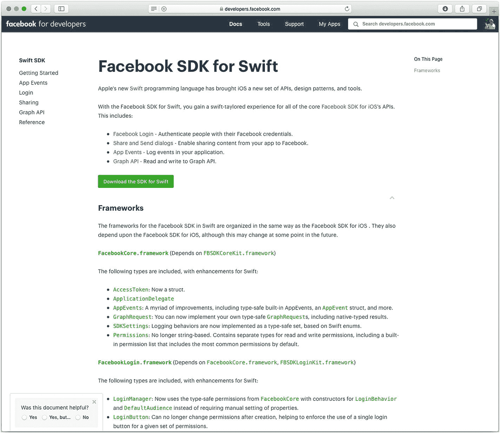

图 7-6

下载 Facebook Swift SDK

图 7-6 中显示的框架是 Facebook Swift SDK 的核心。所有 iOS 框架最初都是用 Objective-C 编写的。如今，一些新框架是用 Swift 编写的，但在构建基于 Swift 的应用时，即使部分（或全部）框架是用 Objective-C 编写的，也不成问题。因此，当你下载适用于 Swift 的 SDK 时，最终获得的框架往往还是用 Objective-C 编写的，但这无关紧要。如图 7-6 所示，当你下载适用于 Swift 的 SDK 时，部分框架专门为 Swift 进行了增强，因此请妥善保存这些文件，并根据需要将其添加到你的应用中。

图 7-6 中的下载链接会跳转到 GitHub，如图 7-7 所示。你可以下载源码，格式为 `.zip` 或 `tar.gz`。

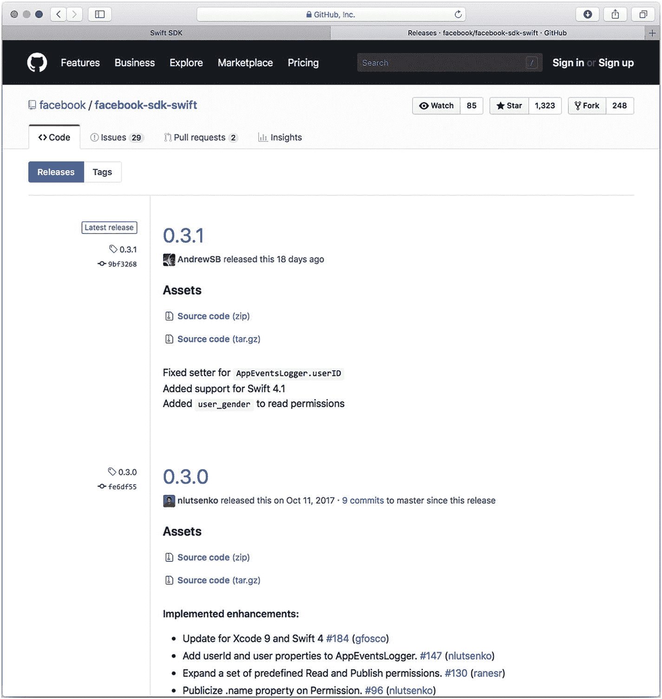

图 7-7

下载最新的 Facebook Swift SDK

从 GitHub 下载的文件，其内容和名称会随时间变化。在本书撰写时，下载的文件如图 7-8 所示。

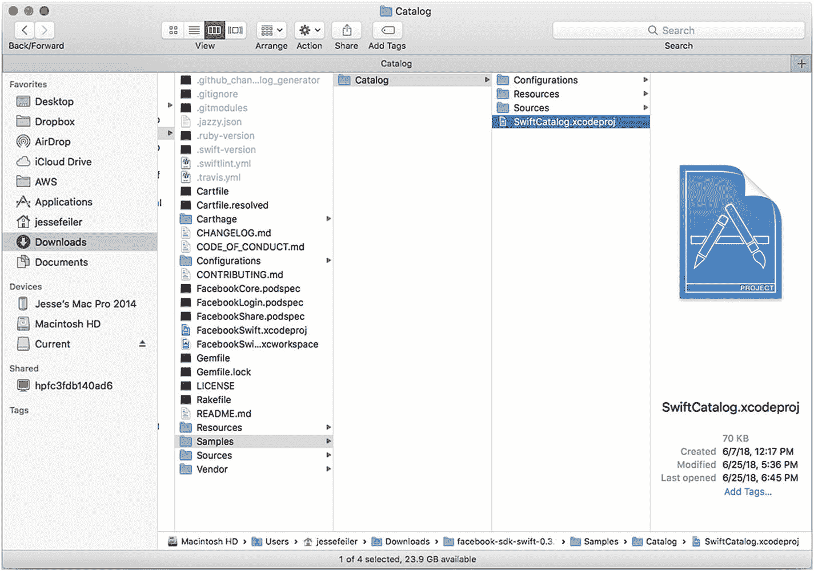

图 7-8

从 GitHub 下载的 Facebook 文件

### 为你的 Facebook 应用添加框架和功能

你可以通过使用 CocoaPods 来解决文件存放位置的问题，但如果你更倾向于直接处理实际文件，一种对许多人在多个项目上都行之有效的方法是寻找示例文件或示例应用。在本例中，有一个包含 SwiftCatalog 应用的 `Samples` 文件夹。很多时候（但并非总是如此！），在文档更新之前，示例应用会先针对给定的项目进行更新。如果是这种情况，就构建该应用。如果你查看项目导航器，如图 7-9 所示，你会注意到诸如框架之类的中间文件都已构建在示例应用中。

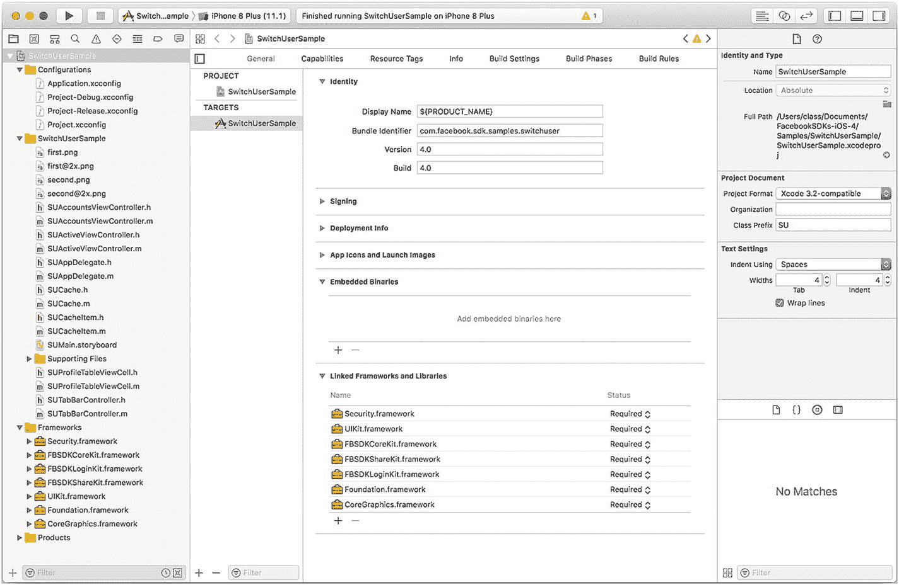

图 7-9

构建示例以获取框架

如果你将所需的框架拖入自己的应用，Xcode 会将其放置到项目中正确的位置。

你可以在开始时就为 Facebook 应用添加新的框架和功能，也可以在操作应用的任何时间进行添加。屏幕顶部导航器中的“我的应用”菜单（见图 7-10）允许你添加和重新配置应用的组件。

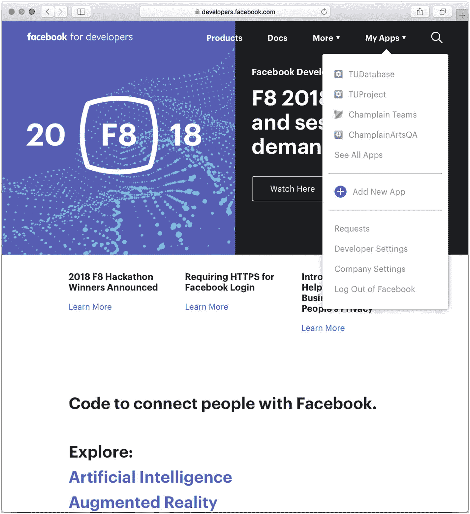

图 7-10

添加和修改你的 Facebook 应用框架和功能

从你的应用控制面板（图 7-10）中，你可以选择新的产品（功能），如图 7-11 所示。此界面会显示可用的产品及指向具体文档的链接，以便你决定要开发什么。

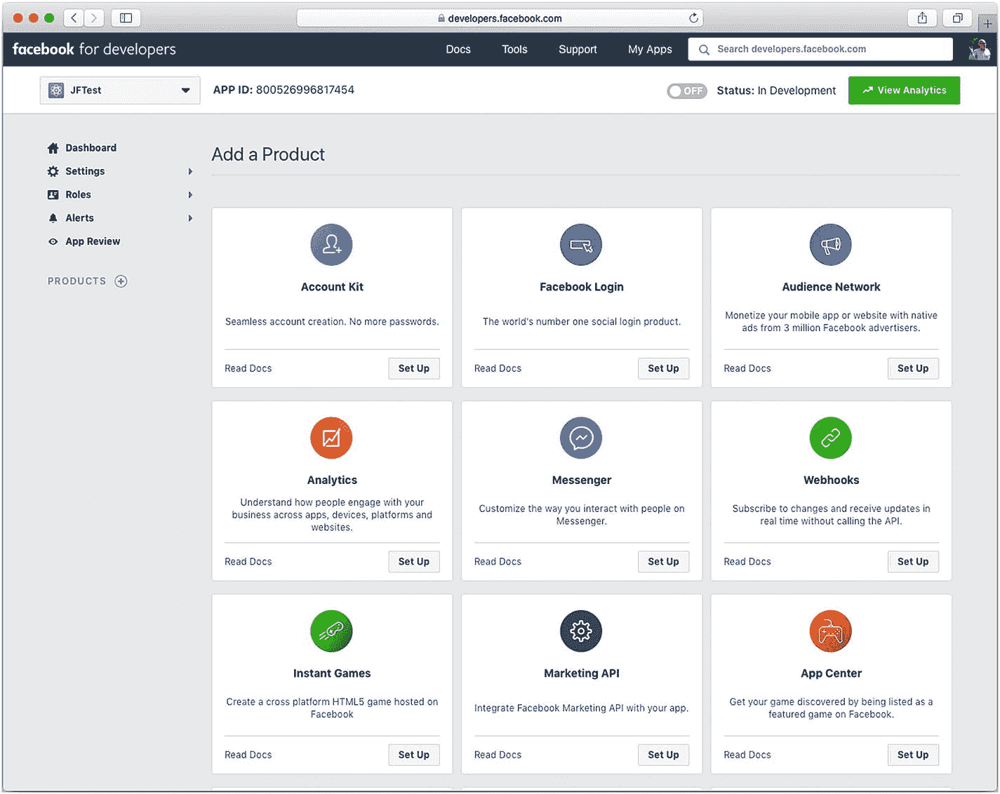

图 7-11

为你的 Facebook 应用添加产品


### 增强你的应用

如果你跟着本章的内容操作，应该已经构建出了前面图 7-3 所示的应用。这个应用可以运行并显示其故事板，但故事板恰好是空白的。为了继续推进，有必要在故事板中添加一些内容。

在应用中找到 `main.storyboard`，并为其添加一个标签（label），如图 7-12 所示。

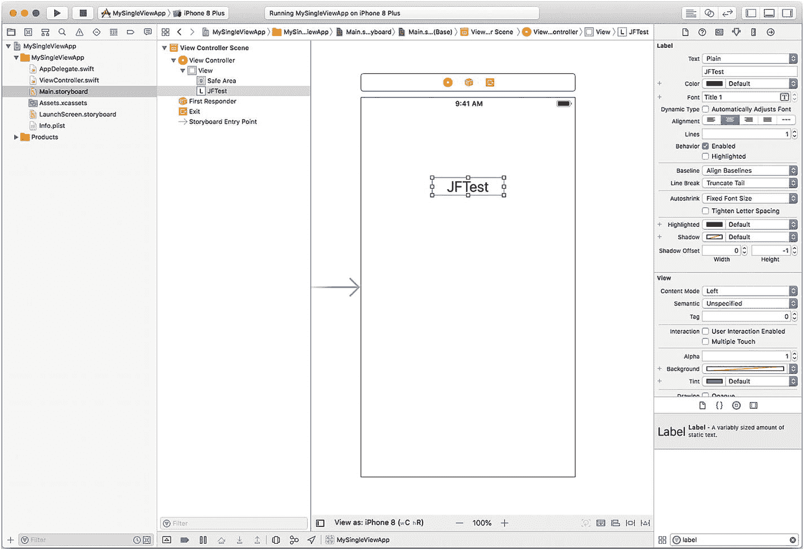

图 7-12

为应用添加一个标签

接下来，在你的应用中添加一个 Facebook 登录按钮。如果你按照之前构建 `SwitchUserSample` 示例的步骤操作，那么该应用中已经包含了 Facebook 登录框架，你可以直接将其拖拽到新应用中。或者，你也可以通过修改某个应用（如图 7-10 中“我的应用”所示），从图 7-11 展示的产品中添加 Facebook 登录功能。

一旦将 Facebook 登录添加到应用中，添加按钮的代码就很简单了。将其添加到应用的 `viewDidLoad` 方法中即可。（如果应用是基于本章描述的 `SingleViewController` 模板构建的，那么它会有一个名为 `ViewController` 的视图控制器。）

代码如图 7-13 及代码清单 7-1 所示。

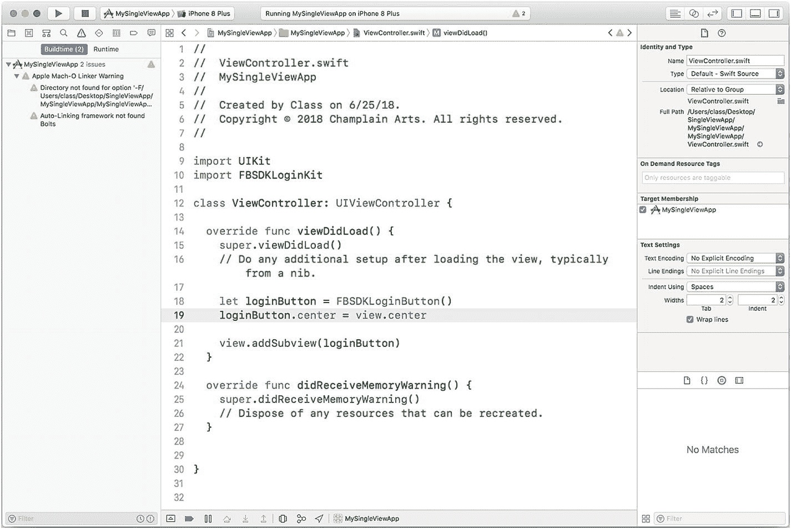

图 7-13

将 Facebook 登录按钮代码添加到 `viewDidLoad`

##### 注意

带有存根（stub）的基础 `viewDidLoad` 方法已经是 `SingleViewApp` 模板的一部分。

```
import UIKit
import FBSDKLoginKit
class ViewController: UIViewController {
override func viewDidLoad() {
super.viewDidLoad()
// Do any additional setup after loading the view,
// typically from a nib.
let loginButton = FBSDKLoginButton()
loginButton.center = view.center
view.addSubview(loginButton)
}
override func didReceiveMemoryWarning() {
super.didReceiveMemoryWarning()
// Dispose of any resources that can be recreated.
}
}
代码清单 7-1
添加 Facebook 登录按钮
```

重新构建你的应用（建议先清理构建文件，确保没有残留的测试代码）。现在，当你运行应用时，你应该能看到标签和按钮，如图 7-14 所示。

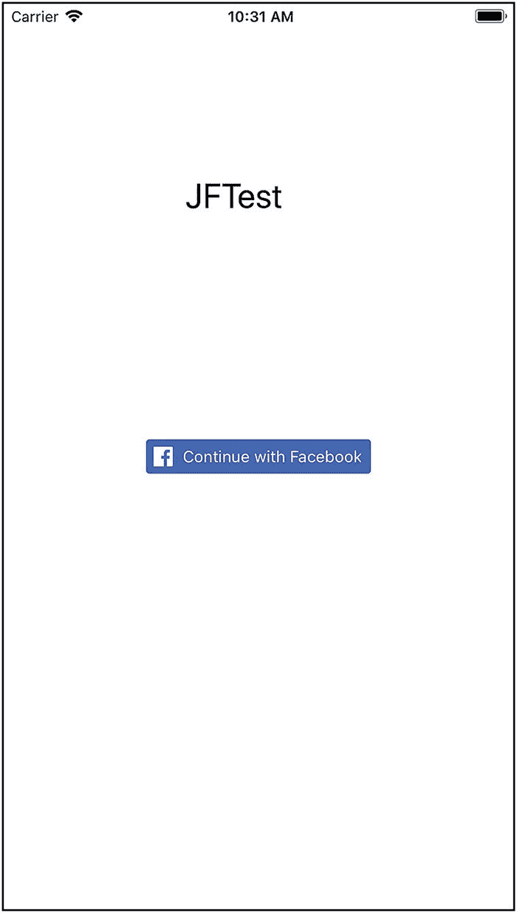

图 7-14

测试带有标签和登录按钮的应用

请注意，你添加的不仅仅是一个按钮图像：你实际上添加了登录按钮的功能。因此，当你运行应用时，系统会请求权限，如图 7-15 所示。

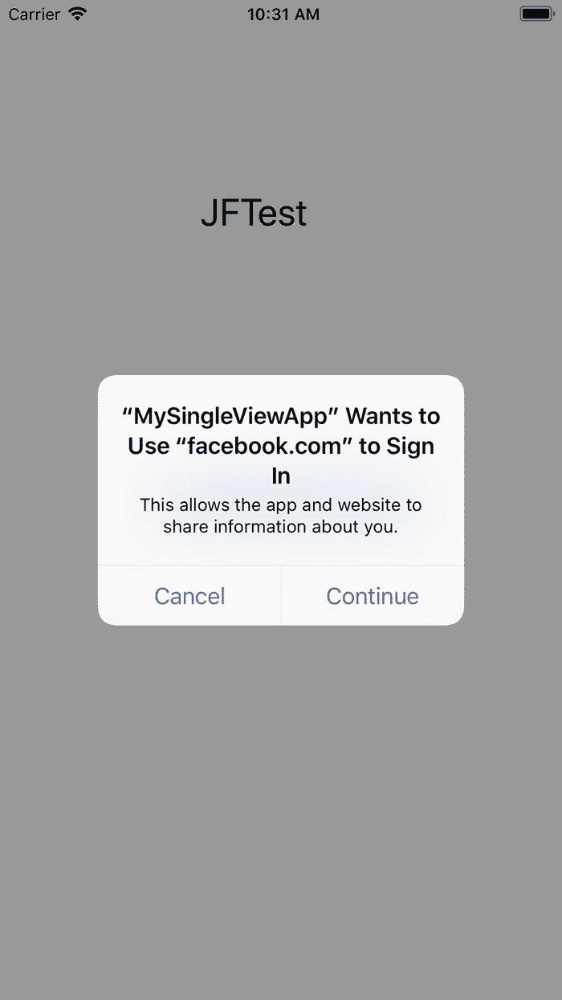

图 7-15

测试 Facebook 登录集成

登录按钮现在应该可以工作了。尝试使用它，如图 7-16 所示。

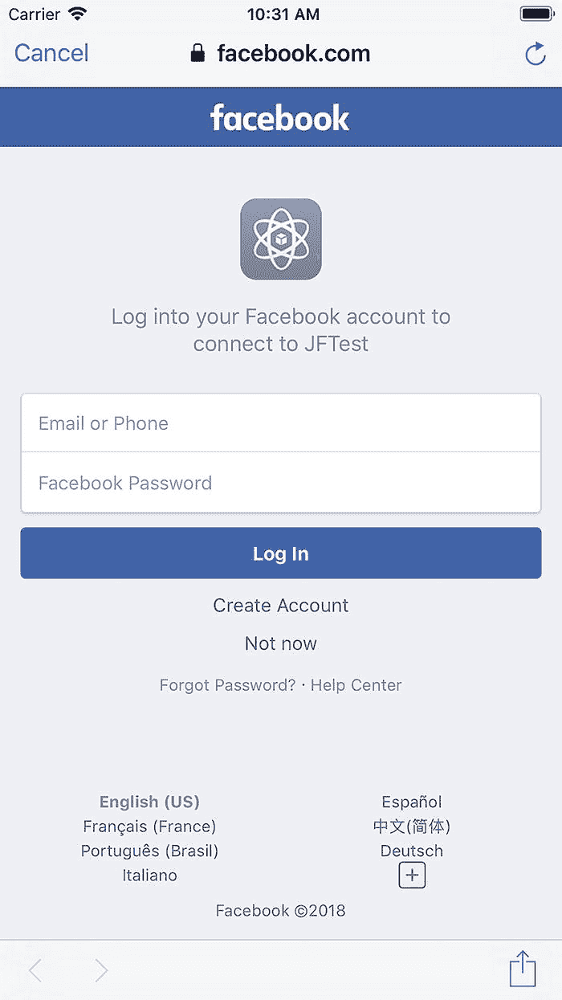

图 7-16

测试 Facebook 登录按钮

你也可以用自己的 Facebook 账户进行测试。此外，你可以搜索 `developers.facebook.com` 来获取可用的测试账户，从而避免创建虚假账户或影响你自己的账户。

##### 注意

一些开发者会使用自己的账户测试登录，但使用 Facebook 测试账户来添加信息。

### 总结

本章概述了如何集成 Facebook 和 iOS。具体细节可能时常变化，但总体思路基本保持不变。实际上，对于你可能想要集成到应用中的 Facebook 及其他框架的所有组件来说，情况都是如此。

