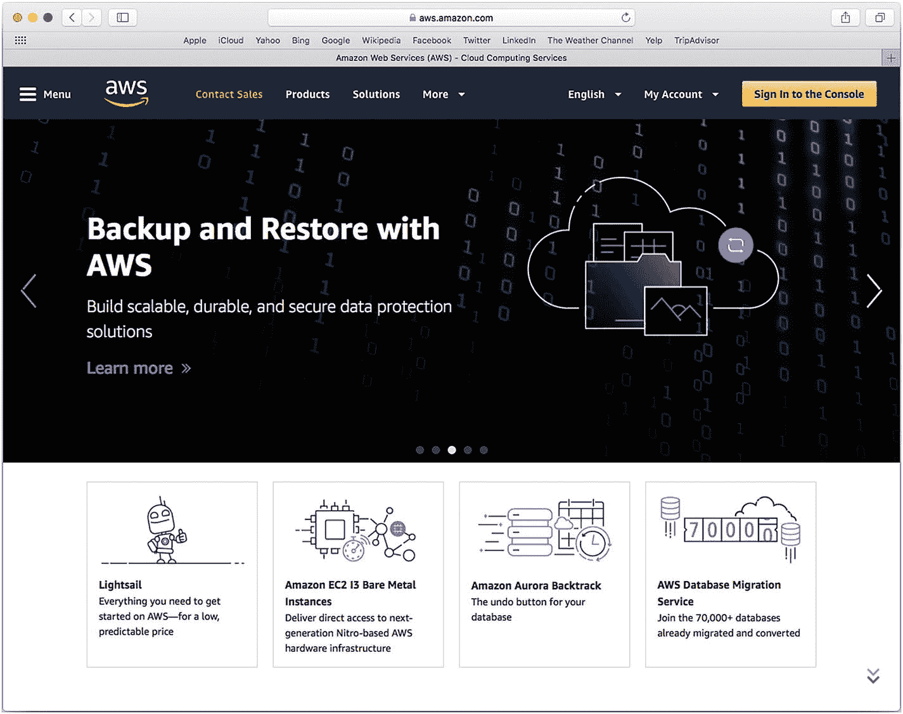
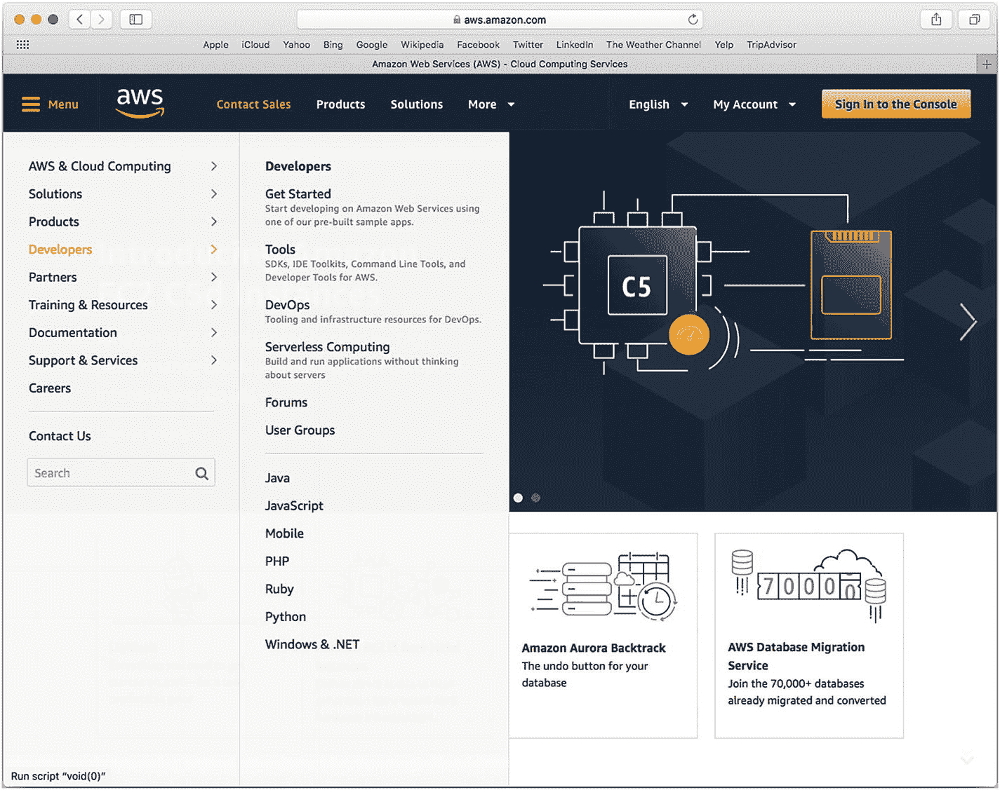
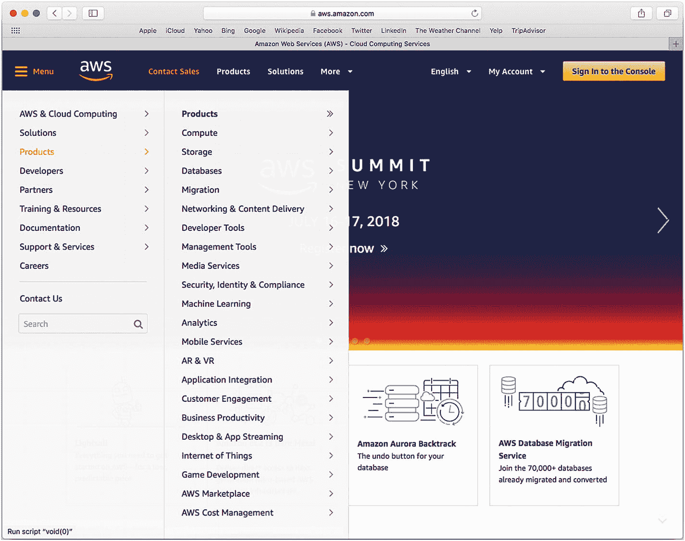

# 第四部分：在 Amazon Web Services 中存储数据

## 8. 使用 Amazon Web Services 和 Cocoa

在本书的第三至第五部分中，你将看到如何将第三方组件与 Cocoa 及其框架结合使用。这些组件可以是概念、标准或开源工具（如 `JSON`），也可以是特定工具，例如第三部分中描述的基于 Facebook 的登录功能。

本部分将介绍一个更为通用的工具：Amazon Web Services。（第五部分将介绍 `RxSwift`。）你将了解如何为你的应用创建一个 AWS 账户，安装来自 AWS 的相应下载内容，以及如何将其与你的应用集成。AWS 集成的重点是数据管理，但你也可以将 AWS 用于其他目的。

### 组件对比

`JSON` 是一种用于以简单方式读写结构化文本的工具。如今它非常普遍，许多语言、框架和环境（包括 Cocoa 和 Cocoa Touch）都支持使用 `JSON` 进行读写。

Facebook 登录工具（第三部分中描述）与 `JSON` 不同，它专为单一简单的目的而设计：验证用户凭据。与 `JSON` 和 Cocoa 及 Cocoa Touch 的紧密集成不同，Facebook 登录在 Cocoa 或 Cocoa Touch 一侧并没有集成：你只需将 Facebook 的一些方法、类或框架添加到应用中，然后 Facebook 提供的类就会去验证凭据，并返回“是”或“否”来决定是否允许访问。（这只是一个简化的过程描述。）

Amazon Web Services（AWS）是另一种不同类型的工具，具有不同的集成方式。它没有与 Cocoa 和 Cocoa Touch 显式集成。AWS 的功能对大多数应用至关重要，并且可以通过多种不同的方式提供。这些功能可以通过你为应用编写的代码提供；通过 GitHub 或其他地方提供的众多框架或库中的代码提供；或者作为 Cocoa 和 Cocoa Touch 一部分的代码和框架提供。AWS 成为应用的数据管理器，你需要在应用运行时与其持续交互（当然，这取决于应用的具体设计）。

##### 注意

在本章的其余部分，除非需要区分，否则 *Cocoa* 将用来指代 Cocoa 和 Cocoa Touch 两者。

### 将 AWS 与 Cocoa 结合使用

如前所述，将 AWS 与 Cocoa 和 Cocoa Touch 集成有多种方式。最简单的方式是，你可以像使用 Facebook 登录工具或像使用开源工具、框架或 `JSON` 这样的标准一样使用 AWS（更具体地说，是使用 AWS 的一个或多个组件）。在这些情况下，你需要考虑一个集成了 AWS 的 iOS 或 macOS 应用。

在另一个极端，你可以将 AWS（更具体地说，是一个、多个或许多组件）作为应用的核心。

在这两种情况下，用户界面都被设想为使用 Cocoa 或 Cocoa Touch 构建。问题在于，应用基本功能的实现是在哪里完成的——是在 AWS 中还是在 Cocoa 中？

##### 注意

你可以将应用的一部分功能放在 Cocoa 侧，而将其他部分功能放在 AWS 中。根据你的环境，将功能集中在一侧或另一侧可能是可取的，但这仅是个人观察，并非建议。

本章的概述可能有助于你思考应用的可能性。有四个要点值得考虑：

*   与他人共享数据
*   跨平台使用数据
*   发挥自身优势
*   迎合用户期望

以下各节将讨论这些要点。

#### 与他人共享数据

当您与他人讨论应用时，人们通常会想到在手机上输入数据，并让其他人（或用户本人在其他时间）在另一台设备上查看和修改这些数据——甚至可能是在位于地球另一端桌面上的个人电脑上操作。

这个我们都很熟悉的常见场景实现起来却颇为复杂。通常，数据需要存储在某个位置，而这个"某处"不能仅仅局限于原始手机，因为当手机超出范围甚至关机时，数据仍需能被他人看到。

存储这些持久化数据最常见的方式之一，是使用基于云的服务，例如 `AWS`、`Box`、`Azure`、`Dropbox` 或 `FileMaker`（版本 17 或更高）。您也可以使用网页（尤其是通过 HTML5）来存储数据，但必须将其存放在可达的位置。

#### 跨平台使用数据

存储需要共享的数据有多种方法。从事过各类数据项目的人普遍认为，改变数据管理策略并非易事，而且随着数据量的增加（就像老系统的情况一样），管理会变得更加复杂。人们常常忽略了他们对数据自动处理的"魔法"期待。

除了那些不存储任何数据（并且永远不存储）的项目之外，思考如何共享数据是值得的。以下是关于如何处理数据管理问题的一些基本考虑因素和建议。为将来才会实施的数据管理策略做规划，远好过听天由命（或依赖"魔法"）。换句话说，你不必一开始就实施，但至少要有一个未来管理数据的计划，即使这个计划只是将来再重新审视这个问题。确保这是对数据管理理念的"再次审视"，而非"初次接触"。

#### 备注

本节重点讨论数据，但如今也可以将应用的部分或全部处理过程迁移到云端。事实上，在许多情况下，数据和处理之间的界限很难界定，因为两者往往可以相互转换。

基本的数据场景及可能的解决方案如下：

- **无数据**。不存储任何数据，且永远不会存储。

- **单用户/单设备**。数据仅为单个用户和单个设备存储。这通常是临时数据的特殊情况。例如，一个能记住上次计算总数的计算器应用（就像普通计算器那样）。你可以使用 Cocoa 的 `UserDefaults.standard` 在设备上存储相对少量的数据。

  "相对少量"这个标准随时间推移已有所增加，但 Apple 文档指出这取决于设备本身。这很合理，因为设备存储空间会越来越大。网络讨论中曾出现存储量达到 4 GB 的案例。

  这些数据可能会随设备的常规备份一起备份（如果用户开启了备份功能）。

- **单用户/多台 iOS 设备**。此场景使用用户的 Apple ID 和 iCloud 实现最为简便。可用空间大小受限于用户订阅的 iCloud 数据套餐以及已存储的其他数据量。

  作为 iCloud 服务的一部分，iCloud 数据会自动备份。然而，如果其中一台设备无法连接，其数据可能无法及时上传到 iCloud，并且除非应用妥善处理了 iCloud 冲突（例如由用户解决冲突），否则数据可能并非您和用户所预期的内容。

- **多用户/多台 iOS 设备**。`CloudKit` 是处理这种情况的理想工具。由于它依赖于 iCloud，备份会自动完成。

- **多用户/多台设备（或仅拥有非 iOS 设备的单用户）**。这种情况通常最适合使用按需云服务，例如 `AWS`、`Box`、`Dropbox`、`Google Drive`、`OneDrive` 或类似服务。备份属于服务的一部分。

  并非所有应用都需要按需存储，但这是此处提到的大多数服务都具备的功能。

#### 发挥自身优势

有了基于云计算和数据的能力，您可以选择各自的存放位置。上一节中给出了一些关于数据的建议，但对于任何项目，明智的做法不仅是基于技术层面做出选择，还要考虑您开发团队的技能和优势——无论团队是有 50 人还是只有您自己。

#### 迎合用户期望

谈到用户对共享数据的期望，用"过度使用"来形容不切实际的期望并不为过。但还有另一种同样危险的期望：期望共享数据能够采用大型机时代（有时甚至是穿孔卡片时代）最新、最棒的技术来构建和共享。数据结构的生命周期非常长。部分原因是所谓的"既有基础的拖累"——即尽管时代和能力已变，仍需维持系统运行。

使用诸如 `AWS` 之类的共享数据工具的一个好处是，您和您的用户可能会面对对所有人而言都很陌生的技术和界面。

### 探索 AWS

在考虑了共享计算和共享数据的问题之后，现在是时候对 AWS 进行一个高级概览了。本节将提供这一概览。在下一章“在 Cocoa 中管理 AWS”中，你将更深入地了解 AWS 以及如何将其与你的应用集成。请记住，AWS 是一个非常丰富的工具集，其内容远非这几章所能涵盖。这里的目的是让你了解有哪些可用服务，以便你至少能够决定是否要为你的项目进一步深入探索 AWS。

##### 注意

AWS 是一种基于 Web 的技术，这同样适用于其网站和技术。本章中你看到的截图和执行的步骤可能会有所不同；但总体流程可能是一致的。可以合理地假设，本章中介绍的部分 AWS 组件可能会得到增强，可能会新增一些组件，也可能会有一些被弃用。

#### AWS 入门

起点是 `aws.amazon.com`，如图 8-1 所示（随着时间的推移可能会有所调整）。

图 8-1

开始使用 AWS

作为开发者，你通过使用右上角的按钮在控制台中进行与 AWS 的交互。在整个 AWS 网站中，你还会找到其他指向控制台的链接。你可以不登录控制台就浏览网站，但要实际进行操作，你需要一个账户。你将在第 10 章“管理 AWS 登录”中了解如何设置你的账户。

现在，请探索左上角的菜单，如图 8-2 所示。

图 8-2

浏览 AWS 上的开发者资源

图 8-2 提供了可供开发者使用的资源的高级概览。即使 AWS 发生变化，`Developers` 菜单也基本保持不变。

`Products` 菜单，如图 8-3 所示，会随着 AWS 添加更多产品和功能而发生变化。浏览此菜单以了解可以集成到你应用中的工具和产品是值得的。

图 8-3

AWS 产品

#### 比较用于数据管理的 Cocoa 和 AWS 产品

你可以使用这些 AWS 产品构建一个完整的应用（这当然就是 AWS 的理念）。唯一缺失的就是用户界面。你可以使用基于 Web 的工具（如 HTML5）来提供界面。然而，对于最强大、最灵活的界面，我们更倾向于使用 `Cocoa` 和 `Cocoa Touch` 这些工具。

如果你查看产品列表，你会发现它们是应用后端的基石。在 `Cocoa` 和 AWS 之间最常见的集成形式之一是数据管理，这也是本书这一部分探讨的主题。`Cocoa` 中可用的数据管理工具主要面向个人，因此共享数据管理需要（至少在现阶段）使用 `Cocoa` 之外的工具来实现。

`SQLite` 已内置于 `Cocoa` 中，但它是一个个人数据管理库；它不管理数据共享。`iCloud` 是苹果处理数据共享的技术，但它主要侧重于在同一个 `AppleID` 内进行共享。（`CloudKit` 确实提供了一些更广泛的数据共享功能。）

`Core Data` 是 `Cocoa` 中一个强大的数据持久化工具。它不是一个数据管理器；相反，它被设计为任何符合 `Core Data` 结构的数据管理工具的前端。多年来，在苹果产品的各种形态中，多种数据管理工具已经与 `Core Data` 集成。

### 总结

本章介绍了 Amazon Web Services (`AWS`) 的高级视图，以及其工具如何与 `Cocoa` 配合使用。`AWS` 可用于构建整个应用，但通常 `AWS` 提供后端，而 `Cocoa` 提供前端界面和功能。

在下一章中，你将了解如何登录并开始将 `AWS` 与一个应用集成。

