# 9. 管理 AWS 登录

在第 8 章中，你了解了 `AWS` 提供的各种服务（参见图 8-3 的产品列表）。当使用那些触及应用诸多方面以及用户生活细节的产品时，安全性至关重要。（这同样适用于你自己的应用、苹果的应用和框架，以及像 `AWS` 这样的第三方产品。）

登录 `AWS` 被设计成一个安全的过程，它将对 `AWS` 的不同部分以及你应用的不同部分进行隔离。这是通过本章第一部分概述的登录结构来实现的。

在本章后面的部分，你将找到关于如何使用 `Xcode` 将 `AWS` 集成到应用中的更多细节。由于每个人使用 `AWS` 的方式各不相同，你会遇到许多对你来说重要的选项和功能，而其他一些则可以暂时（或永远）搁置。在开始将 `AWS` 集成到应用时，你可能需要回顾以下在各菜单中找到的项目，它们可能很重要：

* 登录（图 9-2）
* Mobile Hub（图 9-9）

### 关于 AWS 账户与根用户

您可以通过 `aws.amazon.com` 访问 AWS。您可以浏览第 8 章所述的某些功能和文档，但要执行更多操作（例如在应用中使用 AWS），您需要登录。

**注意：** 本章所述的登录是开发者登录，用于构建您的 AWS 资源。一旦这些资源构建完成并与您的应用一起部署，用户将自行登录您的应用，或者在多数情况下，您的应用会在无需用户干预的情况下自动登录。

您可以从 `aws.amazon.com` 的许多位置创建新的 AWS 账户——只需查找“创建新 AWS 账户”链接即可（措辞可能会随时间变化）。如图 9-1 所示的页面将会出现。

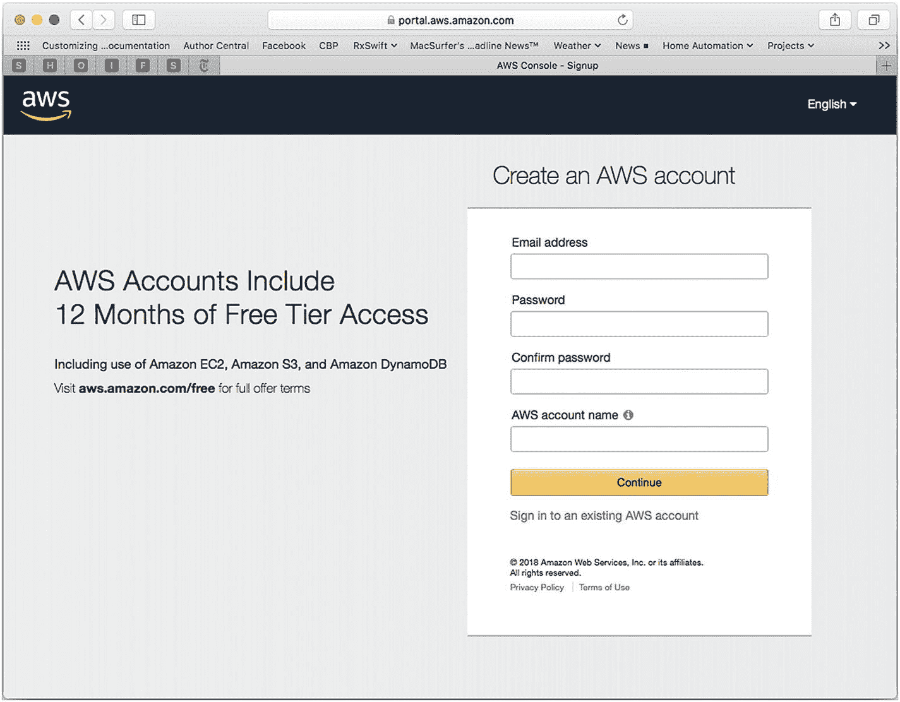

**图 9-1** 创建新 AWS 账户

创建新账户的过程相当直接。正如“AWS 账户名称”字段旁边的小信息按钮所示，您可以现在选择一个账户名称，稍后也可以更改。您的 AWS 账户标识符通常不可见——您的电子邮件地址与其关联，并且与密码一样，电子邮件地址也是可以更改的。

一旦您拥有账户，就可以按照图 9-2 所示进行登录。

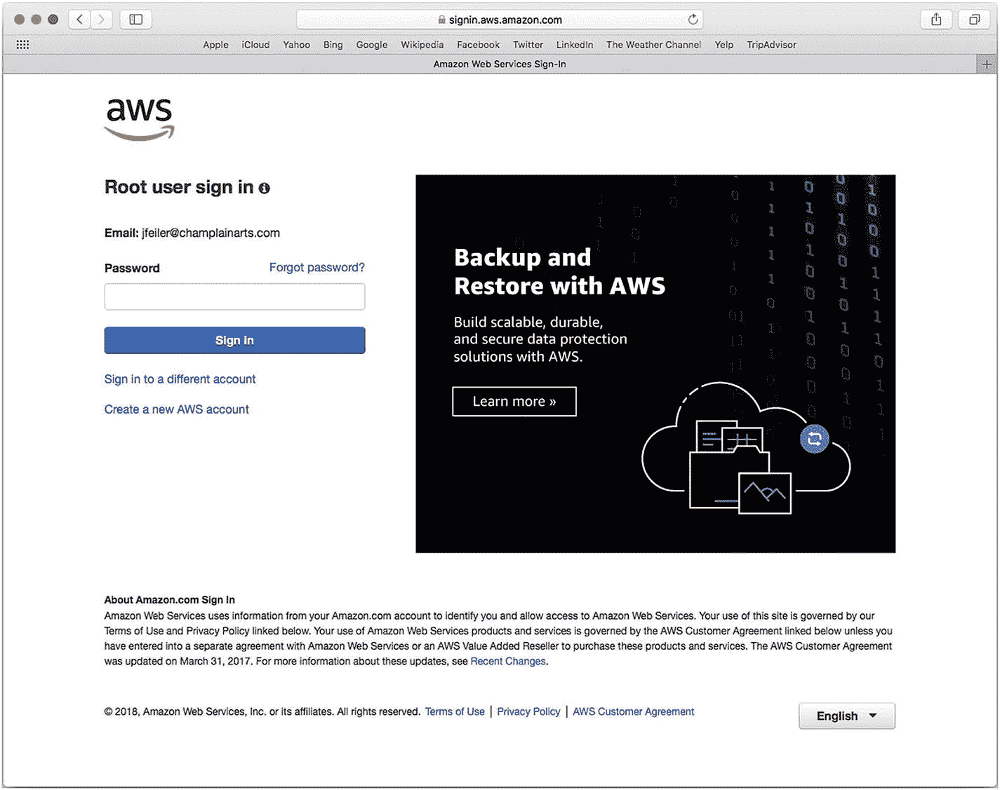

**图 9-2** 以根用户身份登录

根用户就是账户的根用户。您将看到，您可以拥有与账户关联的其他用户。您可以通过以根用户身份登录，然后设置其他访问账户来实现这一点。这使您可以在整个账户中拥有多个账户，而不会危及安全性。

**注意：** 与所有根用户或超级用户一样，不要将该登录信息用于真正的根用户或超级用户操作之外的任何目的，例如添加或删除其他用户。

如图 9-3 所示，一旦您的账户部分设置完成，您就可以立即访问。请使用“我的账户”下拉菜单进行此操作。

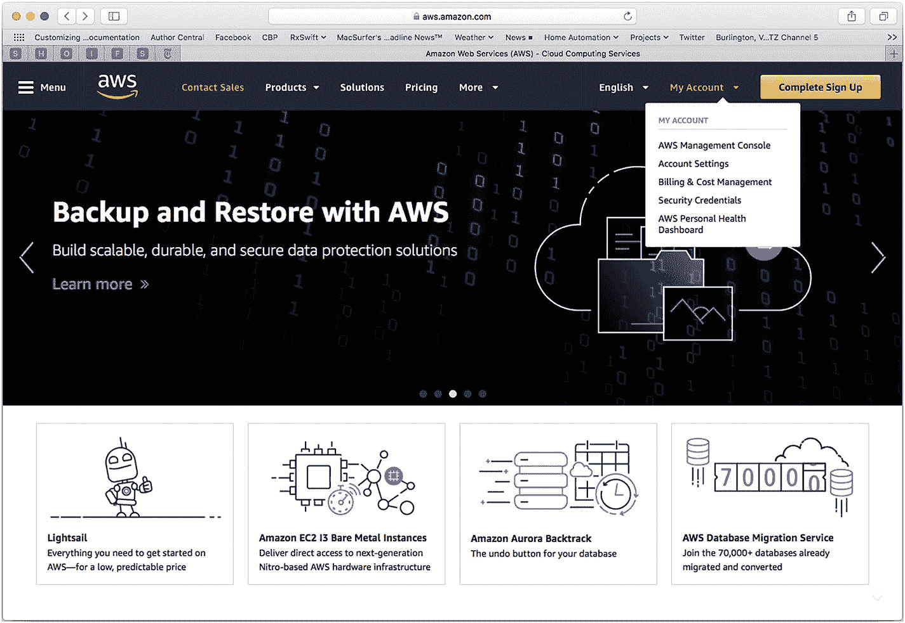

**图 9-3** 使用根用户登录访问您的账户

如果您尚未完成注册，选择“我的账户”中的任何项目都会要求您使用图 9-3 所示的页面进行登录。

如果您选择了与 AWS 身份与访问管理 (IAM) 相关的项目，您将看到如图 9-4 所示的指引，将您导向 IAM。

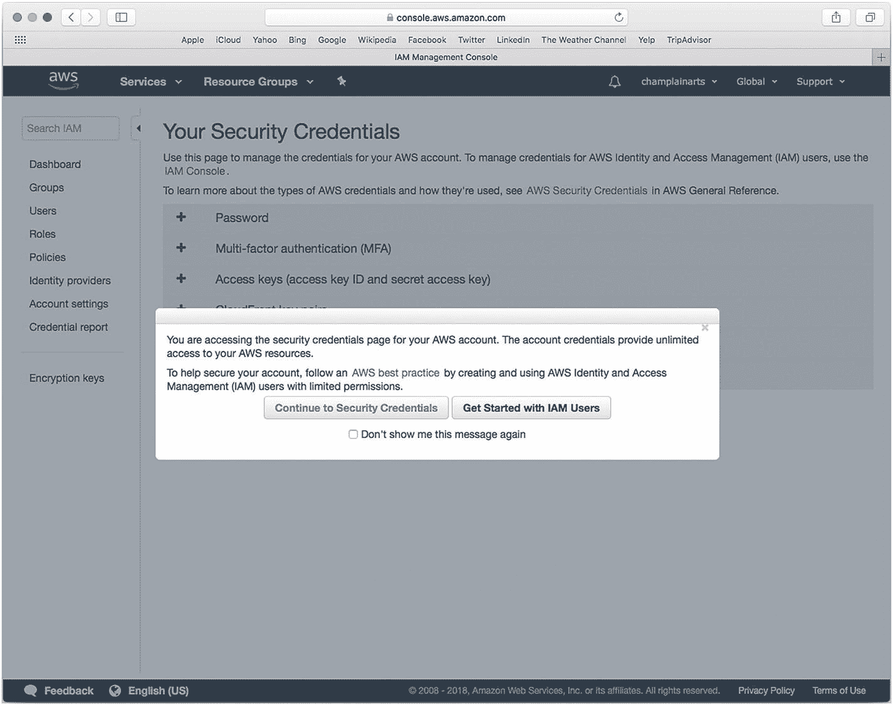

**图 9-4** 系统会警告您正在使用 AWS 账户

如果您继续前往诸如账户安全凭证之类的区域（而非 IAM 用户的设置），系统会允许您这样做，如图 9-5 所示。

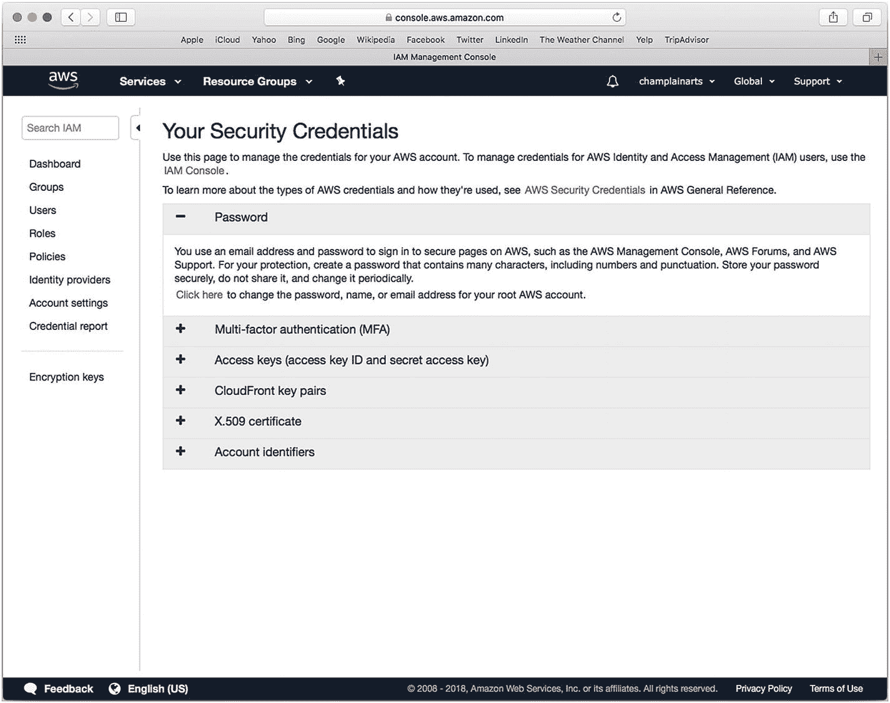

**图 9-5** 使用根用户登录配置账户设置

### 创建组织

您可以创建一个 AWS 账户（所有 AWS 账户），该账户拥有根登录权限。然后您可以向其中添加个人。您还可以创建一个组织，该组织由多个 AWS 账户组成。从右上角的账户菜单执行此操作，菜单中会显示您的账户名称。您在图 9-5 的右上角以及图 9-6 中再次看到了账户名称 (champlainarts)。

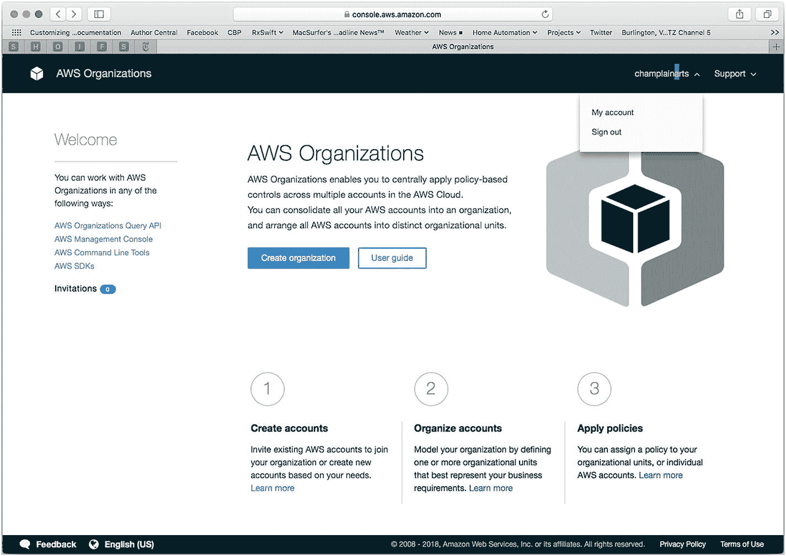

**图 9-6** 从您的账户菜单创建组织

### 使用 IAM

由于最佳实践是不使用根用户登录，您可能会好奇如何操作 AWS。答案是使用内置的身份与访问管理 (IAM) 工具。当您完全登录后，您会在视图左上角看到一个“服务”菜单，如图 9-7 所示。

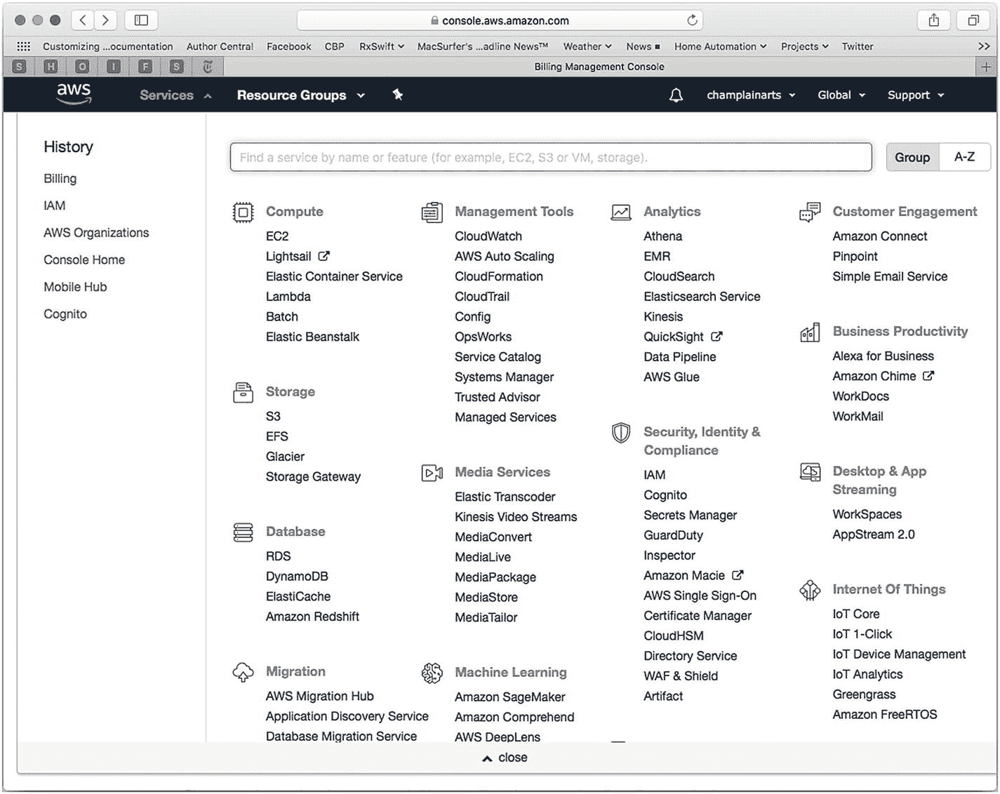

**图 9-7** 浏览服务

**注意：** 浏览“服务”中的各种链接以查找选项和您历史记录。您将看到的项目包括最近查看过的项目，因此您会看到不同的菜单及其项目序列。除了基本的单一登录流程之外，没有固定的“先做这个后做那个”的序列。本章提供一个概述，但您可以根据需要尝试使用菜单。

如果您选择 IAM，您将能够检查其设置，如图 9-8 所示。

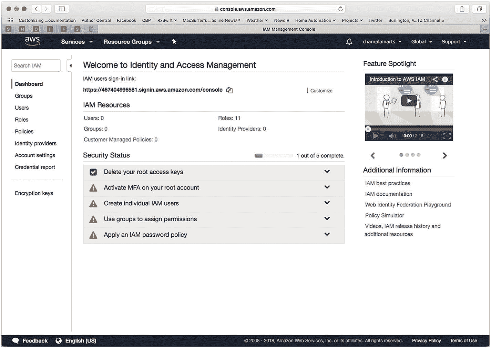

**图 9-8** 配置 IAM

要开始使用代码，请从“服务”（或“历史记录”，如果您已经查看过）中选择 Mobile Hub 服务，如图 9-9 所示。

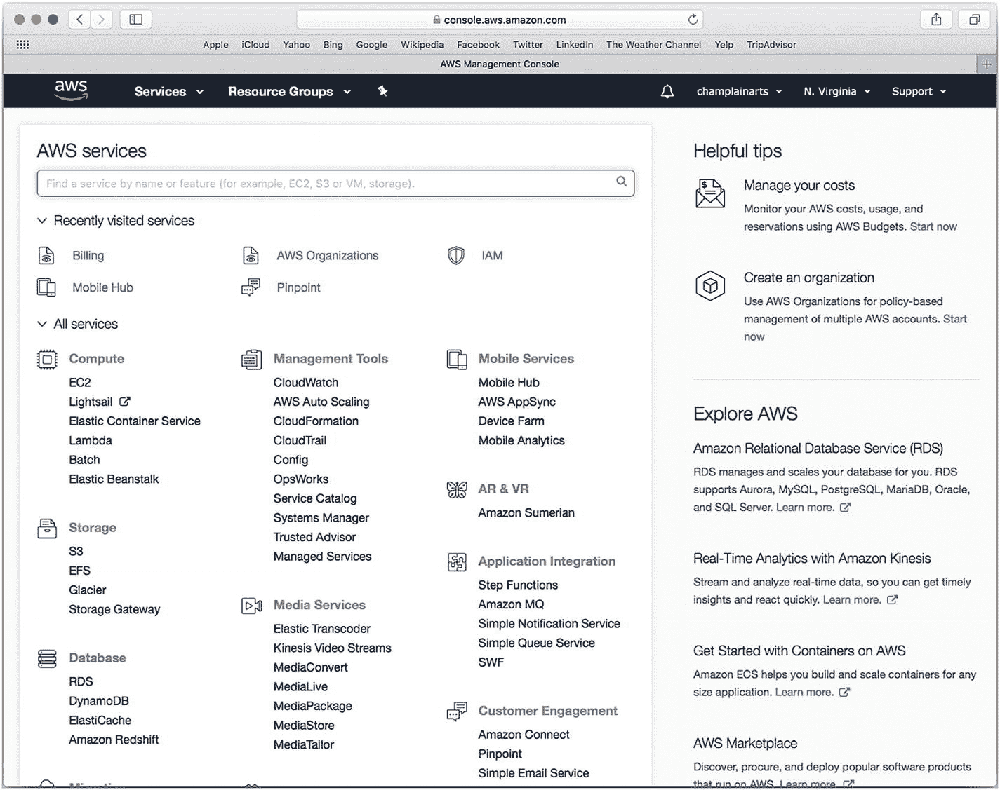

**图 9-9** 选择 Mobile Hub

### 将 AWS 与 Xcode 集成

AWS Mobile Hub 是您处理代码的地方。如果您有一个项目，您可以将 AWS 添加到其中，如图 9-10 所示。

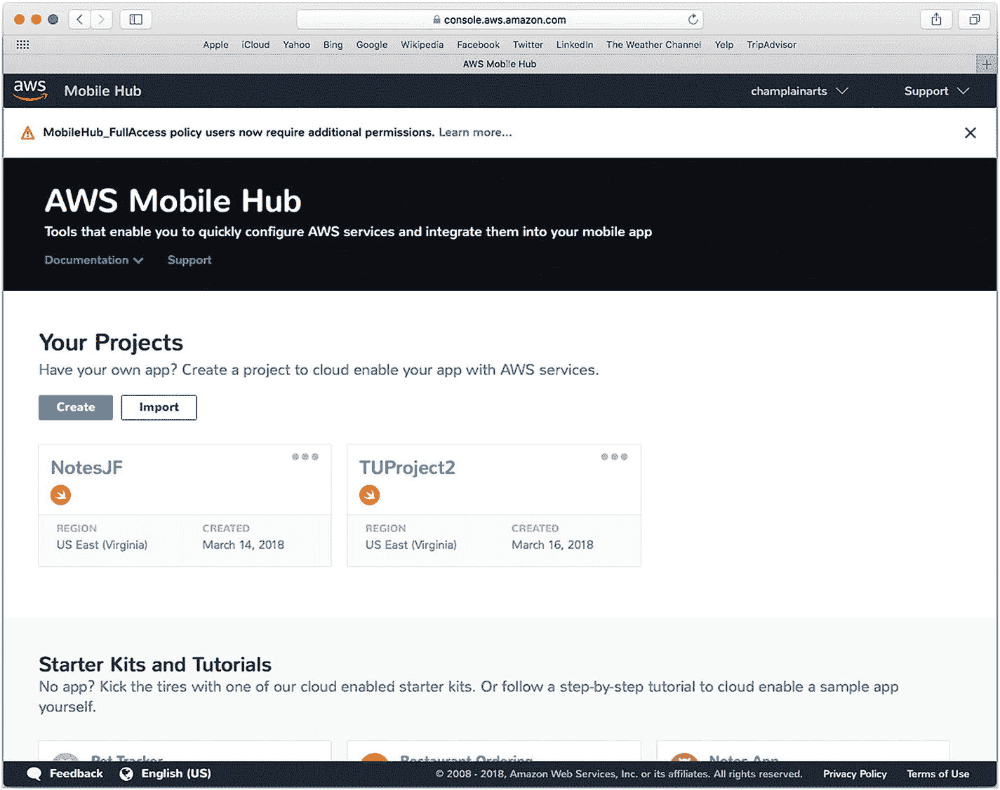

**图 9-10** AWS Mobile Hub

除了创建您自己的 Xcode 项目，您还可以从 AWS 入门套件开始，如图 9-11 所示。

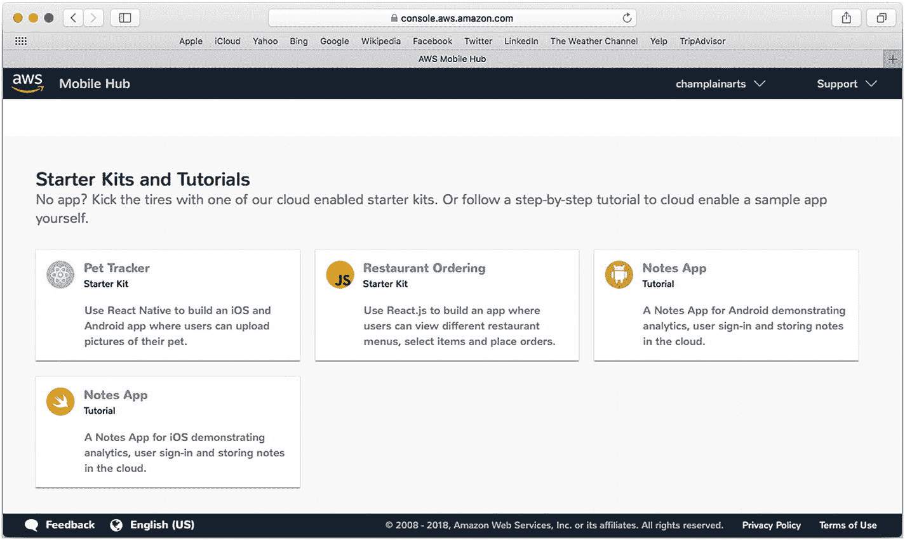

**图 9-11** AWS 入门套件和教程

### 本章小结

本章总结了当您开始将 AWS 集成到您的应用时，对您而言至关重要的部分。这需要进行设置（例如设置 AWS 账户），并且需要您有一个准备添加 AWS 的项目。您现在应该明白了如何在 Mobile Hub 中开始管理此类项目。下一章将向您展示如何为 AWS 设置一个项目。完成此操作后，您就可以构建您的应用了。

