# 开始一个 AWS 项目

使用 Amazon Web Services (AWS) 最常见（也是最简单）的方式之一就是用于数据存储。如果您已按照上一章所述创建了一个 AWS 账户，您可以按照本章中的指南和教程来构建一个与 AWS 集成的 iOS 应用。

首先，您将了解如何设置将与 AWS 集成的 iOS 应用和 iOS 项目。之后，您将了解要执行的具体细节。您可以在 iOS 应用和 AWS 项目之间来回切换。

### 设置 iOS 应用

由于本书建立在您对 iOS 的了解之上，并假设 AWS 对您来说相当陌生，因此重点将放在 iOS 项目上。您可以构建一个使用 AWS 的 iOS 项目来轻松入门；这将为您创建一个新的 iOS 应用。

该步骤如图 10-1 所示，因此这是快速入门的好方法。一旦您构建了第一个 iOS/AWS 项目，您就可以轻松地从 AWS 端开始，然后添加 iOS 组件。

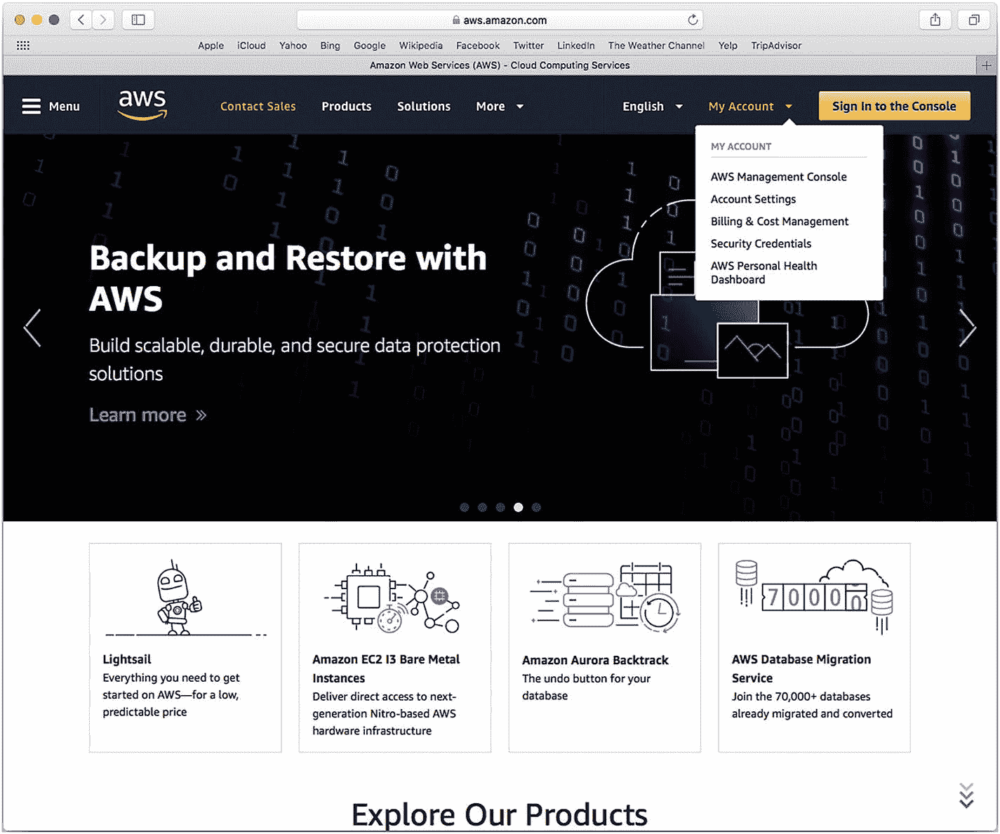


### 设置 iOS 项目

首先，通过 `aws.amazon.com` 右上角的按钮或“我的账户”下拉菜单（位于控制台登录按钮旁）中的“AWS 管理控制台”选项，登录控制台。这两种方式均如图 10-1 所示。


图 10-1

开始管理你的 AWS 账户

像往常一样，你需要登录你的 AWS 账户，如图 10-2 所示。

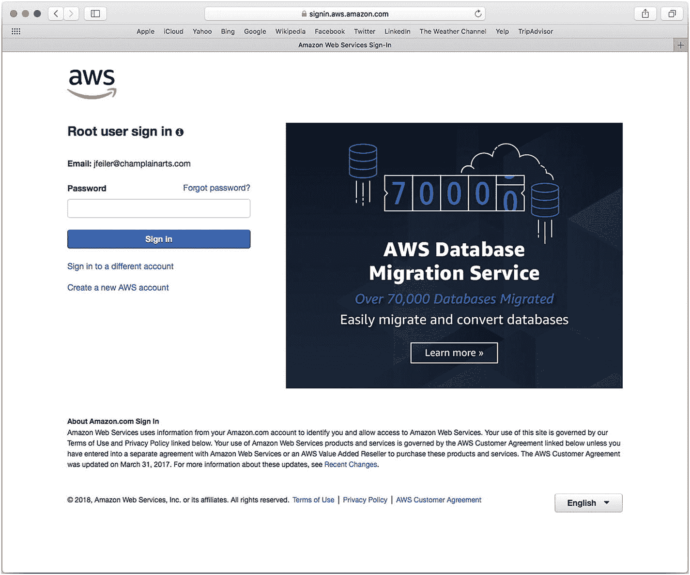

图 10-2

登录你的 AWS 账户

请记住，虽然你可以以根用户身份登录账户，但你应该使用已创建的其他账户之一，如第 9 章所述。如果你可以选择登录根账户，并且你已有特定账户，则请登录其他账户，如图 10-2 所示。

登录后，你可以进入 Mobile Hub，这就是你的目标位置。如果它是较新的服务，可能很容易找到，如图 10-3 顶部所示。否则，在服务选择主页面第三列服务的顶部“移动服务”下查找它。

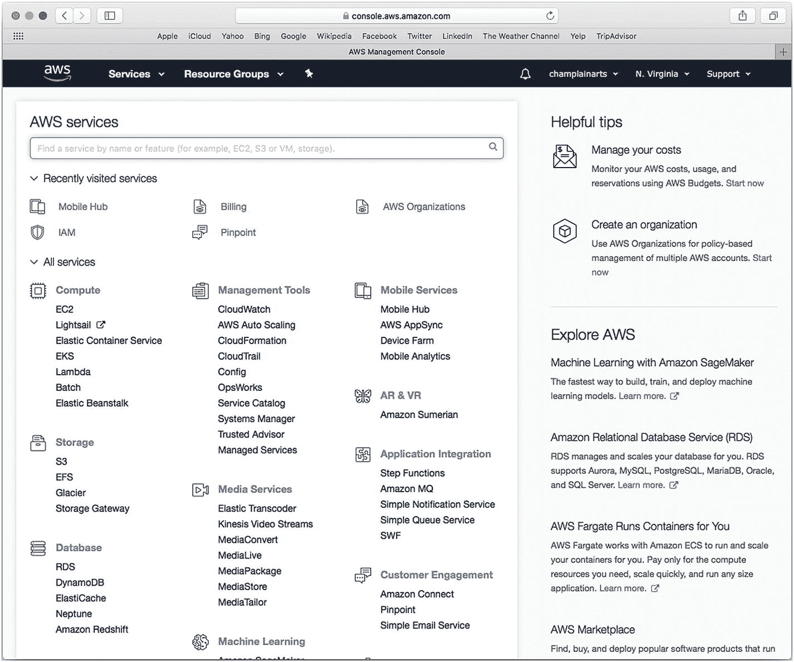

图 10-3

从“移动服务”或“最近访问的服务”中选择 Mobile Hub

##### 注意

请记住，随着 AWS 的发展，可用服务会不时变化。你也可以使用视图顶部的最近黑色工具栏，如图 10-4 所示。

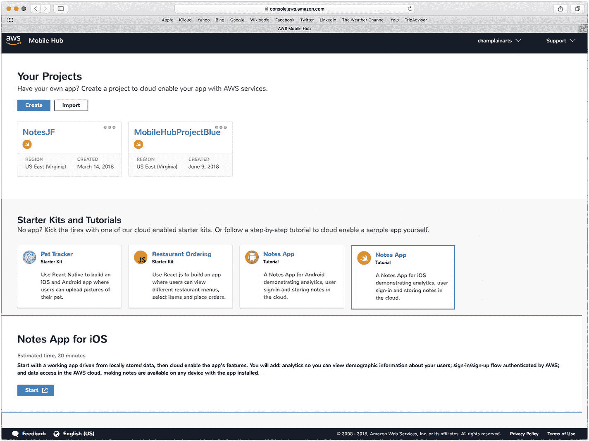

图 10-4

在 AWS Mobile Hub 中查看你的项目

如果你选择 Mobile Hub，你将看到项目列表（如果已创建），如图 10-4 所示。你也可以使用入门套件或教程开始操作。

### 探索文档

云计算的理念已经存在很长时间了。它最早在 1993 年兴起的“瘦客户端”计算时代被提及，有些人认为这是自 20 世纪 50 年代以来分布式大型机系统中使用的“哑”终端的演变。

尽管基本架构并非新事物，但它与 Web 及其他现代技术的集成为当今应用程序执行的大量数据共享提供了一个平台。AWS 完美契合了这种模式，但你需要了解其实现的具体细节，才能将 AWS 与自己的应用程序集成。

本章剩余部分将帮助你继续实现这种集成。实施中需要考虑的第一步是，你可以在哪里找到帮助和信息。AWS 的开发人员文档可通过 `aws.amazon.com` 获取。你可以在许多 AWS 页面的右上角找到文档 PDF 版本的链接。文档及其链接可能会不时更改，但如果你从图 10-3 所示的服务中选择 Mobile Hub，你就能看到你的项目，如图 10-4 所示。

请注意，当你看到项目时，还会看到指向“支持”的链接，如图 10-4 右上角所示。选择“文档”将带你进入文档页面，如图 10-5 所示。

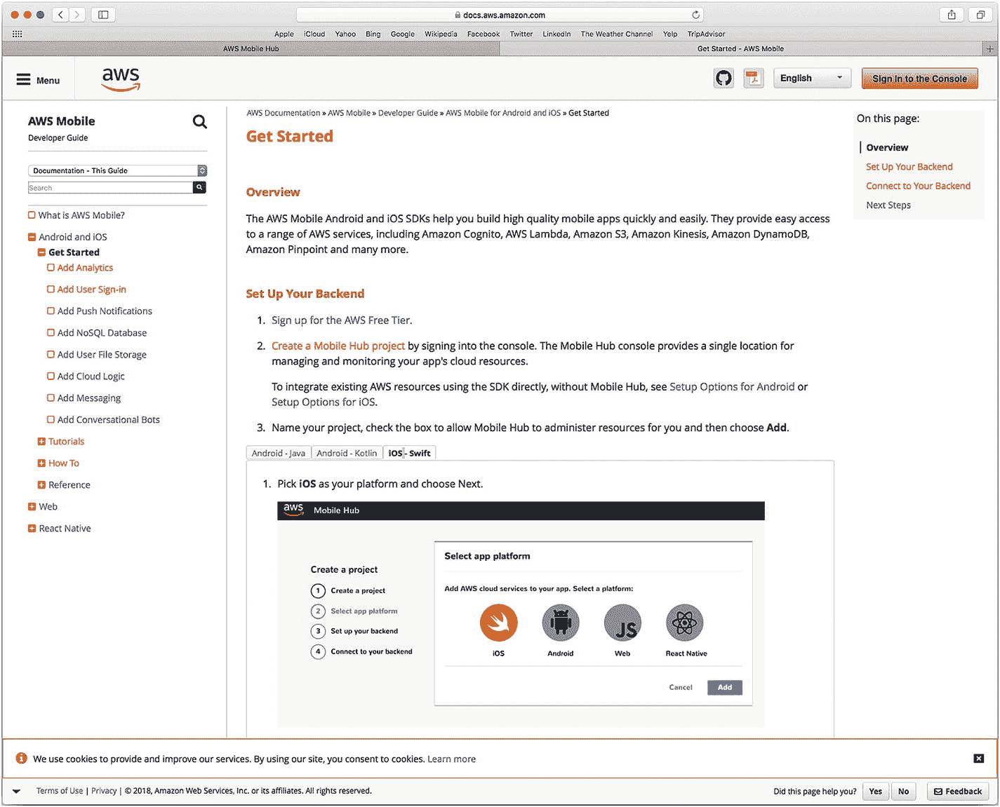

图 10-5

你可以下载 PDF 格式的文档

右上角有一个按钮，允许你将文档下载为 PDF 文件。在撰写本文时，该 PDF 文档超过 400 页，因此许多开发人员选择使用各种在线版本。文档分为四个基本部分：

-   *入门*（如图 10-5 所示）正是如此——你需要采取的入门步骤。本节对其进行了总结。
-   *教程* 让你通过构建应用或应用的一部分来探索 AWS。如图 10-5 所示，它们适用于 iOS 和 Android。
-   *操作方法* 文档让你学习如何完成特定任务。
-   *参考* 是了解教程和操作方法文档背后信息的来源。

所有这些内容都可能随时间变化。如果你刚开始接触 AWS，遵循其中一个教程可能会取得最佳效果。如果你期望仅实现某个特定功能而中途跳入某个教程，那么在你对 AWS 更加熟悉之前，可能不会那么成功。

### 创建项目

从图 10-5 所示的“入门”页面，你可以开始构建一个集成了 AWS 和 iOS 的简单应用。以下是需要采取的步骤。

##### 注意

在 AWS 文档中，你会在多个地方找到这些启动信息，包括“操作方法”、“入门”、“教程”和“参考”。在你对本章描述的整个流程感到熟悉之前，你可能希望尝试使用其中某一个序列进行操作，因为这些序列之间存在细微差异，切换起来可能会让人感到困惑。

首先，选择 iOS 平台，如图 10-5 所示。如果你尚未创建项目（如图 10-4 所示），请立即创建并选择其平台。


#### 设置后端

下一步是设置后端，它将负责管理 iOS 与 AWS 之间的集成。如果你在图 10-5 所示的界面上点击了“添加”，那么你应该已经准备好设置后端了，如图 10-6 所示。

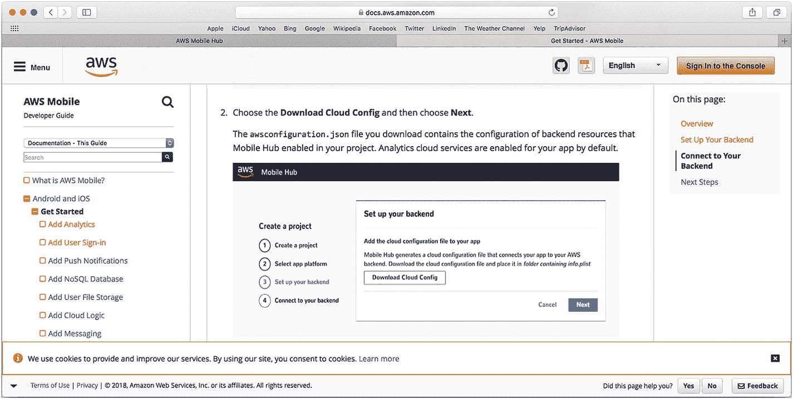

图 10-6

设置你的后端

按图 10-6 所示，通过下载 Cloud Config 来设置后端，以配置云连接。然后，点击“下一步”。

图 10-7 展示了一个在下载后端之后的基本 iOS Xcode 应用——它可以是您自己创建的应用，也可以是一个入门套件或教程应用。（相关文件应在您的 `Downloads` 文件夹中。）项目中的文件应该对您来说很熟悉。（默认情况下，入门套件可能命名为类似 `aws-mobile-ios-notes-tutorial-master` 的名字。）

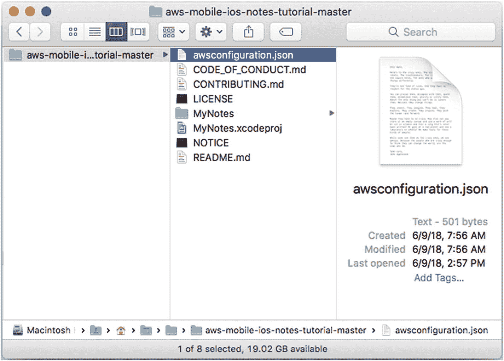

图 10-7

下载配置文件

在您的 `Downloads` 目录中查找一个名为 `awsconfiguration.json` 的已下载文件。从 Xcode 的项目导航器中，选择您的应用，然后点击“添加文件”，如图 10-8 所示，以添加已下载的文件。

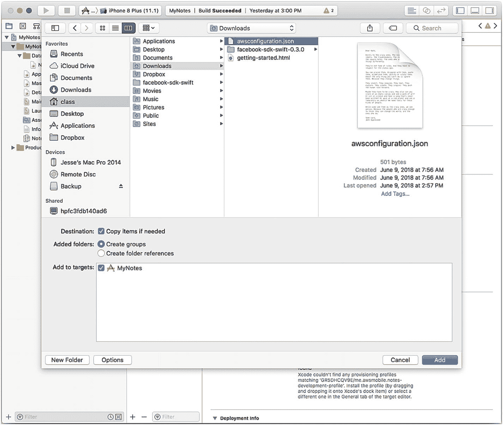

图 10-8

将下载的后端添加到您的项目中

您的项目现在应该如图 10-9 所示，其中已添加了 `awsconfiguration.json` 文件。（使用 Xcode 的“添加文件”命令比使用访达更容易确保您的项目文件放置在正确的位置。）

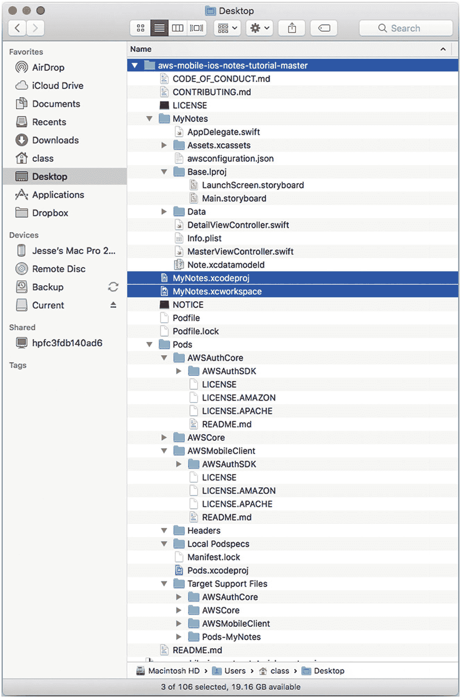

图 10-9

使用 Xcode 将配置文件添加到您的项目中

#### 添加 Pods

如果您尚未为当前项目或其他项目安装 CocoaPods，那么现在需要安装它。为此，请使用终端并输入以下命令：

```
sudo gem install cocoapods
```

无需为此命令指定特定的目录。

将终端的目录切换到您应用的文件夹。最简单的方法是启动终端，输入 `cd`，然后将 `aws-mobile-ios-notes-tutorial-master` 文件夹拖入终端以完成 `cd`（更改目录）命令。

更改目录后，在终端中输入以下命令：

```
pod init
```

您的 Podfile 将使用相应的 pods 创建。每当您修改 Podfile 时，请使用以下终端命令进行安装：

```
pod install -- repo-update
```

这将把项目移入一个 Xcode 工作区，如第 3 章所述。

在 Xcode 中时，请检查您应用的“通用”设置，如图 10-10 所示。您可能会看到与签名和配置文件设置相关的错误。请将包标识符和团队更改为您自己的设置。

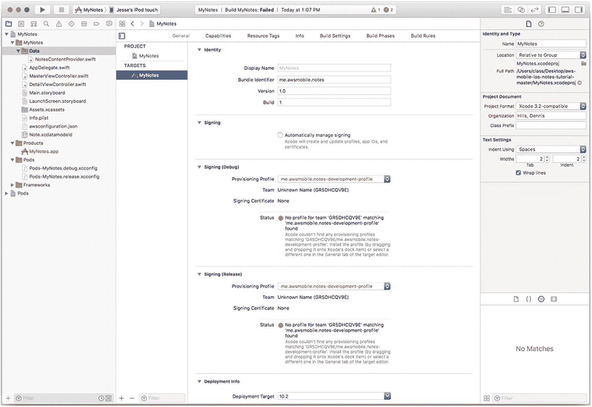

图 10-10

更改您应用的设置

现在您应该能够构建并运行您的应用了。如图 10-11 所示，pods 将下载必要的组件。下载和构建可能需要几分钟时间，请耐心等待。

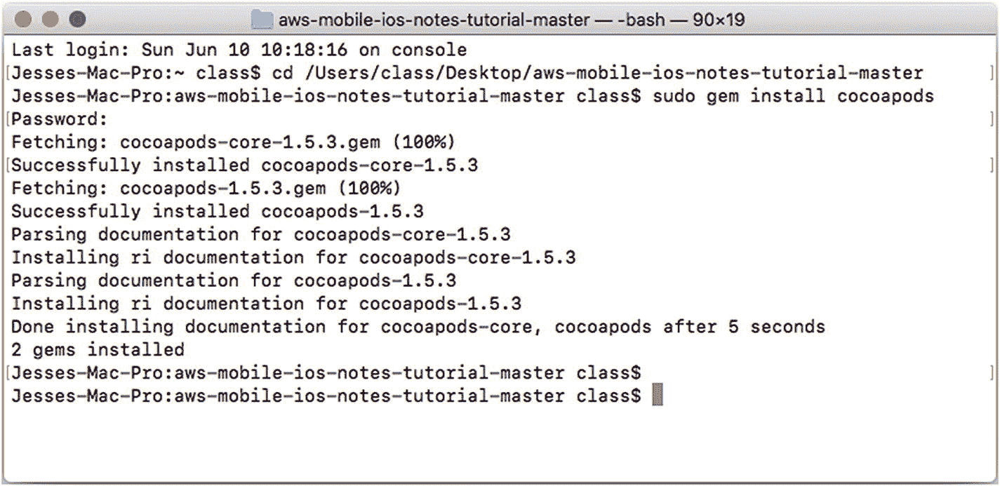

图 10-11

为 AWS 安装 CocoaPods

##### 注意

在应用构建过程中，您可能会注意到一些错误消息。请等待构建完成，因为这些错误可能会在后续组件下载完成后消失。

### 总结

本章向您展示了如何开始组合您的 AWS/iOS 应用。在下一章中，您将开始实际使用集成后的应用。

