# 第五部分 使用 RxSwift

## 11. 进入代码

世界上有两种类型的开发者：一种是想先接触代码，然后再了解其工作原理；另一种是想先了解事物如何运作，然后再接触代码。有趣的是，同一位开发者可能会根据需要或为了寻求变化，在两种模式之间切换。

如果您想从背景信息开始，请先阅读第 12 章“响应式思维”，然后再回到本章。或者，您可以继续阅读本章，先了解一些非常基础的 RxSwift 代码，然后再阅读第 12 章。

在本章中，您将了解使用 RxSwift 的基础知识：

*   **入门** 将向您介绍硬件和软件方面的要求。
*   **从 GitHub 安装 RxSwift** 将指导您完成下载和安装过程。
*   **使用 RxSwift Playground** 将向您展示如何在 Swift Playgrounds 中编写您的第一个 RxSwift 代码。

#### 提示

如果您之前没有使用过 Swift Playgrounds，本书提供的基础知识足以让您上手。不过，您可以在 *Learn Computer Science with Swift: Computation Concepts, Programming Paradigms, Data Management, and Modern Component Architectures with Swift and Playgrounds* 和 *Exploring Swift Playgrounds: The Fastest and Most Effective Way to Learn to Code and to Teach Others to Use Your Code* 这两本书中学到更多。这两本书均由 Jesse Feiler 编写，并由 Apress 出版。

### 入门

需要了解的最基本的入门知识是：

*   RxSwift 本身是 Swift 响应式编程库的一个开源实现。您可以从 GitHub 免费下载（本章将介绍具体步骤）。
*   响应式编程让您可以轻松处理异步操作。
*   为了实现这种范式，响应式编程使用了一些基本术语：
    *   *可观察序列 (Observables)* 是可以被观察的项目。当它们发生变化时，这些变化对于*订阅 (subscribe)* 了该可观察序列的组件来说是可见的。
    *   *观察者 (Observers)* 负责观察可观察序列。

这些术语和概念将在本书的第 12 章及后续章节中进一步探讨。

另一件需要从一开始就知道的事情是，响应式编程范式通常被称为 *Rx*。

有了这些基础知识，您现在已具备开始使用 RxSwift 的足够认知。您需要具备以下条件：

*   一台运行 Xcode 9 或更高版本的 Mac。Xcode 9 是用于在 iOS 和 macOS 上开发应用的集成开发环境（IDE）。它也是 Apple 工程师用来构建 iOS 和 macOS 自身的工具。Xcode 可以从 Mac App Store 免费下载。请查看 Xcode 的系统要求：这些也是您使用 RxSwift 所需满足的要求。
*   一个互联网连接，以便您登录 GitHub。如果没有，您可以先在便携式电脑或驱动器上从 GitHub 完成下载，然后将下载的文件复制到您的 Mac 上。


### 从 GitHub 安装 RxSwift

GitHub 是当今大多数代码的默认代码仓库，包括许多协作和开源项目。你可以注册一个私有 GitHub 账户（许多公司和个人都这样做），但私有 GitHub 账户拥有与公共账户几乎相同的功能。

#### 提示

GitHub 上的项目以源代码*仓库*（通常称为 *repos*）的形式存在。

在 Xcode 9 中，GitHub 和源代码控制功能整体上比以往任何时候都更紧密地集成到了 Xcode 中。因此，如果你有早于 Xcode 9 的 RxSwift 下载说明，可能会被引导使用比实际需要更复杂的流程。本书使用 Xcode 9 的集成功能，向你展示一种将 RxSwift 集成到 Xcode 项目中的非常简单的方法。

登录 `github.com`，并使用窗口顶部的搜索字段搜索 `RxSwift`，如图 11-1 所示。请记住，GitHub 是一个动态更新的存档，因此你下载的文件可能会随着时间而变化。整个 GitHub 站点会定期更新，但功能保持不变。

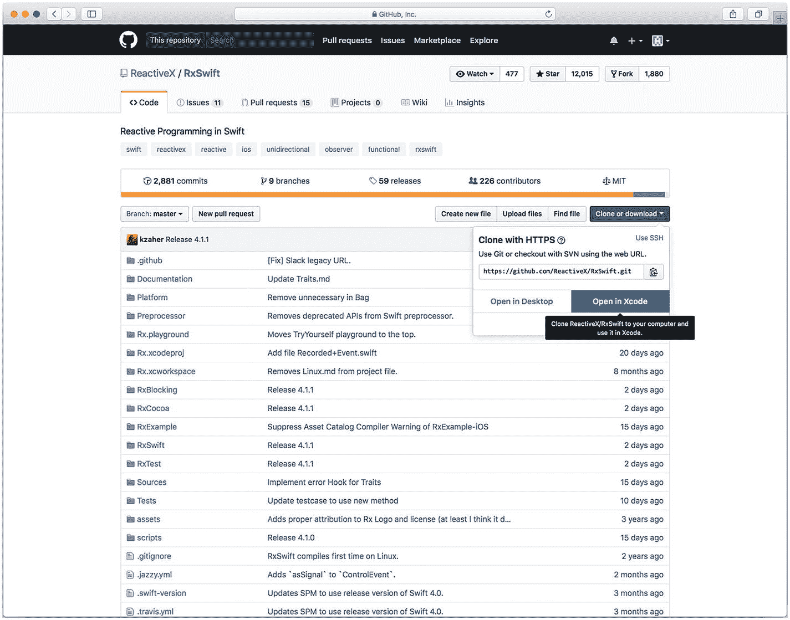

图 11-1

从 GitHub 下载 RxSwift

如果你已安装 Xcode，右侧的“Clone or download”（克隆或下载）按钮将提供选项，让你将其下载并打开到桌面，或作为 ZIP 文件下载。Xcode 9 新增了“在 Xcode 中打开”的选项（但要使用此选项，你必须在 Xcode ➤ 偏好设置 ➤ 帐户中输入你的 GitHub 账户凭据）。请选择 Xcode 选项。（如果你没有看到该选项，请确保 Xcode 已安装并正在运行，并且你已在 Xcode 偏好设置中输入了凭据。）

当你选择在 Xcode 中打开代码仓库时，系统会请求你的权限，如图 11-2 所示。

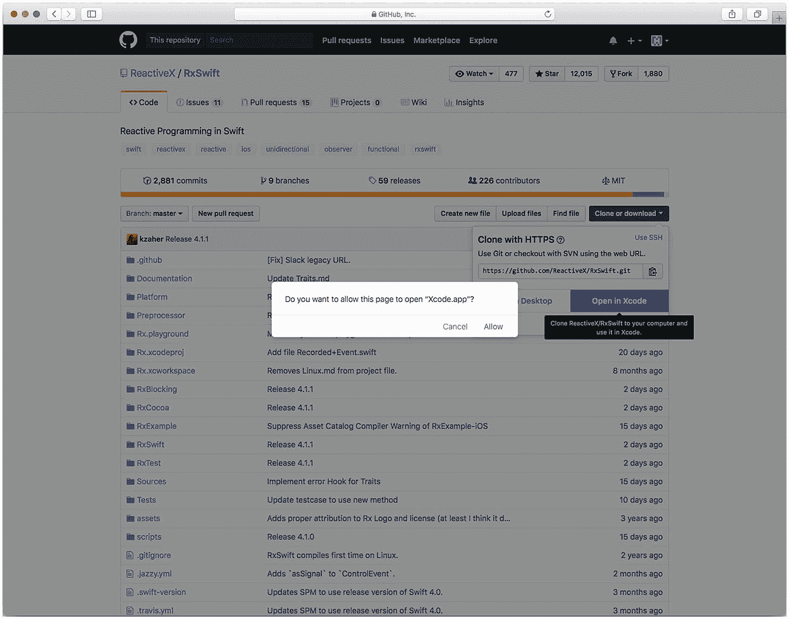

图 11-2

同意让 Xcode 打开仓库

RxSwift Playground 是下载内容的一部分。你从它开始，因为当你首次运行它时，在你遵循本书下一节中的说明时，你下载的文件将会被构建。在你下载的文件中，会包含 `Rx.xcworkspace`。一个工作区可以包含多个 Xcode 项目，这里正是这种情况。请确保你打开的是 `Rx.xcworkspace`（工作区），而不是其中包含的项目（`Rx.xcodeproj`）。

RxSwift 遵循 MIT 许可证。下载按钮正上方的 MIT 图标详细显示了该许可证，如图 11-3 所示。与所有此类许可证一样，请查看其条款，但请注意，你拥有很大的自由来使用 RxSwift。

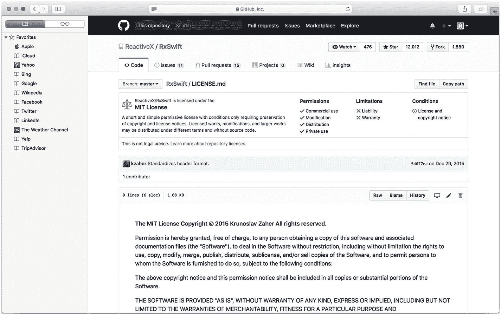

图 11-3

查看 MIT 许可证

### 使用 RxSwift Playground

下载完成后，显示项目导航器，如图 11-4 所示。你可能需要打开 `Rx` 文件夹及其中的 `Rx.playground` 文件夹。选择 `Table_of_Contents`，如图 11-4 所示。

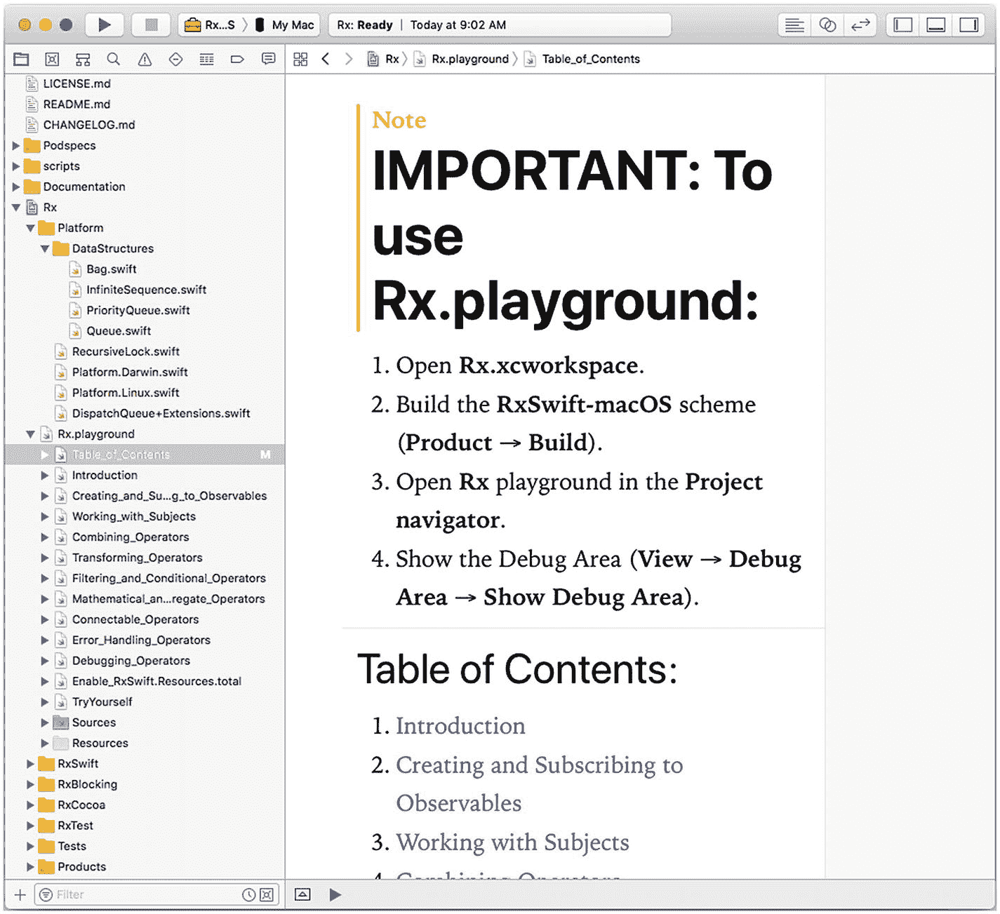

图 11-4

使用 `Rx.Playground`

从 `Rx.playground` 文件夹中选择 `RxSwift-macOS`，并按图 11-4 所述进行构建。然后你就可以继续了。（请注意，步骤 2 允许你使用 `RxSwift-macOS` 方案构建 playground。更多信息请参见后续页面。）

#### 查看格式化的 Playground

Playground 支持标记代码，现在是快速探索它的好时机。默认情况下，你会看到文件中的标记（如图 11-5 和 11-6 所示）。

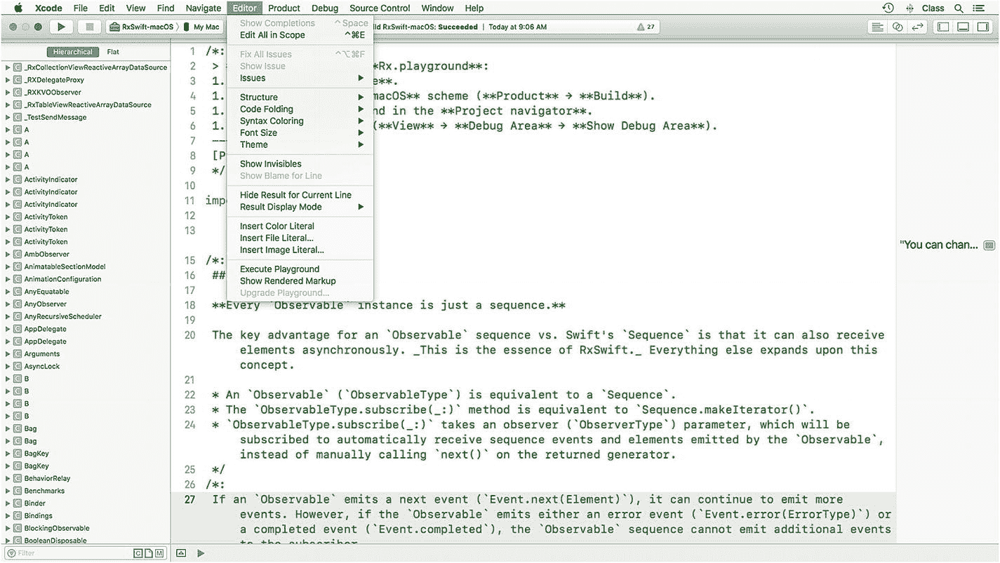

图 11-6

在原始代码和标记之间切换

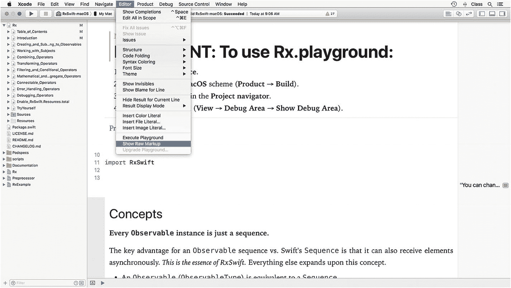

图 11-5

默认情况下，你会看到 playground 标记

如果你想查看原始代码，可以使用“编辑器”➤“显示原始标记”，如图 11-5 所示。执行此操作后，你将看到原始代码，如图 11-6 所示。比较这两张图片以查看差异。

不用担心这一点。当你构建自己的 playground 时，使用标记会很有用，但并非必须如此。如果你想探索 playground 的标记，可以在[`https://developer.apple.com/library/content/documentation/Xcode/Reference/xcode_markup_formatting_ref/index.html#//apple_ref/doc/uid/TP40016497`](https://developer.apple.com/library/content/documentation/Xcode/Reference/xcode_markup_formatting_ref/index.html#//apple_ref/doc/uid/TP40016497) 的 Markup Formatting Reference 中找到更多信息。请注意，该文档涵盖了 Quick Help 和 Swift Playgrounds 的标记，因此某些格式化仅适用于其中之一。

按照图 11-4 所示的说明进行操作。如图 11-7 所示打开 Rx 项目。

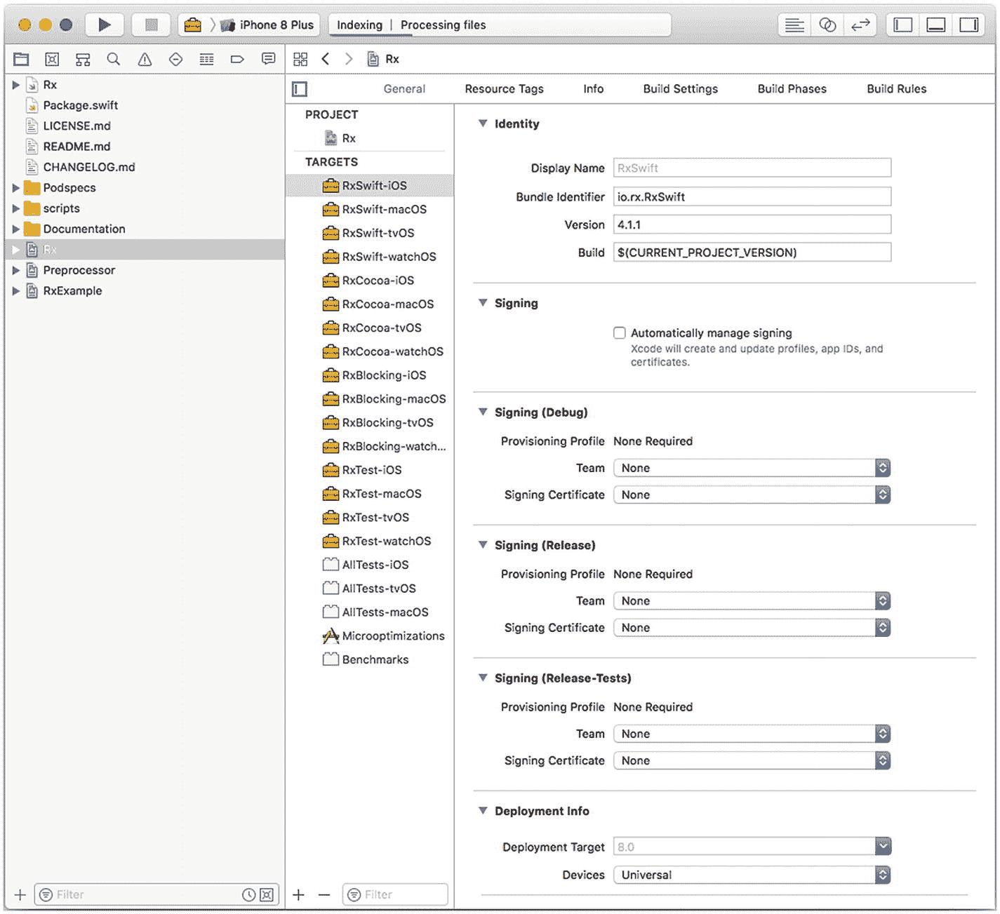

图 11-7

打开 Rx 目标

使用工作区窗口顶部的方案菜单选择一个 `RxSwift-macOS` 目标，如图 11-8 所示。

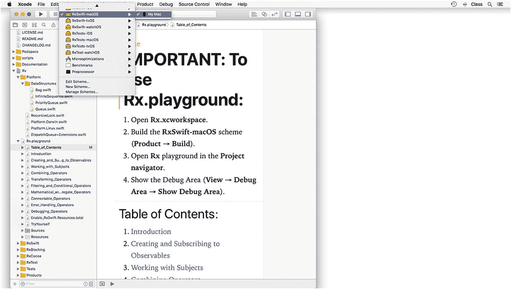

图 11-8

选择方案

Playground 让你可以用实时代码进行实验。暂时不要担心语法的作用；只需添加一个 `print` 语句，如图 11-9 所示。当你向 playground 添加新行（甚至是空行）时，它们会被自动编号。

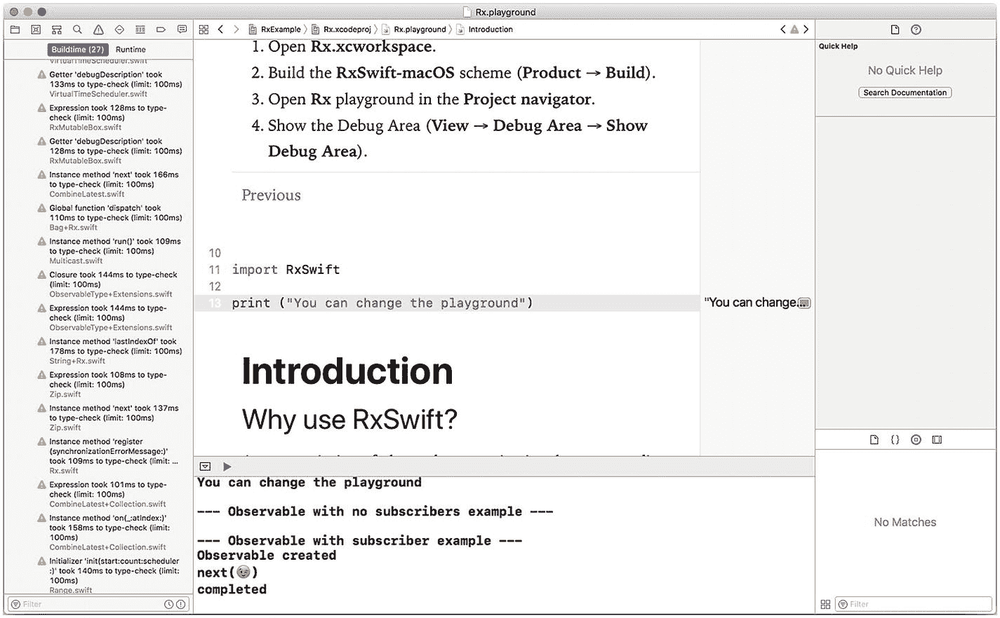

图 11-9

向 Introduction playground 添加代码


#### 提示

无论是否显示标记，你都可以在 Playground 中添加代码。

在 Playground 窗口底部，你可以看到*调试区*，它会显示 Playground 的输出。（如果看不到，请选择“显示” ➤ “调试区” ➤ “显示调试区”。）在你输入时，Playground 会追踪你的按键以识别错误。在图 11-10 中，你可以看到输入时可能出现的错误消息。这类错误消息会随着你的输入和 Playground 分析代码（及可能的错误）而出现和消失。

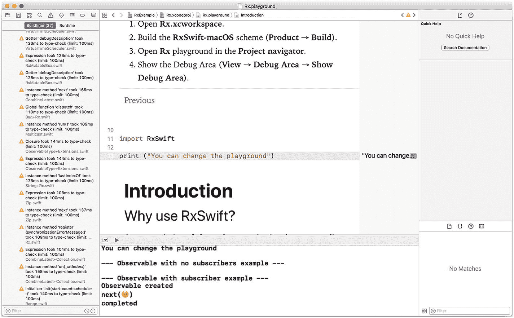

图 11-10

Playground 会监视错误

你可以尝试添加更多代码，如图 11-11 所示。

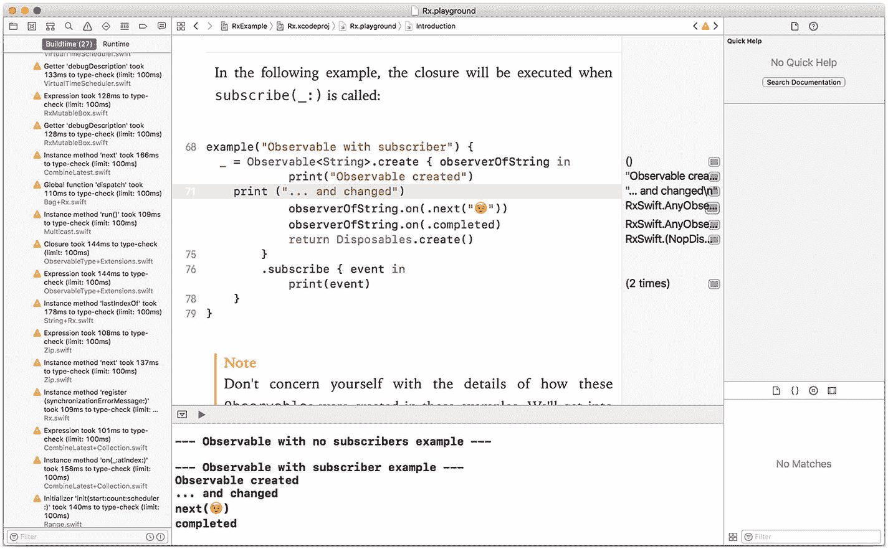

图 11-12

用你自己的代码探索 Playground

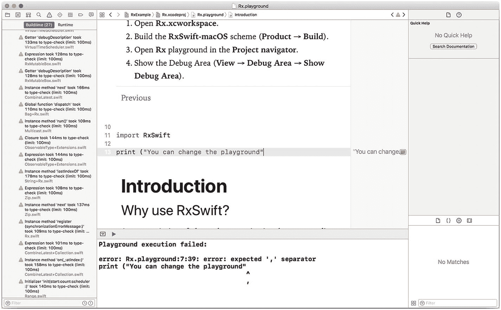

图 11-11

Playground 可以快速捕获错误

如果你移除所有添加的代码，应该会回到原始的 Playground，如图 11-13 所示。

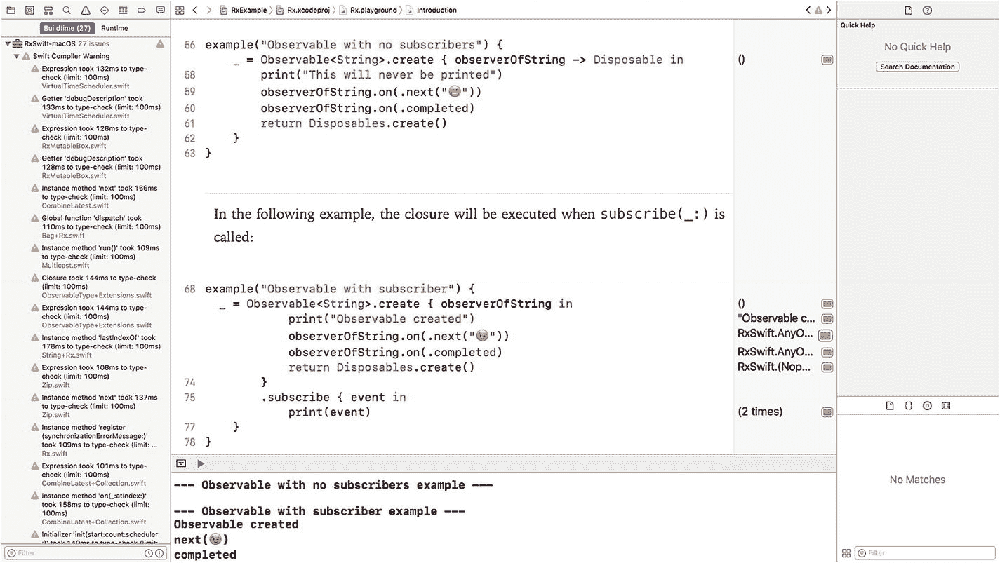

图 11-13

恢复为原始的 Playground

### 总结

现在，你已经成功在 Xcode 中安装了 RxSwift。你可以从 Playground 或应用中的常规 Swift 代码中引用它。当你想将 RxSwift 添加到另一个 Playground 或 Xcode 项目时，只需按照你在这里看到的相同步骤操作即可。

你将在本书后面看到它的实际应用，但首先，是时候了解 RxSwift 背后的运行机制了。

## 12. 响应式思考

本章将帮助你理解响应式编程的概念，并将其置于其他编程风格、模式和范式的背景中。用最简单的非专业术语描述，响应式编程是一种编程方式，它使得轻松处理现代软件项目和应用程序成为可能，这些项目和应用通常涉及多个用户同时处理相同的数据。

半个世纪前，人们可以按照“Hello World”（许多人在课堂上学习的第一程序）的风格来思考编程。在“Hello World”中，你键入几行代码（一到三行，取决于格式），然后程序显示或打印文本“Hello World”。

更复杂的此类程序允许用户通过键入一个单词或短语来与“Hello World”程序交互，程序会对此进行处理。因此，一个复杂版本“Hello World”的交互记录可能如下所示：

```
早上好。你叫什么名字？
Jesse
早上好，Jesse
```

该程序的复杂之处不仅在于用户可以与它交互，还在于程序可以判断是向用户问候“早上好”还是“下午好”。

如今，我们面对的是更加复杂的系统，这些系统涉及多个用户，他们期望能够实时更新，以便看到并参与朋友和同事的活动。当我们认为“早上好”（而非“下午好”）就很不错时使用的那些工具，在处理这些更复杂的系统时已显得力不从心。

本章将概述我们今天需要使用的工具（特别是 RxSwift 中涉及的工具），以及用于描述这些工具和我们正在创建的产品的术语。

### 我们在开发什么？

在计算机发展的早期，给计算机的指令被称为*程序*。程序组通常被组合成*系统*，在这些系统中，个别程序有时会相互交互，而在其他情况下，它们会处理与程序中涉及的数据相关的问题。

最早的程序由计算机操作员和调度员运行。在 20 世纪 70 年代，随着分时系统和网络的普及，一台大型主机可以同时运行多个程序。在这种环境下，程序的运行权下放给了用户，他们开始使用*应用程序*，这些程序设计为无需调度员和程序员的技术帮助即可运行。（早期应用程序的例子包括 VisiCalc 等电子表格软件以及第一批文字处理程序。）

为普通用户而非计算机专家设计的应用程序逐渐被称为*应用*，以区别于运行计算机本身的程序，后者通常被称为*系统程序*。

随着智能手机的出现，应用程序的名称进一步简化：*App*。在一段短暂的时间内，一些人试图区分应用程序（用于个人电脑）和 App（用于移动设备），但这种区分从未流行起来（幸运的是！）。

#### 提示

关于早期程序的更多信息，请参阅由 Richard L. Wexelblat 编辑、Academic Press 出版的《编程语言历史》（ISBN 978-0127450407），该书涵盖了截至 1980 年（即 C 语言之前）的编程语言。第二卷《编程语言历史 II》由 Thomas J. Bergin 和 Richard G. Gibson 编辑，由 Addison-Wesley Professional 出版（ISBN 978-0201895025）。该书涵盖了 1980 年之后的编程语言，包括 C、Smalltalk、ALGOL 和 C++。

如今，我们看到应用程序的功能正以新的方式打包，例如 Cocoa 和 Cocoa Touch 中的扩展。技术和用户界面正在迅速发展，但在本书中，开发的最终产品通常被称为 app 或程序，即使它可能是一个扩展。

创建 app 或程序的过程被称为*编码*（源自计算机早期，现在重新流行的原始术语）或*编程*。*开发*这个术语通常用于描述创建 app 或程序及其文档、推广或营销材料、培训及维护工具的全过程。

### 编程方法

如今，有多种相互重叠的方式来描述和分类开发活动。本节将为你快速概述一些与 RxSwift 相关的关键概念和术语。你可以利用许多书籍和其他资源进行进一步研究。现在重要的是，你需要了解并使用这些概念。


#### 提示

维基百科是获取这些主题更多信息的绝佳资源，因为其更新者社区中拥有大量科技界成员，他们以保持文章时效性为己任。

如此繁多且经常重叠的术语和概念，其成因已超出本书的讨论范围。简而言之，快速发展的开发项目，加上需要对工具和最终产品提供详细技术描述与市场营销推广，共同造就了这看起来永无止境的术语大杂烩。

这些术语和概念可分为三组，每组将在本章后续部分进行更详细的描述：

- **编程范式**描述了编程语言。当用户运行一个程序或应用时，他或她不太可能知道它是用什么编程语言编写的，更不用说该语言使用了哪种（些）范式了。一种特定的语言可能使用多种编程范式。
- **设计模式**是在面向对象编程中实现重复性任务的可行方式。它们可能在应用性能上对用户可见，但也可能严格存在于内部。由于它们是为面向对象编程而设计的，因此可以在任何支持面向对象范式的语言中实现。一个给定的应用或程序可能使用多种设计模式（或完全不使用）。
- **处理配置**是计算机及其主要组件（如处理器和内存）被组织和连接的方式。尽管处理配置由应用运行的硬件决定，但操作系统通常提供能最小化差异的特性，使得同一配置在不同时间可能表现出不同行为。（可以查看 Cocoa 和 Cocoa Touch 中的 `Grand Central Dispatch` 文档，了解其工作原理的示例。）

#### 编程范式

如果你将要使用 `RxSwift`（以及许多其他现代工具），那么对你来说重要的主要编程范式有三类描述程序结构的，和另外三类描述程序或应用如何运行的。（这些只是在 `RxSwift` 背景下对你重要的最常见的编程范式。）

##### 结构范式

关于编程范式的讨论始于 20 世纪 50 年代末和 60 年代，当时当今最常用的语言大多被开发出来。由于有必要描述它们，于是这些范式被识别并命名。主要的结构范式是对当时经常编写的意大利面条式代码程序的反应。这些程序由连续程序中的一行行代码组成。控制权可以从一行转移到另一行，因为大多数行都有名称或数字标识。术语*意大利面条式代码*被用来指代那些以复杂且通常不可预测的顺序执行的、混乱的代码行。

为了摆脱意大利面条式代码的问题，以下三个概念应运而生：

- **结构化编程**使用子程序（语句的逻辑集合）来为程序提供结构。根据语言的不同，这些子程序被称为方法、函数或过程。当控制权转移时，是从一个子程序转移到另一个子程序，而不是转移到特定的代码行。
- **过程式**编程使用子程序。它们通常以*参数*的形式接收输入数据，并可能返回结果值。在运行时，子程序的参数会被实际值——*实参*——所替代。
- **面向对象**编程让你能够描述可以封装数据和功能（或两者兼有，或两者皆无）的对象。对象可以包含子程序，如函数或方法。通常，对象对应于现实世界的概念，例如客户、地点或想法。

##### 操作范式

这些范式描述了命令的编写方式。

- **命令式**程序由指示计算机按特定顺序执行特定任务的指令组成。像 `if` 这样的*条件语句*允许你修改该顺序，但命令式程序的本质在于命令式指令。（该术语的用法与语言中的用法相同。）像 `Reactive Extensions`（`ReactiveX`）这样的工具有助于命令式语言处理同步或异步的数据序列，从而在一定程度上弥合了这两种技术之间的区别。
- **声明式**程序声明操作的结果应该是什么。命令式程序指定了做什么以及如何做，而声明式编程范式仅指定做什么：程序或操作系统的任务是选择最合适的方式来完成它。声明式编程语言包含旨在明确最终结果应为何物的指令。
- **函数式**程序是声明式程序的一个子集。它们要求程序组件是操作（如过程或函数）结果的唯一决定因素。换句话说，在函数式编程范式的函数内部，不使用全局变量和环境设置。

你可以在维基百科上找到常见编程范式的比较：[`https://en.wikipedia.org/wiki/Comparison_of_programming_paradigms`](https://en.wikipedia.org/wiki/Comparison_of_programming_paradigms)。

#### 设计模式

设计模式是可在类似情况下使用的模式或例程。你可以在许多地方找到它们，包括房屋中门和锁的配置模式，以及软件中。在包含 `RxSwift` 的语境中使用时，该术语指的是 1994 年出版的一本书，该书涉及面向对象软件中的设计模式。

#### 提示

由 Erich Gamma、Richard Helm、Ralph Johnson 和 John Vlissides 合著、Grady Booch 作序的《设计模式：可复用面向对象软件的基础》由 Addison-Wesley Professional 出版（ISBN-13 978-0201633610）。这四位作者常被称为*四人帮*。

设计模式分为三类：

- **创建型**设计模式用于创建对象。
- **结构型**设计模式用于连接两个对象等目的。
- **行为型**设计模式用于管理行为和流程。`ReactiveX` 使用了迭代器和观察者设计模式：
    - **迭代器**。此模式允许你遍历某个结构以获取下一个元素（该模式允许你指定序列是什么）。
    - **观察者**。通过此模式，你可以在一个观察者（一个）和被观察元素（多个或零个）之间定义一对多的关系。被观察元素对观察者一无所知，这是一个关键特性。被观察元素*发布*一个变化，任何观察者都会收到通知，但被观察元素不需要直接通知任何观察者。


#### 处理配置

术语与概念的第三个集合——处理配置，是许多开发者会跳过的内容。处理器内部发生的工作机制，我们往往视为理所当然。像“Hello World”这样简单的应用已不再是编写代码的良好范本，而将计算机视为单一设备的观念也已过时。如今几乎每部智能手机都搭载了多核——也就是多个处理器。专为这类多核设备设计的操作系统，能够同时执行多项任务。

以下是对多处理机制的一个非常高层级的概念性概述。操作系统允许某个任务在任意可用的核心上运行，且运行方式就像只有一个核心一样。为了处理慢速设备（如打印机、网络等）的问题，一个任务可以被快速暂停，并将其代码和资源打包；暂停后的任务可以被搁置一旁，同时执行其他任务。

这种暂停并移开任务的能力，其应用范围远不止于等待慢速设备。如果一个任务可以独立于其他任务运行，它就可以在一个核心上运行，同时让另一个任务在第一个核心上运行。

通过这种多核利用方式，操作系统以及（在较小程度上）任务软件必须能够被拆分成可以在不同核心上独立运行的任务。为了充分利用可用核心，重要的是要跟踪每个任务所需的内存，并提供一个机制，用于在任务可以（或不能）共享内存的节点上进行同步。

从 ReactiveX 的角度思考这个问题，有必要区分可以独立运行（*异步*）的任务或任务部分，以及必须协调运行（*同步*）的任务。

系统软件设计者的目标是，尽可能少地需要应用开发者干预就能实现多处理。在理想世界中，这应该自动发生。随着 OS X 10.6 (2009) 和 iOS 4 (2010) 中引入 Grand Central Dispatch (GCD)，操作系统中的现有并发代码被重写，使得开发者能够轻松地利用多核设备。成功使用 GCD 的关键在于任务队列的使用。你将任务添加到队列，GCD 便会接管后续工作。

需要记住的是，高效利用多核依赖于开发者正确使用队列。幸运的是，ReactiveX 将其大部分核心操作整合到了它的 `RxSwift` 对象中。

目前，你只需记住异步处理是内置于 `RxSwift` 中的。

### 介绍响应式编程

维基百科上有一个广为流传的响应式编程描述：“响应式编程是一种关注数据流和变化传播的异步编程范式。” 这是事实，但它要求对背景术语有相当深入的理解，例如*异步编程范式*、*数据流*和*变化传播*。你在前一节中已经对异步编程有了一个概述。现在，将数据流简单地理解为——数据流向打印机、通信设备或应用的其他部分。*变化传播*指的是应用响应其环境变化并恰当地传递该变化的能力。（这正是这些词汇的英文原意——并非特定技术概念。）

### 聚焦 ReactiveX

`ReactiveX` 的基本描述在其文档中非常简洁：“正确实现的观察者模式。” 这同样需要一些背景知识，但它的焦点只放在一件事上，即观察者模式，而不是前述描述中的三点。更完整的描述是：“`ReactiveX` 是观察者模式、迭代器模式和函数式编程最佳理念的结合。” 其网站位于 [`http://reactivex.io`](http://reactivex.io) 。进一步的说明是：“`ReactiveX` 不止是一个 API；它是一种编程理念和突破。”

#### 注

观察者模式、迭代器模式以及函数式编程已在上一节中讨论过。

`RxSwift`（以及许多其他响应式编程项目，如 `RxJava`、`RxJS`、`Rx.Net`、`RxScala` 和 `RxClojure`）的核心是 `ReactiveX` 库。`ReactiveX` 本身是一个开源项目集。`ReactiveX` 项目本身也是开源的，采用知识共享署名许可协议进行许可。代码示例采用 BSD 许可协议。

### 总结

本章概述了 `RxSwift` 所依赖的技术。这里没有任何新技术或 `RxSwift` 特有的内容。在接下来的章节中，你将看到在 `RxSwift` 中实现这些设计模式的代码，并找到它们在实际应用中的用例。

至此，你已经了解了如何从 GitHub 下载 `RxSwift`，以及如何在 Xcode 中构建它。现在，是时候看看你将使用的基础代码了。

## 13. 探索 Rx 基础代码

在 playground 中（第 11 章）探索了 `RxSwift` 的基础知识，并学习了其技术基础（第 12 章）之后，现在是时候看看 `RxSwift` 在应用中的实际运用了。本章将向你展示如何将从 GitHub 下载的代码转变为真正的应用。

`RxSwift` 实现了响应式编程，这也是本章应用将要演示的内容。它从一个非常基础的点出发：应用对用户生成的事件做出反应。这类应用可以轻松地通过应用内的通知来创建，因为应用既生成了事件/刺激，也生成了反应/响应。

这种非常简单的结构对于探索 `RxSwift` 的结构和语法非常有用。一旦你掌握了基础知识，就可以转向大多数人想到响应式编程时联想到的那种反应——对外部事件（源自应用之外）的反应。

本章将向你展示如何将一个在 Xcode 中构建的示例应用放入已下载的 `RxSwift` Xcode 文件中。完成此操作后，你将拥有所需的两个组件：`RxSwift` 和 Xcode，它们将协同工作。

#### 注

你需要安装 Xcode 才能继续。


### ReactiveX/RxSwift 与 Xcode 集成概览

有多种方式可以将 Xcode 与 ReactiveX/RxSwift 集成。具体使用哪种方法取决于你的经验和偏好。你正在构建的应用类型并不如个人偏好重要。起点是 ReactiveX/RxSwift 的 GitHub 仓库。第 11 章向你展示了如何下载它并使用其中的 Swift playground。你需要该仓库的一部分来与你自己的应用集成。使用 GitHub 的好处之一是，它会随着人们的使用和修改而不断变化。因此，你看到的 GitHub 版本可能与本章描述的版本有所不同。

GitHub 仓库中提供了多种用于与你自己的应用集成的技术。在撰写本书时（2018 年），可用的集成方法如下：

-   `CocoaPods`，可在 [`cocoapods.org/`](http://cocoapods.org/) 获得。它旨在管理 Xcode 项目的源代码分发和依赖关系。
-   `Carthage`，可在 [`github.com/Carthage/Carthage/releases`](https://github.com/Carthage/Carthage/releases) 获得，它比 `CocoaPods` 与 Xcode 和 Swift 的集成更紧密，许多人认为它使用起来更简单一些。
-   Swift Package Manager (`SPM`) 是 Swift 项目的一部分，可在 [`swift.org/package-manager/`](https://swift.org/package-manager/) 获得。它与 Swift 的集成比 `CocoaPods` 或 `Carthage` 更彻底，但尚未像 `CocoaPods` 那样被广泛使用。

在本章中，将基于存档文件，在不使用 `CocoaPods`、`Carthage` 或 `SPM` 的情况下，描述集成 GitHub 文件的过程。这对于初学者来说可能是一条更简单的路径。

#### 从 RxSwift 下载开始

如第 1 章所述，首先从 GitHub 下载当前版本的 `RxSwift`。关键步骤是从 GitHub 下载到 Xcode。图 13-1 提醒你这一步骤。将其下载到一个新文件夹中是最简单的。之后，你可以重新排列文件，但为确保你下载的内容能在你的 Mac 和 Xcode 版本上构建和运行，请保持安装过程简单。

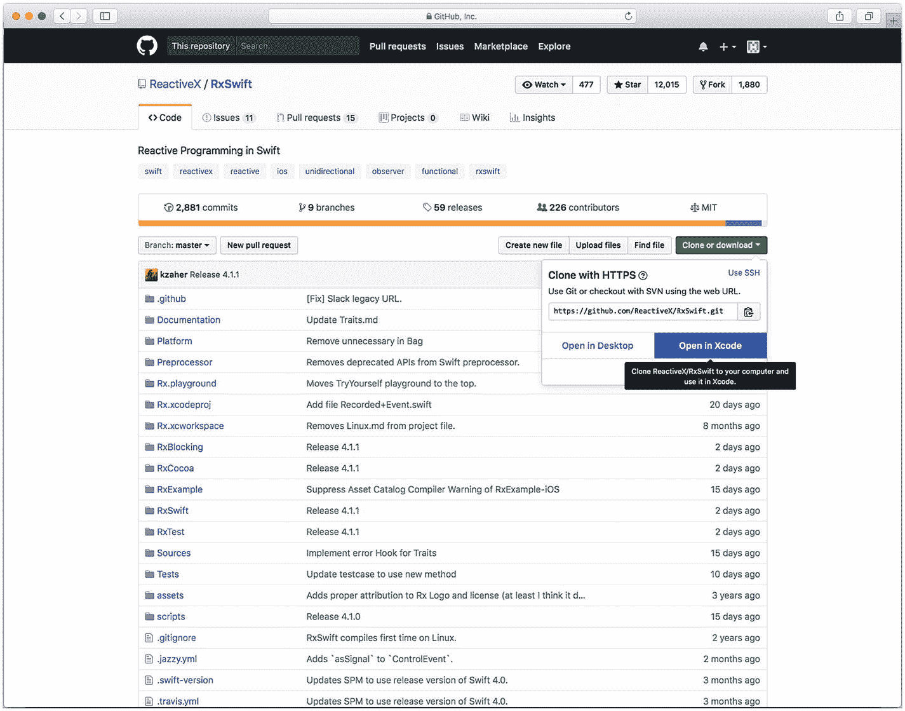

图 13-1 — 直接将 GitHub 的 `RxSwift` 代码下载到 Xcode

你下载的文件看起来会有点像你在图 13-2 中看到的文件。请记住，这个存档在不断增长和变化，但基本结构是固定的。确保你拥有 `Rs.xcodeproj` 和 `Rx.xcworkspace`。如果没有，说明你下载的存档不对。

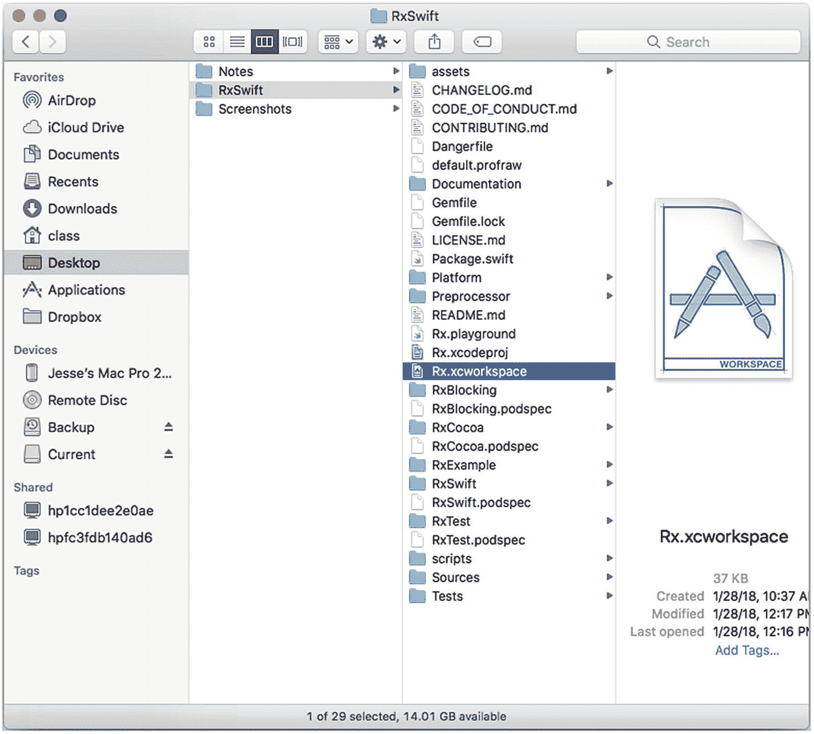

图 13-2 — 下载 `RxSwift` 仓库

#### 探索工作区和 Playground

现在，用 Xcode 打开工作区（`Rx.xcworkspace`），如图 13-3 所示。你可能需要进行一些重新排列，并打开或关闭某些组。你通常会看到如图 13-3 所示的内容：它是 `Rx.playground`。请特别注意窗口左侧的项目导航器。

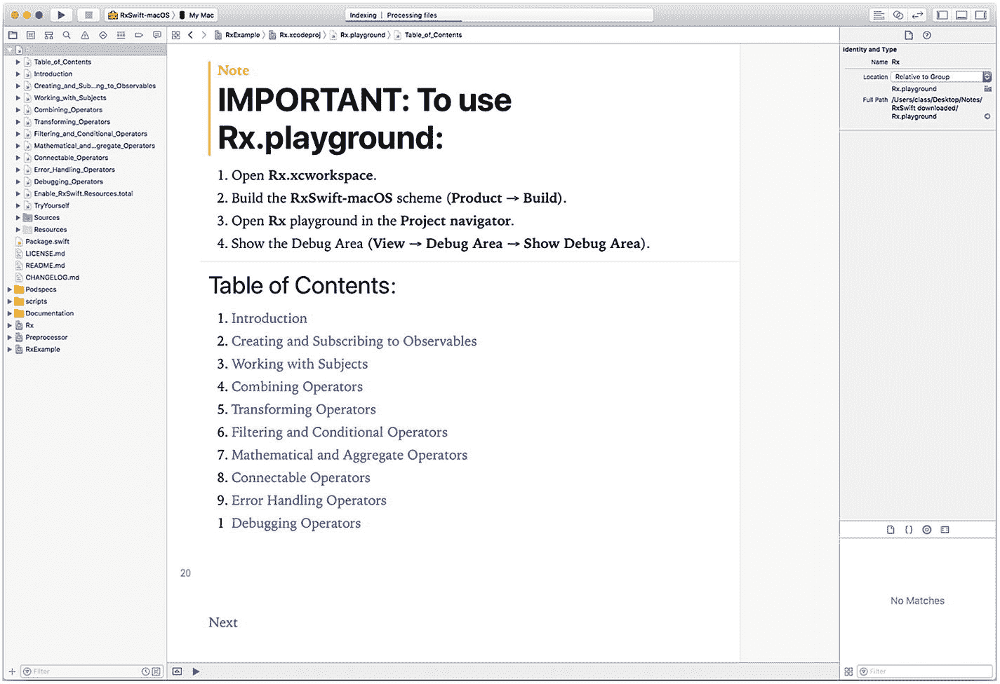

图 13-3 — 打开 `Rx.workspace`，然后打开 `Rx.playground`

关闭 playground 组，这样你在 `Package.swift` 中看到的第一个项目如图 13-4 所示。

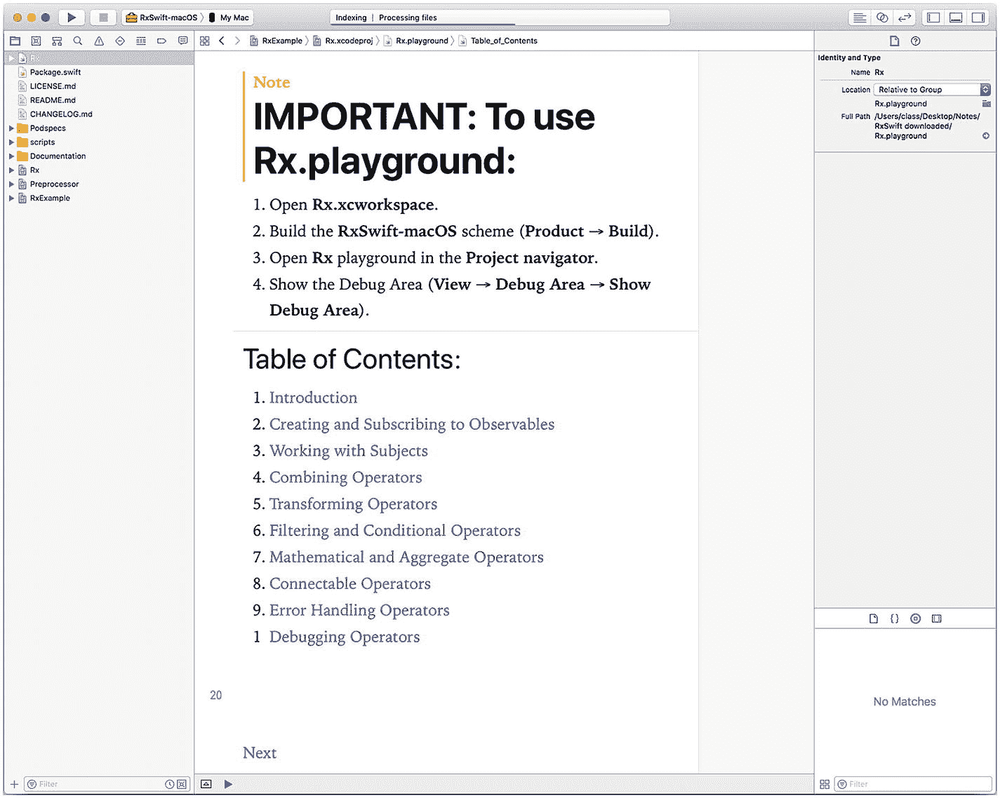

图 13-4 — 关闭 playground

#### 向 RxSwift 下载添加项目

现在，向工作区添加一个项目。为了保持井井有条，最简单的方法是点击项目导航器底部的空白区域，这样你的新项目就会放在那里。（你以后可以重新排列它。）

通过选择 **New（新建）** ➤ **Project（项目）** 来创建项目并选择模板，如图 13-5 所示。对于这个基本示例，**iOS** 选项卡中的 **Single View App（单视图应用）** 是完美的。

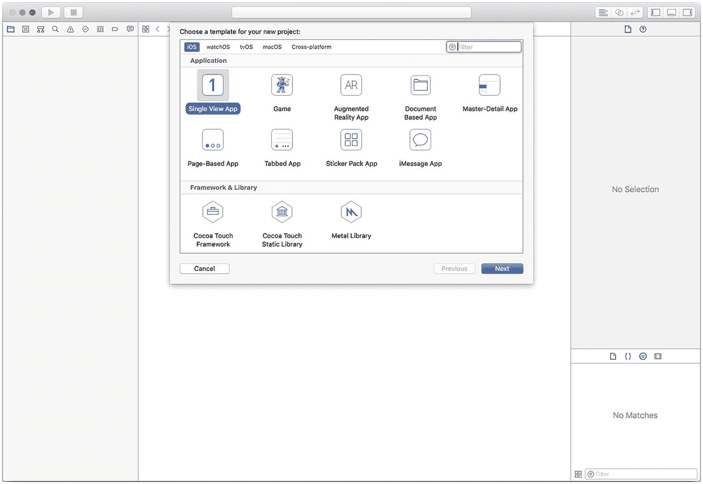

图 13-5 — 选择新的项目模板

与往常一样，当你点击 **Next（下一步）** 时，你需要为项目命名并将其定位到磁盘上。为简单起见，将其放在你下载 `RxSwift` 仓库时使用的同一文件夹中。将其命名为 `Basic`，以匹配本书中的截图。项目导航器现在应该看起来像图 13-6 所示。

创建项目时，**不要**使用 **Core Data**、**Unit Tests（单元测试）** 或 **UI Tests（UI 测试）**（在选项表底部有它们的复选框，如图 13-6 所示）。

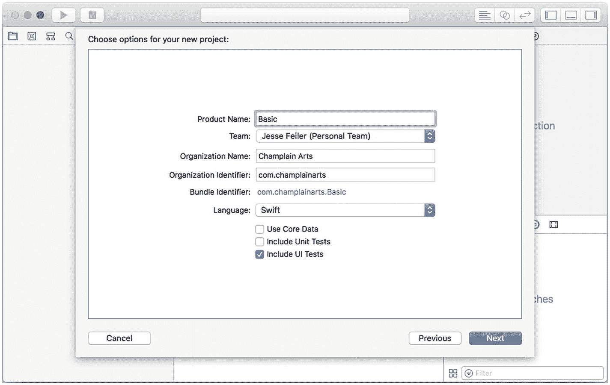

图 13-6 — 设置项目的名称和选项

当提示选择存储新项目的位置时，将其放入 `Rx` 工作区和你想要的任何组中，如图 13-7 所示。

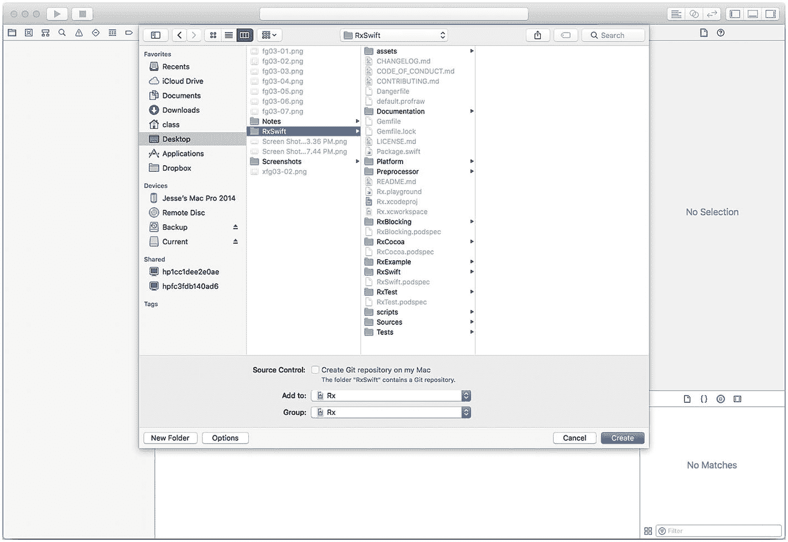

图 13-7 — 将新项目放入 `Rx` 工作区和任意组中

将新项目（本例中为 `Basic`）拖到项目导航器的顶部或底部，以便于查找。

> **提示：** 如果你想在添加项目之前为它创建一个新的空组文件夹，可以省去一个步骤，但对许多人来说，这似乎打乱了顺序。

图 13-8 展示了现在的项目。

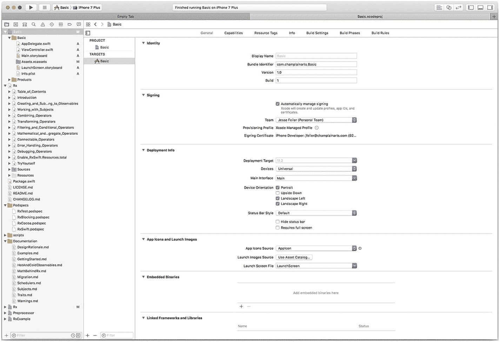

图 13-8 — 你现在的新项目已成为工作区的一部分

如果你查看磁盘上的文件，你会看到你的项目在正确的位置，如图 13-9 所示。

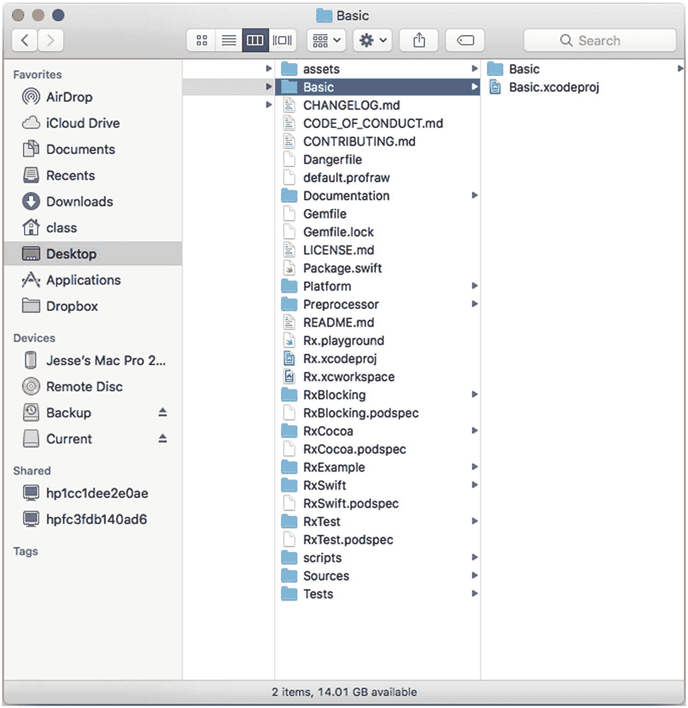

图 13-9 — 检查新项目文件是否在正确的位置

> **注意：** 确保文件在正确的位置。如果它们不在你的项目文件夹中，只要你不移动项目，一切都会运行得很好。当你将项目移动到其他地方（例如 MacBook）时，项目可能会损坏。只要记得，你可以单独移动新项目文件，但将整个项目保持在一起更容易。

#### 构建你的 RxSwift 增强版项目

在继续之前，确保你的项目能够构建和运行。（从模板创建项目时，这始终是一个好主意。）如图 13-8 所示，在窗口顶部，你可以为任何已安装的模拟器或设备构建和运行项目。当你在模拟器上运行时，你应该会看到如图 13-10 所示的结果。（是的，图 13-10 就是你应该看到的：没有错误消息，也没有其他内容。在下一节中，你将看到如何添加一个标签来确认你的应用正在实际运行。）

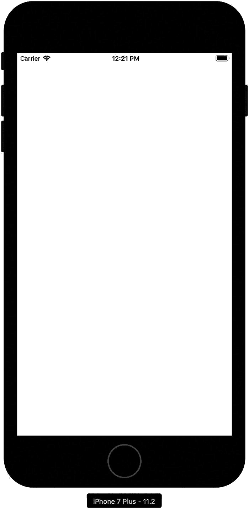

图 13-10 — 此时你的项目应该可以运行了


### 修改项目

本节的目的是确保你能够修改、构建并运行已创建的 RxSwift 增强项目。在项目中找到 `main.storyboard`（位于图 13-8 顶部）。像在 Interface Builder 中对任何项目所做的那样，向窗口添加一个标签。添加标签后的故事板如图 13-11 所示。

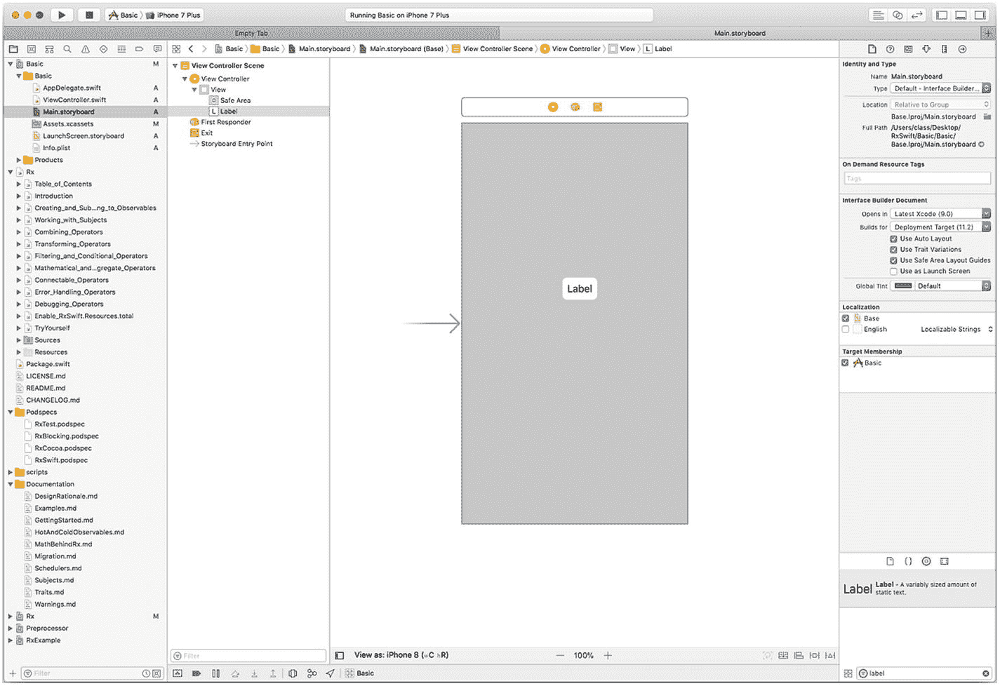

图 13-11

向故事板添加标签

再次运行项目，你应该会在界面中看到所添加的标签，如图 13-12 所示。

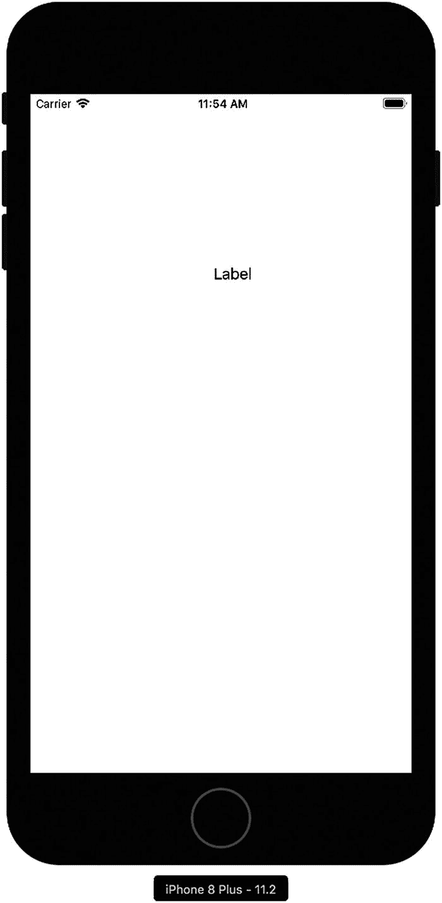

图 13-12

运行项目中的标签显示

### 总结

至此，你应该能够从 GitHub 下载 RxSwift 并将自己的项目添加其中。与大多数将要创建的项目一样，你很可能从一个内置的 Xcode 模板开始，本文正是这样操作的。

现在，是时候转向一个更复杂的项目了——一个可作为许多 RxSwift 项目起点的项目。

