# 构建 ReactiveX/RxSwift 应用

在最后三章中，你已经了解了 RxSwift 和响应式编程的基础知识，以及如何使用 GitHub 上的 ReactiveX/RxSwift 仓库创建一个非常基础的应用。本章将进一步推进，使你能够构建一个使用基本响应式功能的小型应用。

你将构建一个简单的应用，允许你从列表中选择一个项目，如图 14-1 所示。这是一个典型的入门级 ReactiveX 应用，你会在互联网上找到许多不同的变体。你所看到的是一个 `UISearchBar` 和一个 `UITableView`。该表格视图在应用中预置了六个项目。你可以在搜索栏中输入内容以选择一个或多个项目。应用会监视你的操作：如果你输入 F，你会看到三个以 F 开头的名称；如果你输入 O，你会看到 Oval；如果你输入 G，你不会看到任何结果，因为没有名称以 G 开头。这个应用将命名为 DemoList。

即使不借助 RxSwift，你也可以通过向搜索栏添加委托来跟踪输入内容来实现此功能，但使用 RxSwift 能使实现过程更加直接。此外，如果你决定转向更复杂的应用，其中表格视图会根据外部条件自动填充选择项，那么你将准备好实现这些功能。

##### 注意

列表中的项目代表纽约州普拉茨堡的地点。

需要特别注意的一点是，图 14-1 显示 DemoList 运行在真实设备上（从状态栏可以看出是 iPod Touch）。

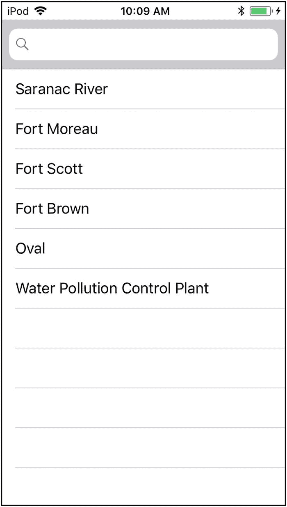

图 14-1

构建 DemoList

当你在 iOS 模拟器上运行应用时，状态栏会显示一个通用的运营商，如图 14-2 所示。

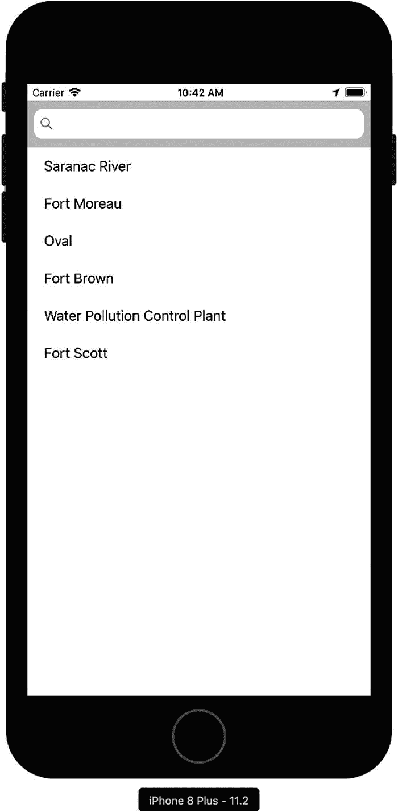

图 14-2

在 iOS 模拟器上运行

模拟器已更新以支持多个版本的 iOS，但某些 iOS 特性在设备上运行与在模拟器上运行时并不完全相同。例如，在模拟器上，iCloud 同步是通过菜单命令（Debug ➤ Trigger iCloud Sync）触发的，并且操作系统的其他各种方面在模拟器上的运行方式与实际设备不同。特性如此，由多个文件构建的项目也是如此。当它们在 Xcode 这样的环境中构建时，必要的文件和框架可能可用，但当应用迁移到实际设备时，这些文件和框架可能不可用。避免部署意外最安全的方法是，在开发过程中频繁使用设备进行测试。（此类测试常用的设备是 iPod Touch 和 iPhone SE。）

### 项目设置

在第 13 章中，你已经了解了如何将应用添加到下载的仓库中的基础知识。本章将提供一个更完整的版本，你可以将其重复用于其他应用。最重要的是，它开始使用 RxSwift 的特性和语法。

如果你按照步骤下载 GitHub 仓库，你将获得最新版本。文件可能会发生变化，结构也可能随之改变，因此，如果你查看磁盘上的文件列表，它可能会与本书图中显示的文件略有不同。图 14-3 显示了在 Xcode 中下载的 GitHub 仓库。

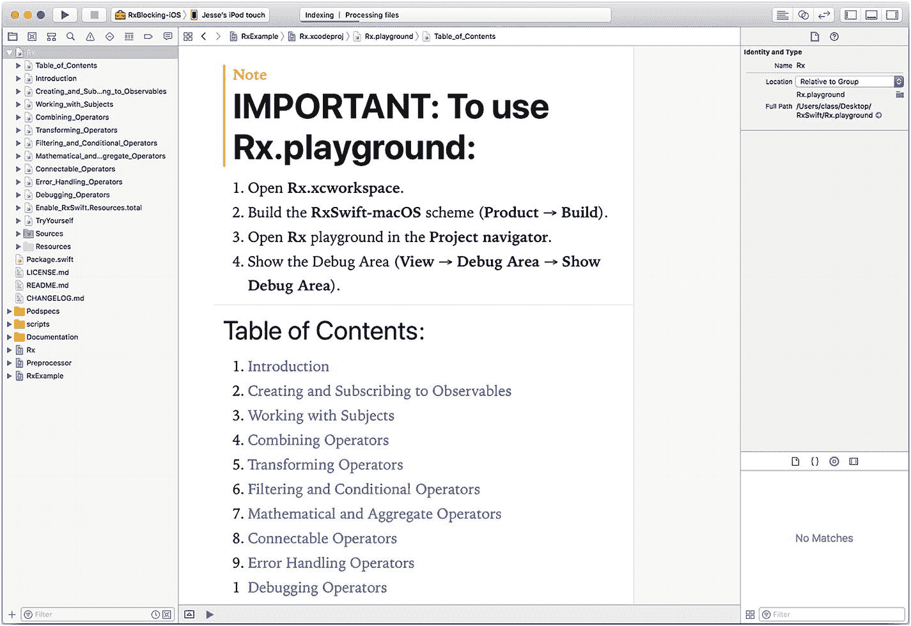

图 14-3

在 Xcode 中下载的 ReactiveXRxSwift 仓库

你可能需要打开或关闭一些三角展开符号才能看到文件。此处最重要的是注意 playground 文件。它们可能位于列表顶部的 Rx 项目中（或者可能已被移动）。图 14-3 向您展示了需要执行的四个步骤：

1.  打开 `Rx.xcworkspace`
2.  构建 `RxSwift-macOS` 方案（Product ➤ Build）。
3.  在项目导航器中打开 `Rx` playground
4.  显示调试区域（View ➤ Debug Area ➤ Show Debug Area）。

如果你无法按照四个步骤所述进行构建，则说明下载可能存在问题。

##### 注意

playground 的构建过程可能需要几分钟才能完成。注意观察窗口顶部的状态栏，了解索引状态，这通常会花费一些时间。索引状态消息显示在图 14-3 中。

构建 playground 后，你可以删除这些文件，但最好将完整的下载归档文件保存在安全位置。删除 playground 文件后，你的项目可能如图 14-4 所示，其中所有 playground 文件均已移除。这可能是 RxSwift 的一个版本，你可以将其用作不需要 playground 文件的各种项目的起点。

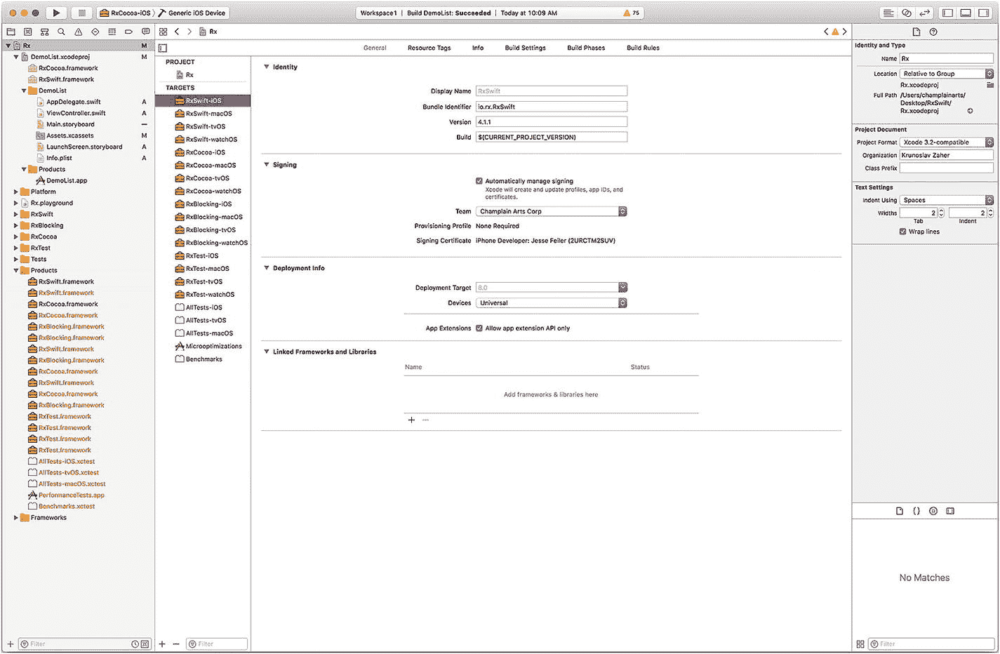

图 14-4

不含 playground 项目的 GitHub 仓库

仓库靠下方的 `Rx` 项目是主项目，而不是此时已删除的 playground。如果你选择 `Rx` 项目并查看目标，如图 14-4 所示，你将看到 ReactiveX 的组件。

对于 ReactiveX 的基本工作，你需要为运行项目的设备编译 `RxCocoa` 和 `RxSwift`。你可以从窗口左上角的模式（图 14-4 所示）中执行此操作。


#### 提示

为了节省时间，你可以为通用 iOS 设备构建 `RxSwift` 和 `RxCocoa`，如图 14-4 所示。这些库用于支持你的应用。

构建好 `RxCocoa` 和 `RxSwift` 后，你就可以创建新应用了。这个示例（先前在图 14-1 中展示过）可以命名为 `DemoList`。请选择"文件"➤"新建"➤"项目"，然后选择"Single View App"，如图 14-5 所示。

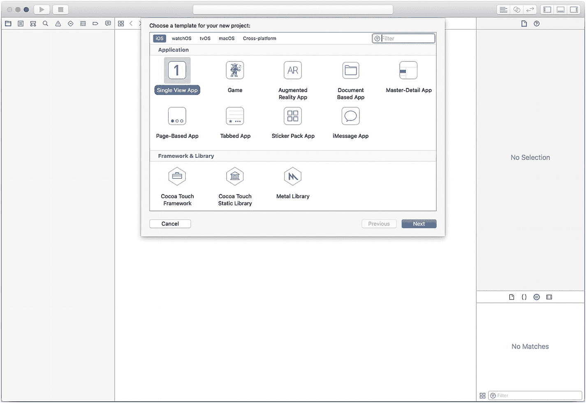

图 14-5 – 创建一个新的 Single View App 项目

设置项目选项和名称，如图 14-6 所示。

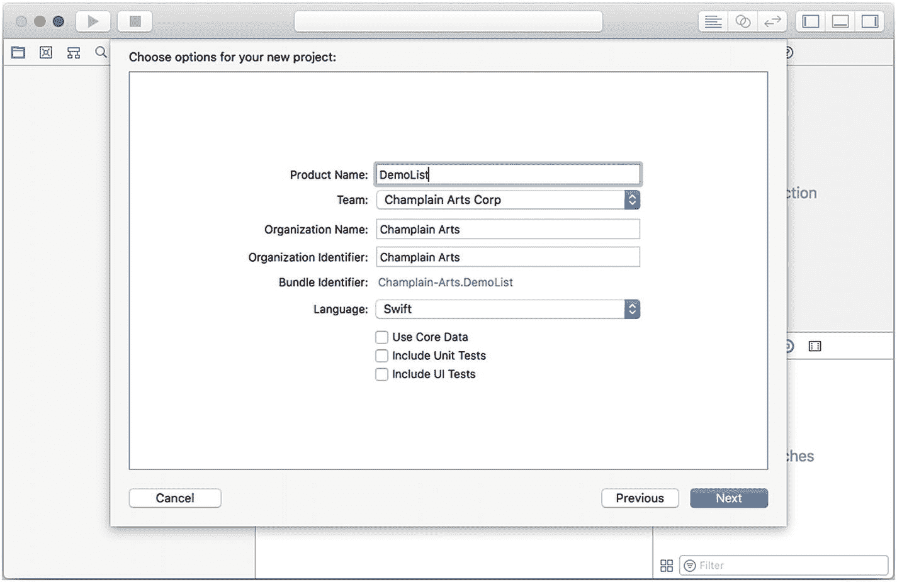

图 14-6 – 命名新项目并设置其选项

当需要保存新项目时，你可以选择将其添加到现有项目中，如图 14-7 所示。

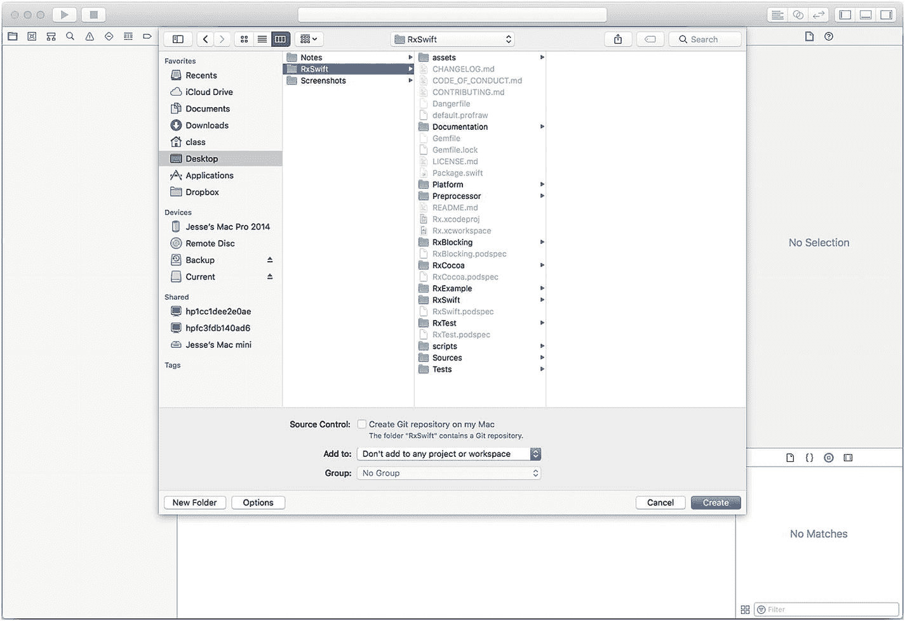

图 14-7 – 保存新项目

选择将其添加到现有项目或工作区的选项，如图 14-8 所示。


图 14-8 – 将新项目添加到现有项目或工作区

与创建新项目时一样，尝试构建并运行它。考虑到设备与模拟器之间的差异，一个很好的测试方法是：在输入任何代码之前，先在设备和模拟器上都运行一下。（如果你确实运行了，请记住故事板是空白的，因此看到空白屏幕是正常现象。你可以如前所述添加一个标签或图片来验证你的应用。）

### 添加 ReactiveX

到目前为止，这基本上就是你之前在下载的仓库中添加内容时见过的流程。现在，是时候添加 `ReactiveX` 了。

### 构建 RxCocoa 和 RxSwift

在开始之前，你需要先构建好 `RxCocoa` 和 `RxSwift`。如果尚未构建，请按图 14-4 所示进行构建。请记住，你可以使用通用 iOS 设备进行这些构建。构建完成后，它们将列在 `Products` 组中，如图 14-9 所示。所有可用的产品都会被列出。已构建的产品将以黑色显示，而非红色。

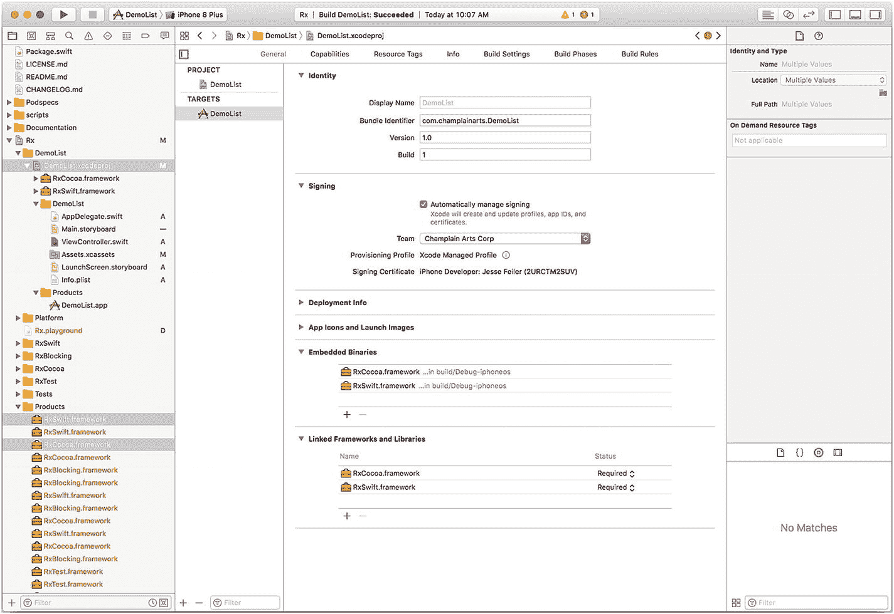

图 14-9 – 验证你已构建了 `RxSwift` 和 `RxCocoa`

### 将 RxSwift 和 RxCocoa 添加到项目中

现在，将 `RxSwift` 和 `RxCocoa` 拖入 `DemoList` 的"通用"选项卡下的"Embedded Binaries"部分。如果将它们拖到"Embedded Binaries"中，它们也会自动添加到"Linked Frameworks and Libraries"中。

### 验证语法

关键的测试是，你能否在源代码中引用 `ReactiveX` 的特性，然后运行你的应用并使用它们。这些特性将在应用模板的 `ViewController` 中使用，因此请在代码顶部添加 `import` 语句，如图 14-10 所示。

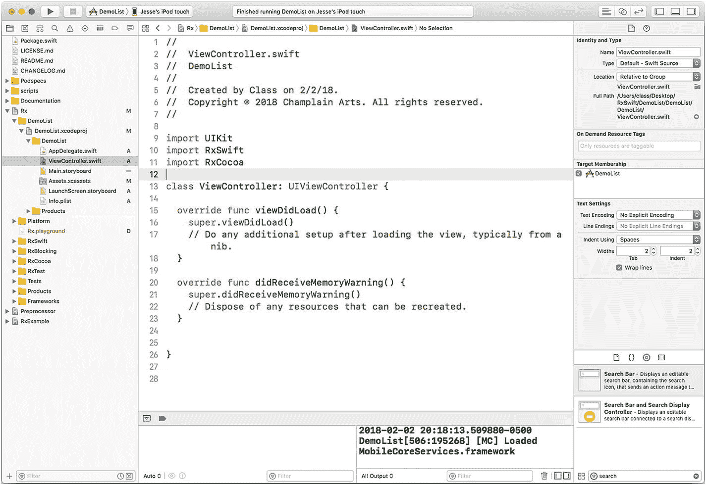

图 14-10 – 添加 import 语句

如果出了问题，你将无法构建你的应用。输入 `import` 语句时，甚至可能会出现语法错误。如果确实遇到错误，请仔细检查你所执行的步骤，并留意窗口顶部的状态栏，确保索引已完成。请注意，当你移动这些文件并构建 `ReactiveX` 组件时，可能会看到一些错误，这些错误会在项目完全索引和构建后消失。不要对语法错误反应过激。

### 构建故事板

在基于模板的项目启动后，你可以开始构建故事板。简而言之，你需要创建一个带有搜索栏和表格的视图控制器（请回顾图 10-1 查看结果）。

此过程的步骤与你使用任何项目时的基本 Xcode 和 Interface Builder 步骤相同。首先打开包含单个视图控制器的故事板。选择视图控制器，并在其顶部添加一个半透明导航栏，如图 14-11 所示。

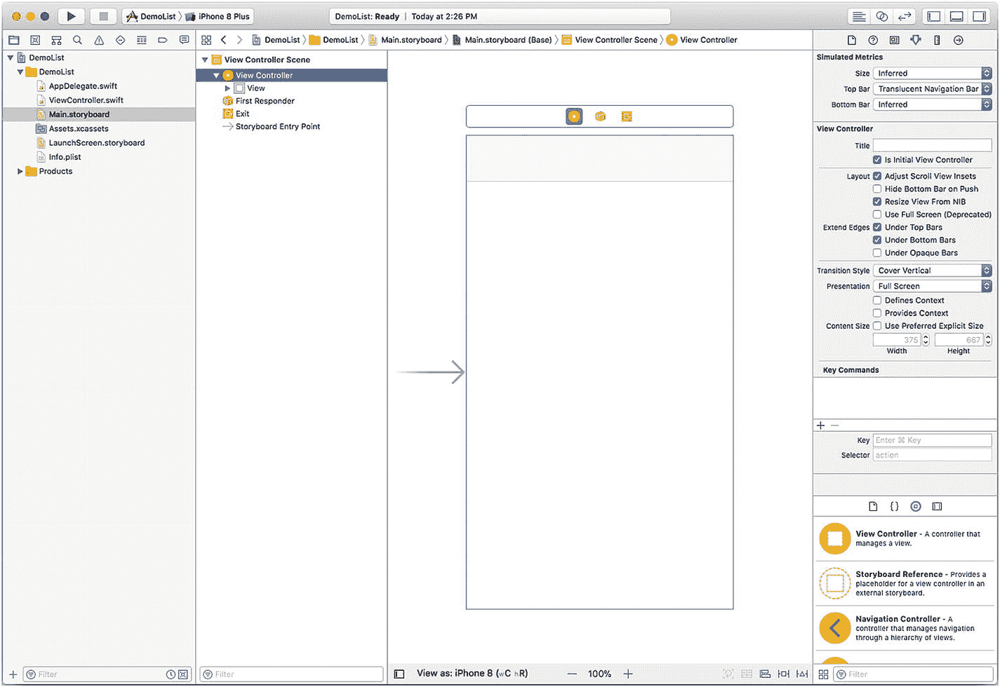

图 14-11 – 在视图控制器顶部使用半透明导航栏

向视图中添加一个 `UITableView`。选中表格视图后，为表格视图选择"Dynamic Prototypes"，并指定一个原型，如图 14-12 所示。

在 `ViewController` 中，添加对搜索栏和表格视图的引用，使它们能在 `ViewController` 的顶部对代码可见：

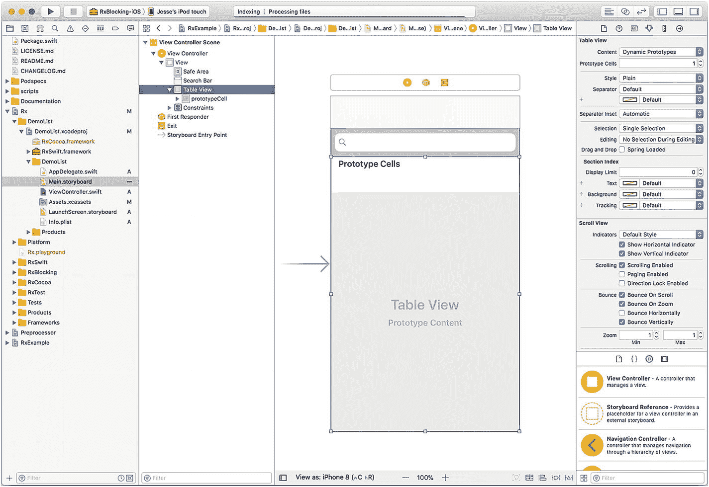

图 14-12 – 使用动态原型单元格

```
@IBOutlet weak var searchBar: UISearchBar!
@IBOutlet weak var tableView: UITableView!
```

与 `UITableView` 中动态原型单元格的常见情况一样，系统会为你在表格视图中设置的每个原型数量创建一个单元格。对于每个单元格，你需要提供一个标识符用于检索。在图 14-12 中，你可以看到布局左侧的结构视图中使用 `prototypeCell` 作为原型单元格的名称。


#### 添加 `UITableView` 代码与委托

如果你在跟着做，现在只需要实现 `ViewController`。模板中的 `AppDelegate`、`Assets.xcassets`、`Info.plist` 或 `LaunchScreen.storyboard` 无需修改。模板本身会做一些初始化设置，但你不必去改动它们。

你需要为表格视图实现一个 `DataSource`。（稍后可能需要实现一个 `Delegate`。）`DataSource` 向视图控制器提供数据。数据源的两个关键方法与你在任何 `UITableView` 中使用的方法相同。

在 `ViewController` 中创建两个数组。`items` 将包含列表中所有可能的项目，而 `itemsToShow` 则是 `items` 中实际显示的项目。声明如下：

```
var itemsToShow = [String]()
let items = ["Saranac River", "Fort Moreau", "Oval", "Fort Brown",
"Water Pollution Control Plant", "Fort Scott"]
```

（`items` 中的字符串由你决定。）

你还需要声明一个 `DisposeBag` 来管理你的观察者。它将自动收集此对象（`ViewController`）中生成的可清理资源，当对象被释放且其 `deinit` 方法被调用时，这些资源将被释放。

```
let disposeBag = DisposeBag()
```

你需要按如下方式实现 `viewDidLoad`：

```
override func viewDidLoad() {
super.viewDidLoad()
}
```

两个标准的 `UITableView` 函数让你指定要显示的项目数量及其内容。

要指定显示的项目数量，请使用 `numberOfRowsInSection`。返回 `itemsToShow` 的计数，函数如下所示：

```
func tableView (_ tableView: UITableView, numberOfRowsInSection section: Int) -> Int {
return itemsToShow.count
}
```

你需要格式化并返回要显示的单元格。使用你想要的单元格原型标识符，并将其 `textLabel` 设置为 `itemsToShow` 中对应的字符串：

```
func tableView(_ tableView: UITableView, cellForRowAt indexPath: IndexPath) ->
UITableViewCell {
let cell = tableView.dequeueReusableCell(withIdentifier: "prototypeCell",
for: indexPath)
cell.textLabel?.text = itemsToShow[indexPath.row]
return cell
}
```

最后，通过如下方式更改声明，指定 `ViewController` 遵循 `UITableViewDataSource` 协议：

```
class ViewController: UIViewController, UITableViewDataSource {
```

在 Interface Builder 中，将表格视图连接到数据源。

#### 实现 ReactiveX 搜索栏

代码的最后一部分在 `viewDidLoad` 中实现了搜索栏。最重要的是以下几点：

- 一个 `items` 数组（只要数组元素是字符串，数组类型是什么并不重要）
- 一个 `itemsToShow` 数组（初始化为一个空的 `String` 数组）
- 一个名为 `tableView` 的 `tableView`

这是函数式编程的特点之一：在许多情况下，你无需担心正在处理的具体数据。

```
override func viewDidLoad() {
super.viewDidLoad()
// 从 nib 文件加载视图后进行任何额外的设置。
searchBar
.rx.text
.orEmpty
.subscribe(onNext: { [unowned self] query in
self.itemsToShow = self.items.filter {
$0.hasPrefix(query)
}
self.tableView.reloadData()
})
}
```

##### 注意

你可能会收到一条警告，提示此时未使用 `subscribe`：这只是一条警告，你可以先继续。

### 审查代码

总而言之，你的代码现在已经完成了。它应该如列表 14-1 所示。

```
import UIKit
import RxSwift
import RxCocoa
class ViewController: UIViewController, UITableViewDataSource {
@IBOutlet weak var searchBar: UISearchBar!
@IBOutlet weak var tableView: UITableView!
var itemsToShow = [String]()
let items = ["Saranac River", "Fort Moreau", "Oval", "Fort Brown",
"Water Pollution Control Plant", "Fort Scott"]
let disposeBag = DisposeBag()
override func viewDidLoad() {
super.viewDidLoad()
// 从 nib 文件加载视图后进行任何额外的设置。
searchBar
.rx.text
.orEmpty
.subscribe(onNext: { [unowned self] query in
self.itemsToShow = self.items.filter {
$0.hasPrefix(query)
}
self.tableView.reloadData()
})
}
func tableView (_ tableView: UITableView, numberOfRowsInSection section: Int) -> Int
{
return itemsToShow.count
}
func tableView(_ tableView: UITableView, cellForRowAt indexPath: IndexPath)
-> UITableViewCell {
let cell = tableView.dequeueReusableCell(withIdentifier: "prototypeCell",
for: indexPath)
cell.textLabel?.text = itemsToShow[indexPath.row]
return cell
}
override func didReceiveMemoryWarning() {
super.didReceiveMemoryWarning()
// 释放任何可以重新创建的资源。
}
}
```

**列表 14-1** 视图控制器的完整代码


### 摘要

现在您应该能够运行该应用了。在 Xcode 中打开项目，选择 `DemoList` 来运行。

