# 1. 设置游戏场景并添加第一个精灵

James Goodwill¹ 和 Wesley Matlock²  
(1) 美国科罗拉多州海兰兹牧场  
(2) 美国密苏里州堪萨斯城

SpriteKit 是 Apple 令人兴奋的 2D 游戏框架，于 2013 年 9 月随 iOS 7 首次发布。它是一个动画和图形渲染框架，能够让你轻松地为纹理图像添加动画、播放视频、渲染文本以及添加粒子效果。它还集成了一个物理库。SpriteKit 是第一个正式内置于 iOS SDK 中的游戏引擎。在本章中，你将了解 SpriteKit 是什么，以及如何使用 Xcode 创建一个新的 SpriteKit 游戏。接着，你将从头开始创建一个 SpriteKit 游戏的初步框架。你将学习关于`SKNodes`及其子类的知识，并使用`SKSpriteNode`为你的游戏添加一个背景节点和一个玩家节点。

### 你需要了解并拥有的东西

本书的这一部分假设你具备使用 Xcode 和 Xcode 模拟器构建 iPhone 应用程序的基本理解。同时，它也假设你对 iOS/Mac 编程语言 Swift 有基本了解。如果你不熟悉 Swift，本书末尾的附录中有简要介绍。本书不涵盖编程方法，只专注于 SpriteKit 游戏编程。要完成本书中的所有示例，你需要一台搭载 OS X 10.11（El Capitan）或更新版本的 Intel 架构 Mac 电脑。你还需要安装 Xcode 8+。这两者都可以在 Apple App Store 中找到。

### 介绍 SuperSpaceMan

我们认为学习任何东西的最佳方式就是动手去做。因此，在本章中，你将直接投入并创建自己的游戏。你将从一个 2D 游戏的基本代码开始，并在我们每章引入新主题时，向游戏中添加新功能。在本书结束时，你将拥有一个完整的游戏。你要创建的游戏灵感来自 Sega 广受欢迎的 Sonic Jump Fever（[`itunes.apple.com/us/app/sonic-jump-fever/id794528112?mt=8`](https://itunes.apple.com/us/app/sonic-jump-fever/id794528112?mt=8)）。这是一个垂直卷轴游戏，主角在障碍物和收集品之间加速前进，通过收集戒指来增加分数。我们的游戏类似，也是一个垂直卷轴游戏，但你的主角将是一名太空人，他在太空中疾驰，收集能量球，同时努力避开会摧毁他的黑洞。

### 创建一个 Swift SpriteKit 项目

在开始之前，你需要创建一个 Swift SpriteKit 项目。打开 Xcode 并完成以下步骤：

1. 点击 文件 ➤ 新建 ➤ 项目。
2. 选择 iOS。
3. 从应用程序组中选择游戏图标。此时选择模板对话框应如图 1-1 所示。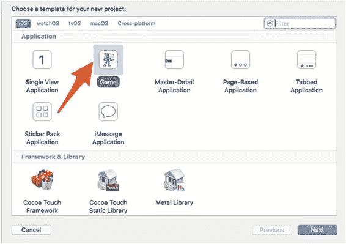  
图 1-1. 选择模板对话框
4. 点击下一步按钮继续。
5. 输入 `SuperSpaceMan` 作为产品名称，`Apress` 作为组织名称，`com.apress` 作为组织标识符。
6. 确保选择 `Swift` 作为语言，`SpriteKit` 作为游戏技术，以及 `iPhone` 作为设备。
7. 在点击下一步之前，查看图 1-2。如果一切与此一致，点击下一步并选择一个合适的位置来存储你的项目文件。点击创建。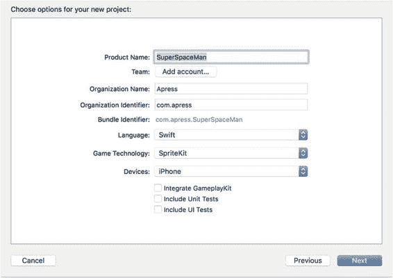  
图 1-2. 选择项目选项对话框

注意：你会注意到你正在创建一个仅限 iPhone 的游戏。这只是因为你创建的游戏更适合 iPhone。我们在本书中介绍的所有内容同样适用于 iPad。现在你有了一个可运行的 SpriteKit 项目。继续点击播放按钮，看看你创建了什么。如果一切顺利，你将看到你的新应用在模拟器中运行。注意：在某些较慢的机器上，Xcode 模拟器可能需要一段时间才能启动。模拟 SpriteKit 应用可能会对处理器造成较大负担。目前它还没有太多功能，但不仅仅只是显示“Hello, World!”而已。点击模拟器屏幕几次。你会在每次点击的位置看到旋转的方块。根据你点击的位置，你应该会看到类似于图 1-3 的内容。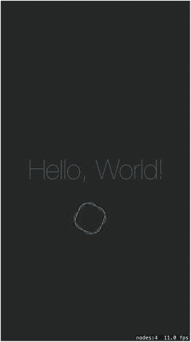  
图 1-3. SpriteKit 示例应用

### 从头开始

尽管标准的 SpriteKit 模板很好用，但你将从头开始。从零开始能让你看到 SpriteKit 游戏中的所有工作组件，并使你对自己正在创建的内容有更深入的理解。你需要做的第一件事是确保你的游戏仅在竖屏模式下运行。为此，请按照以下步骤操作：

1. 在项目资源管理器中选中 SuperSpaceMan 项目。
2. 然后在 Targets 下选择 SuperSpaceMan。
3. 取消勾选横屏向左和横屏向右。


此时，你的目标设置应如图 1-4 所示。

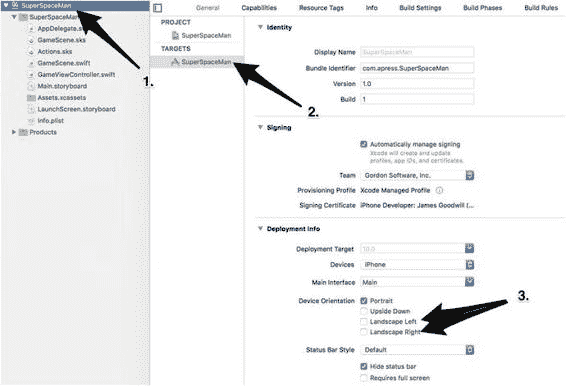 图 1-4. SuperSpaceMan 目标设置

接下来需要删除 `GameScene.sks` 和 `Actions.sks` 文件。在本书中你不会用到关卡编辑器。你可以在 `SuperSpaceMan` 组中找到这些文件，如图 1-5 所示。

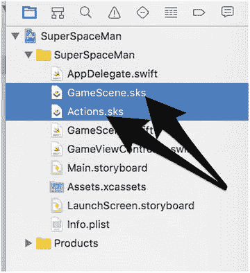 图 1-5. 删除 SKS 文件

删除这些文件后，打开 `GameScene.swift` 并将其内容替换为清单 1-1 中的类。

```
import SpriteKit

class GameScene: SKScene {
    required init?(coder aDecoder: NSCoder) {
        super.init(coder: aDecoder)
    }

    override init(size: CGSize) {
        super.init(size: size)
        backgroundColor = SKColor(red: 0.0, green: 0.0, blue: 0.0, alpha: 1.0)
    }
}
```

清单 1-1. `GameScene.swift`：SuperSpaceMan 主游戏场景

在检查你的基线项目之前，还需要做一处修改。打开 `GameViewController.swift` 并将其内容替换为清单 1-2 中同一类的版本。

```
import SpriteKit

class GameViewController: UIViewController {
    var scene: GameScene!
    override var prefersStatusBarHidden: Bool {
        return true
    }

    override func viewDidLoad() {
        super.viewDidLoad()

        // 1. 配置主视图
        let skView = view as! SKView
        skView.showsFPS = true

        // 2. 创建并配置游戏场景
        scene = GameScene(size: skView.bounds.size)
        scene.scaleMode = .aspectFill

        // 3. 显示场景
        skView.presentScene(scene)
    }
}
```

清单 1-2. `GameViewController.swift`：SuperSpaceMan 主 UIViewController

保存所有更改，然后再次点击播放按钮。哇，嗯，这并不令人兴奋。如果你完成了所有更改，现在应该面对着一个完全黑色的屏幕，只显示当前帧率。这正是预期效果，你确实是从零开始。

让我们花点时间检查新游戏的每个组件。首先，打开 `Main.storyboard`。这里的一切看起来应该相当正常。你应该会看到一个包含单个 `UIViewController` 的单个故事板。在 Storyboard 资源管理器中展开 `Game View Controller Scene` 并选择 `Game View Controller`，如图 1-6 所示。

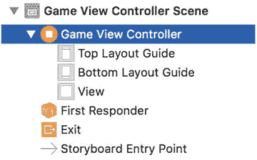 图 1-6. Game View Controller 场景

现在展开 Xcode 右侧的实用工具视图，并点击“显示标识检查器”按钮。你会看到这个 `UIViewController` 的自定义类正是你的 `GameViewController.swift`。图 1-7 展示了这一连接。

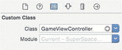 图 1-7. 自定义类 `GameViewController`

在回到本教程的代码部分之前，还有最后一件事要检查。回到实用工具视图并选择连接检查器。注意 `View` 出口已连接到你的 `GameViewController.view`。图 1-8 展示了这一连接。

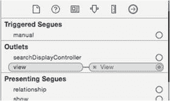 图 1-8. View 出口

进行故事板检查的目的在于说明，尽管 `SpriteKit` 用于创建游戏，但创建游戏所使用的技术与创建任何现代 iOS 应用所采用的技术并无二致。

#### `GameViewController` 类

让我们回到代码。你可以忽略 `AppDelegate.swift`——这是启动所有 iOS Swift 应用时使用的标准样板代码。`GameViewController.swift` 是最佳的起点。我们之前已经包含它，但为方便起见，这里再次列出：

```
import SpriteKit

class GameViewController: UIViewController {
    var scene: GameScene!
    override var prefersStatusBarHidden: Bool {
        return true
    }

    override func viewDidLoad() {
        super.viewDidLoad()

        // 1. 配置主视图
        let skView = view as! SKView
        skView.showsFPS = true

        // 2. 创建并配置游戏场景
        scene = GameScene(size: skView.bounds.size)
        scene.scaleMode = .aspectFill

        // 3. 显示场景
        skView.presentScene(scene)
    }
}
```

从这个控制器的第一行开始，你看到一条简单的 `import`，包含了 `SpriteKit` 框架。这一行使所有 `SpriteKit` 相关的类可用于你的 `GameViewController`。之后是一个标准的类定义——`GameViewController` 继承自 `UIViewController`。在类定义之后，你看到了可选变量 `scene` 的声明，其类型被声明为 `GameScene`。`GameScene` 是将承担大部分工作的类，你将在其中添加游戏逻辑。我们将在下一节中查看这个类。

请注意关于 `scene` 变量的一点：它是一个可选类型。你知道它是可选类型，因为其声明后跟有一个感叹号（`!`）。你将其声明为可选类型，是因为你打算等到 `viewDidLoad()` 方法触发时才对其进行初始化，而 Swift 要求你在类中要么在声明时初始化所有属性，要么在 `init()` 中初始化。如果你没有在这两个位置中的任何一个初始化属性，则必须将该属性声明为可选类型。在本书的例子中，我们将多次用到可选类型。

在 `scene` 声明之后，你看到了对 `UIViewController` 的 `viewDidLoad()` 方法的重写。此处你返回了 `true`，因为你不想在游戏中显示状态栏。

接下来要检查的是 `viewDidLoad()` 方法。这是你真正开始看到第一个活跃的 `SpriteKit` 代码的地方。在调用 `super.viewDidLoad()` 之后，你做的第一件事就是配置主视图。在第一步中，你将标准的 `UIView` 向下转换为 `SKView`。`SKView` 是承载之前提到的游戏场景的视图。在大多数情况下，`SKView` 的行为与任何 `UIView` 类似，不同之处在于它拥有一系列与游戏相关的属性和实用方法，例如向下转换之后的这一行：

```
skView.showsFPS = true
```

`SKView` 的这个属性用于显示或隐藏应用程序正在渲染的每秒帧数——帧率越高越好。

配置主视图后，你创建并配置了 `GameScene`：

```
scene = GameScene(size: skView.bounds.size)
scene.scaleMode = .aspectFill
```

第一行创建了一个新的 `GameScene` 实例，并将其大小初始化为与承载场景的视图大小一致。之后，你将 `scaleMode` 设置为 `.aspectFill`。`scaleMode`（由枚举 `SKSceneScaleMode` 实现）用于确定场景将如何缩放以匹配容纳它的视图。表 1-1 描述了所有可用的 `scaleMode` 属性。

表 1-1. `SKSceneScaleModes`


| `SKSceneScaleMode` | 定义 |
| --- | --- |
| `SKSceneScaleMode.fill` | fill 缩放模式将填满整个 `SKView`，不考虑宽高比。 |
| `SKSceneScaleMode.aspectFill` | aspectFill 模式会缩放场景以填满宿主 `SKView`，同时保持场景的宽高比，但如果宿主 `SKView` 的宽高比不同，则可能会发生裁剪。这是你在本游戏中使用的模式。 |
| `SKSceneScaleMode.aspectFit` | aspectFit 模式会缩放场景以填满宿主 `SKView`，同时保持场景的宽高比，但如果宿主 `SKView` 的宽高比不同，则可能会出现黑边。 |
| `SKSceneScaleMode.resizeFill` | resizeFill 模式会修改场景的大小，以精确适配宿主视图。 |

注意：在设置场景的 `scaleMode` 属性时，你正在使用一种简写语法来表示所设置的模式，具体是 `.aspectFill` 模式。你可以使用这种点语法，是因为你知道 `scaleMode` 属性的类型是 `SKSceneScaleMode`，这是一个包含所有缩放模式的枚举。一旦你配置好了视图和场景，就只剩下最后一件事了：呈现场景。这通过 `viewDidLoad()` 中的最后一行代码完成：`skView.presentScene(scene)`

#### `GameScene` 类

现在我们已经带你逐行了解了 `GameViewController` 类，是时候讨论 `GameScene` 类了。同样，为方便起见，我们再次附上 `GameScene.swift` 文件的源代码：

```
import SpriteKit
class GameScene: SKScene {
    required init?(coder aDecoder: NSCoder) {
        super.init(coder: aDecoder)
    }
    override init(size: CGSize) {
        super.init(size: size)
        backgroundColor = SKColor(red: 0.0, green: 0.0, blue: 0.0, alpha: 1.0)
    }
}
```

当你查看 `GameScene` 时，会发现它其实没有太多内容。它继承自 `SKScene` 并实现了两个 `init()` 方法；第一个接收 `NSCoder` 参数的 `init()` 可以忽略。你感兴趣的是第二个 `init()` 方法，它接收一个 `CGSize` 参数，表示你希望场景的大小（在此例中，是你从 `GameViewController` 传入的大小）。之后，你将大小传递给父类，然后将背景颜色设置为黑色。虽然你当前的 `GameScene` 内容不多，但这里将是你完成几乎所有 SpriteKit 工作的地方。`SKScene` 及其子类是所有 SpriteKit 内容的根节点，随着本书的深入，你的 `GameScene` 会变得相当庞大。

### 添加背景和玩家精灵

本章我们已经说得够多了。让我们回到游戏本身。在本章的最后一节中，你将直接动手，向场景中添加游戏背景和玩家精灵，并看看它们的效果。在此之前，你需要一些图像文件。你可以在 [www.apress.com](http://www.apress.com) 上找到本书所需的所有资源，文件名为 `assets.zip`（搜索本书标题即可）。请下载并解压该文件。在解压后的文件夹中，你会看到两个文件夹：一个名为 `Images`，另一个名为 `sprites.atlas`。将整个 `sprites.atlas` 文件夹直接复制到同一项目的 `SuperSpaceMan` 文件夹中。接下来，在 Xcode 中打开 `Assets.xcassets` 文件夹。你会看到类似于图 1-9 的内容。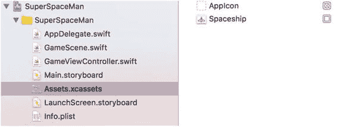 图 1-9. 添加图像资源 现在选择 `Spaceship` 资源并将其删除。之后，使用 Finder 浏览到之前下载的 zip 文件中的 `Images` 文件夹。选择 `Images` 目录下的四个文件夹，然后将它们拖拽到 xcassets 面板中，直接放在 `Spaceship` 资源下方。文件添加完成后，你的 xcassets 面板将如图 1-10 所示。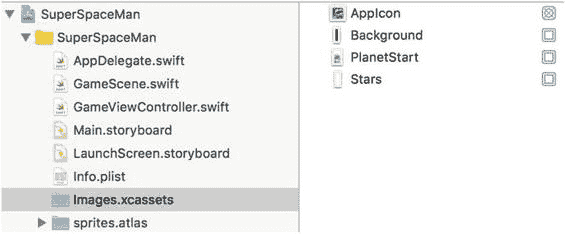 图 1-10. 已添加的图像资源

现在所有图像都已添加到项目中，让我们来好好利用它们。回到 `GameScene.swift`，并在 `GameScene` 类的开头添加以下两行代码：

```
let backgroundNode = SKSpriteNode(imageNamed: "Background")
let playerNode = SKSpriteNode(imageNamed: "Player")
```

这里你添加了两个常量，`backgroundNode` 和 `playerNode`，它们都被初始化为 `Image.xcassets` 文件夹中对应的图像。请注意每个常量的类型：它们都是 `SKSpriteNode`。`SKSpriteNode` 是 `SKNode` 的子类，而 `SKNode` 是几乎所有 SpriteKit 内容的主要构建块。`SKNode` 本身不绘制任何视觉元素，但基于 SpriteKit 的应用中的所有视觉元素都是使用 `SKNode` 的子类绘制的。表 1-2 定义了用于渲染视觉元素的 `SKNode` 的主要子类。

表 1-2. 渲染视觉元素的 `SKNode` 子类

| 类 | 描述 |
| --- | --- |
| `SKSpriteNode` | 用于绘制纹理精灵的节点 |
| `SKVideoNode` | 用于呈现视频内容的节点 |
| `SKLabelNode` | 用于绘制文本字符串的节点 |
| `SKShapeNode` | 用于基于 Core Graphics 路径绘制形状的节点 |
| `SKEmitterNode` | 用于创建和渲染粒子的节点 |
| `SKCropNode` | 用于使用蒙版裁剪子节点的节点 |
| `SKEffectNode` | 用于对其子节点应用 Core Image 滤镜的节点 |


在本书中，你将使用 `SKNode` 的三个子类：`SKSpriteNode`、`SKLabelNode` 和 `SKEmitterNode`。添加两个 `SKSpriteNodes` 后，删除设置背景色的代码行，并在 `GameScene.init(size: CGSize)` 方法的底部添加以下几行代码：

```
backgroundNode.size.width = frame.size.width
backgroundNode.anchorPoint = CGPoint(x: 0.5, y: 0.0)
backgroundNode.position = CGPoint(x: size.width / 2.0, y: 0.0)
addChild(backgroundNode)
```

这段代码的第一行将 `backgroundNode` 的宽度设置为视图框架的宽度。下一行代码决定了新节点在场景中的锚点位置。目前无需过度关注这一点；我们将在下一章详细讨论锚点。只需知道锚点 `(0.5, 0.0)` 将背景节点的锚点设置到节点的底部中央即可。接下来，你设置了 `backgroundNode` 的位置。这里将节点的 x 坐标设为场景宽度的一半（即场景中央），将 y 坐标设为 `0.0`（即场景底部）。代码片段中的最后一行将 `backgroundNode` 添加到了场景中。

若要查看刚才完成的效果，请保存你的工作并再次运行应用程序。现在你应该能看到背景显示出来了，如图 1-11 所示。

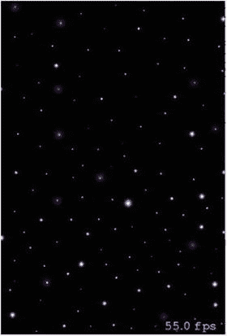

图 1-11. 已添加到 `GameScene` 的 `backgroundNode`

这很简单。现在，让我们将玩家添加到场景中。添加玩家节点与添加背景一样简单。请看下面的代码片段：

```
playerNode.position = CGPoint(x: size.width / 2.0, y: 80.0)
addChild(playerNode)
```

如你所见，这段代码设置了 `playerNode` 的位置并将其添加到场景中。请注意这里的一个区别：你没有设置 `playerNode` 的锚点。这是因为所有 `SKNodes` 的默认锚点都是 `(0.5, 0.5)`，即节点的中心点。同样，暂时不必担心这些位置或 `anchorPoints`。我们会在下一章讨论它们。

继续将这段代码添加到 `GameScene.init()` 方法的底部并保存更改。然后再次运行应用程序。现在你会看到 `SuperSpaceMan` 出现在之前添加的 `backgroundNode` 前面，如图 1-12 所示。

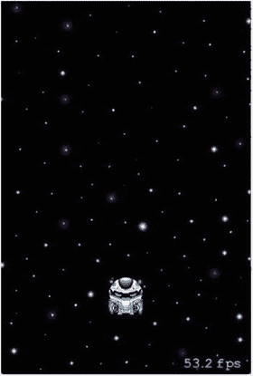

图 1-12. 已添加到 `GameScene` 的 `playerNode`

完成这些更改后，你的新 `GameScene.swift` 文件应如下所示（代码清单 1-3）。

```
import SpriteKit

class GameScene: SKScene {
    let backgroundNode = SKSpriteNode(imageNamed: "Background")
    let playerNode = SKSpriteNode(imageNamed: "Player")

    required init?(coder aDecoder: NSCoder) {
        super.init(coder: aDecoder)
    }

    override init(size: CGSize) {
        super.init(size: size)

        // 添加背景
        backgroundNode.size.width = frame.size.width
        backgroundNode.anchorPoint = CGPoint(x: 0.5, y: 0.0)
        backgroundNode.position = CGPoint(x: size.width / 2.0, y: 0.0)
        addChild(backgroundNode)

        // 添加玩家
        playerNode.position = CGPoint(x: size.width / 2.0, y: 80.0)
        addChild(playerNode)
    }
}
```

代码清单 1-3. `GameScene.swift`：修改后的 `GameScene.swift`

### 本章小结

在本章中，你学习了什么是 SpriteKit，以及如何使用 Xcode 创建全新的 SpriteKit 游戏。然后你深入其中，从头开始创建了一个 SpriteKit 游戏的雏形。你学习了 `SKNodes` 及其子类，并使用 `SKSpriteNode` 添加了背景节点和玩家节点。在下一章中，你将更深入地探讨 SpriteKit，并详细讨论 `SKScene` 的相关内容，包括坐标系和锚点。你还会了解场景的节点树是如何构建的。

© James Goodwill 与 Wesley Matlock 2017  
James Goodwill 与 Wesley Matlock  
*Beginning Swift Games Development for iOS*  
10.1007/978-1-4842-2310-9_2

