# 2. SpriteKit 场景与 SKNode 定位

James Goodwill¹ 与 Wesley Matlock²  

(1) 美国科罗拉多州海兰兹牧场  
(2) 美国密苏里州堪萨斯城  

第 1 章论述了什么是 SpriteKit 以及如何使用它创建 2D 游戏。它展示了如何开始使用 `SKSpriteNode` 创建背景和玩家精灵，然后展示了如何将它们添加到游戏场景中。本章将稍作回顾，更深入地探讨 SpriteKit 场景，包括场景的构建方式以及构建顺序为何会改变你的游戏。最后，我们将讨论与 `SKNodes` 相关的 SpriteKit 坐标系和锚点。

### 什么是 SKScene？

我们在第 1 章中使用了 `SKScene` 对象来承载背景和玩家节点，但并未真正解释我们使用的场景。我们只是用它来添加精灵，然后就结束了。现在是时候深入探究 `SKScene` 的真正工作原理了。我们将从定义 `SKScene` 对象开始。一个 `SKScene` 对象代表 SpriteKit 游戏中一个场景的内容。它继承自 `SKEffectNode`、`SKNode`、`UIResponder`，当然还有 `NSObject`。它的构建过程是：首先创建场景，然后向其添加 *n* 个其他 `SKNodes`。场景及其所有子节点被称为节点树，而场景是节点树的根。场景中包含的节点提供了场景将要动画和渲染显示的内容。

以下是你上一章为创建节点树所执行的步骤。它们是你在设置游戏场景时始终会完成的基本步骤：

1. 创建 `GameViewController`。
2. 让 `GameViewController` 创建其 `UIView`。
3. 在 `GameViewController.viewDidLoad()` 方法内，将 `UIView` 向下转型为 `SKView`，并设置 `showFPS` 属性为 `true`：

```
let skView = view as! SKView
skView.showsFPS = true
```

4. 创建一个名为 `GameScene` 的 `SKScene` 实例，在构造函数中传入其大小，并设置 `scaleMode` 属性：

```
scene = GameScene(size: skView.bounds.size)
scene.scaleMode = .aspectFill
```

5. 在 `GameScene` 的 `init()` 方法内，更新场景中的 `backgroundNode` 和 `playerNode` 对象：

```
backgroundNode.anchorPoint = CGPoint(x: 0.5, y: 0.0)
backgroundNode.position = CGPoint(x: size.width / 2.0, y: 0.0)
addChild(backgroundNode)

playerNode.position = CGPoint(x: size.width / 2.0, y: 80.0)
addChild(playerNode!)
```

6. 在 `GameViewController.viewDidLoad()` 方法中展示完整的场景：

```
skView.presentScene(scene)
```

至此，你就拥有了一个包含完整节点树的完整场景。你可以随时根据游戏进展添加更多节点，但这些是你在创建新 `SKScene` 时始终会完成的基本步骤。


### SKScene 渲染循环

在本节中，我们将介绍 `SKView` 展示 `SKScene` 后所发生的一切。在更传统的 iOS 应用程序中，你只需要渲染视图内容一次，然后它就会保持静态，直到视图所呈现的模型发生变化。这对商业应用来说没问题，但游戏的内容可能持续变化。由于这种动态特性，SpriteKit 会不断更新场景及其内容。这种持续更新被称为渲染循环（见图 2-1）。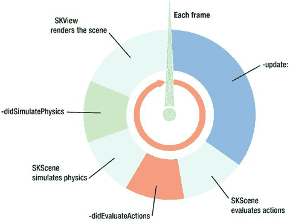 图 2-1. SpriteKit 渲染循环

循环的每次迭代都会生成场景中的下一帧。生成场景下一帧所涉及的步骤如下：

1.  场景调用其 `update()` 方法。这是放置大部分游戏逻辑的地方。通常，你会在这里移动节点、向现有节点添加新动作以及处理用户输入。（我们将在第 4 章中讨论 `update()` 方法。）
2.  接着，场景对其所有子节点执行所有编程设定的动作。在此步骤中，场景会执行你可能在步骤 1 中设置的任何动作。（我们将在第 5 章中讨论动作。）
3.  然后，场景调用 `didEvaluateActions()` 方法。此处可用于放置任何动作后的游戏逻辑。例如，在动作执行后测试节点的位置并做出相应响应。
4.  接下来，场景对场景中的物理体执行所有物理模拟。（我们将在第 3 章中讨论物理。）
5.  场景调用 `didSimulatePhysics()` 方法。这与 `didEvaluateActions()` 方法非常相似，你可以在此处添加所有物理模拟完成后要执行的任何游戏逻辑。这是在场景渲染之前执行任何游戏逻辑的最后机会。
6.  渲染场景。

随着你阅读本书各章节的深入，你将会看到渲染循环中每个步骤的示例。

**注意：**当你在 `SKView` 中设置了 `showsFPS` 时，你将看到游戏每秒渲染的帧数。每个被渲染的帧代表渲染循环的一次迭代。

### 构建场景的节点树

在本章前面部分，我们讨论了如何使用背景节点和玩家节点来设置一个简单的 `SKScene`。你是通过 `SKScene.addChild()` 方法实现这一点的。本节将更深入地探讨场景是如何创建的。我们还提到了 `SKScene` 类扩展的类型。其中一种类型是 `SKNode`。`SKNode` 是用于保存 `SKScene` 对象节点树中所有节点的类。它还定义了用于操作此节点树的方法。其中最常用的方法是 `addChild()`、`insertChild()` 和 `removeFromParent()`，如表 2-1 所述。

表 2-1. `SKNode` 节点树操作方法

| 方法 | 用途 |
| --- | --- |
| `addChild()` | `addChild(_:)` 方法将一个节点添加到接收者的子节点集合的末尾。 |
| `insertChild(_:at:)` | `insertChild(_:at:)` 方法将一个子节点插入到接收者的子节点集合中的特定位置。 |
| `removeFromParent()` | `removeFromParent()` 将接收节点从其父节点中移除。 |

这是你将用于构建场景节点树的三种方法。了解这些方法如何工作的最简单方式是通过一个简单的示例。请看以下序列：

```
var gameScene = SKScene(size: CGSizeMake(320.0, 568.0))
var node1 = SKSpriteNode()
var node2 = SKSpriteNode()
var node3 = SKSpriteNode()
gameScene.addChild(node1)
gameScene.addChild(node2)
gameScene.addChild(node3)
```

这里你创建了一个名为 `gameScene` 的 `SKScene`。然后你创建了三个节点并将它们添加到 `gameScene` 中。此时，`gameScene` 的节点树如图 2-2 所示。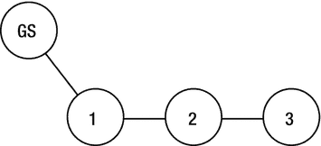 图 2-2. 添加三个节点后的 `gameScene` 的 children 属性

**注意：**图 2-2 及后续几个图中的线条表示每个节点被添加的顺序。它并不表示节点本身彼此相关。例如，`node2` 并未添加到 `node1` 上。`node2` 只是在 `node1` 之后被添加的。

此时，节点树包含三个节点：`node1`、`node2` 和 `node3`（按此顺序）。现在，如果你执行以下代码片段，你将得到一个如图 2-3 所示的节点树：

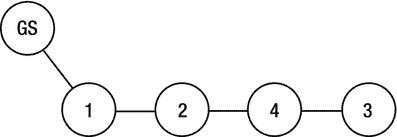 图 2-3. 插入第四个节点后的 `gameScene` 节点树

```
var node4 = SKSpriteNode()
gameScene.insertChild(node4, at: 2)
```

`insertChild()` 方法在节点树的给定位置插入一个节点。在这个例子中，你要求将节点插入到第三个位置（第一个节点位于位置 0）。children 属性现在包含四个节点，`node4` 被插入到 `node2` 和 `node3` 之间。

让我们做最后一件事，移除一个节点：

```
node2.removeFromParent()
```

通过调用 `node2` 的 `removeFromParent` 方法，你已将 `node2` 从其父节点（在本例中为 `gameScene`）中移除。现在节点树如图 2-4 所示。

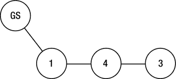 图 2-4. 移除 `node4` 后的 `gameScene` 节点树

还有最后一点你需要了解，那就是嵌套节点。因为节点树是 `SKNode` 的一部分，而 `SKSpriteNode` 是从 `SKNode` 扩展而来的，所以它可以拥有嵌套节点。嵌套相关节点的好处在于，当你更改父节点时，相同的更改将应用于所有子节点。

为了了解嵌套节点在节点树中是如何表示的，让我们回到图 2-4 所表示的节点树。如果你想在 `node4` 内部嵌套额外的节点，可以在刚刚执行的 `node2.removeFromParent()` 之后立即执行以下代码片段来实现。图 2-5 展示了此代码片段的结果：

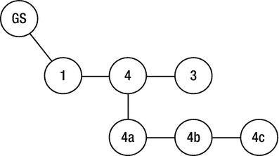 图 2-5. 节点嵌套在 `node4` 内部的 `gameScene` 节点树

```
var node4a = SKSpriteNode()
var node4b = SKSpriteNode()
var node4c = SKSpriteNode()
node4.addChild(node4a)
node4.addChild(node4b)
node4.addChild(node4c)
```


#### 渲染节点树

现在你已经了解了如何构建节点树，接下来看看节点树是如何渲染的。向场景中添加节点的顺序非常重要。当渲染循环结束时对场景进行渲染时，其渲染顺序与构建顺序相反。以图 2-3 所示的节点树为例。当渲染这棵节点树时，场景将按以下顺序渲染每个节点：

1. `node3`
2. `node4`
3. `node2`
4. `node1`

注意，最后渲染的节点是第一个添加到场景中的节点。嵌套节点也以其添加顺序的逆序进行渲染。如果要渲染图 2-5 所示的节点树，渲染顺序如下：

1. `node3`
2. `node4`
   - `node4c`
   - `node4b`
   - `node4a`
3. `node1`

这一点很重要，因为根据每个节点的位置，场景中的节点可能会发生重叠，从而导致某些节点被部分或完全遮挡。这一点同样重要，还因为 SpriteKit 执行命中测试的方式。当 SpriteKit 处理触摸事件或鼠标事件时，它会遍历场景，找到最想接收该事件的节点。如果第一个节点不处理该事件，SpriteKit 会检查下一个最近的节点，并重复此过程，直到事件被处理或被忽略。与场景渲染顺序一样，命中测试的执行顺序也与绘制顺序相反。要了解在示例应用中如何体现，请将 `GameScene.init()` 方法的当前内容替换为以下代码：

```
super.init(size: size)
backgroundColor = SKColor(red: 0.0, green: 0.0, blue: 0.0, alpha: 1.0)
// 添加背景
backgroundNode.anchorPoint = CGPoint(x: 0.5, y: 0.0)
backgroundNode.position = CGPoint(x: size.width / 2.0, y: 0.0)
addChild(backgroundNode)
// 添加玩家
let playerNode1 = SKSpriteNode(imageNamed: "Player")
playerNode1.position = CGPoint(x: size.width / 2.0, y: 80.0)
addChild(playerNode1)
let playerNode2 = SKSpriteNode(imageNamed: "Player")
playerNode2.position = CGPoint(x: size.width / 2.0, y: 100.0)
addChild(playerNode2)
let playerNode3 = SKSpriteNode(imageNamed: "Player")
playerNode3.position = CGPoint(x: size.width / 2.0, y: 120.0)
addChild(playerNode3)
```

在这段代码中，三个玩家节点被添加到场景中，每个节点都比上一个添加的节点低 20 点。要查看结果，请再次运行项目。你会看到重叠的玩家，其中第一个添加的玩家位于最上方，如图 2-6 所示。

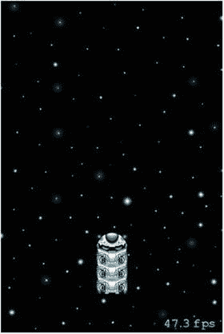

*图 2-6. 带有重叠玩家节点的 GameScene*

#### 搜索节点树

在进入坐标系统和锚点之前，我们还有最后一个主题要介绍：如何搜索节点树。我们之前尚未讨论 `SKNode` 的 `name` 属性。`SKNode.name` 是一个 `String` 属性，可用于标识特定的精灵或一组精灵。例如，可以为唯一的 `playerNode` 命名为 `Player`。假设你在 `GameScene` 内部，并且确实将 `playerNode` 命名为 `Player`，那么可以使用以下代码行在 `GameScene` 中搜索名为 `Player` 的唯一节点：

```
childNode(withName: "Player")
```

此方法返回一个可选的 `SKNode`。如果多个子节点共享同一名称，则返回 `children` 数组中的第一个节点。如果未找到具有该名称的子节点，则返回值为空。另一个例子可能是为一组精灵赋予相同的名称。例如，你可以为一组具有相同圆形纹理的精灵命名为 `orb`。然后搜索所有具有该名称的精灵，并在一次调用中应用一组动作。你可以使用 `SKNode` 的 `enumerateChildNodes(withName:using:)` 方法实现这一点。此方法搜索所有具有传入名称的节点，并对每个找到的节点执行代码块中的代码。同样，假设你在 `GameScene` 内部，并且添加了多个名为 `orb` 的精灵，可以使用以下代码片段搜索所有 `orb` 节点并对每个节点执行代码块：

```
enumerateChildNodes(withName: "orb", using: {
    node, stop in
    // 对 node 或 stop 进行操作
})
```

除了每次找到名为 `orb` 的节点时传递给代码块的参数外，一切看起来都很直观。第一个参数是对所找到节点的引用——这没问题。第二个参数 `stop` 是一个指向布尔值的指针，可用于停止迭代。如果你想停止遍历每个找到的节点，将 `stop` 参数的 `memory` 属性设置为 `true`，如下例所示：

```
stop.memory = true
```

### 了解 SKSpriteNode 坐标和锚点

到目前为止，我们已经讨论了如何创建 `SKScene` 对象以及它如何被渲染。现在我们讨论如何定位场景中的节点。首先，让我们看看场景的坐标系统。确保将 `GameScene.init()` 方法更改回以下内容：

```
init(size: CGSize) {
    super.init(size: size)
    backgroundColor = SKColor(red: 0.0, green: 0.0, blue: 0.0, alpha: 1.0)
    // 添加背景
    backgroundNode.anchorPoint = CGPoint(x: 0.5, y: 0.0)
    backgroundNode.position = CGPoint(x: size.width / 2.0, y: 0.0)
    addChild(backgroundNode)
    // 添加玩家
    playerNode.position = CGPoint(x: size.width / 2.0, y: 80.0)
    addChild(playerNode)
}
```


#### 坐标

当场景首次初始化时，其 `size` 属性会在初始化器中设置，正如你之前所看到的。场景的 `size` 表示场景可见部分的大小，它并不定义游戏世界的整体尺寸。你可以将场景的 `size` 视为进入游戏世界的视口。默认情况下，`SKScene` 的原点位于其呈现视图的左下角，代表该原点的坐标为 `(0, 0)`。回到上一章的游戏，在 `GameScene.init()` 方法中，紧接在 `super.init()` 调用之后添加这行代码：`print("The size is (\(size)")`。现在使用 iPhone 6s 模拟器再次运行该应用程序。之后，查看控制台窗口，你将看到以下输出：`The size is: (375.0, 667.0)`。这是在 iPhone 6s 上运行的场景的大小。你可以尝试在 iPhone SE 或 6+ 模拟器上再次运行，这些值告诉你场景的大小（进入游戏世界的视口）。如果你想将 `SKNode` 对象定位到游戏的可见世界中，你必须在 iPhone 6s 上将其位置设置在 `(0, 0)` 到 `(375, 667)` 的范围内，或者在 iPhone SE 上设置在 `(0, 0)` 到 `(320, 568)` 的范围内。

花点时间尝试一下坐标系统。回到 `GameScene.init()` 方法，使用以下代码行更改 `playerNode` 的位置：`playerNode.position = CGPoint(x: size.width / 2, y: size.height / 2)`。通过这一更改，你将 `playerNode` 定位到了场景的中心。要查看位置变化，请在模拟器中再次运行该应用。你现在会看到你的玩家位于场景中央，如图 2-7 所示。

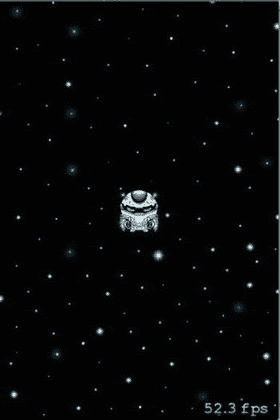  
图 2-7. 位于场景中央的 `playerNode`

继续之前，再做一次位置更改。使用以下代码行更改 `playerNode` 的位置：`playerNode.position = CGPoint(x: size.width, y: size.height)`。正如你所看到的，新位置被设置为场景可视区域的最大 `(x, y)` 值。在模拟器中再次运行该应用。你会看到你的玩家位于场景的右上角，如图 2-8 所示。

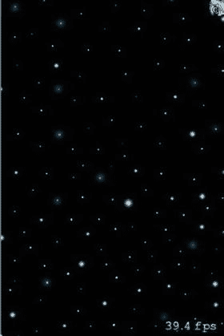  
图 2-8. 位于场景右上角的 `playerNode`

虽然你成功地将玩家定位到了场景的右上角，但你会注意到一件有点奇怪的事情——`playerNode` 只有左下角的四分之一是可见的。在下一节我们专注于锚点时，你就会明白为什么会这样。

#### 锚点

正如你在上一节中看到的，当你将 `playerNode` 定位到场景的右上角时，节点只有左下角的四分之一在场景中可见。这是因为 `SKSpriteNode` 的默认锚点位于节点的中心。精灵的 `anchorPoint` 属性用于设置 `SKSpriteNode` 框架内的点，精灵的 `position` 属性将应用于该点。这听起来有点复杂，但实际上相当简单。请看图 2-9。

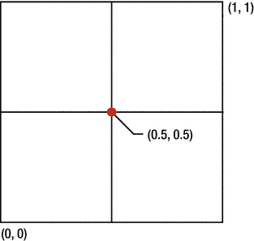  
图 2-9. `SKSpriteNode` 的锚点单位坐标系

该图显示了 `SKSpriteNode` 的锚点坐标系。注意位于 `(0.5, 0.5)` 的点，这是默认的锚点。图 2-10 展示了一些常见的锚点。

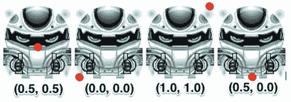  
图 2-10. `SKSpriteNode` 的锚点示例

在图 2-10 中，有四个常见的锚点，它们与所应用的精灵相关。看看这些示例，你会明白，如果你希望将 `playerNode` 定位到场景的最右上角位置，并且仍然让整个 `spriteNode` 在场景中可见，你需要将精灵的 `anchorPoint` 属性设置为 `(1.0, 1.0)`。现在就这样做，在 `playerNode` 构造之后直接添加以下代码行：`playerNode.anchorPoint = CGPoint(x: 1.0, y: 1.0)`。现在再次运行该应用。你将看到整个 `playerNode` 都位于场景的右上角，如图 2-11 所示。

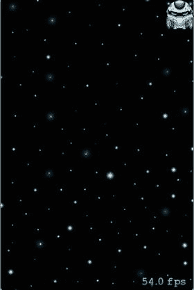  
图 2-11. 位于场景右上角的整个 `playerNode`

要掌握锚点，请尝试为 `playerNode` 设置不同的锚点与位置，看看每个不同的锚点如何影响 `playerNode` 的定位。理解 `position` 和 `anchorPoint` 属性如何协同工作非常重要。

> 注：当你完成对 `playerNode` 的 `position` 和 `anchorPoint` 的实验后，请撤销所有代码更改，将项目恢复到第一章 1 留下的状态。

### 总结

本章涵盖了大量信息，包括什么是 `SKScene` 以及它们是如何构建的。我们还讨论了 `SKScene` 的渲染循环，以及场景节点树的构建顺序如何影响节点的外观和交互性。在本章末尾，我们探讨了场景的坐标系统和节点锚点。第三章 3 将介绍 SpriteKit 的物理引擎和碰撞检测。那一章会非常有趣，你将开始看到你的游戏逐渐变得生动起来。

© James Goodwill and Wesley Matlock 2017  
James Goodwill 和 Wesley Matlock *Beginning Swift Games Development for iOS*  
DOI: 10.1007/978-1-4842-2310-9_3

