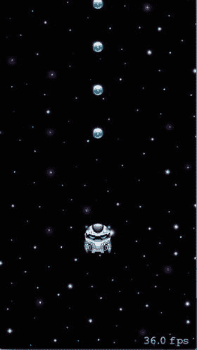
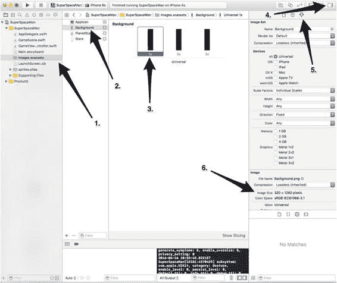

# 第 4 章 添加场景滚动与游戏控制

James Goodwill^(1 ) 和 Wesley Matlock²  
(1) 美国科罗拉多州高地牧场  
(2) 美国密苏里州堪萨斯城  

在本章中，你将开始为游戏添加一些真正的功能。你将首先对当前的`GameScene`做一些小的改动。之后，你将添加更多的轨道节点用于碰撞。然后，你将向场景添加滚动功能，使其看起来像玩家在太空中飞行收集能量球。最后，你将开始使用手机的加速度计让玩家沿 x 轴移动。

### 重新组织 GameScene


### 改进游戏场景代码

在继续添加滚动和加速计功能之前，你需要对现有`GameScene`进行一些小的代码更改。在前面的章节中，有大量代码展示了如何在`SpriteKit`中执行某些操作。你在这里要做的更改是重组性的，旨在为继续游戏开发做好准备。

你需要更改的第一件事是游戏物理世界中的重力强度。你将通过将表示重力力的向量从`(0.0, –2.0)`改为`(0.0, –5.0)`来实现这一点。继续找到设置`physicsWorld.gravity`属性的位置，并将其更改为以下内容：

```
physicsWorld.gravity = CGVector(dx: 0.0, dy: -5.0)
```

为了准备下一节的内容（你将在其中开始滚动游戏场景中的不同层），你需要向场景中添加另一个层来容纳所有精灵。你将通过添加另一个名为`foregroundNode`的`SKSpriteNode`来实现这一点。该节点将容纳所有会影响游戏玩法的精灵。

那么，让我们添加这个节点，并将玩家添加到其中。首先，在`backgroundNode`声明之后立即添加以下`foregroundNode`声明：

```
let foregroundNode = SKSpriteNode()
```

接下来，通过在你将`backgroundNode`添加到场景的那行代码之后立即添加以下代码行，将`foregroundNode`实例添加到场景中：

```
addChild(foregroundNode)
```

现在，找到`init()`方法中你将`playerNode`和`orbNode`添加到场景的位置，并将`addChild()`调用更改为以下内容：

```
foregroundNode.addChild(playerNode)
foregroundNode.addChild(orbNode)
```

一旦你将`playerNode`和`orbNode`添加到新的`foregroundNode`中，找到你设置`playerNode`位置的位置，并使用以下`CGPoint`更改其`position`属性：

```
playerNode.position = CGPoint(x: size.width / 2.0, y: 180.0)
```

现在，找到你设置`playerNode.physicsBody.dynamic`属性的位置，并关闭玩家的动态体积：

```
playerNode.physicsBody?.isDynamic = false
```

你这样做的目的是，如果你没有及时点击屏幕，玩家就不会掉出屏幕。

接下来，在`orbNode`定义之后立即向`GameScene`添加以下新属性：

```
var impulseCount = 4
```

现在将`touchesBegan()`方法更改为以下内容：

```
override func touchesBegan(_ touches: Set<UITouch>, with event: UIEvent?) {
    if !playerNode.physicsBody!.isDynamic {
        playerNode.physicsBody?.isDynamic = true
    }
    if impulseCount > 0 {
        playerNode.physicsBody!.applyImpulse(CGVector(dx: 0.0, dy: 40.0))
        impulseCount -= 1
    }
}
```

这段代码的作用是：如果玩家的动态体积是关闭的，则将其重新打开，这样玩家将再次开始对重力做出反应。之后，它检查`impulseCount`属性。如果该值大于 0，则向玩家施加一个冲量，并将`impulseCount`属性减 1。

这段代码的目的是让游戏处于初始启动状态，玩家保持静止，直到你点击屏幕开始游戏。当屏幕第一次被点击时，游戏开始。

添加`impulseCount`属性是为了引入一个新的游戏元素。游戏将使用`impulseCount`属性为用户提供有限次数的可用于推进的冲量。每当`playerNode`与能量球接触时，`impulseCount`属性会增加；每当玩家点击屏幕时，该属性会减少。这意味着用户必须善于收集能量球，否则他们最终会坠入深渊并输掉游戏。

接下来需要更改的是能量球节点添加到场景的方式。你需要添加更多能量球节点。在添加额外节点之前，需要移除当前添加这些节点的代码。要移除这些代码，首先从`GameScene`类的顶部移除`orbNode`属性。在`GameScene`的声明部分找到以下行并将其移除：

```
let orbNode = SKSpriteNode(imageNamed: "PowerUp")
```

然后移除所有以下用于添加单个节点的代码行：

```
orbNode.position = CGPoint(x: 150.0, y: size.height - 25)
orbNode.physicsBody = SKPhysicsBody(circleOfRadius: orbNode.size.width / 2)
orbNode.physicsBody?.isDynamic = false
orbNode.physicsBody?.categoryBitMask = CollisionCategoryPowerUpOrbs
orbNode.physicsBody?.collisionBitMask = 0
orbNode.name = "POWER_UP_ORB"
foregroundNode.addChild(orbNode)
```

### 向场景添加更多能量球


游戏场景已准备好开始添加一些真实的游戏组件，第一个将是一组额外的能量球节点。这些能量球将排成两行，位于玩家上方。第一行能量球共 20 个，居中排列，起始位置在`playNode`上方 100 点，每个节点的`anchorPoint`之间间隔 140 点。第二组能量球节点也将是 20 个节点的一串，但它们位于玩家右侧 50 点。添加第一组能量球节点的代码如下所示：

```swift
var orbNodePosition = CGPoint(x: playerNode.position.x, y: playerNode.position.y + 100)
for _ in 0...19 {
    let orbNode = SKSpriteNode(imageNamed: "PowerUp")
    orbNodePosition.y += 140
    orbNode.position = orbNodePosition
    orbNode.physicsBody = SKPhysicsBody(circleOfRadius: orbNode.size.width / 2)
    orbNode.physicsBody?.isDynamic = false
    orbNode.physicsBody?.categoryBitMask = CollisionCategoryPowerUpOrbs
    orbNode.physicsBody?.collisionBitMask = 0
    orbNode.name = "POWER_UP_ORB"
    foregroundNode.addChild(orbNode)
}
```

查看这段代码，你会看到一个名为`orbNodePosition`的变量，其`x`坐标与`playerNode`的`x`坐标匹配，`y`坐标在`playerNode`上方 100 点。之后是一个`for`循环，在玩家上方居中添加 20 个`orbNode`对象，每个节点位于前一个节点的`anchorPoint`上方 140 点。请将此代码添加到`GameScene`的`init()`方法底部，然后我们继续处理第二组`orbNode`对象。

要添加第二组节点，你需要使用以下类似的代码：

```swift
orbNodePosition = CGPoint(x: playerNode.position.x + 50, y: orbNodePosition.y)
for _ in 0...19 {
    let orbNode = SKSpriteNode(imageNamed: "PowerUp")
    orbNodePosition.y += 140
    orbNode.position = orbNodePosition
    orbNode.physicsBody = SKPhysicsBody(circleOfRadius: orbNode.size.width / 2)
    orbNode.physicsBody?.isDynamic = false
    orbNode.physicsBody?.categoryBitMask = CollisionCategoryPowerUpOrbs
    orbNode.physicsBody?.collisionBitMask = 0
    orbNode.name = "POWER_UP_ORB"
    foregroundNode.addChild(orbNode)
}
```

查看这段代码，你会发现唯一的变化是修改了变量`orbNodePosition`。`orbNodePosition`的`x`坐标值增加了 50，其他所有内容都相同。你可以轻松地将此代码重构为一个方法，并传入新的`x`坐标，但当前的目标是了解一切如何运作。它将在后续章节中被重构。在继续之前，请将此代码添加到`GameScene`的`init()`方法中上一个循环之后。

将所有代码添加到游戏场景后，运行应用程序。你的屏幕现在将如图[4-1]所示。

  
**图 4-1.** 添加了额外能量球后的修改场景

在向游戏添加滚动之前，你需要做的最后一件事是更改能量球碰撞的处理方式。如果你还记得第[3]章，每当`playerNode`与`orbNode`接触时，`orbNode`会从场景中移除。这种情况仍会发生，但现在碰撞还会增加`impulseCount`变量，为玩家提供额外的脉冲。为此，将当前的`didBeginContact()`方法更改为以下内容：

```swift
func didBegin(_ contact: SKPhysicsContact) {
    let nodeB = contact.bodyB.node!
    if nodeB.name == "POWER_UP_ORB" {
        impulseCount += 1
        nodeB.removeFromParent()
    }
}
```

新的`didBeginContact()`每次玩家与能量球接触时都会增加`impulseCount`属性，然后移除能量球。现在玩家有了额外的燃料来避免坠落到行星表面。要查看此更改的效果，请保存更改并再次运行游戏。这一次，当你点击屏幕时，玩家将被向上推起并击中第一个能量球，然后是第二个，依此类推，直到飞出屏幕顶部。如果你点击足够长的时间，玩家最终会用完脉冲并从游戏底部坠落。

### 滚动场景

在本节中，你将开始为游戏世界添加移动。在进行任何额外的代码更改之前，返回到 Xcode 并选择`Images.xcassets`文件夹中的第一个背景图像（箭头 1），如图[4-2]所示。选中第一个背景后（箭头 2 和 3），展开 Xcode 的“工具”区域（箭头 4），然后点击“显示属性检查器”按钮（箭头 5）。注意“图像”属性（箭头 6）。图像的高度远大于当前任何可用设备的高度（箭头 6）。

  
**图 4-2.** 背景图像尺寸

背景之所以这么大，是因为它将向下滚动，以模拟`playerNode`在太空中向上飞行。这将通过利用游戏渲染循环中的`update()`方法来实现。滚动背景的第一步是根据玩家在游戏中的位置更改背景的位置。每当玩家在场景中向上移动时，背景将向下移动。以下代码正是实现这一点的，你稍后需要将其添加到`GameScene`中：

```swift
override func update(_ currentTime: TimeInterval) {
    backgroundNode.position =
        CGPoint(x: backgroundNode.position.x,
                y: -((playerNode.position.y - 180.0)/8))
}
```

这个`update()`方法的实现根据玩家的当前位置更改背景节点的位置。具体来说，它将`backgroundNode`的位置设置为与自身相同的`x`值，但使用的`y`值位于玩家位置下方 180 点，然后除以 8。目前不必担心这些数字。我们稍后会详细讨论它们。请将此`update`方法添加到`GameScene`的末尾，然后再次运行游戏。当你点击屏幕时，你会看到背景随着玩家飞出屏幕顶部而缓慢向场景底部移动。这很酷，但玩家仍然在飞离场景。还需要对`update()`方法进行一次修改。看一下这个修改后的`update()`：

```swift
override func update(_ currentTime: TimeInterval) {
    if playerNode.position.y >= 180.0 {
        backgroundNode.position =
            CGPoint(x: backgroundNode.position.x,
                    y: -((playerNode.position.y - 180.0)/8))
        foregroundNode.position =
            CGPoint(x: foregroundNode.position.x,
                    y: -(playerNode.position.y - 180.0))
    }
}
```

注意进行了两处修改。首先，该方法检查`playerNode`是否已至少向上移动了 180 点。如果`playerNode`已移动到此高度，则`backgroundNode`以玩家速度的八分之一向下移动，而前景以与玩家完全相同的速度移动。以与玩家相同的速度移动前景可防止玩家飞得太高而离开场景。将当前的`update()`方法修改为与此相同，然后再次运行应用程序。当你点击屏幕时，背景会缓慢向下移动，而超级太空人不会飞出屏幕顶部。这很棒，但有一件事除外：当`playerNode`到达第一行能量球的顶部时，玩家无法再向上移动，因为下一组能量球在右侧，玩家无法到达它们。这个问题将在下一节中解决，届时我们将向你展示如何使用加速度计为玩家添加水平移动。

### 使用加速度计控制玩家移动


### 添加加速计控制

在上一节中，当下一组需要玩家向上继续前进的能量球位于右侧 50 个点处时，玩家遇到了无法水平移动而无法触及它们的问题。现在，你将通过使用手机的加速计来控制玩家沿 x 轴的运动来解决这个问题。

要在你的游戏中使用加速计，首先需要将 `CoreMotion` 框架添加到你的 `GameScene` 中。为此，请在 `GameScene.swift` 文件的顶部添加以下导入语句：

```swift
import CoreMotion
```

之后，你需要添加一个新的属性。该属性将保存一个 `CMMotionManager` 对象的实例，该对象用于监测水平移动。在之前添加的 `impulseCount` 变量之后，直接将该变量添加到 `GameScene` 中：

```swift
let coreMotionManager = CMMotionManager()
```

这段代码创建了一个 `CMMotionManager` 的实例，并将其存储在常量 `coreMotionManager` 中。我们稍微讨论一下 `CMMotionManager` 的作用。`CMMotionManager` 对象是用于访问 iOS 提供的运动服务的对象。这些服务包括访问加速计、磁力计、旋转速率和其他设备运动传感器。你特别感兴趣的是设备沿 x 轴的加速度。这些信息通过使用加速计来访问。

你将使用 `CMMotionManager` 让加速计以特定时间间隔更新当前设备加速度给应用程序。实现此功能的代码如下所示：

```swift
coreMotionManager.accelerometerUpdateInterval = 0.3
coreMotionManager.startAccelerometerUpdates()
```

花点时间看看这段代码。第一行告诉 `coreMotionManager` 加速计将用于更新应用程序当前加速度的时间间隔（以秒为单位）。该值设置为 0.3 秒，提供了相当平滑的更新速率。你可以尝试调整此值，看看它如何影响应用程序。第二行代码实际启动了加速计更新。

继续将此代码添加到 `GameScene` 的 `touchesBegan()` 方法中，放在 `playerNode.physicsBody.dynamic` 属性设置为 `true` 之后。修改后的 `touchesBegan()` 方法如下所示：

```swift
override func touchesBegan(_ touches: Set<UITouch>, with event: UIEvent?) {
    if !playerNode.physicsBody!.isDynamic {
        playerNode.physicsBody?.isDynamic = true
        coreMotionManager.accelerometerUpdateInterval = 0.3
        coreMotionManager.startAccelerometerUpdates()
    }
    if impulseCount > 0 {
        playerNode.physicsBody!.applyImpulse(CGVector(dx: 0.0, dy: 40.0))
        impulseCount -= 1
    }
}
```

现在是时候利用这些信息做点什么了。起初，使用 `update()` 方法似乎是使用这些数据的逻辑选择，但 `update()` 方法是在渲染循环评估场景中所有物理体之前调用的。场景中与其他节点的碰撞可能会改变玩家沿 x 轴的速度，而这种改变应该在使用加速计改变玩家速度之前发生。尽管在这个游戏中不会发生这种情况——因为 `playerNode` 是游戏中唯一的动态体积——但了解这一点是有好处的。

考虑到所有物理变化应该在玩家 x 轴速度被修改之前进行评估，渲染过程中实际上只有一个地方可以处理加速计的变化，那就是在渲染循环的 `didSimulatePhysics()` 方法中。要重写当前的 `didSimulatePhysics()`，请在 `GameScene` 的底部添加以下代码：

```swift
override func didSimulatePhysics() {
    if let accelerometerData = coreMotionManager.accelerometerData {
        playerNode.physicsBody!.velocity =
                CGVector(dx: CGFloat(accelerometerData.acceleration.x * 380.0),
                         dy: playerNode.physicsBody!.velocity.dy)
    }
    if playerNode.position.x < -(playerNode.size.width / 2) {
        playerNode.position =
            CGPoint(x: size.width - playerNode.size.width / 2,
                    y: playerNode.position.y);
    }
    else if playerNode.position.x > self.size.width {
        playerNode.position = CGPoint(x: playerNode.size.width / 2,
                                      y: playerNode.position.y);
    }
}
```

将这段代码添加到 `GameScene` 后，保存文件，然后这次在你的实体 iPhone 上运行应用程序。（模拟器不模拟加速计活动。）当应用程序在你的设备上运行时，点击屏幕并尝试收集所有的 `orbNode`。请记住，你收集的能量球越多，玩家可用的脉冲就越多，以便继续前进。

在稍微尝试了一下加速计之后，让我们看看你刚才添加的代码。第一行是改变 `playerNode` 速度的地方。这是通过创建一个新的向量来实现的，该向量的 x 值是最新的加速计 x 轴加速度值乘以 `380.0`，y 值是玩家当前的 y 轴速度，最后将其设置为玩家的新整体速度。

修改玩家的速度后，有两个 `if` 语句用于判断玩家是否飞出了场景的左侧或右侧。如果发生这两种情况中的任何一种，玩家将被移动到场景的另一边。请注意，当测试 `playerNode` 的位置时，检查的是 `playerNode` 的一半是否离开了场景。这样做是因为 `playerNode` 的锚点是 `(0.5, 0.5)`。

还有最后一个需要修改的地方：当不再使用 `GameScene` 时，关闭加速计更新。为此，在 `GameScene` 的底部添加以下 `deinit()` 方法并保存你的更改：

```swift
deinit {
    coreMotionManager.stopAccelerometerUpdates()
}
```

### 总结

在本章中，你开始为你的游戏添加一些真正的功能。首先，你对游戏开始部分做了一些小的结构重组。然后，你添加了更多的 `orbNode` 以进行碰撞。添加新的 `orbNode` 后，你为游戏场景添加了滚动效果，使其看起来像玩家在太空中飞行收集能量球。最后，你通过使用手机的加速计来控制玩家沿 x 轴移动，结束了本章。在下一章中，你将继续添加新的游戏元素，并开始为你的 `SKSpriteKitNode` 制作动画。正是在那章中，你将开始将你的游戏转变为一个真正的、可玩的游戏。

© James Goodwill 和 Wesley Matlock 2017  
James Goodwill 和 Wesley Matlock，*Beginning Swift Games Development for iOS*  
10.1007/978-1-4842-2310-9_5

