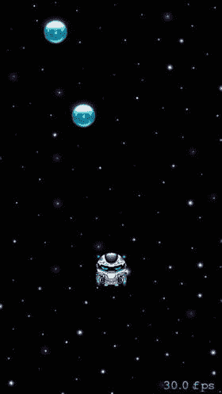
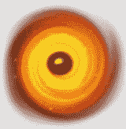
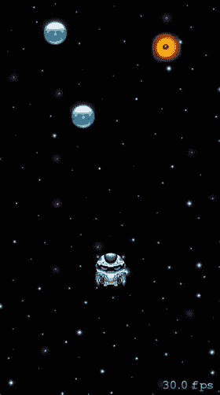
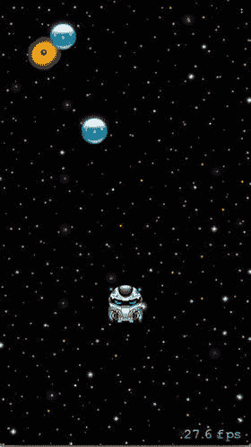
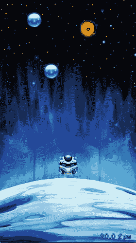

# 5. 添加动作和动画

James Goodwill¹ 和 Wesley Matlock²  
(1) 美国科罗拉多州海兰兹牧场  
(2) 美国密苏里州堪萨斯城

在本章中，你将最后一次重构能量球节点的布局，以增强可玩性。之后，我们将向你展示如何使用 `SKActions` 让 `SKSpriteNode` 在场景中来回移动，并让同一个节点无限旋转。最后，我们将介绍如何使用颜色化动作为 `SKSpriteNode` 添加着色效果，以此来结束本章。


### 最后一次重构轨道节点布局

在开始讨论`SKActions`之前，需要对轨道节点的布局方式做一些调整。第 4 章曾提到过对轨道节点布局进行重构。在本节中，我们不仅要将其布局重构为一个方法，还要最后一次修改轨道节点的布局方式。本次修改的目标是让轨道排列更接近游戏风格。新方法如下：

```
func addOrbsToForeground() {
    var orbNodePosition = CGPoint(x: playerNode.position.x, y: playerNode.position.y + 100)
    var orbXShift : CGFloat = -1.0
    for _ in 1...50 {
        let orbNode = SKSpriteNode(imageNamed: "PowerUp")
        if orbNodePosition.x - (orbNode.size.width * 2) <= 0 {
            orbXShift = 1.0
        }
        if orbNodePosition.x + orbNode.size.width >= size.width {
            orbXShift = -1.0
        }
        orbNodePosition.x += 40.0 * orbXShift
        orbNodePosition.y += 120
        orbNode.position = orbNodePosition
        orbNode.physicsBody = SKPhysicsBody(circleOfRadius: orbNode.size.width / 2)
        orbNode.physicsBody?.isDynamic = false
        orbNode.physicsBody?.categoryBitMask = CollisionCategoryPowerUpOrbs
        orbNode.physicsBody?.collisionBitMask = 0
        orbNode.name = "POWER_UP_ORB"
        foregroundNode.addChild(orbNode)
    }
}
```

查看这个方法，你会发现它并没有什么特别之处。它首先将第一个轨道的初始位置设为玩家节点正上方 100 个点。然后依次添加 50 个轨道，在 x 轴上间隔 40 个点，y 轴上间隔 120 个点，在场景中从右向左移动，直到所有节点添加完毕。请直接将此方法添加到`GameScene`中`init()`方法的后面。将`addOrbsToForeground()`方法添加到游戏场景后，还需要添加一个调用该方法的语句。在`GameScene`的`init()`方法末尾添加以下方法调用：

```
addOrbsToForeground()
```

在调用这个新方法之前，需要将`init()`方法中旧的轨道添加代码移除。为此，请找到以下代码并将其从`init()`中删除：

```
var orbNodePosition = CGPoint(x: playerNode.position.x, y: playerNode.position.y + 100)
for _ in 0...19 {
    let orbNode = SKSpriteNode(imageNamed: "PowerUp")
    orbNodePosition.y += 140
    orbNode.position = orbNodePosition
    orbNode.physicsBody = SKPhysicsBody(circleOfRadius: orbNode.size.width / 2)
    orbNode.physicsBody?.isDynamic = false
    orbNode.physicsBody?.categoryBitMask = CollisionCategoryPowerUpOrbs
    orbNode.physicsBody?.collisionBitMask = 0
    orbNode.name = "POWER_UP_ORB"
    foregroundNode.addChild(orbNode)
}
orbNodePosition = CGPoint(x: playerNode.position.x + 50, y: orbNodePosition.y)
for _ in 0...19 {
    let orbNode = SKSpriteNode(imageNamed: "PowerUp")
    orbNodePosition.y += 140
    orbNode.position = orbNodePosition
    orbNode.physicsBody = SKPhysicsBody(circleOfRadius: orbNode.size.width / 2)
    orbNode.physicsBody?.isDynamic = false
    orbNode.physicsBody?.categoryBitMask = CollisionCategoryPowerUpOrbs
    orbNode.physicsBody?.collisionBitMask = 0
    orbNode.name = "POWER_UP_ORB"
    foregroundNode.addChild(orbNode)
}
```

完成所有修改并保存后，再次运行应用，查看新的布局。效果应如图 5-1 所示。



**图 5-1.** 新的轨道布局

重启应用后，不妨体验一下新布局。这比单纯的垂直上升有趣多了。现在你需要左右飞行来收集轨道。

### Sprite Kit 动作

在 Sprite Kit 中，当你想要移动、修改或对`SKNode`执行某些操作时，大多数情况下会使用`SKAction`来实现变更。苹果对`SKAction`的定义是：“动作是一个对象，用于定义你想要对场景做出的改变”。`SKActions`有许多不同的用途，但其中一些常见用法如下：

*   通过一系列纹理为节点制作动画
*   使用节点的`position`属性修改其位置
*   使用节点的`hidden`属性改变其可见性
*   使用节点的`alpha`属性调整其透明度
*   使用节点的`size`属性修改其大小
*   播放简单音效
*   为节点着色

要使用`SKAction`，只需执行两个步骤：创建你想要执行的动作，然后告诉要执行该动作的节点去运行它。下面是一个示例，该示例在两秒内将一个节点移动到场景的右侧：

```
var moveRightAction = SKAction.moveToX(size.width, duration: 2.0)
sampleNode.runAction(moveRightAction)
```

`SKActions`另一个非常酷的功能是能够将动作链接在一起。请看这个示例：

```
var moveRightAction = SKAction.moveToX(size.width, duration: 2.0)
var moveLeftAction = SKAction.moveToX(0.0, duration: 2.0)
var actionSequence = SKAction.sequence([moveRightAction, moveLeftAction])
sampleNode.runAction(actionSequence)
```

这段代码会先将节点移动到场景右侧，当该动作完成后，再将同一个节点移动到场景左侧。

`SKAction`的另一个好功能是能够重复执行一个动作。请看这段代码片段：

```
let moveLeftAction = SKAction.moveTo(x: 0.0, duration: 2.0)
let moveRightAction = SKAction.moveTo(x: size.width, duration: 2.0)
let actionSequence = SKAction.sequence([moveLeftAction, moveRightAction])
let moveAction = SKAction.repeatForever(actionSequence)
sampleNode.runAction(moveActionSequence)
```

这里你看到了之前的示例，但现在又多了一个动作`repeatForever`，它会使`moveAction`永远运行下去。仅此而已——只需一行代码就能让之前的所有动作永远运行。

虽然这是一组简单的`SKAction`示例，但你在游戏中利用动作的方式几乎没有限制。在接下来的章节中，我们将展示如何使用部分相同的代码，让一组节点在场景中来回移动，同时通过一系列纹理旋转节点，营造出节点旋转的视觉效果。

**注意：** 在继续之前，请查看用于创建`SKActions`的所有方法。注意所有这些方法都是类方法。这是创建所有`SKActions`所用的模式。目前`SKAction`类没有扩展。

#### 使用动作在场景中移动节点


在前面的章节中，我们提到要展示如何在游戏场景中来回移动一组节点。你已经了解了如何使用`moveToX`、`sequence`和`repeatForever`动作来实现这一点。将在场景中移动的节点是一个新节点。如果你打开`sprites.atlas`文件夹，会看到几张`BlackHoleX.png`图像。选择列表中的第一张图像`BlackHole0.png`，它应该看起来像图 5-2。  
  
**图 5-2.** `BlackHole`节点  

该节点的作用是代表一个在场景中来回移动的黑洞。如果玩家节点与这个节点发生接触，玩家将停止响应物理世界，并缓慢坠落直至死亡。要将这个新节点添加到场景中，你需要创建一个新的`SKSpriteNode`实例，并向其传入`BlackHole0`图像。你可以在以下名为`addBlackHolesToForeground()`的方法中找到实现此功能的代码：  

```
func addBlackHolesToForeground() {
    let blackHoleNode = SKSpriteNode(imageNamed: "BlackHole0")
    blackHoleNode.position = CGPoint(x: size.width - 80.0, y: 600.0)
    blackHoleNode.physicsBody =
        SKPhysicsBody(circleOfRadius: blackHoleNode.size.width / 2)
    blackHoleNode.physicsBody?.isDynamic = false
    blackHoleNode.name = "BLACK_HOLE"
    foregroundNode.addChild(blackHoleNode)
}
```

你之前已经见过所有这些代码。它首先使用名为`BlackHole0`的图像创建了`blackHoleNode`的新实例，然后将该节点添加到场景，设置节点`physicsBody`的属性，并将节点命名为`BLACK_HOLE`。现在，请将此代码紧跟在`addOrbsToForeground()`方法之后添加。然后在调用`addOrbsToForeground()`方法之前，添加对`addBlackHolesToForeground()`方法的调用。完成这些更改后，再次运行应用程序。这次你会看到`blackHoleNode`悬浮在玩家节点的右上方，如图 5-3 所示。  
  
**图 5-3.** 添加到场景中的`BlackHole`节点  

在继续对该节点执行动作之前，需要将处理`playerNode`与`blackHoleNode`之间接触的代码添加到`GameScene`类中。你之前已经见过所有这些代码，因此我们将快速过一遍，不做过多解释。首先，需要配置`blackHoleNode`的`categoryBitMask`，并修改`playerNode`的`contactBitMask`，使其包含`blackHoleNode`的`categoryBitMask`。为此，请在其他两个类别定义下方直接添加`CollisionCategoryBlackHoles`常量的定义，如下所示：  

```
let CollisionCategoryPlayer : UInt32 = 0x1 << 1
let CollisionCategoryPowerUpOrbs : UInt32 = 0x1 << 2
let CollisionCategoryBlackHoles : UInt32 = 0x1 << 3
```

接下来，设置`blackHoleNode.physicsBody`的`categoryBitMask`和`collisionBitMask`，如以下代码片段所示。在`addBlackHolesToForeground()`方法中将`blackHoleNode`添加到前景之前，直接添加这些行：  

```
blackHoleNode.physicsBody?.categoryBitMask = CollisionCategoryBlackHoles
blackHoleNode.physicsBody?.collisionBitMask = 0
```

配置好`blackHoleNode.physicsBody`的位掩码后，需要将`CollisionCategoryBlackHoles`添加到`playerNode.physicsBody`的`contactTestBitMask`中，如下所示。找到设置`playerNode.physicsBody.contactTestBitMask`的位置，并将其修改为如下一行代码：  

```
playerNode.physicsBody?.contactTestBitMask =
    CollisionCategoryPowerUpOrbs | CollisionCategoryBlackHoles
```

你还需要做一处修改：修改`didBeginContact()`方法，使其在节点与`playerNode`接触时检测`BLACK_HOLE`节点。最简单的方法是在方法当前的`if`语句中添加一个`if else`条件。此更改如以下代码片段所示：  

```
if nodeB.name == "POWER_UP_ORB"  {
    impulseCount += 1
    nodeB.removeFromParent()
} else if nodeB.name == "BLACK_HOLE"  {            
    playerNode.physicsBody?.contactTestBitMask = 0
    impulseCount = 0
}
```

对`didBeginContact()`方法进行此更改，然后再次运行应用程序。这次进行游戏时，尝试让玩家与新黑洞发生接触。当接触发生时，你会注意到玩家停止响应点击和其他节点的接触，然后缓慢坠落，直到掉出场景底部。此时，游戏基本结束了。  

好了，终于是时候使用一些`SKAction`了。如果还记得前一节的内容，使用`SKAction`涉及两个步骤。首先，创建你想要使用的动作，然后告诉要应用动作的节点来运行该动作。让我们从本章前面使用过的动作序列开始：  

```
let moveLeftAction = SKAction.moveTo(x: 0.0, duration: 2.0)
let moveRightAction = SKAction.moveTo(x: size.width, duration: 2.0)
let actionSequence = SKAction.sequence([moveLeftAction, moveRightAction])
let moveAction = SKAction.repeatForever(actionSequence)
```

查看这段代码时，你会认出它来自本章前面首次介绍`SKAction`的部分。第一行创建了一个动作，该动作会将运行它的节点移动到 x 轴上的 0.0 点；第二行将节点移回场景的最右侧。之后，这两个动作被用来创建一个动作序列，这个新动作存储在变量`actionSequence`中。最后，使用`SKAction.repeatForever()`类方法，利用`actionSequence`创建了一个重复动作。  

仔细阅读这段代码后，将其复制到`addBlackHolesToForeground()`方法的顶部。让黑洞在场景中来回移动的最后一步，是告诉`blackHoleNode`实际运行该动作。你可以使用下面这行代码来实现：  

```
blackHoleNode.run(moveAction)
```

将这行代码添加到`addBlackHolesToForeground()`方法的末尾，然后再次运行应用程序。这次你会看到，只要游戏在运行，黑洞就会在场景中来回移动。  

在继续之前，我们还希望对`addBlackHolesToForeground()`方法做一件事。你可能已经注意到，`addBlackHolesToForeground()`方法的名称暗示了不止一个黑洞——这是有意为之。我们认为游戏需要多个黑洞来增加游戏难度。请看这里展示的新版`addBlackHolesToForeground()`方法：  

```
func addBlackHolesToForeground() {
    let moveLeftAction = SKAction.moveTo(x: 0.0, duration: 2.0)
    let moveRightAction = SKAction.moveTo(x: size.width, duration: 2.0)
    let actionSequence = SKAction.sequence([moveLeftAction, moveRightAction])
    let moveAction = SKAction.repeatForever(actionSequence)
    for i in 1...10 {
        let blackHoleNode = SKSpriteNode(imageNamed: "BlackHole0")
        blackHoleNode.position = CGPoint(x: size.width - 80.0, y: 600.0 * CGFloat(i))
        blackHoleNode.physicsBody = SKPhysicsBody(circleOfRadius: blackHoleNode.size.width / 2)
        blackHoleNode.physicsBody?.isDynamic = false
        blackHoleNode.physicsBody?.categoryBitMask = CollisionCategoryBlackHoles
        blackHoleNode.physicsBody?.collisionBitMask = 0
        blackHoleNode.name = "BLACK_HOLE"
        blackHoleNode.run(moveAction)
        blackHoleNode.run(rotateAction)
        foregroundNode.addChild(blackHoleNode)
    }
}
```

请注意，这段代码遍历了一个`for`循环 10 次，每在之前黑洞的上方 600 个点处添加一个黑洞。在此过程中，它告诉每个新节点运行之前创建的`moveAction`。要查看此更改的效果，请使用此代码替换当前的`addBlackHolesToForeground()`方法并运行应用程序。这次运行应用程序时，你会看到沿着场景高度方向向上分布着更多的黑洞。


#### 使用 SKActions 为精灵添加动画

本节将向你展示如何利用 SKActions 为你刚刚添加到场景中的黑洞节点添加动画。在这个过程中，会介绍几个新的类：`SKTexture` 和 `SKTextureAtlas`。

`SKTexture` 是一个对象，它持有一张图像，用于 `SKSpriteNode`、`SKShapeNode`，或由 `SKEmitterNode` 创建的粒子。你在本书中创建 `SKSpriteNode` 时一直在使用 `SKTexture`。用来创建 `SKSpriteNode` 的每个图像，在内部都表示为一个 `SKTexture`。

`SKTextureAtlas` 是从存储在应用程序资源包中的纹理图集创建的一组 `SKTexture` 对象的集合。回到你在 Xcode 中的项目，打开名为 `sprites.atlas` 的文件夹。你会看到本游戏中使用的所有图像（背景图像除外）。如果你想将这个图集文件夹中的所有图像加载到一个 `SKTextureAtlas` 中，你可以执行以下代码：

```
let textureAtlas = SKTextureAtlas(named: "sprites.atlas")
```

这一行代码会读取 `sprites.atlas` 文件夹中的所有单个文件，并将它们添加到 `SKTextureAtlas` 中，每个文件作为一个 `SKTexture`，可以通过原始文件名进行查找。将这行代码添加到 `addBlackHolesToForeground()` 方法的顶部，然后我们继续。

要检索一个 `SKTexture`，你可以使用 `SKTextureAtlas.textureNamed()` 方法，并传入你想要检索的纹理名称。下面是一个示例，它从 `textureAtlas` 中检索第一个黑洞纹理：

```
let frame0 = textureAtlas.textureNamed("BlackHole0")
```

这行代码检索由名称 `BlackHole0` 表示的 `SKTexture`，并将其存储在常量 `frame0` 中。要使用所有黑洞图像创建一个动画，你需要从 `textureAtlas` 中逐一检索它们，并将它们添加到一个数组中，该数组表示每个纹理在动画中显示的顺序。这段代码如以下片段所示：

```
let frame0 = textureAtlas.textureNamed("BlackHole0")
let frame1 = textureAtlas.textureNamed("BlackHole1")
let frame2 = textureAtlas.textureNamed("BlackHole2")
let frame3 = textureAtlas.textureNamed("BlackHole3")
let frame4 = textureAtlas.textureNamed("BlackHole4")
let blackHoleTextures = [frame0, frame1, frame2, frame3, frame4]
```

检查完这段代码后，将它添加到 `addBlackHolesToForeground()` 方法的顶部，紧跟在创建 `textureAtlas` 的代码之后。

现在，实现黑洞动画所需做的就是使用 `SKAction.animate()` 方法创建一个新的动作，传入纹理数组以及每帧显示的时间（以秒为单位）。看一下以下几行代码：

```
let animateAction = SKAction.animate(with: blackHoleTextures, timePerFrame: 0.2)
let rotateAction = SKAction.repeatForever(animateAction)
```

第一行创建了一个动作，它将每 0.2 秒显示 `textureAtlas` 数组中的每个纹理。要让黑洞节点永远动画下去，第二行创建了另一个动作，它将永久执行该动画动作。

要查看你的新动画效果，将所有这段代码复制到 `addBlackHolesToForeground()` 方法的顶部，紧跟在 `blackHoleTextures` 数组之后，然后在将每个 `blackHoleNode` 添加到场景之前，添加下面这行代码来运行动作：

```
blackHoleNode.runAction(rotateAction)
```

当你对 `addBlackHolesToForeground()` 方法进行了所有这些更改后，新方法将如下所示：

```
func addBlackHolesToForeground() {
    let textureAtlas = SKTextureAtlas(named: "sprites.atlas")
    let frame0 = textureAtlas.textureNamed("BlackHole0")
    let frame1 = textureAtlas.textureNamed("BlackHole1")
    let frame2 = textureAtlas.textureNamed("BlackHole2")
    let frame3 = textureAtlas.textureNamed("BlackHole3")
    let frame4 = textureAtlas.textureNamed("BlackHole4")
    let blackHoleTextures = [frame0, frame1, frame2, frame3, frame4]
    let animateAction = SKAction.animate(with: blackHoleTextures, timePerFrame: 0.2)
    let rotateAction = SKAction.repeatForever(animateAction)
    let moveLeftAction = SKAction.moveTo(x: 0.0, duration: 2.0)
    let moveRightAction = SKAction.moveTo(x: size.width, duration: 2.0)
    let actionSequence = SKAction.sequence([moveLeftAction, moveRightAction])
    let moveAction = SKAction.repeatForever(actionSequence)
    for i in 1...10 {
        let blackHoleNode = SKSpriteNode(imageNamed: "BlackHole0")
        blackHoleNode.position = CGPoint(x: size.width - 80.0, y: 600.0 * CGFloat(i))
        blackHoleNode.physicsBody = SKPhysicsBody(circleOfRadius: blackHoleNode.size.width / 2)
        blackHoleNode.physicsBody?.isDynamic = false
        blackHoleNode.physicsBody?.categoryBitMask = CollisionCategoryBlackHoles
        blackHoleNode.physicsBody?.collisionBitMask = 0
        blackHoleNode.name = "BLACK_HOLE"
        blackHoleNode.run(moveAction)
        blackHoleNode.run(rotateAction)
        foregroundNode.addChild(blackHoleNode)
    }
}
```

完成所有这些更改后，保存你的工作并再次运行应用程序。这一次你会看到，当黑洞在场景中来回移动时，它们也会随着 `blackHoleTextures` 数组中的每个纹理进行动画而旋转。

### 为 GameScene 添加一些额外的闪光点


现在，你已经将所有能量球整齐地布置好，黑洞也在游戏场景中来回穿梭，是时候再添加一些炫酷效果，让游戏场景看起来更棒了。具体来说，我们将演示如何为场景添加更多星星、一个行星表面，以及在 `playerNode` 与黑洞接触时如何为其着色。

#### 向背景添加星星

首先，让我们开始向背景添加一些星星。首先，在 Xcode 中打开 `Images.xcassets` 文件夹，选择 `Stars` 图片。要将此图片添加到场景中，首先添加一个声明语句，用于保存对引用 `Stars` 图片的 `SKSpriteNode` 的引用。此声明应添加到 `GameScene` 中，紧跟在 `backgroundNode` 声明之后：

```
let backgroundNode = SKSpriteNode(imageNamed: "Background")
let backgroundStarsNode = SKSpriteNode(imageNamed: "Stars")
```

添加声明后，将以下代码行添加到 `GameScene.init(size: CGSize)` 方法中，紧跟在将 `backgroundNode` 添加到场景的那一行之后：

```
addChild(backgroundNode)
backgroundStarsNode.size.width = frame.size.width
backgroundStarsNode.anchorPoint = CGPoint(x: 0.5, y: 0.0)
backgroundStarsNode.position = CGPoint(x: 160.0, y: 0.0)
addChild(backgroundStarsNode)
```

在运行应用并查看新星星之前，你还需要做最后一件事：让星星相对于 `playerNode` 移动。让星星相对于玩家移动相当直接，但我们希望通过让星星的移动速度与背景略有不同来增加一些酷炫效果。我们修改了 `update()` 方法来实现这一点。请看：

```
override func update(_ currentTime: TimeInterval) {
    if playerNode.position.y >= 180.0 {
        backgroundNode.position = CGPoint(x: backgroundNode.position.x, y:
            -((playerNode.position.y - 180.0)/8));
                 backgroundStarsNode.position = CGPoint(x: backgroundStarsNode.position.x, y:
                    -((playerNode.position.y - 180.0)/6))
        foregroundNode.position = CGPoint (x: foregroundNode.position.x, y:
            -(playerNode.position.y - 180.0));
    }
}
```

注意修改后的 `update()` 方法中加粗的部分。通过这两行代码，我们将星星相对于 `playerNode` 移动，但移动速度比 `backgroundNode` 稍慢。这让人产生 `backgroundStarsNode` 更接近场景视口的错觉。对 `update()` 方法进行此更改，然后再次运行应用。首次启动游戏时，你将看到如图 5-4 所示的场景。



**图 5-4.** 向场景添加的一层星星

继续开始玩游戏。当你越升越高时，你会注意到星星的移动速度比背景稍快。这种效果称为视差效果。

#### 添加行星表面

接下来要做的是添加一种感知效果，让 `playerNode` 看起来是从一个行星表面开始起飞的。回到 Xcode，再次打开 `Images.xcassets` 文件夹，找到 `PlanetStart` 图片。这张图片将作为行星表面。将此新图片添加到场景中并不复杂，你之前已经见识过。与向场景添加星星的唯一区别在于，你将让行星与背景节点以相同速度移动。这将使行星表面随着玩家在场景中越升越高而逐渐远离。

让我们开始这样做。首先，在 `backgroundStarsNode` 声明之后直接添加一个新的 `SKSpriteNode` 声明：

```
let backgroundStarsNode = SKSpriteNode(imageNamed: "Stars")
let backgroundPlanetNode = SKSpriteNode(imageNamed: "PlanetStart")
```

接下来，插入将 `backgroundPlanetNode` 添加到场景的代码。这段代码应紧跟在添加 `backgroundStarsNode` 之后，如下所示：

```
addChild(backgroundStarsNode)
backgroundPlanetNode.size.width = frame.size.width
backgroundPlanetNode.anchorPoint = CGPoint(x: 0.5, y: 0.0)
backgroundPlanetNode.position = CGPoint(x: size.width / 2.0, y: 0.0)
addChild(backgroundPlanetNode)
```

现在，找到设置 `playerNode` 位置的那行代码（在 `init(size: CGSize)` 方法中），并将其位置修改为以下内容：

```
playerNode.position = CGPoint(x: size.width / 2.0, y: 220.0)
```

最后，修改 `update` 方法，让 `backgroundPlanetNode` 与 `backgroundNode` 以相同速度移动：

```
override func update(_ currentTime: TimeInterval) {
    if playerNode.position.y >= 180.0 {
        backgroundNode.position = CGPoint(x: backgroundNode.position.x, y: -((playerNode.position.y - 180.0)/8));
        backgroundStarsNode.position = CGPoint(x: backgroundStarsNode.position.x, y: -((playerNode.position.y - 180.0)/6));
        backgroundPlanetNode.position = CGPoint(x: backgroundPlanetNode.position.x, y: -((playerNode.position.y - 180.0)/8));
        foregroundNode.position = CGPoint(x: foregroundNode.position.x, y: -(playerNode.position.y - 180.0));
    }
}
```

完成所有这些修改后，再次运行应用并欣赏你的杰作。现在你应该看到场景底部有一个行星，`playerNode` 站在其顶端。轻触屏幕几次。行星和背景将一起移动，给人以 `playerNode` 正飞离行星表面进入太空的印象。图 5-5 显示了新场景。



**图 5-5.** 向场景添加的行星表面

#### 添加视觉死亡指示器

我们还有最后一项更改要做。如果你最近让玩家撞上过黑洞，你就会知道这有点虎头蛇尾。我们想添加一个视觉指示器来显示玩家已死亡。一个简单的方法是使用着色动作。着色动作会在一段指定的时间内将第二种颜色混合到 `SKNode` 中。以下是创建 `colorizeAction` 的示例：

```
SKAction.colorize(with: UIColor.red(), colorBlendFactor: 0.5, duration: 1)
```

当在 `SKNode` 上运行此动作时，它会在 1 秒内以 0.5 的混合因子混合红色。这类似于我们希望在 `playerNode` 与黑洞接触时对其应用的效果。请看修改后的 `didBeginContact` 方法的最后两行：

```
extension GameScene: SKPhysicsContactDelegate {
    func didBegin(_ contact: SKPhysicsContact) {
        let nodeB = contact.bodyB.node!
        if nodeB.name == "POWER_UP_ORB"  {
            impulseCount += 1
            nodeB.removeFromParent()
        }
        else if nodeB.name == "BLACK_HOLE"  {
            playerNode.physicsBody?.contactTestBitMask = 0
            impulseCount = 0
            let colorizeAction = SKAction.colorize(with: UIColor.red, colorBlendFactor: 1.0, duration: 1)
            playerNode.run(colorizeAction)
        }
    }
}
```

这两行代码创建了一个着色动作，每当玩家撞上黑洞时，它会在 1 秒内将红色完全混合到 `playerNode` 上。进行这些更改，然后再次运行应用。这次运行时，务必让玩家撞上黑洞。注意观察，当玩家撞上时，他会慢慢变红并坠落到行星表面——效果要好得多。


### 小结

在本章中，你为了增强可玩性，最后一次重构了轨道节点的布局。之后，你学习了如何使用 `SKActions` 让一个 `SKSpriteNode` 在场景中来回移动，并让同一个节点永久旋转。在本章最后，你了解了如何通过颜色化动作（colorize action）为 `SKSpriteNode` 添加着色效果。下一章，我们将重点介绍如何在 Sprite Kit 游戏中使用粒子发射器并发挥其作用。接着，我们会展示如何利用它们，在每次向 `physicsBody` 施加冲量时，为 `playerNode` 添加引擎尾焰效果。

