# 6. 使用发射器节点为游戏添加粒子效果

在本章中，我们将展示如何定义粒子发射器以及如何在 SpriteKit 游戏中利用它们。接着，我们会展示如何利用它们，在每次向 `physicsBody` 施加冲量时，为 `playerNode` 添加引擎尾焰效果。

**注意：** 我们仅介绍在 SuperSpaceMan 游戏中会用到的属性。如果你想查看完整的属性列表，请查阅 Apple 开发者文档：[`developer.apple.com/library/ios/documentation/SpriteKit/Reference/SKEmitterNode_Ref/index.html`](https://developer.apple.com/library/ios/documentation/SpriteKit/Reference/SKEmitterNode_Ref/index.html) 和 [`developer.apple.com/library/ios/documentation/IDEs/Conceptual/xcode_guide-particle_emitter/Introduction/Introduction.html`](https://developer.apple.com/library/ios/documentation/IDEs/Conceptual/xcode_guide-particle_emitter/Introduction/Introduction.html)。

粒子发射器是 SpriteKit 提供的一项非常酷且易于使用的功能。你可以用它们创建特效，模拟从火焰到雨水的各种效果。SpriteKit 通过 `SKEmitterNode` 类实现这些效果。`SKEmitterNode` 对象是一个节点，用于创建和渲染微小的粒子精灵。这些精灵归 SpriteKit 所有，你的游戏无法直接访问。你无法单独修改每个精灵，但可以修改 `SKEmitterNode` 实例的属性。你可以手动创建粒子发射器，但使用 Xcode 内置的粒子发射器编辑器（Particle Emitter Editor）来创建要容易得多。粒子发射器编辑器是 Xcode 内置的一个图形化编辑器，提供了一个可视化环境，让你可以设计自定义粒子效果。图 6-1 展示了 Xcode 的粒子发射器编辑器。

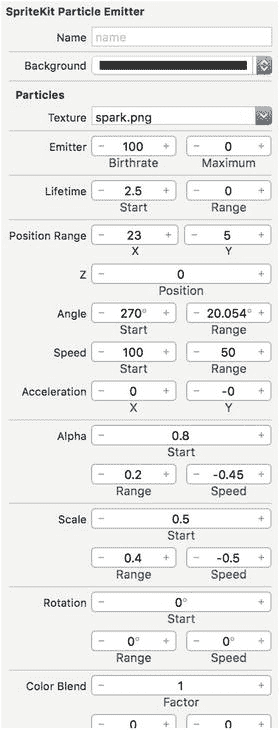
*图 6-1. Xcode 的粒子发射器编辑器*

### 使用粒子发射器模板

除了能够创建自定义效果之外，粒子发射器编辑器还提供了一系列预先构建的粒子模板。这些模板为你创建自己的自定义效果提供了绝佳的起点。表 6-1 描述了每个模板。

**表 6-1.** Xcode 预置的粒子发射器模板

| 模板名称 | 用途 |
| --- | --- |
| Bokeh（散景） | 此模板创建一个六边形粒子集合，粒子会生长、模糊，并在其生命周期结束时淡出。 |
| Fire（火焰） | 此模板创建一个火焰效果，可用作火炬，或者，或许可以作为太空人的尾焰。 |
| Fireflies（萤火虫） | 萤火虫模板创建一个黄色粒子集合，这些粒子在生长、模糊的同时会随机移动一小段距离，并在生命周期结束时淡出。 |
| Magic（魔法） | 魔法模板创建一个绿色（默认情况下）粒子集合，这些粒子在生长、模糊直至生命周期结束淡出之前，也会随机移动一小段距离。 |
| Rain（雨） | 雨模板的功能正如你所料：它创建一个粒子集合，从发射器顶部开始，向屏幕底部移动，旨在模拟一场暴风雨。 |
| Smoke（烟雾） | 烟雾模板会创建多个大型黑色粒子，从发射器底部开始，向屏幕顶部移动。每个粒子在向屏幕顶部移动时，会慢慢淡出。 |
| Snow（雪） | 雪模板创建白色、漫射、圆形的粒子，从发射器顶部开始，像雨粒子一样向屏幕底部移动。 |
| Spark（火花） | 火花模板创建短暂存在的金色粒子，它们会向四面八方（360 度）从发射器中爆射出来，然后逐渐消失。 |

### 创建粒子发射器

让我们开始尝试使用这些粒子发射器。在 Xcode 中，使用 Game 模板创建一个新的 iOS 项目。随意命名，并将项目保存到任意位置。这个项目将是一个“一次性”项目，仅用作你进行发射器实验的游乐场。项目创建完成后，点击 **File** > **New**，然后从 iOS > Resource 类别中选择 **SpriteKit Particle File** 模板，如图 6-2 所示。

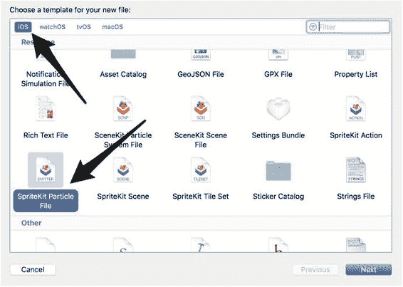
*图 6-2. 选择模板对话框*

现在点击 **Next** 按钮，并选择 **Spark** 粒子模板，如图 6-3 所示。

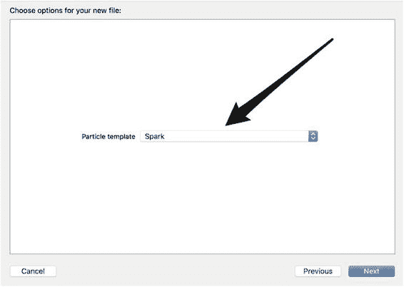
*图 6-3. 选择文件选项对话框*

确保选择了正确的粒子模板后，再次点击 **Next**，并将文件命名为 `MySparkParticle`。接着，选择 `MySparkParticle.sks` 文件。这次你将看到类似于图 6-4 的图像。

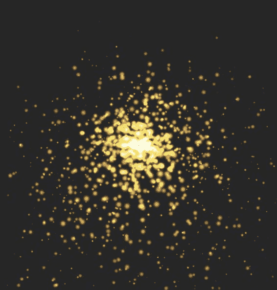
*图 6-4. 生成的火花粒子发射器*

你在这里看到的是白点图像（`spark.png`）的众多版本集合，每个版本代表该粒子发射器生成的单个粒子。每个粒子看起来与 `spark.png` 文件差异如此之大的原因是，发射器根据其属性设置修改了每个粒子图像。

### 粒子发射器属性

要查看这些属性是如何设置的，在选中 `MySparkParticle.sks` 文件的情况下，打开 Xcode 右侧的实用工具面板（Utilities pane），然后点击 **Show the SKNode inspector** 按钮。这将显示当前粒子发射器的每个属性。你可以在图 6-5 中看到这些属性。

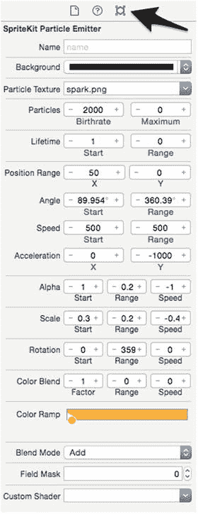
*图 6-5. SpriteKit 粒子发射器属性*

粒子发射器编辑器中的每个属性都会改变每个粒子的发射方式。一旦你修改了感兴趣的每个发射器属性，Xcode 就会将发射器属性保存到一个扩展名为 `.sks` 的 SpriteKit 粒子文件中。生成的文件包含一个归档的 `SKEmitterNode` 对象，该对象被配置为运行在编辑器中设计的粒子效果。当你想在游戏中使用该粒子发射器时，首先从 `mainBundle` 中获取 `.sks` 文件的路径；然后使用这个路径来解档 `SKEmitterNode` 对象，并将该节点添加到场景或其他 `SKNode` 中：

```swift
let pathToEmitter = 
    Bundle.main.path(forResource: "MySparkParticle", ofType: "sks")
let emitter = 
    NSKeyedUnarchiver.unarchiveObject(withFile: pathToEmitter!) as? SKEmitterNode
addChild(emitter!)
```

这是创建粒子发射器并将其添加到游戏中最常见的过程。让我们来看看 SuperSpaceMan 游戏中会使用到的属性。


#### 粒子生命周期属性

粒子生命周期属性决定了创建粒子的数量、可创建粒子的最大数量以及每个已创建粒子的存在时间。共有四个属性控制粒子的生命周期，如图 6-6 所示。  
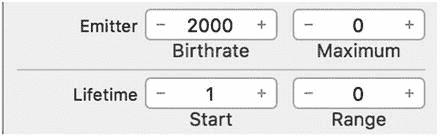  
图 6-6. SpriteKit 粒子生命周期属性

##### 发射器出生速率与最大粒子数属性

前两个生命周期属性是发射器的 `Birthrate`（出生速率）和 `Maximum`（最大粒子数）属性。`Birthrate` 属性定义了每秒发射新粒子的速率。该值越高，生成新粒子的速度越快。`Maximum` 粒子生命周期属性决定了发射器要发射的粒子总数。值为 `0` 时，粒子会无限期发射。任何其他值都会导致发射器在达到该数值时停止发射。要查看这两个属性如何协同工作，请返回 Xcode 中的 SpriteKit 粒子发射器属性编辑器，将 `Birthrate` 属性改为 `20`，将 `Maximum` 属性改为 `0`。观察发生了什么——发射器每秒生成 `20` 个粒子。现在保持 `Birthrate` 属性为 `20`，将 `Maximum` 属性改为 `20`，并查看发射器如何变化。这一次，发射器将在 `1` 秒内发射 `20` 个粒子，然后停止 `1` 秒，接着再发射 `20` 个粒子。它将永远重复这个过程。当你完成对这两个属性的调试后，请将 `Birthrate` 属性改回 `2000`，并将 `Maximum` 属性改回 `0`。

#### 生命周期起始值与范围属性

接下来的两个粒子生命周期属性是 `Start`（起始值）和 `Range`（范围）属性。这些属性控制已发射粒子的存在时间。`Start` 属性控制粒子可见的平均时长（以秒为单位）。时间一到，粒子就会逐渐消失。`Range` 属性提供了一种改变粒子在屏幕上存在时间的方法。当你将此属性设置为除 `0` 以外的任何数字时，系统会生成一个介于 `0` 和输入数字之间的随机数。然后，该数字的一半会随机地加到 `Start` 值上或从其中减去，从而得出粒子的最终存在时间。如果你输入 `0`，那么所有粒子的可见时间都将相同。

#### 粒子运动属性

有五组属性会影响所发射粒子的运动，如图 6-7 所示，并在以下章节中说明。  
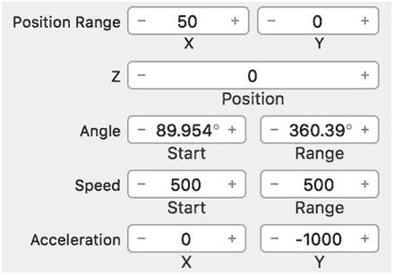  
图 6-7. SpriteKit 粒子运动属性

##### 位置范围属性

`Position Range`（位置范围）属性定义了创建发射粒子的区域。粒子是在由 `Position Range` 属性的 X 和 Y 值定义的矩形内创建的。要了解其工作原理，请返回 `MySparkParticle.sks` 文件，将 `Position Range` 属性的 X 值改为 `300`，Y 值改为 `300`，并观察这对粒子发射的影响。你现在会看到粒子在一个 `300×300` 的方框内发射。请自行调试这些属性，直到熟悉它们的工作方式为止。

##### Z 位置属性

`Z-position`（Z 位置）属性控制粒子沿 z 轴的平均起始深度。你可以将这个属性理解为控制粒子放置位置离视口的远近。

##### 角度属性

下一个粒子运动属性是 `Angle`（角度）属性。`Angle` 属性定义了粒子从创建点以逆时针方向运动的角度。有两个 `Angle` 值：`Start`（起始值）和 `Range`（范围值）。`Start` 值定义了粒子发射的方向（以度为单位），而 `Range` 值定义了粒子初始角度的变化范围（数值的正负一半）。这听起来很复杂，所以让我们实际调试这些值，看看会发生什么。如果你查看火花发射器 `Angle` 属性的初始值，你会发现它大约是 `90` 度，而 `Range` 属性大约设置为 `360` 度。要了解这些值如何影响粒子发射，最简单的方法是同时设置 `Start` 和 `Range` 值。目前，`Range` 设置为 `360` 度，这意味着粒子发射范围是一个完整的圆。将 `Range` 值减小到 `90` 度，将 `Start` 值设置为 `0` 度，看看会发生什么。你将看到粒子开始向屏幕右侧发射，并大致分散到初始发射点上下 `45` 度范围内。现在将 `Start` 值增加到 `90` 度。注意粒子现在是如何开始垂直向上发射的。再将 `Start` 值增加 `90` 度，使其成为 `180` 度。这次粒子向屏幕左侧发射。调试这些值之后，你会发现 `Start` 值从 `0` 度开始，围绕发射点中心逆时针旋转到 `360` 度，并从 `Start` 值开始，以 `Range` 值的一半向外扩散。

##### 速度属性

`Speed`（速度）属性相当直接。它定义了粒子在创建时的初始运动速度。你可以使用 `Start` 值指定初始速度，然后可以使用 `Range` 值来调整粒子的初始速度（数值的正负一半）。将 `Range` 值设置为 `0` 意味着所有粒子以相同速度运动。

##### 加速度属性

最后一个粒子运动属性是 `Acceleration`（加速度）属性。`Acceleration` 属性控制粒子在发射后沿 X 和 Y 方向加速或减速的程度。你使用 X 值来沿 x 轴施加加速度，使用 Y 值来沿 y 轴施加加速度。通常使用 `Acceleration` 属性来模拟重力效果。要了解其工作原理，最简单的方法是将所有发射器属性更改为与图 6-8 中的值相匹配。  
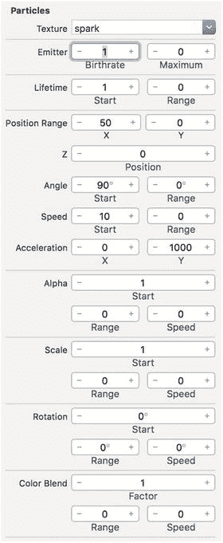  
图 6-8. 修改后的粒子发射器属性  
如果图中未显示某个属性，则无需更改。完成这些更改后，你将看到一个粒子沿 y 轴垂直向上运动。粒子垂直向上的原因是所有加速度都沿 y 轴方向。将 `Acceleration` 属性的 X 值改为 `500`，看看会发生什么。粒子现在会沿 y 轴向上移动，同时沿 x 轴向右移动。接下来，将 `Acceleration` 属性的 X 值改为 `–500`。你将看到粒子再次沿 y 轴向上移动，但这次它沿 x 轴向左移动。这是因为你应用了负的 X 方向加速度。

### 为玩家添加尾迹

现在是时候将这一新知识付诸实践了。让我们使用粒子发射器为 `playerNode` 添加一个尾迹。为此，你需要切换回 `SuperSpaceMan` 项目，并向项目添加一个新的粒子发射器。你之前已经看到过这个过程，但这里给出简化的步骤：

1.  选择 **File ➤ New File** 菜单，并从 **iOS ➤ Resource** 类别中选择 **SpriteKit Particle File** 模板，以添加一个新的 SpriteKit 粒子文件。  
2.  选择 **Fire** 作为粒子模板，并点击 **Next** 按钮。  
3.  将粒子发射器命名为 `EngineExhaust`，然后点击 **Create** 按钮。


完成以上步骤后，选择新创建的 `EngineExhaust.sks` 文件。你会看到类似图 6-9 的画面。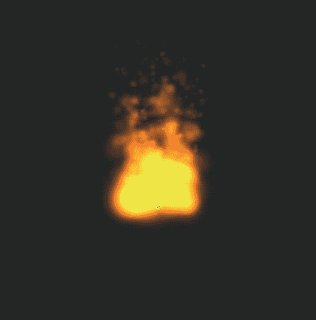 图 6-9. 默认火焰粒子发射器 效果看起来不错，但为了模拟太空人向上飞行时的尾气排放，需要将火焰的发射角度旋转 180 度。具体操作是：将`角度`属性的`起始`值改为 270 度；为了调整火焰宽度，将`位置范围`的`X`值减小为 23。图 6-10 展示了这些改动。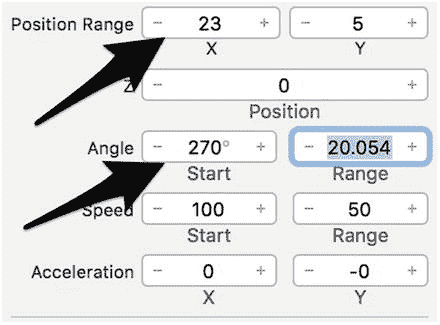 图 6-10. 反向火焰粒子发射器的属性修改 完成这些修改后，你会看到火焰现在朝屏幕下方发射，且火焰宽度已减小。效果明显更好，但我们认为如果火焰更柔和一些，表现力会更佳。最简单的实现方法是降低粒子的`出生率`值。如图 6-11 所示，将粒子`出生率`值减小为 100。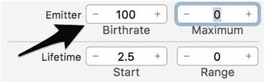 图 6-11. 减小后的粒子`出生率`值 太棒了。保存修改，让我们看看图 6-12 所示的新粒子发射器。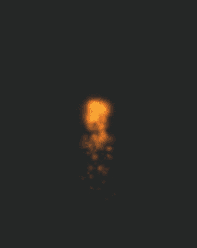 图 6-12. 最终粒子发射器 这正是我们需要的。火焰正以正确方向发射，且大小和`出生率`值非常适合附着在`playerNode`上。现在让我们开始使用这个新发射器。如果你还记得前面的内容，一旦发射器效果满意，将其添加到场景中是非常简单的。首先需要加载 `SKEmitterNode`，并使用新的 `SKS` 文件。这相当简单，只需在第一个 `GameScene.init()` 方法之前添加一个名为 `engineExhaust` 的新 `SKEmitterNode`。声明如下：

```
var engineExhaust: SKEmitterNode?
```

完成此修改后，将以下代码行添加到第二个 `GameScene.init()` 方法的末尾：

```
let engineExhaustPath = Bundle.main.path(forResource: "EngineExhaust", ofType: "sks")
engineExhaust = NSKeyedUnarchiver.unarchiveObject(withFile: engineExhaustPath!) as? SKEmitterNode
engineExhaust?.position = CGPoint(x: 0.0, y: -(playerNode.size.height / 2))
```

除了最后一行，这些代码你之前都见过。最后一行将发射器的位置设置为点 (`0.0`, `-(self.playerNode.size.height / 2)`)。使用这个点的原因在于发射器需要添加到 `playerNode` 上，而 `playerNode` 的锚点位于玩家中心。使用 `playerNode` 一半高度的负值将把发射器放置在 `playerNode` 的底部。 好了，目前已经加载了发射器节点，准备将其添加到 `playerNode` 中。可以通过以下两行代码实现：

```
playerNode.addChild(engineExhaust!)
engineExhaust?.isHidden = true
```

查看这段修改，你会发现代码非常直接。首先将 `engineExhaust` 发射器节点添加到 `playerNode`，然后将尾气隐藏。这里隐藏尾气是因为我们希望在游戏玩家点击屏幕时，尾气发射器才可见。将这段代码添加在设置 `engineExhaust` 节点位置的代码行之后。 还有一件事需要做，即当用户点击屏幕时使 `engineExhaust` 可见。为此，在 `touchesBegan()` 方法的第二个 `if` 语句末尾添加以下代码行，然后再次运行游戏：

```
engineExhaust?.isHidden = false
```

注意，这次点击屏幕时，太空人不仅会向上飞行，而且 `playerNode` 底部还会出现一股尾气流。效果很棒，但有一个问题：即使你停止点击屏幕，尾气发射器仍然可见。发射器应该在一段时间后消失，以模拟一个短暂的爆发力，并在短时间内消散。 使用 `NSTimer` 可以轻松解决这个问题。修复方法是修改 `touchesBegan()` 方法，在每次点击屏幕并施加冲量时启动一个计时器。修改后的 `if` 语句如下所示：

```
if impulseCount > 0 {
    playerNode.physicsBody?.applyImpulse(CGVector(dx: 0.0, dy: 40.0))
    impulseCount -= 1
    engineExhaust?.isHidden = false
    Timer.scheduledTimer(timeInterval: 0.5,
        target: self,
        selector: #selector(GameScene.hideEngineExaust(_:)),
        userInfo: nil,
        repeats: false)
}
```

查看这些修改，你会注意到在 `if` 语句末尾创建了一个新的计时器，它将在预定后 0.5 秒执行 `hideEngineExhaust()` 方法。将要调用的 `hideEngineExhaust()` 方法如下：

```
func hideEngineExaust(_ timer:Timer!) {
    if !engineExhaust!.isHidden {
        engineExhaust?.isHidden = true
    }
}
```

检查 `hideEngineExhaust()` 方法，你会发现它的功能与名称完全一致：首先检查 `engineExhaust` 是否可见，如果可见则将其隐藏。 对 `touchesBegan()` 方法进行这些修改，并将 `hideEngineExhaust()` 方法添加到 `GameScene` 的底部。完成这些修改后，再次运行应用。这次你会注意到，每次点击屏幕时，尾气会添加到 `playerNode` 上，并在最后一次点击后 0.5 秒从 `playerNode` 上移除。效果明显更好了。 在结束本章之前，请确保最终的 `touchesBegan()` 方法如下所示：

```
override func touchesBegan(_ touches: Set<UITouch>, with event: UIEvent?) {
    if !playerNode.physicsBody!.isDynamic {
        playerNode.physicsBody?.isDynamic = true
        coreMotionManager.accelerometerUpdateInterval = 0.3
        coreMotionManager.startAccelerometerUpdates()
    }
    if impulseCount > 0 {
        playerNode.physicsBody?.applyImpulse(CGVector(dx: 0.0, dy: 40.0))
        impulseCount -= 1
        engineExhaust!.isHidden = false
    Timer.scheduledTimer(timeInterval: 0.5,
        target: self,
        selector: #selector(GameScene.hideEngineExaust(_:)),
        userInfo: nil,
        repeats: false)
    }
}
```

### 总结

在本章中，我们简要介绍了粒子发射器，包括快速浏览了 Xcode 的一些模板发射器。之后，我们演示了如何将粒子发射器添加到 `playerNode` 中，以便在每次对 `physicsBody` 施加冲量时模拟发动机尾气。在第 7 章中，你将首次了解 SpriteKit 的 `SKTextNode`，届时我们将展示如何为 SuperSpaceMan 游戏添加计分功能。之后，你还将看到 `SKAction` 的另一种用途——为 SuperSpaceMan 游戏添加音效。© James Goodwill and Wesley Matlock 2017 James Goodwill and Wesley MatlockBeginning Swift Games Development for iOS10.1007/978-1-4842-2310-9_7

