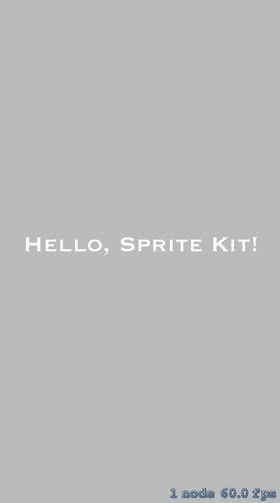
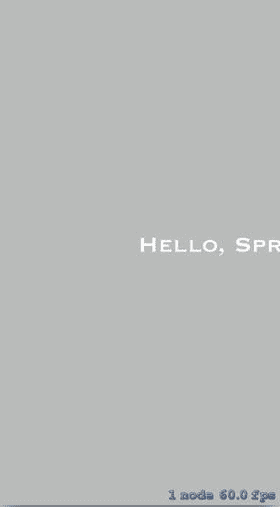
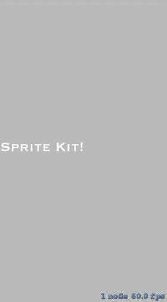
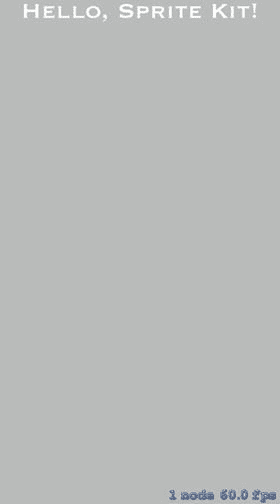
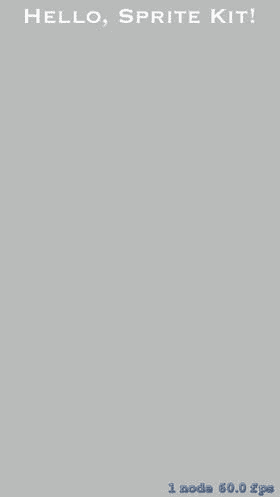
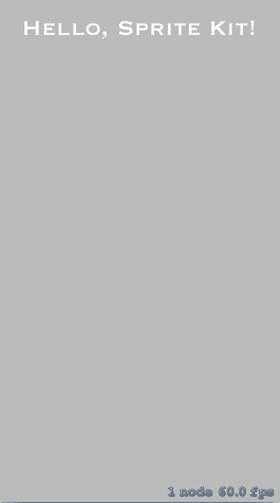
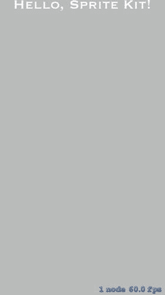
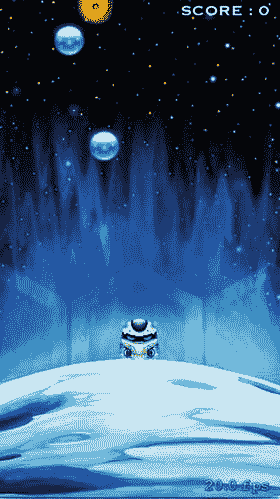
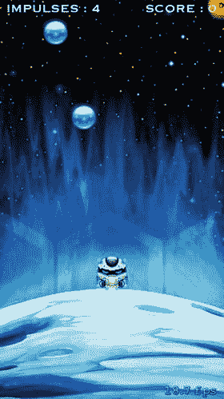

# 7. 添加分数和音效

James Goodwill^(1 ) and Wesley Matlock² (1) 美国科罗拉多州海兰兹牧场 (2) 美国密苏里州堪萨斯城   在本章中，我们将讨论如何使用 `SKLabelNode` 为 SpriteKit 游戏添加标签。具体来说，我们将演示如何添加一个标签来跟踪 SuperSpaceMan 剩余的可使用冲量次数，然后演示如何为游戏添加计分功能，以跟踪 SuperSpaceMan 已收集的能量球数量。在本章末尾，你将有机会重新审视 `SKAction`，届时我们将展示如何使用它们来添加简单的游戏音效。


### 介绍 SKLabelNodes

如前所述，SpriteKit 使用名为 `SKLabelNode` 的类来实现文本标签。`SKLabelNode` 类与你目前见到的所有节点一样，都是 `SKNode` 的子类。它是一个非常简单的类，只有两个 `init()` 方法和少量属性，全部聚焦于设置标签字体、颜色和布局。

使用 `SKLabelNode` 的最简单方式如下所示：

```
let simpleLabel = SKLabelNode(fontNamed: "Copperplate")
simpleLabel.text = "Hello, SpriteKit!";
simpleLabel.fontSize = 40;
simpleLabel.position = CGPoint(x: size.width / 2.0, y: size.height / 2.0)
addChild(simpleLabel)
```

查看这段代码，可以看到它首先通过向 `init()` 方法传入你想要使用的字体名称来创建 `SKLabelNode` 类。之后，你设置标签的 `text` 属性。接着设置 `fontSize` 和 `position` 属性。最后，将标签节点添加到场景中。

让我们在示例应用中尝试一下。回到 Xcode 并创建一个使用 Swift 语言的新 Game 项目。现在，就像你在第 1 章中所做的那样，删除 `GameScene.sks` 和 `Actions.sks` 文件。打开 `GameViewController.swift` 并将其内容替换为代码清单 7-1 中的类。

```
import SpriteKit

class GameViewController: UIViewController {
    var scene: GameScene!
    override func viewDidLoad() {
        super.viewDidLoad()
        // 1. 配置主视图
        let skView = view as! SKView
        skView.showsFPS = true
        // 2. 创建并配置我们的游戏场景
        scene = GameScene(size: skView.bounds.size)
        scene.scaleMode = .aspectFill
        // 3. 显示场景。
        skView.presentScene(scene)
    }
}
```

**代码清单 7-1.** `GameViewController.swift`：主 `UIViewController`

修改完 `GameViewController` 后，转到 `GameScene.swift` 文件，将其主体改为与代码清单 7-2 一致。

```
import SpriteKit

class GameScene: SKScene {
    required init?(coder aDecoder: NSCoder) {
        fatalError("init(coder:) has not been implemented")
    }
    override init(size: CGSize) {
        super.init(size: size)
        let simpleLabel = SKLabelNode(fontNamed: "Copperplate")
        simpleLabel.text = "Hello, SpriteKit!"
        simpleLabel.fontSize = 40
        simpleLabel.position = CGPoint(x: size.width / 2.0, y: size.height / 2.0)
        addChild(simpleLabel)
    }
}
```

**代码清单 7-2.** 新的 `GameScene` 类

请注意，此代码清单包含两个 `init()` 方法。第一个方法是必需的，并接受一个 `NSCoder`。因为我们手动管理场景，所以可以忽略这个 `init()` 方法。第二个 `init()` 方法接受一个 `CGSize`。在该 `init()` 方法内部，先调用了 `super.init()` 方法，然后你就看到了与 `SKLabel` 相关的代码。这段代码看起来与之前添加 `SKLabelNode` 的片段完全一样。

运行应用并查看结果。新的应用应如图 7-1 所示。



**图 7-1.** 一个简单的 `SKLabelNode` 示例

如你所见，`SKLabelNode` 使用起来非常简单。`SKLabelNode` 的大部分属性都很直观，但有两个属性你可能没见过。这两个 `SKLabelNode` 属性是 `horizontalAlignmentMode` 和 `verticalAlignmentMode`。每个属性将在以下章节中描述。

### 更改标签节点的水平对齐方式

`SKLabelNode` 的 `horizontalAlignmentMode` 用于设置文本相对于节点位置的水平位置。共有三个水平对齐选项，均由枚举 `SKLabelHorizontalAlignmentMode` 定义。这三个选项分别是 `SKLabelHorizontalAlignmentMode.left`、`SKLabelHorizontalAlignmentMode.center` 和 `SKLabelHorizontalAlignmentMode.right`。

要了解该属性及这些选项如何改变标签节点的布局，请在设置标签节点位置的那一行代码之后立即添加以下代码行：

```
simpleLabel.horizontalAlignmentMode = SKLabelHorizontalAlignmentMode.left
```

现在再次运行应用。这次你会看到标签向右偏移了，如图 7-2 所示。



**图 7-2.** 一个简单的 `SKLabelNode` 示例，其 `horizontalAlignmentMode` 设置为 `SKLabelHorizontalAlignmentMode.right`

将此对齐方式设置为 `SKLabelHorizontalAlignmentMode.left` 会告诉 SpriteKit 将 `SKLabelNode` 的左侧放置在标签节点的原点位置。`horizontalAlignmentMode` 的默认值是 `SKLabelHorizontalAlignmentMode.center`，该值将标签的中心放置在标签的 `position` 属性处。你在图 7-1 中看到了这种模式。

在继续之前，再尝试一件事。将 `horizontalAlignmentMode` 属性的值从 `SKLabelHorizontalAlignmentMode.left` 更改为 `SKLabelHorizontalAlignmentMode.right`，如下所示，然后再次运行应用：

```
simpleLabel.horizontalAlignmentMode = SKLabelHorizontalAlignmentMode.right
```

这次标签的右侧被放置在 `SKLabelNode` 的 `position` 属性所在点，如图 7-3 所示。



**图 7-3.** 一个简单的 `SKLabelNode` 示例，其 `horizontalAlignmentMode` 设置为 `SKLabelHorizontalAlignmentMode.left`

### 更改标签节点的垂直对齐方式


在上一节中，你已经了解了如何通过 `SKLabelNode` 的 `horizontalAlignmentMode` 属性来更改其水平对齐方式。本节中，你将学习如何更改 `SKLabelNode` 的垂直对齐方式。开始之前，请返回 `GameScene.swift` 文件，将其内容修改为与代码清单 7-3 一致。

```
import SpriteKit
class GameScene: SKScene {
    required init?(coder aDecoder: NSCoder) {
        fatalError("init(coder:) has not been implemented")
    }
    override init(size: CGSize) {
        super.init(size: size)
        let simpleLabel = SKLabelNode(fontNamed: "Copperplate")
        simpleLabel.text = "Hello, SpriteKit!"
        simpleLabel.fontSize = 40
        simpleLabel.position =
            CGPoint(x: size.width / 2.0,
                    y: frame.height - simpleLabel.frame.height)
        simpleLabel.horizontalAlignmentMode = SKLabelHorizontalAlignmentMode.center
        addChild(simpleLabel)
    }
}
```

*代码清单 7-3. 在场景顶部包含简单标签的 GameScene 类*

请注意，此代码与上一节中使用的代码类似，不同之处在于 `SKLabelNode` 已被放置到场景顶部，并且 `horizontalAlignmentMode` 已明确设置为 `center`。要查看效果，请再次运行应用程序。现在应如图 7-4 所示。



*图 7-4. 位于场景顶部中央的简单 `SKLabelNode`*

我们将标签移至场景顶部，是为了让你更直观地看到垂直对齐方式的改变如何影响节点的呈现。用于更改垂直对齐方式的 `SKLabelNode` 属性是 `verticalAlignmentMode`。此属性可设置为四个值，它们由 `SKLabelVerticalAlignmentMode` 枚举定义。

第一个选项 `SKLabelVerticalAlignmentMode.baseline` 是默认值，它会使文本的基线位于节点的原点。你已在图 7-4 中看到该选项的示例，当时未设置 `verticalAlignmentMode`，因此默认使用了 `SKLabelVerticalAlignmentMode.baseline` 值。

第二个选项是 `SKLabelVerticalAlignmentMode` 枚举值 `SKLabelVerticalAlignmentMode.center`，用于将文本在垂直方向上居中对齐于节点的原点。要查看该值如何改变文本布局，请在 `GameScene` 的 `init()` 方法中、将 `simpleLabel` 添加到场景之前添加以下代码行：

```
simpleLabel.verticalAlignmentMode = SKLabelVerticalAlignmentMode.center
```

完成此更改后，再次运行应用程序。你将看到文本向下移动，使得文本的垂直中心点位于 `simpleLabel` 的原点，如图 7-5 所示。



*图 7-5. 将 `verticalAlignmentMode` 设置为 `SKLabelVerticalAlignmentMode.center` 的简单 `SKLabelNode` 示例*

下一个垂直对齐选项是 `SKLabelVerticalAlignmentMode.top`。此值用于将文本定位为文本顶部位于节点原点。要查看该值如何改变文本布局，请将 `simpleLabel` 的 `verticalAlignmentMode` 值设置为 `SKLabelVerticalAlignmentMode.top`，如下所示：

```
simpleLabel.verticalAlignmentMode = SKLabelVerticalAlignmentMode.top
```

完成此更改后，再次运行应用程序。你将看到文本进一步向下移动，使得文本顶部位于 `simpleLabel` 的原点，如图 7-6 所示。



*图 7-6. 将 `verticalAlignmentMode` 设置为 `SKLabelVerticalAlignmentMode.top` 的简单 `SKLabelNode` 示例*

最后一个垂直对齐选项是 `SKLabelVerticalAlignmentMode.bottom`。此值用于将文本定位为文本底部位于节点原点。要查看该值如何改变文本布局，请将 `simpleLabel` 的 `verticalAlignmentMode` 设置为 `SKLabelVerticalAlignmentMode.bottom`，如下所示：

```
simpleLabel.verticalAlignmentMode = SKLabelVerticalAlignmentMode.bottom
```

完成此更改后，再次运行应用程序。你将看到文本向上移动，使得文本底部位于 `simpleLabel` 的原点，如图 7-7 所示。



*图 7-7. 将 `verticalAlignmentMode` 设置为 `SKLabelVerticalAlignmentMode.bottom` 的简单 `SKLabelNode` 示例*


现在你已经知道如何使用 `SKLabelNode`，是时候将其付诸实践了。正如本书开头所述，本游戏的目标是在不与黑洞碰撞或耗尽冲量的情况下尽可能多地收集能量球。在本节中，你终于要为游戏添加计分功能了。具体来说，你需要在场景的右上角添加一个 `SKLabelNode`，初始文本为“SCORE : 0”。每当 `playerNode` 与能量球节点接触时，这个数值就会增加——收集的能量球越多，分数就越高。让我们回到 `SuperSpaceman` 项目来实现这一功能。

要在 `GameScene` 中添加计分标签，第一步是创建一个变量来保存分数（收集的能量球数量）以及一个 `SKLabelNode` 常量来保存标签。你可以通过以下两行代码来实现：

```
var score = 0
let scoreTextNode = SKLabelNode(fontNamed: "Copperplate")
```

这段代码非常直接：它创建了一个名为 `score` 的整数变量并将其初始化为 `0`（这在游戏开始时是合理的），然后创建了一个字体为 `Copperplate` 的 `SKLabelNode`。我们选择 `Copperplate` 是因为我们认为它与已有的图像搭配起来效果不错，但你可以选择任何你喜欢的字体。

查看这段代码后，将其添加到 `GameScene` 声明部分的末尾，紧接在第一个 `init()` 方法之前：

```
var score = 0
let scoreTextNode = SKLabelNode(fontNamed: "Copperplate")

required init?(coder aDecoder: NSCoder) {
    super.init(coder: aDecoder)
}
```

接下来你需要做的是设置 `SKLabelNode` 的所有属性，并将其添加到 `GameScene` 中。这可以通过以下代码片段完成：

```
scoreTextNode.text = "SCORE : \(score)"
scoreTextNode.fontSize = 20
scoreTextNode.fontColor = SKColor.white
scoreTextNode.position = CGPoint(x: size.width - 10, y: size.height - 20)
scoreTextNode.horizontalAlignmentMode = SKLabelHorizontalAlignmentMode.right
addChild(scoreTextNode)
```

所有这些你之前都见过，但在继续之前，我们还是回顾一下。第一行将标签的文本设置为“SCORE :”加上变量 `score` 的当前值。第二行和第三行分别设置了字体大小和字体颜色。片段中的第四行和第五行非常重要：第四行将 `scoreTextNode` 的位置（原点）设置为距离场景右侧边缘 10 点、距离场景顶部 20 点；第五行将节点的水平对齐方式设置为 `SKLabelHorizontalAlignmentMode.right`，这将使标签节点的右侧距离场景最右侧 10 点。之后，`scoreTextNode` 被添加到场景中。

查看这段代码后，将其添加到 `init(size: CGSize)` 方法的底部，然后我们继续。

在重新运行应用并开始挑战你的最高分之前，还需要完成最后一步。找到 `GameScene` 扩展中的 `didBegin(_ contact: SKPhysicsContact)` 方法，并将处理与能量球节点接触的 `if` 语句修改为以下内容：

```
if nodeB.name == "POWER_UP_ORB" {
    impulseCount += 1
    score += 1
    scoreTextNode.text = "SCORE : \(score)"
    nodeB.removeFromParent()
}
```

保存更改后，看一下在移除节点之前添加的两行代码。第一行将分数加 1，第二行更改 `scoreTextNode` 的文本以反映这一增量。确保你已经完成了所有这些更改，然后再次运行游戏。你现在会在场景的右上角看到计分标签，如图 7-8 所示。



**图 7-8.** 带有计分标签的 `GameScene`

开始点击屏幕并尝试收集一些能量球。请注意，每当你的玩家与能量球接触时，分数就会增加。游戏终于有了计分功能。

### 为游戏添加冲量计数器


现在你已经实现了计分功能，是时候让玩家知道他们还剩多少次冲刺次数，之后便会耗尽并开始坠落。这跟之前添加分数标签的方法很相似。最大的区别在于，你要将冲刺次数标签对齐在场景的左上角。

首先，你需要在`GameScene`的声明部分添加一个常量来保存冲刺次数标签。这行代码如下所示：

`let impulseTextNode = SKLabelNode(fontNamed: "Copperplate")`

将这一行直接添加到`scoreTextNode`常量的定义之后。

接下来，修改`impulseTextNode`的属性。实现此操作的代码如下所示：

```
impulseTextNode.text = "IMPULSES : \(impulseCount)"
impulseTextNode.fontSize = 20
impulseTextNode.fontColor = SKColor.white
impulseTextNode.position = CGPoint(x: 10.0, y: size.height - 20)
impulseTextNode.horizontalAlignmentMode = SKLabelHorizontalAlignmentMode.left
addChild(impulseTextNode)
```

这些代码你之前都见过。这段代码将节点的文本设置为 "IMPULSES :" 加上实例变量`impulseCount`中当前存储的值。然后它将字体大小设为 20，颜色设为白色。之后，它将标签节点的位置设置为距离场景左侧 10 点、距离场景顶部 20 点。最后一个属性更改是将`horizontalAlignmentMode`设为`SKLabelHorizontalAlignmentMode.left`，这样文本的左侧就会锚定在节点的原点。之后，`impulseTextNode`就被添加到了场景中。

将这段代码添加到`GameScene`的`init(size: CGSize)`方法的底部，然后保存你的工作。

你还需要进行两项更改来更新显示的冲刺次数。第一项是修改`impulseTextNode`中的文本，以反映玩家每次收集能量球的情况；第二项是每次玩家使用一次冲刺时，修改`impulseTextNode`。

首先从增加冲刺次数开始，你需要再次修改`didBegin(_ contact: SKPhysicsContact)`方法。具体来说，你需要修改处理与能量球节点接触的`if`语句。请看下面的代码片段：

```
if nodeB.name == "POWER_UP_ORB"  {
    impulseCount += 1
    impulseTextNode.text = "IMPULSES : \(impulseCount)"
    score += 1
    scoreTextNode.text = "SCORE : \(score)"
    nodeB.removeFromParent()
}
```

除了冲刺次数递增后的那一行之外，其他所有内容都与上一节相同。这一行将`impulseTextNode`的文本设置为 "IMPULSES :" 加上刚刚在上一行递增后的`impulseCount`变量的值。对`if`语句进行这些修改并保存更改。

为了显示当前冲刺次数，你需要做的最后一项更改是每次玩家使用一次冲刺时修改`impulseTextNode`。为此，你需要回到`GameScene`的`touchesBegan()`方法，将向`playerNode`施加冲量的`if`语句修改为如下所示：

```
if impulseCount > 0 {
    playerNode.physicsBody?.applyImpulse(CGVector (dx: 0.0, dy: 40.0))
    impulseCount -= 1
    impulseTextNode.text = "IMPULSES : \(impulseCount)"
    engineExhaust!.isHidden = false
    Timer.scheduledTimer(timeInterval: 0.5, target: self,
        selector:#selector(GameScene.hideEngineExhaust(_:)) , userInfo: nil, repeats: false)
}
```

这个`if`语句的主体只有一处更改，那就是在`impulseCount`实例变量递减之后的那一行。在这一行中，`impulseTextNode`的`text`属性被修改，就像你之前做的那样，但这一次文本节点会被设置为 "IMPULSES :" 加上刚刚递减后的`impulseCount`。

看完这段代码后，保存更改并再次运行游戏。现在你会看到左上角新增了冲刺次数标签，如图 7-9 所示。



**图 7-9.** 带有冲刺次数标签的 GameScene

继续操作，轻点屏幕几次。注意冲刺次数标签节点如何在你每次轻点屏幕时减少，以及在你每次与能量球节点接触时增加。

### 为游戏添加简单音效

在进入下一章之前，还有一件事需要介绍。我们相信你已经注意到，这个游戏没有声音——太无聊了。在本节中，你将重新学习`SKAction`，以便添加在每次收集到能量球节点时播放音效的功能。

你将用于创建播放音效动作的`SKAction`方法是`playSoundFileNamed()`方法。它的签名如下所示：

```
class func playSoundFileNamed(soundFile: String,
                              waitForCompletion wait: Bool) -> SKAction
```

这个方法接受你应用程序包中的音频文件名和一个`Bool`值，该值指示你是否希望等待音效播放完毕再执行下一行代码。传递给这个方法的文件可以是以下任意格式及更多：MP3、M4A、CAF、WAV。

该方法的使用示例如下两行代码所示：

```
let playSoundAction = SKAction.playSoundFileNamed("sound.wav",
                                               waitForCompletion: false)
runAction(playSoundAction)
```

这两行代码会创建一个`SKAction`，它将播放`sound.wav`文件，并在音效播放完毕前继续执行后续代码。

让我们为 SuperSpaceMan 游戏添加一些音效。在进行下一步之前，找到你在第 1 章下载的 zip 文件。这个文件包含了你需要的所有图片，此外还有一个名为`sounds`的文件夹。在这个目录中，你会找到一个名为`orb_pop.wav`的文件。将此文件复制到你项目的 SuperSpaceMan 文件夹中。

将音效文件添加到项目后，第一步是创建将播放该音效的`SKAction`。以下代码实现了这一点：

```
let orbPopAction = SKAction.playSoundFileNamed("orb_pop.wav",
                                               waitForCompletion: false)
```

这段代码创建了一个名为`orbPopAction`的常量，它持有一个`SKAction`，当该动作运行时将播放`orb_pop.wav`音效文件。将这行代码添加到`GameScene`的声明部分，紧接在第一个`init()`方法之前：

```
let orbPopAction = SKAction.playSoundFileNamed("orb_pop.wav",
        waitForCompletion: false)
required init?(coder aDecoder: NSCoder) {
    super.init(coder: aDecoder)
}
```

现在你已经有了一个能播放`orb_pop.wav`文件的动作。接下来需要添加代码来播放音效。为此，你需要再次修改`didBegin(_ contact: SKPhysicsContact)`方法，添加运行新动作的代码。请看修改后的处理能量球接触的`if`语句，如下所示：

```
if nodeB.name == "POWER_UP_ORB" {
     run(orbPopAction)
    impulseCount += 1
    impulseTextNode.text = "IMPULSES : \(impulseCount)"
    score += 1
    scoreTextNode.text = "SCORE : \(score)"
    nodeB.removeFromParent()
}
```

在这里你可以看到`if`语句的开头新增了一行，每当被接触的节点名称为`POWER_UP_ORB`时，便会运行`orbPopAction`。对`if`语句进行此更改，然后再次运行游戏。现在，每次`playerNode`与能量球节点接触时，都会播放`orb_pop.wav`音效。


### 总结

在本章中，你学习了如何使用`SKLabelNodes`为你的 SpriteKit 游戏添加标签。具体来说，你了解了如何显示剩余脉冲次数，以及如何为游戏添加计分功能，以跟踪太空人收集的能量球数量。在本章末尾，你还有机会在游戏添加音效时重新学习了`SKActions`。在下一章中，你将有机会为游戏添加新场景，并在添加菜单功能和开始新游戏的能力时进行场景切换。

© James Goodwill 和 Wesley Matlock 2017 James Goodwill 和 Wesley Matlock  
*Beginning Swift Games Development for iOS*  
10.1007/978-1-4842-2310-9_8

