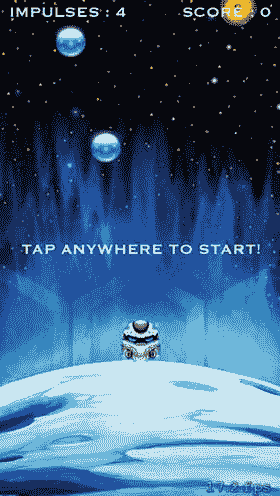
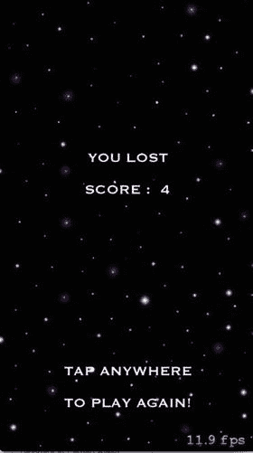

# 8. 场景之间的切换

James Goodwill¹ 和 Wesley Matlock²  
(1) 美国科罗拉多州海兰兹牧场  
(2) 美国密苏里州堪萨斯城  

在本章中，你将学习如何使用 SpriteKit 的 `SKTransition` 类来实现场景切换。你将了解 SpriteKit 为你提供的几种不同类型的内置切换。你还将看到如何在切换过程中控制每个场景。在本章末尾，你将运用新学到的知识，为你的 SuperSpaceMan 游戏添加一个菜单场景。如你所知，`SKScenes` 是用于向用户呈现游戏内容的组件，一个设计良好的游戏会将相关内容分组到各个场景中。例如，你可以使用不同的场景来呈现游戏的不同关卡，或者使用一个场景向玩家展示选项菜单。为了在场景之间提供平滑的切换，SpriteKit 提供了 `SKTransition` 类。使用 `SKTransitions` 需要三个步骤：

1. 创建你想要切换到的 `SKScene`。
2. 使用一个类级别的 `SKTransition` 方法来创建你想要的切换效果。
3. 使用 `SKView` 的 `presentScene()` 方法来呈现新场景。

你可以使用 `SKTransition` 的 `init()` 方法创建自定义切换，但更常见的是使用 13 种内置的类级别 `SKTransition` 方法之一：

```
class func crossFade(withDuration: TimeInterval)
class func doorsCloseHorizontal(withDuration: TimeInterval)
class func doorsCloseVertical(withDuration: TimeInterval)
class func doorsOpenHorizontal(withDuration: TimeInterval)
class func doorsOpenVertical(withDuration: TimeInterval)
class func doorway(withDuration: TimeInterval)
class func fade(with: UIColor, duration: TimeInterval)
class func fade(withDuration: TimeInterval)
class func flipHorizontal(withDuration: TimeInterval)
class func flipVertical(withDuration: TimeInterval)
class func moveIn(with: SKTransitionDirection, duration: TimeInterval)
class func push(with: SKTransitionDirection, duration: TimeInterval)
class func reveal(with: SKTransitionDirection, duration: TimeInterval)
```

如你所见，SpriteKit 提供了一套相当完整的内置切换效果。以下代码片段展示了这些切换的一个使用示例：

```
let transition = SKTransition.fade(withDuration: 2.0)
let sceneTwo = SceneTwo(size: size)
view?.presentScene(sceneTwo, transition: transition)
```

看看这段代码。片段的第一行创建了一个切换，它会淡出为黑色，然后在两秒内淡入到新场景。第二行创建了你要切换到的场景，最后一行则实际使用该切换呈现了场景。

### 在切换期间暂停场景

在场景之间进行切换时，你需要注意两个重要的 `SKTransition` 属性：`pausesIncomingScene` 和 `pausesOutgoingScene`。这些属性是 `Bool` 类型，分别用于暂停进入场景和离开场景的动画。如果你希望场景的动画在切换期间继续运行，只需在呈现场景前将相应的属性设置为 `false`。这两个属性的默认值都是 `true`。

### 检测新场景何时被呈现

SpriteKit 在 `SKScene` 类中提供了两个你可以重写的方法，用于检测场景何时被切换离开或切换进入。第一个方法是 `SKScene` 的 `willMove()` 方法。当一个 `SKScene` 即将从视图中被移除时，会调用此方法。要重写此方法，请在你的 `SKScene` 实现中添加以下代码：

```
override func willMove(from: SKView) {
    // 插入代码
}
```

第二个方法是 `SKScene` 的 `didMove()` 方法。当一个场景刚刚被视图呈现完成时，会调用此方法。要重写此方法，请在你的 `SKScene` 实现中添加以下代码：

```
override func didMove(to: SKView) {
    // 插入代码
}
```

### 为 SuperSpaceMan 添加新场景

在本节中，你将运用新学到的场景切换知识，为 SuperSpaceMan 游戏添加一个新场景。此场景的目的是让用户看到最近一局的得分，并让他们能够开始新游戏。在进行任何操作之前，我们先添加一条简单的消息，告诉游戏玩家点击屏幕开始游戏。如你所知，游戏在点击屏幕时已经开始。这个标签只是为了开始整理用户界面而添加的便利功能。

要添加此标签，请转到 `GameScene` 的声明部分，并在第一个 `init()` 方法之前直接添加下面一行代码：

```
let startGameTextNode = SKLabelNode(fontNamed: "Copperplate")
```

添加完这一行后，转到 `GameScene` 的 `init(size: CGSize)` 方法的末尾，并将以下代码块添加到此方法的底部：

```
startGameTextNode.text = "TAP ANYWHERE TO START!"
startGameTextNode.horizontalAlignmentMode = SKLabelHorizontalAlignmentMode.center
startGameTextNode.verticalAlignmentMode = SKLabelVerticalAlignmentMode.center
startGameTextNode.fontSize = 20
startGameTextNode.fontColor = SKColor.white
startGameTextNode.position =
    CGPoint(x: scene!.size.width / 2, y: scene!.size.height / 2)
addChild(startGameTextNode)
```

请注意，你在第 7 章中见过类似的代码。查看更改后，再次运行游戏。你现在会看到一个新的白色文字标签“TAP ANYWHERE TO START!”，显示在场景中央，如图 8-1 所示。

  
**图 8-1.** 显示“TAP ANYWHERE TO START!” `SKLabelNode` 的 `GameScene`

在继续之前，再做一件事：添加代码，当屏幕被点击时，从场景中移除 `startGameTextNode` 标签。你可以通过在 `touchedBegan()` 方法的第一个 `if` 语句中添加以下一行代码来实现这一点：

```
startGameTextNode.removeFromParent()
```

### 结束游戏

现在是时候添加用于判断 SuperSpaceMan 游戏何时结束的代码了。游戏结束的方式实际上只有两种：要么玩家躲避所有黑洞并收集能量球，直到到达场景顶部获胜；要么玩家从场景底部掉落而失败。在位置更新时检查玩家位置的最简单地方是在 `GameScene` 的 `update()` 方法中。让我们回到那个方法，并添加必要的代码来实现这一点。目前，`update()` 方法中有一个简单的 `if` 语句，只要 `playerNode` 的 y 坐标大于或等于 180.0，它就会根据 `playerNode` 的位置移动前景和背景节点。这意味着 `playerNode` 可能会离开 `backgroundNodes` 并飞入黑暗的太空。我们真的不喜欢这种效果。为了阻止这种情况发生，请修改当前的 `if` 语句，使其看起来像下面这样：

```
if playerNode.position.y >= 180.0 &&
   playerNode.position.y < 6400.0 {
```

保存此更改并再次运行游戏。尝试到达游戏顶部，看看会发生什么。这一次，当你到达场景顶部时，背景和前景将停止移动，而 `playerNode` 将继续移出视口。这样稍微好一些了。


#### 赢得游戏

至此，玩家即将飞离场景上方，但你需要通过测试来确认玩家何时真正飞出场景，以判定其是否获胜。为此，请在 `update()` 方法的当前 `if` 代码块中添加以下 `else if` 语句：  
`else if playerNode.position.y > 7000.0 { gameOverWithResult(true) }`  
这段代码用于检查 `playerNode` 是否已向上飞出场景超过 7000 点的距离。若条件成立，则会调用一个新的实例方法 `gameOverWithResult()`，并向其传入 `true`，表示玩家获胜。请进行这些修改，然后查看如下所示的 `gameOverWithResult()` 方法：

```
func gameOverWithResult(_ gameResult: Bool) {
    playerNode.removeFromParent()
    if gameResult {
        print("YOU WON!")
    }
    else {
        print("YOU LOSE!")
    }
}
```

请注意，这个方法目前功能有限。它首先从场景中移除 `playerNode`，然后将 `node` 设置为 `nil`。接着，它会测试传入的 `gameResult` 布尔值，并打印玩家是否获胜的信息。目前无需过于担心这个方法，你很快将对其进行修改。现在，请将此方法添加到 `GameScene` 的底部，然后让我们开始判断玩家是否输掉游戏。

注意：当显示屏的高度远远不及 `6400.0` 和 `7000.0` 这些数值时，它们似乎显得不可思议。请记住，你将 `playerNode` 添加到了 `foregroundNode` 中，并且你一直在向下移动 `foregroundNode`，而 `playerNode` 实际上却在场景中持续向上。这就是玩家 Y 坐标远高于设备视口高度的原因。

#### 输掉游戏

现在你已知道玩家何时获胜，是时候测试玩家是否输掉游戏了。为此，请返回 `update()` 方法，并在 `if` 语句的底部（紧接你刚刚添加的 `else if` 之后）添加以下 `else if`：  
`else if playerNode.position.y < 0.0 { gameOverWithResult(false) }`  
这段代码很容易理解。如果 `playerNode` 的 Y 坐标小于 `0.0`，则说明玩家已从场景底部坠落，此时会调用 `gameOverWithResult()` 方法，并向其传入 `false`，表示玩家输掉了游戏。

在切换到新场景之前，还有最后一步需要完成。在 `gameOverWithResult()` 方法中，你已将 `playerNode` 从其父节点移除并设置为 `nil`。这样做完全没问题，但你需要确保在未检查该属性是否为 `nil` 之前，不会尝试使用它。目前你只有两个地方会用到这个属性。第一个是在 `update()` 方法中每次检查 `playerNode` 位置时。为了确保不会解引用一个为 `nil` 的 `playerNode`，你需要用 `if` 语句包围 `update()` 方法的主体，以确认 `playerNode` 属性不为 `nil`。你可以在如下所示的新 `update()` 方法中看到这一改动：

```
override func update(_ currentTime: TimeInterval) {
    if playerNode.position.y >= 180.0 {
        backgroundNode.position =
            CGPoint(x: backgroundNode.position.x,
                    y: -((playerNode.position.y - 180.0)/8));
        backgroundStarsNode.position =
            CGPoint(x: backgroundStarsNode.position.x,
                    y: -((playerNode.position.y - 180.0)/6));
        backgroundPlanetNode.position =
            CGPoint(x: backgroundPlanetNode.position.x,
                    y: -((playerNode.position.y - 180.0)/8));
        foregroundNode.position =
            CGPoint(x: foregroundNode.position.x,
                    y: -(playerNode.position.y - 180.0));
    }
    else if playerNode.position.y > 7000.0 {
        gameOverWithResult(true)
    }
    else if playerNode.position.y + playerNode.size.height < 0.0 {
        gameOverWithResult(false)
    }
}
```

查看这些改动后，请将你的 `update()` 方法修改成上述形式，然后我们继续添加实际的场景过渡动画。

#### 添加过渡动画


在你能过渡到一个新场景之前，你需要有一个可过渡的目标场景。这个游戏需要的场景是：告知玩家上一局得分，并允许他们开始新游戏。要创建新场景，请选择 **文件 ➤ 新建 ➤ 文件** 菜单项，然后选择 **iOS ➤ 源 ➤ Swift 文件**；点击 **下一步** 按钮。确保选中了 `SuperSpaceMan` 文件夹，将文件命名为 `MenuScene`，然后点击 **创建**。现在你会得到一个几乎为空的名为 `MenuScene.swift` 的新文件。将其内容替换为代码清单 8-1 中的内容：

```swift
import SpriteKit

class MenuScene: SKScene {
    required init?(coder aDecoder: NSCoder) {
        super.init(coder: aDecoder)
    }

    init(size: CGSize, gameResult: Bool, score: Int) {
        super.init(size: size)

        let backgroundNode = SKSpriteNode(imageNamed: "Background")
        backgroundNode.size.width = self.frame.size.width
        backgroundNode.position = CGPoint(x: size.width / 2, y: 0.0)
        backgroundNode.anchorPoint = CGPoint(x: 0.5, y: 0.0)
        addChild(backgroundNode)

        let gameResultTextNode = SKLabelNode(fontNamed: "Copperplate")
        gameResultTextNode.text = "YOU " + (gameResult ? "WON" : "LOST")
        gameResultTextNode.horizontalAlignmentMode = SKLabelHorizontalAlignmentMode.center
        gameResultTextNode.verticalAlignmentMode = SKLabelVerticalAlignmentMode.center
        gameResultTextNode.fontSize = 20
        gameResultTextNode.fontColor = SKColor.white
        gameResultTextNode.position = CGPoint(x: size.width / 2.0, y: size.height - 200.0)
        addChild(gameResultTextNode)

        let scoreTextNode = SKLabelNode(fontNamed: "Copperplate")
        scoreTextNode.text = "SCORE :  \(score)"
        scoreTextNode.horizontalAlignmentMode = SKLabelHorizontalAlignmentMode.center
        scoreTextNode.verticalAlignmentMode = SKLabelVerticalAlignmentMode.center
        scoreTextNode.fontSize = 20
        scoreTextNode.fontColor = SKColor.white
        scoreTextNode.position = CGPoint(x: size.width / 2.0, y: gameResultTextNode.position.y - 40.0)
        addChild(scoreTextNode)

        let tryAgainTextNodeLine1 = SKLabelNode(fontNamed: "Copperplate")
        tryAgainTextNodeLine1.text = "TAP ANYWHERE"
        tryAgainTextNodeLine1.horizontalAlignmentMode = SKLabelHorizontalAlignmentMode.center
        tryAgainTextNodeLine1.verticalAlignmentMode = SKLabelVerticalAlignmentMode.center
        tryAgainTextNodeLine1.fontSize = 20
        tryAgainTextNodeLine1.fontColor = SKColor.white
        tryAgainTextNodeLine1.position = CGPoint(x: size.width / 2.0, y: 100.0)
        addChild(tryAgainTextNodeLine1)

        let tryAgainTextNodeLine2 = SKLabelNode(fontNamed: "Copperplate")
        tryAgainTextNodeLine2.text = "TO PLAY AGAIN!"
        tryAgainTextNodeLine2.horizontalAlignmentMode = SKLabelHorizontalAlignmentMode.center
        tryAgainTextNodeLine2.verticalAlignmentMode = SKLabelVerticalAlignmentMode.center
        tryAgainTextNodeLine2.fontSize = 20
        tryAgainTextNodeLine2.fontColor = SKColor.white
        tryAgainTextNodeLine2.position = CGPoint(x: size.width / 2.0, y: tryAgainTextNodeLine1.position.y - 40.0)
        addChild(tryAgainTextNodeLine2)
    }

    override func touchesBegan(_ touches: Set<UITouch>, with event: UIEvent?) {
        let transition = SKTransition.doorsOpenHorizontal(withDuration: 2.0)
        let gameScene = GameScene(size: size)
        view?.presentScene(gameScene, transition: transition)
    }
}
```

**代码清单 8-1.** `MenuScene.swift`：SuperSpaceMan 的 `MenuScene`

请注意，第二个 `init()` 方法接受三个参数：场景的尺寸、以 `Bool` 类型表示的游戏结果以及玩家的分数。如你所知，`size` 参数用于设置场景的尺寸，而第三个和第四个参数将用于向用户显示游戏结果信息。在 `init()` 方法内部，首先添加了一张背景图。所使用的图片与你之前在 `GameScene` 中使用的图片相同。之后，该方法向场景中添加了几个标签，其中包括两个位于场景中央的标签。第一个标签告知用户他们是赢了还是输了比赛，第二个标签则显示他们的分数。接下来，场景底部添加了两个标签，提示玩家点击屏幕任意位置以重新开始游戏。将代码添加到 `MenuScene.swift` 文件后，保存你的工作，然后让我们回到 `GameScene.swift` 文件。现在你有了一个可过渡的场景，因此让我们添加执行过渡的代码。用于实现此过渡的代码如下所示：

```swift
let transition = SKTransition.crossFade(withDuration: 2.0)
let menuScene = MenuScene(size: size,
                          gameResult: gameResult,
                          score: score)
view?.presentScene(menuScene, transition: transition)
```

这段代码的第一行创建了一个交叉淡入淡出的过渡效果，该效果会在两秒内淡入新场景。第二行创建了 `MenuScene` 本身，并向其传递当前场景的尺寸，以及游戏结果和玩家的分数。第三行则实际呈现 `MenuScene`，它会使用第一行创建的过渡效果替换当前场景。阅读这段代码后，请将其添加到 `GameScene` 的 `gameOverWithResult()` 方法底部，如下所示：

```swift
func gameOverWithResult(_ gameResult: Bool) {
    playerNode.removeFromParent()

    let transition = SKTransition.crossFade(withDuration: 2.0)
    let menuScene = MenuScene(size: size,
                        gameResult: gameResult,
                             score: score)
    view?.presentScene(menuScene, transition: transition)
}
```

现在运行游戏，试着赢一局或输一局。无论哪种方式，游戏结束时，你都会看到新场景淡入，如图 8-2 所示。



**图 8-2.** 游戏结束时的 `MenuScene`

太棒了。你现在已经添加了一个简单的场景过渡，它能够传达玩家是赢了还是输了游戏，以及游戏结束时的得分。在进入下一章之前，你还需要做最后一个改动：添加另一个过渡，当玩家点击 `MenuScene` 时，该过渡将开始一个新游戏。实现此功能的代码显示在以下对 `MenuScene` 的 `touchesBegan()` 方法的重写中：

```swift
override func touchesBegan(_ touches: Set<UITouch>, with event: UIEvent?) {
    let transition = SKTransition.doorsOpenHorizontal(withDuration: 2.0)
    let gameScene = GameScene(size: size)
    view?.presentScene(gameScene, transition: transition)
}
```

此方法创建了一个 `doorsOpenHorizontalWithDuration` 过渡和一个新的 `GameScene` 实例，然后使用新过渡呈现新的 `GameScene`。将此方法添加到 `MenuScene` 类的底部，然后再次运行应用程序。这次，当游戏结束并显示 `MenuScene` 时，点击屏幕，你就能开始新一局游戏了。


### 总结

在本章中，你学习了如何使用 SpriteKit 的 `SKTransition` 类来实现场景转场。你了解了 SpriteKit 为你提供的几种不同类型的内置转场效果。你还看到了如何在转场过程中控制每个场景。在本章末尾，你运用新学到的场景转场知识，为你的 `SuperSpaceMan` 游戏添加了一个菜单场景。在第九章（#A330720_2_En_9_Chapter.html）中，你将聚焦 SpriteKit 最佳实践，以此结束使用 Swift 进行 SpriteKit 编程的学习。在本章末尾，你还会花一点时间通过重构来清理 `SuperSpaceMan` 应用程序。© James Goodwill 和 Wesley Matlock，2017 James Goodwill 和 Wesley Matlock《Beginning Swift Games Development for iOS》10.1007/978-1-4842-2310-9_9

