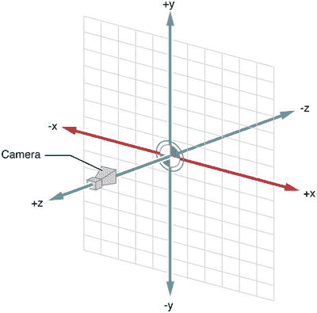
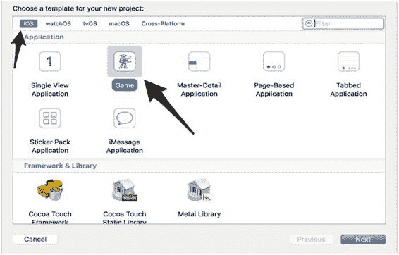
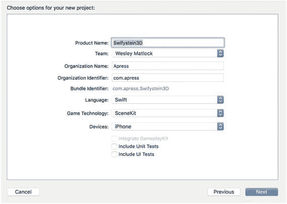
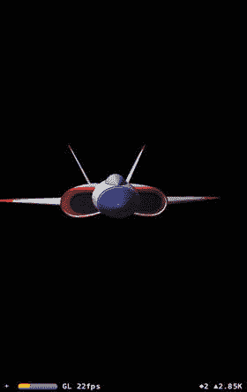
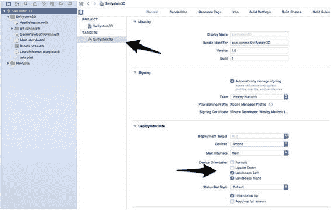
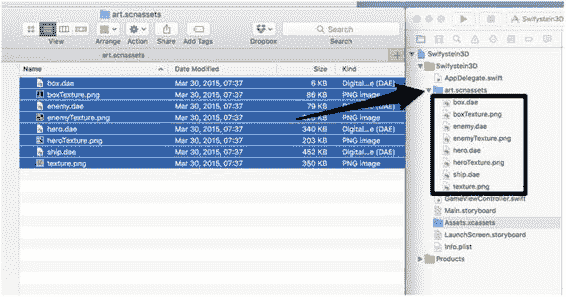
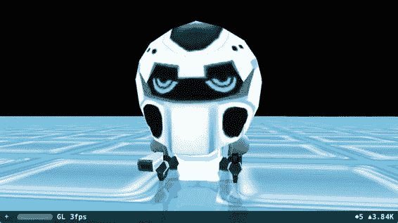

# 10. 创建你的第一个 SceneKit 项目

James Goodwill¹ 和 Wesley Matlock² (1) 美国科罗拉多州海兰兹牧场 (2) 美国密苏里州堪萨斯城

在本章中，你将直接动手创建自己的游戏。这个游戏将致敬经典的《德军总部 3D》。首先，你将学习如何以编程方式创建场景并向场景中添加节点。在你对这些原理有了基本了解之后，你将在后续章节中学习如何使用强大的 SceneKit 编辑器。

### SceneKit 入门

`SceneKit` 是 Apple 强大的 3D 图形框架，使创建休闲 3D 游戏变得简单。通过使用 `SceneKit API`，你无需了解 OpenGL 即可创建完全沉浸式的 3D 游戏。`SceneKit` 最初发布于 OS X Mountain Lion，自 iOS 8 发布以来，开发者已用它创建了众多令人惊叹的 3D 游戏。随着 iOS 10 的发布，开发者现在可以为所有 Apple 设备（iOS、tvOS、macOS 和 watchOS）创建 3D 游戏。`SceneKit` 用于创建场景图，其中包含一个场景和节点的层次结构，如图 10-1 所示。`SceneKit` 使用这些节点在视图中显示场景，并通过图形处理单元 (GPU) 来处理场景图。这提升了在设备上渲染帧的性能。


**图 10-1.** 场景图

Apple 已将 SpriteKit 集成到 `SceneKit` 技术栈中。这种集成将允许你运用 SpriteKit 知识来创建休闲 3D 游戏。表 10-1 概述了各种类，并描述了这些 `SceneKit` 类。

**表 10-1.** SceneKit 类

| 类 | 描述 |
| --- | --- |
| `SCNView` | 此视图用于显示 `SceneKit` 对象。 |
| `SCNScene` | 一个场景可以通过编程方式创建，或使用来自图形工具的 3D 文件创建。 |
| `SCNNode` | 这是创建场景的起点。 |
| `SCNCamera` | 这是场景的视角。 |
| `SCNGeometry` | 这是一个用于附加到节点的 3D 对象。它也可以使用来自图形工具的 3D 文件。 |
| `SCNMaterial` | 材质用于描述节点的表面将如何渲染。 |
| `SCNLight` | 这是附加到节点上的光源，用于提供场景的着色和光照。 |

#### SceneKit 动画

`SceneKit` 还与 ImageKit 和 CoreAnimation 集成，因此你无需任何 3D 编程的高级知识。当你创建场景时，你可以创建在场景属性的不同值之间优雅过渡的动画。`SceneKit` 使用 `SCNTransaction` 类创建一个原子运行循环，以组合你所有的隐式动画更改。这类更改理想情况下是几乎立即发生的小型原子更改，并且你可以增加持续时间。这些类型的动画属性会自动动画化。由于 `SceneKit` 基于 CoreAnimation，你可以显式创建动画对象并将其附加到动画场景中。对于这种更复杂的动画，你需要对 `CAAnimation` 进行子类化。使用键值编码创建此子类后，设置动画参数并将其附加到场景中的节点或元素上。`CAAnimation` 类还能够使用来自第三方图形创作工具的对象。


#### 需要了解的知识

`SceneKit` 是一个基于 3D 的 API，因此你需要对坐标系统、3D 几何等图形学概念有基础了解。

- **点**：在本文档中，点是三维空间中的一个位置。
- **向量**：你主要会使用向量来表示方向。
- **笛卡尔坐标系**：由两个轴组成：沿水平面延伸的 X 轴和垂直于 X 轴的 Y 轴。
- **欧几里得空间**：即三维坐标系，并增加了表示景深的 Z 轴。
- **变换**：许多操作会涉及变换，但现阶段你只需处理用于点和旋转的运算符。可以将其理解为将一个点变换到另一个点，或将一个向量（方向）应用到物体的旋转上。

有关计算机图形编程的更多信息，我们建议参考 John Vince 所著的 *Geometric Algebra for Computer Graphics*（Apress，2008 年）。默认情况下，摄像机或用户视角沿 Z 轴方向（图 10-2）。  
  
图 10-2. SceneKit 坐标系统

### 创建 SceneKit 项目

学习的最好方法就是直接动手，从零开始。你将创建一个使用 Swift 作为编程语言、`SceneKit` 作为游戏技术的游戏项目。要创建项目，请打开 `Xcode` 并完成以下步骤：

1. 选择 **文件** ➤ **新建项目**。
2. 从 iOS 分组中选择 **应用程序**。
3. 选择 **游戏** 图标。此时“选择模板”对话框应如图 10-3 所示。  
     
   图 10-3. 选择模板对话框
4. 点击 **下一步** 按钮继续。
5. 在 **产品名称** 中输入 `SuperSpaceMan3D`，在 **组织名称** 中输入 `Apress`，在 **组织标识符** 中输入 `com.apress`。
6. 确保 **Swift** 为所选语言，**SceneKit** 为所选游戏技术，**iPhone** 为所选设备。
7. 在点击 **下一步** 按钮之前，请查看图 10-4。如果一切与此图一致，请点击 **下一步** 按钮，并选择一个合适的位置来存储你的项目文件。  
     
   图 10-4. 为项目选择选项

> **注意：** 你正在创建一个仅限 iPhone 的游戏，但这是因为该游戏更适合在 iPhone 上运行。我们书中介绍的所有内容都适用于任何 iOS 设备。点击 **下一步** 后，系统会询问你希望将项目保存在哪里。你现在有了一个可运行的 `SceneKit` 项目，可以点击 **播放** 按钮来查看默认的 `SceneKit` 游戏。如果一切正常，你将看到新应用在模拟器中运行。虽然目前它还不能做什么，但你应该能看到一个旋转的喷气式飞机 3D 渲染效果，类似于图 10-5。  
  
图 10-5. SceneKit 示例应用程序

### 连接并构建场景

现在你已经有了一个基础项目，并对 `SceneKit` 有所了解，是时候真正学习如何将这些类组合起来并创建游戏了。目前你的项目正在运行苹果的默认示例代码。在本节中，你将移除这些代码，并为太空人创建一个地板和新环境。

#### Swiftystein3D

在继续之前，让我们彻底清理项目，以便从零开始。与之前仅支持竖屏的游戏不同，这次你将仅支持横屏，因此需要更改目标设置，使其如图 10-6 所示。  
  
图 10-6. SuperSpaceMan3D 设备方向

接下来要做的是将 `GameViewController.swift` 文件的内容替换为列表 10-1 中的类。你需要重写 `viewDidLoad()` 方法并创建一个空的 `SCNScene`。

```swift
import UIKit
import QuartzCore
import SceneKit

class GameViewController: UIViewController {
    override func viewDidLoad() {
        super.viewDidLoad()
        // 创建一个新场景
        view.SCNView()
    }
}
```

列表 10-1. GameViewController.swift：GameViewController

现在如果你运行游戏，将看到一个空白屏幕，这是一个开始游戏的好起点。

#### 项目资源

你需要准备的其中一项是本书中将要使用的图像资源。你应该从 [www.apress.com/97814823093](http://www.apress.com/97814823093) 下载这些资源。`Xcode` 使用 `art.scnassests` 文件夹来优化你的 3D 资源，以便在运行时快速加载和流畅渲染。查看你的项目，会有一个名为 `art.scnassets` 的文件夹，其中包含默认图像 `ship.dea` 和 `texture.png`。请直接删除这两个文件，因为不会用到它们。

既然已经删除了 `ship.dea` 和 `texture.png` 文件，现在可以通过 **访达** 应用程序将游戏资源复制到此文件夹，然后将图像拖入 `Xcode`。示例如图 10-7 所示。  
  
图 10-7. 美术资源

现在这些文件已在项目中，你需要将静态图像添加到项目。这次你只需将图像从“访达”中的文件夹直接拖到 `Xcode` 项目中，并放入 `Xcode` 的图像资源目录：`Images.xcassets`。本游戏将用到的所有图像都将在此次添加。

#### 构建场景


### 开始使用 SceneKit

一个不错的起点是`GameViewController`类。你需要移除`viewDidLoad()`方法中的临时代码，即之前创建空`SCNScene`的部分：

```
override func viewDidLoad() {
    super.viewDidLoad()
}
```

在这个类中，你将创建一个类属性来存储主场景变量。就在类声明之后，继续创建用于存储主场景的变量：

```
class GameViewController: UIViewController {
    var mainScene: SCNScene!
```

根据上一节的最佳实践，你将使用独立的函数来创建游戏对象。这有助于你理解当前的操作，并在后续需要时更容易重构：

```
func createMainScene() -> SCNScene {
    let mainScene = SCNScene(named: "art.scnassets/hero.dae")
    return mainScene!
}
```

这个方法虽小但功能强大；这正是 SceneKit 强大之处开始显现的地方。如你所见，你正在加载一个由 3D 美术师提供的 Collada 文件（`.dae`）。一旦完成场景编码，只需再添加几行代码，你就能让英雄以华丽的 3D 形态呈现。

现在，将创建好的场景添加到你的视图中。在`viewDidLoad()`方法中，你将通过调用刚创建的函数来初始化`mainScene`，然后将该场景添加到`GameViewController`的视图中：

```
// create a new scene
mainScene = createMainScene()
let sceneView = self.view as! SCNView
sceneView.scene = mainScene

// Optional, but nice to be turned on during developement
sceneView.showsStatistics = true
sceneView.allowsCameraControl = true
```

这段代码会获取视图，然后将场景添加到视图的场景中。既然你在这里，为什么不添加`showStatistics`，以便查看 SceneKit 处理 3D 对象的性能呢？你还可以将`allowsCameraControl`设置为`true`，这样就能通过手势操控视图。捏合和缩放可以拉近拉远场景，而平移则允许你围绕场景移动视角。

现在，你应该能够运行项目并在完整的 3D 中看到英雄，如图 10-8 所示。你还可以旋转他，从各个角度观察。


**图 10-8.** 3D 中的太空人

在继续之前，你的`GameViewController`应类似于代码清单 10-2：

```
class GameViewController: UIViewController {
    var mainScene: SCNScene!

    override func viewDidLoad() {
        super.viewDidLoad()

        // create a new scene
        mainScene = createMainScene()
        let sceneView = self.view as! SCNView
        sceneView.scene = mainScene

        // Optional, but nice to be turned on during developement
        sceneView.showsStatistics = true
        sceneView.allowsCameraControl = true
    }

    func createMainScene() -> SCNScene {
        let mainScene = SCNScene(named: "art.scnassets/hero.dae")
        return mainScene!
    }
}
```

**代码清单 10-2.** 设置 `GameViewController` 类

接下来，你将为太空人创建一个可供行走的地面。在`GameViewController`类中，你将创建一个新方法来创建地面节点。暂时不必过多担心`SCNNode`——我将在后续章节中详细讨论它。然而，节点是 SceneKit 场景中使用的基本对象。在函数声明中，你可以看到你将返回一个`SCNNode`给调用者：

```
func createFloorNode() -> SCNNode {

}
```

接下来，你创建一个变量，其返回值类型为`SCNNode`，并将该节点的几何体设置为`SCNFloor`。`SCNFloor`是一个特殊的 SceneKit 类，用于创建一个无限平面。需要注意的是，这个平面将沿着 x 轴和 z 轴延伸，而 y 坐标设置为零：

```
let floorNode = SCNNode()
floorNode.geometry = SCNFloor()
floorNode.geometry?.firstMaterial?.diffuse.contents = "Floor"
return floorNode
```

在这段代码中，你为`floorNode`设置了几何体。一个节点只能被赋予一个几何体，因此要创建动画几何体，你需要创建一个空节点并向其添加子节点。对于`floorNode`，你不会创建动画几何体，但这部分内容我们会在后续创建游戏时涉及。你还为节点添加了一个材质，在本例中是你之前复制到`Assets.xcassets`中的“Floor”图像。现在，你可以简单地将材质理解为一种颜色或图像。同样，稍后你会深入学习材质相关内容。

现在，你已经有了一个可以为地面创建新`SCNNode`的方法。接下来，你需要将它添加到主场景中，以便你能看到并与此节点交互。返回到`createMainScene`方法，在创建主场景之后，添加以下代码：

```
mainScene!.rootNode.addChildNode(createFloorNode())
```

现在运行游戏，你会注意到太空人站在地面之上，而不是悬浮在空中，如图 10-9 所示。



**图 10-9.** 站在地面上的太空人

现在运行游戏，你将能够围绕物体移动视图的视角（即摄像机），并确认你确实拥有一个 3D 场景。这是因为你将摄像机控制设置为`true`。使用捏合缩放和平移手势在场景中移动。如果你在模拟器中运行，请注意每秒帧数（fps），并观察它是否从未接近 60 fps。在我的模拟器上，它从未超过 20 fps。这次，请在装有 iOS 10 的 iPhone 上运行游戏。现在当你移动摄像头时，你应该会看到 fps 保持在接近 60 fps。这是否意味着你的小 iPhone 比 Mac 更强大？很可能不是。模拟器只是模拟不同的设备，以便作为开发者的你快速测试代码。然而，当你在真实设备上运行游戏时，你可以看到 SceneKit 的强大之处。SceneKit 使用 GPU 来渲染场景和节点。这也是苹果建议在将应用提交到 App Store 审核之前，始终在设备上运行应用的原因之一。

在 SceneKit 可用之前，你必须使用其他第三方库或 OpenGL 来实现这一点。要达到你现在用不到 50 行代码所完成的功能，可能需要数千行代码。

### 总结

恭喜！你现在已经拥有了一个运行中的简单 3D 场景。在本章中，你学习到了 SceneKit 提供的一些强大功能。你创建了一个后续将继续构建的项目。在第 11 章中，你将了解什么是场景图以及 SceneKit 如何使用场景图工作。你还将开始使用 SceneKit 的一些内置类，这些类将允许你创建游戏中将要使用的障碍物。

© James Goodwill and Wesley Matlock 2017  
James Goodwill 和 Wesley Matlock  
*Beginning Swift Games Development for iOS*  
10.1007/978-1-4842-2310-9_11

