# 11. 场景与节点

James Goodwill¹ 和 Wesley Matlock²  
(1) 美国科罗拉多州海兰兹牧场  
(2) 美国密苏里州堪萨斯城

在本章中，你将学习 SceneKit 如何使用场景图来渲染场景中的对象。一旦你理解了场景图，你将进一步了解如何使用 SceneKit 的内置模型。你将使用这些模型在游戏中创建障碍物，供英雄躲避，并为敌人提供掩护。


### 场景图 (Scene Graph)

基本上，场景图 `SCNScene` 是场景图树形结构的基础，如图 11-1 所示。在图形编程的早期，场景图是用场景数据建模的，其行为是通过过程化方式创建的，这通常会导致代码混乱。开发者无法在整个应用程序中轻松地复用节点或其他对象。通过关注点分离，你可以在场景及其渲染方式之间建立清晰的边界。图 11-1 展示了这种结构的一个示例。

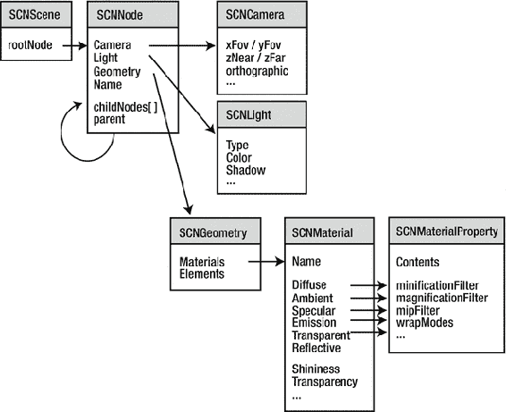
图 11-1. 场景图示例

场景中的每个节点都有一个父节点，除了最顶层的节点——换句话说，即根节点。见图 11-2。

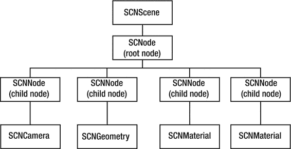
图 11-2. 场景节点

包含其他子节点的节点被视为组节点。在图 11-2 中，你可以看到一个父节点和几个子节点。

-   节点树（组节点）就是在场景中呈现的内容。节点的位置由其父节点定义的坐标系确定。
-   叶节点是实际被渲染的节点。这些节点执行动画，并为节点树指定材质和光照。

### SceneKit 内置模型类

SceneKit 提供了创建沉浸式游戏所需的几乎所有基本几何体。你将使用这些简单的几何体来创建游戏的第一关，从而熟悉这些节点类型。

#### SCNGeometry 对象

SceneKit 提供了几种不同的几何体。当你创建这些几何体中的任何一个时，其中心点位于其局部坐标系的原点。换句话说，如果你创建一个宽度、长度和高度均为 20.0 的 `SCNBox`，这些数值将分别沿 x、y、z 轴分布在 10.0 和 –10.0 的位置。以下是 SceneKit 原始几何体类型列表：

-   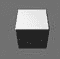 `SCNBox`：这是一个基本的六面多面体，各个面均为矩形。如果需要，你还可以为每个面单独创建 `SCNMaterial`。
-   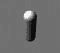 `SCNCapsule`：这是一个两端带有半球形封盖的圆柱体。你可以定义半球半径和高度。
-   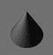 `SCNCone`：这是一个具有圆形底部的几何体，其侧面在圆心处收拢。通过指定底部的半径和侧面的高度来创建 `SCNCone`。
-   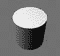 `SCNCylinder`：要创建 `SCNCylinder`，你需要指定半径和高度。
-    `SCNFloor`：这是一个沿 x 轴和 z 轴无限延伸的平面。
-    `SCNPlane`：这是一个沿 x 轴和 y 轴展开的单面表面。
-    `SCNPyramid`：初始化 `SCNPyramid` 时，你需要指定金字塔的高度、宽度和长度。
-   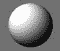 `SCNSphere`：它具有球体的几何形状。实例化 `SCNSphere` 时，你需要提供用于 `SCNSphere` 的半径。
-    `SCNTorus`：圆环体简单地说是围绕一个共面轴的圆，形状像甜甜圈。你需要为它的圆提供内半径和外半径。
-   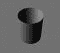 `SCNTube`：这是一个管子或管道。你需要指定内半径、外半径和管子的高度。
-   `SCNShape`：这种几何形状由贝塞尔路径创建。`SCNShape` 让你对 3D 对象的形状有最大的控制权。
-   `SCNText`：你需要提供一个 `NSString` 或 `NSAttributedString`，用于从该字符串创建一个 3D 对象。

如你所见，Apple 提供了你所需的大部分形状。你可以组合这些原始形状来创建复杂的对象。不过，对于这个游戏，目前你将继续使用基本几何体。让我们回到代码中，开始添加一些障碍物，让宇航员能够操纵飞船绕过它们以找到敌人。

### 添加可收集节点

既然你已经对不同类型的几何节点有了一些了解，我们将把它们用作游戏第一关中简单的“可收集物”。让我们继续创建一些几何节点，作为角色可以收集的物品。首先，通过右键点击 `Swifystein3D` 文件夹并选择“新建文件”，或者选择 文件 ➤ 新建 ➤ 文件 来创建一个新文件。无论采用哪种方式，你都会进入文件模板选择界面，如图 11-3 所示。

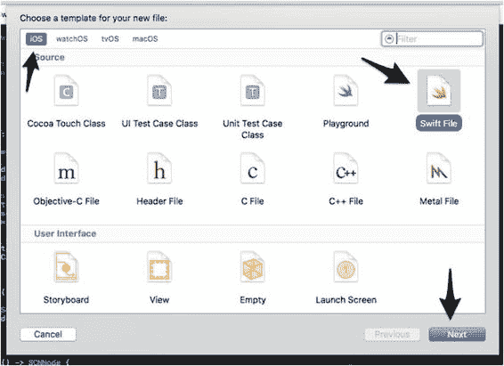
图 11-3. 新建文件

在下一个屏幕上，将你的文件命名为 `Collectable.swift`，如图 11-4 所示。

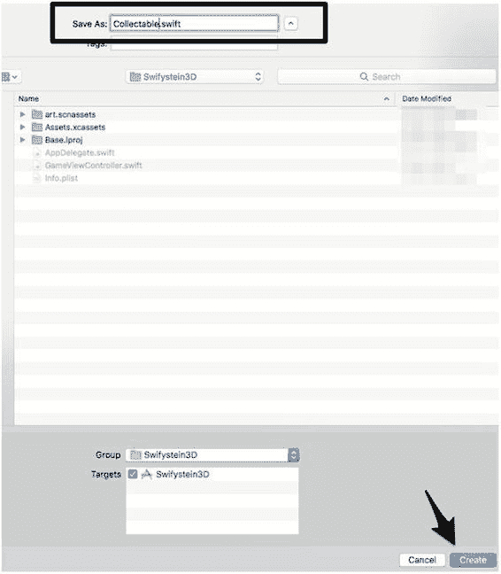
图 11-4. 创建新的 Swift 文件

现在你有了一个新的空白文件，用于创建游戏关卡中的可收集物品。你需要做的第一件事是导入 `SceneKit`，因为你需要创建 `SCNNodes`。然后，创建 `Collectable` 类；完成后，你的文件应类似于清单 11-1 中的代码：

```swift
import Foundation
import SceneKit
class Collectable {

}
```
清单 11-1. Collectable 类

在这个类中，你将以不同的方式做一些事情：创建类级方法。如果你熟悉其他语言，这与静态方法类似。这样做是为了让你接触另一种编码范式。对于第一个可收集物，让我们创建一个 `pyramidNode()` 方法，如清单 11-2 所示：

```swift
class func pyramidNode() -> SCNNode {
    // 1 创建 SCNGeometry 类型
    let pyramid = SCNPyramid(width: 3.0, height: 6.0, length: 3.0)
    // 2 使用几何类型创建节点
    let pyramidNode = SCNNode(geometry: pyramid)
    pyramidNode.name = "pyramid"
    //3 设置节点位置
    let position = SCNVector3Make(30, 0, -40)
    pyramidNode.position = position
    return pyramidNode
}
```
清单 11-2. 金字塔节点

现在让我们详细看看这个方法中发生了什么：

1.  首先，你使用 `SCNPyramid` `SCNGeometry` 类型创建了一个几何对象。这允许你像操作任何 `SCNNode` 一样轻松地操作这个金字塔。
2.  接下来，你基于金字塔对象创建了一个 `SCNNode`。你还将此节点命名为 `pyramid`。给节点命名将有助于我们在本书后面学习碰撞检测时使用。
3.  现在，你为 `pyramidNode` 在场景中指定了一个位置。


创建几何体节点大概就是这样。接下来，你需要将其添加到场景中，这样在运行游戏时才能实际看到它。前往 `GameViewController` 类。在该类中找到 `createMainScene()` 方法。你需要在 `mainScene.rootNode.addChildNode(createFloorNode())` 之后添加 `mainScene.rootNode.addChildNode(Collectable.pyramidNode())`。务必在 `createFloorNode()` 之后添加这个新的子节点。添加完这行代码后，运行游戏。现在你会看到一个金字塔位于英雄角色后面不远处，如图 11-5 所示。

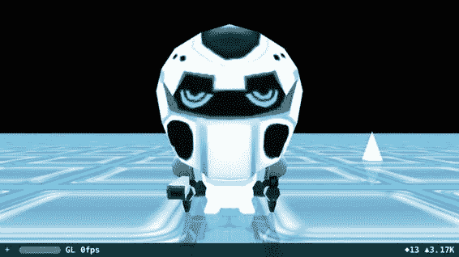

图 11-5. 金字塔节点

好了，现在屏幕中央出现了一个金字塔。不过，它的外观并不太好看。我们还没讨论节点材质的问题。你将在下一章学习更多关于材质和 `SCNMaterial` 对象的知识，但至少应该先给这个金字塔以及后续创建的其他可收集物品添加一些颜色。回到 `Collectable` 类，找到 `pyramidNode` 方法。在设置位置的那行代码之后，继续添加如下代码：

```
// 4 给节点添加颜色
pyramidNode.geometry?.firstMaterial?.diffuse.contents = UIColor.blue
pyramidNode.geometry?.firstMaterial?.shininess = 1.0
```

这里所做的就是将 `firstMaterial` 设置为蓝色。请记住，我们会在下一章更详细地讲解 `diffuse` 和 `shininess`。目前，我们只是让 `pyramidNode` 发出蓝色光泽。如果你想使用其他 `UIColor` 的默认颜色，可以随意更换。实际上，稍后你还会创建几种其他几何体类型的节点，并为它们设置不同的颜色。

现在再运行游戏，你的金字塔会变成蓝色，或者你设置的其他任何颜色。你现在已经掌握了创建基本 SceneKit 几何体对象的基础知识。接下来，请确保你仍在 `Collectable` 类中，并按照 `pyramidNode` 中的相同模式创建更多对象。让我们继续添加另一个可收集物品，创建一个球体节点。在 `pyramidNode` 方法下方，添加代码清单 11-3 所示的代码。

```
class func sphereNode() -> SCNNode {
    // 1 创建 SCNGeometry 类型
    let sphere = SCNSphere(radius: 6.0)
    // 2 使用几何体类型创建节点
    let sphereNode = SCNNode(geometry: sphere)
    sphereNode.name = "sphere"
    //3 设置节点位置
    let position  = SCNVector3Make(35, 0, -60)
    sphereNode.position = position
    // 4 给节点添加颜色
    sphereNode.geometry?.firstMaterial?.diffuse.contents = UIColor.red
    sphereNode.geometry?.firstMaterial?.shininess = 1.0
    return sphereNode
}
```

代码清单 11-3. 球体节点

现在有了这个方法，接下来需要将其添加到场景中。再次前往 `GameViewController`，并将它添加到 `mainScene` 中。暂时先将 `addChildNode(Collectable.pyramidNode())` 注释掉，然后在下方为球体节点添加如下代码：

```
// mainScene.rootNode.addChildNode(Collectable.pyramidNode())
mainScene.rootNode.addChildNode(Collectable.sphereNode())
```

现在运行游戏，你会看到一个红色球体漂浮在地板上，如图 11-6 所示。你可能需要移动并缩放摄像头视角才能近距离看到球体。

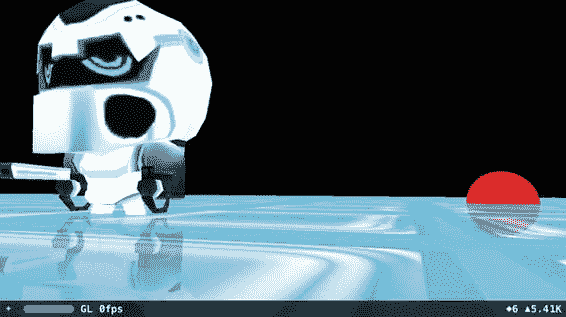

图 11-6. 球体节点

我们确信你已经注意到球体穿过了地板。这正是我们不希望出现的情况。这些几何体类型中有几种，其轴线位于物体的中心。因此，在这种情况下，如果你想让它悬浮在地板之上，就需要调整 y 轴坐标，使其等于球体的半径。在 `Collectable` 类中，将 `sphereNode.position` 改为：`let position = SCNVector3Make(35, 6, -50)`。这次重新运行游戏，你会看到球体按我们期望的那样悬浮在地板上方，如图 11-7 所示。

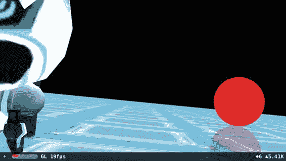

图 11-7. 悬浮的球体节点

请随意调整位置，观察节点在场景中如何移动。现在，你将在 `Collectable` 类中添加更多几何体节点类型。代码清单 11-4 为该类添加了立方体、管状体、圆柱体和环面体。

```
class func boxNode() -> SCNNode {
    // 1 创建 SCNGeometry 类型
    let box = SCNBox(width: 3, height: 3, length: 3, chamferRadius: 0)
    // 2 使用几何体类型创建节点
    let boxNode = SCNNode(geometry: box)
    boxNode.name = "box"
    //3 设置节点位置
    let position  = SCNVector3Make(20, 1.5, -20)
    boxNode.position = position
    // 4 给节点添加颜色
    boxNode.geometry?.firstMaterial?.diffuse.contents = UIColor.brown
    boxNode.geometry?.firstMaterial?.shininess = 1.0
    return boxNode
}

class func tubeNode() -> SCNNode {
    // 1 创建 SCNGeometry 类型
    let tube = SCNTube(innerRadius: 1, outerRadius: 1.5, height: 2.0)
    // 2 使用几何体类型创建节点
    let tubeNode = SCNNode(geometry: tube)
    tubeNode.name = "tube"
    //3 设置节点位置
    let position  = SCNVector3Make(-10, 0.75, -75)
    tubeNode.position = position
    // 4 给节点添加颜色
    tubeNode.geometry?.firstMaterial?.diffuse.contents = UIColor.yellow
    tubeNode.geometry?.firstMaterial?.shininess = 1.0
    return tubeNode
}

class func cylinderNode() -> SCNNode {
    // 1 创建 SCNGeometry 类型
    let cylinder = SCNCylinder(radius: 3, height: 8)
    // 2 使用几何体类型创建节点
    let cylinderNode = SCNNode(geometry: cylinder)
    cylinderNode.name = "cylinder"
    //3 设置节点位置
    let position = SCNVector3Make(0, 4, -25)
    cylinderNode.position = position
    // 4 给节点添加颜色
    cylinderNode.geometry?.firstMaterial?.diffuse.contents = UIColor.green
    cylinderNode.geometry?.firstMaterial?.shininess = 1.0
    return cylinderNode
}

class func torusNode() -> SCNNode {
    // 1 创建 SCNGeometry 类型
    let torus = SCNTorus(ringRadius: 7, pipeRadius: 2)
    // 2 使用几何体类型创建节点
    let torusNode = SCNNode(geometry: torus)
    //3 设置节点位置
    let position =  SCNVector3Make(75, 1, -80)
    torusNode.position = position
    // 4 给节点添加颜色
    torusNode.geometry?.firstMaterial?.diffuse.contents = UIColor.orange
    torusNode.geometry?.firstMaterial?.shininess = 1.0
    return torusNode
}
```

代码清单 11-4. Collectable 类的更多几何体节点类型

完成 `Collectable` 类的更新后，别忘了你还需要在 `GameViewController` 的 `mainScene` 中添加它们：

```
let mainScene = SCNScene()
mainScene.rootNode.addChildNode(createFloorNode())
mainScene.rootNode.addChildNode(Collectable.pyramidNode())
mainScene.rootNode.addChildNode(Collectable.sphereNode())
mainScene.rootNode.addChildNode(Collectable.boxNode())
mainScene.rootNode.addChildNode(Collectable.tubeNode())
mainScene.rootNode.addChildNode(Collectable.cylinderNode())
mainScene.rootNode.addChildNode(Collectable.torusNode())
```

现在运行游戏，效果应该与图 11-8 类似。你需要移动摄像头（平移并缩小视角）才能看到所有物体。

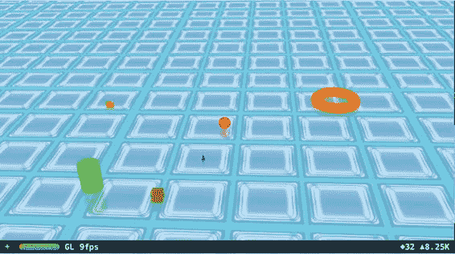

图 11-8. 几何体节点布局——可收集物品

目前它们还没什么用，看起来也不是很有趣。你可以自由调整它们的大小和位置，以便更好地理解这些变量如何改变物体。花些时间调整这些物体的位置，制作属于你自己的可收集物品布局。在示例代码中，我们将这些物体放置在一个大圆圈中。


*   `Pyramid`（金字塔）位置：`let position = SCNVector3Make(0, 0, 200)`
*   `Sphere`（球体）位置：`let position = SCNVector3Make(0, 6, -200)`
*   `Box`（立方体）位置：`let position = SCNVector3Make(200, 3.0, 0)`
*   `Tube`（管道）位置：`let position = SCNVector3Make(-200, 1.5, 0)`
*   `Cylinder`（圆柱体）位置：`let position = SCNVector3Make(300, 8, 300)`
*   `Toru`（环面）位置：`let position = SCNVector3Make(-300, 0, 300)`

### 总结

在本章中，你进一步了解了 SceneKit 如何利用久经考验的场景图来渲染对象。你还深入了解了 SceneKit 库中提供的原始对象。随着你在本书中的不断深入学习，你将扩展这些原始对象，创建出一个简单但有趣的游戏。在第 12 章中，你将学习如何操纵摄像机，从而控制用户的视角。另一个需要重点研究的方面是，光照和材质如何彻底改变游戏的外观和感觉。© James Goodwill 和 Wesley Matlock 2017 James Goodwill 和 Wesley Matlock 《Beginning Swift Games Development for iOS》10.1007/978-1-4842-2310-9_12

