# 12. SceneKit 中的光照、摄像机和材质效果

James Goodwill (1) 和 Wesley Matlock (2) (1) 美国科罗拉多州海兰兹牧场 (2) 美国密苏里州堪萨斯城

在本章中，你将探索摄像机以及摄像机的不同视角。你还将学习场景光照的工作原理，以及 SceneKit 中可用的不同类型的光源。除了光照，你还将学习对象的材质在决定对象如何被照亮以及如何呈现给用户方面所起的重要作用。

### SceneKit 摄像机用法

摄像机对象用于从摄像机位置所在的视角将场景呈现给用户。你可以使用摄像机对象来设置和调整视野、近远可见距离以及摄像机的焦距。图 12-1 展示了视野的主要参数。这些变量如下：

*   `xFOV`：这是 x 轴可见的角度。
*   `yFOV`：这是 y 轴可见的角度。
*   `zNear`：此参数是摄像机与表面之间的最小距离。任何比此距离更靠近摄像机的对象都不会显示。
*   `zFar`：此参数是摄像机与表面之间的最大距离。任何超出此距离的对象都不会显示。

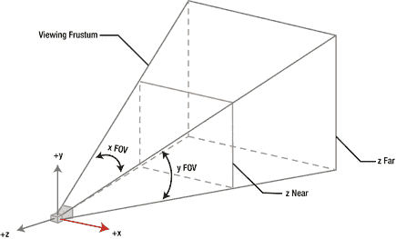 SceneKit 提供了两种不同类型的摄像机，你可以在游戏中使用。

*   **正交投影**：这种类型的摄像机将三维环境表示为二维。你暂时不会使用这种摄像机。
*   **透视投影**：这种类型的摄像机主要用于 3D 第一人称射击游戏，就像你正在编写的这种。

代码编写的下一步是找到 `createMainScene()` 方法。在此方法中，你将添加一个对 `createHeroCamera()` 的调用。你需要在 `mainScene` 变量初始化之后的任意位置添加此方法调用。此时你应该会遇到一个未解决的错误；现在你将创建缺少的 `createHeroCamera()` 方法，如代码清单 12-1 所示。

```swift
func createHeroCamera() {
    let cameraNode = mainScene.rootNode.childNode(withName: "mainCamera", recursively: true)
    cameraNode?.camera?.zFar = 500
    cameraNode?.position = SCNVector3(x: 50, y: 0, z: -20)
    cameraNode?.rotation = SCNVector4(x: 0, y: 0, z: 0, w: Float.pi/4 * 0.5)
    cameraNode?.eulerAngles = SCNVector3(x: -70, y: 0, z: 0) //Float(-M_PI_4*0.75))
    let heroNode = mainScene.rootNode.childNode(withName: "hero", recursively: true)
    heroNode?.addChildNode(cameraNode!)
    mainScene.rootNode.childNode(withName: "hero", recursively: true)?.addChildNode(cameraNode!)
}
```

**代码清单 12-1.** `createHeroCamera()` 方法 让我们详细看看这段代码：

*   首先将 `cameraNode` 初始化为一个场景节点（`SCNNode()`）。
*   初始化节点后，再为该节点初始化摄像机参数。
*   对于此摄像机，你需要设置 `zFar` 参数。`zFar` 参数是摄像机与可见表面之间的最大距离。
*   摄像机还需要一个位置；你将其位置设置为初始时略在太空人后方和上方。在后续的游戏开发中，你将调整此位置，使其跟随太空人移动。
*   现在你需要设置摄像机的旋转。目前摄像机是直指向前的；但是，由于你将摄像机放在了太空人的略上方，你需要将其稍微向下旋转。这正是设置 `SCNVector4` 中的 `w:` 参数所起的作用。

现在你已完成此方法，错误应该消失了。如果你现在运行游戏，你将看到摄像机被设置在太空人的上方和后方。


### 点亮场景

随便问一位导演或摄影师，他们都会告诉你，场景中最重要的元素之一就是照明。你很幸运，因为 SceneKit 提供了几种可操控的照明类型，能让你的场景脱颖而出。在 SceneKit 中，你将使用`SCNLight`对象在场景中创建光源。你需要将光源类型设置为 SceneKit 提供的四种不同光源类型之一。

*   `SCNLightTypeAmbient`：这种光会从所有方向照亮场景；光源的位置或方向对场景照明没有影响。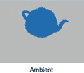
*   `SCNLightTypeOmni`：这种光会从某个点照亮场景。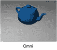
*   `SCNLightTypeDirectional`：这种光会从同一方向均匀地照亮场景中所有物体。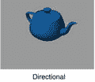
*   `SCNLightTypeSpot`：这种光会像摇滚明星一样照亮你的场景！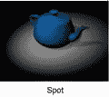

所以，这些就是你在游戏中能够使用的光源类型。请注意，物体的材质会影响其被照亮的方式。此外，你可以完全控制光的颜色。SceneKit 在利用照明更新场景时，确实遵循一些“规则”，以确保场景高效显示：

*   照明只影响场景中移动的物体。
*   SceneKit 每个节点最多只使用八个光源，因此创建超过这个数量是多余的。实际上，Apple 建议最多使用三个照明效果和一个环境光。

我们相信你已经准备好动手写代码了。对于你的主角，你将创建一个漂亮的环境光和一个聚光灯，这样他就永远不会身处黑暗。为了方便起见，现在你将在`GameViewController`中控制所有照明。如果你没有打开`GameViewController`，请打开它。你需要为聚光灯创建一个新的类变量。在类的顶部，继续创建你的新变量：`var spotLight: SCNNode!`。创建好这个变量后，你就可以创建`setupLighting()`方法，如代码清单 12-2 所示。

```
func setupLighting(scene:SCNScene) {
    let ambientLight = SCNNode()
    ambientLight.light = SCNLight()
    ambientLight.light!.type = SCNLight.LightType.ambient
    ambientLight.light!.color = UIColor.white
    scene.rootNode.addChildNode(ambientLight)

    let lightNode = SCNNode()
    lightNode.light = SCNLight()
    lightNode.light!.type = SCNLight.LightType.spot
    lightNode.light!.castsShadow = true
    lightNode.light!.color = UIColor(white: 0.8, alpha: 1.0)
    lightNode.position = SCNVector3Make(0, 80, 30)
    lightNode.rotation = SCNVector4Make(1, 0, 0, Float(-M_PI/2.8))
    lightNode.light!.spotInnerAngle = 0
    lightNode.light!.spotOuterAngle = 50
    lightNode.light!.shadowColor = UIColor.black
    lightNode.light!.zFar = 500
    lightNode.light!.zNear = 50
    scene.rootNode.addChildNode(lightNode)
}
```

代码清单 12-2. `setupLighting()` 方法

首先，你创建了`SCNLight`和`SCNNode`对象。如你所见，你将光源类型设置为该光对象。`SCNLightTypeAmbient`类型的光源无需设置方向、位置、衰减、聚光角度或阴影，因为环境光是为整个场景服务的。别忘了在`createMainScene()`方法中调用此方法，类似`setupLighting(mainScene)`这样的形式。

### 材质

现在让我们来看看 SceneKit 如何管理物体的视觉属性。SceneKit 使用`SCNMaterial`类来控制`SCNNode`几何体的照明和着色属性。SceneKit 提供了八种不同的属性供你设置这些属性：

*   **漫反射（Diffuse）**：漫反射着色是指向所有方向反射的光量和颜色。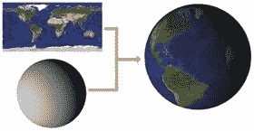
*   **环境光（Ambient）**：环境光以固定的强度和固定的颜色从表面的所有点反射。如果场景中没有环境光对象，该属性对节点没有影响。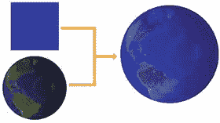
*   **高光（Specular）**：高光是直接反射给用户的光，类似于镜子反射光的方式。它是物体上看起来发亮的光斑。此属性默认是黑色，会使材质看起来暗淡无光。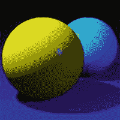
*   **法线（Normal）**：法线照明是一种在材质表面创建光照效果的技术。它基本上试图计算出材质的凹凸纹理，以提供更真实的光照效果。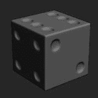
*   **反射（Reflective）**：反射照明是反射环境中的镜面表面。该表面实际上并不会反射场景中的其他物体。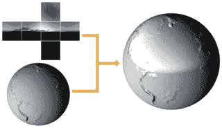
*   **自发光（Emission）**：自发光是表面发出的颜色。默认情况下，此属性设置为黑色，意味着没有光被反射。如果你提供一种颜色，该颜色就会被反射；如果你想更花哨一点，还可以提供一张图片。SceneKit 将根据材质使用这张图片来提供“发光”效果。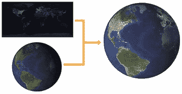
*   **透明（Transparent）**：透明是材质的不透明度。该属性主要用于使材质的部分区域不可见。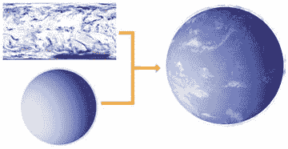
*   **倍增（Multiply）**：该属性在所有其他属性计算之后计算，为材质添加一种颜色。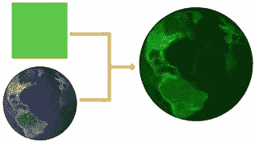

### 为障碍物应用材质


现在你已经对 `SCNMaterial` 的属性有了基本了解，让我们转到 `Collectible` 类，为你的可收集物添加一些材质。首先，将 `PyramidNode` 设置为漂亮的蓝色，如代码清单 12-3 所示。

```
pyramidNode.geometry?.firstMaterial?.diffuse.contents = UIColor.blue
pyramidNode.geometry?.firstMaterial?.shininess = 1.0
```

**代码清单 12-3.** PyramidNode 材质

在这个游戏中，你会保持简单，只使用一种材质。SceneKit 通过 `firstMaterial` 对象提供了便捷的访问方式。你将 `diffuse` 内容设置为蓝色。同时希望这个物体有光泽，因此提高 `shininess` 至 1。你可以尝试不同的颜色和光泽度，观察这些属性如何影响你的 `PyramidNode`。

接下来是你的 `SphereNode`。代码清单 12-4 演示了如何添加一些元素使其看起来更像个微缩地球。

```
sphereNode.geometry?.firstMaterial?.diffuse.contents = #imageLiteral(resourceName: "earthDiffuse")
sphereNode.geometry?.firstMaterial?.ambient.contents = #imageLiteral(resourceName: "earthAmbient")
sphereNode.geometry?.firstMaterial?.specular.contents = #imageLiteral(resourceName: "earthSpecular")
sphereNode.geometry?.firstMaterial?.normal.contents = #imageLiteral(resourceName: "earthNormal")
sphereNode.geometry?.firstMaterial?.diffuse.mipFilter = SCNFilterMode.linear
sphereNode.geometry?.firstMaterial?.shininess = 1.0
```

**代码清单 12-4.** GlobeNode 光照增强

通过 `GlobeNode`，你进一步扩展了 `NSMaterial` 的使用，创建了一个更逼真的地球。查看每个 JPG 文件，你会看到这些文件如何影响 SceneKit 和 `NSMaterial` 的输出。最新版本的 Xcode 允许你使用 JPG 文件的图像字面量。因此，输入此代码时，你无需包含 `#imageLiteral(resourceName: "earthSpecular")`。你只需开始输入图像文件的名称，例如 `earthSpecular`，Xcode 就会自动显示该图像。为 `diffuse` 属性添加 `mipFilter` 可以让 SceneKit 在以更小尺寸渲染纹理图像时提升性能。

现在，你将向 `BoxNode` 添加一些材质。SceneKit 允许你向 `materials` 属性应用一个数组，并将其应用到几何体上。对于 `BoxNode`，你将应用六种不同的材质，使其拥有六个不同的面，如代码清单 12-5 所示。

```
var materials = [SCNMaterial]()
let boxImage = "boxSide"
for index in 1...6 {
    let material = SCNMaterial()
    material.diffuse.contents = UIImage(named: boxImage + String(index))
    materials.append(material)
}
boxNode.geometry?.materials = materials
```

**代码清单 12-5.** BoxNode 材质

对于其他障碍物类型，添加颜色的方式与处理 `PyramidNode` 类似。代码清单 12-6 是其余障碍物的代码，如果你手头有可用的图片，可以自由使用不同的颜色和图像。

```
class func tubeNode() -> SCNNode {
    // 1 创建 SCNGeometry 类型
    let tube = SCNTube(innerRadius: 8, outerRadius: 10.0, height: 10.0)
    // 2 使用几何体类型创建节点
    let tubeNode = SCNNode(geometry: tube)
    tubeNode.name = "tube"
    // 3 设置节点位置
    let position  = SCNVector3(-200, 1.5, 0)
    tubeNode.position = position
    // 4 为节点添加颜色
    tubeNode.geometry?.firstMaterial?.diffuse.contents = UIColor.yellow
    tubeNode.geometry?.firstMaterial?.shininess = 1.0
    return tubeNode
}

class func cylinderNode() -> SCNNode {
    // 1 创建 SCNGeometry 类型
    let cylinder = SCNCylinder(radius: 6, height: 16)
    // 2 使用几何体类型创建节点
    let cylinderNode = SCNNode(geometry: cylinder)
    cylinderNode.name = "cylinder"
    // 3 设置节点位置
    let position = SCNVector3(300, 8, 300)
    cylinderNode.position = position
    // 4 为节点添加颜色
    cylinderNode.geometry?.firstMaterial?.diffuse.contents = UIColor.green
    cylinderNode.geometry?.firstMaterial?.shininess = 0.5
    return cylinderNode
}

class func torusNode() -> SCNNode {
    // 1 创建 SCNGeometry 类型
    let torus = SCNTorus(ringRadius: 14, pipeRadius: 4)
    // 2 使用几何体类型创建节点
    let torusNode = SCNNode(geometry: torus)
    // 3 设置节点位置
    let position =  SCNVector3(-300, 3, -300)
    torusNode.position = position
    // 4 为节点添加颜色
    torusNode.geometry?.firstMaterial?.diffuse.contents = UIColor.orange
    torusNode.geometry?.firstMaterial?.shininess = 1.0
    return torusNode
}
```

**代码清单 12-6.** 其余障碍物材质

### 总结

本章内容非常丰富。你学习了 SceneKit 提供的几种不同类型的照明。花些时间在代码库中进行实验，看看光照的细微变化如何影响游戏的可玩性。另一个学习体验是 SceneKit 如何使用材质让你的物体看起来更真实或更具未来感。在第 13 章中，你将研究 SceneKit 如何通过动画来移动物体。

© James Goodwill 和 Wesley Matlock 2017  
James Goodwill 和 Wesley Matlock，*Beginning Swift Games Development for iOS*  
10.1007/978-1-4842-2310-9_13

