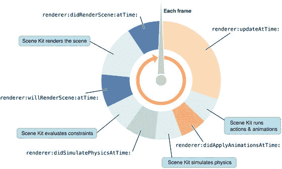

# 13. 渲染循环、物理与移动

James Goodwill¹ 和 Wesley Matlock²  
(1) 美国科罗拉多州海兰兹牧场  
(2) 美国密苏里州堪萨斯城

到目前为止，游戏中的英雄还未移动过，现在你需要让他站起来并四处移动。我们将保持简单：使用单指触摸向前移动，双指触摸向后移动。左右移动则使用加速计。但渲染循环中到底应该把移动英雄的代码放在哪里呢？请继续阅读。

### 什么是渲染循环？

渲染循环是 SceneKit 的游戏循环，游戏场景在此处变得生动。渲染循环针对游戏场景的每一帧执行一次，允许你执行游戏逻辑。渲染循环有九个阶段（见图 13-1），SceneKit 在其中执行特定操作。`SCNSceneRendererDelegate` 提供了五个代理方法，你可以通过编程方式自定义游戏场景：

1. `renderer(_:updateAtTime)` 是渲染循环中第一个被调用的代理方法。该代理适合设置循环内所需的任何逻辑。
2. 在循环的这一阶段，SceneKit 执行场景中节点的动作和动画。
3. `renderer(_:didApplyAnimationsAtTime:)`：动画运行后，视图会调用此代理方法。
4. SceneKit 的下一步是将物理效果应用于场景中的节点。
5. `renderer(_:didSimulatePhysicsAtTime:)`：应用物理效果后，你有机会检查场景的进展情况。我们将在此处检查移动并处理发生的任何碰撞。
6. 接着，SceneKit 评估视图和节点的约束。这些是你可以调整的项目，允许 SceneKit 自动调整视图中的节点。
7. `renderer(_:willRenderScene:atTime:)`：在 SceneKit 评估完约束并准备渲染场景时，你有最后一次机会通过代理方法进行调整。
8. 视图基于场景图进行渲染。
9. `renderer(_:willRenderScene:atTime:)`：这是在循环重新开始之前调用的最后一个代理方法。

  
**图 13-1.** SceneKit 渲染循环


### `GameView`：移动英雄

首先，重写 `GameViewController` 的 `touchesBegan` 和 `touchesEnded` 方法。在代码清单 13-1 中，你会看到正在重写 `touchesBegan` 方法和 `touchesEnded` 方法。

```
override func touchesBegan(_ touches: Set<UITouch>, with event: UIEvent?) {
    let taps = event?.allTouches
    touchCount = taps?.count
}
override func touchesEnded(_ touches: Set<UITouch>, with event: UIEvent?) {
    touchCount = 0
}
```

代码清单 13-1 `GameViewController.swift`

这里你重写了基类函数 `touchesBegan`。你将捕获发生的触摸并将其赋值给类变量 `touchCount`。当用户松开触摸后，必须将计数设为零——否则，你可怜的英雄会一直奔跑。现在，去修复 `touchCount` 上的那个错误。在类的顶部添加变量：`var touchCount: Int?`。你将使用 `GameViewController` 中的 `render` 方法来读取 `touchCount` 变量，以便根据在渲染循环的一个渲染周期内发生的触摸次数，将英雄移向某个方向。

既然你已经有了捕获触摸的代码，就需要把它放在一个可以从场景中获取更新的地方。为此，你将使用 `SCNSceneRendererDelegate`，并将游戏逻辑放入 `renderer.didSimulatePhysicsAtTime` 中。在图 13-1 中，你可以看到这是在场景绘制前允许你基于逐帧对场景进行调整的最后几次机会之一。为了接收这些委托通知，你需要将 `SCNSceneRendererDelegate` 添加到你的类声明中：

```
class GameViewController: UIViewController, SCNSceneRendererDelegate {
```

既然你已拥有委托，就需要将其分配到一个能处理这些函数的对象上。在这里，你将使用 `GameViewController` 自身作为委托。在 `viewDidLoad()` 函数中声明 `sceneView` 之后，添加以下代码行：

```
sceneView.delegate = self
```

### 编写回调委托函数

现在你将创建委托函数，以便从 SceneKit 框架中获取每一帧的回调。代码清单 13-2 展示了获取此回调所需的代码，然后你将从 `GameView` 中获取 `touchCount`，以便将英雄移向一个方向。

```
func renderer(aRenderer: SCNSceneRenderer, didSimulatePhysicsAtTime time: TimeInterval) {
    let moveDistance = Float(10.0)
    let moveSpeed = TimeInterval(1.0)
    let heroNode = mainScene.rootNode.childNode(withName: "hero", recursively: true)
    let currentX =  heroNode?.position.x
    let currentY =  heroNode?.position.y
    let currentZ =  heroNode?.position.z
    if touchCount == 1 {
        let action = SCNAction.move(to: SCNVector3(currentX!, currentY!, currentZ! - moveDistance), duration: moveSpeed);
        heroNode?.runAction(action)
    }
    else if touchCount == 2 {
        let action = SCNAction.move(to: SCNVector3(currentX!, currentY!, currentZ! + moveDistance), duration: moveSpeed)
        heroNode?.runAction(action)
    }
    else if touchCount == 4 {
        let action = SCNAction.move(to: SCNVector3(0, 0, 0), duration: moveSpeed)
        heroNode?.runAction(action)
    }
    positionCameraWithSpaceman()
}
```

代码清单 13-2 渲染委托方法

代码量很大，但在这个函数中你做了几件事。你还会看到一个关于缺失方法 `positionCameraWithSpaceman` 的错误——现在不必担心，因为你很快就会添加这个方法：

* 代码的第一部分创建了几个便捷变量，用来保存你的宇航员的当前位置，以及几个用来控制宇航员在一个渲染周期内移动速度和距离的变量。
* 根据触摸次数，你让他向前或向后移动 `moveDistance` 值。你可以随意添加一些供用户发现的“彩蛋”，比如那个 11 指触摸手势。

### 移动摄像机

既然你的宇航员已经开始移动，你需要让摄像机跟随他以使其保持在画面中。你将创建缺失的方法 `positionCameraWithSpaceman`，如代码清单 13-3 所示。

```
func positionCameraWithSpaceman() {
    let heroNode =  mainScene.rootNode.childNode(withName: "hero", recursively: true)?.presentation
    let spacemanPosition = heroNode?.position
    let cameraDamping:Float = 0.3
    let targetPosition =  SCNVector3((spacemanPosition?.x)!, 30.0, (spacemanPosition?.z)! + 20.0)
    let cameraNode =  mainScene.rootNode.childNode(withName: "mainCamera", recursively: true)
    var cameraPosition = cameraNode?.position
    let cameraXPos = cameraPosition!.x * (1.0 - cameraDamping) + targetPosition.x * cameraDamping
    let cameraYPos = cameraPosition!.y * (1.0 - cameraDamping) + targetPosition.y * cameraDamping
    let cameraZPos = cameraPosition!.z * (1.0 - cameraDamping) + targetPosition.z * cameraDamping
    cameraPosition = SCNVector3(x: cameraXPos, y: cameraYPos, z: cameraZPos)
    cameraNode?.position = cameraPosition!
}
```

代码清单 13-3 `positionCameraWithHero()`

* 你使用 `presentationNode()` 方法获取英雄节点，以便得到他的当前位置。
* 接着，通过一点数学计算和 `SCNVector3` 初始化器，你将摄像机定位在宇航员的上方和后方。
* 与此同时，你会给他打光，使他成为游戏中的明星。

现在是时候启动游戏并检查你的进展了。游戏启动后，注意当你触摸屏幕时，你的英雄会向前移动一定距离。接着，当你用两根手指触摸时，你的英雄会向后移动一定距离。这很棒，但现在你需要让你的英雄也能左右移动。为此，你将使用加速度计来捕捉设备的倾斜。由于本书面向 SceneKit 初学者，我们不会深入讲解 CoreMotion 框架的细节；不过，你将使用该框架来访问设备的加速度计。如果你想了解更多关于 CoreMotion 框架的信息，苹果文档（https://developer.apple.com/library/content/navigation/）是一个不错的起点。

### 介绍 CoreMotion 框架


下一步是导入`CoreMotion`框架到你的`GameViewController`类中，使用`import CoreMotion`。导入`CoreMotion`后，你可以创建另一个类级别的变量来存储`CoreMotion`管理器。这样做的原因是，一旦设置好`CoreMotion`管理器，你将创建一个在后台运行并检测加速度计运动的`NSOperationQueue`。在类声明之后，添加`var motionManager: CMMotionManager`。现在，你可以创建一个方法来设置加速度计并捕获其输入，如代码清单 13-4 所示。

```
func setupAccelerometer() {
    // 创建运动管理器以接收输入
    let motionManager = CMMotionManager()
    if motionManager.isAccelerometerAvailable {
        motionManager.accelerometerUpdateInterval = 1/60.0
        motionManager.startAccelerometerUpdates(to: OperationQueue()) {
            (data, error) in
            let heroNode = self.mainScene.rootNode.childNode(withName: "hero", recursively: true)?.presentation
            // 获取当前位置。
            let currentX = heroNode?.position.x
            let currentY = heroNode?.position.y
            let currentZ = heroNode?.position.z
            let threshold = 0.20
            // 向右移动
            if (data?.acceleration.y)! < -threshold {
                let destinationX = (Float((data?.acceleration.y)!) * 10.0 + Float(currentX!))
                let destinationY = Float(currentY!)
                let destinationZ = Float(currentZ!)
                let action = SCNAction.move(to: SCNVector3(destinationX, destinationY, destinationZ), duration: 1)
                heroNode?.runAction(action)
            }
            else if (data?.acceleration.y)! > threshold {
                let destinationX = (Float((data?.acceleration.y)!) * 10.0 + Float(currentX!))
                let destinationY = Float(currentY!)
                let destinationZ = Float(currentZ!)
                let action = SCNAction.move(to: SCNVector3(destinationX, destinationY, destinationZ), duration: 1)
                heroNode?.runAction(action)
            }
        }
    }
}
```

**代码清单 13-4.** `setupAccelerometer`函数

现在你已经创建了这个函数，可以更仔细地看看这里发生了什么。首先，你创建了一个`CMMotionManager`，这是进入`CoreMotion`框架的入口之一。然后，你检查设备是否有加速度计。如果不做这个检查就直接运行代码，一旦尝试使用管理器就会崩溃。此外，一些设备（如较老的 iPod）没有加速度计。记住，你的游戏和应用程序可以运行在几乎任何 iOS 设备上。

确认有加速度计后，你需要设置更新间隔。在某些游戏中，你可能希望间隔更慢或更快。对于这个游戏，你将每秒更新 60 次（即每 1/60 秒更新一次）。由于更新频率很高，你不想占用游戏的主循环，因此创建了一个更新队列。这个队列接收一个闭包，并在每次加速度计更新时调用此函数。

当函数被调用时，你创建了一些变量来存储英雄的当前位置。为了简化，你检查 y 轴是否发生了特定量的变化。负方向变化表示用户向右倾斜了设备，因此需要将英雄向右移动；正方向变化表示用户向左倾斜了设备。这里使用了`0.20`作为阈值，如果你想要更精细的调整，可以减小这个数值。利用这些信息，你为英雄创建了一个移动一定距离的动画。

剩下的唯一事情就是将`setupAccelerometer()`调用添加到`GameViewController`的`viewDidLoad()`方法中。完成所有这些后，又是一个运行游戏并查看成果的好时机。当英雄可以通过触摸设备移动时，向左或向右倾斜设备，你会看到英雄朝对应方向移动。你可以调整一些变量让他移动得更快或更慢。你应该返回并修改渲染函数中的`moveDistance`，看看这对移动有何影响。同时，调整`setupAccelerometer`函数中的`threshold`，观察设备响应如何变化。

### 总结

在本章中，你做了大量工作来让太空人移动起来。你还让太空人与物体发生碰撞，而不是穿过它们。在下一章中，你将研究碰撞协议来更新分数，并对可收集物品进行一些动画处理。© James Goodwill and Wesley Matlock 2017 James Goodwill and Wesley Matlock, *Beginning Swift Games Development for iOS*, 10.1007/978-1-4842-2310-9_14

