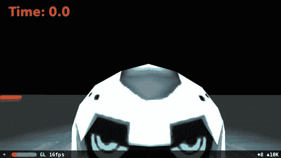
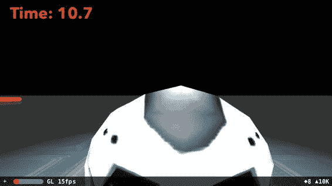
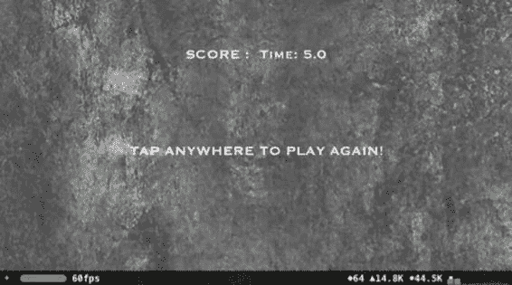

# 15. SceneKit 与 SpriteKit 的交互

James Goodwill¹ 与 Wesley Matlock² (1) 美国科罗拉多州海兰兹牧场 (2) 美国密苏里州堪萨斯城

在前面的章节中，你一直在 SceneKit 框架下工作；不过，苹果提供了一种方式，让你可以添加一个 2D 场景作为 3D 场景的叠加层。在本章中，你将添加一个 2D 场景，用于计时器，以便追踪你和你朋友找到并捕获敌人的耗时。

### SpriteKit 集成

SceneKit 提供了一个属性来添加 SpriteKit 场景：`var overlaySKScene: SKScene! { get set }`。此属性可以渲染一个 2D 场景，并将其覆盖在 SceneKit 场景之上。为了提供更好的性能，SceneKit 和 SpriteKit 使用相同的 OpenGL 上下文和资源来渲染场景。对于这个游戏，你将在场景顶部添加一个记分板。首先，创建一个新的 Swift 文件，并将其命名为 `GameOverlay.swift`。文件创建完成后，你需要导入 SceneKit 和 SpriteKit：

```
import SceneKit
import SpriteKit

class GameOverlay: SKScene { }
```

你的类应该类似于上面的代码片段。你的 `GameOverlay` 类是 `SKScene` 的子类，这看起来应该和前面章节类似。在这个类中，你将添加一个节点用于显示分数，另一个节点用于记录玩家的生命值。首先，你需要创建一个变量来保存 `SKLabelNode` 对象。因为你将使用 `Date` 的时间间隔，所以还需要创建一个 `NumberFormatter`：

```
var timerNode: SKLabelNode!
var scoreNode: SKLabelNode!
var timerFormat: NumberFormatter!
```

有了这些变量，你需要在使用它们之前进行初始化。列表 15-1 展示了重写后的 `init(size: CGSize)` 函数。

```
override init(size: CGSize) {
    super.init(size: size)
    anchorPoint = CGPoint(x: 0.5, y: 0.5)
    scaleMode = .resizeFill
    timerNode = SKLabelNode(fontNamed: "AvenirNext-Bold")
    timerNode.text = "Time: 0.0"
    timerNode.fontColor = .red
    timerNode.horizontalAlignmentMode = .left
    timerNode.verticalAlignmentMode = .bottom
    timerNode.position = CGPoint(x: -size.width/2 + 20, y: size.height/2 - 40)
    timerNode.name = "timer"
    addChild(timerNode)
    timerFormat = NumberFormatter()
    timerFormat.numberStyle = .decimal
    timerFormat.minimumFractionDigits = 1
    timerFormat.maximumFractionDigits = 1
}
```

*列表 15-1. GameView.init*

在这个初始化函数中，你做了一些事情，在继续之前需要停下来看看。第一部分是创建 `SKLabelNode`，它将用于显示计时器的计时。你可以根据需要更改字体和颜色，使其更符合你的需求；不过，红色配铜板字体（Copperplate）在这个游戏中看起来相当不错。在 `SKLabelNode` 设置之后是 `NumberFomatter` 设置部分。`NumberFomatter` 允许你将数字表示为 `String` 文本。你将设置一个小数位数，最多和最少都是一位。这样你就可以将计时器显示精确到十分之一秒。

别忘了，你还需要重写必需的初始化器，如列表 15-2 所示。

```
required init?(coder aDecoder: NSCoder) {
    fatalError("init(coder:) has not been implemented")
}
```

*列表 15-2. 必需初始化器*

当游戏开始时，你需要启动计时器，以便用户知道他们多快能到达敌人身边。为此，你将创建一个用于启动计时器的函数，它会为玩家更新你的 `SKLabelNode`。列表 15-3 展示了用于此目的的 `startTimer()`。

```
func startTimer() {
    let startTime = NSDate.timeIntervalSinceReferenceDate
    let timerNode = childNode(withName: "timer") as! SKLabelNode
    let timerAction = SKAction.run({ () -> Void in
        let now = NSDate.timeIntervalSinceReferenceDate
        let elapsedTime = TimeInterval( now - startTime )
        let tempString = String(format: "%@", self.timerFormat.string(from: NSNumber(value: elapsedTime))!)
        timerNode.text = "Time: " + tempString
    })
    let startDelay = SKAction.wait(forDuration: 0.5)
    let timerDelay = SKAction.sequence([timerAction, startDelay])
    let timer = SKAction.repeatForever(timerDelay)
    timerNode.run(timer, withKey: "timerAction")
}
```

*列表 15-3. GameOverlay.startTimer( )*

你需要添加到 `GameOverlay` 类的下一个函数是，当收集完所有可收集物品时停止计时器。如果你查看列表 15-4，会发现它相当简单。你将获取在 start 函数中命名为 `timer` 的节点，然后使用一个名为 `timerAction` 的新函数停止该动作。

```
func stopTimer() {
    let timerNode = childNode(withName: "timer") as! SKLabelNode
    timerNode.removeAction(forKey: "timerAction")
}
```

*列表 15-4. GameOverlay.stopTimer*

至此，你的 `GameOverlay` 类已经完成。现在你需要更新 `GameViewController` 以使用这个类，并将其放置在 3D SceneKit 场景之上。


### 将控制器连接到覆盖层

现在你已经完成了 `GameOverlay` 类，是时候将其连接到 `GameViewController` 了。首先，你需要创建一个类级变量来访问 `GameOverlay` 类。这样，你就能轻松调用其方法启动计时器。你还需要创建一个布尔值来追踪游戏的启动状态：

```
var gameOverlay: GameOverlay!
gameStarted = false
```

在 `GameViewController` 的 `viewDidLoad` 函数中，将这个 `GameOverlay` 添加到 `SCNScene` 中。这样做可以让 SceneKit 框架将你的 `GameOverlay` 叠加到当前场景上：

```
sceneView.overlaySKScene = GameOverlay(size: view.frame.size)
gameOverlay = sceneView.overlaySKScene as! GameOverlay
```

现在是运行游戏并查看覆盖层计时器出现在你一直在处理的场景顶部的好时机。运行游戏后，你将看到类似图 15-1 的场景。



**图 15-1.** 带有计时器的覆盖层场景

现在你有了覆盖层，需要在玩家开始移动太空人时启动计时器。因为你将使用 `sceneView` 中的 `touchCount` 来启动计时器，所以还需要确保玩家尚未启动游戏——否则，每次触摸都会重置计时器。在 `GameViewController` 类定义之后，你将添加另一个变量作为游戏开始时的标志，并将其初始化为 false：

```
var gameStarted = false
```

现在，当玩家开始游戏时，你将其设置为 true，然后在游戏结束时再设置回 false。为此，你需要在 `GameViewController` 的 `didSimulatePhysicsAtTime` 函数中添加一些逻辑：

```
func renderer(aRenderer: SCNSceneRenderer, didSimulatePhysicsAtTime time: TimeInterval) {
```

在这个函数中，你将在函数顶部添加清单 15-5。这段代码检查用户是否触摸了屏幕，如果是，则启动计时器并设置 `gameStarted` 标志。稍后你将在代码中使用这个标志。

```
if touchCount > 0 && !gameStarted {
    gameOverlay.startTimer()
    gameStarted = true
}
```

**清单 15-5.** 在 `didSimulatePhysicsAtTime` 协议中启动计时器

这次运行游戏时，你会注意到当你触摸设备时，计时器开始运行，如图 15-2 所示。



**图 15-2.** 计时器运行中

对于计时器，你最后需要做的是在收集完所有可收集物品时调用 `stopTimer()` 方法。最好的位置是在 `SCNPhysicsWorld` 的 `didBeginContact` 协议中。你将在 switch 语句之后检查分数是否超过一定数量——在本例中是 50 分：

```
if gameOverlay.score >= 50 {
    gameOverlay.stopTimer()
}
```

这次当你运行游戏并操控英雄收集物品时，当分数达到进入下一关所需分数时，计时器将停止，同时也会记录达到该分数所花费的时间。

### “游戏结束”画面

现在你有了一个可运行的游戏，但如果能有一个“游戏结束”画面来显示你的时间和分数，并能够重新开始游戏，那不是很好吗？你将创建另一个视图，当英雄达到分数时更新 `sceneView.overlaySKScene`。像之前一样创建一个名为 `GameOverView.swift` 的新 Swift 文件。`GameOverView` 看起来会似曾相识——清单 15-6 包含了你需要放入 `GameOverView` 类的代码。

```
import SpriteKit

class GameOverView: SKScene {
    required init?(coder aDecoder: NSCoder) {
        super.init(coder: aDecoder)
    }

    init(size: CGSize, score: String) {
        super.init(size: size)
        backgroundColor = .red

        let backgroundNode = SKSpriteNode(imageNamed: "GameOverBackground")
        backgroundNode.anchorPoint = CGPoint(x: 0.5, y: 0.0)
        backgroundNode.position = CGPoint(x: 160.0, y: 0.0)
        addChild(backgroundNode)

        let scoreTextNode = SKLabelNode(fontNamed: "Copperplate")
        scoreTextNode.text = "SCORE :  \(score)"
        scoreTextNode.horizontalAlignmentMode = .center
        scoreTextNode.verticalAlignmentMode = .center
        scoreTextNode.fontSize = 20
        scoreTextNode.fontColor = .white
        scoreTextNode.position = CGPoint(x: size.width / 2.0, y: size.height - 75.0)
        addChild(scoreTextNode)

        let tryAgainText = SKLabelNode(fontNamed: "Copperplate")
        tryAgainText.text = "TAP ANYWHERE TO PLAY AGAIN!"
        tryAgainText.horizontalAlignmentMode = .center
        tryAgainText.verticalAlignmentMode = .center
        tryAgainText.fontSize = 20
        tryAgainText.fontColor = .white
        tryAgainText.position = CGPoint(x: size.width / 2.0, y: size.height - 200)
        addChild(tryAgainText)
    }
}
```

**清单 15-6.** `GameOverView`

清单 15-7 显示了更新后的 `didBeginContact` 方法。玩家与可收集物品接触，分数随之更新。接下来，如果玩家达到了该关卡的分数，计时器将停止。如果发生这种情况，你将向用户显示“游戏结束”视图。

```
if gameOverlay.score >= 50 {
    gameOverlay.stopTimer()
    sceneView.overlaySKScene = GameOverView(size: view.bounds.size, score: String(gameOverlay.score))
}
```

**清单 15-7.** 分数检查与显示游戏结束场景

现在当你运行游戏并遇到敌人时，玩家将看到一个“游戏结束”视图及其所用时间。还有一件事需要处理，那就是将 `sceneView.overlaySKScene` 更新回原始的计时器画面。要重新开始游戏，只需触摸屏幕任意位置即可，如图 15-3 所示。



**图 15-3.** “游戏结束”画面

### 总结

现在你有了一个包含计时器的 SpriteKit 覆盖层场景，并且你在场景中随机放置了物体。你可以扩展这个覆盖层场景，并根据需要为游戏添加更多 SpriteKit 功能。现在你已经创建了一个使用 Apple SceneKit 库的简单游戏。你学习了什么是场景图，以及 SceneKit 如何利用这个图在设备 GPU 上显示 3D 对象。尝试在模拟器上运行这个游戏而不是在设备上运行，你会看到 GPU 对性能的提升有多大。

© James Goodwill and Wesley Matlock 2017  
James Goodwill and Wesley Matlock, *Beginning Swift Games Development for iOS*  
10.1007/978-1-4842-2310-9_16

