# 16. SceneKit 编辑器

James Goodwill¹ and Wesley Matlock²  
(1) 美国科罗拉多州海兰兹牧场  
(2) 美国密苏里州堪萨斯城

现在你已对 SceneKit 的工作原理有了基本了解，可以使用渲染循环来创建、控制和动画化 `SCNodes`。在之前的章节中，你一直使用代码来操作这些对象。在本章中，你将学习如何在 SceneKit 编辑器中完成同样的操作。

### SceneKit 场景

如果尚未从 Apress 网站下载源代码，本部分需要先完成下载。Xcode 项目包含本章所需的所有图形资源。请从 [www.apress.com/97814823093](http://www.apress.com/97814823093) 下载。打开 `Swiftystein3D` 项目（如果尚未打开）。首先要做的是从“添加新文件”的“资源”部分添加一个新的 SceneKit 文件。现在，右键单击项目以向项目中添加文件，如图 16-1 所示。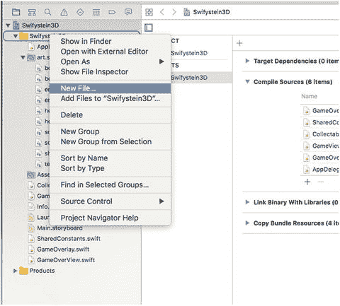 图 16-1. 添加新文件 选择“新文件”后，下一个屏幕将类似于图 16-2。您可能需要向下滚动才能看到“SceneKit 场景资源”。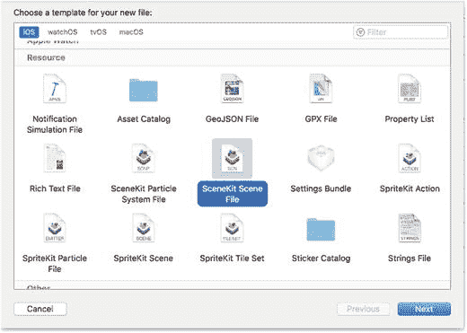 图 16-2. SceneKit 场景文件选择 选择“SceneKit 场景文件”后，您将得到这个 `Level1.scn` 文件。现在您有了一个空白的 `Level1` 场景，可以用它来创建一个类似之前通过编程方式创建的简单场景。图 16-3 显示了我们将要讲解的整个 SceneKit 编辑器。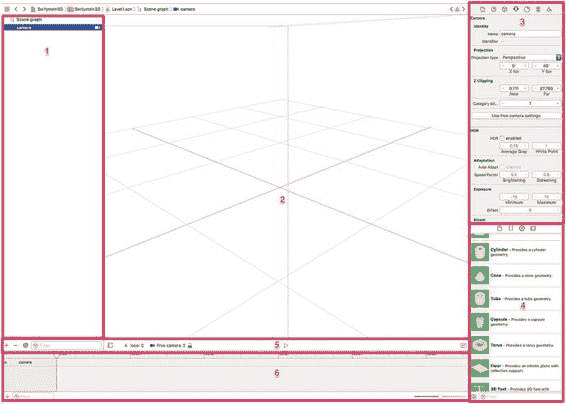 图 16-3. SceneKit 编辑器 以下是 SceneKit 编辑器的概述：

1.  场景图：此部分包含场景中的每个节点/元素。在此树中，您可以控制节点的子-父关系。
2.  设计区：您可以在此区域中将物体从对象库（4）拖放进来。您将看到所有节点的可视化表示，从而可以轻松移动物体并更改其属性。
3.  检查器/属性：当您在设计区中选择对象时，将有许多属性可供调整和控制。进行调整时，您可以立即直观地看到效果。
4.  对象库：此部分包含可以添加到场景中的所有对象。您只需拖放所需对象，然后在检查器/属性中进行调整。
5.  动作：此部分允许您向所选节点添加动作。

### 创建场景

要开始创建场景，首先需要删除最初添加新文件时默认添加的摄像机。在场景图部分，只需单击摄像机并将其删除即可。

#### 添加地板

首先从对象库中添加一个地板节点。找到地板并将其拖放到设计区。如您所知，地板节点会自动无限延伸。不过，现在地板只是一个透明对象，因此需要为其添加材质。在检查器部分，选择材质检查器。这将显示您可以调整节点材质的所有属性。我们关注的是“漫反射”属性。选择此属性，然后在选项中找到 `sceneFloor.png`。完成此步骤后，屏幕应如图 16-4 所示。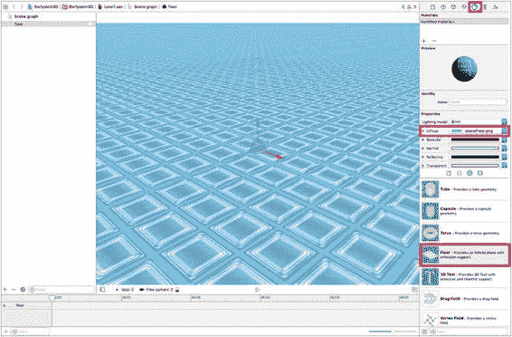 图 16-4. 地板节点场景

#### 添加英雄角色

在场景编辑器中，一个非常强大的功能是您可以简单地拖放其他场景（包括 DAE 文件）到当前关卡场景中。此功能允许您的图形设计师创建精美的对象，然后供您在游戏关卡中使用。在之前通过编程方式创建场景的章节中，我们已经使用过 `hero.dea`。这次，您需要将该文件拖放到编辑器的 `Level1` 设计区中。将新场景拖放到当前场景时，实际上是在创建对原始文件的引用。通过创建引用，如果您在多个场景（此处指关卡）中使用同一个对象，则只需更新原始文件，所有其他引用都会自动更新。例如，如果您决定更改英雄角色的纹理，只需在 `Hero.dea` 文件中进行修改，那么所有引用该文件的地方都会随之更新。图 16-5 显示了场景应有的样子。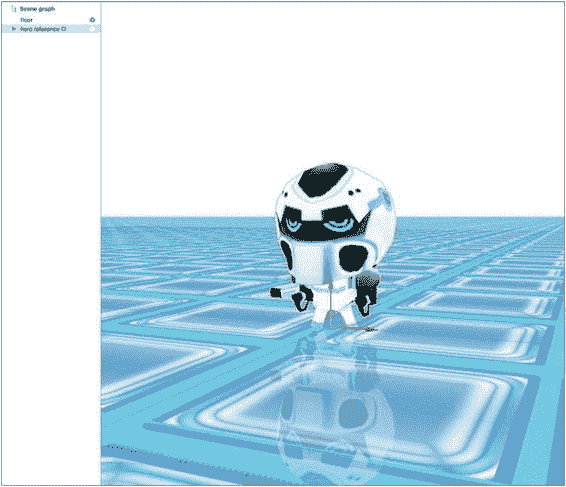 图 16-5. 放置到场景中的英雄节点 如果英雄节点的放置位置与图 16-5 不完全一致，无需担心。现在您已经有了几个节点，让我们来看看可以用来操作节点的检查器属性。请确保选中了英雄引用节点。图 16-6 显示了节点检查器，其中可调整的属性包括节点的位置、缩放和角度。如您所见，还有其他几个属性可供使用。为了简单起见，我们现在保持大部分默认设置。不过，请随意探索每个属性——这正是 SceneKit 编辑器的美妙之处。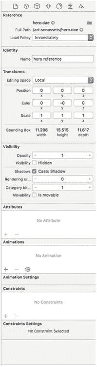 图 16-6. 节点检查器

#### 添加摄像机

现在英雄角色已就位，您需要添加一个摄像机，以便在游戏运行时能够跟随英雄角色移动。将摄像机节点从对象库拖放到场景图中。无需担心摄像机的放置位置——您将在节点检查器中进行调整，更改位置和欧拉角，使摄像机位于英雄角色的正上方和后方。图 16-7 显示了需要对摄像机进行的设置。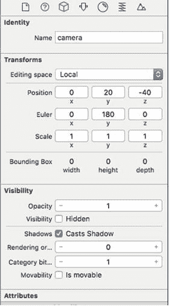 图 16-7. 摄像机节点检查器设置 接下来，我们将介绍图 16-8 所示的属性检查器，您可以看到 Apple 在 iOS 10 SceneKit 中引入的一些令人兴奋的新属性。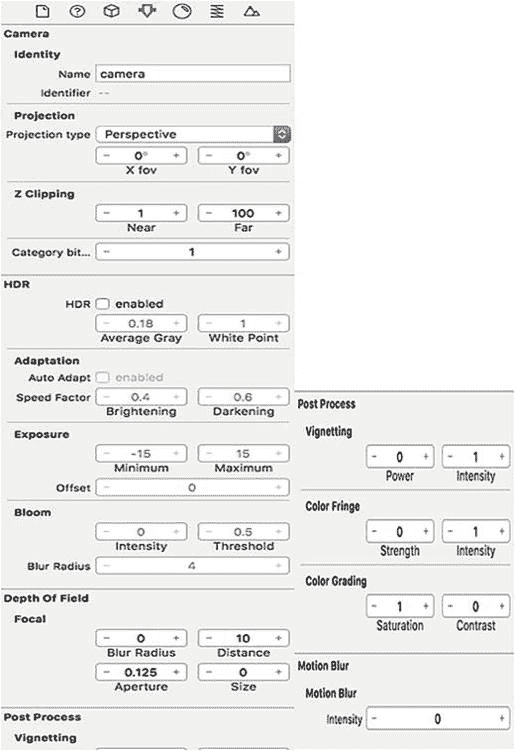 图 16-8. 摄像机属性检查器 我们将探讨的属性如下：

*   **HDR**：现在可以为场景启用高动态范围技术。这会产生更大的光照动态范围。“平均灰度”是用于光照曲线映射的中间色调值。“白点”是用于光照曲线映射的较高色调值。
*   **自适应**：这是一个有趣的效果，控制玩家眼睛在光照从亮变暗或从暗变亮时的适应方式。可以想象成场景从一个黑暗的地牢过渡到明亮的室外。
*   **曝光**：基本上是场景的明暗程度。
*   **辉光**：这是您在明亮区域周围看到的那种朦胧效果。
*   **景深**：这些项目已在之前章节中出现并介绍过。
*   **后处理**：iOS 10 中引入的更多新属性：
    *   **暗角**：允许您控制场景边缘的亮暗。
    *   **色差**：为场景中节点周围添加一些颜色混合效果。
    *   **色彩分级**：允许您增强渲染场景的整体色彩饱和度。
*   **运动模糊**：此属性为所有运动中的对象添加模糊效果。

摄像机设置完成后，图 16-9 显示了场景现在的样子。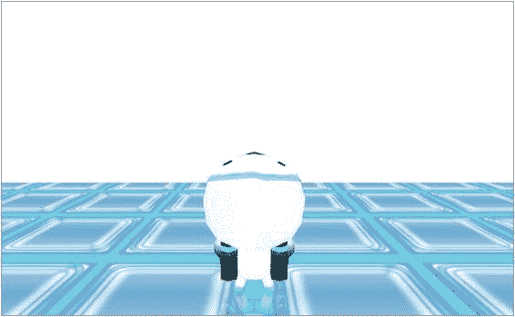 图 16-9. 当前带摄像机的场景

#### 添加节点

现在你可以开始添加可收集的节点，就像在前面章节中以编程方式所做的那样。在对象库中，只需拖放几种不同类型的节点。例如，拖出一个金字塔、球体、胶囊体以及任何你想要使用的其他类型。图 16-10 展示了拖出球体节点并在检查器中手动设置位置的过程。为了精细调整节点的位置，你将需要执行这个操作。

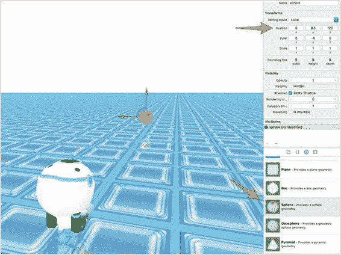
图 16-10. 球体节点放置

你还需要在属性检查器中对每个节点进行一些尺寸调整。图 16-11 显示了我们为球体设置的参数，但请记住，每个节点将根据所选节点类型拥有各自的属性设置。

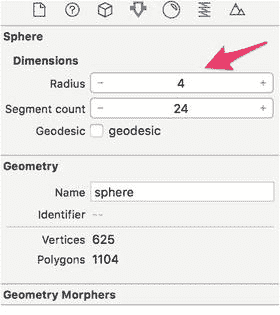
图 16-11. 球体属性检查器

现在是一个查看几个不同节点及其属性的好时机。你已经在屏幕周围放置了一些节点，效果应如图 16-12 所示。这里我们在屏幕周围设置了三个不同的节点。别忘了在节点检查器、材质检查器和属性检查器中进行调整。

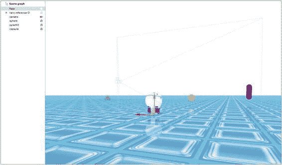
图 16-12. 多个节点

### 总结

## 第 1 章：SceneKit 编辑器简介

本章仅旨在让你初步领略 `SceneKit Editor` 的强大功能。你以往通过代码实现的大部分操作，现在基本都可以在编辑器内完成。由于本书仅为初学者入门而编写，我们将在此处告一段落。建议你继续尝试使用编辑器，观察细微的调整如何影响你的游戏。

