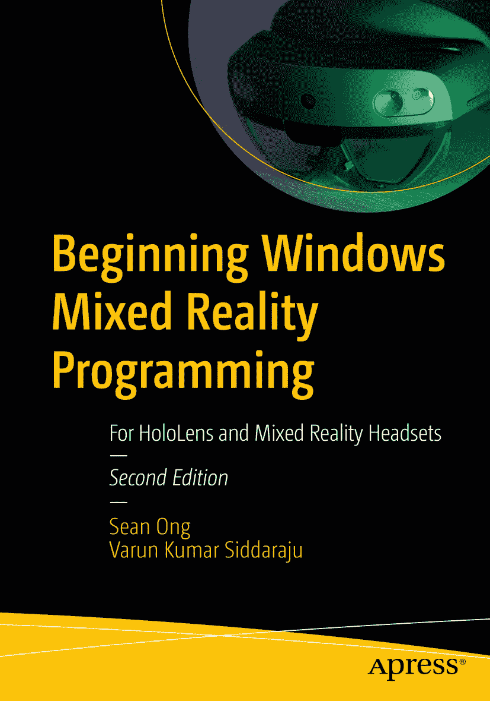

ISBN 978-1-4842-7103-2 电子版 ISBN 978-1-4842-7104-9 [`doi.org/10.1007/978-1-4842-7104-9`](https://doi.org/10.1007/978-1-4842-7104-9)  
© 肖恩·王（Sean Ong）与瓦伦·库马尔·西达拉朱（Varun Kumar Siddaraju）2021  
本作品受版权保护。出版商保留所有权利，涉及材料的整体或部分，特别是翻译、重印、重用插图、朗诵、广播、以微缩胶片或任何其他物理形式复制，以及传输或信息存储与检索、电子改编、计算机软件，或目前已知或今后开发的类似或不同的方法。本出版物中使用通用描述性名称、注册商标、商标、服务标志等，即使未作特别声明，也不意味着这些名称不受相关保护法律和法规的约束，因此可自由使用。出版商、作者和编辑假定本书中的建议和信息在出版之日是真实准确的。出版商、作者或编辑不对本文所含材料或可能存在的任何错误或遗漏提供明示或暗示的担保。出版商对已出版地图中的管辖权主张和机构隶属关系保持中立。

本 Apress 印记由注册公司 APress Media, LLC（施普林格自然旗下）出版。  
注册公司地址：1 New York Plaza, New York, NY 10004, U.S.A.

*谨以此书献给我的妻子 Neisha Ong。没有她不懈的支持、鼓励和参与，这段混合现实之旅将不可能实现。*  
*——肖恩*

