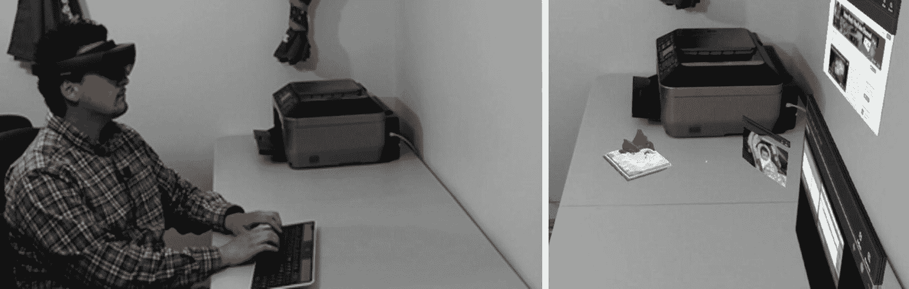

# 引言：混合现实的未来

恭喜你！如果你正在阅读本书，这意味着你正走在成为先驱的路上，肩负着构建将主导下一个计算时代的混合现实未来的重任。几十年来，科幻小说向我们承诺了一个充满全息影像和虚拟体验的未来。我们终于站在了一场技术革命的边缘，数字世界将与物理现实交织在一起。这被称为*混合现实*。

让我们设想一个没有屏幕的未来场景。取而代之的是，当你坐下来看电视时，墙上会出现一个全息屏幕。由于屏幕是虚拟的，你可以随心所欲地将其调整到任意大小。你也可以把屏幕移到任何其他房间，或者让它跟着你在房子里移动。你坐在一张空桌子前，几个全息电脑显示器就会出现，旁边还有虚拟照片、日历和记事本。现在，你可以查看电子邮件、处理电子表格，开始一天的工作了。你将不再需要随身携带实体智能手机。取而代之的是，需要的时候，手掌中会出现一个全息屏幕。全息计算有潜力取代每一块屏幕，并且没有理由相信它做不到这一点。

> **注意**  
> 本书中提到的全息影像是数字全息影像，不遵循传统全息术的光学原理。

这听起来像是还要好几年才能实现的科幻技术吗？你可能会惊讶地发现，我刚才在这个“未来”场景中提到的所有事情，现如今用`HoloLens 2`这样的设备完全可能实现（并且已经可用）。事实上，一些混合现实开发者已经使用一系列混合现实头戴式显示器沉浸在这项技术中好几年了。图 1 展示了我如何将`HoloLens`用作虚拟桌面。

**图 1**  
`HoloLens` 能将一张空桌子（左图）充满全息电脑显示器和桌面装饰物（右图）

在我之前的“未来场景”示例中，你可能会注意到我只给出了全息二维屏幕的例子。对某些人来说，我的例子可能听起来令人惊叹或具有革命性。事实上，这些都是平淡无奇的例子，并没有充分展现`HoloLens`和其他全息头戴式显示器所能达到的效果。想象一下，办公室同事的全息影像用于远程会议、为工厂工人提供高级培训模拟、在复杂三维模型上进行协作工程设计，以及利用基于云的人工智能的力量来分析你周围的世界，并用有用的信息来增强它。这些只是混合现实技术所能提供的一小部分可能性。

为这些头戴式设备构建体验所面临的挑战和机遇，与科技行业迄今为止所遇到的任何情况都不同。到目前为止，绝大多数软件体验都是为平面的二维屏幕设计的。想想电视机、智能手机、平板电脑、笔记本电脑——甚至是你正在阅读本书的平面页面或屏幕。视频游戏、3D 电影以及过去几年其他所谓的“3D”进步，不过是我们在扁平的矩形屏幕上观看的一种美化了的二维体验。Windows Mixed Reality 平台打破了这种现状，允许我们在现实世界中开发真正的三维应用。早期为`HoloLens`出现的应用，由于开发者“囿于思维定式”，创建的是二维体验，比如浮动的全息屏幕或用于导航的二维菜单和按钮。业内许多人认为，功能性且直观的三维用户体验仍有待发现和开发。当你跟随本书中的教程和示例项目进行学习时，我们将特别关注三维设计元素，同时讨论如何跳出思维定式、超越二维现状的方法。

现在成为混合现实开发者是一个激动人心的时刻。设备功能强大，计算范式新颖，优秀应用的想法似乎无穷无尽。我们，混合现实开发者，将是工程师、架构师和建设者，将构建即将到来的混合现实世界。

混合现实的未来是必然的。像所有高科技设备一样，`HoloLens`这类设备只会随着时间的推移变得更小、更强大。不难想象，在不久的将来，许多人（如果不是大多数人的话）无论是否需要处方眼镜，都会戴上一副混合现实眼镜。配备这些头戴式设备将使我们能够用相关信息增强物理现实，获得更沉浸的数字体验，并将我们从塞满桌面、墙壁、口袋和手提包的多余屏幕中解放出来。

全息设备在日常生活中的重要性将有多大？可以推测，在不久的将来，大多数人如果没有一副全息眼镜，可能就无法充分参与社会。乍听起来，这像是对我们未来的反乌托邦预测。但请思考一下我们今天如何使用计算机和智能手机。如果你没有电脑或不知道如何使用电脑，就很难充分参与当今的现代社会。美国绝大多数工作都要求使用电脑。我们将电子邮件和在线消息作为主要的沟通形式。当然，如果你在 50 年前告诉某人，如果他们没有电脑或不知道如何使用电脑，他们将无法充分参与未来的社会，他们可能会对未来犹豫不决。然而，如今我们中的许多人可能无法想象没有可信赖的个人电脑或智能手机的日常生活。同样，20 年后，我想我们会回首往事，想知道没有值得信赖的混合现实眼镜，我们过去是如何生活的。

或许我已经让你窥见了未来的模样。更重要的是，我希望已经激发你开始思考那些将充满我们周围世界的全息应用和体验。我们所有人都指望着像你这样的人来构建我们的全息未来。我写这本书的动机，是希望能让尽可能多的人开始迈入混合现实开发领域。本书力求通俗易懂，无论你是一位经验丰富的软件开发者，还是编程世界的新手，都能轻松上手。本书旨在为你提供一切入门所需，助你在`HoloLens 2`及其他混合现实头显上，开始开发令人惊叹的混合现实体验！

全书共分为三部分，涵盖 12 个章节。在第一部分（包含第 1 章和第 2 章）中，我们将引导你安装并解释开发 Windows 混合现实应用所需的所有必要软件和工具。

第 1 章包含了你入门所需的一切。你可以通过`HoloLens`以及在 PC 上通过模拟器，开始开发混合现实应用！

我们在第 1 章中将涵盖的内容包括：

-   确保你的 PC 已为混合现实开发做好准备
-   使用`HoloLens 2`和其他 Windows 混合现实硬件
-   下载并安装必需和可选的软件工具
-   理解`HoloLens 2`及其他 Windows 混合现实硬件

在第 2 章中，我们将深入探讨 Unity 的基础知识。Unity 是开发 Windows 混合现实体验的一个流行软件平台。我们在第 2 章中将涵盖的内容包括：

-   理解 Unity
-   在 Unity 中创建你的第一个应用
-   Unity 与 Windows 混合现实

在第二部分，我们将开始构建全息体验。第二部分包含第 3 章至第 9 章。你将在这里被引导学习创建一个功能完备的混合现实应用的基础知识。

我们将在第 3 章学习如何创建数字全息图。我们将引导你创建可在`HoloLens 2`中查看的基础全息图。

以下是我们在第 3 章中将涵盖的内容：

-   为 Windows 混合现实开发准备 Unity
-   在 Unity 中创建一个立方体
-   构建 Unity 应用并将其部署到`HoloLens 2`
-   查找并创建 3D 物体

我们在第 4 章中讨论混合现实工具包（`MRTK`）。手动为`HoloLens`开发准备 Unity 可能既繁琐又容易出错。本章介绍`MRTK`以及如何利用这个社区资源。第 4 章涵盖：

-   理解`MRTK`
-   下载并使用`MRTK`

在第 5 章中，我们开始与全息图进行交互。我们将讨论手势、语音命令、眼球追踪以及其他与全息内容交互的方式。以下是我们在第 5 章中将涵盖的内容：

-   语音命令
-   手势与手部追踪
-   控制器与输入配件
-   眼球追踪

到了第 6 章和第 7 章，事情开始变得有趣起来，我们将通过了解如何使用空间映射和空间音效，开始利用`HoloLens 2`的强大功能。我将引导你了解空间映射和空间音效在混合现实应用中的技术、概念和运用。

第 6 章涵盖：

-   什么是空间映射？
-   如何在项目中使用空间映射
-   将空间映射提升到新高度：场景理解

第 7 章涵盖：

-   什么是空间音效？它与“普通”音效有何不同？
-   如何在项目中使用空间音效
-   空间音效的最佳实践
-   其他音效资源

在第 8 章中，我们专注于 Azure 空间定位点（`ASA`）。Azure 空间定位点利用云服务，当与混合现实应用集成时，能形成完美的应用组合。它允许用户锚定对象的位置并保存。

第 8 章涵盖：

-   什么是 Azure 空间定位点？
-   如何在项目中包含 Azure 空间定位点
-   将场景连接到 Azure 资源
-   其他 Azure 空间定位点资源

在第 9 章中，我们讨论共享体验。共享体验是混合现实体验的典范。它们让人们能够在本地和远程聚集到一起，共同体验和与虚拟对象互动。第 9 章涵盖：

-   共享体验介绍
-   为共享体验设置 Photon
-   构建共享的混合现实应用
-   空间对齐与共享空间定位点
-   共享体验的进一步考量

第三部分是关于成长为一名全息开发者。通读到本书的这个阶段，你将熟悉创建混合现实应用的基础知识。接下来的三章（第 10 章至第 12 章）将介绍优化和增强你的体验、发布和盈利你的应用，以及加入更广泛的全息社区以获得支持和曝光度的方法。

在第 10 章中，我们将讨论打造令人惊叹体验的技巧和诀窍。本章为你提供了一些基本要素的入门知识，这些要素能为全息体验增添额外的风采和魔力，例如颜色选择、环境元素、音乐、大小等等。以下是我们在第 10 章中将涵盖的内容：

-   优化与性能
-   设计
-   魔力

让我们来赚点钱吧！在第 11 章中，我们将涵盖发布和盈利你的应用的细节。我们将为你介绍多种盈利策略，从在 Windows 商店发布你的应用，到成为一名独立的混合现实开发者进行自由职业。以下是我们在第 11 章中将涵盖的内容：

-   通过 Windows 商店盈利
-   自由职业
-   宏图大志：革命性机遇

在第 12 章，也是最后一章中，我们将讨论面向全息开发者的社区资源和其他信息。本章将介绍你可用的资源，包括相关的社区论坛和在线群组、值得关注的活动以及在开发过程中有所帮助的其他信息。以下是我们将涵盖的内容：

-   为什么社区资源很重要？
-   在线社区
-   HoloDevelopers Slack 频道
-   活动和本地群组
-   更多信息

当你踏上成为先驱型混合现实开发者的旅程时，我鼓励你记住两点。首先，始终要跳出思维定势，或者说跳出迄今为止主导计算的“2D 矩形”。其次，要明白你肩负着建设一个新产业以及未来混合现实世界的责任。你是一位技术先驱。理解这一点将激励你达到新的高度，并探索创造非凡体验的新途径！

**致谢**

我要感谢亚历山大·梅杰斯对本书的全面技术审阅。同时感谢杰西·麦卡洛克对独立混合现实开发者社区的无与伦比的支持，以及他建立的令人惊叹的 HoloLens 社区——我从中获得了大部分混合现实知识。特别感谢 VeeRuby Technologies 的朋友和宝贵团队成员，他们为本书第二版的更新做出了重大贡献。最后，我要感谢乔纳森·根尼克和吉尔·巴尔扎诺的友谊、坚持和编辑支持，使本书得以问世。

关于作者 关于技术审阅者

