# 1. 准备就绪：必要的硬件和软件工具

在本章中，你将了解混合现实开发所需的全部装备。我们将确保你的电脑已为开发做好准备，并介绍一些推荐的 PC 配置。我会简要讨论电脑硬件如何影响混合现实开发及性能。我们还将介绍在开发过程中用于测试应用的硬件和模拟器选项。此外，我们将概述 HoloLens 及其关键特性——这些是你开始开发应用前需要熟悉的重点。最后，我们将指导你安装进入混合现实体验世界所需的所有必要软件工具！

> **提示**
> 
> 开始开发时并不需要 HoloLens 或混合现实设备！你只需一台电脑和必要的软件即可开始。

## 确保电脑准备就绪

在开始之前，你需要确认拥有一台能够胜任混合现实开发的电脑。本节将概述推荐的系统要求，并提供相关背景说明。幸运的是，制作 HoloLens 应用并不需要高端电脑配置。不出意外，微软推荐 Windows 10 作为首选操作系统。其他操作系统（包括 Windows 8.1、Windows 8、Windows 7 等）也可使用。一些 HoloLens 开发者还报告称，在 Mac 设备上通过虚拟运行 Windows 系统同样可以成功开发。

以下是我推荐的混合现实开发系统规格：

* 64 位 Windows 10
* 8 GB 内存（使用模拟器的 PC 建议 16 GB）
* 30 GB 可用硬盘空间

这份简要清单旨在说明入门并不需要太多配置。从技术上讲，即使使用更低的系统规格也能运作，但开发体验会非常痛苦和缓慢，我对此表示不推荐。

如果你对获取合适的设备特别感兴趣，以下我对各规格类别及其对开发体验的影响进行了深入讨论：

* **内存**（RAM）是电脑快速存取数据的存储方式。如果你同时打开大量窗口、网站和应用程序，就需要更大的内存来提升多任务处理速度。我建议最低 6 GB 内存。为获得最佳体验，应配置 12 GB 至 16 GB 内存。这样你可以同时打开 20 多个浏览器标签、多个窗口、Unity、Visual Studio、音乐应用程序，并保持后台任务运行而不影响系统速度。

* **处理器**（CPU）负责所有计算工作。当处理器高负荷运行时，你会立即感受到慢速处理器与快速处理器的差异。这些关键场景包括：*编译*应用（即电脑将你编写的代码转换为 HoloLens 可安装和理解的格式）、在 Unity 中加载和处理复杂 3D 对象，以及其他涉及大量 Unity 场景对象的处理工作。我推荐 Intel Core i5 或 i7 处理器（或其他同速处理器）。

* **操作系统**（OS）通常是 Windows、Mac OS 或 Linux。如前所述，你可以在多种 Windows 版本下开发（甚至在 Mac 上运行 Windows），但混合现实开发的首选系统是 Windows 10。微软正通过"Windows 10 创意者更新"大力推广 Windows 平台上的 3D 应用。有线 Windows 混合现实头显也将依赖 Windows 10 工作。基于此，我认为购置 Windows 10 电脑进行混合现实开发是值得的。

* **图形处理器**（GPU）通常被误解且关注度低于上述其他组件。许多笔记本电脑和低中端 PC 没有独立显卡，而是依赖处理器内置的图形功能（即集成显卡）。在开发混合现实应用时，GPU 并非必需，但能提升编辑性能——尤其是使用 Unity 全息仿真功能时，处理复杂场景和纹理效果更为明显。需要说明的是，任何在集成桌面显卡上运行吃力的 Unity 应用，在 HoloLens 上表现可能更差，因为头显的图形处理能力有限。

## 理解 HoloLens 及其他 Windows 混合现实硬件

本节将介绍 HoloLens 工作原理的基础知识。虽然可以为 HoloLens 的技术奇迹及其背后的科学原理写一整本书，但这里我仅提供足够的信息，帮助我们为此类及其他混合现实头显设计最佳应用体验。

### 由内向外追踪与空间映射

`HoloLens`及其他 Windows 混合现实头戴设备与市面上其他流行头戴设备（截至撰写本文时）的关键区别在于其执行*由内向外追踪*的能力，即头戴设备无需外部传感器即可追踪自身环境的能力。由外向内追踪的头戴设备要求用户在房间或区域周围设置若干传感器，以便用户在移动时设备能知晓自身位置。而由内向外追踪则避免了设置外部传感器的繁琐，并且几乎能在所有环境中工作。一些你可能听说过的初级虚拟现实头戴设备（例如`Google Cardboard`、`Samsung Gear VR`）不具备位置追踪功能，只能“环顾四周”。图 1-1 展示了 HoloLens 摄像头的示意图，其中多颗摄像头用于由内向外的空间追踪。

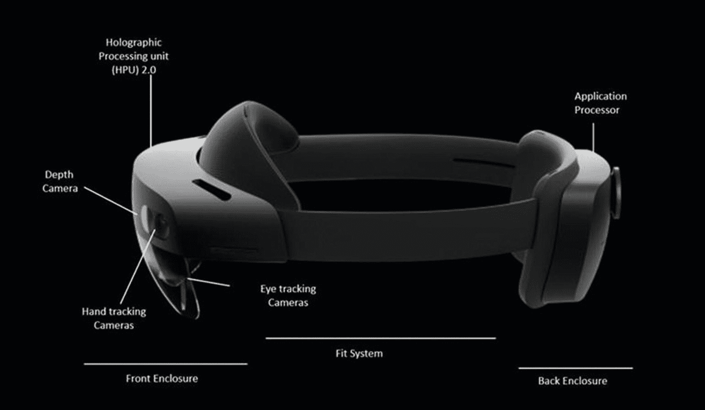

图 1-1: HoloLens 2 摄像头及其功能示意图

`HoloLens 2`头戴设备上共有八颗摄像头，其中五颗用于追踪其环境（四颗环境追踪摄像头，一颗深度摄像头），两颗眼球追踪摄像头，以及一颗用于录制视频或拍照的常规摄像头。`HoloLens`持续追踪其环境，并构建所处区域的 3D 模型。这被称为*空间映射*。图 1-2 展示了`HoloLens`如何使用由三角形构成的网格来重建用户周围环境的数字版本。空间映射的重要性体现在以下几个方面：

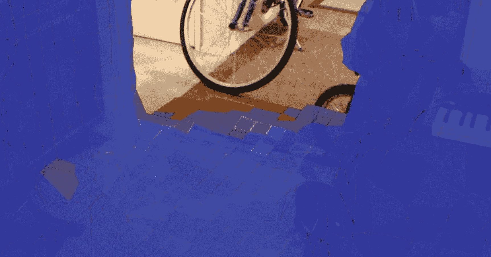

图 1-2: HoloLens 使用空间映射追踪其环境的示意图

- 它告诉`HoloLens`哪些全息图应当隐藏。例如，如果你将一个全息图放置在你的走廊里，然后走进另一个房间，那个房间墙壁的空间映射图会阻止你看到走廊里的全息图。`HoloLens`的这一特性被称为遮挡。这个简单的特性对全息图的感知自然度有着显著影响。如果没有空间映射图，你会看到全息图仿佛能穿透墙壁可见，从而造成不真实的体验。
- 它允许用户与空间映射图交互——例如，将物品固定到墙上，让角色坐在你的沙发上（如微软的“Fragments”应用所示！），或自动装饰你的周围环境。
- 它实现了*全息图持久化*，即全息图能够保留在用户放置它们的位置——即使在关闭设备后也是如此。你的`HoloLens`将（令人惊叹地）能够记住你的空间，并恢复你之前放置在该空间中的任何全息图。

### 空间音效

我们严重依赖耳朵来精确定位周围的物体。在混合现实的语境中，这被称为*空间音效*。`HoloLens`能够利用声波相位偏移技术向用户耳朵发送空间音效。这增强了沉浸感。即使看不到周围的物体（如果这些物体有意发出声音），用户仍然能够听到它们。这增强了用户对这些物体的感知，并使全息图感觉就像真实存在于用户所在区域一样。

### 透明式与沉浸式头戴设备

一些 Windows 混合现实设备，如`HoloLens`，使用透明显示屏，允许你看到放置在你真实世界中的全息图。其他设备，例如联想的 Windows 混合现实头戴设备，是遮蔽式的，意味着你无法看到周围环境。相反，这些头戴设备让你沉浸在一个虚拟世界中。沉浸式头戴设备仍然具备由内向外追踪功能，这有助于让用户在佩戴头戴设备时感知到墙壁或其他障碍物。一些沉浸式头戴设备也可能利用空间映射，允许用户看到其周围环境的虚拟呈现。图 1-3 展示了 Windows 混合现实头戴设备的几个示例。

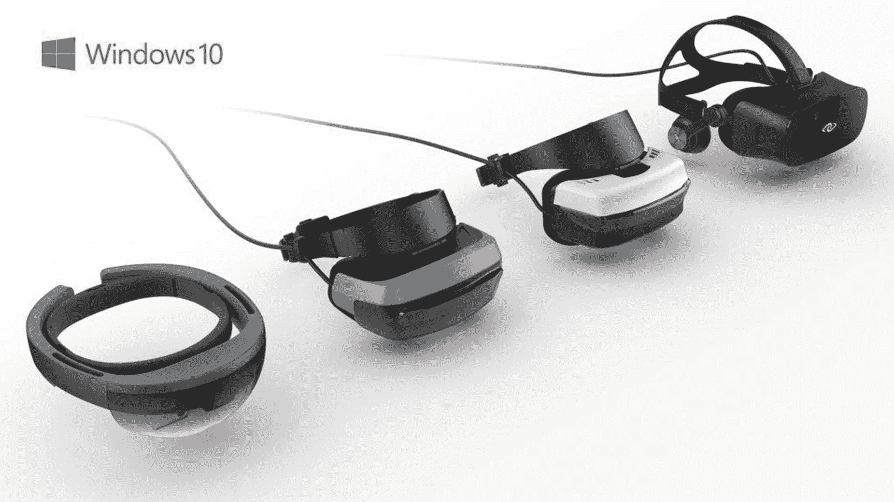

图 1-3: Windows 混合现实设备示例包括像 HoloLens 这样的透明头戴设备和遮蔽式头戴设备（来源：微软）

截至撰写本文时，所有现有设备都存在*视场角*（FOV）限制，这意味着你无法在你的全部周边视野中看到全息图。如图 1-4 所示，`HoloLens`的视场角限制导致全息图只能在一个有限的“窗口”内被看到。随着头戴设备显示技术的进步，我们可以预期分辨率会提高，视场角限制会随时间推移而减少。当今设备中的视场角限制意味着在设计应用时需要发挥创意，使其尽可能具有沉浸感。使用空间音效是增强用户对全息图感知的一个关键要素。其他的视觉线索（例如指向视场角外全息图的箭头）也是帮助用户的策略。我们将在第三部分更详细地讨论这些内容。

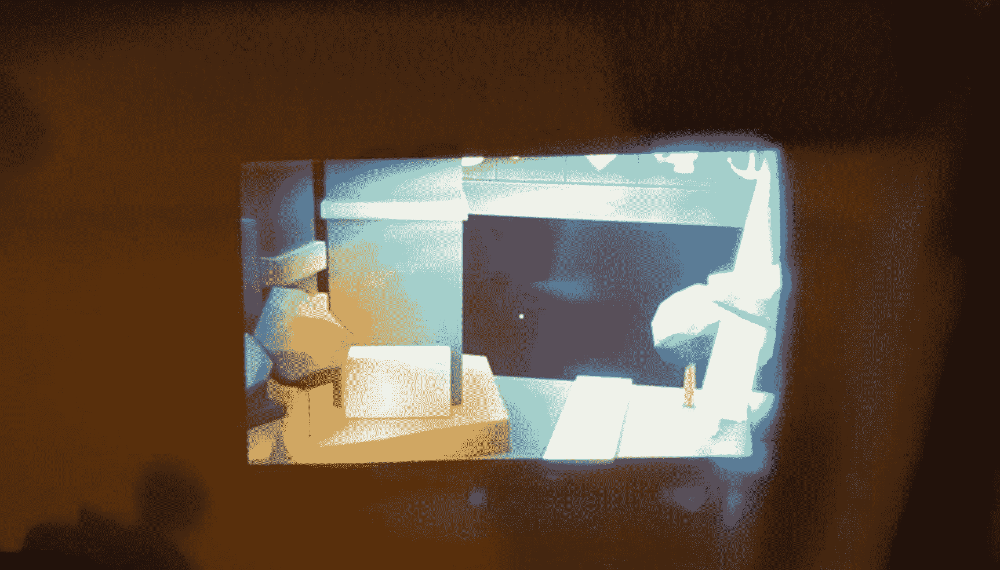

图 1-4: 从设备后方拍摄的 HoloLens 视场角限制示例

## 下载并安装所需的与可选的软件工具

在本节中，将指导你安装开发 Windows 混合现实应用所需的所有必要软件和工具。开始混合现实开发仅需要两个应用程序：`Unity`和`Visual Studio`。在本书中，我们将在混合现实开发的背景下定义和阐述所有内容。然而，这两个应用程序在软件和游戏行业中都已被广泛使用多年。以下是每个工具的简要说明：

- **Unity** 是开发 Windows 混合现实体验的首选软件平台。你所有的应用开发都在`Unity`内进行。正是在这里，你将编写程序让全息图执行各种操作。在混合现实世界之外，`Unity` 被广泛用于游戏开发。这是个极好的消息，因为这意味着有丰富的教程、资源和论坛讨论可供参考，能够帮助你解答在开发混合现实应用时可能遇到的几乎所有问题。
- **Visual Studio** 主要负责编辑你的应用程序代码，也用于将你的应用*部署*到混合现实头戴设备上进行测试和调试。部署简单来说就是将应用安装到你的头戴设备上。当你的应用完成时，你也可以使用`Visual Studio`将应用部署到 Windows 商店。截至撰写本文时，你还不能直接从`Unity`将应用部署到你的`HoloLens`（但如前所述，你可以将应用流式传输到你的`HoloLens`）。不过，`Unity` 可能很快会允许用户直接部署到`HoloLens`，而无需经过`Visual Studio`。

> **注意：** 本书中展示的工具会定期更新，屏幕截图可能与你当前使用的应用程序版本不完全一致。在你按照后续说明操作时请牢记这一点。本书中使用的版本如下：`Unity Hub`版本 2.4.2 和`Visual Studio 2019`版本 16.8。

除了安装`Unity`和`Visual Studio`，你还需要下载混合现实工具包。混合现实工具包不是一个应用程序，而是一组有用的混合现实脚本和功能，可以导入到`Unity`中。请放心，我会用整整一章来介绍混合现实工具包及其所提供的全部功能！

### 安装 Visual Studio

在本节中，我们将逐步讲解如何下载和设置用于混合现实开发的 Visual Studio。在撰写本文时，混合现实开发所需的版本是 Visual Studio 2019；版本会定期更新，但不同版本的安装过程将非常相似。

要查看用于混合现实开发的最新版 Visual Studio，请使用微软的安装清单，位于：

[`https://developer.microsoft.com/en-us/windows/Mixed-Reality/install_the_tools`](https://developer.microsoft.com/en-us/windows/Mixed-Reality/install_the_tools)

您将看到一个类似于图 1-5 所示的表格。

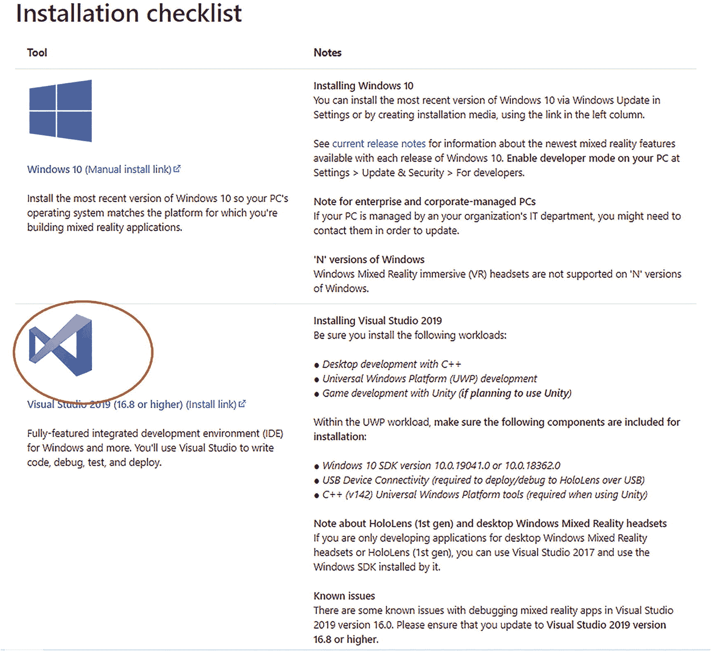

图 1-5

请务必查看微软的安装清单以获取最新的工具版本。要下载 Visual Studio，请点击相应的标题（红色圆圈处）。

您也可以通过以下链接下载 Visual Studio：

[`https://developer.microsoft.com/en-us/windows/downloads`](https://developer.microsoft.com/en-us/windows/downloads)

如果您还没有 Visual Studio 订阅，可以下载免费版本的 Visual Studio，也称为“Visual Studio Community”。图 1-6 展示了下载按钮可能的外观。

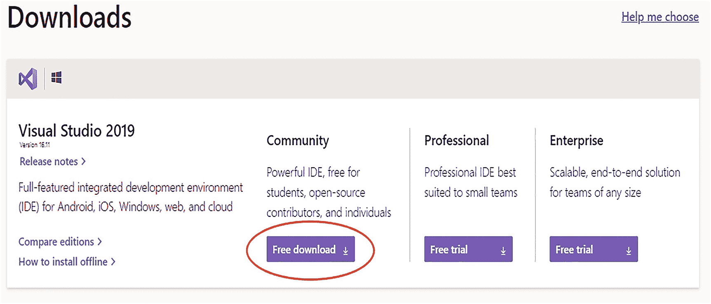

图 1-6

点击 Visual Studio Community 的“免费下载”按钮，开始下载。

将 Visual Studio 安装程序保存到您选择的位置。下载完成后，您可以运行 Visual Studio 安装程序来开始安装过程。图 1-7 展示了在 Microsoft Edge 浏览器中运行安装程序时的界面。

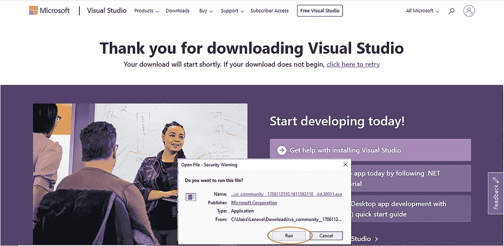

图 1-7

在您的 PC 上运行 Visual Studio 安装程序。

启动 Visual Studio 安装程序后，您会看到几秒钟的初始化过程，然后出现选择功能的选项，如图 1-8 所示。

在`Visual Studio 2019`的功能列表中，请务必勾选“通用 Windows 平台开发”复选框。同时勾选“使用 Unity 的游戏开发”复选框。您可以在右侧面板中取消勾选“Unity 编辑器”复选框，因为您将在本章后面安装最新版本的 Unity。在做出适当选择后，点击“下一步”或“安装”。

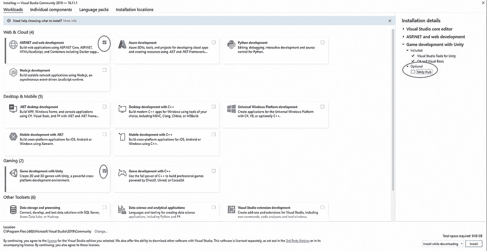

图 1-8

对于`Visual Studio 2019`，请确保您选择了“通用 Windows 平台开发”和“使用 Unity 的游戏开发”。

点击“安装”后，Visual Studio 将开始下载并安装您选择的功能。Visual Studio 是一个非常庞大的应用程序，根据您的网络连接情况，下载和安装可能需要几个小时。请为安装过程预留一些时间！安装完成后，系统可能会提示您重启 PC。重启后，您可以通过打开 Visual Studio 来验证安装是否成功完成。当您首次打开 Visual Studio 时，根据您的 Visual Studio 版本，它应该类似于图 1-9 所示的欢迎页面。

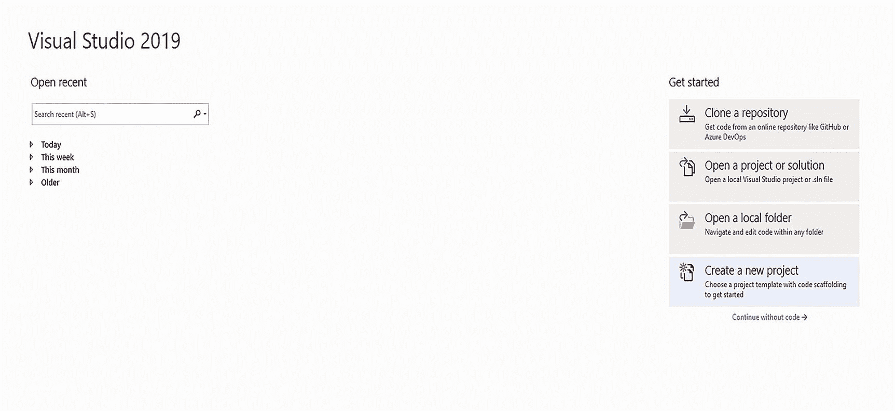

图 1-9

您可以选择在安装完成后启动 Visual Studio，以验证其是否正确安装。

恭喜！您已成功安装 Visual Studio。目前您无需对 Visual Studio 进行任何操作。稍后，当我们通过 Visual Studio 将应用程序部署到 HoloLens 时，我们将经历一个初始配对过程。如果您尚未登录，可能需要使用您的 Microsoft 帐户登录 Visual Studio。Visual Studio 还可能为您的帐户应用使用 Visual Studio 的“许可证”。Visual Studio 上的所有许可证都是基于用户的。获得许可的用户可以在任意数量的设备上访问其帐户进行设计和开发。可以在 Visual Studio 中访问多个用户帐户，从而进一步提高其灵活性。接下来，我们将安装 Unity。

### 安装 Unity

在本节中，我们将逐步介绍如何下载和设置用于混合现实开发的 `Unity`。截至撰写本文时，混合现实开发所需的版本为 `Unity 2019`。版本会定期更新，但不同版本的安装过程将非常相似。

要查看用于混合现实开发的最新 `Unity` 版本，请使用微软的安装清单，地址位于：
[*https://developer.microsoft.com/zh-cn/windows/Mixed-Reality/install_the_tools*](https://developer.microsoft.com/zh-cn/windows/holographic/install_the_tools)

您也可以从以下链接下载 `Unity`：
[*https://store.unity.com/download*](https://store.unity.com/download)

进入 `Unity` 的下载页面后，您会看到一个与图 1-10 类似的下载按钮。下载完成后，运行 `Unity Hub` 安装程序并将其安装到您的电脑上（图 1-11）。

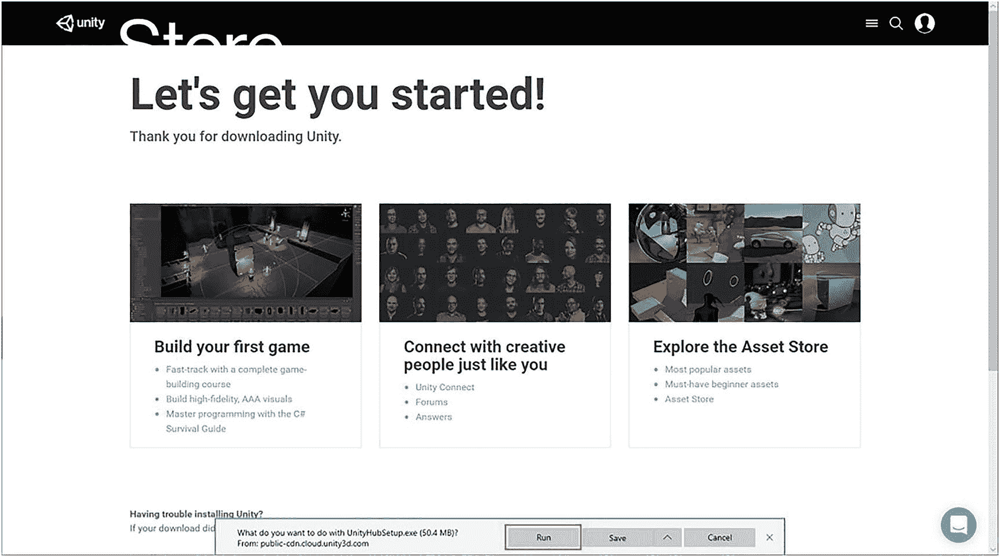
图 1-11

下载完成后，运行 `Unity` 安装程序

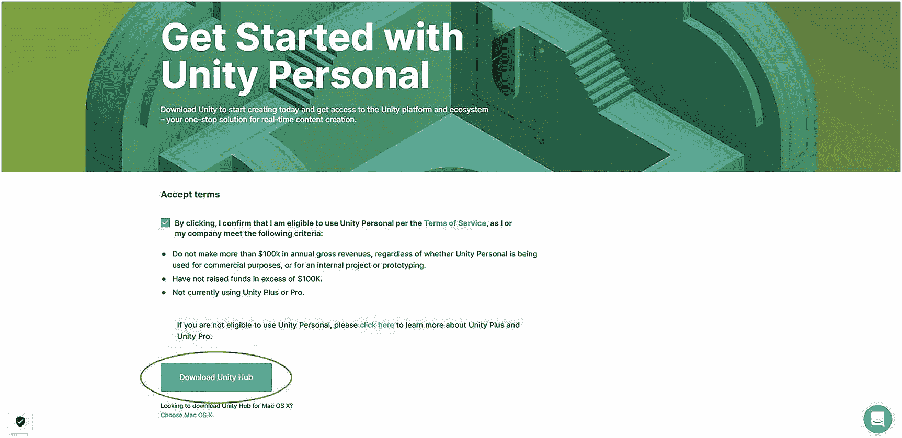
图 1-10

从 `Unity` 官网下载最新版本的 `Unity Hub`

启动 `Unity Hub` 安装程序后，您将看到如图 1-12 所示的下载助手界面。点击“同意”开始安装过程。

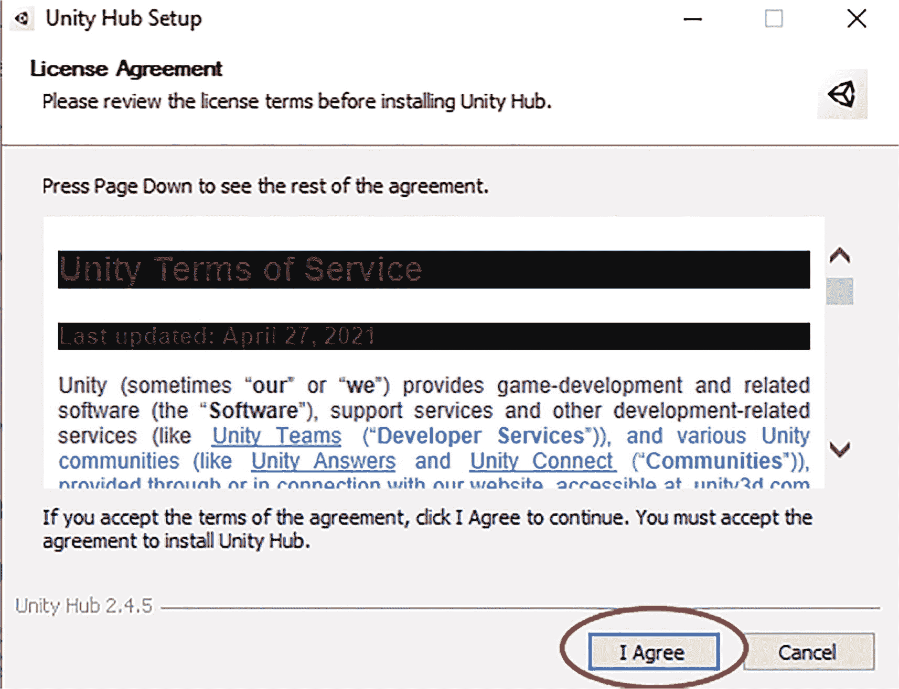
图 1-12

接受许可协议

接受协议后，请选择您希望安装 `Unity Hub` 的首选位置。默认情况下，程序文件将被选为目标文件夹。

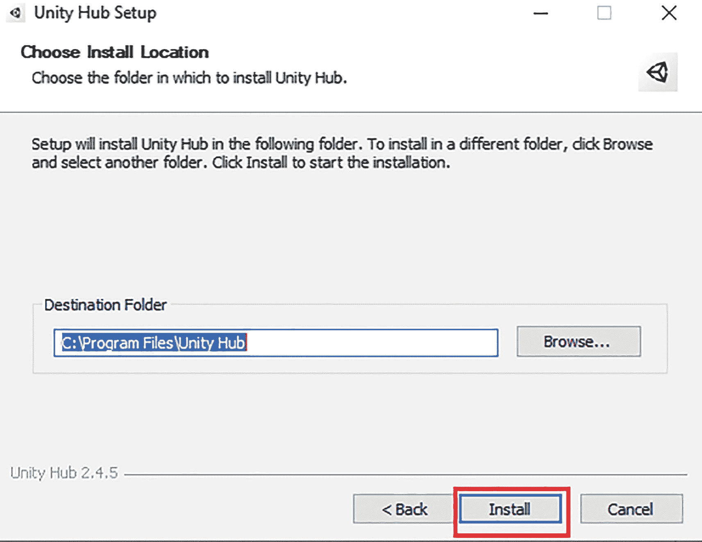
图 1-13

在目标文件夹中安装 `Unity Hub`

在目标文件夹成功安装 `Unity Hub` 后，在“完成 Unity Hub 设置”菜单中点击 `完成` 以结束安装。

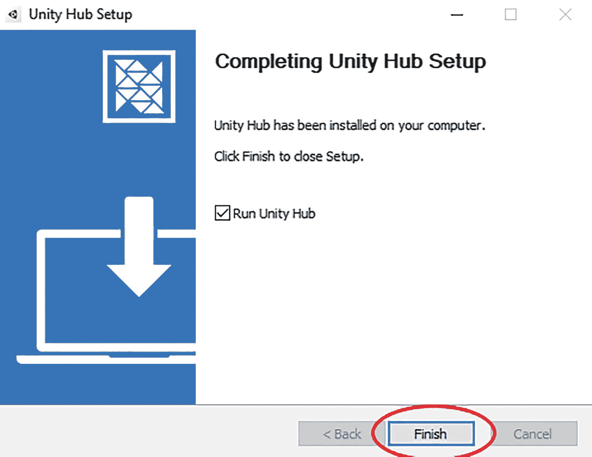
图 1-14

完成安装

打开 `Unity Hub` 软件，系统会要求您登录现有的 `Unity` 账号或创建一个新账号。如果您已有 `Unity` 账号，请登录；否则，请创建一个新的 `Unity` 账号。

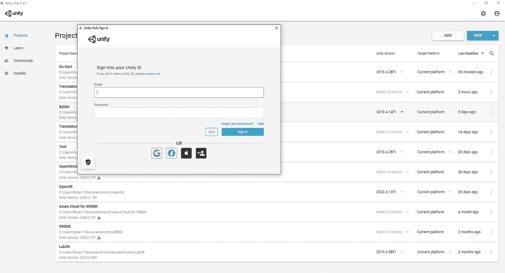
图 1-15

登录您现有的 `Unity` 账号，如果没有账号则创建一个新账号

当您选择创建新的 `Unity` 账号时，将打开一个新的网页要求您输入账户详细信息。填写所有详细信息，并创建您的 `Unity` 账号。在选择个人使用 `Unity` 时，我们会获得一份免费许可证。`Unity Personal` 是初学者上手的绝佳选择。它集成了所有关键的游戏功能、引擎功能、持续更新、测试版发布以及所有发布平台。

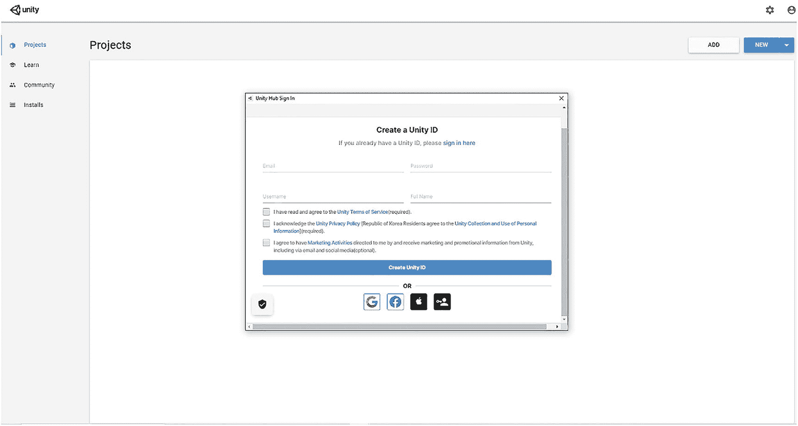
图 1-16

`Unity` 将打开一个网页，您可以在其中注册新的 `Unity` 账号

创建新账号或使用现有账号登录后，转到 `Unity Hub` 中的`安装`部分，然后选择“添加”。将弹出一个包含各种 `Unity` 版本的新菜单。请选择最新版本，然后点击 `下一步` 开始 `Unity` 安装过程。

> **注意**  
> 您也可以访问 `Unity` 下载存档以下载特定版本的 `Unity`。点击下载选项后，您将被重定向到 `Unity Hub` 以进行后续步骤。本书全程使用 `Unity 2019.4.16`。

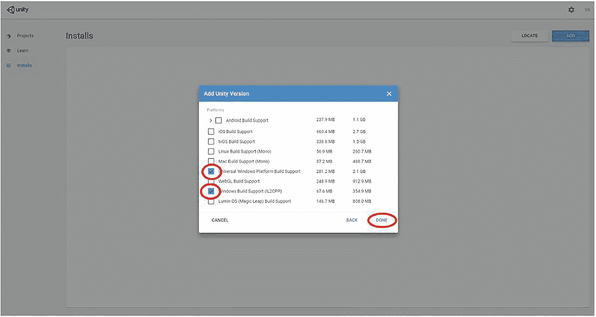
图 1-18

`Unity` 组件的下载和安装可能需要很长时间

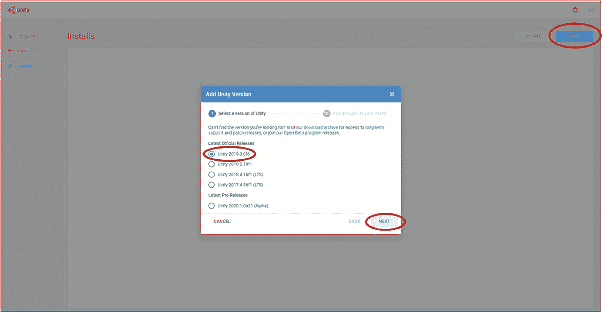
图 1-17

请务必选择此图中所示的必要组件。点击“下一步”继续

如图 1-18 所示，`Unity` 将开始下载并安装所选组件。根据您的互联网连接速度，这可能需要数小时。请做好长时间等待的准备。安装完成后，点击“完成”按钮。

恭喜！您现在已经成功在电脑上安装了 `Unity`。您可以通过打开 `Unity Hub` 来访问新安装的 `Unity` 并创建新项目。如何创建新的 `Unity` 项目将在下一课中讨论。

### 下载混合现实工具包

在本节中，我将引导你下载混合现实工具包，它并非一个独立程序，而是一组可导入 Unity 的实用脚本和功能集合。要下载混合现实工具包的 Unity 资源包，请访问以下网址：

[*https://github.com/microsoft/MixedRealityToolkit-Unity/releases/*](https://github.com/microsoft/MixedRealityToolkit-Unity/releases/)

请确保下载混合现实工具包的最新版本，通常位于页面顶部附近。本书使用的混合现实工具包版本为 2.5.3。请注意，你下载的混合现实工具包版本必须与你下载的 Unity 版本兼容。通常，兼容性会在混合现实工具包版本的标题中注明，如图 1-19 所示。要下载混合现实工具包 Unity 资源包，请点击扩展名为`.unitypackage`的下载链接。例如，在图 1-19 中，正确的下载链接（红色圆圈标出）名称为`Microsoft.MixedReality.Toolkit.Unity.Foundations.2.5.3.unitypackage`。

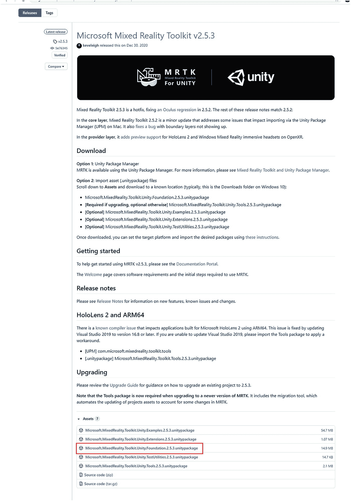

**图 1-19** 浏览到混合现实工具包下载页面，并下载红色圆圈标出的混合现实工具包 Unity 资源包

在图 1-19 中，你会看到五个不同的`.unitypackage`文件。这些资源包各有用途，均可添加到你的 Unity 项目中。让我们来了解这些资源包的用途：

1.  **基础包（Foundation package）**：顾名思义，基础包为混合现实开发奠定了底层结构。它包含的代码可让你在不同混合现实平台的应用中支持标准功能。由于它是构建应用的重要资源包，你必须下载并导入它。

2.  **扩展包（Extensions package）**：扩展包是一个可选包，通过添加额外服务帮助我们扩展功能。此资源包需要依赖基础包才能运行。

3.  **工具包（Tools package）**：工具包也是一个可选包，包含能增强开发体验的实用工具。这些工具可以在 Unity 编辑器的**混合现实工具包 ➤ 实用工具**菜单中找到。工具包依赖于基础包，因此需要基础包才能正常运行。

4.  **测试工具包（Test utilities package）**：可选测试工具包包含辅助脚本，使用户能够轻松创建“播放模式”测试。播放模式测试可以检查功能对手部或眼睛等不同输入源的反应。此资源包对开发混合现实工具包组件的开发者非常有用。

5.  **示例包（Examples package）**：示例包是另一个可选包，如果你是初学者，它将非常有益。它展示了混合现实工具包的各种功能。此资源包包含演示、示例场景和示例代码，这些示例运用了基础包中的功能。示例包需要依赖基础包才能正常运行。

如前所述，你可以根据自己的需求自由下载任何可选包。将混合现实工具包保存到你的电脑上。我们稍后会将此资源包导入 Unity。

## 总结

现在，你已经拥有了开始混合现实开发所需的一切！在接下来的章节中，我们将学习一些 Unity 基础知识，创建我们的第一个混合现实应用，然后深入探索如何打造令人惊叹的混合现实体验。让我们回顾一下本章所学内容：

*   我们讨论了开发混合现实体验的推荐 PC 硬件规格。
*   我们简要了解了 HoloLens 和其他 Windows 混合现实头戴式设备的硬件特性及其独特之处。
*   最后，我们逐步完成了 Visual Studio、Unity 和混合现实工具包的安装指南。

