# 2. Unity 速成课程

在本章中，我们将深入 Unity 的世界。Unity 是开发混合现实应用的首选软件平台。如果你想掌握混合现实开发，就意味着你首先需要掌握 Unity！我们将全面了解 Unity，并理解其用途。我还将引导你构建第一个 Unity 应用。

## 什么是 Unity？

在我们开始之前，你可能想知道 Unity 是什么以及人们如何使用它。*Unity 是一个构建 2D 和 3D 游戏与应用的强大程序*。它在游戏开发者中非常受欢迎，尤其是移动游戏开发者。Unity 还支持广泛的平台。例如：iOS、Android、PlayStation、Nintendo、Xbox One、Windows、Mac、HoloLens、Oculus 等等！

Unity 中非常基础的混合现实工作流程如下：

1.  将你的 3D 对象和其他项目（称为*资产*）导入 Unity。
2.  编程设定你将如何与对象交互，以及对象将如何与你、其他对象及世界交互。
3.  测试你的应用。
4.  导出你的应用，以便将其安装到设备上。

Unity 是一个非常庞大且精密的平台。在本书中，我们将只覆盖混合现实开发所需的 Unity 核心部分。随着你作为一名 Windows 混合现实开发者不断成长，你将花费大量时间掌握 Unity 并为 Unity 进行编程。

## Unity 的免费与付费层级

Unity 为开发者提供了几种定价层级。大多数想学习 Unity 的人可以从个人（免费）账户开始。然而，不同定价层级存在一些需要了解的限值与优势。在表 2-1 中，我提供了对这些层级的说明。

**表 2-1** Unity 定价层级

| 定价层级 | 限值与优势 |
| --- | --- |
| Unity Personal（免费） | 只有当你的公司年收入低于 10 万美元（含投资资金）时，才能使用此层级。你的应用在启动时强制显示 Unity 徽标（闪屏）。 |
| Unity Plus（每月 40 美元/人） | 只有当你的公司年收入低于 20 万美元（含投资资金）时，才能使用此层级。你可以使用自定义（或无）闪屏。附加 Plus 服务。 |
| Unity Pro（每月 150 美元/人） | 无收入/资金上限。你可以使用自定义（或无）闪屏。附加 Pro 服务。 |

## 第一个 Unity 应用

在本节中，我们将构建第一个 Unity 应用程序！我们将创建一个通过键盘控制小球滚动的游戏。在创建第一个 Unity 应用的过程中，我们还将熟悉一些基本的 Unity 组件，并了解 Unity 界面。由于本教程旨在让你熟悉 Unity，我们暂时不会制作混合现实应用（这将在下一章进行）。开始之前，请确保你已经按照第 1 章的说明安装了 Unity 并设置了 Unity 账户。

**提示** 这个基本的 Unity 教程被称为*滚球教程*。强烈推荐所有 Unity 初学者学习。


### 步骤 1：创建新的 Unity 项目

每个 Unity（以及混合现实）项目都始于创建一个新的 Unity 项目。要开始新项目，请启动 Unity Hub，然后选择“新建”图标，如图 2-1 所示。如果尚未登录，您可能需要先输入账户信息（已在第 1 章创建），才能看到图 2-1 所示的屏幕。

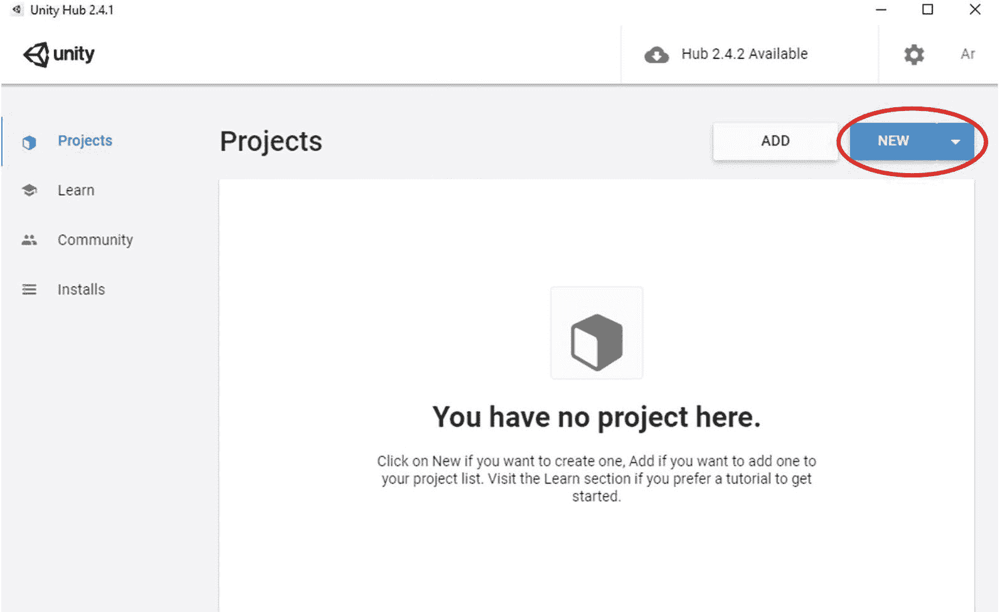

图 2-1

点击“新建”图标开始创建新的 Unity 项目

或者，如果您已经在某个 Unity 项目中，可以通过导航到 `文件 ➤ 新建项目` 来创建一个新项目，如图 2-2 所示。

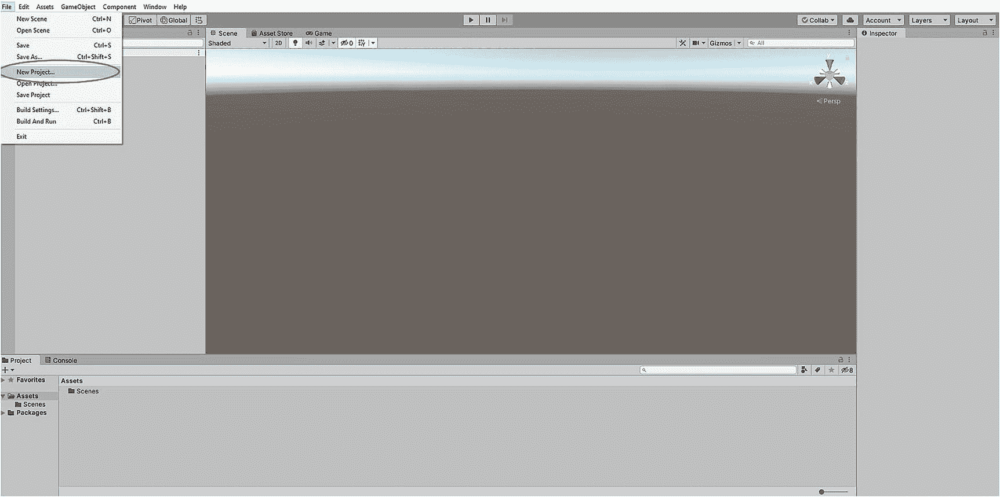

图 2-2

您也可以通过导航到 `文件 ➤ 新建项目` 来启动新的 Unity 项目

然后，Unity 将打开一个弹出窗口，您可以在其中设置新项目。如图 2-3 所示，为您的项目命名。我选择了“`FirstApp`”。您还可以选择不同的位置来存储项目（可选）。项目应已为“3D”项目，但如果不是，请务必选择“3D”选项按钮。完成后，点击“创建”按钮。

> **警告**  
> 避免将 Unity 项目存储在 SD 卡或 MicroSD 卡上。由于未知的错误，如果项目在 SD 卡上，Visual Studio 将无法正确构建项目。您可以将 Unity 项目存储在外部硬盘上。

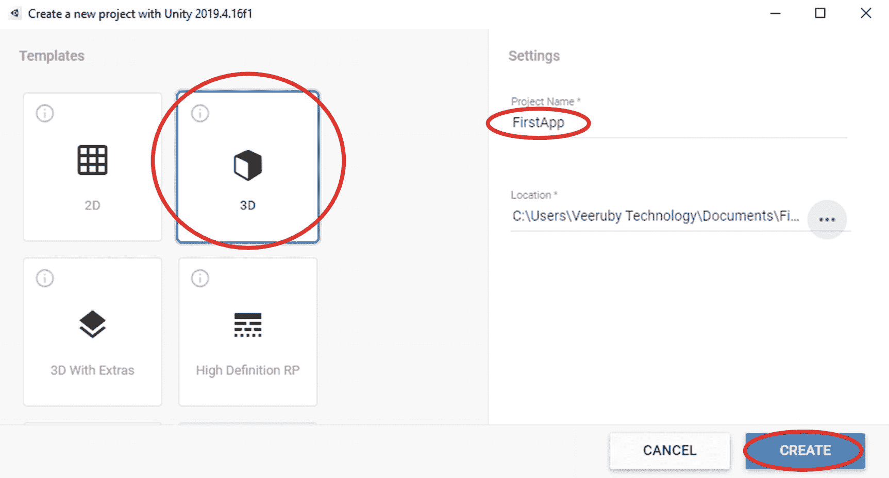

图 2-3

告知 Unity 您的新项目信息。确保选择“3D”并为项目命名

现在您将看到一个新的空项目！您应该能看到类似图 2-4 的内容。这被称为 Unity 编辑器，您的大部分项目编辑工作都将在此进行。在图 2-4 中，我还为编辑器内包含的重要面板提供了简要说明。

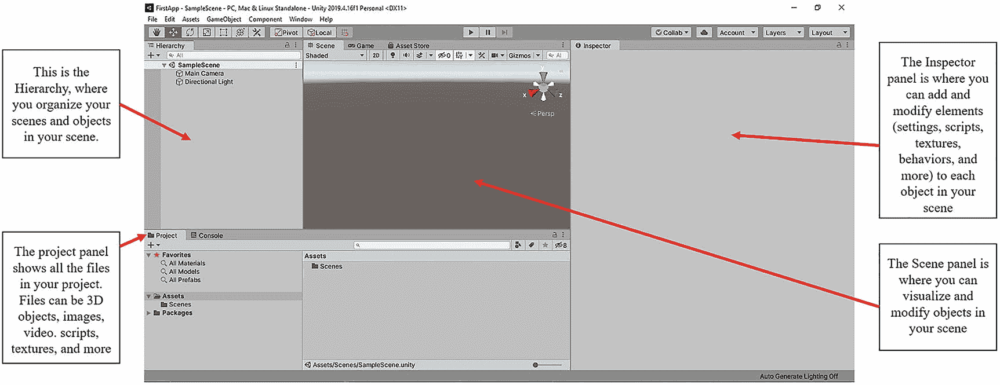

图 2-4

Unity 编辑器窗口包含几个重要面板。大部分项目编辑工作在此进行

在场景面板中，您将看到类似蓝色天空和棕色或灰色地面的景象。这就是您的空*场景*。目前，它只包含一些照亮场景的光源（太阳图标），以及在操作游戏时用于观察世界的摄像机（摄像机图标）。

### 步骤 2：保存场景

在开始编辑这个空场景之前，我们先保存它。右键单击场景并选择 `将场景另存为`。图 2-5 显示了保存场景选项的位置。将弹出一个对话框，允许您为场景命名并选择保存位置。将场景命名为“`MiniGame`”，您可以使用默认位置。您可以用任何名称命名场景，但我建议使用与我相同的名称，以便在后续教程中更容易跟随。

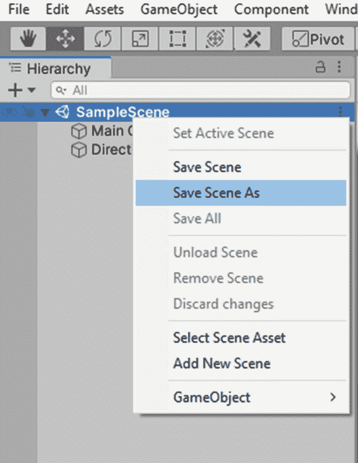

图 2-5

在编辑前保存您的场景

现在场景已保存为 `Assets` 文件夹中的 `MiniGame`。在 `层级` 面板中，您应该能看到名为 `MiniGame` 的场景，其下有两个对象（`主摄像机` 和 `方向光`）。

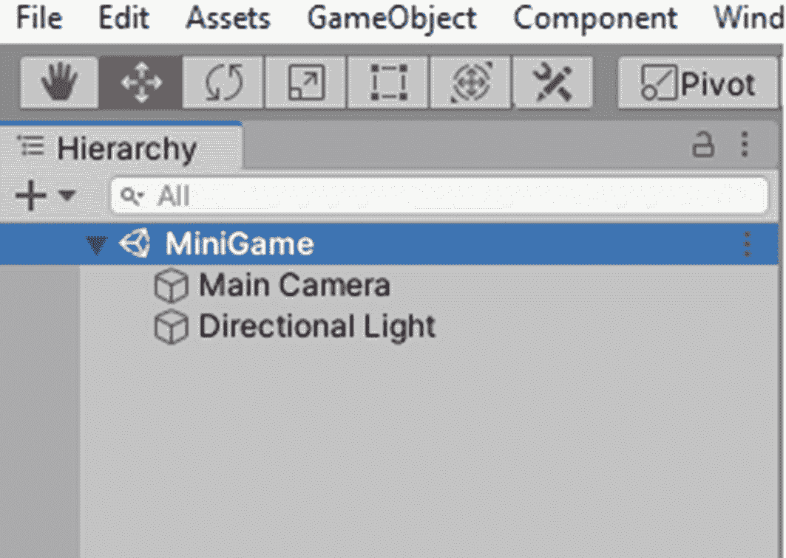

图 2-6

您的新场景在 `层级` 面板下应有两个默认对象

### 步骤 3：创建地面平面

现在我们可以开始构建游戏场景。首先，我们需要创建一个地面平面，供球体在其上滚动。在层级面板中点击 `MiniGame` 场景，使其高亮显示（确保您没有选中 `主摄像机` 或 `方向光`）。导航到 `游戏对象 ➤ 3D 对象 ➤ 平面`。请参见图 2-7 了解如何访问 `平面` 对象。`平面` 对象是一个大型平坦表面。

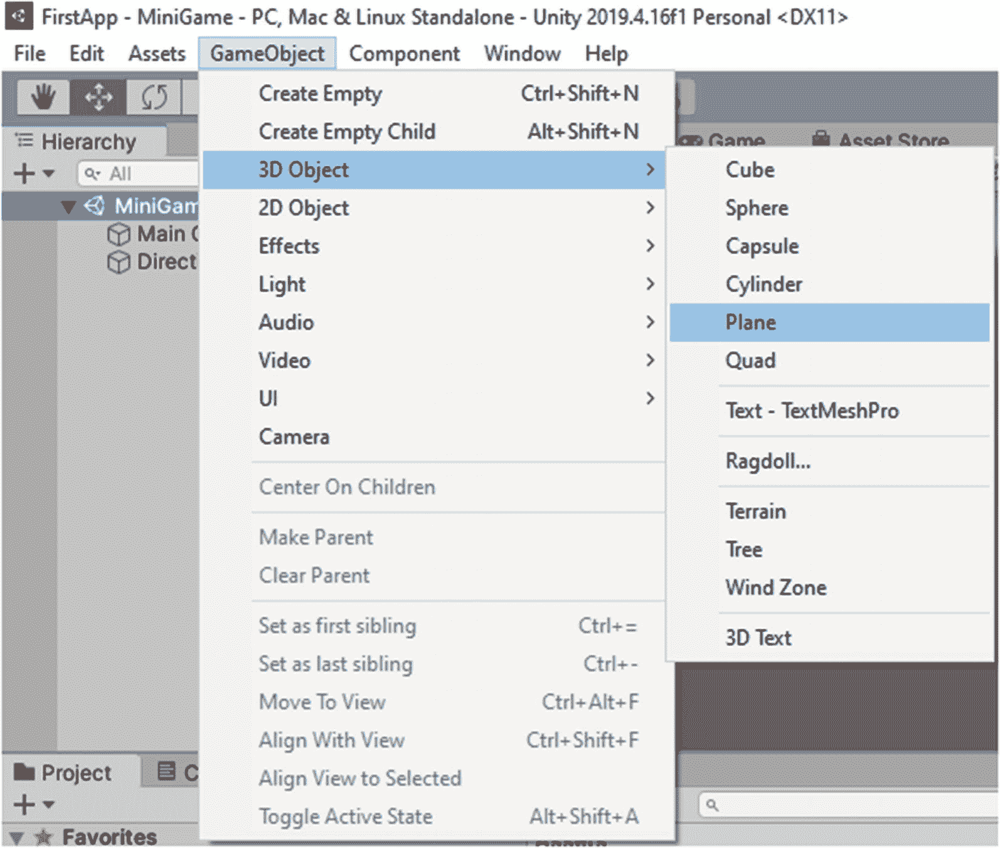

图 2-7

创建一个新的 `平面` 作为地面

您刚刚创建的 `平面` 将在场景面板中显示为地面上的灰色平面。它也会出现在 `层级` 面板中，如图 2-8 所示。`层级` 中的对象被称为*游戏对象*。

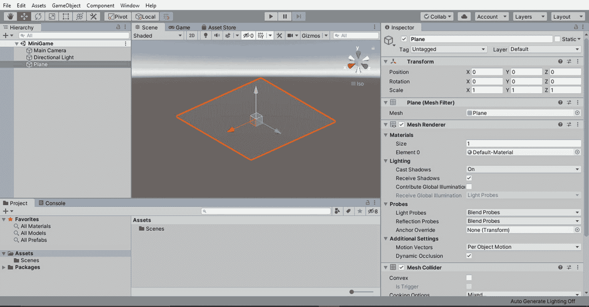

图 2-8

创建后的 `平面` 对象示意图

### 步骤 4：重命名平面

让我们将 `平面` 游戏对象重命名为“地面”。为此，在 `层级` 中单击 `平面` 游戏对象一次以高亮显示它。等待一秒钟后，再次单击 `平面` 游戏对象。您现在就可以编辑游戏对象的名称了。您也可以通过右键单击并选择“重命名”来重命名对象。将其重命名为“地面”，如图 2-9 所示。

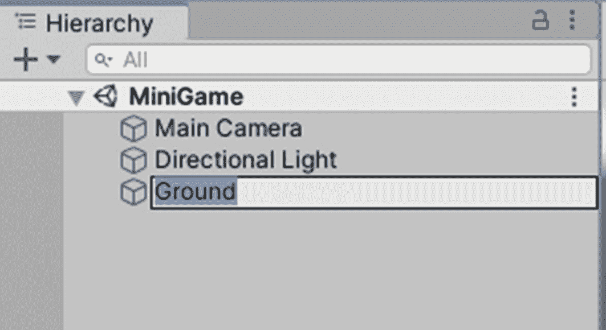

图 2-9

将“`平面`”游戏对象重命名为“地面”

### 步骤 5：重置地面平面位置

接下来，让我们将 `地面` 游戏对象的位置重置为 0, 0, 0。在 `检查器` 面板中，点击 `变换` 组件的齿轮图标。在上下文菜单打开后，选择 `重置`，如图 2-10 所示。

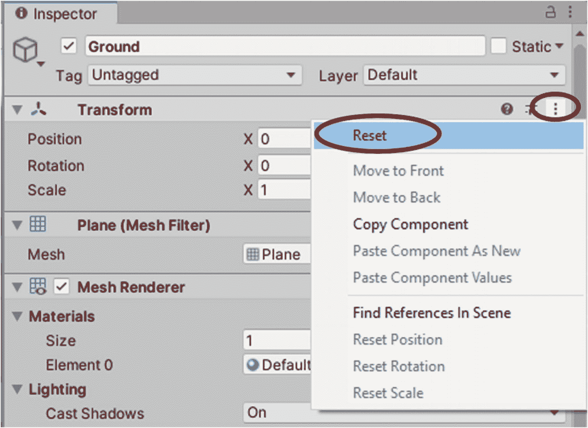

图 2-10

重置 `地面` 游戏对象的位置

### 步骤 6：缩放至地面平面

在 `层级` 中，选中 `地面` 游戏对象，然后按键盘上的“`F`”键。这将激活*框选对象*命令，使场景窗口拉近或拉远，以将您选中的游戏对象填满场景窗口。

> **提示**  
> 如果在场景中找不到对象，只需在 `层级` 中选中该游戏对象名称，然后按“`F`”键即可自动缩放至该对象。此命令也可用于快速缩放至场景中非常大或非常小的对象。


### 第 7 步：缩放地面

接下来，我们将学习如何通过缩放地面来*缩放*游戏对象。缩放对象意味着调整其大小。有多种不同的方式可以缩放游戏对象。这里列出了一些常见方法：

-   点击缩放图标，然后在游戏对象上点击并拖动其中一个彩色轴。拖动红色轴可在`X`方向缩放，绿色轴对应`Y`方向，蓝色轴对应`Z`方向。
-   按下键盘上的`R`键，作为点击缩放图标的快捷方式。
-   点击并拖动缩放字段的`X`、`Y`或`Z`标题。
-   直接在缩放字段中输入您想要的缩放值。

图 2-11 展示了这些缩放命令的位置。

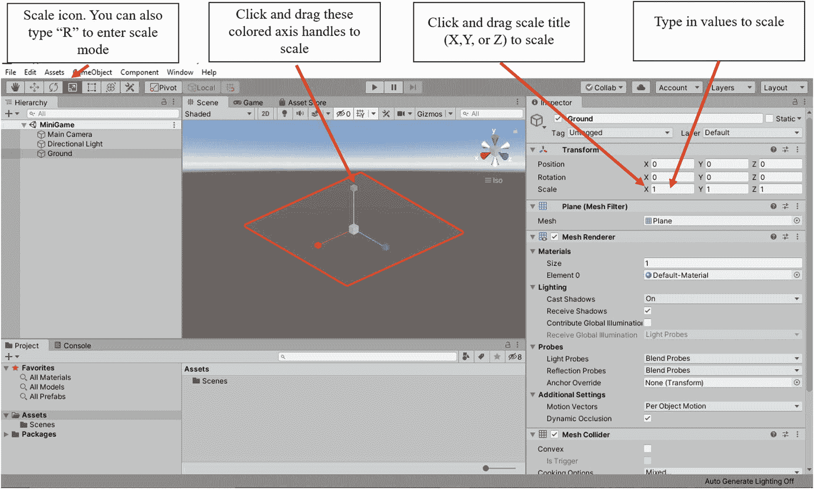

**图 2-11**  
有多种方式可以缩放您的游戏对象

缩放您的对象，将`X`、`Y`和`Z`轴的值都设置为`1`。

> **注意：**  
> `Plane`对象相对于其他对象来说是个例外，它看起来比其他对象大十倍。这只是为了让平面显得独特而做的随意决定，因为很多人将这个对象用作地板或墙面。因此，当您将`X`、`Y`和`Z`的值设置为`1`时，对于平面而言，这相当于十米。

### 第 8 步：创建球体

请记住，我们正在创建一个名为*滚球*的游戏。您将在一个平面上控制一个滚动的球体。要创建球体，我们需要向场景中添加一个球体。添加球体与添加平面类似。点击我们的场景 `MiniGame`（以确保我们没有选中其他游戏对象），然后转到 **GameObject** ➤ **3D Object** ➤ **Sphere**。图 2-12 展示了这个命令的位置。

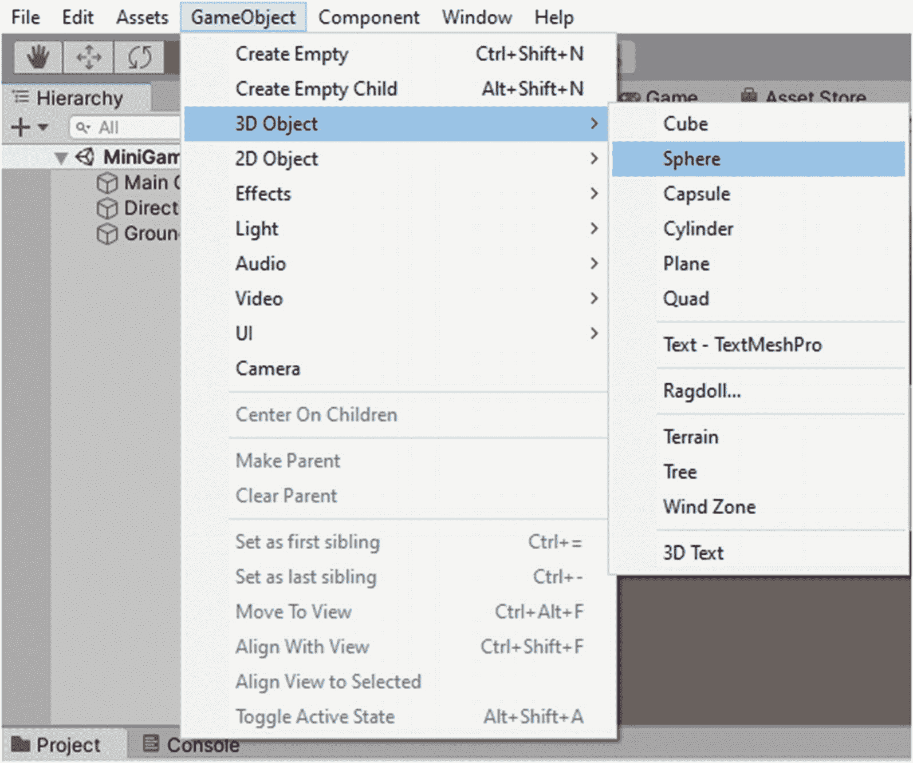

**图 2-12**  
为您的球体创建一个`Sphere`游戏对象

### 第 9 步：重命名球体

通过选中层级视图中的`Sphere`游戏对象，等待一秒钟后再次点击它来重命名您的球体，就像您在步骤 4 中重命名`Plane`一样。将您的球体命名为`Player`。

### 第 10 步：重置球体位置

接下来，让我们将`Player`游戏对象（我们的球体）的位置重置为`0, 0, 0`。在检视面板中，点击`Transform`组件的齿轮图标。打开上下文菜单后，选择**Reset**，就像我们在步骤 5 中所做的那样（参见图 2-10）。

### 第 11 步：聚焦球体

在层级视图中，选中`Player`游戏对象，然后按下键盘上的`F`键进行缩放，使球体填满您的场景窗口。

### 第 12 步：抬高球体位置

正如您在场景中看到的，球体有一半陷入了地面。移动游戏对象的位置类似于缩放它（参见步骤 7）。图 2-13 显示了几种移动对象位置的选项。将`Player`游戏对象抬高`0.5`单位。完成此操作后，球体将完美地停在地面表面，如图 2-13 所示。

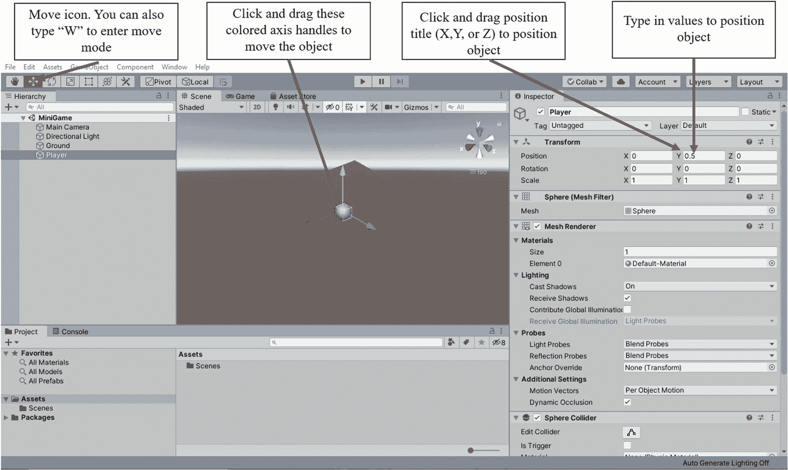

**图 2-13**  
在 Unity 中有多种定位游戏对象的方法

### 第 13 步：将地面着色为蓝色

到目前为止，您已经创建了地面和球体。您创建的对象的默认颜色是灰色。让我们更改一些颜色，以便更好地区分`Player`球体和地面。在 Unity 中，有许多修改对象外观的选项。纹理、材质和着色器构成一个复杂的世界，这将在第 4 章中讨论。现在，让我们为地面应用一个简单的材质。

首先，创建一个文件夹来组织我们的材质。保持项目文件的良好组织始终是一个好习惯，这将有助于避免混淆并加快开发工作，特别是在非常庞大和复杂的项目中。要创建文件夹，请点击项目面板中的 **create** 下拉列表，然后选择 **Folder**，如图 2-14 所示。

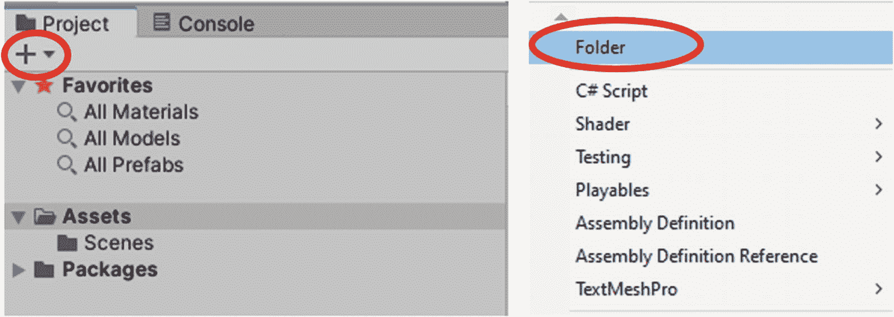

**图 2-14**  
说明如何在 Unity 中创建新文件夹

文件夹创建完成后，将其重命名为`Materials`，如图 2-15 所示。

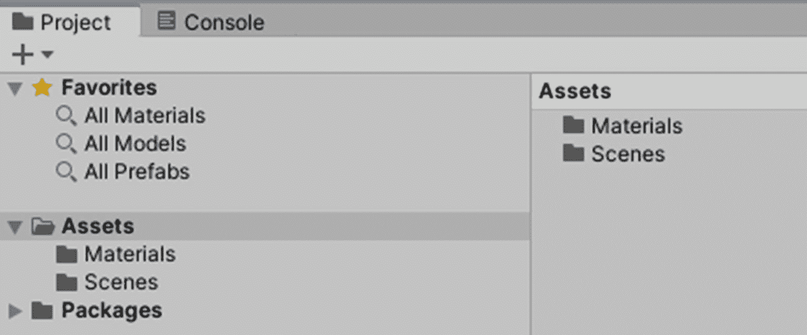

**图 2-15**  
重命名后，您的项目列表中现在会有一个`Materials`文件夹

接下来，我们将创建材质。选中您刚刚创建的`Materials`文件夹使其高亮。使用与创建`Materials`文件夹相同的 **create** 下拉菜单，创建一个新的材质，如图 2-16 所示。您创建的新材质现在应该位于`Materials`文件夹内（因为创建新材质时已选中了`Materials`文件夹）。按照本教程中重命名其他项的方式，将此材质重命名为`Background`。

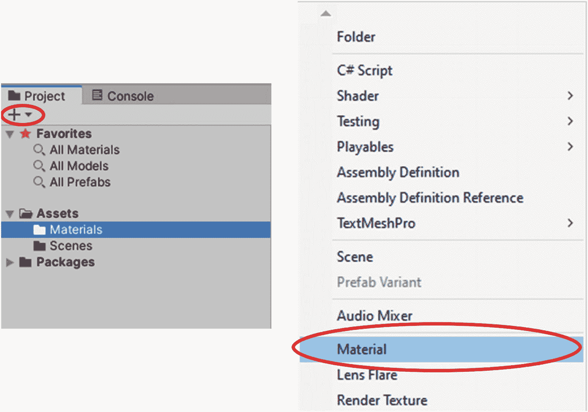

**图 2-16**  
创建一个新的材质

接着，选中您的新`Background`材质，并在检视面板中打开`Albedo`设置，如图 2-17 所示。要打开`Albedo`设置，请点击 `Albedo` 字样右侧的彩色框（默认颜色为白色）。不要点击`Albedo`左侧的吸管图标或灰色框。将会弹出一个窗口，您可以在其中为材质选择各种颜色选项，如图 2-17 所示。

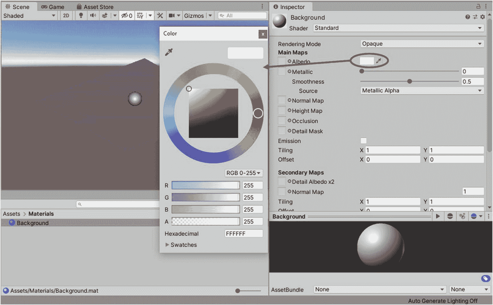

**图 2-17**  
选择`Background`材质的`Albedo`设置来更改其颜色

在弹出的颜色窗口内，选择一种深蓝色。您可能需要将**色相**条拖动到蓝色区域，然后在方形颜色框中选择一种颜色，如图 2-18 所示。当然，您可以选择任何您喜欢的颜色。

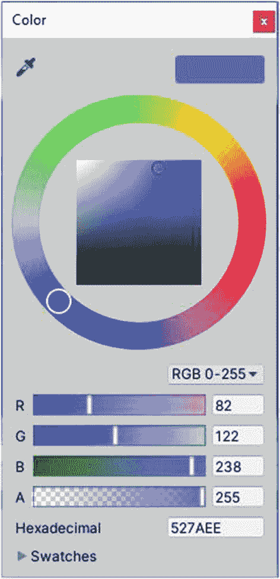

**图 2-18**  
通过更改色相和亮度/饱和度设置来选择深蓝色。您也可以直接输入图示中的具体数值

最后，通过将材质从项目窗口拖拽到地面上，将蓝色的`Background`材质应用到地面，如图 2-19 所示。地面应该会变成蓝色，使球体更加突出。

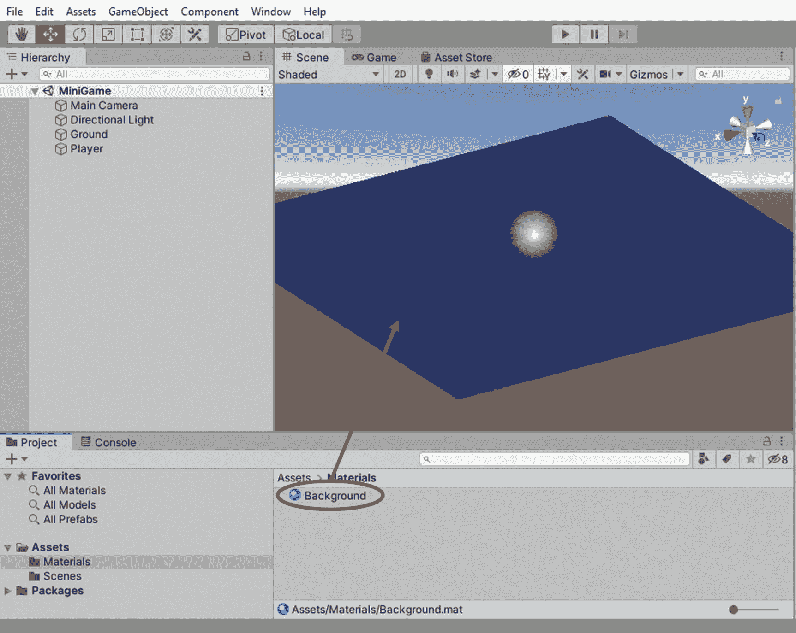

**图 2-19**  
将您蓝色的`Background`材质从项目面板拖拽并放置到地面上。地面将变为蓝色！


### 步骤 14：为小球添加物理效果

由于本游戏将涉及让小球在地面上滚动，我们希望小球的行为与现实世界中的球类物体类似，因此需要使用物理引擎。要启用物理效果，请在层级视图中选中小球（即`Player`游戏对象），然后在检查器中点击“添加组件”按钮，并选择“物理”➤ `Rigidbody`。这些菜单项的位置如图 2-20 所示。*刚体*是 Unity 物理引擎的基础组件，负责存储运动方程所需的各类状态变量。

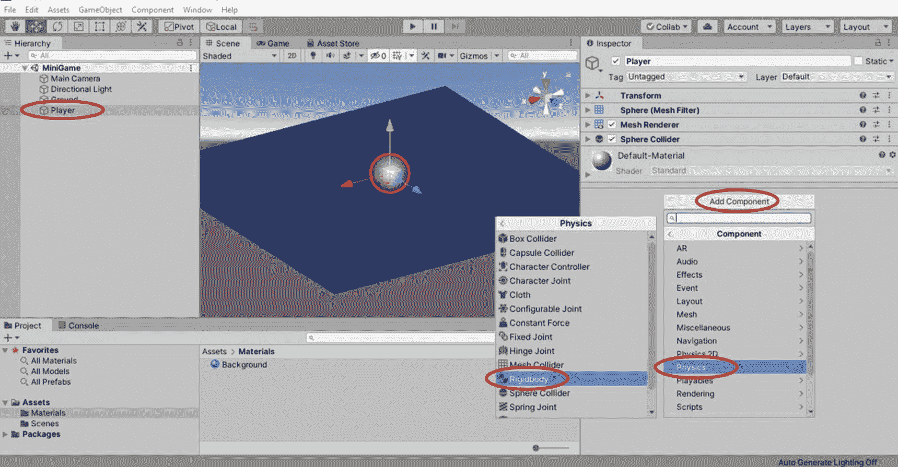

图 2-20 — 为`Player`游戏对象添加`Rigidbody`组件以对小球应用物理效果

### 步骤 15：启用键盘控制

我们希望可以使用键盘作为游戏控制器来移动小球。为此，需要为小球编写一些代码！在 Unity 中，代码文档被称为*脚本*。让我们保持井井有条，创建一个新文件夹来存放脚本，就像之前在步骤 13 中创建存放材质的文件夹一样。

1.  要创建新文件夹，请转到“项目”面板，点击“创建” ➤ “文件夹”。请确保`Scripts`文件夹创建在`Assets`文件夹内，而不是`Materials`文件夹内部。
2.  将新文件夹重命名为“Scripts”。接下来，我们要为小球添加一个新脚本。
3.  选中`Player`游戏对象。
4.  在检查器中点击“添加组件”按钮。
5.  滚动到列表底部，选择“新建脚本”。
6.  在弹出的下一个窗口中，确保脚本语言设置为 C sharp（有时也称为 C#）。
7.  将脚本命名为“PlayerController”。
8.  点击“创建并添加”按钮。

图 2-21 演示了如何添加并命名新脚本。

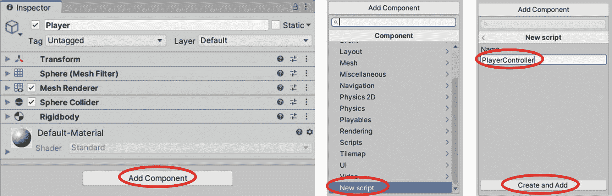

图 2-21 — 为`Player`游戏对象创建一个名为“PlayerController”的新脚本

你会注意到，在“项目”面板中，刚创建的新脚本并未放置在`Scripts`文件夹内。将`PlayerController`脚本拖放到`Scripts`文件夹中，如图 2-22 所示。养成保持条理清晰的习惯非常重要！

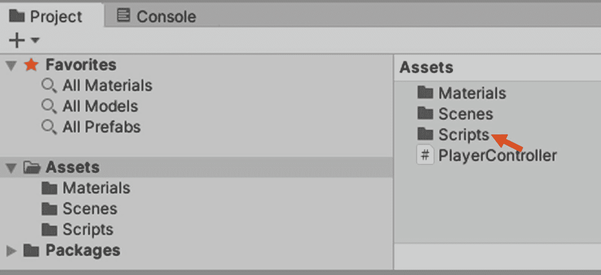

图 2-22 — 将`PlayerController`脚本拖拽到`Scripts`文件夹中以保持项目结构清晰

接下来，我们将对`Player`游戏对象进行编程，使其响应键盘控制：

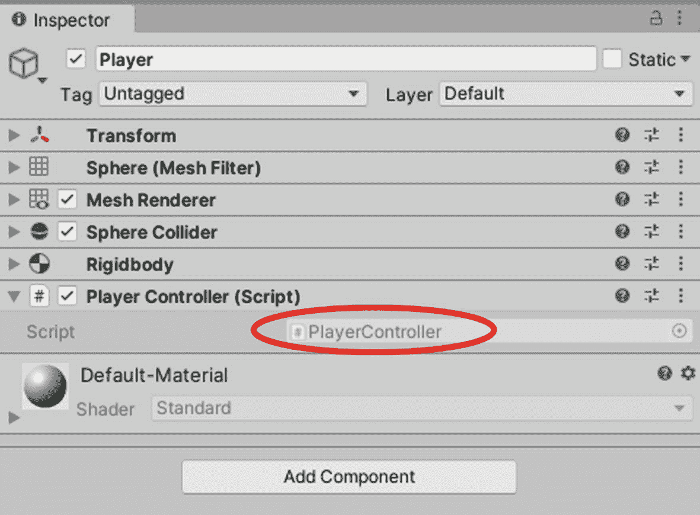

图 2-23 — 双击`PlayerController`脚本，在 Visual Studio 中打开进行编辑

1.  在层级视图中选中`Player`游戏对象。
2.  如图 2-23 所示，在检查器中双击`PlayerController`脚本。Visual Studio 现在应该会自动启动，以便你开始编辑脚本。

你应该已经在第 1 章中下载、安装并配置好了 Visual Studio。一旦 Visual Studio 打开了你的`PlayerController`脚本，你应该会看到类似图 2-24 所示的窗口。

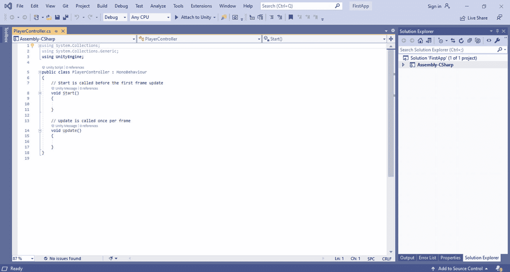

图 2-24 — Visual Studio 打开`PlayerController`脚本后应看到的示例界面

在 Visual Studio 中，请删除所有现有代码，并将其替换为代码清单 2-1 中提供的代码。

```
using UnityEngine;
using System.Collections;
public class PlayerController : MonoBehaviour {
public float speed;
private Rigidbody rb;
void Start ()
{
rb = GetComponent();
}
void FixedUpdate ()
{
float moveHorizontal = Input.GetAxis ("Horizontal");
float moveVertical = Input.GetAxis ("Vertical");
Vector3 movement = new Vector3 (moveHorizontal, 0.0f, moveVertical);
rb.AddForce (movement * speed);
}
}
```

代码清单 2-1 — `PlayerController`脚本使你能够通过键盘控制小球滚动

此时你的 Visual Studio 窗口应类似于图 2-25。点击图中红色圆圈标注的“全部保存”图标来保存代码。

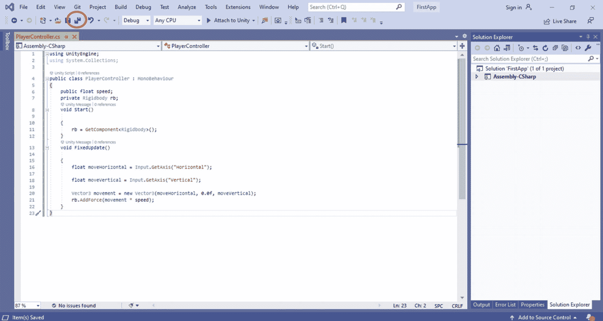

图 2-25 — 用提供的代码替换`PlayerController`中的所有默认代码。点击红色圆圈标注的“全部保存”图标保存脚本

本教程不会深入解释这段代码，因为本章的主要目的是让你熟悉 Unity 的工作流程。当我们开始开发混合现实应用程序时，我会详细讲解脚本，以便你理解代码的工作原理。

### 步骤 16：测试应用程序

接下来，我们将测试新应用程序，以确保一切按预期工作。回到 Unity 编辑器，在层级视图中选中`Player`游戏对象。你会注意到，在检查器的`Player Controller`组件下出现了一个新字段，如图 2-26 所示。这是由于我们编写的新脚本导致的。为了让该字段显示在检查器面板中，你需要保存脚本，并等待 Unity 花几秒钟时间处理已保存的更改并更新检查器面板。将“Speed”的值改为 10，然后点击播放按钮（位于场景面板上方），如图 2-26 所示。

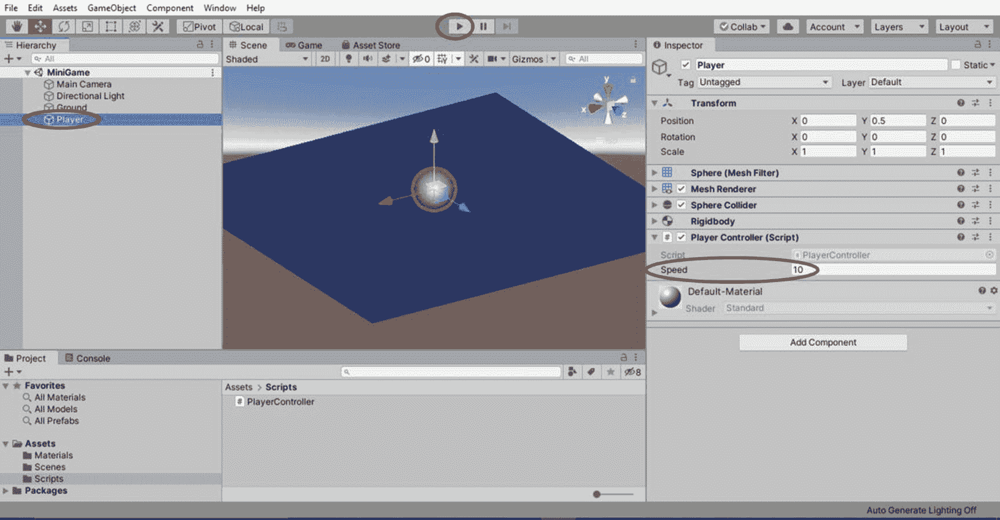

图 2-26 — 在检查器中将玩家速度设置为 10，然后点击播放按钮（位于顶部）测试新应用

点击播放后，你将进入“游戏”模式，通过场景摄像头观看游戏。现在尝试按下键盘上的左、右、上、下箭头键，观察小球移动！如果小球掉出地面边缘，你可以再次点击播放按钮停止游戏，然后再次点击播放进入游戏来重置游戏。欢迎尝试改变`Player`的速度，探索其对游戏玩法的影响。

## 总结

恭喜你！你已经成功完成了第一个 Unity 应用程序。以下是本章我们学到的一些内容：

*   我们讨论了 Unity 的基本信息。
*   我们了解了 Unity 的定价等级。
*   我们学习了 Unity 编辑器界面。
*   我们学习了如何创建新的游戏对象。
*   我们学习了如何缩放和移动游戏对象。
*   我们学习了如何为游戏对象应用材质。
*   我们学习了如何为游戏对象应用物理效果。
*   我们学习了如何创建脚本并将其应用于游戏对象。
*   我们创建并测试了第一个 Unity 应用程序！

现在你已经熟悉了 Unity 的基础知识，我们可以开始探索如何利用这个强大的平台创建混合现实体验。Unity 是一个非常庞大且精细的工具，作为混合现实开发者，你将在提升 Unity 技能上投入大量时间。在后续章节中，随着我们逐步进行混合现实开发，我们将更深入地探讨各种 Unity 主题。

