# 3. 创建你的第一个全息图

在本章中，我们将构建首个全息体验！我们将首先使用混合现实工具包设置 Unity，为全息开发做好准备。创建第一个全息图后，我们将通过 Visual Studio 将应用直接部署到 HoloLens 上进行测试。在本章中，我还将讨论如何为你的项目创建或寻找自己的全息图（3D 模型）。

## 让 Unity 为混合现实开发做好准备

在开始创建第一个全息图之前，我们首先需要确保 Unity 已为混合现实开发做好准备。为了让我们的应用能在 HoloLens 和其他混合现实设备上运行，需要更改 Unity 中的几项设置。例如，在第 2 章的 Unity 教程中，你可能注意到了场景中的灰/棕色地板和蓝色天空。我们通常不希望这种数字地板和天空出现在所有混合现实体验中，因此需要将背景调黑，使其不会显示在设备上；黑色背景有助于在 HoloLens 中获得透明背景。我们还需要调整摄像机设置，让每只眼睛从略微不同的视角观察场景，这样用户在佩戴头显时就能感知深度。这些只是需要更改的设置示例，以使 Unity 为混合现实开发做好准备。所有这些设置都可以手动更改，但每次创建新的混合现实项目时都这样做会非常繁琐且耗时。

幸运的是，微软提供了一个名为混合现实工具包的社区资源，它将帮助我们自动设置 Unity，以便创建混合现实应用。我在本书中专门用了一整章来介绍混合现实工具包，因此本章不会涵盖它的所有功能。以下步骤将引导你为混合现实开发准备好场景。

> **注意：** 混合现实工具包会定期更新，自编写这些说明以来，某些元素可能已发生变化。如果你在本教程中找不到我提到的对象，请务必查看混合现实工具包文档以获取更新说明。你可以在以下网址找到混合现实工具包说明：[`https://microsoft.github.io/MixedRealityToolkit-Unity/Documentation/GettingStartedWithTheMRTK.html`](https://microsoft.github.io/MixedRealityToolkit-Unity/Documentation/GettingStartedWithTheMRTK.html)

### 步骤 1：将混合现实工具包导入新 Unity 项目

在继续之前，请确保你已经按照第 1 章中的说明下载并保存了混合现实工具包 Unity 包。

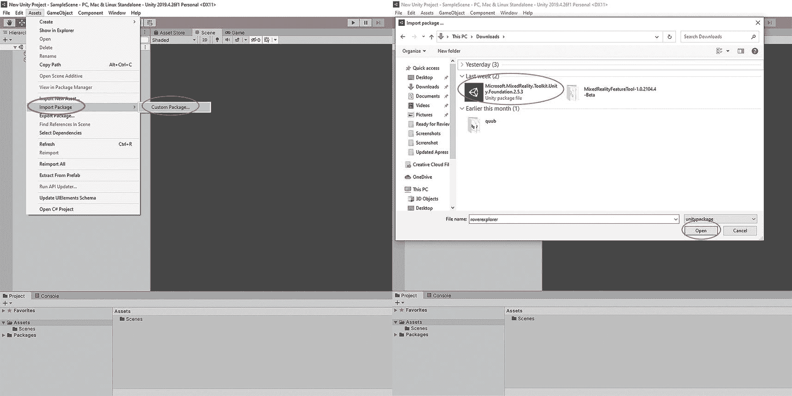

**图 3-1** – 导入你在第 1 章中下载的混合现实工具包

1. 创建一个新的 Unity 项目（如果需要复习如何操作，请参见第 2 章），并将其命名为 `"Holo World"`。

    **重要提示：** 保存你的场景，并为其指定一个你喜欢的名称。如果不保存场景，你将无法在步骤 2 中应用 HoloLens 设置。有关如何保存场景的说明，请参见第 2 章。回顾该章以了解更多信息。

2. 从菜单栏中，依次点击 `Assets` ➤ `Import Package` ➤ `Custom Package`。在弹出的窗口中，浏览到你已在第 1 章中下载的混合现实工具包。有关这些菜单项的图示，请参见图 3-1。

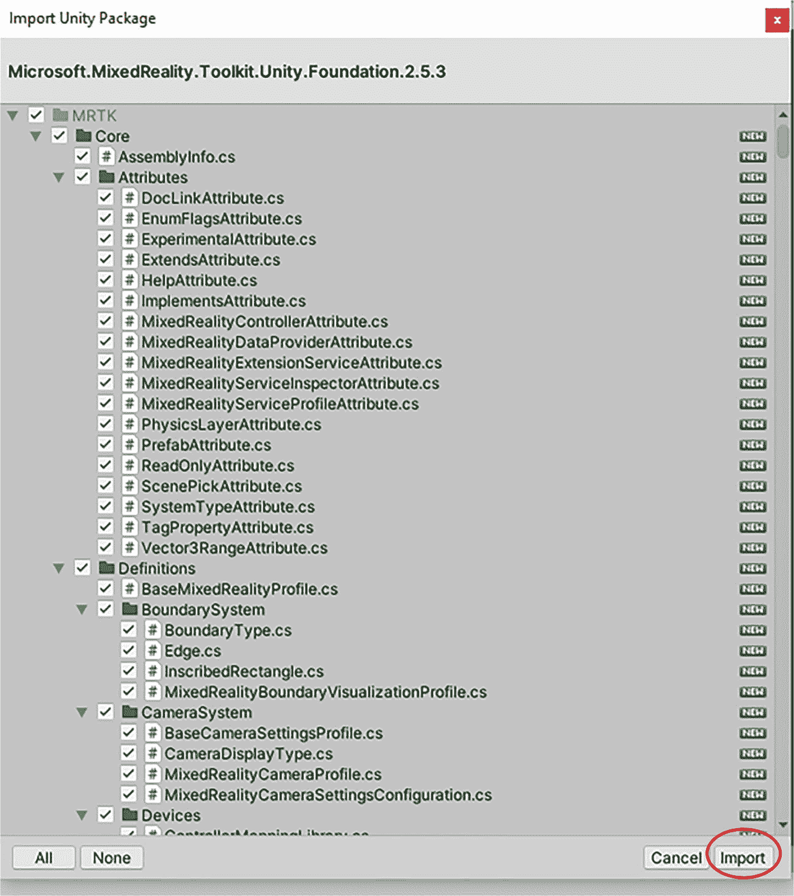

**图 3-2** – 点击 `Import` 按钮以导入混合现实工具包

3. Unity 将需要一分钟时间来准备你选择的包，然后会弹出另一个窗口，你可以在其中选择或取消选择包中的项目。请保持所有项目处于选中状态（默认情况下所有项目都应被选中），然后点击 `Import` 按钮，如图 3-2 所示。

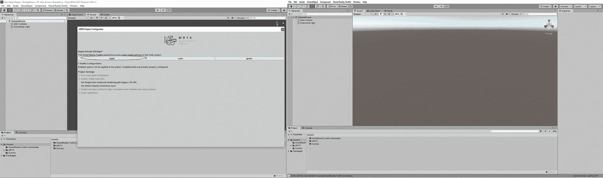

**图 3-3** – 点击 `Apply` 按钮以应用设置（左图）。导入后，你的 Unity 环境将如下所示（右图）

4. 导入后，你将看到 MRTK 项目配置器窗口；在该窗口中，点击 `Apply`。参考图 3-3（左图）。点击 `Apply` 后，你最终的 Unity 环境应类似于图 3-3（右图）。

### 步骤 2：使用混合现实工具包为混合现实开发准备场景

完成步骤 1 后，您应该会在菜单栏中看到一个“Mixed Reality Toolkit”菜单项，如图 3-4 所示：

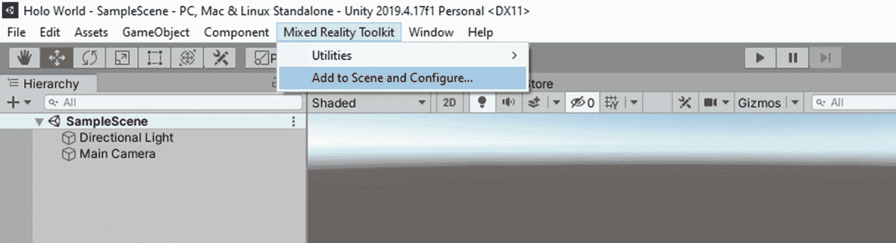  
图 3-5：删除“Main Camera”和“Directional Light”对象后，将 HoloLensCamera 插入场景

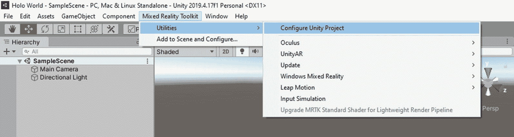  
图 3-4：您现在有了一个全新的“Mixed Reality Toolkit”菜单项！

1.  从菜单栏中选择 `Mixed Reality Toolkit` ➤ `Add to scene and configure settings`。请务必保存您的场景，因为后续操作会用到。
2.  从菜单栏中选择 `Mixed Reality Toolkit` ➤ `Utilities` ➤ `Configure Unity Project`。这会将 Unity 项目转换为 Windows Direct 3D (D3D) 项目，优化质量，并启用虚拟现实支持。Unity 将要求您重新加载项目。*如果您未保存上一步的场景，您将丢失所有场景更改，需要重新应用场景设置。*

**提示** 选择从 `Mixed Reality Toolkit` 菜单应用设置后，会弹出一个窗口显示要应用的设置。点击每个项目以了解更多信息。

3.  从层级面板中，右键点击“Main Camera”和“Directional Light”游戏对象，并从上下文菜单中选择“Delete”以删除它们。
4.  保存您的场景。

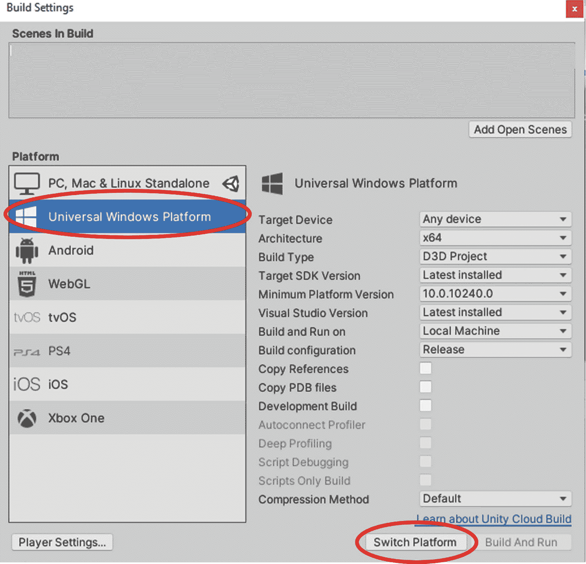  
图 3-6：将平台切换到 UWP

- 为了开发针对 HoloLens 2 的应用，我们需要将平台切换到 UWP（通用 Windows 平台）。在 Unity 菜单中，选择 `File` ➤ `Build Settings` 打开构建设置窗口，然后点击 `UWP`，再点击 `Switch Platform`，如图 3-6 所示。

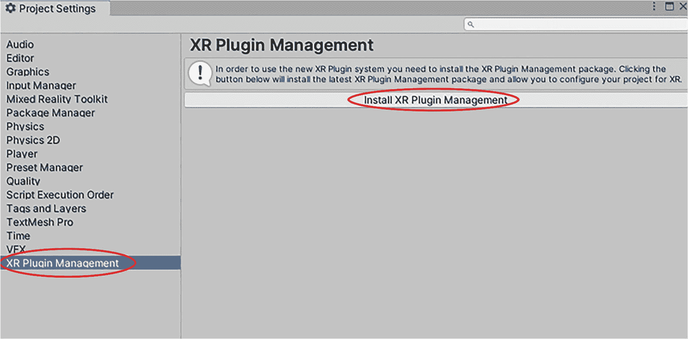  
图 3-7：安装 XR 插件管理

- 此外，我们还需要安装 XR 插件管理。当应用加载时，XR 插件管理会自动初始化并启动您的 XR 环境。在 Unity 菜单中，选择 `Edit` ➤ `Project Settings`，然后在 `Project Settings` 窗口中，点击左侧的 `XR Plugin Management`，再点击 `Install XR Plugin Management`，如图 3-7 所示。

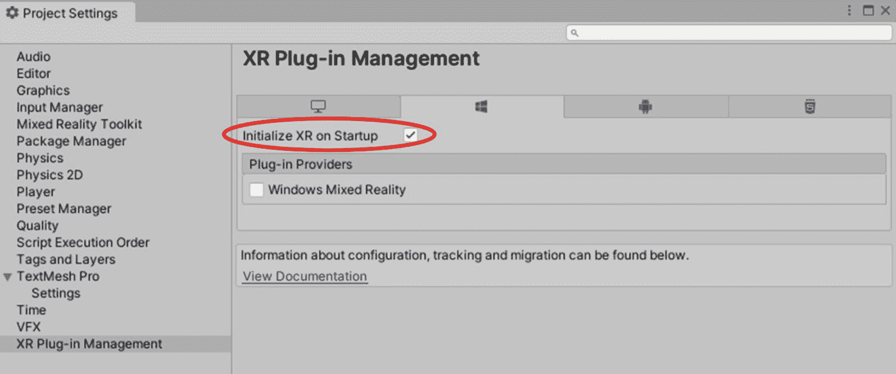  
图 3-8：勾选“Initialize XR on Startup”复选框

- 确保您处于通用 Windows 平台设置中，并勾选 `Initialize XR on Startup` 复选框，如图 3-8 所示。

- 在 `Project Settings` 窗口中，选择 `Player` ➤ `XR Settings`，确保勾选了 `Virtual Reality supported`。点击 `+` 图标，然后选择 `Windows Mixed Reality` 以添加 Windows 混合现实 SDK。

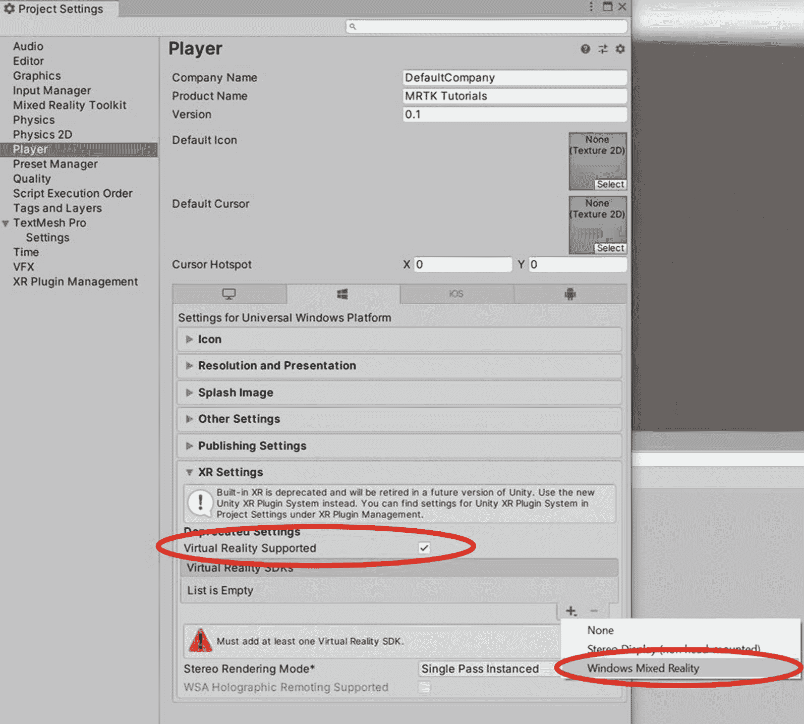  
图 3-9：勾选 `Virtual Reality Supported` 并添加 Windows 混合现实 SDK

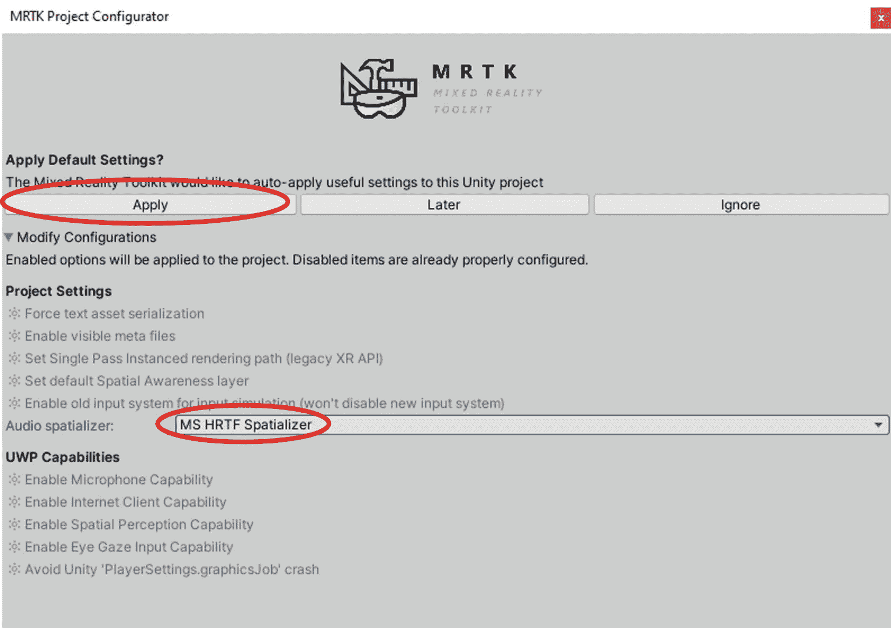  
图 3-10：启用 MS HRTF Audio Spatializer

- 在 `MRTK project configurator` 窗口中，使用 `Audio Spatializer` 下拉菜单选择 `MS HRTF Spatializer`，然后点击 `Apply` 按钮应用设置，如图 3-10 所示。设置 `Audio Spatializer` 属性是可选的，但可以改善您项目中的音频体验。如果您将其设置为 `MS HRTF Spatializer`，则当 Unity 的 `AudioSource.spatialize` 属性启用时，将使用此 Spatializer 插件。

- 在 `Project Settings` 窗口中，选择 `Player` ➤ `XR Settings`，然后使用 `Depth Format` 下拉菜单选择 `16-bit depth`。将 `Depth Format` 降低到 16 位是可选的，但可能有助于提高项目中的图形性能。

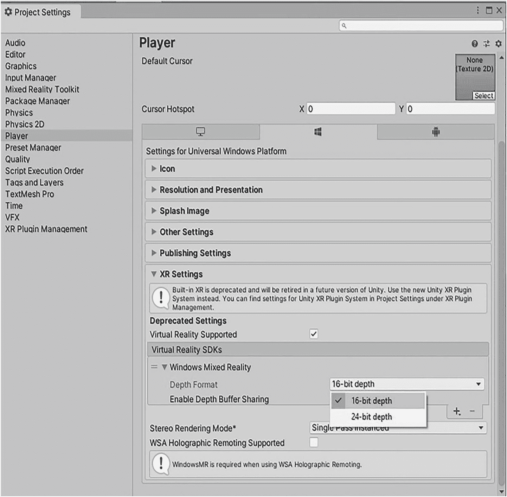  
图 3-11：将 `Depth Format` 设置为 16 位

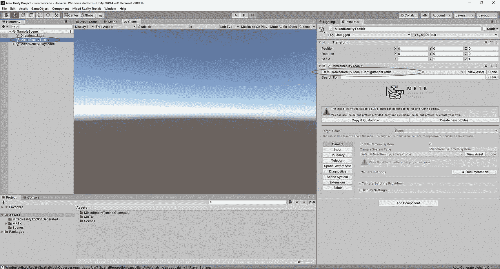  
图 3-12：启用 `DefaultHoloLens2ConfigurationProfile`

- 混合现实工具包尽可能集中管理工具包所需的配置（除了真正的运行时“事物”）。MRTK 配置文件是一个嵌套的配置文件树，构成了 MRTK 系统和功能应如何初始化的配置信息。

- 在层级面板中，选择 `MixedRealityToolkit` 对象；然后在检查器面板中，确认 `MixedRealityToolkit Configuration Profile` 已设置为 `DefaultHoloLens2ConfigurationProfile`，如图 3-12 所示。

恭喜，您的场景现已准备好用于全息图！在将来开始每个新的混合现实项目之前，您都需要重复这些基本准备说明。虽然您可以继续使用已下载的同一个混合现实工具包，但定期检查混合现实工具包的更新始终是个好主意。新功能不断添加，错误也在不断修复。您可以在以下网址探索混合现实工具包：[*https://github.com/Microsoft/Mixed Reality Toolkit-Unity*](https://github.com/Microsoft/HoloToolkit-Unity)*.* 请务必浏览此页面，查找错误报告、最新修复、更新等信息。

## 您的第一个全息图

在场景视图中，您仍然会看到地板网格和地平线。如果您将这个“应用”部署到您的 HoloLens 上，您将什么也看不到。在本节中，我们将创建一个简单的立方体对象，它将作为我们的第一个全息图。

**注意**  
在 Windows 混合现实的上下文中，“全息图”指任何可见的游戏对象。为了与微软的命名约定保持一致，我通常将任何可见的游戏对象或 3D 模型称为全息图，但在本书中可能会互换使用这些术语。

### 步骤 1：创建立方体

在第 2 章中，您在 Unity 中创建了一个平面和一个球体。使用相同的方法在您的场景中创建一个立方体游戏对象。除了在第 2 章中学到的方法外，您还可以通过在层级面板的空白处右键点击，然后在弹出式上下文菜单中选择“3D Object”➤“Cube”来创建立方体，如图 3-13 所示。

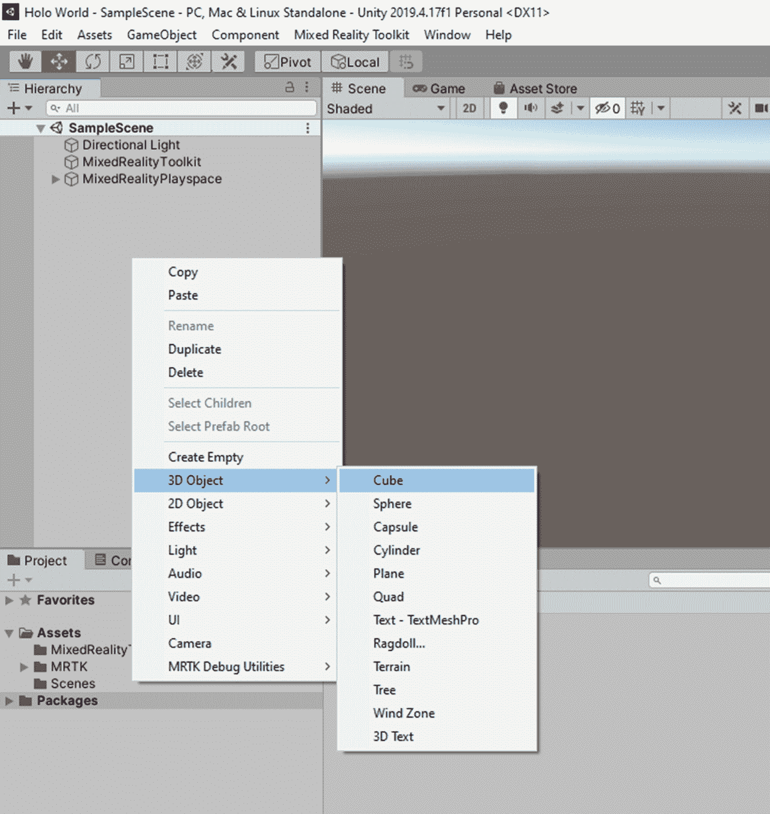  
图 3-13：在层级面板中创建立方体

### 步骤 2：将视图聚焦到您的立方体

如果您还没有切换，请务必切换到场景视图，以便查看场景中的对象。您可以通过点击可视化窗口上方的选项卡来切换视图，如图 3-14 所示。在层级面板中选择立方体游戏对象，然后按 `F` 键，将视图聚焦到您的立方体。您的场景应该类似于图 3-14。

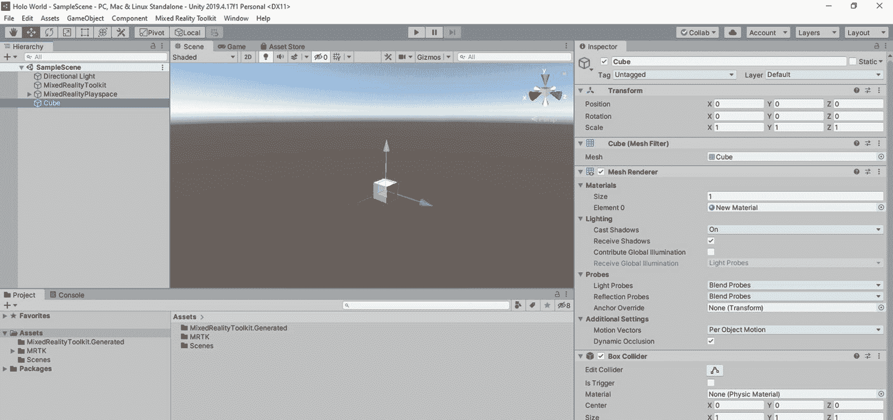  
图 3-14：将视图聚焦到您的立方体

### 步骤 3：将方块移离摄像机

接下来，我们要将方块游戏对象移离摄像机。在 Unity 中，可以把摄像机看作是你的眼睛，你通过摄像机来查看应用。你会在场景中注意到（见图 3-10），方块和摄像机处于同一位置。这意味着当你启动这个应用时，你将看不到方块，因为你的“眼睛”在方块内部！我们需要将方块移动到我们面前一小段距离。

**提示**  
在 Unity 中摆放物体时，一个单位大约相当于现实世界中的一米（超过三英尺）。

让我们将方块移动大约两个单位到我们面前，这大约相当于现实世界中的两米：

-   在层次面板中选择 Cube。
-   在检查器中，将 `Position` 改为 2，如图 3-15 所示。

如图 3-15 所示，方块现在位于摄像机前方两个单位处。

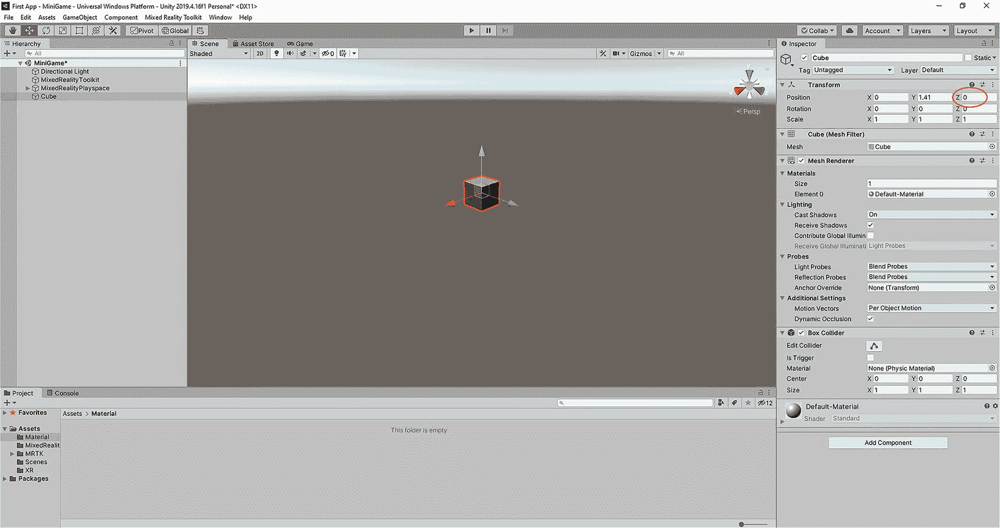  
图 3-15：将方块移动到摄像机前方两个单位处

### 步骤 4：调整方块大小

当前，我们方块的缩放比例为 1x1x1，这意味着它是一个边长大约为一米的立方体。让我们把它缩小，以便能在视野内看到整个方块。

使用第 2 章步骤 7 中的方法，将方块缩放（调整大小）至 0.2x0.2x0.2，如图 3-16 所示。

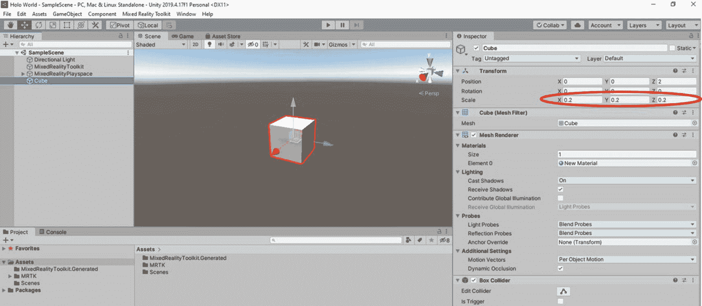  
图 3-16：缩小方块尺寸以便于观察

### 步骤 5：测试你的应用

在开发过程中定期测试你的应用非常重要，以确保它按预期运行。Unity 提供了一种非常快捷的应用测试方法。首先，只需点击位于 Unity 编辑器顶部附近的播放按钮，如图 3-17 所示。点击播放后，你应该会看到方块周围是黑色背景。

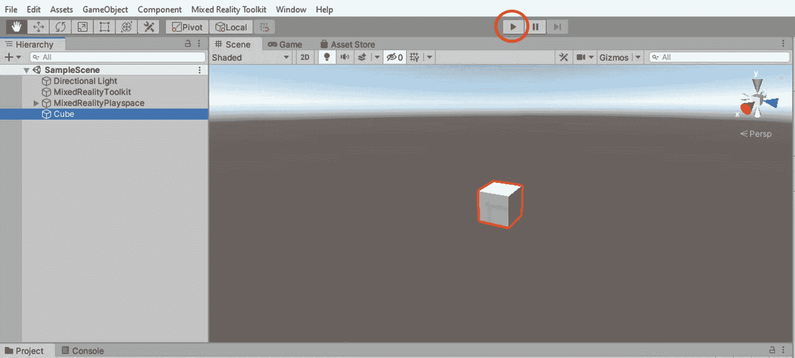  
图 3-17：点击播放按钮快速测试你的应用

`MRTK` 还支持在场景中“移动”。试试在游戏模式下按下键盘上的左/右/上/下方向键（你可能需要先点击游戏窗口，按键才能生效）。你也可以右键单击鼠标来拖动摄像机的视野。按按键时要小心，因为移动速度可能非常快，你可能会失去方块的视野！如果发生这种情况，只需重新启动你的应用测试即可。

再次点击播放按钮退出游戏模式。这是一种非常快速简便的测试应用的方法。

### 步骤 6：在 HoloLens 上安装你的应用

现在我们已经测试了方块应用，让我们把它安装到 HoloLens 上，亲身感受第一个全息影像！操作步骤如下：

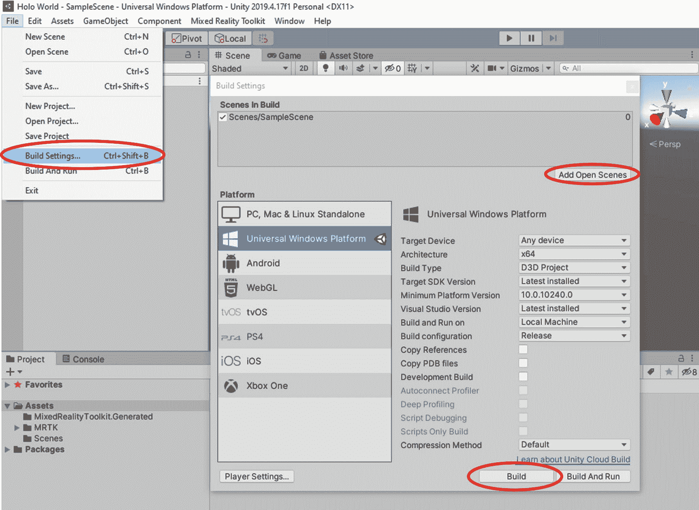  
图 3-18：使用 Unity 中的构建设置窗口导出你的第一个混合现实应用

1.  确保你已从上一部的游戏模式中退出。不在游戏模式时，播放按钮应为黑色；在游戏模式时则为蓝色。
2.  在菜单栏中，转到 **文件** ➤ **构建设置**。
3.  将弹出一个窗口，如图 3-18 所示。
4.  请务必点击“添加打开场景”按钮，将当前场景添加到待构建的场景列表中。
5.  如果你在本章开始时正确应用了所有 HoloLens 项目设置，那么其余设置应该无需修改。请检查确认 `Platform` 设置为 `Windows Store`，`SDK` 设置为 `Windows 10`，`Target Device` 设置为 `HoloLens`，`UWP Build Type` 设置为 `D3D`，并且“Build and Run on”设置为 `Local Machine`。这些设置的样例如图 3-18 所示。
6.  点击“构建”按钮。

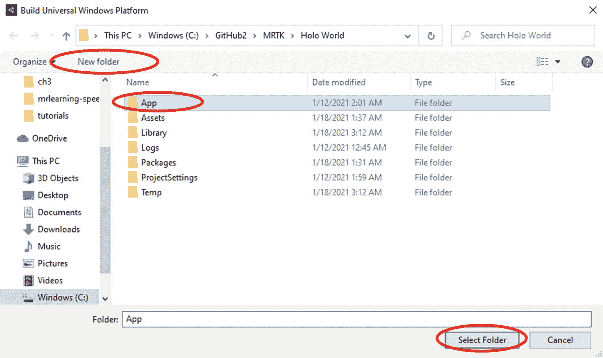  
图 3-19：创建一个新文件夹来存放你的应用

-   点击构建按钮后，会弹出另一个窗口。创建一个新文件夹并命名。我通常将文件夹命名为“App”。点击你新建的文件夹，然后点击“选择文件夹”，如图 3-19 所示。

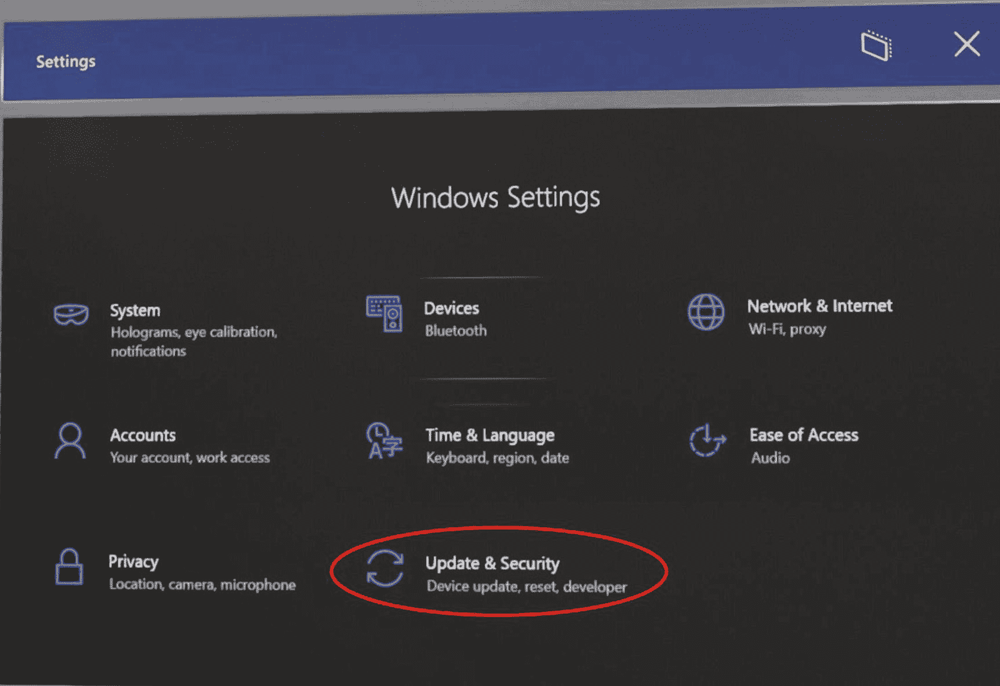  
图 3-20：在“设置”应用中，转到“更新和安全”菜单项

-   Unity 将花费几分钟时间来构建你的新应用，并将项目文件放入你创建的新文件夹中。Unity 构建完成后，会弹出一个窗口，显示你创建的新文件夹。打开此文件夹。
-   双击 `Holo World.sln` 在 Visual Studio 中打开你的项目。如果你的项目名称不是“Holo World”，那么文件名可能不同。
-   我们将使用 Visual Studio 将应用部署（安装）到 HoloLens。在此之前，我们需要在 HoloLens 上启用*开发人员模式*。打开你的 HoloLens，然后打开“设置”应用。选择 **更新和安全** 菜单项，如图 3-20 所示。

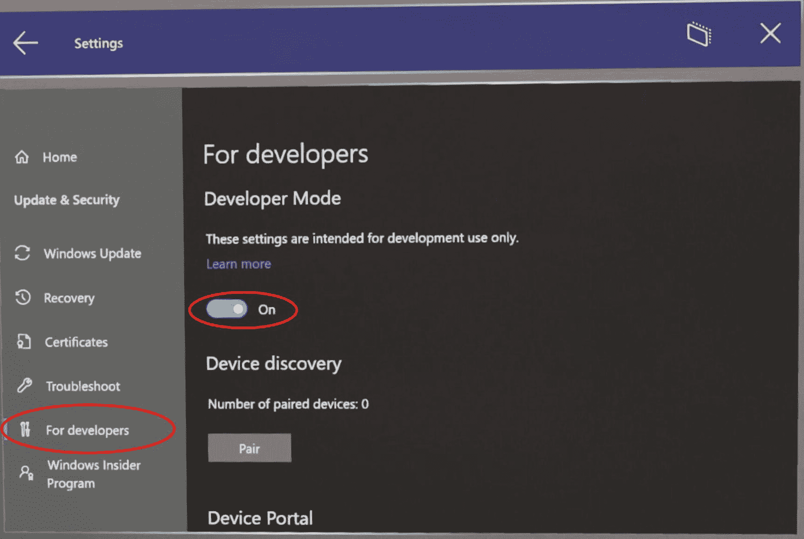  
图 3-21：导航到“面向开发人员”部分并启用开发人员模式

-   进入“更新和安全”菜单后，导航到“面向开发人员”部分，确保开发人员模式已开启，如图 3-21 所示。

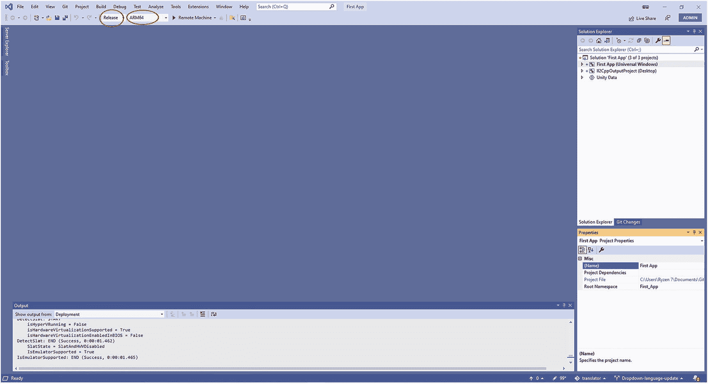  
图 3-22：将配置设置为“Release”，平台设置为“ARM64”

-   确保你的 HoloLens 与开发 PC 连接到同一个 Wi-Fi 网络。
-   在你的 PC 上，将配置设置为 *Release* 或 *Master*，平台设置为 `ARM64`，如图 3-22 所示。

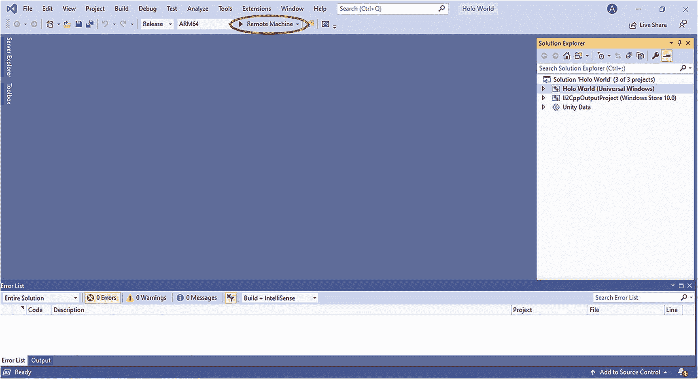  
图 3-23：将目标设备设置为“Remote Machine”

-   将你的 `Target Device` 设置为 `Remote Machine`，如图 3-23 所示。

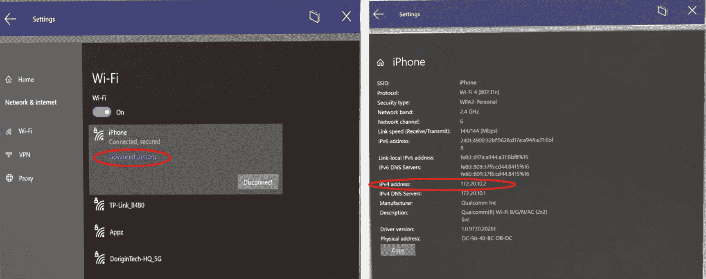  
图 3-24：在“设置”应用中查找 HoloLens IP 地址的图示

*   前往**设置** ➤ **网络和 Internet** ➤ **高级选项**。有关在 HoloLens 的设置应用中找到 IP 地址的指导，请参见图 3-24。

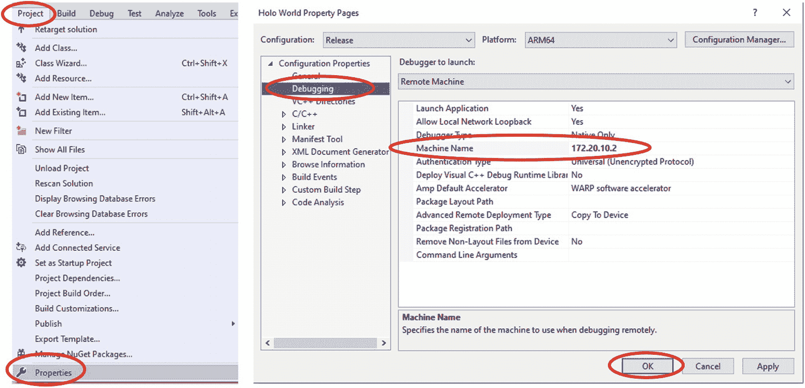

图 3-25：将 HoloLens IP 地址输入 Visual Studio

*   知道 HoloLens IP 地址后，确保解决方案中已选中通用 Windows 项目，然后前往 **项目** ➤ **属性** ➤ **调试**，在 Visual Studio 中的 `machine name` 下输入 IP 地址，并点击**确定**按钮，如图 3-25 所示。

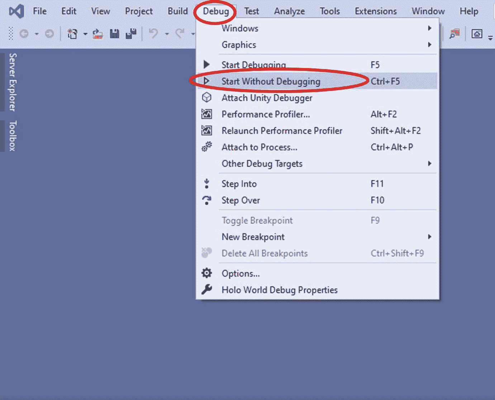

图 3-26：前往 **调试** ➤ **开始执行(不调试)** 启动应用部署过程

*   现在，你可以将应用部署到 HoloLens 了。在**调试**菜单中，选择**开始执行(不调试)**，如图 3-26 所示。

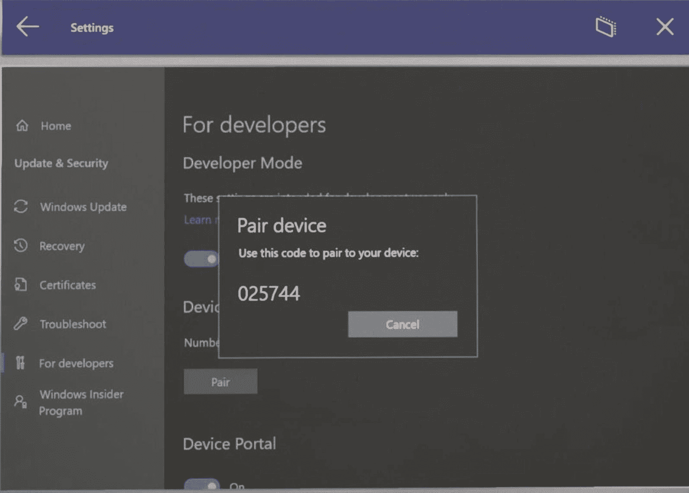

图 3-28：点击**配对**按钮后，你的 HoloLens 将显示一个 PIN 码，供你输入到 PC 上的 Visual Studio 中。注意：你的 PIN 码与本图所示不同。

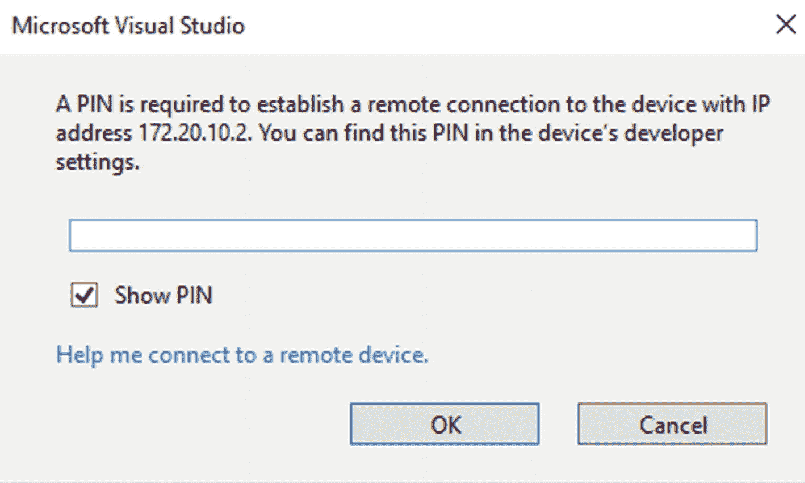

图 3-27：如果这是你首次从此 PC 部署到 HoloLens，Visual Studio 会提示你输入 PIN 码。

*   如果这是你首次从此 PC 部署到 HoloLens，系统将提示你将 HoloLens 与 Visual Studio 配对，如图 3-27 所示。要配对 HoloLens，请返回 HoloLens 设置应用中的**面向开发人员**部分，并点击**配对**按钮，如图 3-21 所示。你将看到 HoloLens 上显示一串数字（参见图 3-28 的示意），然后你可以将这些数字输入到 Visual Studio 的弹出窗口中。

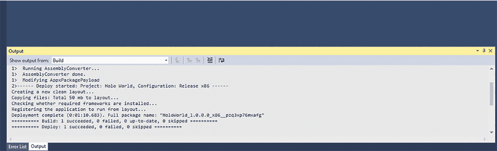

图 3-29：Visual Studio 在成功部署到 HoloLens 时显示的文本示例。

*   在 PC 上的 Visual Studio 中输入 HoloLens PIN 码后，你可以点击**完成**按钮来关闭 HoloLens 上的 PIN 码弹出窗口。

*   Visual Studio 将开始将你的应用部署到 HoloLens！你会在 Visual Studio 中看到一些输出文本，指示你的应用已成功部署到 HoloLens，类似于图 3-29。如果你收到任何错误消息并且部署失败，请检查输出以查看错误消息内容。确认你已遵循本教程中的所有步骤。即使你已正确遵循所有步骤，也可能存在其他导致部署失败的原因。例如，如果驱动器磁盘空间不足，或者 Visual Studio 未正确安装。如果某个神秘的错误阻碍了成功部署，我发现重启电脑和 HoloLens 通常有助于解决问题。其他可能的解决方案包括重建应用文件夹（删除所有内容并从 Unity 重新构建）或在 Visual Studio 中重新输入 HoloLens 的 IP 地址。

*   现在，你应该正在体验你的第一个混合现实应用。恭喜！你可以随意围绕你的全息图（立方体）走动，并从不同角度观察它。当你尝试触摸它时会发生什么？你的全息图是否位于电脑显示器或墙壁后面？如果是，请在面向开阔区域时重启你的应用。

*   你的应用现已安装在 HoloLens 上——这意味着你会在应用列表中看到它显示为 **Holo World**（如果你按照本教程中的做法将其命名为 Holo World）。

## 总结

恭喜！你已经创建了第一个全息图，正朝着成为混合现实开发者的道路大步前进。创建并看到你的第一个全息图是一种非常令人满足的体验！让我们回顾一下本章所学的内容：

*   你学习了如何使用混合现实工具包为全息开发准备 Unity。

*   你学习了如何将全息图放置到场景中。

*   你学习了如何通过使用 Visual Studio 部署应用，将其安装到 HoloLens 上。

本章中的教程是所有混合现实开发工作流程的基础构建块。

