# 4. 混合现实工具包简介

在本章中，我们将进一步了解混合现实工具包及其对混合现实开发的重要性。我们将学习混合现实工具包中包含的各种组件和示例场景，以及如何利用这个社区资源进行开发。

## 什么是混合现实工具包？

你可能会认为混合现实工具包是一个可选工具包，用于增强你的开发体验。实际上，混合现实工具包是混合现实开发的重要组成部分。混合现实工具包为开发者提供了开始开发混合现实应用所需的所有工具。本章中，我们将混合现实工具包简称为 `MRTK`。`MRTK` 提供了多平台输入系统、基础组件以及用于空间交互的通用组成部分，以便开发基于混合现实的应用。

`MRTK` 是一个社区资源，由微软及其他受信任的个人/团体监督。它旨在打破障碍，让所有人都能开发混合现实应用并为社区做出贡献。任何人（包括你）都可以向 `MRTK` 贡献内容（在纳入之前需要先经过审核）。因此，`MRTK` 在不断更新和改进。事实上，从我刚开始撰写本书到你正在阅读本章的这段时间里，它已经有了巨大的改进。在学习了本章中一些有用的 `MRTK` 功能之后，我建议你探索在线的 `MRTK` 仓库，以了解任何额外的变化。在本章末尾，我将引导你浏览在线的 `MRTK` 仓库。

### 三个 MRTK 仓库

实际上，线上有三个 `MRTK` 仓库。第一个叫做 `MixedRealityToolkit`，第二个叫做 `MixedRealityToolkit-Unity`，第三个叫做 `MixedRealityToolkit-Unreal`。你可以通过以下链接查看它们：

*   `MixedRealityToolkit`：[`github.com/microsoft/MixedRealityToolkit`](https://github.com/microsoft/MixedRealityToolkit)

*   `MixedRealityToolkit-Unity`：[`github.com/microsoft/MixedRealityToolkit-Unity`](https://github.com/microsoft/MixedRealityToolkit-Unity)

*   `MixedRealityToolkit-Unreal`：[`github.com/microsoft/MixedRealityToolkit-Unreal`](https://github.com/microsoft/MixedRealityToolkit-Unreal)

`MixedRealityToolkit-Unity` 仓库拥有 Unity 特定的组件，这也是我们本书关注的重点。“常规”的 `MixedRealityToolkit` 是一个通用版本，包含核心的 C++ 代码和 HTML 代码库，许多 Unity 工具包功能都构建于此基础之上，或者仅仅是其包装器。`MixedRealityToolkit-Unreal` 提供了一系列功能和选项，以增强使用 Unreal 的开发流程。我们将在本章末尾详细介绍 GitHub。

## 混合现实工具包设置

在本节中，我将带你完成下载和安装 `MRTK` 的步骤。有两种方法可以将混合现实工具包导入到你的 Unity 项目中：

*   通过导入混合现实工具包资源文件

*   通过 Unity 包管理器


### 1. 导入 MRTK 资源文件

要下载 MRTK Unity 包，请访问以下 URL：

[`https://github.com/microsoft/MixedRealityToolkit-Unity/releases`](https://github.com/microsoft/MixedRealityToolkit-Unity/releases)

请确保下载 MRTK 的最新版本，通常位于页面顶部附近。确保你下载的 MRTK 版本与你下载的 Unity 版本兼容。向下滚动到页面的 **Assets** 部分。要下载 MRTK Unity 包，请点击扩展名为 `.unitypackage` 的下载链接。例如，在图 4-1 中，合适的下载链接（用红圈标出）名为 `Microsoft.MixedReality.Toolkit.Unity.Foundation.2.5.3.unitypackage`。

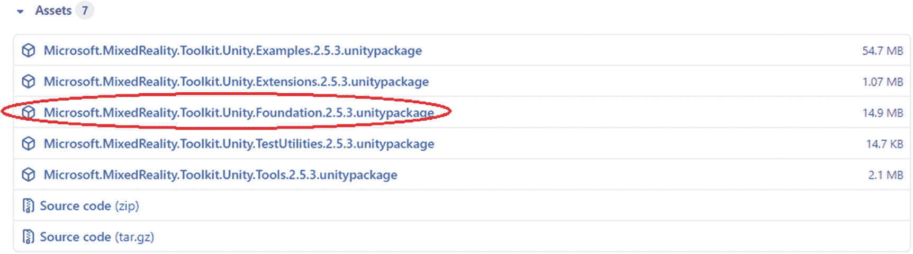

图 4-1 – 浏览到 MRTK 下载页面并下载 MRTK Unity 包，用红圈标出。

将 MRTK 保存到你的电脑上。使用适当的名称启动一个新项目；请参考前一章了解一些注意事项。在你的 Unity 项目的菜单栏中，转到 **Assets ➤ Import Package ➤ Custom Package**。在弹出的窗口中，浏览到你刚刚下载的 MRTK。有关这些菜单项的图示，请参见图 4-2。

Unity 将花一点时间准备你选择的包，然后显示另一个弹出窗口，你可以在其中选择或取消选择包项。保持所有选项勾选（默认情况下应全部勾选），然后点击 **Import** 按钮，如图 4-3 所示。


图 4-2 – 导入你在第 1 章中下载的 MRTK 包。

完成这些步骤后，MRTK 现在将安装到你的项目中。

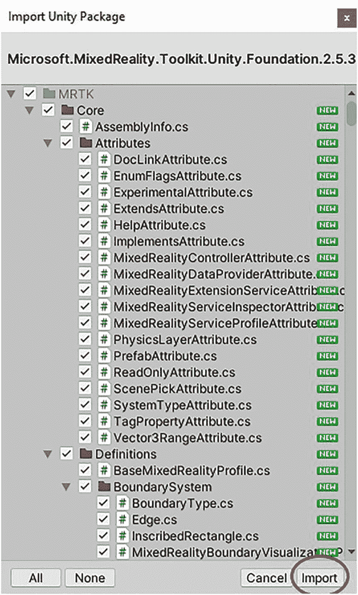

图 4-3 – 点击 **Import** 按钮导入 MRTK 包。

### 2. Unity 包管理器

安装 Mixed Reality Toolkit 的另一种方法是通过 Unity 包管理器。Unity 包管理器使用一个清单文件（`manifest.json`）来控制要安装哪些包以及从哪些服务器安装它们。对于每个使用 MRTK 的 Unity 项目，请确保 `manifest.json` 文件中添加了一个 Mixed Reality 作用域注册表。要添加 Mixed Reality 作用域注册表，请遵循以下说明。

首先，使用适当的名称创建一个新的 Unity 项目。打开你的项目文件夹，导航到 `Packages` 文件夹。在 `Packages` 文件夹中，使用任意文本编辑器（如 Visual Studio 2019）打开 `manifest` 文件。在清单文件的开头，添加代码清单 4-1 中给出的代码，以将 Mixed Reality Server 包含到作用域注册表中（在包含包之前拥有服务器至关重要）。有关这些项的图示，请参见图 4-4。

```
{
"scopedRegistries": [
{
"name": "Microsoft Mixed Reality",
"url": "https://pkgs.dev.azure.com/aipmr/MixedReality-Unity-Packages/_packaging/Unity-packages/npm/registry/",
"scopes": [
"com.microsoft.mixedreality",
"com.microsoft.spatialaudio"
]
}
],
代码清单 4-1 – 将 Mixed Reality Server 添加到作用域注册表的代码。
```

添加以下代码后，你的文件看起来应该类似于图 4-4。将 Mixed Reality Server 添加到作用域注册表是一个关键步骤，因为只有在包含 Mixed Reality Server 之后，才能添加所需的包。

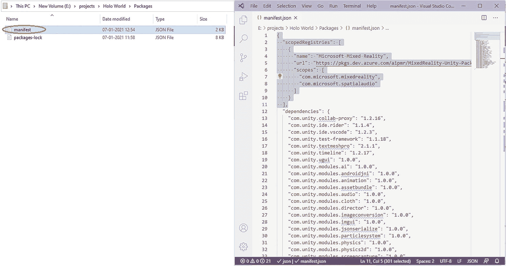

图 4-4 – 打开 `manifest` 文件并在文件开头添加给出的代码。

一旦将 Mixed Reality Server 添加到文件中，你就可以开始添加所需的包。要将 MRTK 包添加到你的项目中，你需要修改 `manifest` 文件的依赖项部分。代码清单 4-2 中的代码允许你将基础、示例和工具包添加到你的 Unity 项目中。标准资源包将作为基础的依赖项自动添加。图 4-5 展示了代码的图示。

```
"dependencies": {
"com.microsoft.mixedreality.toolkit.foundation": "2.5.3",
"com.microsoft.mixedreality.toolkit.tools": "2.5.3",
"com.microsoft.mixedreality.toolkit.examples": "2.5.3",
代码清单 4-2 – 将所需包添加到 Unity 项目的代码。
```

**注意：** 添加代码后，不要忘记保存你的 `manifest` 文件。

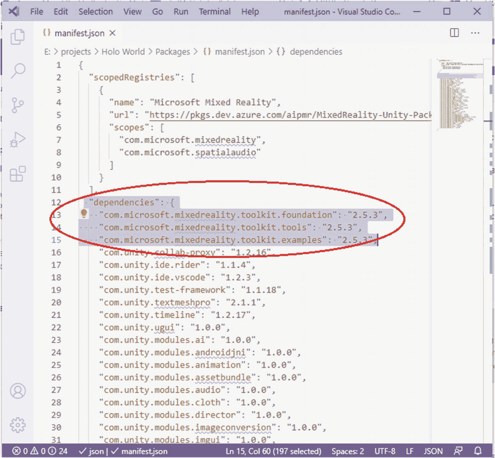

图 4-5 – 代码的图示。

当你返回项目时，会看到一个 MRTK 配置器窗口弹出；你可以点击 **Apply** 将设置保存到项目。现在，你已经成功将包添加到 Unity 项目中；你可以通过 Unity 包管理器用户界面来管理它们。要打开 Unity 包管理器，请点击 Unity 项目菜单栏上的 `Windows` 选项，然后选择 `Package Manager`。会弹出一个窗口，如图 4-6 所示。

**注意：** 当有更新版本的 MRTK 包可用时，你也可以观察到 `Up to date`（最新）按钮变为活动状态。如果有可用的更新版本，请随意点击 `Up to date` 按钮来使用新版本。

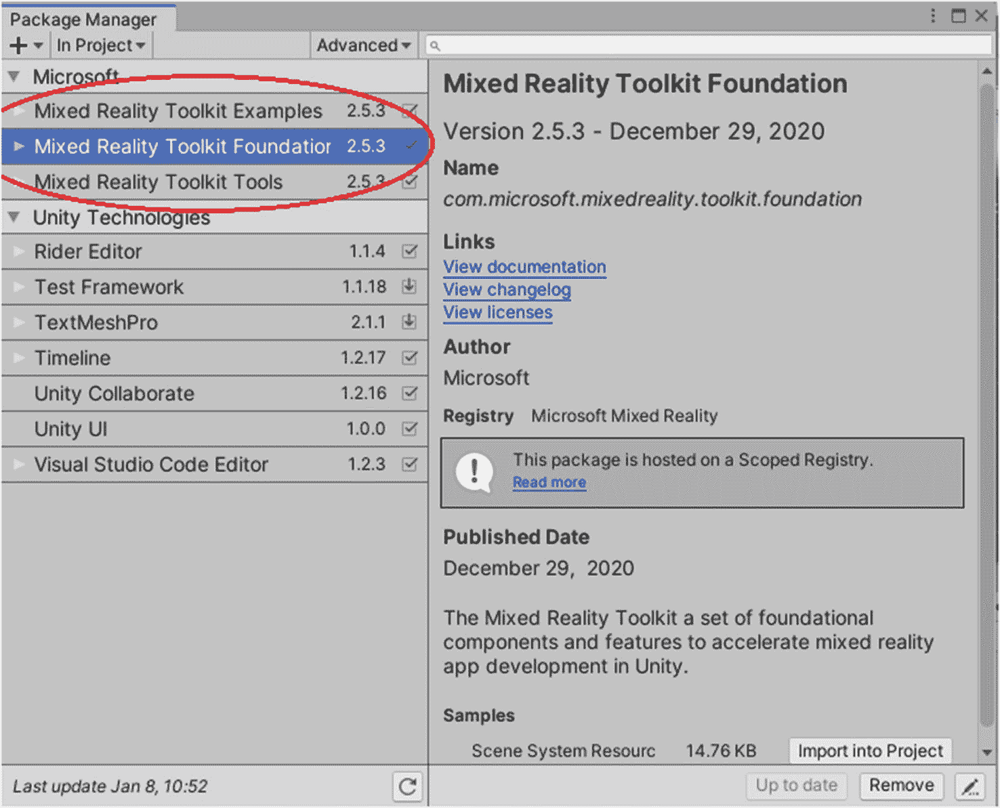

图 4-6 – Unity 包管理器显示通过 `manifest.json` 文件安装的包。

在你保存了包含必要依赖项的清单文件后，MRTK 现在将安装到你的项目中。请随意遵循前面提到的两种方法中的任何一种来安装 MRTK。

**注意：** 每次启动新的 Unity 项目时，你都需要导入 MRTK。


## 混合现实工具包组件

本章现在进入激动人心的部分，我将向您介绍 `MRTK` 的各个组件。`MRTK` 包含多个功能领域。表 4-1 列出了每个功能领域并提供了简要描述。

表 4-1

展示 `MRTK` 中可用的组件列表

| 功能领域 | 描述 |
| --- | --- |
| 输入系统 | 允许开发者通过多种输入源（例如六自由度控制器和语音）通过输入事件提供输入 |
| 手部追踪 | `MRTK` 中的手部追踪组件提供了一种全新的临场感，并增强了社交互动。该功能帮助用户获得与周围环境更自然交互的机会 |
| 眼动追踪 | 眼动追踪是 `HoloLens` 提供的另一突出功能；它使用户能够毫不费力地与人机界面中的全息影像进行交互。下一章将详细讨论 |
| 解算器 | 允许开发者基于预构建算法计算对象的位置和方向 |
| 多场景管理器 | 场景系统允许应用程序加载多个场景，为用户建立舒适体验 |
| 空间感知 | 允许您的应用程序理解物理环境。例如，它可以区分椅子、桌子和其他常见结构 |
| 诊断工具 | 在应用程序内部运行以检查应用程序问题的工具 |
| 编辑器内模拟 | 允许用户通过 Unity 编辑器测试其应用程序功能，而无需将其部署到设备上 |
| 边界系统 | 边界系统允许在混合现实应用中呈现虚拟现实边界 |
| 用户体验控件 | 一组有用的实用工具，例如按钮、解算器、边界控制、滑块、用于配置 Unity 的指针等 |
| 相机系统 | 相机系统允许 `MRTK` 自定义应用程序的相机，以包含在混合现实应用中 |
| 配置文件 | 允许开发者使用基础包中提供的各种配置文件来配置 `MRTK` |
| MRTK 标准着色器 | 着色系统利用一个灵活着色器，成功提供与 Unity 标准着色器相似的视觉效果 |
| 语音与听写 | 允许用户通过关键词提供输入，这些关键词可以触发相应的事件。听写为用户提供了录制音频片段并获取书面文本的机会 |
| 实验性功能 | 包含正在开发的功能以及具有较高初始价值的功能 |

在接下来的小节中，我将讨论这十个功能类别中的重点内容。我们将在后续章节中更详细地介绍其中一些功能。有些功能甚至有专门的一章来介绍！

### MRTK：输入系统

`MRTK` 的输入系统允许您通过输入事件从不同的输入源（如手势、六自由度控制器、手部和语音）获取输入。它甚至允许您包含菜单等理论操作，并将它们与不同的输入源关联起来。您可以为控制器设置指针，通过指针事件驱动场景中的对象。

输入数据提供程序将用户输入整合在一起。每个数据提供程序基于接收到的输入而不同，例如 Unity 触摸、Unity 摇杆、Windows 语音、Windows 混合现实（`WMR`）等。这些提供程序通过“已注册的服务提供程序配置文件”包含在您的项目中，当输入源可用时，该配置文件会自动产生输入事件。

有大量的示例场景，您可以在其中测试输入功能集中包含的各种功能。示例场景是探索 `MRTK` 功能并为自己的项目获取灵感的好方法！我经常将示例场景作为自己项目的模板。`MRTK` 的所有功能都有数十个示例场景。下面我们来看看如何探索其中一个示例场景。

提示

示例场景是查看 `MRTK` 项目实际效果并学习如何实现它们的绝佳方式。您还可以将示例场景用作下一个项目的模板！

#### 如何运行测试场景

示例场景通常位于名为“Scenes”的项目文件夹中。在输入功能区域内，您可以通过转到 `Assets` ➤ `MRTK` ➤ `Examples` ➤ `Demos` 来找到场景文件夹，如图 4-7 所示。每个功能组的文件夹组织可能略有不同。`MRTK` 中的文件夹组织会随时间演变，因此如果您在您的 `MRTK` 版本中找不到测试场景，请务必探索项目文件夹或查看最新的 `MRTK` 文档。

注意

请确保导入 Unity 示例包，以便使用 `MRTK` 中提供的示例场景。请参考前一章，了解如何导入 Unity 包。

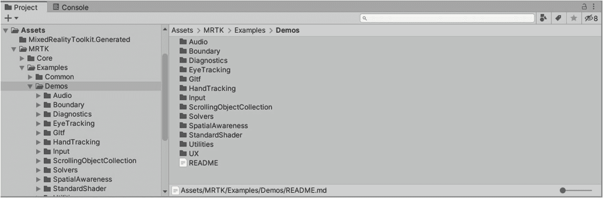

图 4-7

导航到 `Demos` 文件夹，尝试与不同 `MRTK` 功能相关的各种示例场景

项目面板中的资源名称可能被缩短（将显示部分名称，后跟“...”）。如果您希望查看完整名称，可以像图 4-7 右下角所示，通过调整滑块来调整图标视图。

在 Unity 编辑器中，导航到 `Assets` ➤ `MRTK` ➤ `Examples` ➤ `Demos` ➤ `Input` ➤ `Scenes`，选择您想尝试的场景（在本例中为 `InputActionExample` 场景），然后将其从项目面板拖到层级面板中的空白区域，如图 4-8 所示。

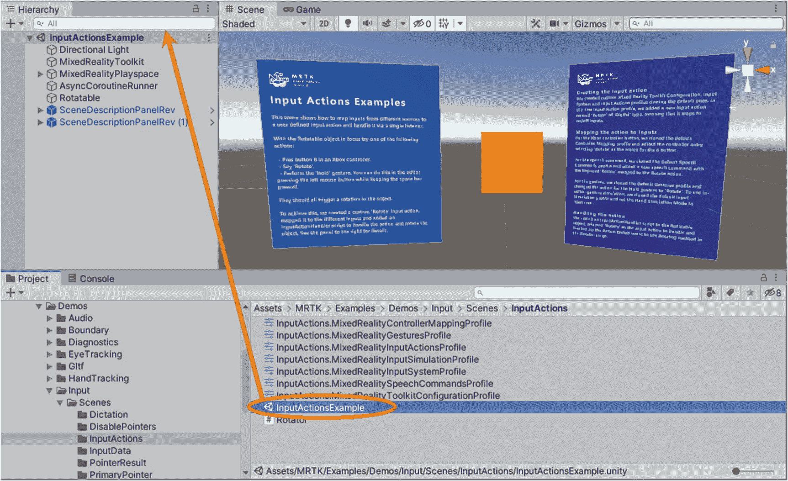

图 4-8

要探索示例场景，请将其拖入层级面板中

为避免冲突，请右键单击其他场景并从上下文菜单中选择“卸载场景”来禁用任何其他打开的场景。卸载场景将暂时禁用它，从而可以快速轻松地切换场景。如果您不再希望处理某个场景，也可以选择“移除场景”。如果您并非有意从 Unity 项目中移除该场景，仍可从项目面板中重新导入。

现在您已加载示例场景，请通过点击播放按钮随意尝试。您也可以将其部署到 `HoloLens 2`，或使用全息仿真将其流式传输到您的设备。这是探索所用代码并了解测试项目工作原理的绝佳机会！`MRTK` 中包含许多示例场景。我建议您尽可能多地尝试它们！


### MRTK：手部追踪

MRTK 提供的手部追踪功能旨在为用户带来更沉浸的体验，让用户能够运用双手与场景中的组件进行交互。MRTK 的手部追踪特性可根据用户需求进行定制，只需在 `InputSystemProfile` 下的 `HandTrackingProfile` 中更改几项设置即可。你需要克隆 `InputSystemProfile` 和 `HandTrackingProfile` 才能访问部分设置。更多信息请参考图 4-9。

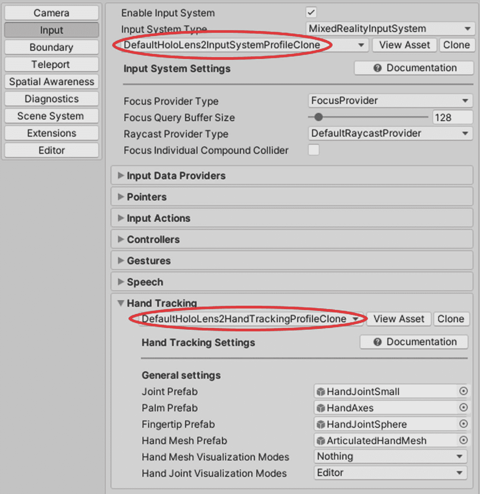

图 4-9

`HandTrackingProfile` 及其选项

`Joint Prefab`、`Palm Prefab`、`Fingertip Prefab` 和 `Hand Mesh Prefab` 有助于在屏幕交互过程中对手部进行可视化。你可以根据需要更改预制件，但建议保留默认设置，以防止未来出现错误。手部追踪可以通过 Leap Motion（由 Ultraleap 提供）实现。这种方法有助于在编辑器中快速构建应用程序原型。`Leap Motion Data Providers` 授权了用于 VR 的铰接式手部追踪。可以将数据提供程序配置为使用连接到头显的 Leap 控制器，或将其面朝上放置在桌面上。

### MRTK：解算器系统

解算器系统可帮助你为对象添加定位功能。它基于预置的算法帮你计算对象的位置和朝向。这是一系列脚本和动作的集合，使对象能够跟随你或屏幕上的其他对象。你也可以将对象附着在不同的位置，使你的应用程序更加自然。例如，你可以观察到 HoloLens 菜单跟随你的视线转动。这样做将使用户使用应用程序更加方便。

解算器系统包含三种类型的脚本，如下所示：

- `Solver`：这是一个基础的抽象类，负责管理状态跟踪、更新顺序、平滑参数及其实现，以及自动解算器系统集成。所有其他解算器都派生自此类。
- `SolverHandler`：`SolverHandler` 类处理附加到特定游戏对象上的所有解算器组件。此类还有助于按正确顺序更新和执行它们。

第三种类型包含解算器本身。以下解算器构成了各种行为的基础模块：

- `RadialView`：`RadialView` 是一个伴随组件，负责将游戏对象的一部分保持在用户视野的截断区域（安全区）内。用户可以调整对象在视野中可见的部分。
- `Orbital`：`Orbital` 类也是一个伴随组件，其行为类似于原子中的电子。此类允许用户使附加的游戏对象围绕被追踪的变换（transform）进行轨道运动。开发者可以根据需要修改固定偏移量。开发者可以利用此功能制作菜单或其他场景组件，使其保持在视线高度或腰部高度。
- `InBetween`：`InBetween` 类将附加的游戏对象保持在两个被追踪的变换（transform）之间。该游戏对象拥有自己的 `SolverHandler` 属性，用于定义两个变换的端点。
- `SurfaceMagnetism`：`SurfaceMagnetism` 向表面发射射线，并使对象对齐以相应地撞击表面。用户在使用 `SurfaceMagnetism` 时必须注意添加到游戏对象上的碰撞体。
- `DirectionalIndicator`：顾名思义，`DirectionalIndicator` 帮助用户指向空间中的期望位置。这对用户非常有益，因为它有助于方便地导航对象。
- `HandConstraint`：`HandConstraint` 提供了一个保持在安全区域的解算器。安全区域是指不与手部重叠的区域。存在不同的派生类，负责在安全区域内执行不同的解算器。

让我们尝试一下 Unity 示例包中包含的一个示例场景。首先，创建一个新的 Unity 项目并为其指定一个合适的名称。将 foundation 和 examples Unity 包导入到你的项目中；有关导入 Unity 包的步骤，请参考前一章。导航至 `Assets ➤ MRTK ➤ Examples ➤ Demos ➤ Solvers ➤ Scenes`，如图 4-10 所示。将 `SolverExamples` 示例场景拖放到你的层级（Hierarchy）窗口中即可查看该场景。你可以卸载或移除层级窗口中存在的任何其他场景，以避免冲突。

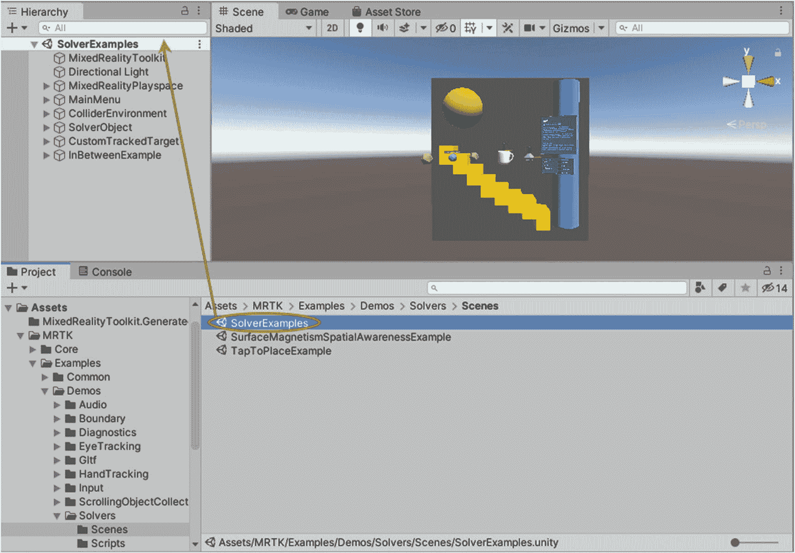

图 4-10

要探索 `SolverExamples` 示例场景，请将其拖入你的层级（Hierarchy）窗口

加载示例场景后，你可以通过点击播放按钮来探索可用选项。此示例场景让你对不同解算器的工作方式有一个初步了解。你可以参考蓝色平面上显示的主菜单，以清晰了解示例场景的运行方式。

### MRTK：多场景管理器

如果你想在不干扰 MixedRealityToolkit 实例的情况下运行多个场景，该怎么做？MRTK 为你提供了一种无需复杂操作的方案。它可以帮助你加载各种场景以增强体验。你可以通过 `SceneSystem` 提供的各种属性来监控场景的加载和卸载状态。`SceneOperationInProgress` 初始时会被设置为 0；一旦场景完全加载，`SceneOperationInProgress` 将被设置为 1。这些属性仅受内容场景操作的影响。

你可以通过在代码中包含 `using Unity.SceneManagement` 命名空间来在场景之间切换。包含命名空间后，使用 `SceneManager.LoadScene`，并添加场景索引值。场景索引值通常从第一个场景的 0 开始；你可以像图 4-11 所示那样，在“构建设置”（Build Settings）窗口中，通过按你想要的顺序将场景拖放到“场景列表”（Scenes In Build）区域来验证场景索引值，具体如图 4-11 所示。

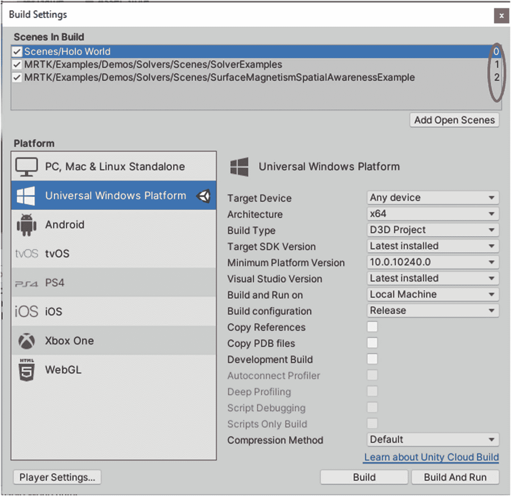

图 4-11

在“构建设置”中验证场景索引值

主要有三种场景：

- **内容场景：** 内容场景是你经常处理的普通场景。可以加载和卸载任何内容及对象。
- **管理器场景：** 管理器场景是默认创建的场景。它可以包含在其下不应被销毁的对象，并作为 `DontDestroyOnLoad` 的替代方案。
- **光照场景：** 在多个场景之间调整和维护光照设置是一项繁琐且重复的任务。通过使用存储光照信息和光照对象的光照场景，可以克服这些缺点。光照场景确保无论加载或卸载哪个场景，跨多个场景的光照效果是一致的。


### MRTK：空间感知

MRTK 的空间映射模块为您提供了在项目中集成空间映射能力所需的资源。空间映射利用混合现实头显上的传感器，创建物理环境的虚拟地图。MRTK 提供的资源可用于利用此地图或网格来隐藏或遮挡网格后的对象、与网格进行交互以及进行可视化。我们将在第 6 章深入探讨空间映射。

空间理解是 MRTK 附带的一项卓越能力，它使我们的混合现实体验能够理解空间环境。基于空间映射获取的精确测量数据，该模块会解读空间网格，并判断网格的哪些部分是墙壁、桌子、椅子等！混合现实应用可以通过多种方式使用此功能。例如，在游戏过程中，您可以让一个全息角色或虚拟化身坐在您房间的椅子上。要实现这一点，您需要空间理解模块来找出房间中可作为坐具表面的部分，如图 4-12 所示。我们将在第 6 章介绍空间理解。

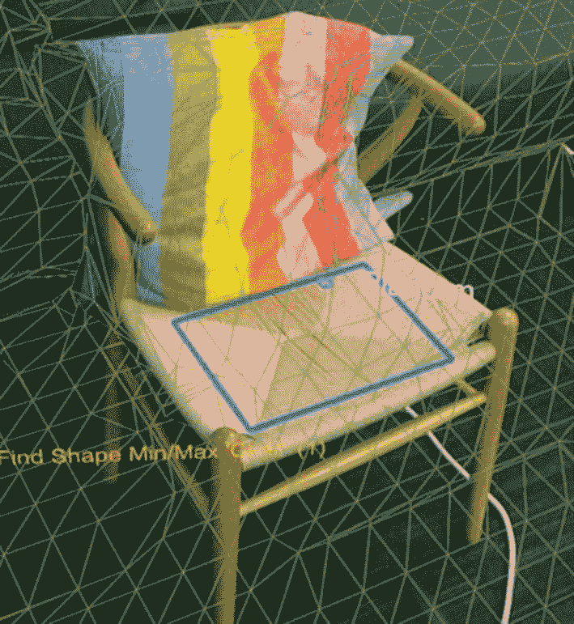

图 4-12

使用空间理解模块查找椅子坐具表面的示例

### MRTK：诊断工具

MRTK 提供了通过在应用程序中运行的诊断工具来分析应用程序的机会。强烈建议在开发初期启用诊断系统，并在部署过程中将其禁用。诊断工具对于监控系统性能非常有用；它们为您提供有关系统硬盘、RAM、CPU 温度等信息。这些工具有助于您识别影响系统性能的一些问题。

### MRTK：边界系统

边界在沉浸式应用中扮演着重要角色，因为它定义了您可以安全移动的区域。在使用头显时，它还有助于您避开场景中隐藏的障碍物。MRTK 中的边界系统为混合现实应用提供了边界可视化功能。通常，在虚拟现实平台中，会有一条白色线条叠加在虚拟世界上，以警告您边界所在。MRTK 的边界系统通过显示已追踪区域的轮廓和其他功能，将此便捷功能扩展到混合现实应用中，为您提供有关周围环境的额外数据。

### MRTK：UX 控件

MRTK 的实用工具模块提供了多个可用于混合现实应用的有用工具。我建议您探索 MRTK 中的这个模块，并阅读在线文档以获取最新的工具列表，因为新工具会定期添加到该模块中。下文列出了并描述了 MRTK 中包含的一些最常用且最有用的工具。这远非一份详尽的清单，但可以让您初步了解此模块中包含的工具类型。

*   **按钮：** 按钮作为一种用户界面，用于收集您的输入并执行即时操作。它是 MRTK 中最基础的组件。MRTK 提供了一系列按钮预制件，可供您在应用程序中使用。

    以下为您列出了其中一些：
    *   `PressableButtonUnityUI.prefab`
    *   `PressableButtonUnityUICircular.prefab`
    *   `PressableButtonHoloLens2UnityUI.prefab`
    *   `UnityUIInteractableButton.prefab`

*   **手部菜单：** 每次您抬起手时都能弹出一个菜单，这该有多酷？MRTK 允许您将常用的 UI 菜单附着到您的手上。当您尝试使用应用程序中的其他选项时，可能会产生很多混淆，但手部菜单会一直弹出。有 “Require Flat Hand” 和 “Use Gaze Activation” 等支持选项来避免误触。

*   **滑动条：** 滑动条是 MRTK 中的 UI 组件，允许您连续地更改数值。滑动条在 AR 和 VR 中均可工作。目前，通过直接抓取或在一定距离外抓取滑动条来更改数值。您可以添加自己设定长度和尺寸的滑动条。

*   **工具提示：** 如果场景中的对象附带一些信息，它们会更有意义。要为背景中的任何对象添加额外的细节，您可以加入工具提示。工具提示可用于解释物理环境中的对象。

*   **面板：** `Slate` 预制件是在屏幕上显示 2D 内容的绝佳替代方案；它提供了一种薄窗样式的控件来显示文本或文章等 2D 内容。额外的功能，如 “Follow Me”（跟随我）和 “Close”（关闭），可帮助您轻松操作该预制件。

### MRTK：相机系统

Microsoft 混合现实工具包中的相机系统允许您自定义和优化相机，以便在您的混合现实应用程序中使用。相机系统支持透明（AR）和不透明（VR）应用程序，而无需为每种应用编写不同的脚本。可以使用 `Near Clip`（近裁剪面）、`Far Clip`（远裁剪面）、`Clear Flags`（清除标志）、`Background Color`（背景颜色）、`Quality Setting`（质量设置）等参数来配置相机系统。

可以通过在层级窗口中找到的 `MixedRealityToolkit` 对象来访问相机系统。导航到检查器面板下的 “Camera”（相机）选项卡，确保已勾选 “Enable Camera System”（启用相机系统）复选框，如图 4-13 所示。您还可以自定义相机系统类型和使用的配置文件。

要提供特定于平台的相机配置，您可以在 “Camera Settings Providers”（相机设置提供程序）处进行配置。您可以在此部分添加和删除相机设置提供程序。并非所有应用程序都需要相机设置提供程序。如果没有与平台兼容的提供程序，则 MRTK 将应用默认设置。

显示设置允许用户在运行时配置相机。它们还提供在不透明和透明背景之间切换的选项。场景中图形的质量可以使用图 4-13 中 “Display Settings”（显示设置）下的 “Quality Setting”（质量设置）选项进行调整。

> **注意**  
> 您可能需要克隆一些配置文件才能配置上述设置。下一节将简要介绍如何克隆 MRTK 配置文件。

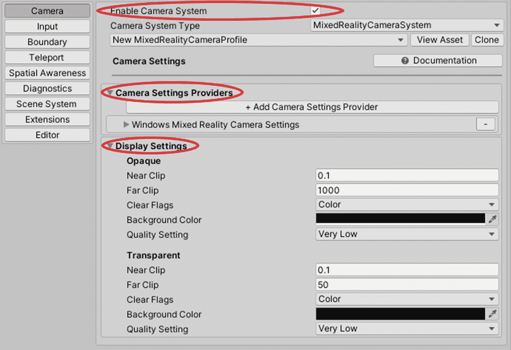

图 4-13

MRTK 提供的相机系统设置


### MRTK：配置文件

`MRTK` 中的 `Profiles`（配置文件）允许你根据项目需求配置 `MRTK` 设置。层级窗口中的主 `MixedRealityToolkit` 对象会附加一个处于激活状态的配置文件，该配置文件是可脚本化的。顶层配置文件包含与每个核心系统相关联的子配置文件。这些子配置文件也是可脚本化对象，并且可能包含对其他配置文件的引用。一个完整的配置文件关联树规定了如何初始化及配置 `MRTK` 的子系统与功能。

我们知道，某些数据提供者会处理跨多个平台的特定框架。通过这种方式，我们可以设计出与机器无关或平台无关的应用程序，从而提升应用的灵活性。配置文件有助于你以前述方式构建应用。`MRTK` 提供了默认配置文件集，这些配置文件覆盖了 `MRTK` 所能支持的大多数平台和场景。例如，当你选择 `DefaultMixedRealityToolkitConfigurationProfile` 时，可以在支持 VR 的平台和 `HoloLens`（一代或二代）上尝试各种场景。此配置文件适用于一般用途，并未针对特定用例进行优化。如果你希望专注于某个特定平台的特定实例，可以选择支持相应设置的配置文件。

例如，`DefaultHoloLens2ConfigurationProfile` 是另一个默认配置文件，它针对在 `HoloLens 2` 上进行部署和测试进行了优化。默认配置文件与 `HoloLens 2` 配置文件之间存在差异，旨在提供特定于该平台的更优设置和选项。要自定义不同配置文件提供的某些选项，你需要创建它们的副本。请按照以下说明创建 `MRTK` 配置文件的副本：

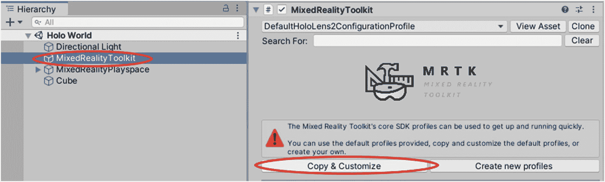

图 4-14

复制并自定义所选配置文件

1.  点击层级窗口中的 `MixedRealityToolkit` 对象。
2.  导航到检视面板，从下拉菜单中选择你需要的配置文件，如图 4-14 所示。此处我选择了 `DefaultHoloLens2ConfigurationProfile`。
3.  点击 `Copy & Customize`（复制并自定义）按钮。

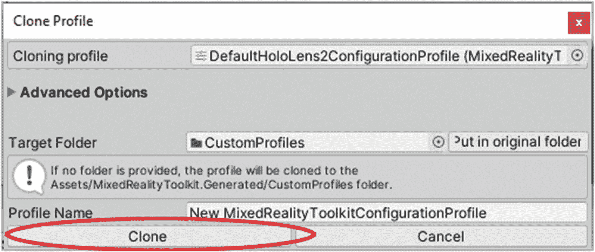

图 4-15

点击 `Clone`（克隆）按钮创建配置文件的副本

1.  点击 `Copy & Customize` 按钮后，会弹出一个克隆配置文件（Clone Profile）窗口。为新建的克隆配置文件指定一个合适的名称，然后点击图 4-15 中显示的 `Clone` 按钮。

完成这些步骤后，你可能会发现克隆配置文件后某些选项变为可用状态。请参考图 4-16 查看克隆后你的 Unity 环境。为进一步自定义某些功能，你还需要克隆子配置文件。点击这些子配置文件旁边的 `Clone` 按钮，即可调出克隆配置文件（Clone Profile）窗口。

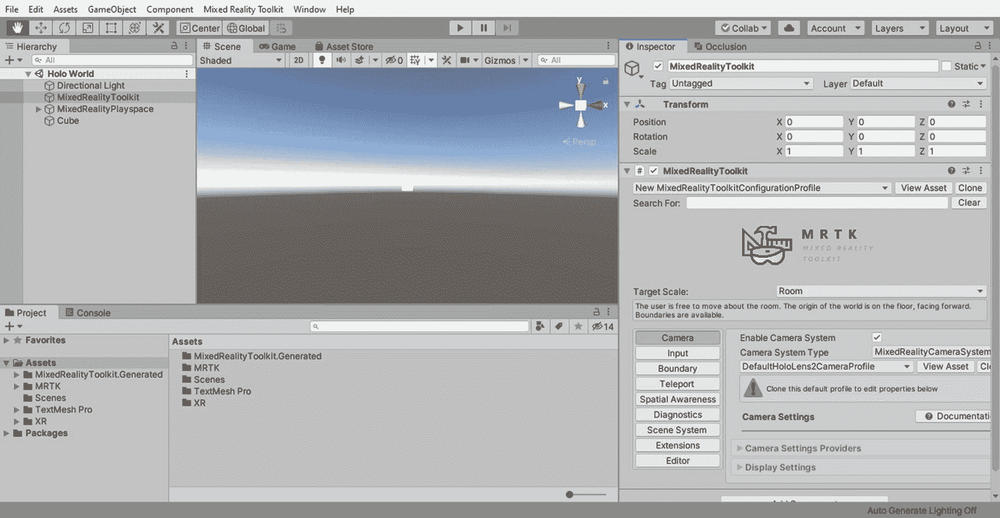

图 4-16

克隆后你可能会发现某些选项被激活

### MRTK：标准着色器

`MRTK Standard Shader`（MRTK 标准着色器）是一个单一的可工作着色器，能够生成与 Unity 的 `Standard Shader` 相似的视觉效果。它允许你根据材质属性自动生成特殊着色器。在性能方面，`MRTK Standard Shader` 优于 Unity 的 `Standard Shader`。与 Unity 的 `Standard Shader` 相比，`MRTK Standard Shader` 在产生类似效果时所需计算量更少。

## MRTK 在线资源

如前所述，`MRTK` 正由使用它的开发者社区持续更新和改进。在本节中，我们将了解在线的 `MRTK` 仓库，以便你能及时了解最新的更新、问题和改进。

### 什么是 GitHub？

如果你不熟悉 `GitHub`，它是开发者中常用的用于存储和共享软件项目文件的网站。它允许对项目文件的变更进行仔细的监控、批准或拒绝，这使其成为众多开发者同时使用和修改项目时的理想平台。

### MRTK 帮助与文档

截至撰写本文时，寻找 `MRTK` 组件的所有文档确实颇具挑战性且略显分散。我在此提供了一些链接，以帮助你快速访问 `MRTK` 的文档：

-   [*https://github.com/microsoft/MixedRealityToolkit-Unity/blob/mrtk_development/README.md*](https://github.com/microsoft/MixedRealityToolkit-Unity/blob/mrtk_development/README.md) – `MixedRealityToolkit-Unity` 的自述文件（readme）部分包含了 `MRTK` 中每个功能/模块的详细文档。
-   [*https://github.com/Microsoft/MixedRealityToolkit-Unity/wiki*](https://github.com/Microsoft/MixedRealityToolkit-Unity/wiki) – `MixedRealityToolkit-Unity` 的 Wiki 包含些功能的额外上下文和背景信息。我建议你在阅读自述部分的详细文档之前，先阅读此处的内容。`MRTK` Wiki 的主页包含一些链接，Wiki 网页右侧的“Pages”（页面）栏中也有一些额外链接。
-   [*https://github.com/microsoft/MixedRealityToolkit-Unity/issues*](https://github.com/microsoft/MixedRealityToolkit-Unity/issues) – `MRTK` 的问题（issues）部分对于了解你在使用 `MRTK` 时可能遇到的任何未解决问题非常重要。如果你发现了任何新问题，也可以在此区域进行报告。

## 总结

在本章中，我们熟悉了七个 `MRTK` 功能或模块。我们了解了什么是 `MRTK` 以及它在开发混合现实体验时的重要性。我们学习了如何下载和安装 `MRTK`，如何试用 `MRTK` 附带的测试场景，以及如何浏览在线仓库。

`MRTK` 是一个活跃的社区资源，它不断变化和演进。新功能几乎每天都在添加，旧功能则会被弃用（删除或废弃）。因此，我建议你去探索 `MRTK`，发现可能添加的任何令人惊叹的新功能。并且，随着你在混合现实之旅中的不断前进，你很可能会为 `MRTK` 贡献出令人振奋的新内容，让其他用户也能从中受益！

