# 5. 与全息影像交互

在本章中，我们将学习混合现实开发中使用的输入机制。用户可以通过多种方式与应用程序中的全息影像及其他元素进行交互。这些方式包括手势、语音命令、注视和控制器。我们将逐一介绍每种输入方法，并学习如何使用 `MRTK` 中的输入资源。


## 输入方式

每种用于 Windows 混合现实的输入方式都有其优势和局限性。以下列表提供了各输入类别的说明：

- **视觉注视：** 在 Windows 混合现实中，视觉注视是用户聚焦全息图和物体的主要方式。视觉注视对混合现实的重要性，就如同鼠标对个人电脑一样。你用鼠标指向电脑屏幕上的对象。同样地，你用视觉注视（你看的方向）来指向三维空间中的对象。在电脑屏幕上，鼠标的位置由光标或箭头表示。视觉注视光标通常表现为一个小点或甜甜圈形状的物体。目前，视觉注视由头部运动控制，而非眼睛的实际注视。在混合现实中有多种使用视觉注视的方式，例如指向物体、指向远处位置（用于瞬移），以及让物体跟随你的视线。

    **注意：** 某些混合现实头戴设备可能没有支持手势的传感器，而是依赖运动控制器作为其主要输入方式。

- **语音：** 语音输入是指使用语音命令来与混合现实体验进行交互。语音命令在开发混合现实应用时极其有用，因为它无需杂乱的用户界面即可实现高度控制和自定义。用户可以说出单个词或一系列词来选择物体、激活功能以及增强体验。语音还可用于听写单词和句子（语音转文本），以实现快速文本输入，而无需使用键盘。当设备连接到互联网时，语音识别会更准确。这是因为你的语音数据将被发送到微软基于云的语音识别技术。当在线语音识别设置关闭时，语音服务将仅限于使用基于设备的识别功能，如 Windows 语音识别应用。语音识别仍然有效，但微软不会收集任何语音数据。

- **其他硬件：** 除了已列出的主要输入方式外，还有多种硬件选项可与 Windows 混合现实头戴设备配合使用。这些设备包括蓝牙键盘和鼠标、蓝牙游戏手柄、点击器及其他蓝牙配件。

在本章的后续部分，我将带你了解如何在混合现实应用中使用每种输入方式。

## 视觉注视教程

在本节中，我将带你了解与视觉注视输入方式相关的一些关键元素。我将展示如何使用光标来表示你的视觉注视，并概述视觉注视在代码中如何实现。视觉注视有两种形式：头部注视和眼部注视。头部注视基于相机/头部的朝向。当系统不支持眼部注视或眼部注视未启用时，会使用头部注视。它通常与 HoloLens 1 的交互方式相关联。眼部注视则基于用户看的方向。眼部注视仅在支持眼球追踪的系统中启用。以下是一个简单的示例场景，有助于你更好地理解眼部注视。

## 第 1 步：设置 Unity 场景

在本教程中，我们将使用混合现实工具包中的一个测试场景。如果你还没有完成，请务必按照第 4 章所述将 Unity 设置为用于混合现实开发。你也可以参考第 4 章，复习如何在 Unity 中运行 MRTK 测试场景。

导航到 `Assets ➤ MRTK ➤ Examples ➤ Demos ➤ Eye Tracking ➤ Scenes`。将 `EyeTrackingDemo-00-RootScene` 拖入你的层级视图中，如图 5-1 所示。确保移除你可能打开的其他所有场景。

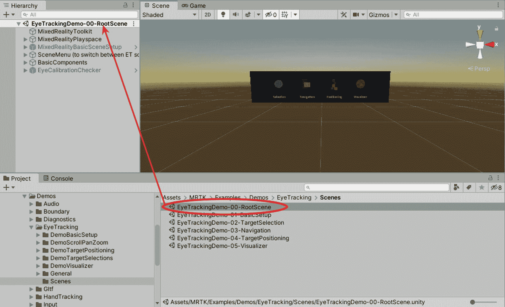

**图 5-1** 从 MRTK 中打开 `EyeTrackingDemo-00-RootScene`

`EyeTrackingDemo-00-RootScene` 是基础场景，在尝试眼部注视的不同功能之前需要先加载该场景。该场景包含一个图形菜单，其中包含不同的眼部注视示例，你可以自由切换并体验！目前，我们先关注目标选择示例，看看它是如何工作的。

## 第 2 步：将场景添加到构建菜单

要尝试此功能，你需要将其余场景添加到构建菜单中。首先将场景拖放到 `Build Settings ➤ Scenes In Build` 菜单中，如图 5-2 所示。

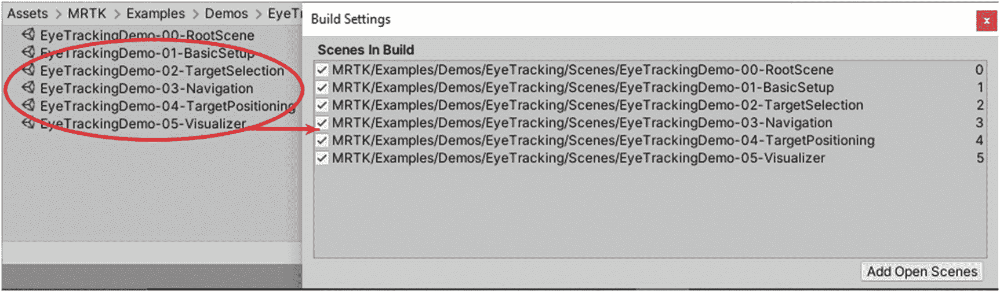

**图 5-2** 显示正在将场景添加到 `Scenes In Build` 菜单

在层级视图中导航到 `MixedRealityBasicSceneSetup`，并确保已勾选 `OnLoadStartScene` 脚本旁边的复选框，如图 5-3 所示。这有助于根场景了解先加载哪个演示场景。

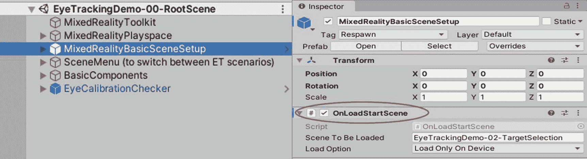

**图 5-3** 确保 `OnLoadStartScene` 脚本已启用

## 第 3 步：尝试场景！

在示例场景中，你应该只会看到一个带有四个选项的图形菜单：选择、导航、定位和可视化。请点击播放按钮尝试该场景。你可以随时在 Unity 编辑器中测试，或将应用部署到你的设备上。

让我们探索图形菜单中的“选择”选项；一旦你在菜单中选择了“选择”选项，你将看到几颗宝石出现，顶部菜单会显示演示场景的描述。当你的视觉注视击中场景中的一颗宝石时，它开始旋转，如图 5-4 所示。进一步注视该宝石，它可能会被销毁，如图 5-5 所示。进入 Unity 编辑器的游戏视图后，你必须看到一个小的透明圆圈，作为你的视觉注视光标来模拟你的眼部注视。

**提示：** 默认情况下，该示例场景支持你使用鼠标和键盘轻松导航场景。如果你想在没有头戴设备的情况下进行快速测试，这非常有用。按住鼠标右键并移动鼠标来模拟用于视觉注视的眼部运动。按住 Shift 键或空格键来模拟将手放在 HoloLens 前面。左键单击以模拟空中点击手势（同时按住 Shift 或空格键）。使用键盘方向键在你的环境中行走。

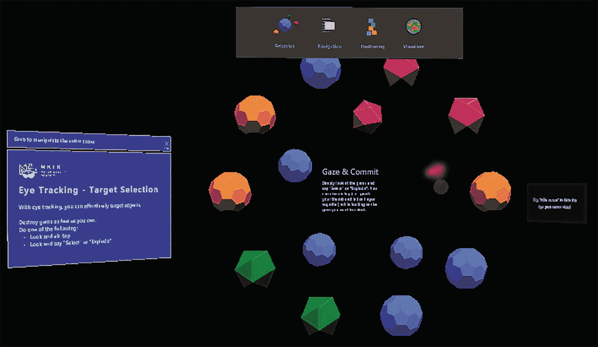

**图 5-5** 左键单击注视光标下的物体时，该物体被销毁

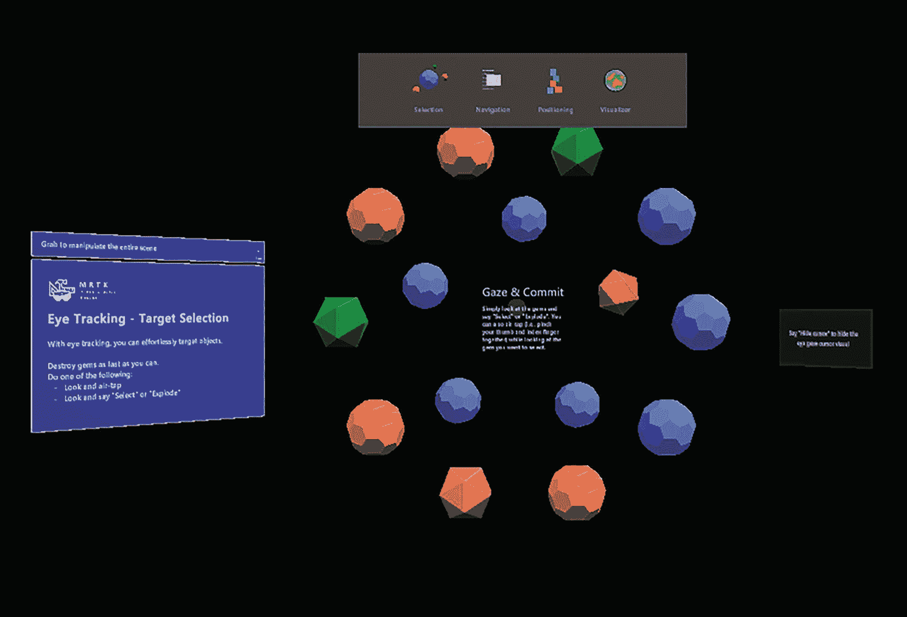

**图 5-4** 播放场景时，你的注视光标会使宝石旋转

当你完成场景测试后，请再次点击播放按钮停止模拟。


好的，作为高级文档工程师和翻译员，我将严格按照您提供的格式和注意事项，将给定的英文文本翻译成中文。


### 步骤 4：理解场景

现在你已经体验了示例场景并获得了一些乐趣，是时候了解这个场景是如何工作的，以及如何将场景中的元素应用到你的项目中了！让我们从层级面板开始，逐一了解所展示的元素。

要实现流畅且无错误的眼动追踪，你必须完成三项基本设置。首先是向你的 MRTK 配置文件添加一个 `Input Data Provider`。Mixed Reality Toolkit 输入系统是一个可扩展的系统，能够支持各种输入设备。只需自定义一个 `Input Data Provider` 即可提供外部硬件支持。顾名思义，这些数据提供程序有助于将数据输入到 Mixed Reality Toolkit 服务中。要查看添加到场景中的数据提供程序，请点击层级窗口中的 `MixedRealityToolkit` 对象。然后，在检查器窗口中，点击输入选项卡并展开 `Input Data Providers` 部分。图 5-6 显示了添加到演示场景中的名为 `Windows Mixed Reality Eye Gaze Provider` 的 `Input Data Provider`。

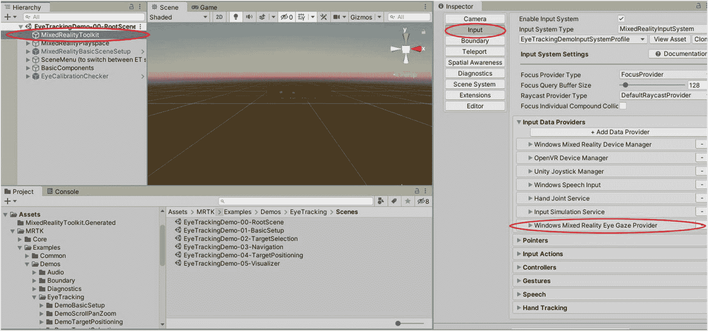

图 5-6  
添加到演示场景中的 `Windows Mixed Reality Eye Gaze Provider`

其次，配置 `GazeProvider`。凝视是一种根据用户视线方向与周围环境交互的输入形式。`GazeProvider` 在 MRTK 中提供了此功能。`GazeProvider` 可以在输入系统的指针部分进行配置。展开输入系统中的指针部分。在凝视设置下，你可以看到 `Is Eye Tracking Enabled` 选项旁边的复选框已被勾选。此过程确保项目使用眼部注视而非头部注视。图 5-7 展示了前述功能。

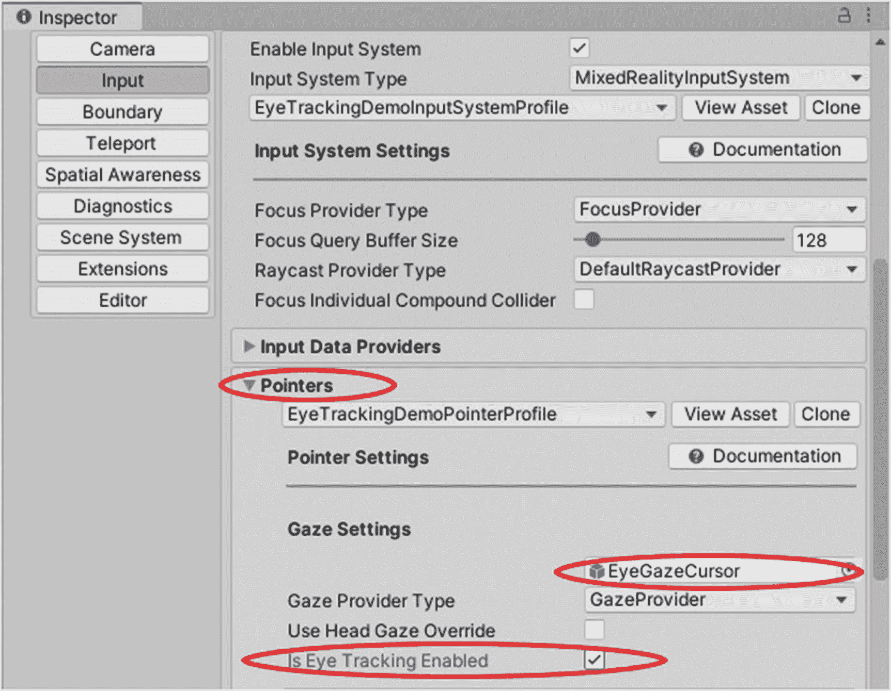

图 5-7  
在输入系统的指针部分启用 `Is Eye Tracking Enabled` 选项

由于凝视射线是不可见的，我们希望使用一个光标来表示用户正在注视的位置，以及凝视射线是否触碰到了用户前方的全息图。为此，我们可以看到 `EyeGazeCursor` 预制件，它在图 5-7 中被高亮显示。它用一个半透明的圆形来表示凝视射线的末端。示例可参见图 5-4 和 5-5。

在我们之前看到的演示场景中，当我们将光标悬停在宝石上时，我们注意到光标会立即吸附到宝石的中心。这是检查所有事件是否正常运行的好方法。

最后，为了在 Unity 编辑器中模拟眼动追踪输入，你需要将 `Default Eye Gaze Simulation Mode` 选择为 `Camera Forward Axis`。这有助于你在初始阶段（即部署到 HoloLens 2 之前）测试你的应用程序。眼部注视信号通过利用摄像机的位置作为眼部注视的原点，并将其向量作为眼部注视的方向来模拟。打开输入选项卡，导航到 `Input Data Providers` ➤ `Input Simulation Service`；在 `Eye Gaze Simulation` 下，你会注意到 `Default Eye Gaze Simulation Mode` 被设置为 `Camera Forward Axis`。此选项在图 5-8 中用红色圆圈标出。

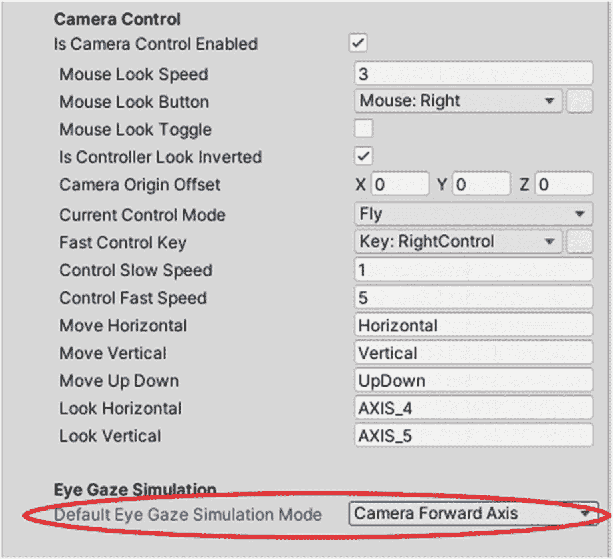

图 5-8  
设置模拟模式

注意  
`Eye Gaze Simulation` 无法很好地替代快速的眼球运动和无意识的眼球运动。因此，强烈建议你在 HoloLens 设备上测试你的应用程序，而不是在眼动追踪模拟选项的结果上妥协。

### 步骤 5：在你的项目中使用注视

现在你已经对注视输入方法和光标的重要组件有了高层次的理解，你知道了创建自己的注视和光标功能所需的设置。让我们回顾一下这些设置是什么：

-   添加一个 `Input Data Provider` 以向 Mixed Reality Toolkit 服务提供数据
-   在指针部分启用 `Is Eye Tracking Enabled`，以在你的项目上启用眼动追踪功能
-   将 `Default Eye Gaze Simulation Mode` 设置为 `Camera Forward Axis`，以帮助你在 Unity 编辑器中模拟眼部注视功能

通常，从一个已经包含这些核心元素的现有场景开始，然后将该“模板场景”作为构建应用程序的基础，会高效得多。本节中使用的 `EyeTrackingDemo-00-RootScene` 不包含其他核心功能，因此过于局限，不能用作有效的模板。随着我们在本章中逐步介绍其他输入方法，我们将得到一个功能完备的示例场景，你可以在每次开始新项目时反复将其用作模板场景！

## 手势教程

在本节中，我将带你了解如何在你的应用程序中使用手势。我们将探讨不同类别的手势以及每种手势适用的用例。我们将查看代码以了解手势是如何实现的。

### 步骤 1. 加载测试场景

对于本教程，我们将加载 `HandInteractionExamples` 场景。与之前的测试场景一样，搜索或浏览 `HandInteractionExamples`，并将其拖入你的层级面板中，如图 5-9 所示。移除你可能已打开的任何其他场景。

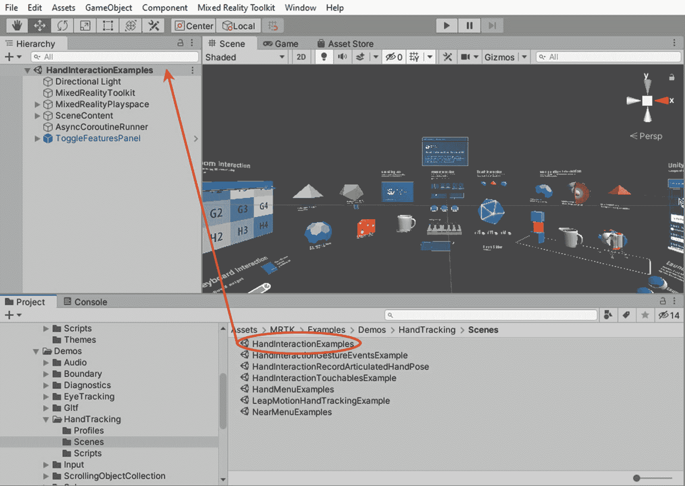

图 5-9  
打开 `HandInteractionExamples` 场景。这个精彩的测试场景是一个用于尝试手势和输入的游乐场！

如图 5-9 所示，你会立即看到一个友好的展示，让人联想到一个有趣的科学展览。

### 步骤 2. 试试看！

继续尝试这个测试场景，你可以通过点击编辑器的播放按钮、远程连接到你的设备或直接部署到设备上来运行。此演示中突出显示的一些功能包括弹出菜单、光标功能、点击对象、拖拽/移动对象等等！

你是否想了解更多关于在演示中看到的内容？退出演示（再次点击播放按钮）后，你可以在场景窗口中选择感兴趣的对象，并查看检查器以探索哪些脚本和组件负责该对象的行为。在图 5-10 中，我选择了咖啡杯以在右侧的检查器面板中查看该对象的组件。

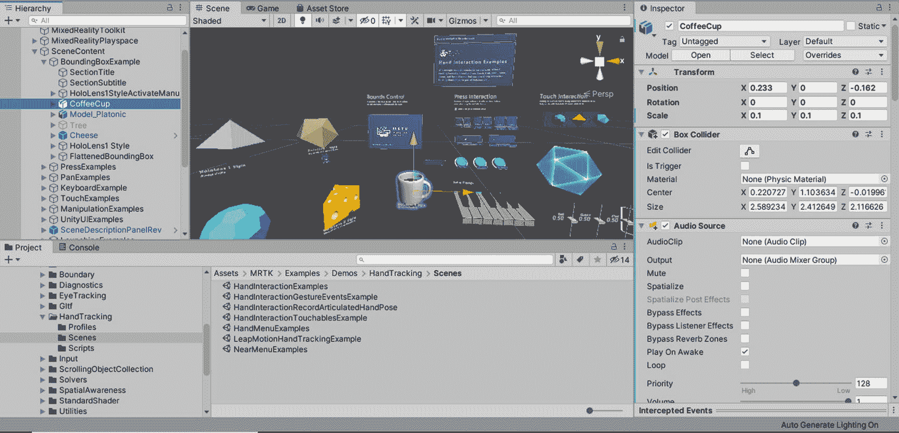

图 5-10  
为了更好地了解此测试场景中每个对象和功能的工作原理，请高亮感兴趣的对象，并在右侧的检查器面板中探索其组件

这个场景中有许多有趣的功能。我们已经在上一节中介绍了部分 MRTK 配置设置和与注视相关的主题。在接下来的几个步骤中，我们将介绍其他一些关键功能。


### 步骤 3：边界控制

`Bounds Control` 允许您在混合现实中变换对象。您可以更改对象的大小和比例。它相当于缩放选项，但是在 3D 尺度上操作的。

让我们在 `HandInteractionExamples` 场景中尝试此功能，以探索该特性。如图 5-11 所示，在 `Bounds Control` 标题下有五个对象，它们将向您展示 `Bounds Control` 在 HoloLens 1 和 2 中的工作方式。

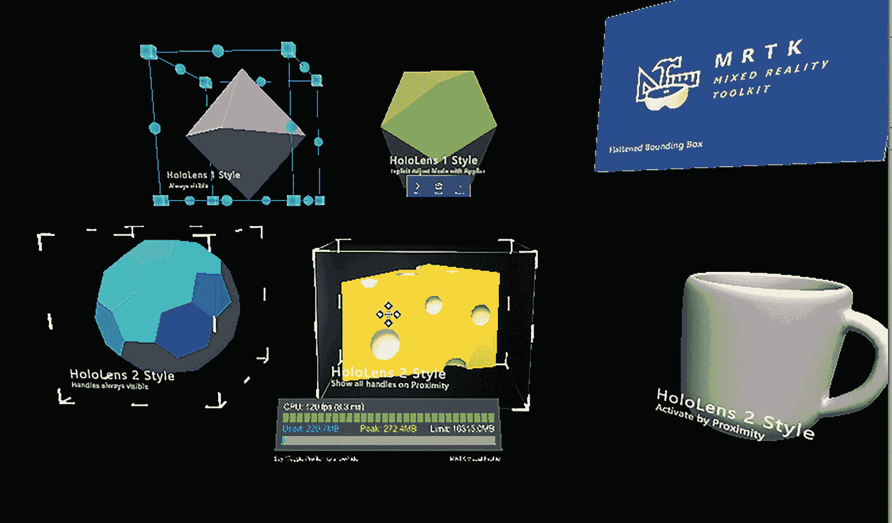

*图 5-11*

面板中的五个对象各自通过增大、减小或旋转来响应 `Bounds Control` 手势。

角落处的控制柄可帮助您缩放、旋转和平移对象。`Bounds Control` 也会响应用户的输入。例如，在 HoloLens 2 中，`Bounds Control` 会响应手指的靠近，并提供视觉反馈以估算对象的距离。如图 5-12 所示，脚本在 `Inspector` 面板中包含几个可自定义的选项。让我们逐一了解：

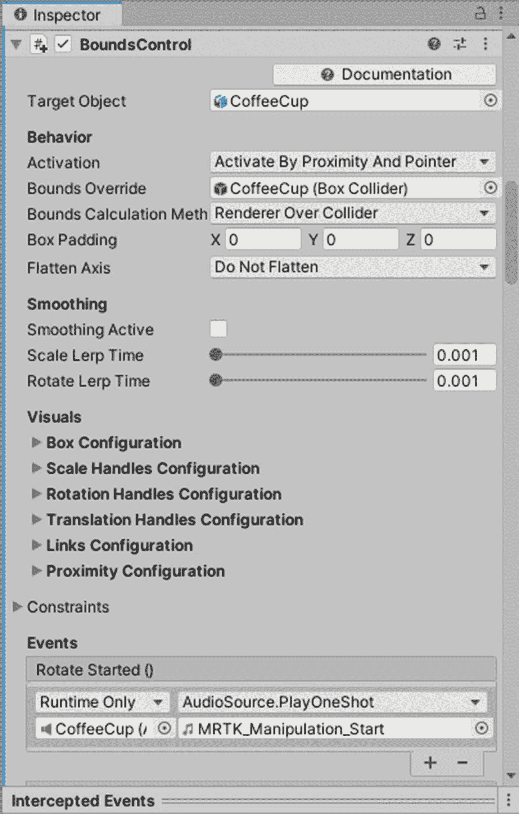

*图 5-12 — Bounds Control 脚本下的各种可自定义元素*

- **Target Object（目标对象）：** `Target Object` 指的是可以使用 `Bounds Control` 脚本进行操控的对象。如果此处未指定任何对象，则它将把所属对象作为目标对象。
- **Behavior（行为）：** `Behavior` 设置规定了 `Bounds Control` 在附加到对象时应如何表现。它包含用于激活 `Bounds Control`、控制是否在某个轴上扁平化控件等设置。
- **Smoothing（平滑处理）：** 它允许您在缩放或旋转对象时缩放平滑行为。
- **Visuals（视觉效果）：** 您还可以通过配置 `Visuals` 部分下的设置来更改 `Bounds Control` 的视觉效果。它们可以是链接的或内联的可脚本对象。
- **Constraints（约束）：** 约束系统有助于控制对象的缩放、旋转和平移。通过配置这些设置，您将能够将移动限制在一定范围内。
- **Events（事件）：** 事件在激活后有助于提供音频反馈。有几个事件可以提供语音或音频反馈，例如 `Rotate Started()`（旋转开始）、`Rotate Stopped()`（旋转停止）、`Scale Started()`（缩放开始）、`Scale Stopped()`（缩放停止）、`Translate Started()`（平移开始）和 `Translate Stopped()`（平移停止）。

### 步骤 4：按下与触摸交互

Windows Mixed Reality 设备最关键的手势是选择手势。对于 HoloLens 来说，这等同于空中点击与凝视对象的组合。它相当于在 PC 上单击鼠标。

让我们探索测试场景中响应选择手势的其中一个对象。如图 5-13 所示，中间面板有各种按钮和菜单。图 5-13 中高亮显示的较小立方体会改变其颜色，以显示按钮被点击或选中。

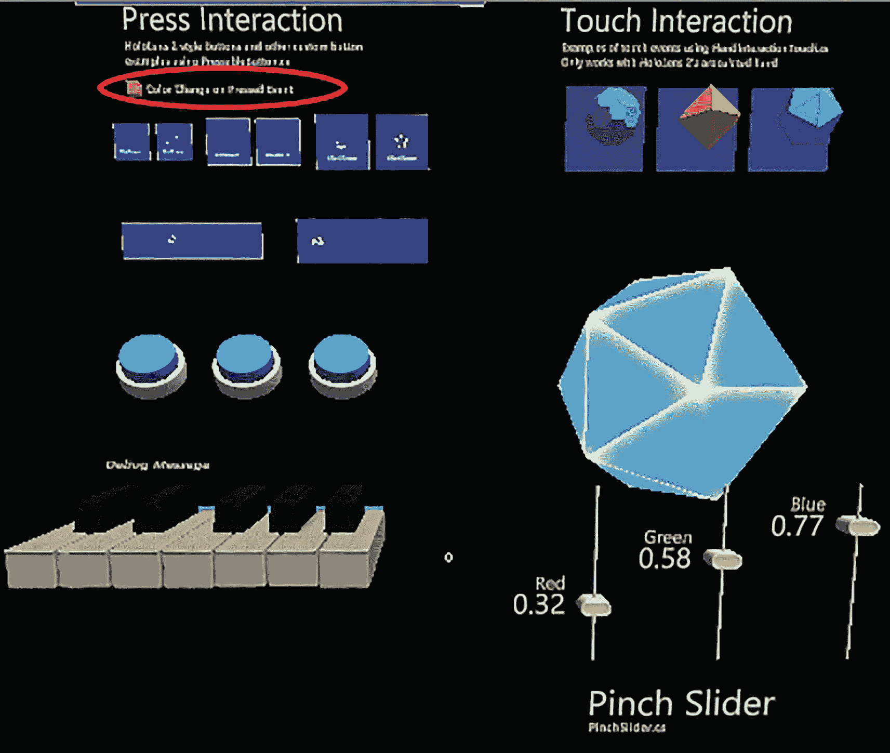

*图 5-13 — 在“按下交互”下，每次点击按钮时，顶部的小立方体都会改变颜色*

当您选择任一对象时，您会注意到 `Inspector` 面板中的标准组件——`PressableButton.cs` 脚本、`Interactable.cs` 脚本和 `NearInteractionTouchable.cs`，如图 5-14 所示。

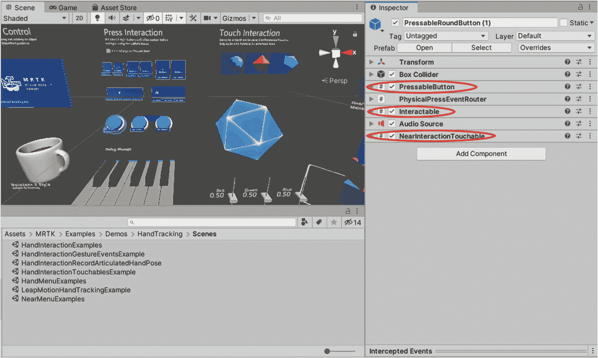

*图 5-14 — 显示执行“按下交互”所需的一些核心组件*

- **`PressableButton.cs`：** 接收来自用户的所有输入事件，并将其传递给 `PhysicalPressEventRouter`，后者将这些事件路由到 `Interactable.cs`。它执行手部按下按钮的连接逻辑。
- **`Interactable.cs`：** 该脚本帮助使对象响应用户输入；输入可以是任何形式。您可以通过向对象添加 `Interactable.cs` 脚本来使其成为可交互对象。
- **`NearInteractionTouchable.cs`：** 该脚本使任何对象都可触摸并准备好进行变换，这样当 `PokePointer` 触摸此对象时，您可以执行 `PointerUp` 和 `PointerDown` 事件。

您可以将上述脚本附加到您的对象上以执行按下交互。要实现触摸交互，您需要包含 `HandInteractionTouch.cs` 和 `Interactable.cs` 脚本组件。

### 步骤 5：对象操纵器

您可以通过点击凝视的对象、按住手指并拖动手部来移动这些对象。请确保您正在编辑器中播放场景、远程连接到您的设备，或者应用程序已部署到您的设备。

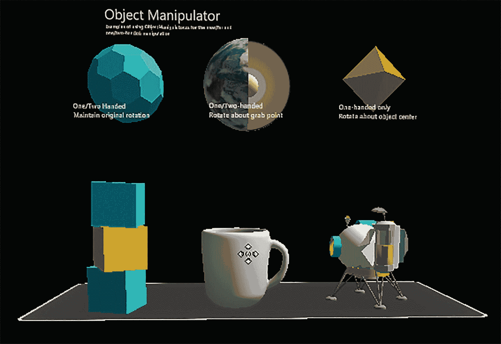

*图 5-15 — 可使用对象操纵器组件进行缩放、旋转和变换的对象*

`Object Manipulator` 组件允许您使用单手或双手来缩放、旋转和变换对象。此功能以前由 `Manipulation Handler` 组件处理，现在已被 `Object Manipulator` 组件取代。您可以根据各种输入（如手部骨骼、手部射线、凝视和手势）来自定义 `Object Manipulator` 组件。

如果您希望将此功能集成到您的对象中，则需要将 `Object Manipulator (script)` 组件添加到相应的对象上。请确保您也在对象中包含碰撞体组件。为了使您的操作更真实，您可以在对象中包含 `RigidBody` 组件；这样做之后，您的数字对象的行为会像真实物体一样。它们会像自然物体一样与其他物体碰撞；如果没有 `RigidBody` 组件，物体将穿过另一个物体，使其看起来不真实。

图 5-16 展示了 `Object Manipulator` 组件中包含的各种属性和字段。属性和字段的列表如下：

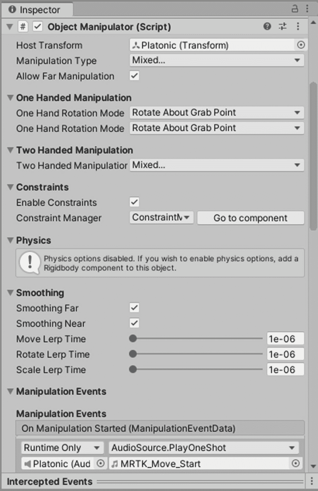

*图 5-16 — Object Manipulator 脚本下包含的各种属性和字段*

- **Host Transform（宿主变换）：** 包含需要被操控的对象变换。
- **Manipulation Type（操纵类型）：** 操纵模式可以是单手或双手。您可以在此字段中选择这两种设置。
- **Allow Far Manipulation（允许远距离操纵）：** 允许您使用指针进行远距离交互。
- **One Handed Manipulation properties（单手操纵属性）：** 单手操纵属性负责管理由单只手执行的操作；可能是远距离或近距离交互。远距离交互使对象能够通过凝视、手部射线和运动控制器射线进行交互。顾名思义，用户可以远距离与对象交互。近距离交互以触摸和抓取的形式呈现。相应的触摸和抓取事件通过指针（如 `PokePointer` 和 `SpherePointer`）调用。
- **Two Handed Manipulation properties（双手操纵属性）：** 双手操纵属性负责管理由双手执行的操作，例如移动、旋转和缩放。
- **Constraints（约束）：** 为对象添加约束有助于限制对象的移动。您可以选择附加到对象的任意约束管理器。
- **Physics（物理）：** 仅当附加了 `RigidBody` 组件时，此字段才会被激活。
- **Manipulation Events（操纵事件）：** 列出了一组事件，例如 `OnHoverStarted`（悬停开始）、`OnHoverEnded`（悬停结束）、`OnManipulationStarted`（操纵开始）和 `OnManipulationEnded`（操纵结束），这些事件在进行交互时按顺序发生。


### 第 6 步：在应用中实现手势

现在您已对手势输入方式有了高层理解，掌握了创建手势功能所需的脚本和对象。让我们回顾一下具体内容：

- **边界控制**：使您能够在混合现实中变换对象。您可以使用对象四角的操作柄来改变对象的大小和比例。
- **`Pressable.cs`脚本**：将事件重定向到`PhysicalPressEventRouter`，同时充当手按压按钮的连接逻辑。
- **`Interactable.cs`脚本**：通过包含此组件使对象具备交互性，让对象能够响应用户输入。
- **近交互抓取**：使对象可感知并准备好接受输入。
- **对象操纵器**：允许您通过缩放、旋转和变换来操纵对象。对象操纵器具有多种属性和字段供您自定义。

您可能还想探索示例场景中附加的其他脚本和对象，以更精确地了解如何在场景中融入手势。我们在本节中一直在探索的`HandInteractionExamples`场景是启动新项目时极佳的模板场景。它包含前面列出的核心预制件，以及多个可供项目修改或扩展的独特示例。随着经验积累，您也可以考虑构建包含常用组件的模板场景。如果您希望从混合现实工具包提供的测试场景入手，修改后另存为模板场景，可以在`层级`中选择场景，然后通过菜单栏选择`文件` ➤ `另存场景`。

## 语音命令教程

在本节中，我将带您了解在混合现实应用中启用语音命令所需的关键要素。语音命令在开发混合现实应用时极为有用，因为它无需杂乱的用户界面即可实现高度控制和自定义。用户可以说出一个或一系列词语来选中对象、激活功能并增强体验。

长时间使用手势时，我的手臂经常感到疲劳。这时我会改用语音命令说"选择"，而不使用手势。这就是语音命令强大能力的一个例证。在应用中深思熟虑地使用语音是打造良好用户体验的关键。

和之前一样，我们将从混合现实工具包示例场景开始，探索语音命令在 Windows 混合现实中的工作原理。

### 第 1 步：加载示例场景

本教程中，我们将加载`SpeechInputExamples`场景。按照之前测试场景的操作方式，搜索或浏览找到`SpeechInputExamples`，将其拖入层级，如图 5-17 所示。别忘了卸载可能已打开的其他场景。

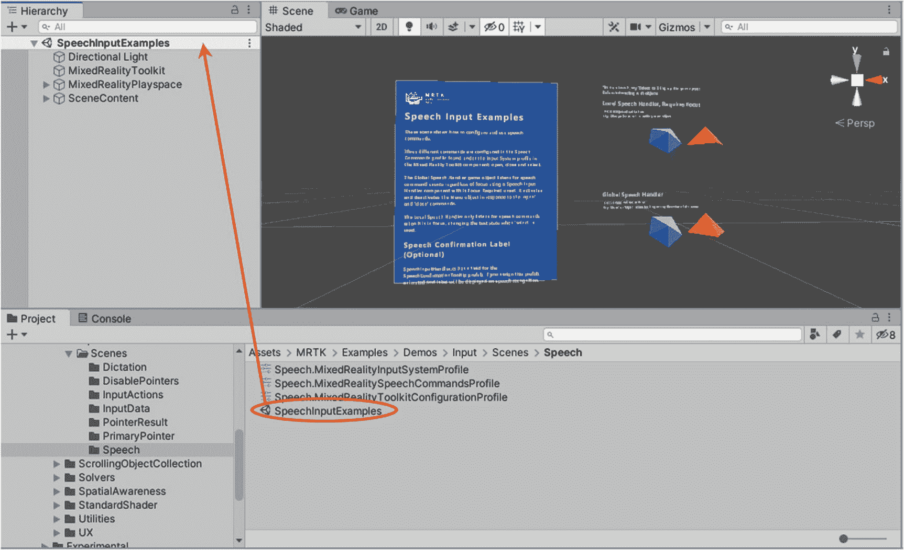

**图 5-17** 打开`SpeechInputExamples`示例场景，探索如何在应用中使用语音命令

### 第 2 步：试试看！

和之前一样，通过点击编辑器中的播放按钮、远程连接到设备或部署到设备来试用此测试场景。

**重要提示**

使用语音命令时，请务必在应用中添加麦克风功能。在 Unity 中，您可以在`编辑` ➤ `项目设置` ➤ `播放器` ➤ `Windows Store 设置` ➤ `发布设置` ➤ `功能`中勾选"麦克风"选项。

启动示例场景后，您可以看到若干带有示例场景描述和需要遵循步骤的游戏对象。当您凝视顶部两个游戏对象中的任何一个并大声说出"选择"时，相应对象会被选中。然后说"更改颜色"，即可更改所选游戏对象的颜色，如图 5-18 所示。在执行"更改颜色"操作之前需要先选中对象，因为该操作需要焦点，而`Speech Handler`脚本是本地包含的。

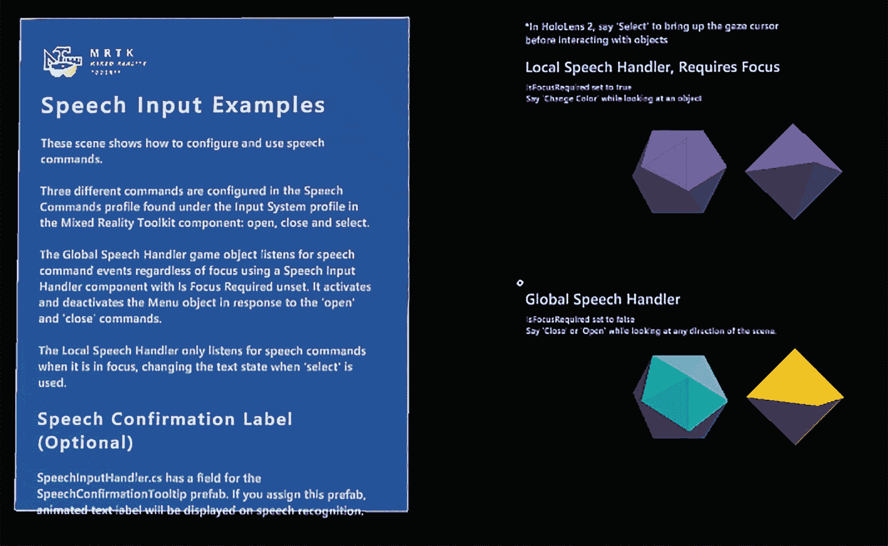

**图 5-18** 播放示例场景后，您会看到四个对象。凝视顶部的某个对象并说"选择"来选中它，然后尝试大声说"更改颜色"

说出"关闭"和"打开"等命令时，您可以观察到底部的游戏对象会根据语音输入消失或出现。在发出命令前无需选中任何对象，因为`Speech Handler`脚本是全局放置的。如果您通过 Unity 编辑器测试，只要电脑连接了麦克风（或内置麦克风、集成在摄像头中的麦克风），语音命令即可正常工作。


### 第三步：理解场景

在体验了语音指令的乐趣之后，现在让我们更深入地探究其背后的工作原理。如图 5-19 所示，`SpeechInputExamples` 示例场景的层级视图中包含了若干对象。

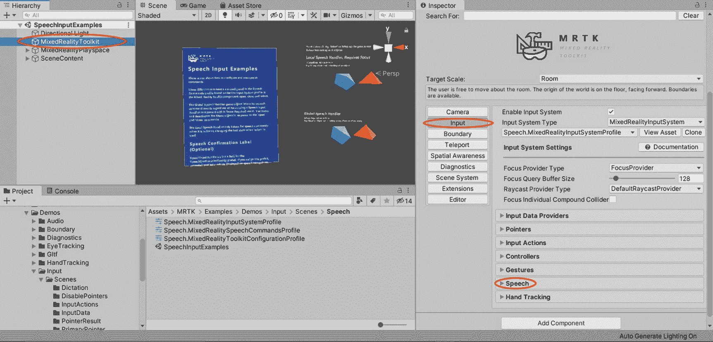

**图 5-19** 通过在输入系统的语音部分配置一些设置，即可实现语音指令功能

现在，您应该已经非常熟悉图中显示的一些对象，以及如何将输入数据提供程序添加到项目中。如前所述，这些数据提供程序使您能够向 Unity 项目提供各种数据或输入。

选中层级视图中的 `Mixed Reality Toolkit` 对象，然后在检视面板中导航至“输入”选项卡 ➤ “语音”部分，如图 5-18 所示。展开“语音”部分可查看一些选项。在“语音指令”选项下，您将看到用于添加关键词的输入字段，以便在识别到关键词时触发语音输入事件，如图 5-20 所示。将这些关键词集成到您的项目中是第一步，因为您的语音指令正是借助这些关键词来识别的。

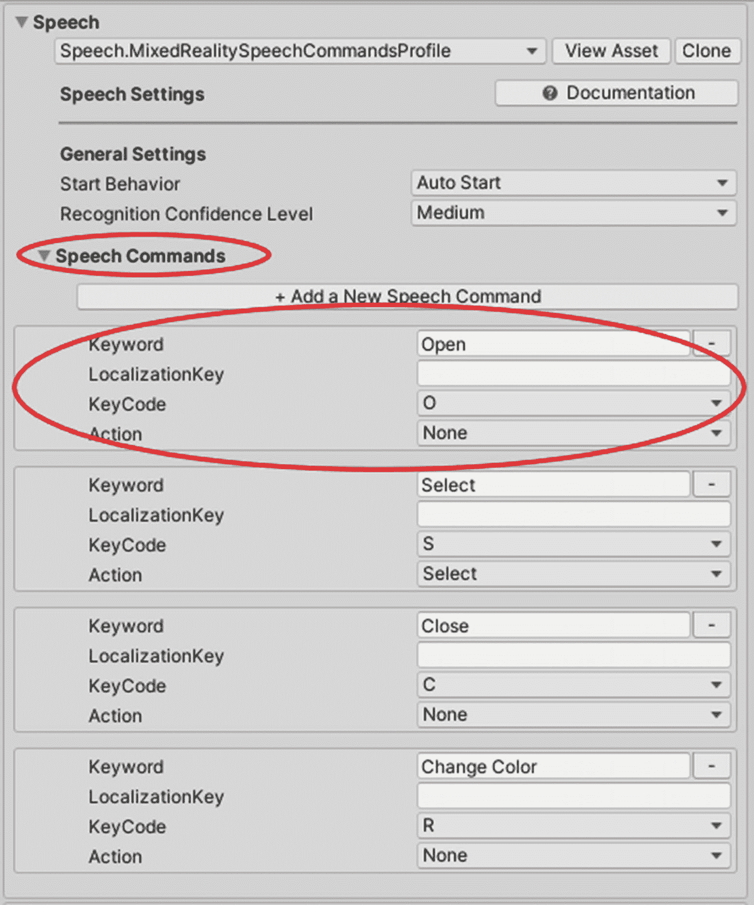

**图 5-20** 每个语音指令提供的选项

对于每个指令，您可以选择“输入操作”、指定“键码”，并添加用于 UWP 应用的“本地化键”。这些功能如图 5-20 所示，已包含在您的 `SpeechInputExamples` 场景中。

在 Unity 项目中添加了各种关键词后，我们需要为这些关键词附加一些功能或事件，以便在识别到时执行。这由 `Speech Input Handler`（语音输入处理程序）脚本来处理。在层级视图中，导航至 `SceneContent` ➤ `LocalSpeechHandlingExample` ➤ `Platonic2`。在检视面板中，您可以看到与该游戏对象相关的若干项。其中之一是 `Speech Input Handler` 脚本，它负责识别关键词并处理语音输入事件。

您还可以通过包含 `SpeechConfirmationTooltip.prefab`（语音确认提示框预制件）来显示语音指令识别出的文本。此预制件可指定到“语音确认提示框预制件”字段，如图 5-21 所示。您可以看到 `Color Changer`（颜色更改器）脚本，当识别到关键词“Change Color”时，它会执行颜色更改操作。

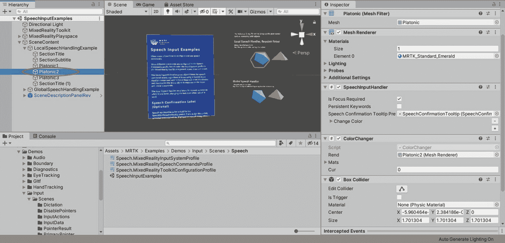

**图 5-21** 分配给场景中名为“Platonic2”的物体的各项设置

`Mesh Filter`（网格过滤器）和 `Mesh Renderer`（网格渲染器）协同工作，将资源呈现在场景中。`Mesh Filter` 从资源中提取网格并将此信息传递给 `Mesh Renderer`。另一方面，`Mesh Renderer`从 `Mesh Filter` 接收几何图形并将其渲染到场景中。附加到对象上的 `Box Collider`（盒型碰撞器）组件使这些对象能够与场景中的其他物体发生碰撞。

### 第四步：添加你自己的语音指令

学习某事物如何工作的最佳方法就是亲自实践！让我们在现有指令集中添加另一个语音指令。当前，当您说“Change Color”时，物体会改变颜色；当您说“Close”和“Open”时，物体会消失和重新出现。现在让我们添加一个“Move Up”语音指令，让物体向上移动。

选中层级视图中的 `Mixed Reality Toolkit` 对象；在检视面板中，导航至“输入”选项卡 ➤ “语音”部分 ➤ “语音指令”。点击顶部的“+Add a New Speech Command”按钮，如图 5-22 所示。此时会添加一个新字段，其选项与之前的语音指令相同。按图 5-21 所示填写详细信息。现在，您已成功在 Unity 项目中添加了一个关键词“Move Up”。该关键词就是语音指令。注意不要在关键词前面添加空格，否则会导致代码无法识别您的语音指令。

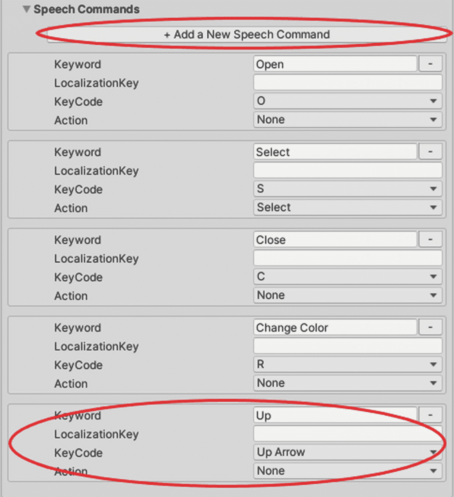

**图 5-22** 添加新的语音指令

下一步是通过 `Speech Input Handler Script`（语音输入处理程序脚本）为关键词添加一个事件。目前，让我们让“Platonic2”对象在您说出“Move Up”时向上移动。现在，每当您说“Move Up”时，一条“OnMoveUp”消息将被发送到您正在注视的对象。然而，场景中的对象在接收到 `OnMoveUp` 消息时并不知道该做什么。我们需要在游戏对象的脚本中添加一个名为 `OnMoveUp()` 的方法。让我们看看附加到游戏对象上的脚本。

您可以通过在项目面板中搜索 `ColorChanger.cs` 来找到该脚本，或者通过层级视图中的“Platonic2”对象，然后在检视面板中双击已附加到该游戏对象的“ColorChanger”脚本来找到它。在 Visual Studio 或其他编辑器中打开该脚本。接着，输入以下代码来创建 `OnMoveUp()` 方法：

```csharp
public void OnMoveUp()
{
    transform.Translate(0.0f, 0.2f, 0.0f);
}
```

这个简单的添加操作使物体向上（Y 方向）移动 0.2 个单位。上一步骤如图 5-23 所示。

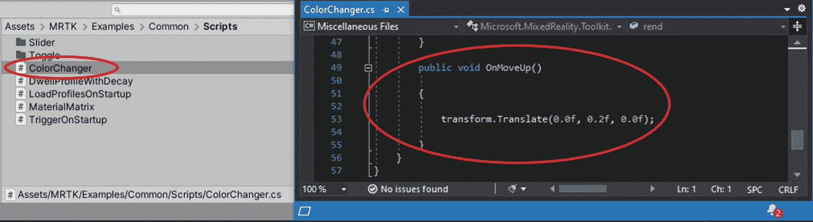

**图 5-23** 在编辑器中打开“ColorChanger”代码，并在末尾添加上面的代码

点击层级窗口中的“Platonic2”对象；然后在检视面板中，展开 `Speech Input Handler` 脚本。点击小的“+”标记为您输入的关键词添加一个事件。按图 5-24 所示填写详细信息。确保您选择的响应事件为 `ColorChanger` ➤ `OnMoveUp()`。这一步将帮助您为关键词关联一个事件。

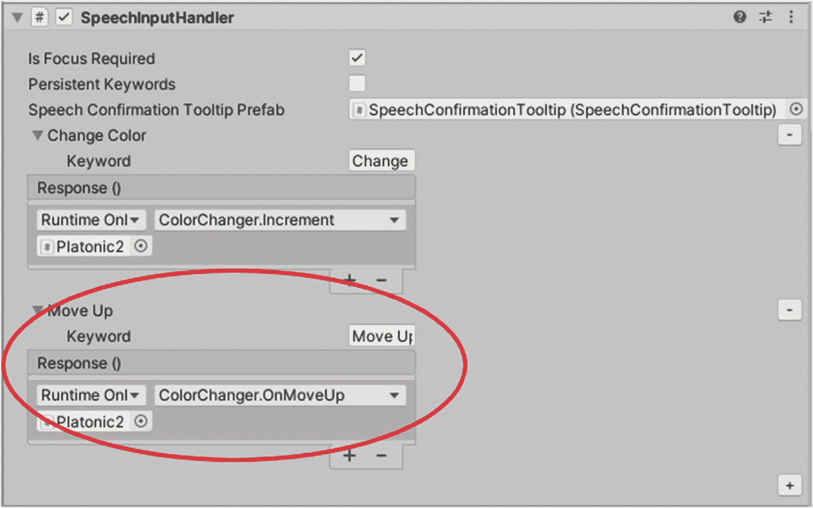

**图 5-24** 为新添加的关键词添加功能

> **注意**  
> 务必确保关键词匹配，否则将会遇到要求更正关键词的错误提示。

现在就来试试您的新语音指令吧！注视每个对象并说出“Move Up”。您将看到物体向上移动！

### 第五步：在你自己的项目中使用语音指令

恭喜！您已成功了解了语音指令如何在 Windows Mixed Reality 中工作，以及如何将您自己的语音指令添加到现有的测试场景中。将语音指令添加到一个新场景或不同的场景是一个简单的过程。让我们回顾一下在您自己的项目中启用语音指令所需的步骤：

*   在 `Mixed Reality Toolkit` 的输入系统的“语音”部分添加所需的关键词。

*   将 `SpeechInputHandler` 脚本附加到您需要执行某些操作的对象上。

*   确保为给定的关键词选择适当的事件。

在 Windows Mixed Reality 中实现语音指令相对简单，但它将显著增强您应用程序的用户体验。语音输入也可以使用完整的句子，而不仅仅是单个关键词。下一步将讨论在应用程序中使用语音的一些最佳实践。


### 语音命令最佳实践

语音命令是用户与混合现实应用进行交互的绝佳方式。以下是一些 HoloLens 特有的语音命令供您尝试。请尝试说出：

- `“What can I say?”`
- `“Go to Start”`（可用于打开开始菜单）
- `“Increase Volume”`
- `“Decrease Volume”`
- `“How much battery do I have left”`
- `“Increase Brightness”`
- `“Decrease Brightness”`
- `“Start Recording”`
- `“Stop Recording”`
- `“Shut down the device”`
- `“Restart the device”`
- `“What time is it”`
- `“Go to sleep”`

以下是在应用中实现语音功能时需牢记的一些最佳实践：

- 使用包含两个或更多音节的**关键词**。这有助于识别各种口音的语音。
- 在设计应用时，应考虑用户**误触发**语音命令的情况。在适当的情况下，允许用户撤销操作（例如，当意外删除一个对象时）。
- 确保所有语音命令都是**独特的**。如果两个或多个命令听起来相似，语音识别器可能会激活错误的命令。
- 尽可能确保你的语音命令在各种口音下都能被**轻松识别**。
- 语音命令是快速访问嵌套菜单或其他可能需要多种手势操作场景的绝佳方式。
- 如果用户界面没有显示语音命令列表，请考虑为用户提供一份清单。
- 在可通过点击或语音命令激活的按钮旁边放置**麦克风图标**。如果可能，请使所有按钮和 UI 元素都支持语音启用。

## 其他硬件输入

有各种硬件选项可与 Windows Mixed Reality 头戴式设备配合使用。这些设备包括运动控制器、蓝牙键盘和鼠标、蓝牙游戏手柄、点击器等蓝牙配件。

虽然最佳实践建议避免在混合现实体验中使用传统的 PC 硬件（键盘和鼠标），但在某些应用中，这些输入方法可能是合适的。

对于可能涉及移动第三人称对象（如游戏角色、全息直升机或全息赛车）的应用，游戏手柄是一个绝佳选择。

## 总结

恭喜！在本章中，我们了解了 Windows Mixed Reality 头戴式设备的主要输入形式。我们通过几个教程学习了凝视、手势和语音命令如何与混合现实配合工作。我们学习了如何在我们自己的应用中启用这些功能，以及如何利用 Mixed Reality Toolkit 轻松实现强大的输入功能。

在你继续混合现实开发之旅时，请记住该行业仍处于成长阶段。大家普遍认为，混合现实设备的输入方法有时会有些笨拙和尴尬，缺乏精确性和优雅性。思考一下理想的输入体验会是什么样子，不要害怕尝试与虚拟环境互动的新方式！你永远不知道谁会引入一种像鼠标之于 PC 那样对混合现实至关重要的输入方法。

