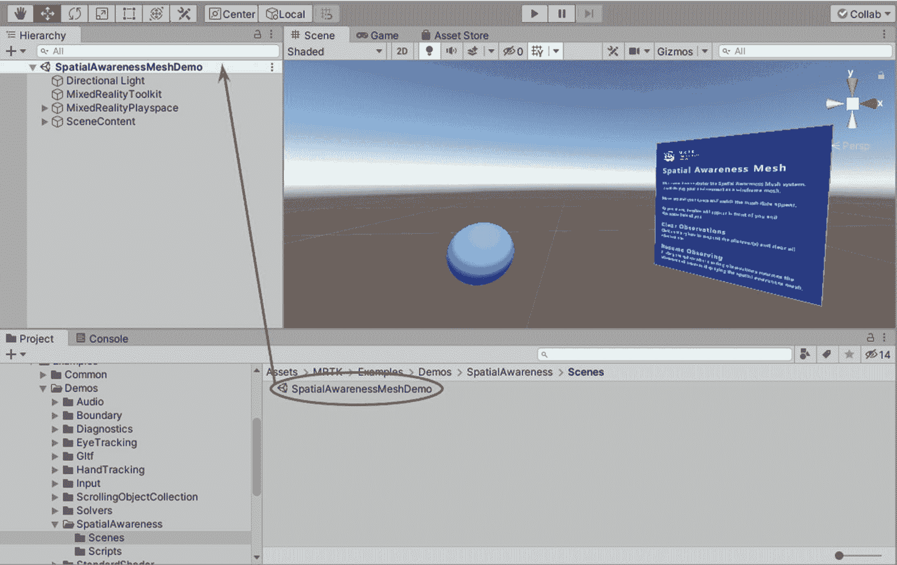
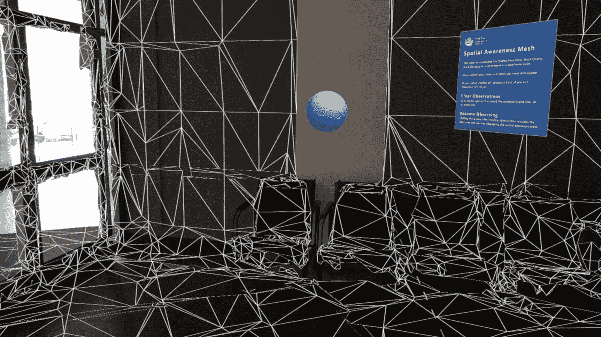
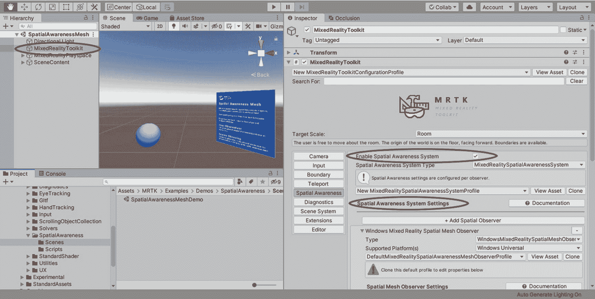
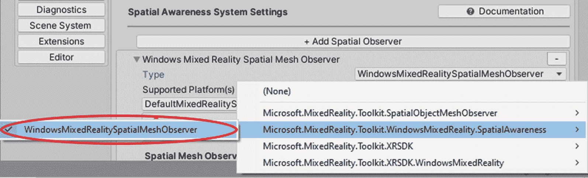
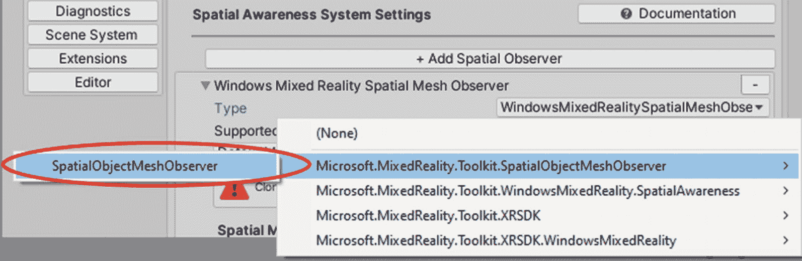
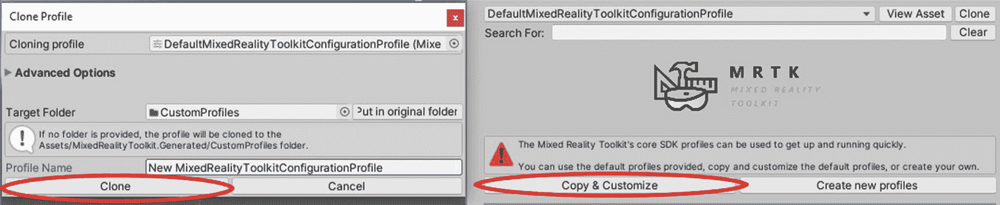
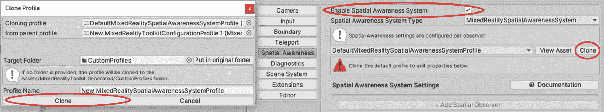
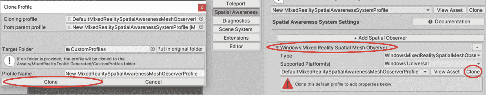
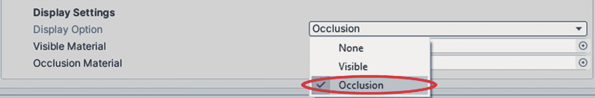
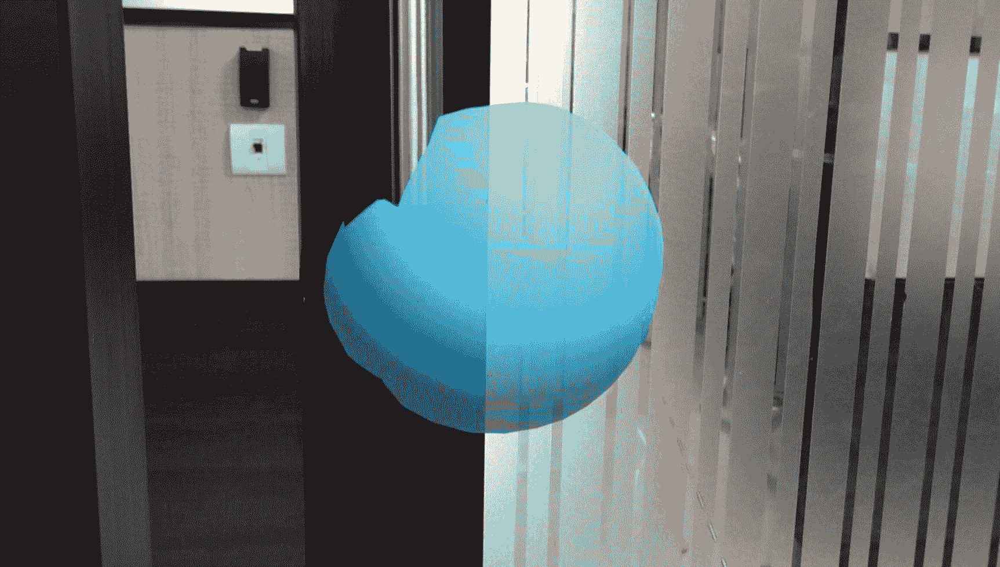

# 6. 使用空间感知

在本章中，我们将学习如何使用 Windows Mixed Reality 头戴式设备（如 HoloLens）最具特色的功能之一：空间感知。我们将学习如何在 Unity 中使用 Mixed Reality Toolkit 应用空间感知，并揭示一些你可以利用空间感知实现的巧妙技巧。

## 什么是空间感知？

像 HoloLens 这样的设备会持续追踪其环境，并构建所处区域的 3D 模型。这被称为*空间感知*。如果没有空间感知，全息影像将无法放置在地板和桌面上，也无法固定在墙上。其他房间中的物体仍然可见，这会降低用户的体验。

空间感知之所以重要，有几个原因：

- **遮挡（Occlusion）**：它告诉 HoloLens 哪些全息影像应该从视图中隐藏。例如，如果你将一个全息影像放在你的走廊里，然后走进另一个房间，那个房间墙壁的空间地图将阻止你看到走廊里的全息影像。如果没有空间地图，你会看到全息影像，就好像它可以透过墙壁被看到一样，导致不真实的体验。
- **放置（Placement）**：它允许用户与空间地图进行交互——例如，将物品固定在你的墙上，允许角色坐在你的沙发上（如微软的“Fragments”应用所示！），或自动装饰你的周围环境。
- **物理（Physics）**：它允许物体与你的墙壁、家具和地板发生碰撞或弹跳，从而产生更真实的体验。
- **导航（Navigation）**：使用凝视让游戏角色和其他全息影像沿着映射的表面跟随移动。
- **持久性（Persistence）**：空间感知会存储有关物体在其环境中位置的信息。这在许多场景中都很有用。例如，你在将全息影像放置在所需位置后意外关闭了应用，由于物体的位置已被存储，当你再次打开应用时，可以在同一区域找到你的全息影像。

有关空间感知及相关传感器的更多信息，请参阅第 1 章。

## 空间感知教程

在本节中，我将指导您设置一些基本的空间感知功能。我将展示需要从 Mixed Reality Toolkit 中使用哪些元素来启用空间感知，并提供一些获得良好体验的提示。

### 步骤 1：设置 Unity 场景

在本教程中，我们将使用 Mixed Reality Toolkit 中的一个示例场景。如果您还没有设置，请务必按照第 4 章所述为混合现实开发设置 Unity。您也可以参考第 4 章，复习如何在 Unity 中运行 Mixed Reality Toolkit 的示例场景。

在项目面板中，使用搜索栏或在文件夹结构中查找，找到 `“SpatialAwarenessMeshDemo”` 示例场景（或 `SpatialAwarenessMeshDemo.unity`）。将该测试场景拖入层级面板，如图 6-1 所示。请确保卸载（禁用）您可能已打开的所有其他场景。

**图 6-1**

从 Mixed Reality Toolkit 打开 `SpatialAwarenessMeshDemo` 场景，探索空间感知的基本实现

### 步骤 2. 试试看！

下一步是点击播放按钮进行尝试。

我强烈建议使用您的 HoloLens 体验您周围的空间网格。通过使用 HoloLens，您可以观察到网格是如何放置在您周围和物体上的。如果您没有设备，或者不想在这次测试中使用它，请在您的 Unity 编辑器中尝试，以初步了解空间感知的工作原理。

**注意**

为了在 Unity 编辑器上测试您的应用，您需要按照图 6-5 所示更改设置。请参考步骤 4 了解如何更改设置。

如果佩戴 HoloLens，您将看到空间地图与您的物理环境完美对齐，如图 6-2 所示。

**图 6-2**

通过 HoloLens 2 看到的空间地图视图

如您所见，空间地图的渲染是一个由顶点、边和面组成的集合。顶点是两条或多条边相交形成一个角的点，边通常是直线段，而面是由边在顶点处相交形成的平面表面。它看起来像一张覆盖您周围环境的网（我们稍后将学习如何更改空间映射的外观）。由空间感知生成的 3D 对象通常被称为*空间对象网格*。

### 第 3 步：理解场景

既然你已经体验了空间感知，让我们深入探究场景，了解实现空间映射的关键组件。

在 `Hierarchy` 窗口中选择 `Mixed Reality Toolkit` 对象，然后观察 `Inspector` 窗口，如图 6-3 所示。 `Mixed Reality Toolkit` 对象负责管理空间感知系统。在 `MixedRealityToolkit` 对象中有各种配置配置文件，你可以根据正在创建的应用程序进行更改和自定义。在配置文件中，只有部分会自动启用空间感知系统。其中一个是 `DefaultMixedRealityToolkitConfigurationProfile`。示例场景即使用此配置文件。

**图 6-3**

只需进行空间感知设置即可在项目中启用空间感知！

导航到 `Inspector` 窗口中的 `Spatial Awareness` 选项卡。你应该会看到一个名为 `Enable Spatial Awareness System` 的复选框，并且它已被勾选。勾选此复选框，即可让你的应用程序访问空间感知系统。

> **注意**  
> 设置可能不会像图 6-3 所示那样高亮显示。这是因为你无法直接自定义标准配置文件。你需要创建该配置文件的克隆来配置设置。我们将在下一节中进一步讨论此步骤。

在 `Spatial Awareness System Settings` 部分，你有一个 `Add Spatial Observer` 选项。默认情况下，`DefaultMixedRealityToolkitConfigurationProfile` 会为 Windows Mixed Reality 平台预配置空间感知系统，该系统使用 `WindowsMixedRealitySpatialMeshObserver` 类，如图 6-4 所示。此设置让你可以在设备上部署时可视化空间网格，但在 Unity 编辑器中无法实现。

**图 6-4**

`WindowsMixedRealitySpatialMeshObserver` 类让你可以在设备上部署时可视化空间网格

为了在 Unity 编辑器中测试示例场景，你需要将 `Type` 字段更改为 `SpatialObjectMeshObserver` 类，如图 6-5 所示。

**图 6-5**

`SpatialObjectMeshObserver` 让你可以在 Unity 编辑器上测试时可视化空间网格

在 `Hierarchy` 窗口中点击球体对象。你可以在 `Inspector` 窗口中观察到球体对象上附加了两个脚本。它们是 `PointHandler.cs` 和 `ClearSpatialObservations.cs` 脚本，这两个脚本让你能够通过轻触球体来开启或关闭创建的空间网格。

### 第 4 步：在应用程序中使用空间映射

为了在未来的项目中启用空间感知，你需要首先克隆标准的 Mixed Reality 配置文件。点击图 6-6 中高亮显示的 `Copy & Customize` 按钮，开始克隆过程。会弹出一个 `Clone Profile` 窗口，你可以在其中为克隆的配置文件提供一个新名称，然后点击 `Clone` 按钮，如图 6-6 所示。

**图 6-6**

克隆 `DefaultMixedRealityToolkitConfigurationProfile`

克隆的配置文件会自动分配为你的配置文件。克隆后，你可以看到一些选项会高亮显示。现在点击 `Inspector` 窗口中的 `Spatial Awareness` 选项卡。勾选 `Enable Spatial Awareness System` 复选框，如图 6-7 所示，以便在应用程序中有效使用空间感知系统。要配置 `Spatial Awareness System Settings`，你需要点击旁边的 `Clone` 按钮来克隆 `DefaultMixedRealitySpatialAwarenessSystem` 配置文件。会弹出一个 `Clone Profile` 窗口，你可以在其中提供你的配置文件名称，然后点击图 6-7 中所示的 `Clone` 按钮。

**图 6-7**

克隆 `DefaultMixedRealitySpatialAwarenessSystem` 以访问 `Spatial Awareness System Settings`

现在，你可以配置 `Spatial Awareness System Settings` 下的各种设置。展开 `Spatial Awareness System Settings` 下的 `Window Mixed Reality Spatial Mesh Observer` 部分，并根据你想要测试应用程序的位置，将 `Type` 字段更改为所需的类。请参考图 6-4 和图 6-5 来更改 `Type` 字段。

## 遮挡

在本节中，我将引导你为空间感知网格实现遮挡效果。遮挡可以使完全或部分位于墙壁及其他表面后面的物体部分变得不可见——就像在物理世界中一样。这可以增强全息图的真实感，并改善用户体验。

### 第 1 步：应用遮挡

要将遮挡包含在你的 Unity 项目中，首先按照前面所述配置配置文件。我们已经学习了如何在项目中启用空间感知系统，并克隆一些标准配置文件来自定义设置。在 `Spatial Awareness System Settings` 下，展开 `Windows Mixed Reality Spatial Mesh Observer`，如图 6-8 所示。克隆 `DefaultMixedRealitySpatialMeshObserverProfile` 以配置其一些属性。请参考图 6-8。

**图 6-8**

克隆 `DefaultMixedRealitySpatialMeshObserverProfile` 以配置一些属性

克隆后，一些属性和设置会高亮显示。向下滚动到 `Display` 设置，并将 `Display Option` 更改为 `Occlusion`，如图 6-9 所示。通过此操作，你便为项目启用了遮挡选项。这为应用程序提供了真实感。

**图 6-9**

将 `Display Option` 更改为 `Occlusion`

### 第 2 步：动手试试！

遮挡材质将被渲染。由于材质是透明的，你无法直接看到空间映射网格，但你会看到物体的一部分将被其环境遮挡！

正如你从我的测试中看到的，当我与球体之间没有障碍物时，球体完全可见；但当存在障碍物时，球体则部分可见（图 6-10）。

**图 6-10**

当被遮挡时（此处为门把手），球体只有未被遮挡的部分可见

遮挡是混合现实开发中的关键组成部分——尤其是对于利用空间感知的项目。没有遮挡，位于其他房间或物体后方的远处全息图仍然可见，这会导致体验令人困惑且不自然。

## 场景理解

HoloLens 对其周围的空间有着卓越的理解能力。它会频繁地映射周围环境，并构建出一个用户可用于分析的 3D 网格。有时，用户可能更希望获得更高层次的抽象，以及关于环境的更详细信息。

许多应用程序在启动时会扫描场景，并将特定物体放置在地板、天花板或墙壁等首选位置。拥有环境的 3D 网格对于实现此功能非常有用。然而，为了区分不同的表面，仍需在网格上执行更多处理。这正是场景理解发挥作用的地方；它允许用户解锁设备的更多功能，以推理出场景中的物体，包括墙壁、天花板、地板、平台等。

以下是场景理解允许你执行的一些操作：

*   将物体放置在地板、天花板和墙壁上。
*   将物体放置在你附近或远处的空中，不接触墙壁。
*   将物体放置在你附近或远处的地板上。
*   找到最大的墙壁并在其上放置物体。
*   找到可坐的表面（这样你就可以让角色坐在任何人的椅子上！）。
*   识别椅子和沙发。
*   识别大型空置表面。
*   允许用户“绘制”他们的空间网格以限制扫描区域。
*   平滑空间映射网格。

如需深入了解场景理解，请参阅 `docs.microsoft.com/en-us/windows/mixed-reality/develop/platform-capabilities-and-apis/scene-understanding-sdk#developing-with-scene-understanding`。

## 总结

恭喜！你现在已掌握了有关空间感知的核心知识，可以开始利用一些酷炫的空间感知工具了。让我们回顾一下本章学到的内容：

*   我们了解了什么是空间感知。
*   我们学习了如何在应用程序中启用空间感知。
*   我们学习了如何使用空间感知来遮挡物体以获得更逼真的效果。
*   我们学习了如何使用场景理解来释放空间感知的力量，识别环境中的物体和表面，并将物体放置在环境中的关键表面上。

你可能没有想到，关于空间感知的一章竟然有这么多内容要讲！空间感知对于混合现实至关重要。头显对物理环境的理解保证了混合现实中的“混合”——使我们的应用程序能够融合虚拟世界和物理世界。

关于空间感知，我们仅仅触及到了冰山一角。还有无数未被开发的机会等待我们去探索和实现。以下是我听到过提及的一些关于空间感知想法的示例：

*   扩展空间映射网格，使你的房间或区域看起来比实际更大
*   虚拟地粉刷你的墙壁和家具，以查看各种颜色选项的效果
*   在墙上打洞，营造出可以看穿墙壁的感觉

在你继续进行开发者之旅时，请思考利用空间感知及所有相关工具的创造性方法。务必跳出固有思维模式！请记住，你的空间映射网格不必像真实的墙壁和家具那样遵守物理定律。你能实现的目标是无限的！

