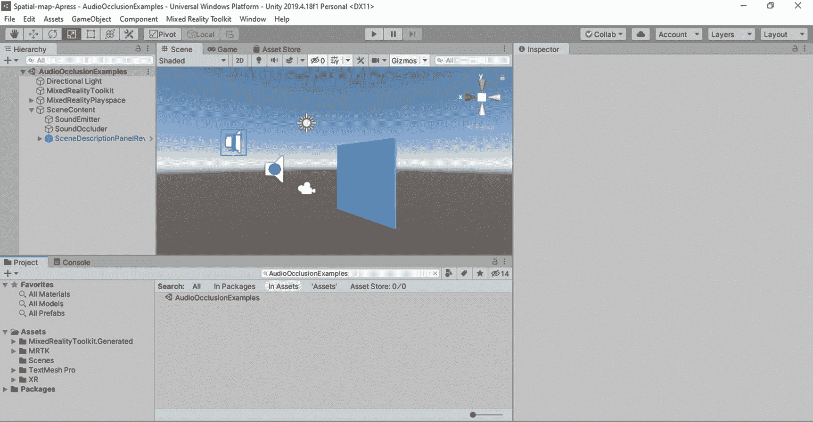
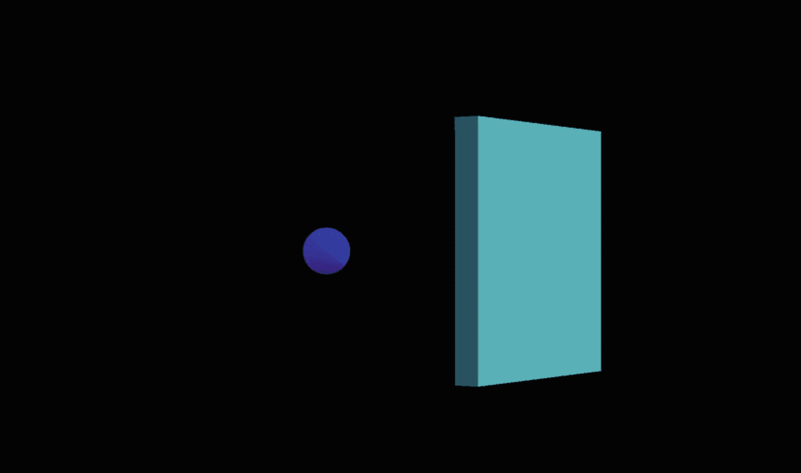
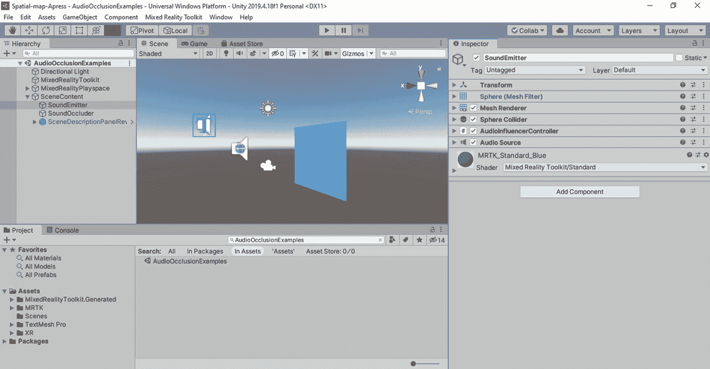
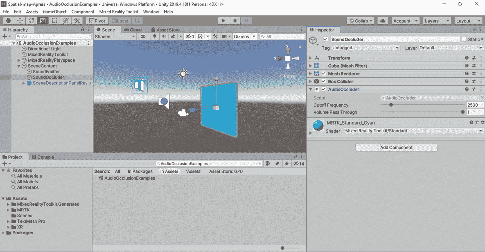
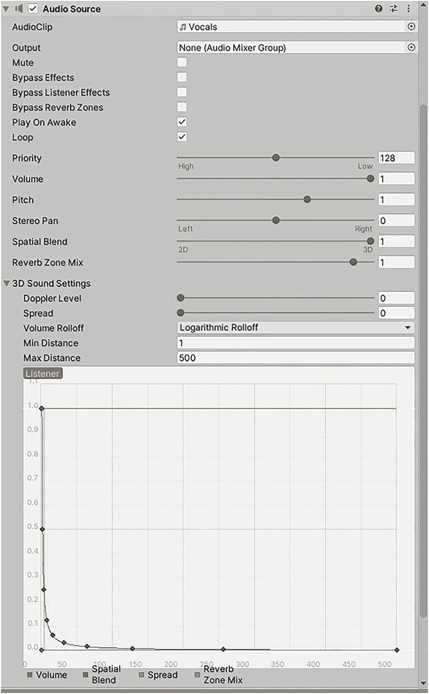
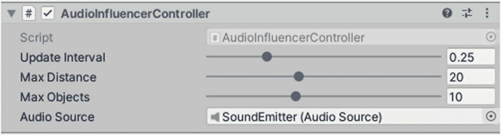
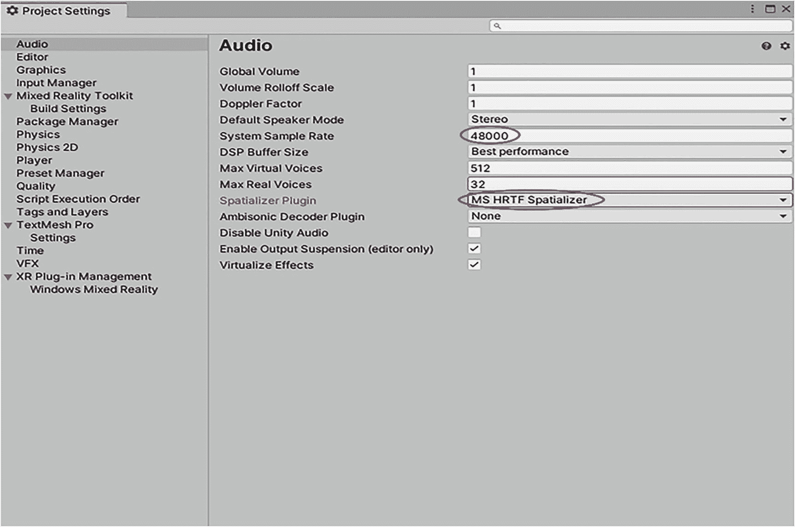
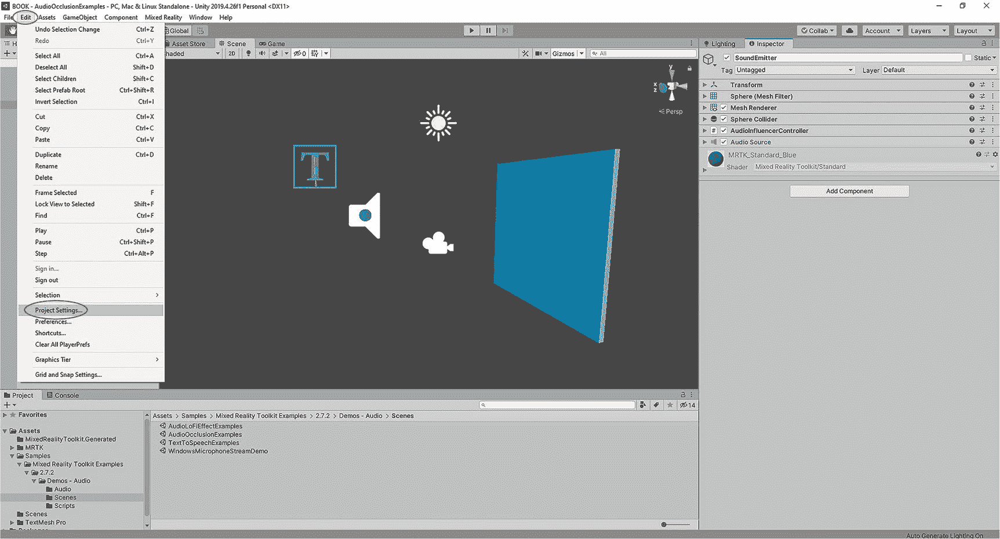
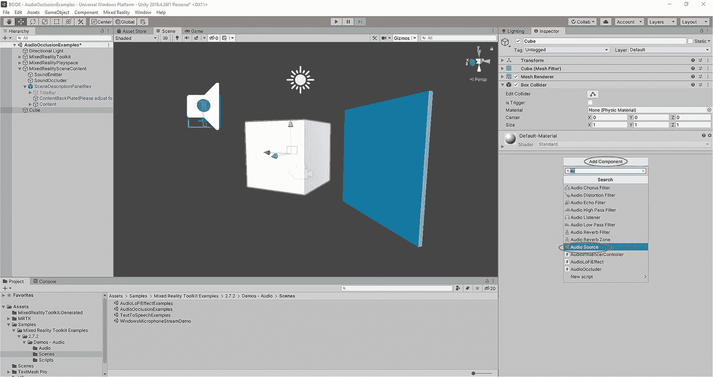
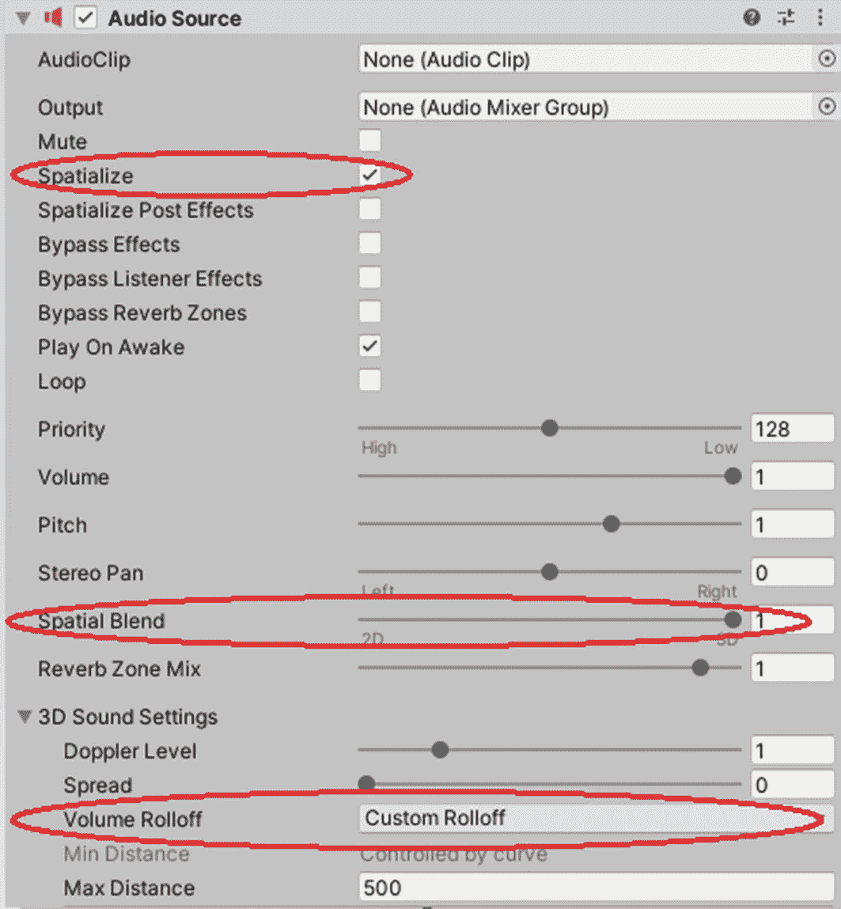

# 7. 空间音效

在本章中，我将向你介绍如何充分利用应用程序中的空间音效！我们非常依赖耳朵来精确定位周围真实物体的位置。我们的听觉系统能够检测到声波到达每只耳朵的微小差异，从而在 3D 空间中定位声源的位置。

在混合现实的背景下，这被称为*空间音效*。开发者可以利用执行复杂计算的混合现实音频工具来实现声音的空间化。这些工具确定应如何为每只耳朵修改和调整声波，以“欺骗”我们的大脑，让我们听到的声音仿佛来自 3D 空间中的某个特定点，而不是来自扬声器本身！这极大地增强了沉浸感。即使看不到虚拟物体（如果这些物体本应发出声音），用户仍然能够听到它们。这对于像 HoloLens 这样的设备尤其重要，因为它的视野有限，用户可能无法在完整的周边视觉中看到全息图。

以下是开发者可以利用空间音效的不同方式：

*   增强沉浸感。让用户感觉自己沉浸在体验中，仿佛全息图就在他们周围。
*   吸引用户对视野外全息图的注意。从用户看不到的全息图播放音频，以提示用户朝那个全息图的方向看去。
*   提供更好的交互体验。当用户在混合现实应用中与全息图或用户界面元素交互时，来自交互点的空间音频提示或效果会增强真实感。想想听到开关“咔嗒”一声是多么令人满足。现在，你可以使用空间音效在应用中重现这种满足感！
*   背景支持。通过空间音频为场景提供背景支持，为用户在使用应用程序时提供更真实的感受。

注意

空间音效仅在 Windows 10 中有效。如果你在旧版本的 Windows 上开发混合现实应用程序，空间音效将无法工作。在受支持的平台上，Windows 桌面 (Win32) 应用程序和通用 Windows 平台 (UWP) 应用程序都可以利用空间音效。

## 空间音效教程

在本节中，我将带你完成一个关于空间映射如何在混合现实应用中工作的教程。

### 步骤 1：设置 Unity 场景

在本教程中，我们将使用混合现实工具包中的一个测试场景。如果你尚未设置，请务必按照第 4 章的描述为混合现实开发设置 Unity。你也可以参考第 4 章，了解如何在 Unity 中运行混合现实工具包测试场景。

使用搜索栏或在文件夹结构中查找，在你的“项目”面板中找到 `AudioOcclusionExamples` 测试场景。将测试场景拖入你的层级视图，如图 7-1 所示。确保卸载（禁用）你可能打开的所有其他场景。

图 7-1

通过将其拖入层级视图，从混合现实工具包加载 `AudioOcclusionTest` 场景

在 Unity 中加载测试场景后，你会注意到一个蓝色方块（`SoundOccluder`），其后面有一个球体（`SoundEmitter`）。`SoundEmitter` 负责发出你测试此场景时将听到的声音。蓝色的 `SoundOccluder` 负责遮挡音频。更多内容将在步骤 3 中介绍！

### 第 2 步：试试看！

要体验此测试场景中的空间音效，请使用 Visual Studio 将应用程序部署到你的头戴式设备。

准备就绪后，请点击“播放”按钮来测试应用程序。首次启动应用程序时，你会开始听到有些模糊的歌声。

当蓝色方块位于你与球体之间时，声音会变得模糊，如图 7-2 所示。当你移动到方块旁边，使其不再位于你和球体之间时（如图 7-3 所示），你会清晰地听到来自球体的响亮歌声。

图 7-3

当你绕着蓝色方块走动时，你会注意到歌声的来源是一个蓝色球体。当蓝色方块没有阻挡声音时，你能更响亮、更清晰地听到歌声。

图 7-2

当你首次模拟测试场景时，你会看到面前有一个蓝色方块，并听到模糊的歌声。

尝试在房间或区域内的各个位置走动，并尝试向不同方向转动头部。你会惊奇地发现，你能听到歌声正是从球体的精确位置传来！

#### 有趣的实验

在应用运行期间，尝试闭上眼睛，原地转几圈，然后将你的拳头精准放在你听到音频来源的位置。现在睁开眼。神奇的是，你的拳头正好在球体的同一位置！这表明大脑有惊人的空间化声音能力，即使没有视觉线索。这也展示了 HoloLens 在数字层面空间化声音，并将音频位置与全息图位置同步的惊人能力。

### 第 3 步：理解场景

现在你已经花时间体验了空间音效，让我们更深入地探索场景，了解使其运作的所有组件。层级面板中唯一两个关键对象是 `SoundEmitter` 对象和 `SoundOccluder` 对象，如图 7-4 所示。

图 7-4

`AudioOcclusionTest` 场景包含两个我们将在本教程中关注的对象：`SoundEmitter` 和 `SoundOccluder`。

首先，我们来看看 `SoundOccluder` 游戏对象。选中 `SoundOccluder` 后，你会在检视面板中看到一个名为 `AudioOccluder.cs` 的脚本，如图 7-5 所示。`AudioOccluder.cs` 脚本是混合现实工具包中提供的一个实用脚本，允许对象遮挡空间化音频源。

图 7-5

`SoundOccluder` 对象包含 `AudioOccluder.cs` 脚本，使其能够“遮挡”其后的任何声源。

让我们来探讨为什么音频遮挡是空间音效的一个有用特性。想象一个乐队在房间里演奏音乐。当你走出房间并关上门时，你可能仍能听到乐队演奏，但听到的声音会变得模糊并且音量稍小。当你再次打开房门时，声音又变得响亮而清脆。`AudioOccluder.cs` 脚本允许开发者在混合现实应用中模拟此行为，以增强用户的真实感。

当你将 `AudioOccluder.cs` 脚本附加到对象上时，如果该遮挡对象位于你（摄像机）和音频源或发射器之间，该对象将“模糊”并降低任何空间化音频源的音量。你可以通过检视面板调整脚本的几个参数：

- `Cutoff Frequency` 参数允许你调整被遮挡声音的“模糊”程度。这本质上是一个低通滤波器。
- `Volume Pass Through` 参数允许你调整允许通过遮挡物的音量大小。

层级面板中的第二个关键对象是 `SoundEmitter`。`SoundEmitter` 游戏对象（蓝色球体）是该场景中最重要的对象，因为音频源附加在此对象上，并且声音在此处进行空间化。在层级面板中选中此对象后，你会注意到一个略显繁忙的检视面板，其中包含几个重要组件，如前文图 7-4 所示。

第一个关键组件是 `Audio Source` 组件。当此组件附加到游戏对象时，会使该对象表现得像一个音频源。它允许你选择音频文件、空间化音频源、调整音量以及为音频添加特效。让我们看看 `Audio Source` 的一些关键参数（如图 7-6 所示），你可以在检视面板中调整这些参数：

图 7-6

在 Unity 编辑器的检视面板中可见的 `Audio Source` 组件的可调整参数。

- `AudioClip`: 你可以指定音频文件或资源，例如，`.wav` 或 `.mp3` 文件。
- `Mute`: 勾选此框可使音频静音。在项目脚本中用于切换状态时很有用。
- `Play On Awake`: 勾选此框可在场景加载时播放音频源。
- `Loop`: 勾选此框可无限循环播放音频。
- `Priority`: 允许你设置音频文件的优先级。数字越大表示优先级越低，数字越小表示优先级越高。如果音频源过多，则只会听到最高优先级的源。
- `Volume`: 允许你设置音频源的音量。
- `Pitch`: 允许你加快或减慢音频源的播放速度。
- `Spatial Blend`: 允许你设置音频源被视为 3D 空间音频源的程度。对于 HoloLens 的空间音效，请将此值设置为 1。

附加到 `SoundEmitter` 游戏对象的第二个关键组件是 `AudioInfluencerController.cs` 脚本。此脚本允许音频源受到场景中其他游戏对象的影响。例如，`SoundOccluder` 游戏对象（包含 `AudioOccluder.cs` 脚本）能够影响此音频源，正是因为 `AudioInfluencerController.cs` 脚本。让我们看看该脚本的一些参数（见图 7-7），这些参数可以在检视面板中调整：

图 7-7

在 Unity 编辑器的检视面板中可见的 `AudioInfluencerController.cs` 脚本的可调整参数。

- `Update Interval`: 音频影响更新的时间间隔，以秒为单位。要每帧更新，请将值设置为 0。较长的时间间隔可提供更好的应用性能，但也会增加激活影响者的时间延迟。
- `Max Distance`: 此对象在查找用户或影响者时的最大距离，以米为单位。
- `Max Objects`: 在查找影响者时要考虑的最大对象数量。

### 第 4 步：在应用程序中启用空间音效

既然您已经了解了空间音效的一些关键要素，并通过混合现实工具包体验了一个可运行的示例，那么接下来让我们看看如何在您自己的应用程序中实现空间音效。

首先，您需要在 Unity 的设置中启用空间音效。请进入 `Edit` ➤ `Project Settings`。

打开 `Project Settings` 窗口后，选择 `Audio`，然后在 `Spatializer Plugin` 下拉菜单中选择 `Microsoft HRTF` 扩展，如图 7-8a 所示。将 `System Sample Rate` 设置为 `48000`。

图 7-8b

在 Unity 的音频设置中启用 `Spatial Audio`。请务必选择 `MS HRTF Spatializer` 并将 `System Sample Rate` 设置为 `48000`。

图 7-8a

从编辑菜单选择 `Project Settings`

其次，您需要为任何希望作为音频源的游戏对象附加一个 `Audio Source` 组件。您可以通过选择游戏对象，点击其 `Inspector` 面板底部的 `“Add Component”` 按钮，然后搜索并附加 `Audio Source` 组件来执行此操作，如图 7-9 所示。如图 7-9 所示，我在我们一直使用的 `AudioOcclusionExamples` 场景中创建了一个新的立方体游戏对象，用以演示如何在新游戏对象上创建空间音效。

图 7-9

将 `Audio Source` 组件附加到您希望作为音频源的游戏对象上。

第三，您需要为空间音效配置 `Audio Source` 组件。在 `Audio Source` 组件中有三个参数需要设置，如图 7-10 所示。您需要进行以下更改：

图 7-10

修改 `Audio Source` 组件中显示的三个参数以使声音空间化

*   启用 `Spatialize` 复选框。
*   将 `Spatial Blend` 设置为 `1`。
*   将 `Volume Rolloff` 设置为 `“Custom Rolloff”`。您可能需要展开 `“3D Sound Settings”` 项才能看到此参数。

这就是在您的应用程序中启用空间音效所需的全部操作！您可以随意将资源中的音频文件拖放到 `AudioClip` 区域，并使用头戴显示设备进行体验。

要将一个对象转变为音频遮挡器，只需将 `AudioInfluencerController.cs` 脚本附加到包含音频源的游戏对象上，并将 `AudioOccluder.cs` 脚本附加到您希望作为音频遮挡器的对象上。请确保摄像机具有 `Audio Listener` 组件。不过，该组件默认包含在 `HolographicCamera` 预制件中。这决定了音频的听音点位置，并对声音进行空间化处理，以在该点生成波形。

> **注意**
>
> 要使音频遮挡和空间音效正常工作，`“Audio Listener”` 组件也需要附加到摄像机上。默认情况下，它在混合现实工具包的 `HoloLensCamera` 预制件中已包含。

### 空间音效设计注意事项

在本节中，我们将讨论在应用程序中使用空间音效的一些设计注意事项和最佳实践。我们将探讨何时使用空间音效，以及在使用空间音效时应避免的事项。

#### 何时使用空间音效

只要有可能，请使用空间音效来帮助*引导用户*。由于视野非常小，像 HoloLens 这样的设备常常会让试图寻找感兴趣对象的用户感到沮丧。虽然可以使用视觉箭头帮助用户找到要查看的全息图，但利用我们本能地朝着听到声音的方向看过去的能力会更好。

> **提示**
>
> 当使用空间音效引导用户或定位对象时，请使用低频或中频音频。您有没有试过通过蟋蟀的叫声来定位它？这非常困难，因为蟋蟀的叫声频率非常高。我们的大脑根据声波到达每只耳朵的方式来计算声音的位置。较大的声波（较低频率）比较小的声波（较高频率）更容易解读。

通过尽可能附加*适当的*空间音效来增加混合现实体验的*真实感*和*沉浸感*。我使用“适当的”这个词是因为错误使用空间音效可能会令人厌烦和刺耳。避免使用响亮、令人不悦的噪音。为碰撞的物体、被点击的按钮以及移动的全息图添加微妙的音频效果。可以把空间音效想象成影子。我们平时并不会真正留意影子，但当真实物体的影子被移除时，场景会变得奇怪且“不对劲”。同样，在虚拟环境中缺乏适当的音频效果会使其看起来不真实。空间音效的存在可能不会被注意到，但就像影子一样，它们对于完整体验是必要的。空间音效的意图不应是引起对声音本身的注意，而是让用户感到舒适并沉浸在其体验中。

只要有可能，您应该在混合现实应用程序中*将所有声音空间化*。在物理现实中，所有声音都是空间化的——来自一个或多个声源。混合现实应用程序应该让用户沉浸在 3D 体验中——不仅仅是视觉上，听觉上也应如此。

#### 使用空间音效应避免什么

与数字全息图一样，您可以在 Unity 中使用空间音效做一些违背物理定律的事情。有时，这些效果可以为您的应用程序增添特殊优势。但是，如果没有经过仔细测试和考量，它们可能会给用户带来不自然甚至不舒服的体验。

*应极少使用*，甚至最好避免使用不可见的音频源*或发射器*。当将音频源附加到不可见的对象上时，我们的听觉能够精确定位音频的来源。然而，当用户看向声音传来的位置，却没有看到任何可见的物体时，这可能会成为一种令人不安的体验。

不要混合太多声音，并且*避免让 2D 声音盖过空间音效*。正如本章前面所述，设备通过对声波进行细微修改来实现空间音效效果。当这些效果被背景音乐等环境噪音掩盖或淹没时，空间音效体验就会下降。当需要混合多个声音源时，请确保空间音效的声音比任何环境声音都大。

*尽量少用合成或人工声音*。当声音不自然时，用户可能对声音的来源缺乏强烈的直觉。相反，应使用自然声音，如鸟鸣、按钮的咔哒声、人的说话声以及其他录制的声音。在设计空间音效体验时，*要利用人类的直觉或预期*。例如，人的声音很可能出现在正常人的身高范围内——因此，可以利用人声引导用户观看大致在视线水平的东西。对于用户上方的物体，可以使用树叶沙沙声或鸟鸣声。

## 总结

恭喜！在本章中，你学习了混合现实开发中空间声音的工作原理。我们详细讲解了`HoloToolkit`中包含的一个可运行的空间声音示例，学习了如何在你的应用中实现空间声音，并掌握了一些在应用中设计空间声音的最佳实践。现在，你已经具备了在应用中开始实现出色空间音频体验所需的工具！

在开发应用时，声音设计很容易被忽视优先级，甚至完全被遗忘。然而，我无论如何强调在混合现实开发中优秀声音设计的重要性都不为过。我至今仍记得在一次视频编辑课程中，一位教授给我的中肯建议：

> *如果音频质量好，人们会原谅糟糕的视频。如果音频质量差，即使视频再出色，人们也不会原谅。*
> 
> *——弗雷德·梅茨格*

声音设计至关重要，应从应用设计之初就将其视为一部分，而非事后才考虑的因素。

