# 8. Azure Spatial Anchors

在本章中，你将学习如何使用 Azure Spatial Anchors。我们将学习如何在混合现实中锚定对象以体验真实世界；你还将探索启动和停止 Azure Spatial Anchors 会话、以及在 HoloLens 2 上创建、上传和下载 Azure Spatial Anchors 所需的各个步骤。

## 什么是 Azure Spatial Anchors？

Azure Spatial Anchors 是一个跨平台服务，允许开发者通过在不同设备上随时间保持其位置的对象来创建混合现实体验。该服务使开发者能够构建具有空间感知能力的混合现实应用。这些应用可支持 Microsoft HoloLens、基于 ARKit 的 iOS 设备以及基于 ARCore 的 Android 设备。开发者现在可以开发能够感知空间、指定有效兴趣点，并通过支持的设备回忆这些兴趣点的应用。这些兴趣点被称为空间锚点（Spatial Anchors）。

Azure Spatial Anchors 依赖于混合现实/增强现实追踪器。这些追踪器通过摄像头感知周围环境，并在设备穿越空间时以六自由度（6DoF）追踪设备位置。当创建一个空间锚点时，客户端 SDK 会收集锚点周围的环境信息并将其传输到服务端。如果任何其他设备在同一空间查找该锚点，类似的记录会被传输到服务端。该记录会与之前存储的环境数据进行匹配。然后，锚点相对于设备的位置会被发回，用于应用之中。

## Azure Spatial Anchors 教程

### 第一步：创建新的 Unity 场景

首先创建一个新的 Unity 项目（参考第 2 章），将其命名为`"Azure Spatial Anchors Tutorial"`并保存场景，为其取一个你喜欢的名称，并确保按照第 3 章所述将 Unity 设置为混合现实开发环境。

### 第二步：安装内置 Unity 包

在这一步中，你将学习安装 Unity 内置包`AR Foundation`，因为 Azure Spatial Anchors 需要它。`AR Foundation`允许你在 Unity 中以跨平台方式使用增强现实平台。

在 Unity 菜单中，选择`Window ➤ Package Manager`打开`Package Manager`窗口，如图 8-1 所示。然后选择`AR Foundation`并点击`Install`按钮安装该包。请参考图 8-2。

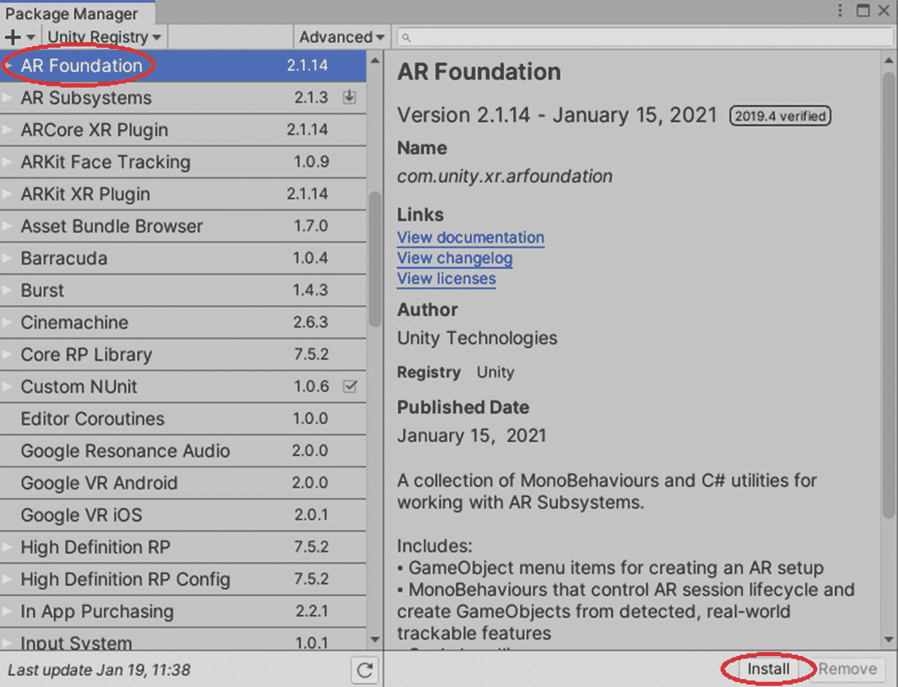

图 8-2

你会看到`AR Foundation`具有特定版本；点击安装按钮进行安装。

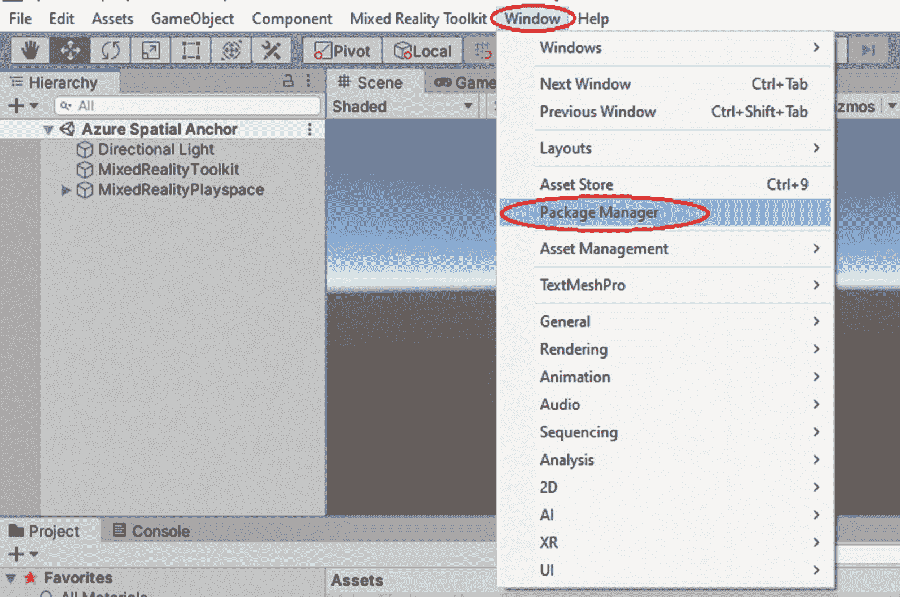

图 8-1

选择窗口按钮后，你会看到包管理器界面。

### 第三步：下载并导入教程资源

在这一步中，你将下载并导入一些用于测试项目的基本资源文件夹；你可以参考第 3 章来重温如何导入 Unity 包。

按列出的顺序下载并导入以下资源包：

*   [AzureSpatialAnchors.unitypackage](https://github.com/Azure/azure-spatial-anchors-samples/releases/download/v2.2.1/AzureSpatialAnchors.unitypackage)（版本 2.2.1）

*   [MRTK.HoloLens2.Unity.Tutorials.Assets.GettingStarted.2.4.0.unitypackage](https://github.com/microsoft/MixedRealityLearning/releases/download/getting-started-v2.4.0/MRTK.HoloLens2.Unity.Tutorials.Assets.GettingStarted.2.4.0.unitypackage)

*   [MRTK.HoloLens2.Unity.Tutorials.Assets.AzureSpatialAnchors.2.4.0.unitypackage](https://github.com/microsoft/MixedRealityLearning/releases/download/azure-spatial-anchors-v2.4.0/MRTK.HoloLens2.Unity.Tutorials.Assets.AzureSpatialAnchors.2.4.0.unitypackage)

导入教程资源后，你的项目窗口应类似于图 8-3 所示。

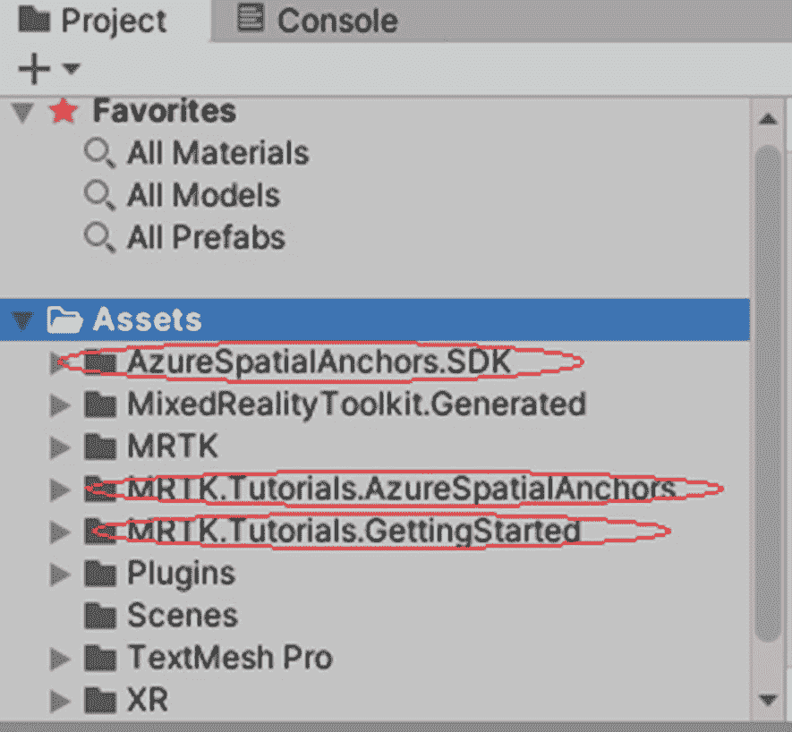

图 8-3

在项目窗口中，导入 Unity 包后会添加三个额外的文件夹。

### 第四步：准备场景

在这一步中，你将通过添加上一步导入的一些预制件来配置场景，以测试 Azure Spatial Anchors 应用。

在项目窗口中，导航到`Assets ➤ MRTK.Tutorials.AzureSpatialAnchors ➤ Prefabs`文件夹，然后点击并拖动以下预制件到层级窗口中，以将它们添加到场景中：

*   `ButtonParent` 预制件

*   `DebugWindow` 预制件

*   `Instructions` 预制件

*   `ParentAnchor` 预制件

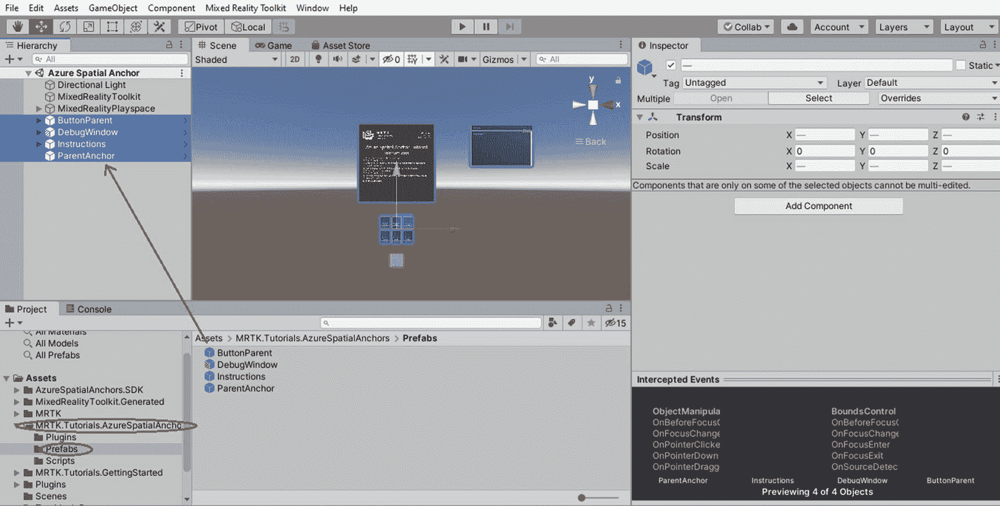

图 8-4

按住 Shift 键选中全部四个预制件，然后拖放到层级窗口中。

### 第 5 步：配置按钮以操作场景

在此步骤中，您将通过添加脚本配置按钮，以演示本地锚点和`Azure Spatial Anchors`在应用程序中的基本行为。

为了在屏幕上持久地布局全息图和对象，设备必须能够理解您的周围环境，然后允许您将对象放置在环境中。当您启动`Azure Session`时，它会扫描您的环境并获取空间映射。通过这种方式，您可以确定锚点的位置。移动平台（iOS 和 Android）需要提示其摄像头扫描环境，而`HoloLens`则持续监控环境。要启动`Azure Session`，请遵循以下说明。

在`Hierarchy`窗口中，展开`ButtonParent`对象，并选择名为`StartAzureSession`的第一个子对象。然后，在`Inspector`窗口中导航到`Button Config Helper (Script)`。按照图 8-5 所示，配置附加到该脚本的`OnClick()`事件。

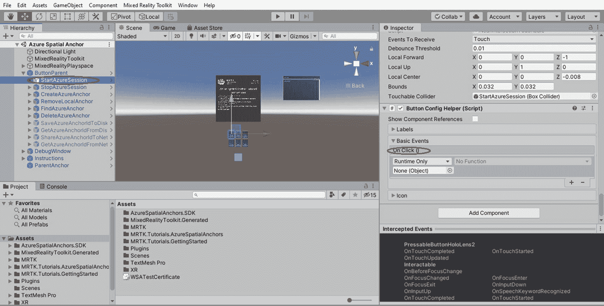

图 8-5

在`Inspector`窗口中，我们可以在`Basic Events`下找到`On Click()`事件。

现在，我们必须配置`StartAzureSession`按钮的`On Click`事件。

选择`ParentAnchor`对象，并将其拖放到`On Click`事件中的`None (Object)`字段。参考图 8-6。

从`No Function`下拉菜单中，选择`AnchorModuleScript` ➤ `StartAzureSession()`，将此函数设置为事件触发时要执行的操作。参考图 8-7。

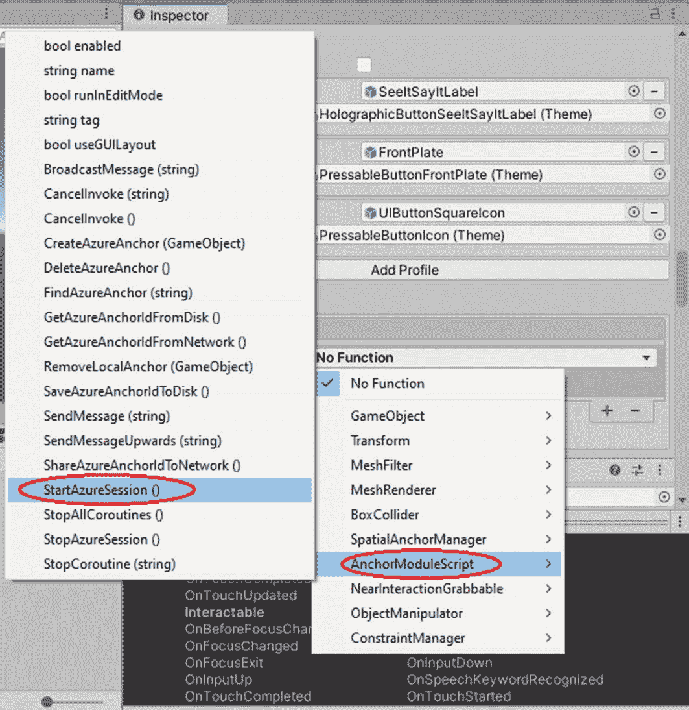

图 8-7

在下拉列表中，选择`AnchorModuleScript` ➤ `StartAzureSession()`函数。

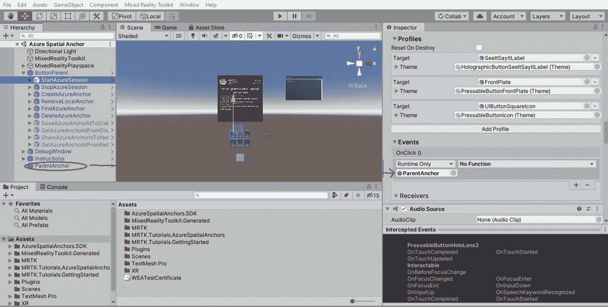

图 8-6

将`ParentAnchor`拖放到`Basic Events`下`On Click`事件中的`None (Object)`字段。

要停止`Azure Session`，您可以点击`StopAzureSession`按钮，这将停止环境处理及所有观察程序。要配置`StopAzureSession`按钮，请遵循给定的说明。

在`Hierarchy`窗口中，选择下一个名为`StopAzureSession`的按钮；然后在`Inspector`窗口中，按如下方式配置`Button Config Helper (Script)`组件的`OnClick()`事件：

*   将`ParentAnchor`对象分配给`None (Object)`字段。
*   从`No Function`下拉菜单中，选择`AnchorModuleScript` ➤ `StopAzureSession()`，将此函数设置为事件触发时要执行的操作。

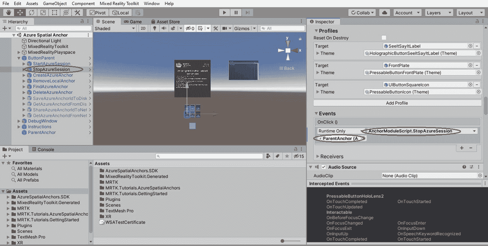

图 8-8

配置`StopAzureSession`按钮的`On Click`事件。

如果您希望在不同平台上将全息图或对象持久地放置在环境中，则需要创建可永久放置的锚点。您可以通过点击`CreateAzureAnchor`按钮来创建锚点。以下说明将指导您完成此过程。

在`Hierarchy`窗口中，选择名为`CreateAzureAnchor`的按钮；然后在`Inspector`窗口中，按如下方式配置`Button Config Helper (Script)`组件的`OnClick()`事件：

*   将`ParentAnchor`对象分配给`None (Object)`字段。
*   从`No Function`下拉菜单中，选择`AnchorModuleScript` ➤ `CreateAzureAnchor()`，将此函数设置为事件触发时要执行的操作。
*   将`ParentAnchor`对象分配给空的`None (Game Object)`字段，使其作为`CreateAzureAnchor()`函数的参数。

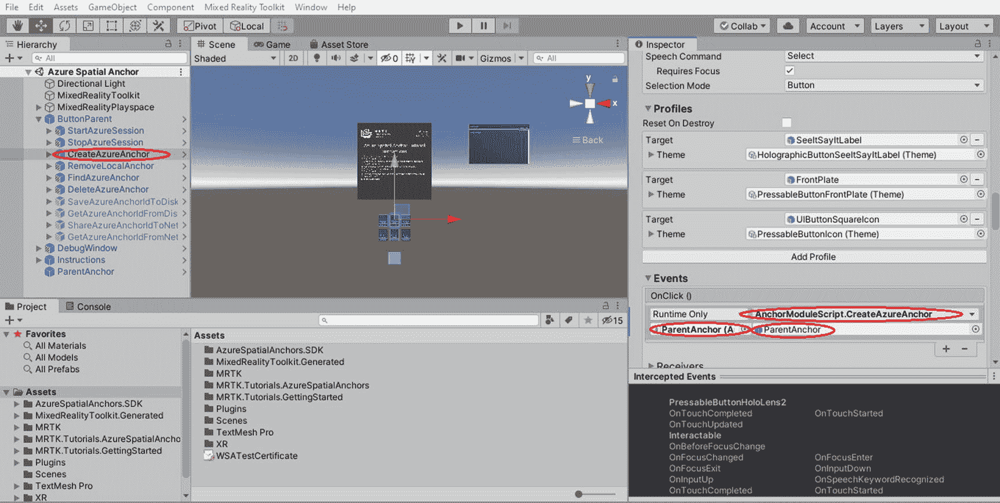

图 8-9

配置`CreateAzureAnchor`按钮的`On Click()`事件。

如果您对已创建的锚点不满意，可以轻松地先将其移除，然后重新创建。要移除本地锚点，您可以点击`RemoveLocalAnchor`按钮。以下步骤将指导您如何配置`RemoveLocalAnchor`按钮。

同样，在`Hierarchy`窗口中，选择下一个名为`RemoveLocalAnchor`的按钮；然后在`Inspector`窗口中，按如下方式配置`Button Config Helper (Script)`组件的`OnClick()`事件：

*   将`ParentAnchor`对象分配给`None (Object)`字段。
*   从`No Function`下拉菜单中，选择`AnchorModuleScript` ➤ `RemoveLocalAnchor()`，将此函数设置为事件触发时要执行的操作。
*   将`ParentAnchor`对象分配给空的`None (Game Object)`字段，使其作为`RemoveLocalAnchor()`函数的参数。

图 8-10

配置`RemoveLocalAnchor`按钮的`On Click`事件。

能够定位之前保存的锚点是使用`Azure Spatial Anchors`的原因之一。`Azure Spatial Anchors`利用会话期间收集的信息来定位环境中先前保存的锚点。您可以使用`FindAzureAnchor`按钮执行此功能。请按照以下步骤配置`FindAzureAnchor`按钮。

在`Hierarchy`窗口中，选择名为`FindAzureAnchor`的按钮；然后在`Inspector`窗口中，按如下方式配置`Button Config Helper (Script)`组件的`OnClick()`事件：

*   将`ParentAnchor`对象分配给`None (Object)`字段。
*   从`No Function`下拉菜单中，选择`AnchorModuleScript` ➤ `FindAzureAnchor()`，将此函数设置为事件触发时要执行的操作。

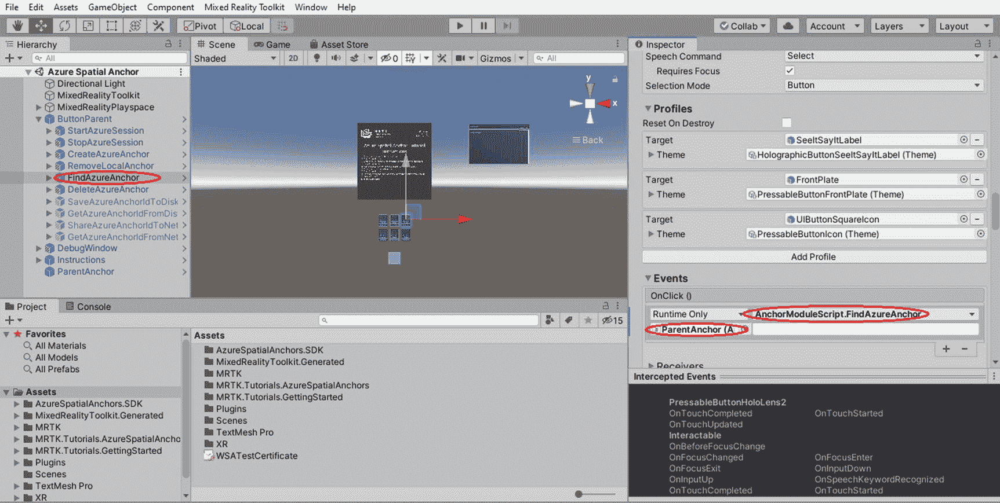

图 8-11

配置`FindAzureAnchor`按钮的`On Click`事件。

如果创建的锚点不再使用，在开发过程中删除这些锚点是一种良好的实践，因为它有助于保持资源整洁并避免将来的混淆。要删除您的锚点，您可以点击`DeleteAzureAnchor`按钮。以下步骤将指导您如何配置`DeleteAzureAnchor`按钮。

同样，在`Hierarchy`窗口中，选择下一个名为`DeleteAzureAnchor`的按钮；然后在`Inspector`窗口中，按如下方式配置`Button Config Helper (Script)`组件的`OnClick()`事件：

*   将`ParentAnchor`对象分配给`None (Object)`字段。
*   从`No Function`下拉菜单中，选择`AnchorModuleScript` ➤ `DeleteAzureAnchor()`，将此函数设置为事件触发时要执行的操作。

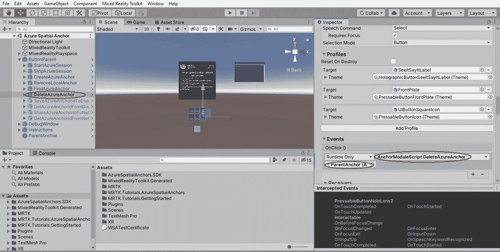

图 8-12

配置`DeleteAzureAnchor`按钮的`On Click`事件。

好的，作为一名高级文档工程师和翻译员，我将严格遵循您的注意事项和示例格式，将给定的英文文本翻译成中文。

译文：

### 步骤 6：将场景连接到 Azure 资源

在此步骤中，我们将把已创建的场景连接到在 Azure 门户中创建的空间定位点（Azure 资源）。创建 Azure 资源后，您将获得访问密钥和帐户 ID。

**注意：**  
请参考以下链接创建一个空间定位点资源，从中可以获取访问密钥和账户 ID：[`https://docs.microsoft.com/en-us/azure/spatial-anchors/quickstarts/get-started-unity-hololens?tabs=azure-portal#create-a-spatial-anchors-resource`](https://docs.microsoft.com/en-us/azure/spatial-anchors/quickstarts/get-started-unity-hololens%253Ftabs%253Dazure-portal%2523create-a-spatial-anchors-resource)

在 `Hierarchy` 窗口中，选择 `ParentAnchor` 对象；随后在 `Inspector` 窗口中，找到 `Spatial Anchor Manager (Script)` 组件。在此处，您将找到两个空白字段：`Spatial Anchors Account Id` 字段和 `Spatial Anchors Account Key` 字段。

- 在 `Spatial Anchors Account Id` 字段中，粘贴来自 Azure 空间定位点帐户的帐户 ID。
- 在 `Spatial Anchors Account Key` 字段中，粘贴来自 Azure 空间定位点帐户的主访问密钥或辅助访问密钥。

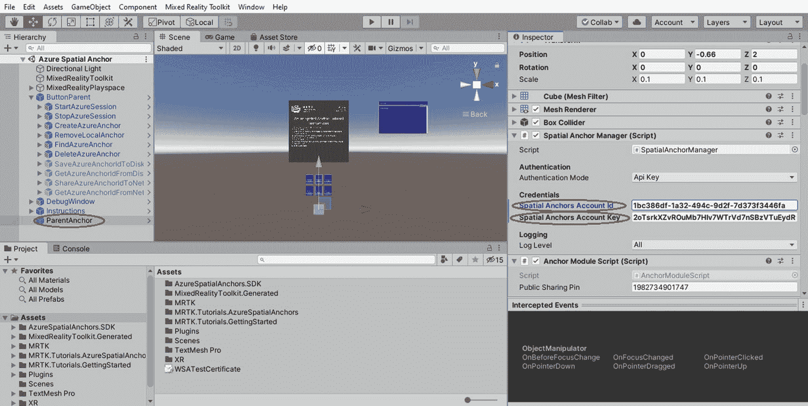  
*图 8-13*  
为 `ParentAnchor` 对象添加相关的 Azure 空间定位点资源凭据。

### 步骤 7：在设备上测试应用程序

您无法在 Unity 编辑器中运行 Azure 空间定位点，因此要测试 Azure 空间定位点的功能，您需要构建项目并将应用部署到您的设备。

当应用程序在设备上加载后，请遵循以下说明：

- 将立方体移动到另一个位置。
- 启动 Azure 会话。
- 创建 Azure 锚点（在立方体的位置创建一个锚点）。
- 停止 Azure 会话。
- 移除本地锚点（允许用户移动立方体）。
- 将立方体移动到其他位置。
- 启动 Azure 会话。
- 查找 Azure 锚点（将立方体定位到步骤 3 中的位置）。
- 删除 Azure 锚点。
- 停止 Azure 会话。

您也可以在 Unity 场景中的 `Instruction` 面板中找到这些说明。

**注意：**  
Azure 空间定位点使用互联网来保存和加载锚点数据，因此请确保您的设备已连接到互联网。

## 总结

恭喜！在本章中，您学习了如何对锚点执行各种操作。我们逐步介绍了在场景中创建、移除、查找和删除空间定位点的方法。现在，您已经掌握了在应用程序中开始实现空间定位点所需的工具。

