# 9. 共享体验

在本章中，我们将学习使用 Photon Unity 网络（PUN）构建多用户体验的基础知识。PUN 是混合现实开发人员可用来创建共享体验的多种网络选项之一。

## 什么是共享体验？

共享体验顾名思义，就是与他人看到、听到或做着相同的事情。在这里，您将使用 Photon 平台共享彼此的交互。

共享体验能够创造归属感，无论大小如何，并提供机会将我们的关系提升到更高水平的信任和亲密度。

## 多用户功能教程

在本节中，我将引导您完成一个教程，了解多用户功能在混合现实应用程序中的工作原理。

## 设置 Photon Unity 网络

在本节中，您将为使用 Photon Unity 网络（PUN）创建共享体验做准备。您将学习如何创建 PUN 应用，将 PUN 资源导入到 Unity 项目中，以及将 Unity 项目连接到 PUN 应用。

### 步骤 1：创建新的 Unity 场景

我们将创建一个新的 Unity 项目（参考第 2 章），将其命名为 `MultiUserCapabilities`，保存您的场景，并为其指定一个您喜欢的名称，同时确保按照第 3 章所述，为混合现实开发设置好 Unity。

### 步骤 2：启用附加功能

在此步骤中，您将学习启用 `Internet Client Server` 功能和 `Private Network Client Server` 功能，这是共享彼此交互所必需的。在 Unity 菜单中，选择 `Edit ➤ Project Settings` 打开 `Player Settings` 窗口，然后找到 `Player ➤ Publishing Settings` 部分（图 9-1）。

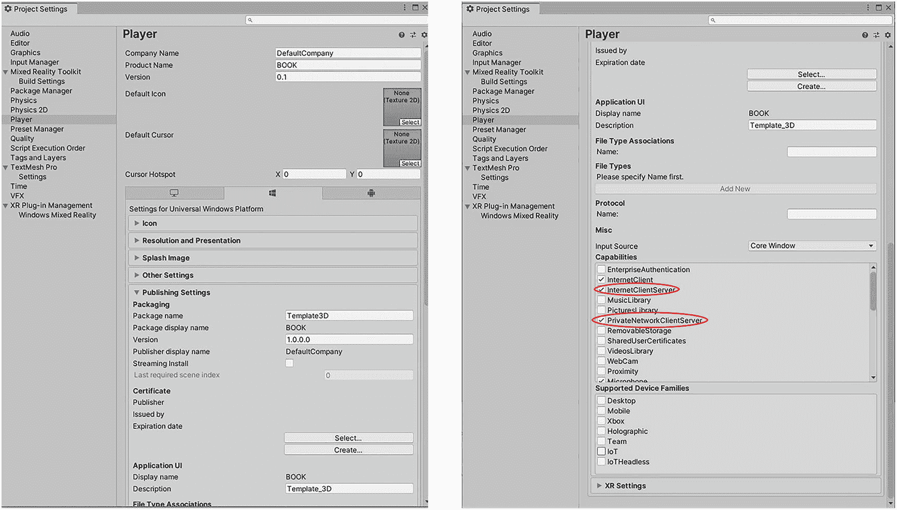  
*图 9-1*  
启用 `Internet Client Server` 和 `Private Network Client Server` 功能。

在 `Publishing Settings` 中，向下滚动到 `Capabilities` 部分，并再次确认在早期配置 Unity 项目步骤中启用的 `InternetClient`、`Microphone`、`SpatialPerception` 和 `GazeInput` 功能已启用。

然后启用以下附加功能：

- `InternetClientServer` 功能
- `PrivateNetworkClientServer` 功能

### 步骤 3：安装 Unity 内置包

在此步骤中，您将学习安装 Unity 内置包 `AR Foundation`。`AR Foundation` 允许您在 Unity 中以跨平台的方式处理增强现实平台。在 Unity 菜单中，选择 `Window ➤ Package Manager` 打开 `Package Manager` 窗口，然后选择 `AR Foundation`，并点击 `Install` 按钮来安装该包（图 9-2）。

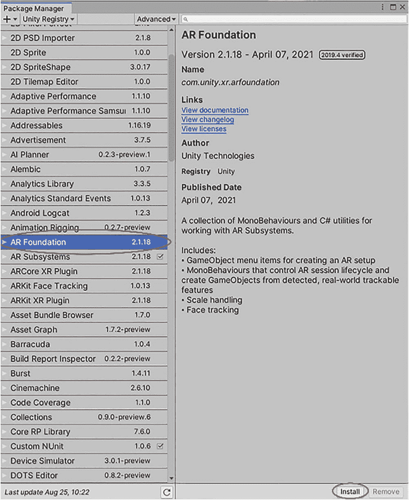  
*图 9-2*  
您将看到带有特定版本的 `AR Foundation`；点击 `Install` 按钮进行安装。


### 步骤 4：导入教程资源

将 `AzureSpatialAnchors` SDK V2.7.1 添加到你的 Unity 项目中（你需要参阅第 3 章——Unity 包管理器使用清单文件 `manifest.json`）。在与 `Dependencies` 部分同级的文件顶部，添加清单 9-1 以将 Azure Spatial Anchors 注册表包含到你的项目中。`scopedRegistries` 条目告诉 Unity 在哪里查找 Azure Spatial Anchors SDK 包。

```
{
"scopedRegistries": [
{
"name": "Azure Mixed Reality Services",
"url": "https://api.bintray.com/npm/microsoft/AzureMixedReality-NPM",
"scopes": [
"com.microsoft.azure.spatial-anchors-sdk"
]
}
],
"dependencies": {
"com.microsoft.azure.spatial-anchors-sdk.android": "2.7.1",
"com.microsoft.azure.spatial-anchors-sdk.ios": "2.7.1",
"com.microsoft.azure.spatial-anchors-sdk.windows": "2.7.1",
Listing 9-1.
将 Azure Spatial Anchors 注册表包含到项目中的代码
```

（导入 `MultiUserCapabilities` 教程资源包后，你会在控制台窗口中看到几个 `CS0246` 错误，提示类型或命名空间缺失。这是预期行为，将在下一节导入 PUN 资源时得到解决。）

要添加这些包，请按列出的顺序下载并导入以下 Unity 自定义包（如有需要，可参阅第 4 章了解操作方法）：

- `MRTK.HoloLens2.Unity.Tutorials.Assets.GettingStarted.2.5.0.1.unitypackage`
- `MRTK.HoloLens2.Unity.Tutorials.Assets.MultiUserCapabilities.2.4.0.unitypackage`

导入教程资源后，你的项目窗口应类似于图 9-3 所示。

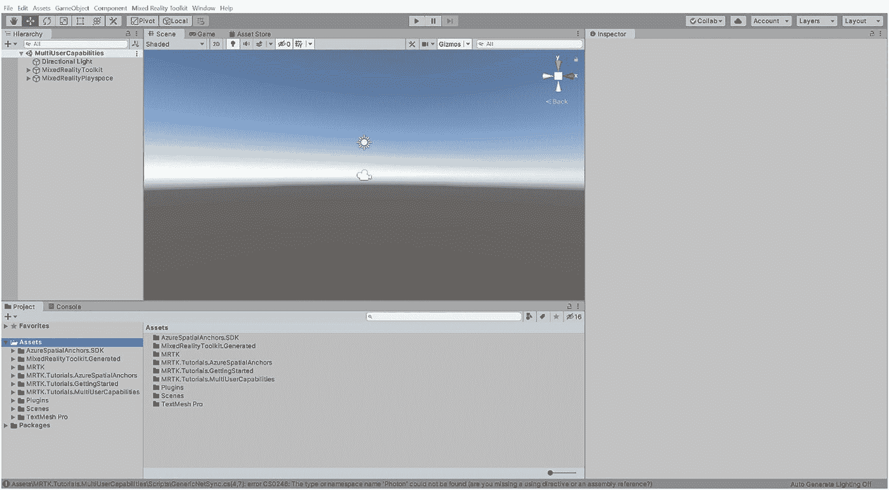

图 9-3

导入教程资源后，你的项目窗口应类似于这样

### 步骤 5：导入 PUN 资源

PUN 使你能够向网络添加多用户功能，并快速在全球范围内启动它们。在 Unity 菜单中，选择 `Window` ➤ `Asset Store` 打开资源商店窗口，搜索并选择 Exit Games 的 `PUN 2 - FREE`，然后点击下载按钮将资源包下载到你的 Unity 账户。下载完成后，点击导入按钮打开导入 Unity 包窗口（图 9-4）。

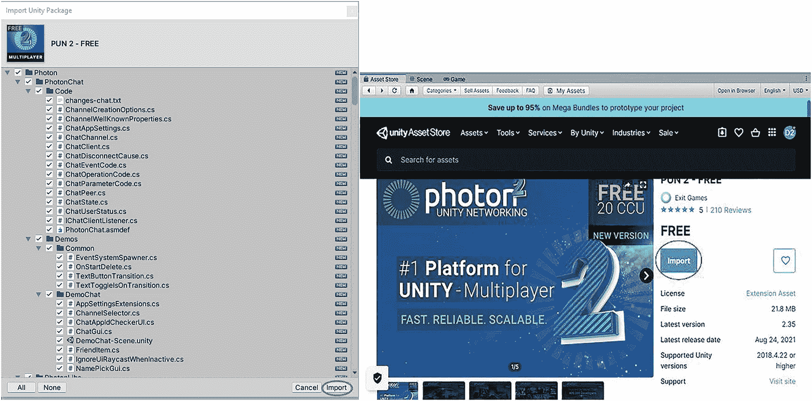

图 9-4

将 PUN 资源导入到你的项目

在导入 Unity 包窗口中，点击全部按钮确保所有资源都被选中，然后点击导入按钮导入资源。Unity 完成导入过程后，PUN 向导窗口将出现并加载 PUN 设置菜单；你可以暂时忽略或关闭此窗口（图 9-5）。

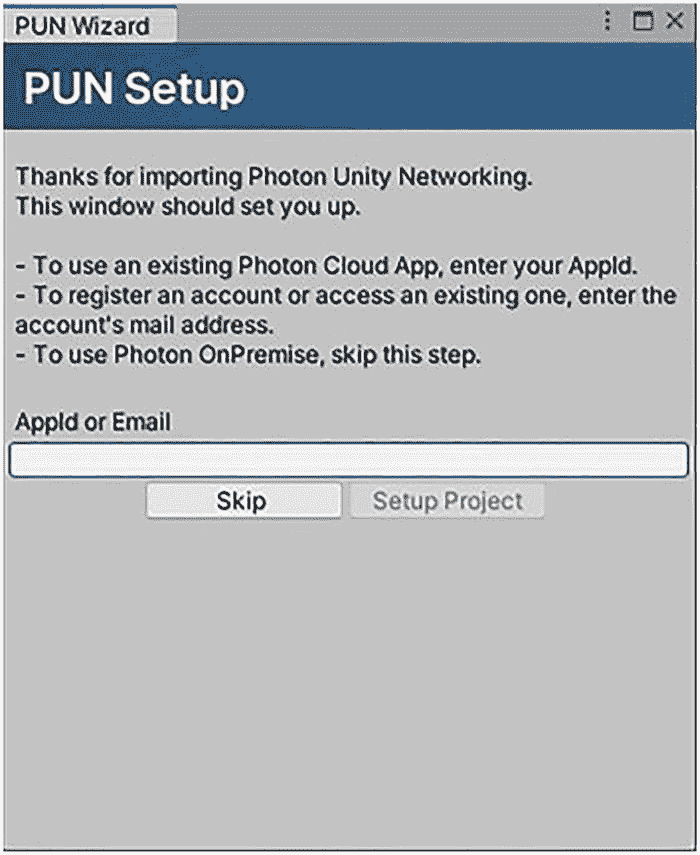

图 9-5

PUN 向导窗口

### 步骤 6：创建 PUN 应用程序

在本节中，如果你还没有 Photon 账户，你将创建一个，并创建一个新的 PUN 应用。导航到 Photon 仪表盘（`https://cutt.ly/4nUQsgb`），如果你已有想使用的账户，请登录；否则，点击“创建一个”链接，并按照说明注册一个新账户（图 9-6）。

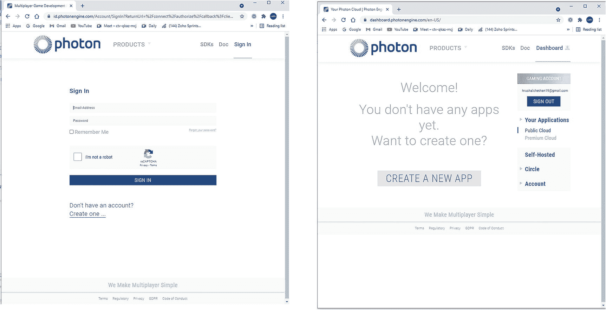

图 9-6

登录 PUN 应用程序

登录后，点击“创建新应用”按钮。在“创建新应用程序”页面上，输入如图 9-7 所示的以下值：

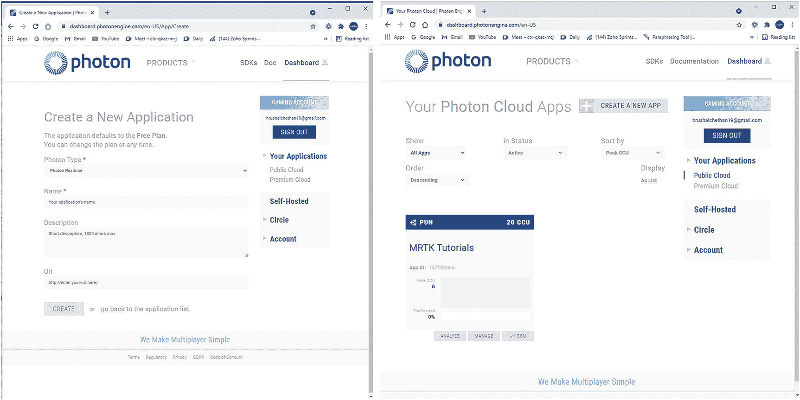

图 9-7

创建 PUN 应用程序

- 对于“Photon 类型”，选择 `Photon PUN`。
- 对于“名称”，输入一个合适的名称，例如 `MRTK Tutorials`。
- 对于“描述”，可选地输入一个合适的描述。
- 对于“Url”，将该字段留空。

然后点击“创建”按钮创建新应用。

Photon 完成创建过程后，新的 PUN 应用将出现在你的仪表盘上。

### 步骤 7：将 Unity 项目连接到 PUN 应用程序

在本节中，你将把 Unity 项目连接到上一节中创建的 PUN 应用。在 Photon 仪表盘上，点击“App ID”字段以显示应用 ID，然后将其复制到剪贴板（图 9-8）。

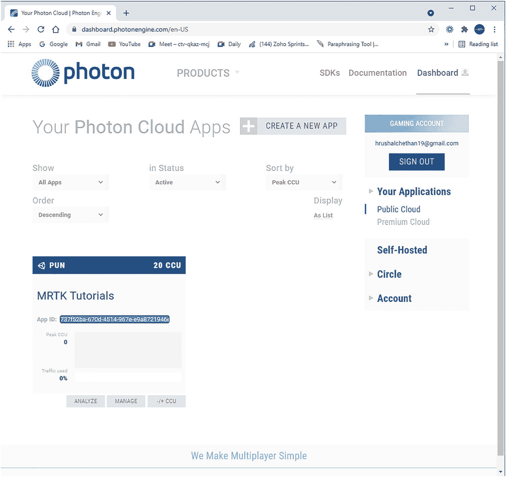

图 9-8

PUN 应用程序 ID

在 Unity 菜单中，选择 `Window` ➤ `Photon Unity Networking` ➤ `PUN Wizard` 打开 PUN 向导窗口，然后点击“设置项目”按钮打开 PUN 设置菜单。在 `AppId or Email` 字段中，粘贴上一步复制的 PUN 应用 ID。然后点击“设置项目”按钮应用该应用 ID（图 9-9）。

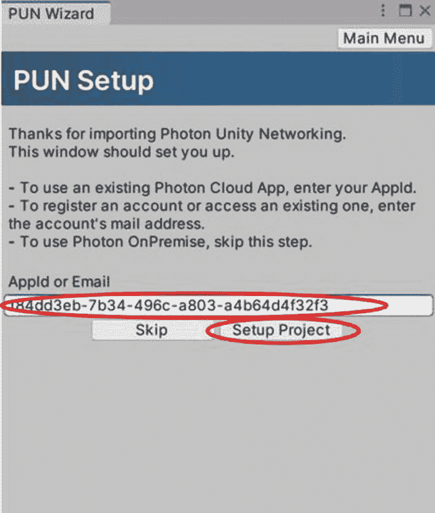

图 9-9

将 PUN 应用程序 ID 粘贴到“将 Unity 项目连接到 PUN 应用程序”

Unity 完成 PUN 设置过程后，PUN 设置菜单将显示“完成！”消息，并自动在项目窗口中选择 `PhotonServerSettings` 资源，以便在检查器窗口中显示其属性（图 9-10）。

**注意**

设置可能已经显示，但要更新属性，你需要关闭它并重新打开。

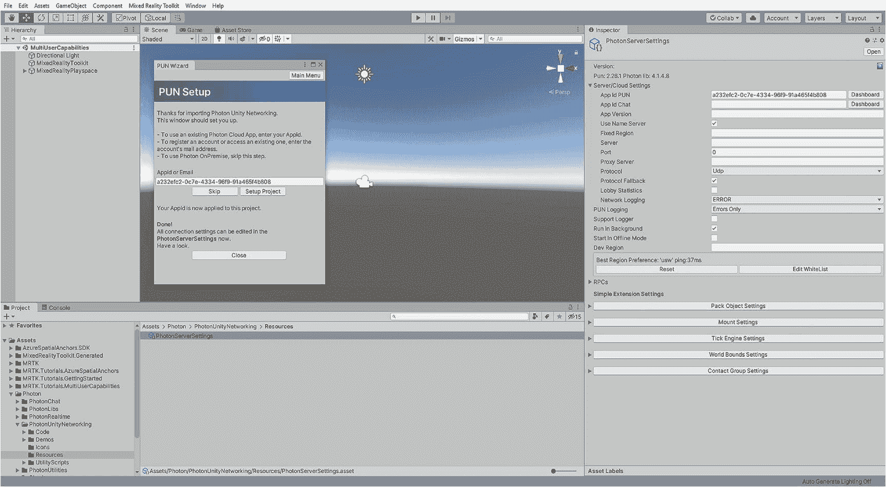

图 9-10

确认 Unity 项目与 PUN 应用程序已连接的消息

## 连接多个用户

在本节中，你将学习如何连接多个用户以进行实时共享体验。学完本节后，你将能够在多个设备上运行应用程序，并使每个用户看到其他用户的头像实时移动。

### 步骤 1：准备场景

在项目窗口中，导航到 `Assets` ➤ `MRTK.Tutorials.MultiUserCapabilities` ➤ `Prefabs` 文件夹，然后点击并将以下预制体拖入层级窗口以将它们添加到你的场景中：

- `NetworkLobby` 预制体
- `SharedPlayground` 预制体

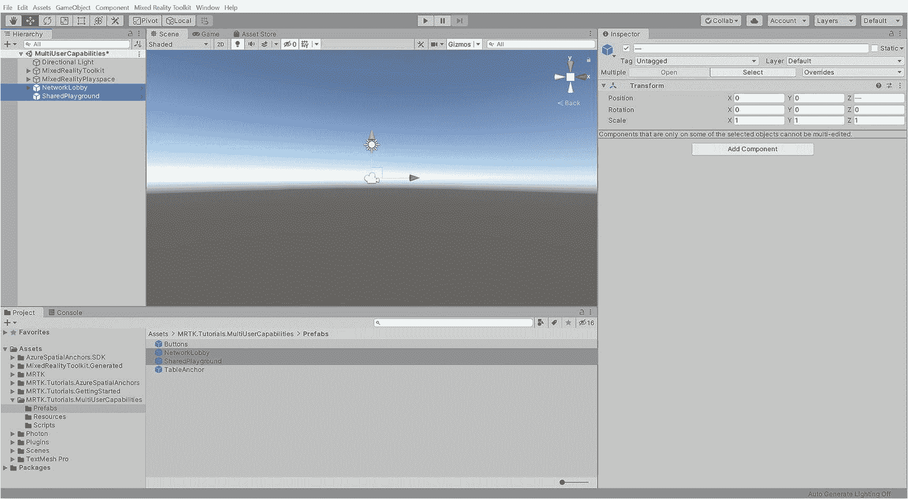

图 9-11

将 `NetworkLobby` 和 `SharedPlayground` 预制体添加到场景中

在项目窗口中，导航到 `Assets` ➤ `MRTK.Tutorials.AzureSpatialAnchors` ➤ `Prefabs` 文件夹，然后点击并将 `DebugWindow` 预制体拖入层级窗口以将其添加到你的场景中（图 9-12）。

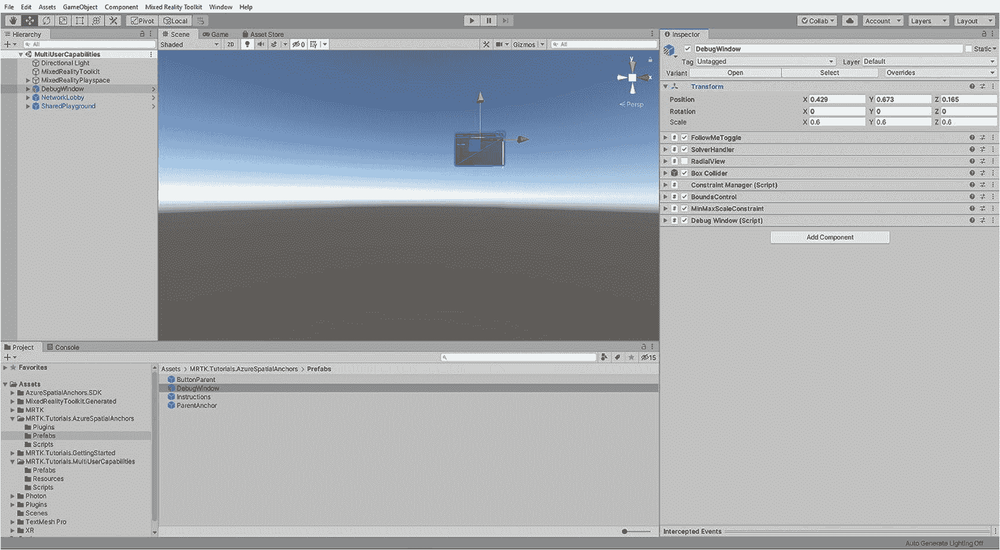

图 9-12

将 `DebugWindow` 预制体添加到场景中


### 第 2 步：创建并配置用户

-   在`Hierarchy`窗口中，右键单击空白区域，选择`Create Empty`（创建空对象）向场景中添加一个空对象，将其命名为`PhotonUser`，并按如下方式进行配置：

确保`Transform Position`设置为`X = 0, Y = 0, Z = 0`。

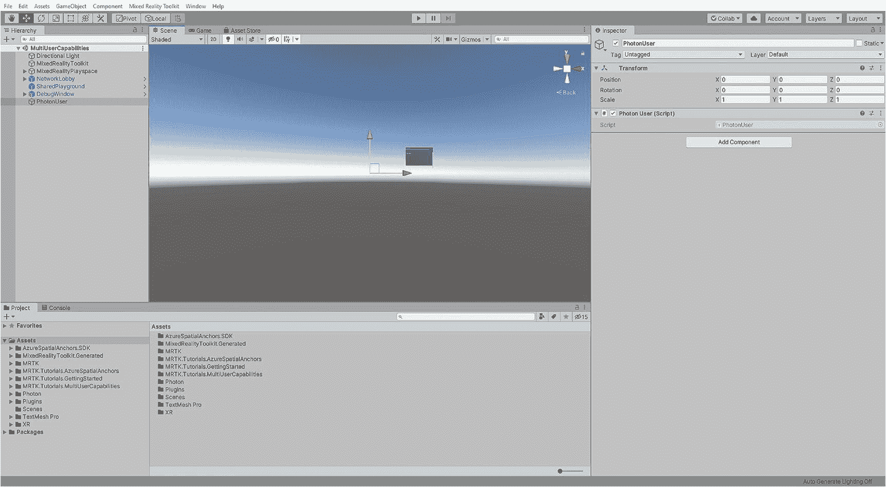

图 9-13

创建`PhotonUser`组件，并将`Photon User (Script)`（光子用户脚本）添加到该组件中。

-   在`Hierarchy`窗口中，选中`PhotonUser`对象；然后在`Inspector`窗口中，使用`Add Component`（添加组件）按钮将`Photon User (Script)`组件添加到`PhotonUser`对象上（图 9-13）。

-   在`Inspector`窗口中，使用`Add Component`按钮将`Generic Net Sync (Script)`（通用网络同步脚本）组件添加到`PhotonUser`对象上，并按如下方式配置：
    -   勾选`Is User`（是否为用户）复选框。

        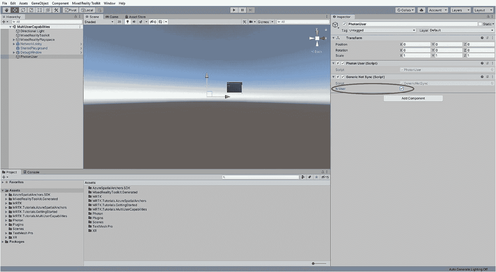

        图 9-14

        将`Generic Net Sync (Script)`组件添加到`PhotonUser`对象，并勾选`Is User`复选框。

-   在`Inspector`窗口中，使用`Add Component`按钮将`Photon View (Script)`（光子视图脚本）组件添加到`PhotonUser`对象上，并按如下方式配置：

    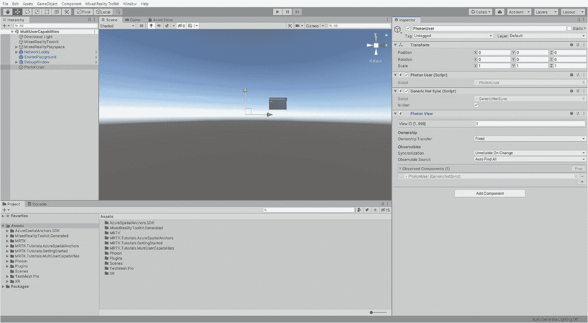

    图 9-15

    将`Photon View (Script)`组件添加到`PhotonUser`对象，并确保`Observed Components`（观察组件）字段已分配`Generic Net Sync (Script)`组件。

    -   确保`Observed Components`字段已分配`Generic Net Sync (Script)`组件。

### 第 3 步：创建头像

在`Project`窗口中，导航到`Assets ➤ MRTK ➤ StandardAssets ➤ Materials`文件夹以定位 MRTK 材质。然后，在`Hierarchy`窗口中，右键单击`PhotonUser`对象，选择`3D Object ➤ Sphere`（3D 物体 ➤ 球体），创建一个球体对象作为`PhotonUser`对象的子物体，并按如下方式配置：

-   确保`Transform Position`设置为`X = 0, Y = 0, Z = 0`。
-   将`Transform Scale`（变换缩放）更改为合适的大小，例如`X = 0.15, Y = 0.15, Z = 0.15`。
-   在`MeshRenderer ➤ Materials ➤ Element 0`（网格渲染器 ➤ 材质 ➤ 元素 0）字段中，分配`MRTK_Standard_White`材质。

    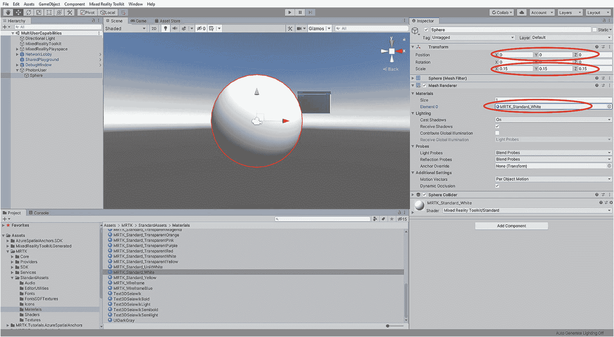

    图 9-16

    添加 3D 球体并为其分配标准材质。

### 第 4 步：创建预制件

在`Project`窗口中，导航到`Assets ➤ MRTK.Tutorials.MultiUserCapabilities ➤ Resources`文件夹。在保持选中`Resources`文件夹的状态下，点击并从`Hierarchy`窗口中将`PhotonUser`对象拖拽到`Resources`文件夹中，以将`PhotonUser`对象制作为一个预制件。

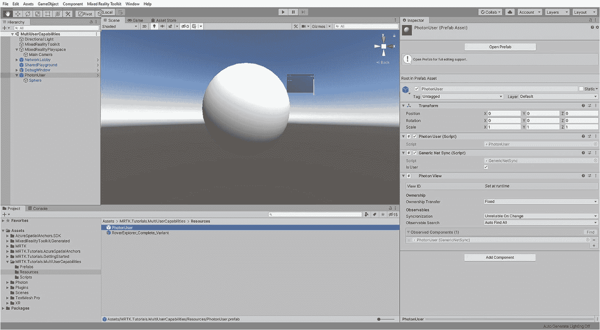

图 9-17

创建`PhotonUser`预制件。

在`Hierarchy`窗口中，右键单击`PhotonUser`对象，选择`Delete`（删除）将其从场景中移除（图 9-18）。

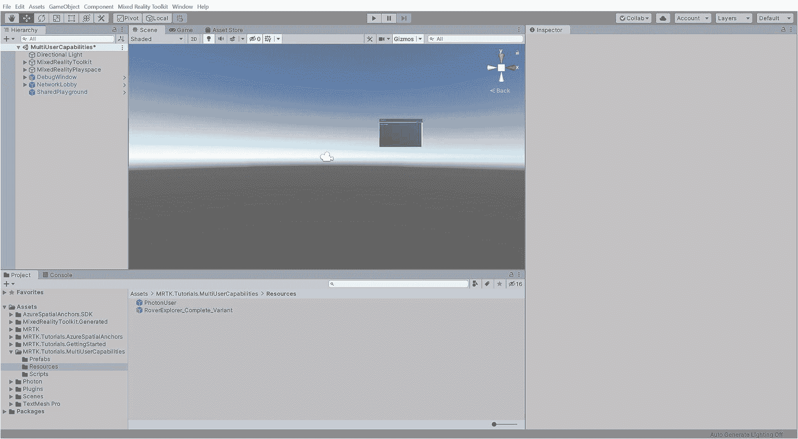

图 9-18

从`Hierarchy`窗口中删除`PhotonUser`游戏对象。

### 第 5 步：配置 PUN 以实例化用户预制件

在本节中，您将配置项目以使用您在上一节中创建的`PhotonUser`预制件。在`Project`窗口中，导航到`Assets ➤ MRTK.Tutorials.MultiUserCapabilities ➤ Resources`文件夹。

在`Hierarchy`窗口中，展开`NetworkLobby`对象并选中`NetworkRoom`子对象；然后，在`Inspector`窗口中，找到`Photon Room (Script)`（光子房间脚本）组件并按如下方式配置：

-   在`Photon User Prefab`（光子用户预制件）字段中，分配来自`Resources`文件夹的`PhotonUser`预制件。

    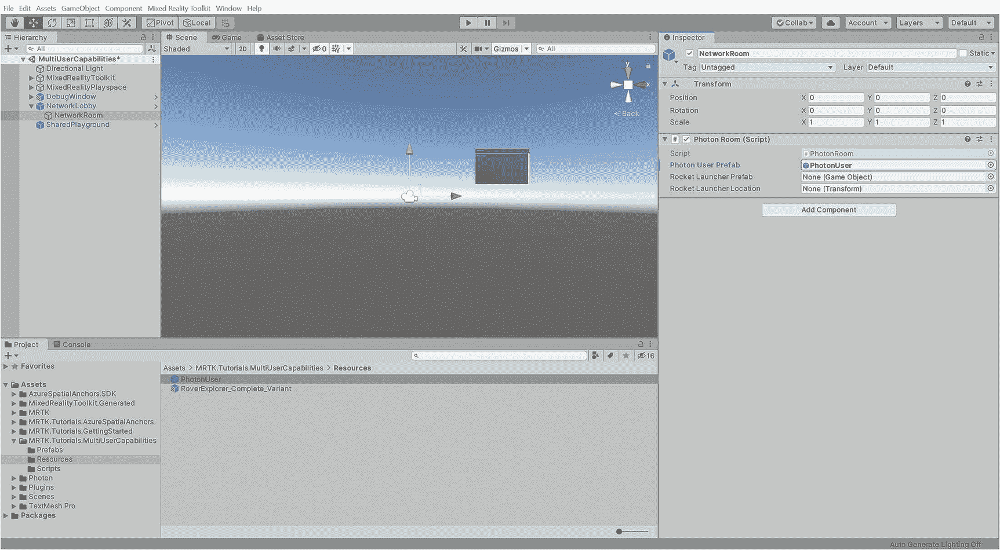

    图 9-19

    将`Photon User Prefab`字段分配为来自`Resources`文件夹的`Photon User Prefab`。

如果您现在构建 Unity 项目并将其部署到 HoloLens，然后回到 Unity，在应用程序于 HoloLens 上运行时进入`Game`模式，您将看到当您移动头部（HoloLens）时，HoloLens 用户头像也会随之移动。

## 与多用户共享物体移动

在本节中，您将学习如何共享物体的移动，以便共享体验的所有参与者能够协作并查看彼此的交互。

### 第 1 步：准备场景

在`Project`窗口中，导航到`Assets ➤ MRTK.Tutorials.MultiUserCapabilities ➤ Prefabs`文件夹，将`TableAnchor`预制件拖拽到`Hierarchy`窗口中的`SharedPlayground`对象上，将其作为`SharedPlayground`对象的子物体添加到场景中。

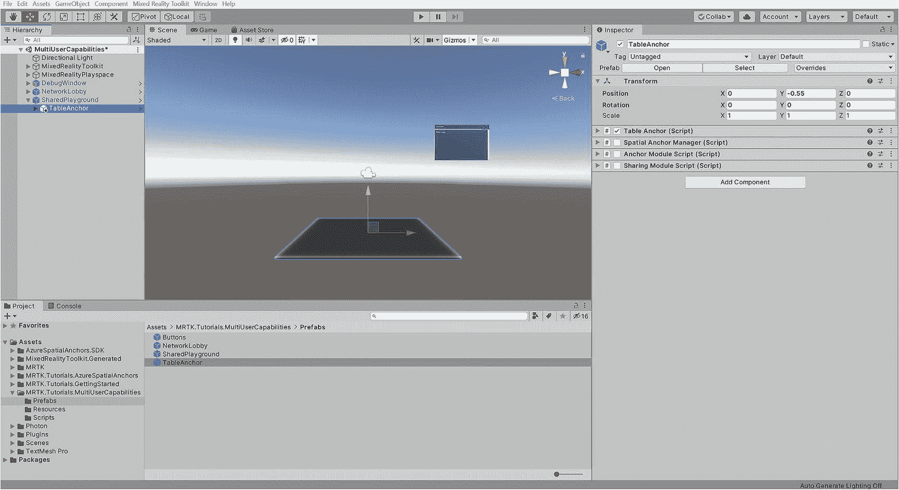

图 9-20

在`Hierarchy`中将`TableAnchor`预制件作为`SharedPlayground`对象的子物体。

### 第 2 步：配置 PUN 以实例化物体

在此步骤中，您将配置项目以使用 Rover Explorer 体验。在`Project`窗口中，导航到`Assets ➤ MRTK.Tutorials.MultiUserCapabilities ➤ Resources`文件夹。在`Hierarchy`窗口中，展开`NetworkLobby`对象，并选中`NetworkRoom`子对象；然后，在`Inspector`窗口中，找到`Photon Room (Script)`组件并按如下方式配置：

-   在`Rover Explorer Prefab`（漫游者探索者预制件）字段中，分配来自`Resources`文件夹的`RoverExplorer_Complete_Variant`预制件。

    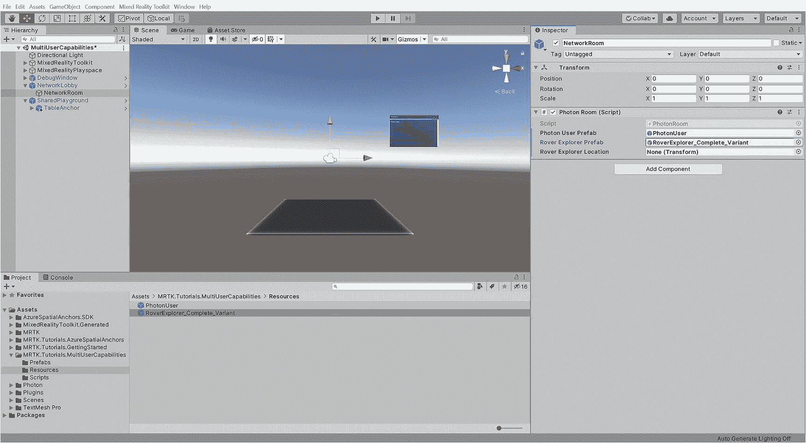

    图 9-21

    将`Rover Explorer Prefab`字段分配为来自`Resources`文件夹的`RoverExplorer_Complete_Variant`预制件。

在保持选中`NetworkRoom`子对象的状态下，在`Hierarchy`窗口中展开`TableAnchor`对象；然后在`Inspector`窗口中，找到`Photon Room (Script)`组件并按如下方式配置：

-   在`Rover Explorer Location`（漫游者探索者位置）字段中，分配来自`Hierarchy`窗口的`TableAnchor ➤ Table`子对象。

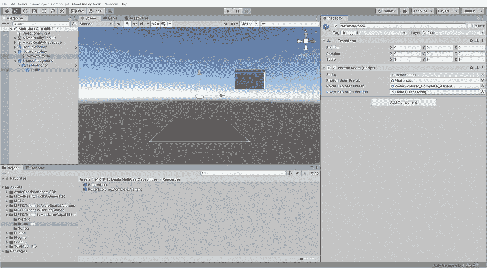

图 9-22

将`Rover Explorer Location`字段分配为来自`Hierarchy`窗口的`TableAnchor`子对象“Table”。

如果您现在构建 Unity 项目并将其部署到 HoloLens，然后回到 Unity，在应用程序于 HoloLens 上运行时单击播放按钮进入`Game`模式，您将看到当您在 HoloLens 中移动物体时，该物体会在 Unity 中随之移动。

## 将 Azure 空间定位点集成到共享体验中

在本节中，您将学习如何将 Azure 空间定位点（ASA）集成到共享体验中。ASA 允许多个设备对物理世界有一个共同的参考点，以便用户能够看到彼此在真实物理位置中的情况，并在同一位置看到共享体验。有关 Azure 空间定位点的更多信息，请参阅第 8 章。

### 第 1 步：准备场景

在`Hierarchy`窗口中，展开`SharedPlayground`对象，然后展开`TableAnchor`对象以显示其子对象。

在`Project`窗口中，导航到`Assets ➤ MRTK.Tutorials.MultiUserCapabilities ➤ Prefabs`文件夹，将`Buttons`预制件拖拽到`TableAnchor`子对象上，将其作为`TableAnchor`对象的子对象添加到场景中（图 9-23）。

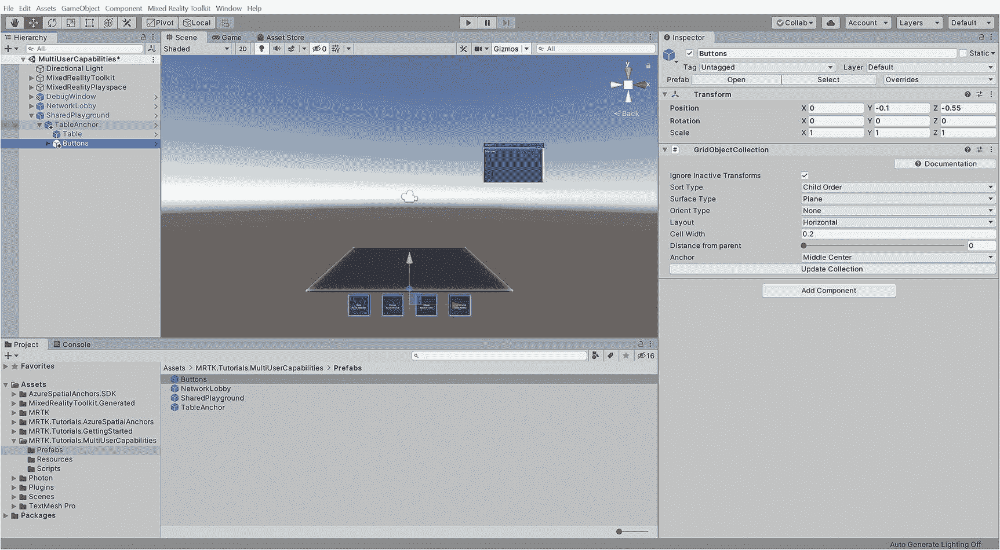

图 9-23

在`Hierarchy`中将`Buttons`预制件作为`TableAnchor`对象的子对象。


### 第二步：配置按钮以操作场景

在此步骤中，您将配置一系列按钮事件，演示如何使用 Azure 空间定位点实现共享体验中的空间对齐这一基本原理。

在层级窗口中，展开 `Button` 对象，并选择第一个子按钮对象 `StartAzureSession`。在 Inspector 窗口中，找到 `Interactable (Script)` 组件，并按如下方式配置 `OnClick ()` 事件：
- 在 `None (Object)` 字段中，指定 `TableAnchor` 对象。
- 在 `No Function` 下拉菜单中，选择 `AnchorModuleScript` ➤ `StartAzureSession ()` 函数。

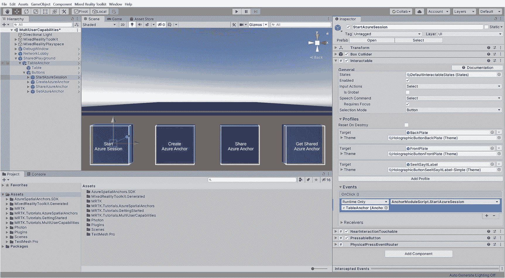
图 9-24 配置 `StartAzureSession` 按钮的 `OnClick()` 事件

在层级窗口中，选择第二个子按钮对象 `CreateAzureAnchor`；然后在 Inspector 窗口中，找到 `Interactable (Script)` 组件，并按如下方式配置 `OnClick ()` 事件：
- 在 `None (Object)` 字段中，指定 `TableAnchor` 对象。
- 在 `No Function` 下拉菜单中，选择 `AnchorModuleScript` ➤ `CreateAzureAnchor ()` 函数。
- 在出现的新 `None (Game Object)` 字段中，指定 `TableAnchor` 对象。

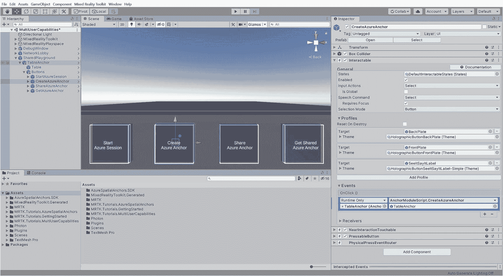
图 9-25 配置 `CreateAzureAnchor` 按钮的 `OnClick()` 事件

在层级窗口中，选择第三个子按钮对象 `ShareAzureAnchor`；然后在 Inspector 窗口中，找到 `Interactable (Script)` 组件，并按如下方式配置 `OnClick ()` 事件：
- 在 `None (Object)` 字段中，指定 `TableAnchor` 对象。
- 在 `No Function` 下拉菜单中，选择 `SharingModuleScript` ➤ `ShareAzureAnchor ()` 函数。

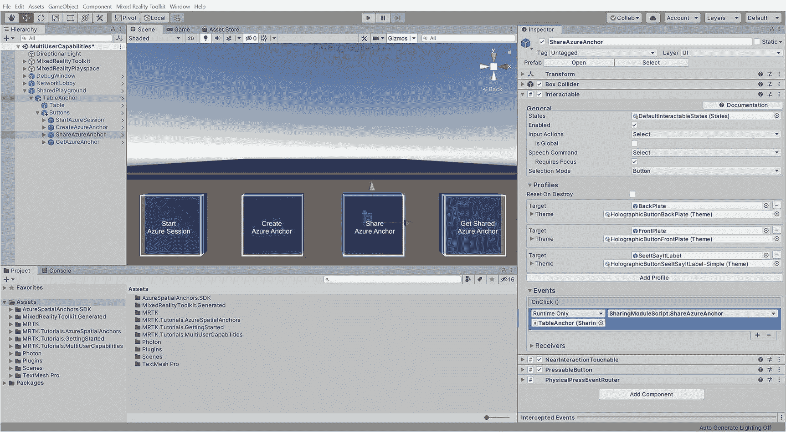
图 9-26 配置 `ShareAzureAnchor` 按钮的 `OnClick()` 事件

在层级窗口中，选择第四个子按钮对象 `GetAzureAnchor`；然后在 Inspector 窗口中，找到 `Interactable (Script)` 组件，并按如下方式配置 `OnClick ()` 事件：
- 在 `None (Object)` 字段中，指定 `TableAnchor` 对象。
- 在 `No Function` 下拉菜单中，选择 `SharingModuleScript` ➤ `GetAzureAnchor ()` 函数。

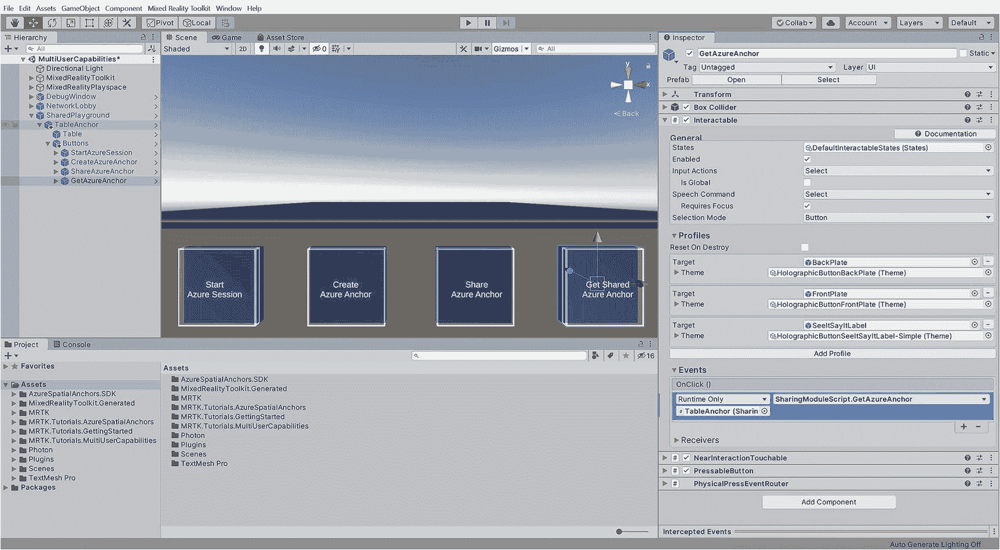
图 9-27 配置 `GetAzureAnchor` 按钮的 `OnClick()` 事件

### 第三步：将场景连接到 Azure 资源

在层级窗口中，展开 `SharedPlayground` 对象并选择 `TableAnchor` 对象。在 Inspector 窗口中，找到 `Spatial Anchor Manager (Script)` 组件，并使用本教程系列先决条件中创建的 Azure 空间定位点账户的凭据配置“凭据”部分：
- 在 `Spatial Anchors Account ID` 字段中，粘贴 Azure 空间定位点账户中的账户 ID。
- 在 `Spatial Anchors Account Key` 字段中，粘贴 Azure 空间定位点账户中的主要或辅助访问密钥。


图 9-28 输入 `Spatial Anchors Account ID` 和 `Spatial Anchors Account Key`

在层级窗口中，选择 `TableAnchor` 对象；然后在 Inspector 窗口中，找到 `Anchor Module (Script)` 组件并按如下方式配置：
- 在 `Public Sharing Pin` 字段中，更改几位数字，使该 pin 码对您的项目唯一。


图 9-29 为您的项目输入唯一的 `Public Sharing Pin`

保持选中 `TableAnchor` 对象，在 Inspector 窗口中，确保所有脚本组件均已启用：
- 勾选 `Spatial Anchor Manager (Script)` 组件旁的复选框以启用它。
- 勾选 `Anchor Module Script (Script)` 组件旁的复选框以启用它。
- 勾选 `Sharing Module Script (Script)` 组件旁的复选框以启用它。

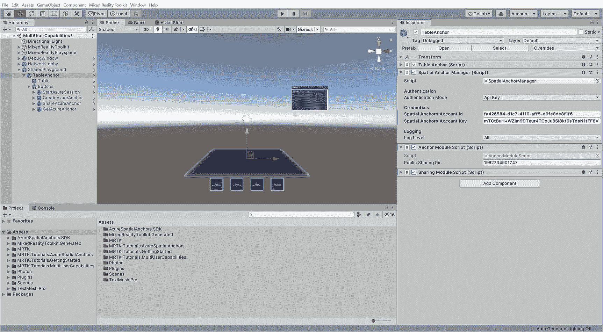
图 9-30 启用附加到 `TableAnchor` 对象的所有脚本组件

## 尝试空间对齐体验

如果您现在将 Unity 项目构建并部署到两台设备，就可以通过共享 Azure 锚点 ID 来实现设备间的空间对齐。要测试它，您可以按照以下步骤操作：

- 在设备 1 上：启动应用（Rover Explorer 被实例化并放置在桌子上）。
- 在设备 2 上：启动应用（两个用户都看到带有 Rover Explorer 的桌子，但桌子并未出现在相同位置，用户头像也未出现在用户所处位置）。
- 在设备 1 上：点击 `Start Azure Session` 按钮。
- 在设备 1 上：点击 `Create Azure Anchor` 按钮（在 `TableAnchor` 对象的位置创建一个锚点，并将锚点信息存储在 Azure 资源中）。
- 在设备 1 上：点击 `Share Azure Anchor` 按钮（与其他用户实时共享锚点 ID）。
- 在设备 2 上：点击 `Start Azure Session` 按钮。
- 在设备 2 上：点击 `Get Azure Anchor` 按钮（连接到 Azure 资源以检索共享锚点 ID 的锚点信息，然后将 `TableAnchor` 对象移动到设备 1 创建锚点的位置）。

## 总结

恭喜！创建完成您的共享体验后，您已很好地踏上了成为混合现实开发者的道路。使用 Photon Unity 网络 (PUN) 构建多用户体验是一次非常令人满足的体验！让我们回顾一下本章学到的内容：

- 您学会了如何设置 Photon 账户。
- 您学会了如何创建 PUN 应用。
- 您学会了如何将 PUN 集成到 Unity 项目中。
- 您学会了如何配置用户头像和共享对象。
- 您学会了如何使用 Azure 空间定位点对齐多个参与者。

现在，您已经开发了一个令人兴奋的混合现实开发项目。在下一章中，我们将继续开发另外几个令人兴奋的混合现实开发项目。

