# 10. 令人惊叹的体验

在本章中，我将向您介绍一些制作令人惊叹的混合现实体验的技巧和窍门！到目前为止，您已经学习制作引人入胜的应用所需的所有基础知识。关于高级混合现实开发和技术，可以写出数十本书——甚至还有更多混合现实技术等待我们去发现！我将通过向您介绍一些设计概念、HoloLens 项目示例以及一些您可以使用的第三方工具，让您领略一下可以采取哪些措施来增强您的应用和体验。


## 什么造就了一款令人敬畏的应用？

当你体验一款制作精良的应用时，会有一种敬畏和神奇的感觉。微软发布的那些体验作品，很好地展示了 HoloLens 的可能性。像《碎片》、《机器入侵》、《HoloStudio》、《Vivo》、《Actiongram》和《银河探索》这类应用，为用户提供了难忘的体验。这些应用运行流畅，充分利用了空间音效和空间映射，并且出色地运用了着色器和色彩。

以下是令人敬畏的体验的一些关键特征：

-   一款令人敬畏的应用能让用户忘记头戴设备，沉浸在体验中。它充分利用空间音效和空间映射，使全息影像仿佛真的存在于用户的环境中。
-   它提供令人惊叹的视觉效果，而非枯燥或平淡的视觉体验。它恰当地运用透明效果、光线、色彩和动态。
-   它运行流畅，并最大化帧率。不稳定的帧率会导致用户迷失方向，让体验显得不真实。流畅的帧率（每秒 60 帧）能让应用感觉真实且响应迅速。
-   它提供一种神奇的元素，或是完成用户认为不可能之事的能力。例如，利用图像识别来识别用户场景中的物体，利用空间理解让数字角色坐在真实的沙发和椅子上，以及能以意想不到的方式使用语音命令。

虽然微软和少数几家混合现实工作室已经发布了在我看来堪称令人敬畏的体验，但我想重申本书的一大前提：我们在确定混合现实最佳实践方面，都还处于非常早期的阶段。关于当前的最佳实践，有一些可用的资源。例如，微软已经发布了强调混合现实体验设计最佳实践的文档，可在 `https://docs.microsoft.com/en-us/windows/mixed-reality/design/design` 找到。

然而，仍有太多有待发现之处。我在本章中强调的几点技巧和建议，不应被视为可达到的最佳水准，而更应被视为改进的起点。

许多混合现实开发者（包括我自己）从大量运用特效的电影中获取灵感，比如科幻电影。观看这些电影时，你会发现许多关于如何让全息影像看起来惊艳的好点子。你会看到引发敬畏之感的色彩与纹理、流畅动画与转场的绝佳范例，以及效果出众的音效。

## 优化与性能

在本节中，我将带领你了解优化混合现实应用的最佳实践。优化的关键指标是帧率，即每秒帧数（FPS）。其他关键因素包括 CPU 使用率和对电池续航的影响。然而，应用的帧率直接影响用户体验应用的方式，并能区分出是卡顿、令人沮丧的体验，还是流畅、美妙的体验。

性能优化是开发过程中必要但令人烦恼的方面之一。当被问及我为 HoloLens 开发的经历时，我常这样对人说：

> *在混合现实中，我几乎可以创造任何我想要的东西。那是容易的部分。难的是优化以获得最佳性能。*

我与无数 HoloLens 和混合现实开发者交流过——所有开发者，无论是经验丰富者还是初学者，都饱受优化之苦。原因在于，所有设备——无论是 HoloLens、沉浸式头戴设备，还是强大的游戏 PC——在遇到硬件和性能限制之前，其可渲染的内容量都有上限。作为开发者，我们很容易想要包含高细节的 3D 模型、华丽的色彩、极其逼真的光照效果和复杂的动画。然而，所有这些添加项都需要处理能力来渲染。当你的体验中内容过多时，你的设备会通过降低帧率来做出反应。

本质上，应用优化是一门艺术。你需要学会在内容和性能之间找到完美的平衡。在任何混合现实体验中，最大化内容的观感，同时保持 60 FPS，是性能优化的终极目标。

虽然你应该始终努力达到 60 FPS，但你可能会注意到较低的帧率（30–60 FPS）在某些用例中或许可以接受。当你优化手段用尽时，可能需要做出艰难的决定，即以牺牲帧率为代价来包含某些功能或对象。

**注意**

由于 HoloLens 是一台独立的全息计算机（不连接到更强大的 PC），它比有线混合现实头戴设备有更多的性能限制。因此，本节中关于性能优化的讨论将集中在 HoloLens 上。当使用连接到强大游戏 PC 的有线头戴设备时，性能问题会小一些。即便如此，这里给出的所有性能建议都有助于优化各种规模的体验。此外，在为有线头戴设备开发时，考虑那些可能在性能较弱的 PC 上运行你的应用的用户也很重要。我建议在为有线混合现实头戴设备开发时，在最低规格的 PC 上进行测试，以监控性能。


### 如何监控性能

在深入探讨最佳实践之前，你首先需要了解如何衡量应用的性能。查看 HoloLens 所有性能指标的最佳途径是*Windows 设备门户*。要访问 Windows 设备门户，请确保你的头戴显示设备已开启，并且要么与电脑连接到同一个 Wi-Fi 网络，要么通过 USB 线缆连接。

确保已在设备上设置好开发者模式（如第 3 章所述），并且“设备门户”选项已启用。你可以在 HoloLens 的以下路径找到“设备门户”设置：`设置 ➤ 更新和安全 ➤ 面向开发者 ➤ 设备门户`。

如果你的设备通过随附的 USB 线缆连接到电脑，你可以在网络浏览器中输入以下地址：`127.0.0.1:10080`

注意

如果 USB 连接出现问题，请再次确认 USB 设备连接可选组件是否已作为 Visual Studio 工具包的一部分安装。

如果你使用的是 Wi-Fi，你可以输入头戴显示设备的 IP 地址。如果不知道 IP 地址，可以在 HoloLens 上通过以下路径查看：`设置 ➤ 网络和互联网 ➤ 高级选项`。关于如何在 HoloLens 的设置应用中查找 IP 地址，请参考图 10-1。

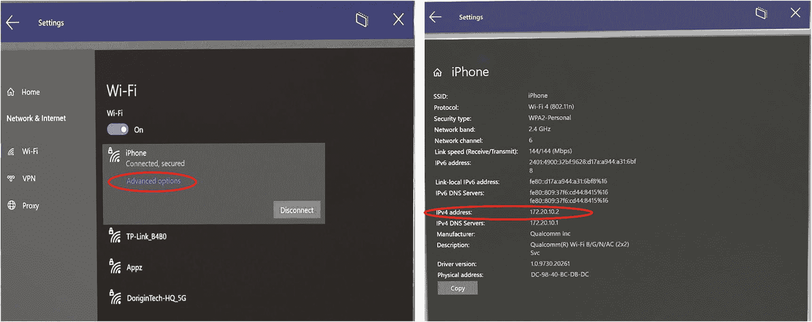

图 10-1

在设置应用中查找 HoloLens IP 地址的位置示意图

登录 Windows 设备门户后，导航至左侧菜单栏的“系统性能”。你将看到实时的性能跟踪和指标，如图 10-2 所示。

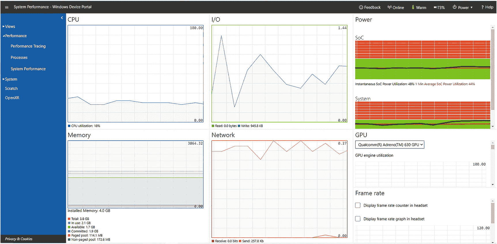

图 10-2

可以通过 Windows 设备门户跟踪 HoloLens 的实时性能指标

进入设备门户后，你会看到多项指标。以下概要描述了其中每一项指标：

- *系统功耗*是 HoloLens 的总功耗。监控此指标以确保功耗保持在绿色和橙色区域内，避免产生热量。请务必在设备未充电时测量系统功耗，因为在充电状态下无法测量。
- *SoC 功耗*仅指 CPU、GPU 和内存单元的组合功耗。与系统功耗一样，确保 SoC 功耗保持在绿色和橙色区域内，以避免设备过热。
- *帧率*是你的 3D 应用每秒渲染的帧数。如果你正在开发一个在 Windows shell 内运行的 2D 应用，那么帧率将反映 shell 的帧率，而非你的 2D 应用。
- *CPU*显示中央处理器的负载。
- *GPU*显示图形处理器的负载。它显示 GPU 处于任务活动状态的时间百分比。注意：GPU 主要负责渲染，而 HPU 控制增强现实处理，该处理结合了真实世界与数据。HPU 处理所有数据集成和用户输入。
- *I/O*显示所有进程的磁盘使用情况。
- *网络*显示所有进程的网络/Wi-Fi 使用情况。
- *内存*显示设备上所有进程提交的总内存量。要查看单个进程的内存使用情况，请查看 Windows 设备门户中的“进程”选项卡。

虽然保持高 FPS 至关重要，但在优化应用时，考虑上述指标也同样重要。如果你保持了 60 FPS，但你的应用对这些其他指标的要求非常高，设备可能会过热，最终导致设备关机，这会使你的应用终止，设备甚至可能自我保护而关机。以下是 HoloLens 的关键性能目标总结：

- 保持帧率在 60 FPS。
- 将功耗保持在橙色和绿色区域内。
- 将应用的内存使用量控制在 900 MB 以下。

在开发过程中，另一个用于监控应用性能的出色工具是混合现实工具包中包含的`VisualProfiler`。`VisualProfiler`为你提供关于帧率、帧时间、帧图以及内存利用率的信息。（可以使用 MRTK 配置文件检查器中的诊断系统设置来配置`VisualProfiler`。）

### 性能最佳实践

正如本节前面所述，性能优化即使对于经验丰富的开发者来说也是一项重大挑战。这里提供的指南将有助于优化，但你应做好花费大量时间优化和排查性能问题的准备。

#### 尽早开始监控和优化

作为一条经验法则，你应在开发周期的*非常早期*就考虑性能和优化。如果开始得太晚，你可能很难找出场景中导致性能问题的对象。如果你在项目初期就有一个运行流畅的应用，那么当后续添加内容开始影响性能时，你将能轻松识别。只有将应用部署到设备上，你才能准确测试性能。在 Unity 编辑器中运行设备，并不能让你深入了解应用部署到头戴显示设备后的实际帧率和硬件使用情况。这可能会让你感觉前期部署和测试花费了更多时间，但这样做会为你节省开发周期后期排查性能问题的时间。


#### 优化多边形与纹理

HoloLens 渲染的所有 3D 对象（包括空间映射网格）均由三角形或多边形构成。虽然多边形数量并非影响 HoloLens 性能的唯一因素，但却是开始优化体验的最简单途径之一。

多边形数量较多的模型通常被称为*高模*，而多边形较少的模型则被称为*低模*。高低模的具体多边形数量并无严格定义，这取决于模型的尺寸和复杂度。通常，高模表面光滑圆润，低模则略显棱角分明。请参阅图 10-3。

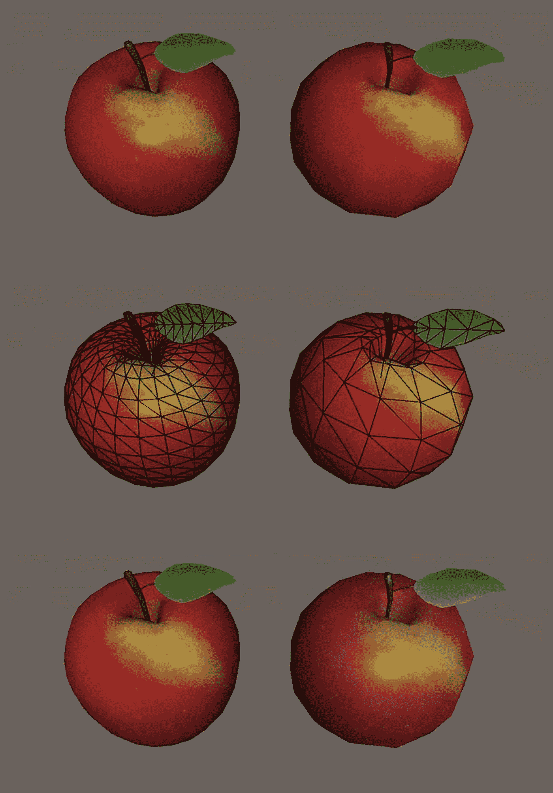

图 10-3

多边形数量和着色器如何影响 3D 模型视觉效果的示意

高多边形 3D 模型必然会导致帧率下降。而低多边形模型若能结合其他最佳实践，则能使您的应用流畅运行。通常情况下，若使用最佳着色器，HoloLens 可在维持 60 帧/秒的前提下，渲染多达约 8 万个三角形。当三角形数量达到 20 万时，帧率会降至约 30 帧/秒。在大多数情况下，建议将三角形数量控制在 2 万至 6 万之间，以留出一定的处理余量。

图 10-3 展示了同一个苹果 3D 模型的几种不同视图。左侧的苹果为高模，右侧为低模。可以看出，高模苹果比低模模型看起来更光滑、更真实。在图 10-3 的中排，我开启了线框模式，以便您直观地看到构成每个 3D 模型的独立三角形。在上排中，高模苹果使用了标准着色器，使其看起来光亮，但同时也对性能产生了负面影响。上排的低模苹果使用了旧版漫反射着色器，使其外观暗淡，但性能却好得多。在下排中，我交换了两个苹果的着色器，以说明着色器可以让低模模型看起来更好，反之亦然。

由此可见，优化 HoloLens 应用有时需要在视觉效果吸引人与高性能之间做出艰难取舍。即使使用高性能着色器，也有一些技巧能让低模模型看起来令人惊艳。3D 美术师可以为模型纹理着色，使其产生光亮或细节极其丰富的错觉。例如，在图 10-4 中，沙发看起来细节丰富，有坐垫褶皱和边缘反光。然而，如图下方所示，这款沙发模型实际上是一个低模。坐垫的褶皱和反光来自于应用于 3D 模型的纹理图像。由于我能够最小化多边形数量并使用快速着色器，因此得以在 HoloLens 中实现沙发的高性能与惊艳视觉效果。

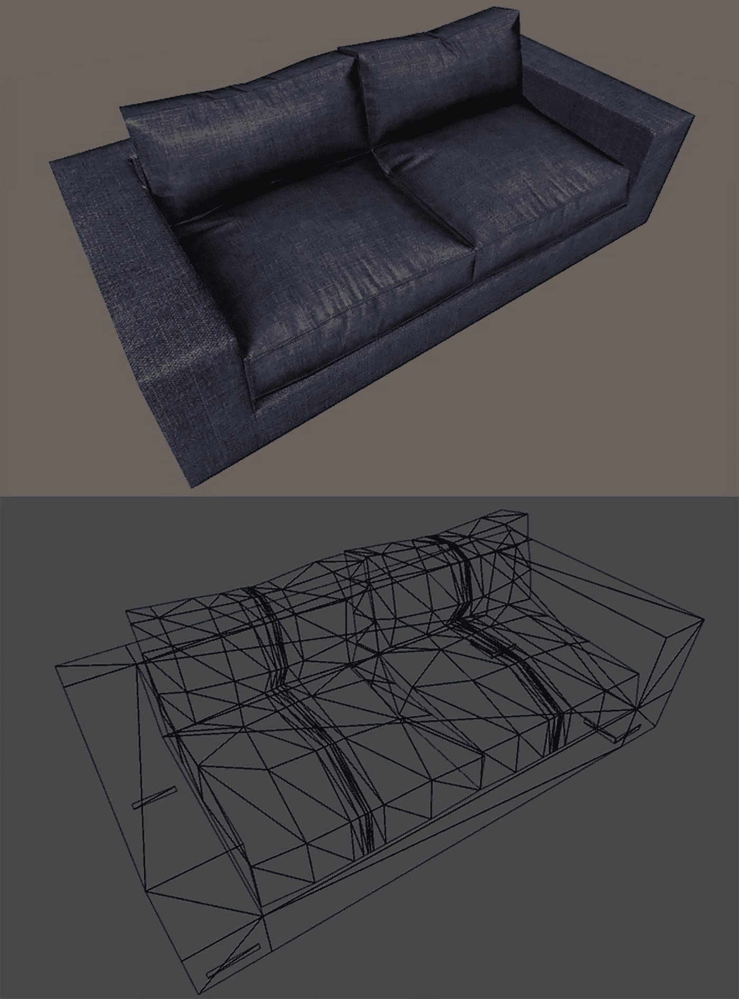

图 10-4

通过在纹理图像上发挥创意，低多边形模型也可以呈现出细节丰富的效果

您应尽可能为每个模型使用单一纹理，而非由多个纹理文件拼合而成的模型。同时，还应尽量减少着色器的切换。尽量对视野内的所有对象使用同种着色器。

#### 细节层次渲染

*细节层次（LOD）渲染*是一种性能优化技术，通过减少距离视点较远物体的多边形数量和外观细节来提升性能。为用户远处的高质量模型渲染是一种计算资源的浪费，因为模型在远处会显得很小，用户无法欣赏其细节。Unity 提供了一个名为 *LOD Group* 的组件，允许您根据距离改变对象的渲染方式。图 10-5 展示了该组件在 Unity 中的外观。您可以通过右键点击彩色条来添加多个细节层次，拖动每个条来指定与摄像机的距离，并为每个 LOD 添加不同多边形数量和着色器的模型。更多信息，请参阅 [`https://docs.unity3d.com/Manual/class-LODGroup.html`](https://docs.unity3d.com/Manual/class-LODGroup.html)。

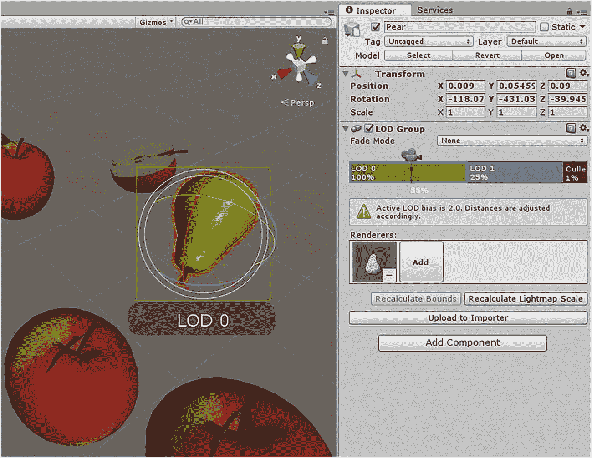

图 10-5

Unity 的 LOD Group 组件允许您根据与摄像机的距离指定模型的渲染方式。当摄像机远离对象时，您可以渲染质量较低的模型

#### 遮挡剔除

另一种有效的性能策略是*剔除*，即不渲染那些不会被看到的模型。默认情况下，Unity 使用*视锥体裁剪*，这意味着用户视野或视锥体之外的任何内容都不会被渲染。图 10-6 展示了摄像机的视锥体，以白色线条标示。避免渲染摄像机视野外的物体，可以限制需要绘制的对象，从而提高性能。

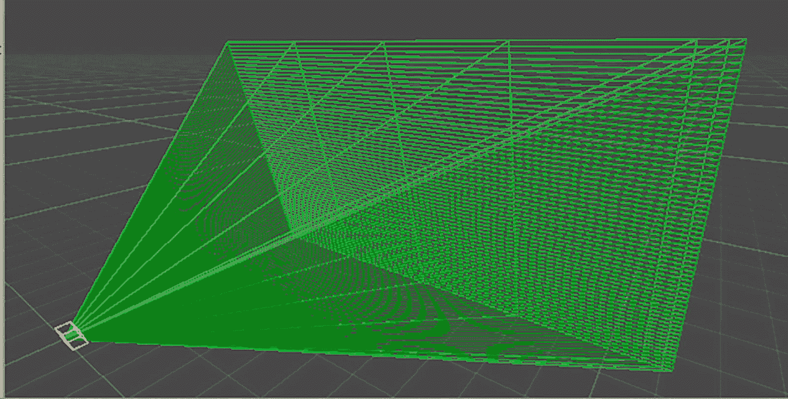

图 10-6

视锥体裁剪确保摄像机视锥体（此处以绿色显示）之外的任何内容都不会被渲染

另一种剔除类型称为*遮挡剔除*，它允许您不渲染场景中被其他对象遮挡的物体，从而减轻设备负担并提升性能。要启用遮挡剔除，请依次转到 Window ➤ Rendering ➤ Occlusion Culling，然后在 `Occlusion Culling` 窗口中点击 "Bake" 按钮，如图 10-7 所示。您还需要确保摄像机上已启用 `Occlusion Culling` 设置。有关遮挡剔除的更多信息，请参阅 [`https://docs.unity3d.com/Manual/OcclusionCulling.html`](https://docs.unity3d.com/Manual/OcclusionCulling.html)。

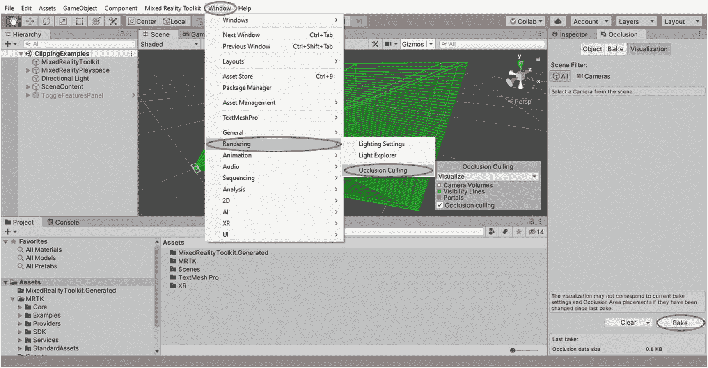

图 10-7

您可以通过 Window ➤ Rendering ➤ Occlusion Culling 启用遮挡剔除。遮挡剔除通过防止渲染被遮挡的对象来提升性能

#### 启用单通道实例化渲染

在 Player 设置（Edit ➤ Project Settings ➤ XR Plugin Management ➤ Oculus）中，您会找到一个选项，可以将立体渲染方法在 `Multi Pass` 和 `Single Pass Instanced` 之间切换。此选项通过同时渲染双眼而非逐眼渲染，显著减少了 CPU 处理时间。图 10-8 展示了立体渲染设置的位置。有关单通道实例化渲染的更多信息，请参阅 [`https://docs.unity3d.com/Manual/SinglePassStereoRendering.html`](https://docs.unity3d.com/Manual/SinglePassStereoRendering.html)。

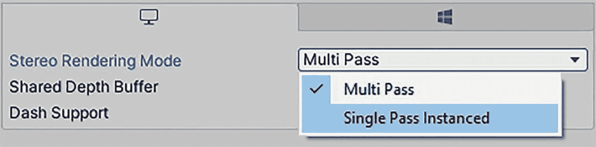

图 10-8

您可以在 Player 设置中切换立体渲染模式

**警告**

并非所有着色器都与单通道实例化渲染兼容。如果您使用的着色器不在混合现实工具包自带的着色器之列，请留意左右眼视图是否出现差异。如果出现此情况，您可能需要恢复为多通道渲染，或按此处描述更新您的着色器： [`https://docs.unity3d.com/Manual/SinglePassStereoRendering.html`](https://docs.unity3d.com/Manual/SinglePassStereoRendering.html)。


### 优化着色器

`Shaders`（着色器）是负责计算物体亮度、暗度、颜色、反射率和特殊效果的脚本或程序。着色器对于物体的外观至关重要，但它们也可能成为应用程序性能问题的显著因素，甚至比物体的多边形数量影响更大。

通常，你在体验中想要实现的任何特殊物体可视化效果都需要一个会降低性能的着色器。特殊物体可视化的例子包括高反射金属或镜面、玻璃状或透明物体，以及物体上的发光或霓虹效果。

着色器及其优化是三维建模和图形行业的重要话题。许多书籍都曾探讨过这一主题，高级开发者最终难免需要编写自定义着色器，以便在保持良好性能的同时实现特定的可视化效果。本书中我不会深入讲解如何编写自己的着色器。对于初学者，我建议利用 Mixed Reality Toolkit 中提供的着色器。关于使用或编写自定义着色器时的高级技巧和指导原则，微软的 Mixed Reality 文档提供了许多优秀的着色器建议，请访问：[`https://developer.microsoft.com/en-us/windows/mixed-reality/performance_recommendations_for_hololens_apps`](https://developer.microsoft.com/en-us/windows/mixed-reality/performance_recommendations_for_hololens_apps)。

### Simplygon

如果你有一个想要使用的三维模型，但发现它多边形数量过多且包含大型纹理文件，该怎么办？`Simplygon` 是一个工具（微软于 2016 年收购），它允许用户减少三维模型的多边形数量和纹理复杂度，同时不会明显影响模型的视觉外观！图 10-9 展示了 Simplygon 用户界面的一个示例。Simplygon 还为 Unity 提供了一个插件，让你可以在 Unity 内部优化模型。要注册账户并免费下载 Simplygon，请访问此网址：[`www.simplygon.com/Downloads`](http://www.simplygon.com/Downloads)。

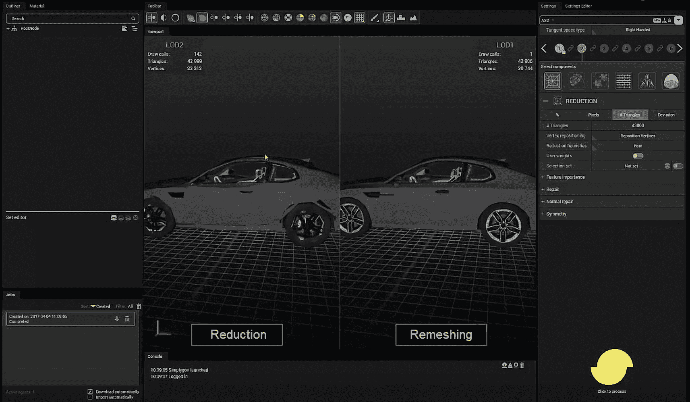

图 10-9

Simplygon 允许你将庞大复杂的三维模型转换为精美、低多边形的模型，使其在 HoloLens 上具有良好的性能。

### 稳定平面

HoloLens 执行特殊的硬件辅助稳定，以保持全息图在环境中稳定显示。由于 HoloLens 无法稳定场景中的所有全息图，因此会使用场景中的一个不可见平面（称为`稳定平面`）来选择获得最大程度稳定的物体。图 10-10 展示了在 Inspector 面板中管理该平面的脚本（`stabilizationplanemodifier.cs`）。默认情况下，稳定平面会尝试找到合适的全息图，无需额外设置。然而，为了获得最佳效果，你可以在脚本以及 `stabilizationplanemodifier.cs` 脚本中帮助该平面找到合适的稳定物体。

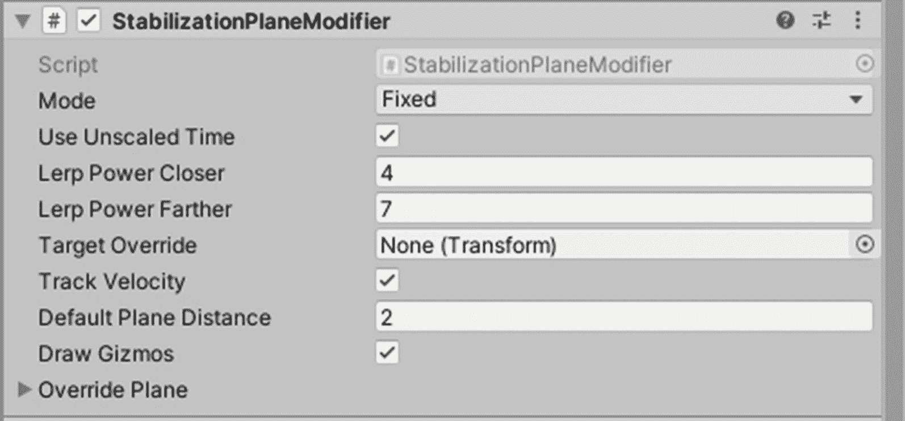

图 10-10

稳定平面帮助 HoloLens 确定哪些物体获得最大的稳定优先级，以获得更好的体验。

`stabilizationplanemodifier.cs` 脚本对于调整稳定平面的行为非常有用。（`StabilizationPlaneModifier` 在各种设置中控制稳定平面。它通过处理对 `HolographicPlatformSettings` 的平台调用来实现这一点。`SetFocusPointForFrame` 是一个用于设置帧焦点的方法。`StabilizationPlaneModifier` 的优先级高于 `DepthLSR`。Unity 构建设置中的深度缓冲区共享选项会自动启用此功能。`Consolidation PlaneModifier` 推荐用于 HoloLens 1；不过，它也可用于 HoloLens 2，并且在 WMR 上无效。）以下是脚本中每个设置的简要说明：

*   `Mode` 允许根据你的视线、固定距离或提供的目标，自动创建和放置稳定平面。
*   `Use unscaled time` 通过使平面移动独立于帧率、暂停或其他时间操作来修改其移动方式。
*   `Lerp power closer` 是平面向摄像机移动的速度。
*   `Lerp power farther` 是平面远离摄像机的速度。
*   `Target override` 允许你覆盖稳定平面的位置。当你想要稳定场景中的特定全息图时，请使用此设置。
*   `Track velocity` 跟踪目标物体的速度，以便平面能够准确地跟随并预判目标物体的运动，而非被动反应。
*   `Default plane distance` 是当没有指定或识别出目标物体时，平面漂浮在摄像机前方的距离。
*   `Draw gizmos` 允许你在测试或运行应用程序时可视化稳定平面。

要通过脚本手动在目标物体上设置稳定平面，你可以使用 `SetFocusPointForFrame()` 函数。请参见以下示例：

```
public GameObject objectToFocusOn;
void Update ()
{
var normal = -Camera.main.transform.forward;
var position = focusedObject.transform.position;
UnityEngine.VR.WSA.HolographicSettings.SetFocusPointForFrame(position, normal);
}
```

在上述代码中，你提供了一个法线和一个点来定义平面。点（`position`）是你的目标物体（`objectToFocusOn`）的位置。将这些变量传入 `SetFocusPointForFrame()` 函数，即可将稳定平面放置在你期望的位置。

以下是一些充分利用稳定平面的通用技巧：

*   尽量让平面覆盖尽可能多的内容。例如，如果你的内容是一个平面（二维图像、文本、UI 界面或其他平坦表面），那么将稳定平面对齐到你的二维表面。
*   尽量让平面穿过场景中所有相关的全息图，以稳定尽可能多的物体。
*   将稳定平面放置在距离摄像机较远的物体上，因为这些物体往往更不稳定。
*   切勿将平面放置在摄像机视野之外。将宝贵的稳定资源浪费在看不见的物体上是没有意义的。应该稳定用户将会看到的物体。
*   不要让稳定平面接触或穿过用户。

有关稳定平面的更多信息和最佳实践，欢迎查阅以下资源：

*   [`https://microsoft.github.io/MixedRealityToolkit-Unity/Documentation/hologram-stabilization.html?q=hologram%20stability`](https://microsoft.github.io/MixedRealityToolkit-Unity/Documentation/hologram-stabilization.html%253Fq%253Dhologram%2520stability)
*   [`https://developer.microsoft.com/en-us/windows/mixed-reality/focus_point_in_unity`](https://developer.microsoft.com/en-us/windows/mixed-reality/focus_point_in_unity)
*   [`https://developer.microsoft.com/en-us/windows/mixed-reality/case_study_-_using_the_stabilization_plane_to_reduce_holographic_turbulence`](https://developer.microsoft.com/en-us/windows/mixed-reality/case_study_-_using_the_stabilization_plane_to_reduce_holographic_turbulence)


## 设计与魔法

在本节中，我将重点介绍能帮助你的应用在视觉上脱颖而出并提供良好用户体验的设计元素、工具和最佳实践。开发者有多种方式可以向场景中添加 3D 物体和全息图。然而，当视觉效果显得乏味或粗制滥造时，便错失了营造真正令人惊叹体验的机会。将优秀的设计和神奇的体验融入应用需要更多的思考与努力。但从长远来看，你将拥有一款值得自豪的混合现实体验，或许还能让用户乐此不疲地反复使用你的应用。

作为开篇，我将首先提供一些混合现实设计的最佳实践，随后介绍一些可供使用的设计相关工具和资源。我还会提供一个关于使用 `Vuforia` 的简短教程，并探讨如何为你的体验注入一些魔法元素。

### 设计最佳实践

在 HoloLens 及其他混合现实设备问世的短短时间内，已经涌现出一些关键的设计最佳实践。尽管开发者（也就是你！）还有很多需要学习的地方，但这些最佳实践将有助于你短期内优化设计流程。

#### 空间映射

请尽可能考虑在应用中使用空间映射。省略空间映射很容易，你可能会认为它不值得投入精力，或者对项目价值不大。我也曾质疑过，既然它会限制全息图的放置位置，为何还要添加空间映射。然而，像 HoloLens 这类设备的一大优势是其与物理世界交互的强大能力。充分利用这一点，让你的物体能够停放在地板和表面上、固定在墙壁和天花板上，并能够被场景中的真实物体所遮挡。这是一种无需发明新东西就能轻松为体验增添魔力的方法。

`Mixed Reality Toolkit` 提供了多种可视化空间映射网格的选项。空间网格可根据你的需求呈现不同的颜色和纹理。它可以如图 10-11 到图 10-12 所示变化。

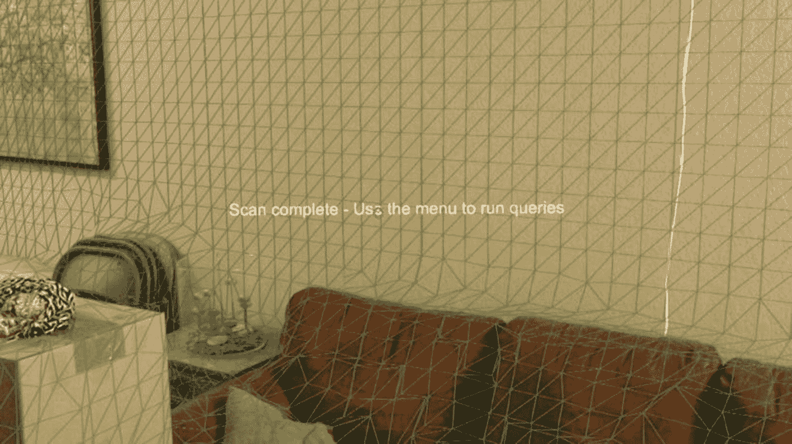

图 10-12：像空间理解网格那样平滑网格并将线条染成绿色，可以改善体验

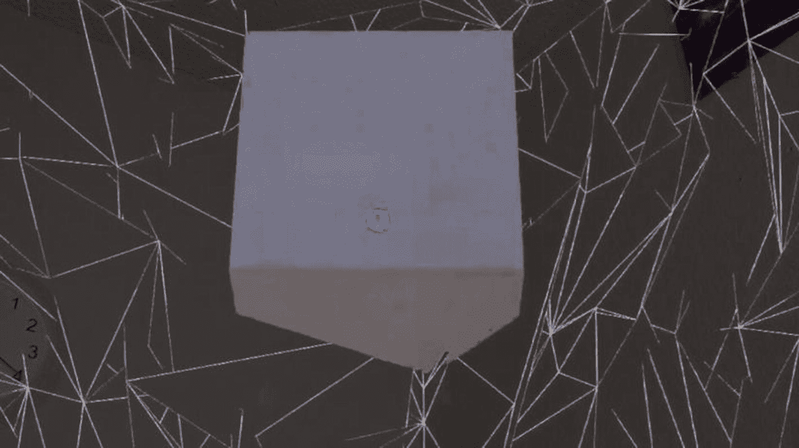

图 10-11：可视化空间映射网格的默认着色器虽能用，但不够美观

然而，使用空间映射扫描环境本身是一项技术奇迹。因此，网格的可视化也应同样令人印象深刻。微软发布的应用程序如 `Fragments` 或 `Young Conker` 使用了鲜艳的色彩和光照效果，为空间映射网格注入了活力。在撰写本文时，`Fragments` 和 `Young Conker` 中使用的特定着色器尚未对开发者开放；但存在类似的可下载着色器供你在应用中使用。我最喜欢的示例之一可以在以下网址找到：`Pulse Shader`，它能在地面重建上产生光学脉冲错觉：[`https://microsoft.github.io/MixedRealityToolkit-Unity/Assets/MRTK/SDK/Experimental/PulseShader/README.html`](https://microsoft.github.io/MixedRealityToolkit-Unity/Assets/MRTK/SDK/Experimental/PulseShader/README.html)。

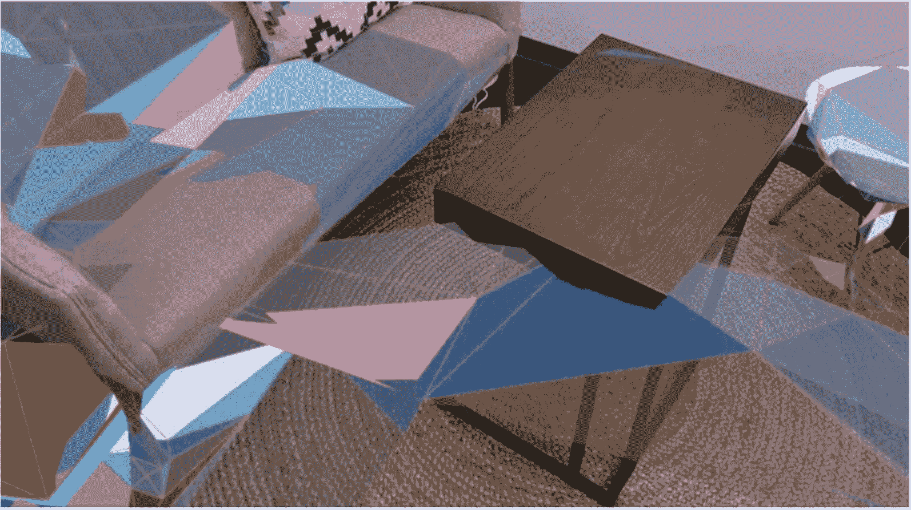

图 10-13：为空间映射网格增加规律性、颜色、纹理和动画，能显著提升设计效果（来源：微软）

#### 与用户距离

微软建议全息图的最佳放置距离在 1.25 米到 5 米之间，其中 2 米为最佳位置。放置过近的全息图可能导致用户不适或产生突兀的体验。默认情况下，`Mixed Reality Toolkit` 中的 HoloLens 摄像头预制体会剔除任何距离小于 0.85 米的全息图（使用视锥体裁剪）。这就是为什么当你过于靠近全息图时，常常无法查看细节。

根据我的经验，根据应用的使用场景，将视锥体裁剪距离从 0.85 米缩小到 0.20 米是可以接受的。这允许用户近距离查看精细细节，而模型不会恼人地消失。该值可通过调整摄像头 `GameObject` 中的 `Near` 裁剪平面来设置。

#### 阴影

我们的大脑严重依赖阴影来判断周围世界中物体的位置。阴影也是 3D 设计的重要组成部分。因此，使用阴影有助于增加真实感，并让人更强烈地感觉到数字全息图是锚定在现实世界中的。

虽然 Unity 可以轻松地在场景中创建阴影，但像 HoloLens 这样的设备却无法显示阴影，因为它只能向显示器添加光线，而无法使区域变暗（以这种方式工作的显示器称为*加法显示器*）。克服这一限制的技巧是使用一种称为*负阴影*的技术。负阴影会在物体周围添加少量光线或光晕，然后在阴影通常会出现的区域移除光线。用户无法感知到光晕，但能感知到阴影。

#### 语音

尽可能在你的应用中添加语音命令。这对 UI 元素尤其重要。如果你的应用中有一个写着 `start` 的按钮，请务必为 `start` 添加语音命令。一个最佳实践是在按钮上或旁边添加一个小型麦克风图标，提示用户该按钮支持语音。为了获得额外的设计加分，你可以让麦克风图标在用户注视物体一段时间后（0.5-1 秒应该足够）再显示出来。

#### 清晰文字

在撰写本文时，在许多 HoloLens 应用（尤其是 Windows 商店中的应用）中看到模糊文字是非常普遍的现象。使用 Unity 的默认字体会导致字体在 HoloLens 中因缩放而显得模糊。图 10-14 展示了 Unity 的默认文本（上方的 `Testing`）和使用 `Mixed Reality Toolkit` 的 `UITextSelwik` 预制体编写的文本（下方的 `Testing`）。

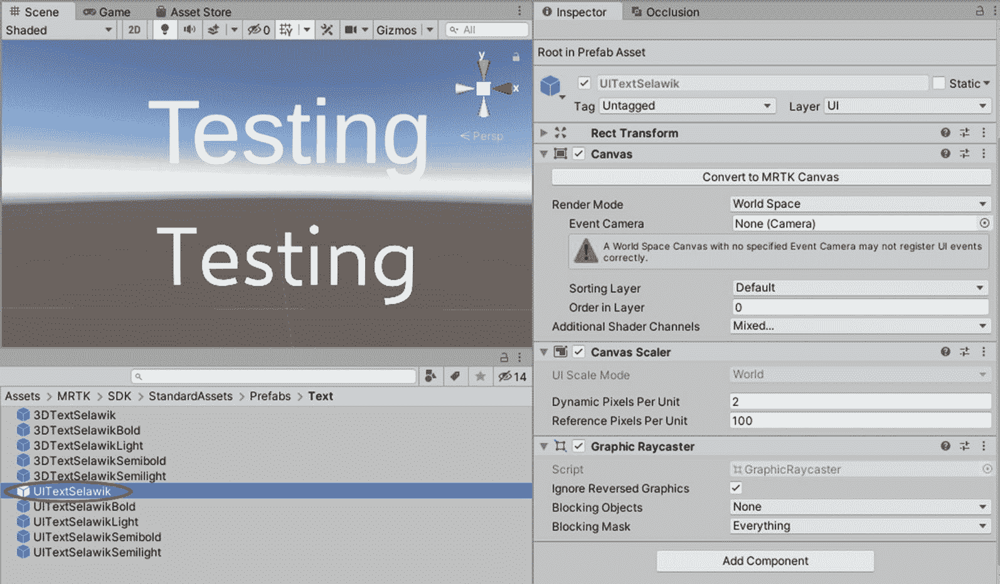

图 10-14：使用 `MixedRealityToolkit` 附带的排版资源（如 `UITextSelawik`），可在 HoloLens 中获得清晰的文字效果。Unity 默认的文字资源会显得模糊且不美观

根据经验法则，在 HoloLens 中，当字体为白色并以彩色或较暗（但不是黑色）的背景衬托时，文字效果最佳。避免给你的文字添加轮廓。

#### 边界控制

当用户可以选择操控（移动、旋转、缩放）全息图时，请务必添加带有 `操作柄` 的边界控制，供用户进行操控。边界控制在全息图未被选中时应不可见，而在全息图被选中时出现。

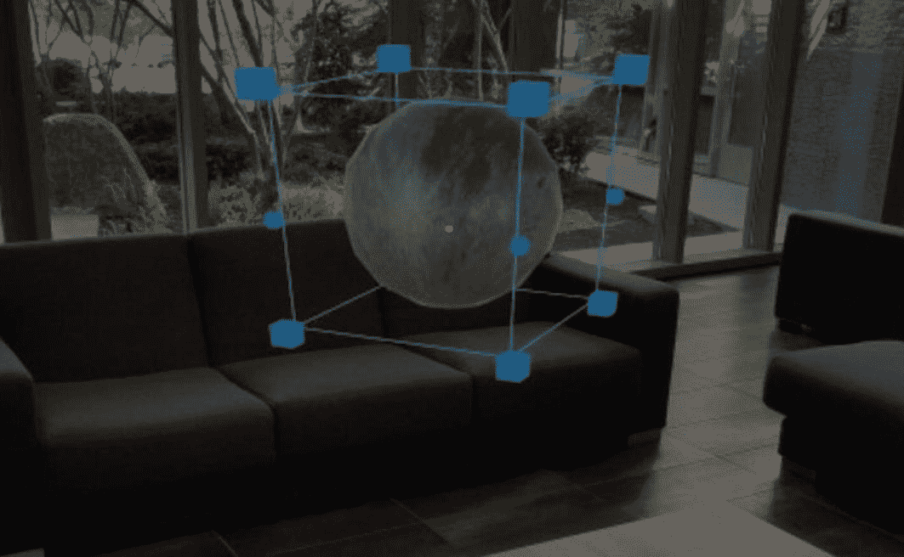

图 10-15：在选中的全息图周围显示边界控制的示例，以辅助操控


#### 工具栏

我同样建议在混合现实应用中使用工具栏和应用栏。采用简约按钮的工具栏能带来清爽的感觉，并让您的体验显得现代。图 10-16 展示了一个设计良好的工具栏示例。每个按钮都应对凝视操作做出响应，例如图 10-16 中所示的凸起按钮。

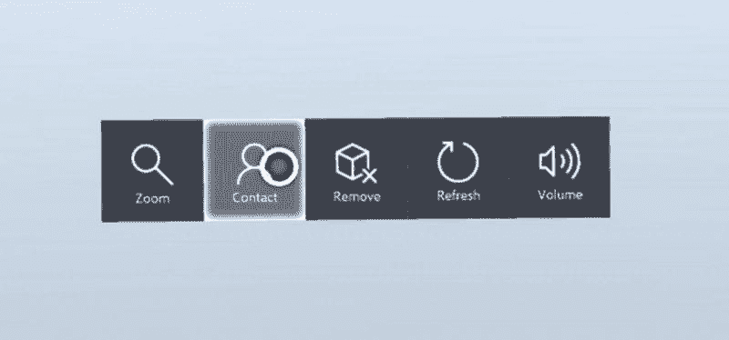

图 10-16

为您的菜单项使用简洁现代的工具栏。

#### 色彩

尽管您可能想用 HoloLens 能渲染的所有色彩让您的应用或体验变得生动夺目，但一个优秀的设计策略是：对于任何您希望呈现为传统全息图的对象，只使用一种颜色。从科幻电影中，我们期望全息投影具有某种单色光芒。用单一的蓝色或绿色渲染对象能唤起一种特殊的感觉，让全息图显得真实。

只使用一两种颜色作为应用的主题。您可以从图 10-16 之前的菜单项中看到，简单的色彩选择造就了现代感十足的 UI。

#### 应避免的设计体验

切勿将内容锁定在头部。虽然平视显示器（HUD）式 UI 听起来很有趣，但在 HoloLens 这类设备上体验并不好。如果一个信息面板或对象需要跟随用户的视线，请务必为其添加轻微延迟，让它看起来像是在追赶并跟上您的目光。HoloLens 附带的`RadialView.cs`脚本已经提供了延迟跟随功能。

避免使用刺耳的音效，尤其是当它们由凝视触发时。这可能会给用户带来烦人的体验。

除非绝对必要，否则避免让用户输入信息。在 HoloLens 这类设备上进行文本输入既困难又繁琐。

#### 更多资源

HoloLens 设计团队提供了一个宝贵的资源，用于在您的项目中实施众多设计最佳实践。除了混合现实工具包，您还会在 GitHub 上找到另一个名为“混合现实设计实验室”的仓库。这是寻找边界框、应用栏、进度条等预制件和脚本的绝佳资源！

您可以在 `https://github.com/Microsoft/MRDesignLabs_Unity` 找到该仓库。

### 增添魔力：Vuforia

HoloLens 这类设备本身就是现代工程的壮举，本身就充满魔力。然而，开发者仍有许多方法可以为应用增添更多魔力。在上下文中很难定义“魔力”，但我倾向于将其定义为任何因令人愉悦的意外或看似不可能而让用户惊叹的体验。

唤起魔力感最强大的方式，是将您的混合现实应用与人工智能或“认知服务”相结合。诸如 IBM Watson、Microsoft Azure 等服务允许应用执行令人惊叹的任务，例如图像识别、自定义语音/聊天功能、实时翻译等等！

您可以查看 Azure 的认知服务列表，以了解可用的资源类型：`https://azure.microsoft.com/en-us/services/cognitive-services/`

为应用增添魔力的我最喜欢的一个例子，是使用一个名为 Vuforia 的强大工具。Vuforia 允许您的头戴设备识别真实世界中的 2D 图像和 3D 物体，并在识别到的图像/物体上或附近实时放置一个全息图！接下来，我将提供一个简短的教程，介绍如何下载并设置一个由 Vuforia 驱动的体验。

### 第一步：安装 Vuforia 示例

打开一个新的 Unity 项目，进入资源商店并搜索 Vuforia 引擎资源。点击下载。见图 10-17。

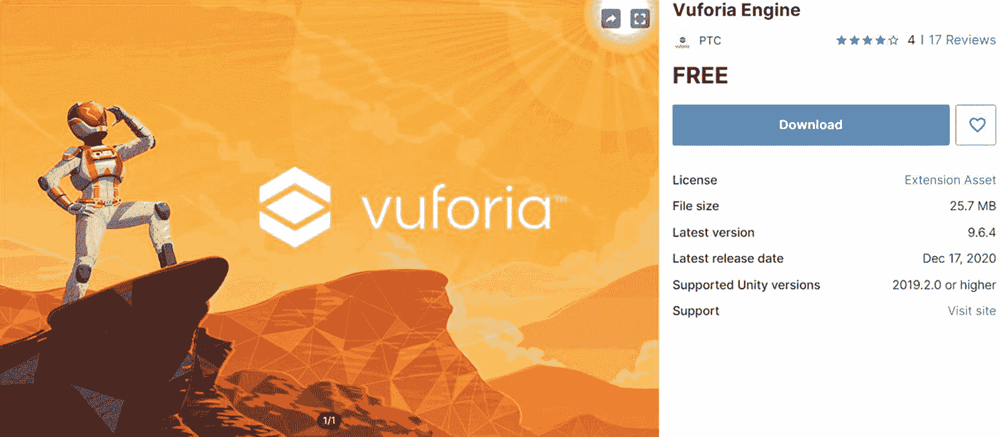

图 10-17

点击下载按钮下载您的资源。

下载完成后，点击导入。

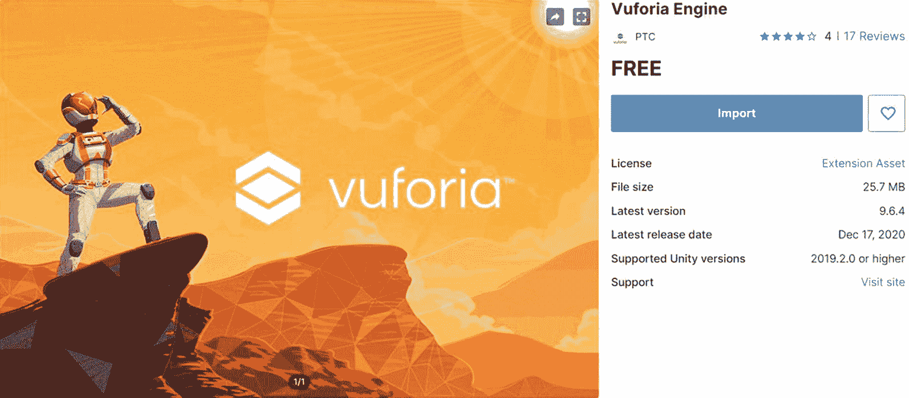

图 10-18

点击导入按钮导入所有包。

导入资源后，在项目窗口中搜索名为`"0-Main"`的场景，并打开`0-Main`场景。见图 10-19。

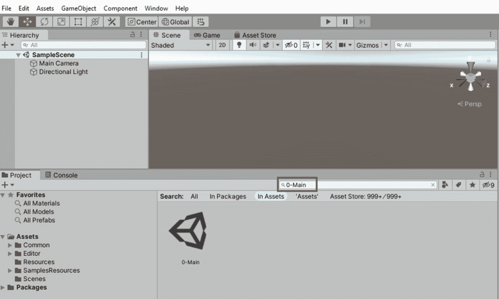

图 10-19

搜索`"0-Main"`场景。

在层级窗口中选择`ARCamera`，然后在检查器窗口中点击`Open Vuforia Engine configuration`。

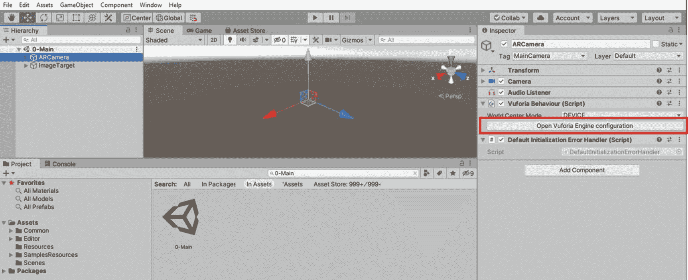

图 10-20

在检查器窗口中打开 Vuforia 引擎配置。

现在在`App License Key`文本框中输入 Vuforia 许可证密钥。

以下是创建和使用 Vuforia 许可证密钥的链接：`https://library.vuforia.com/articles/Training/Vuforia-License-Manager.html`

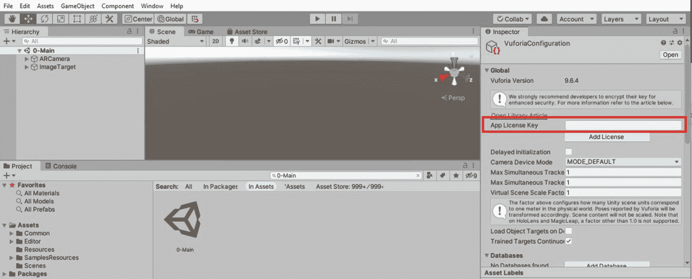

图 10-21

在图中高亮显示的字段中提供许可证密钥。

### 第二步：试试看！

为了体验实际运行的应用，您需要打印出 Vuforia 的目标图像。您可以从以下 URL 下载该图像：`https://library.vuforia.com/sites/default/files/vuforia-library/docs/target_samples/unity/mars_target_images.pdf`（只需考虑六个目标图像中的第一个）。您导入 Unity 的应用包无需额外设置。您可以通过全息远程处理或在您的设备上部署来测试该应用。为了获得最流畅的体验，我建议将应用部署到您的 HoloLens 上。

当您启动 Vuforia 应用时，您会注意到一个 3D 宇航员出现在您打印出的宇航员图像上方！图 10-22 展示了这一效果。尝试在桌子上移动这张纸，把它举起来，并旋转它。您会注意到茶壶完美地附着在岩石图像上。真是一种神奇的体验！

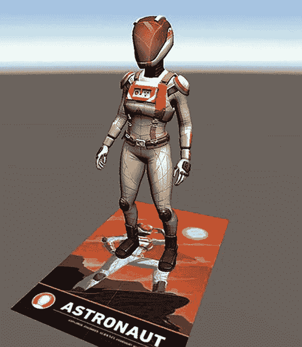

图 10-22

如同魔法一般！使用 Vuforia 的 HoloLens 示例，一个全息图像出现在卡片图像上。

请务必注册一个 Vuforia 账户，以便获得添加自定义图像目标的能力，并了解更多关于该平台的信息。如需更多信息，请访问 `https://developer.vuforia.com/`。


## 总结

为混合现实打造令人惊叹的应用程序，最终目标是为用户提供卓越的体验。在本章中，我为您提供了一些指导原则和资源，以帮助您在自己的创作之旅中打造出令人惊叹的体验。我探讨了优化应用程序性能的重要性，提供了一些加速应用程序运行的见解，引导您了解若干优秀设计的最佳实践，并给出了一个如何为您的应用程序增添一丝魔力的示例。

在为混合现实进行设计时，您的创造力实际上没有限制。在一维线上，您能施展的艺术手法不多。但在二维画布上进行绘制和开发时，便会解锁巨大的可能性。而跃升至混合现实的 3D 舞台，可能性更是成倍增长，那里有无穷的可能性等待被探索和创造。

我鼓励您在本章提供的最佳实践和工具的基础上进行构建。尝试新的设计体验——测试哪些有效，哪些无效。衡量您的应用程序是否令人惊叹的最佳方法是仔细观察他人在体验您的应用时的反应。您将很快察觉到您的应用是否能唤起惊奇和赞叹之感。最后，请不要忘记与更广泛的混合现实开发者社区分享您学到的经验教训（更多内容请见第 12 章！）。

