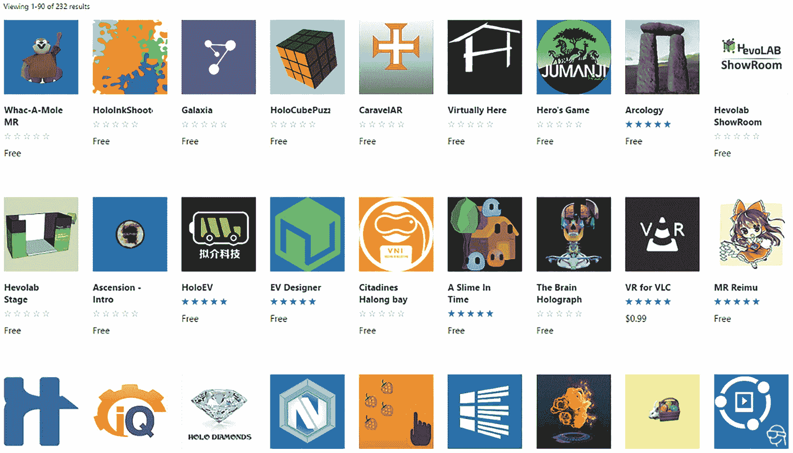

# 将全息图变成金钱

在本章中，我将向您介绍独立开发者可以通过哪些方式将混合现实开发活动转化为收益。从应用模式到以自由职业者身份提供服务，如今独立开发者可以通过多种方式从混合现实中赚钱！为混合现实进行开发既有趣又有回报，但这一革命性的新媒体也带来了大量的商业机会。请注意，在撰写本文时，绝大多数的盈利机会（如果不是全部的话）都面向企业和商业领域，而非消费领域。我们将在本章后面更详细地讨论这一点。

当我在 2016 年春天购买了第一台`HoloLens`设备后，我开始将其作为爱好和副业项目进行平台开发。我为自己和他人（免费）开发了一些应用程序。随着时间推移，我开始观察到市场对`HoloLens`开发人员有着相当活跃的需求。我回应了几个项目的投标请求，并迅速转型成为一名全职的`HoloLens`开发者。

然而，混合现实最大的财务潜力源自一个简单的事实：这些设备将取代我们目前的计算方式。这其中蕴藏着巨大的财务潜力，我们无需等待某个神话般的未来设备或形态因素出现，就可以开始挖掘这种潜力。在接下来的几个小节中，我将为您提供丰富的资源和讨论，教您如何将全息图在今天变成金钱！

## 将您的应用发布到 Microsoft Store

在本节中，我将讨论如何通过 Microsoft Store 发布您的应用并将其货币化。也许将您的混合现实体验变现最直接的方法就是将其发布到 Microsoft Store。*Microsoft Store* 是微软的应用、媒体和其他产品的在线商店。图 11-1 展示了 Microsoft Store 上众多 HoloLens 应用中的一小部分。

**图 11-1** Microsoft Store 包含数百个应用，并且每月都在增加

当您向 Windows Store 发布应用时，您有几种货币化选项：

- *免费*应用是用户可以免费下载的应用程序。您不会从此方法获得任何直接收入，但这是建立您的作品集和声誉的绝佳方式，并可能带来其他财务机会。开发者也可能拥有许多应用的作品集，其中免费应用可能会引导用户下载同一开发者的其他付费应用。

- *免费带广告*应用是用户可以免费下载但包含应用内广告的应用程序。收入来自广告点击和展示。这在移动应用中是一种相当流行的方式；然而，在撰写本文时，它在混合现实中尚未得到验证。

- *免费增值*应用是用户可以免费下载的应用，但可以选择支付额外费用以获取高级功能、应用内资源，或去除广告。

- *付费*应用是用户需要先付费才能下载的应用。开发者可以选择在要求用户付费之前，提供有限的试用期。

我尚未从微软找到关于混合现实应用下载量、用户参与度和收入的相关统计数据。然而，开发者普遍认为 Windows Store 上的货币化机会仍然相当低。

## 自由职业与合同

在本节中，我将讨论如何成为一名独立的混合现实开发者，并分享成功寻找和获取机会的最佳实践。我将分享自己的一些经历，来说明您如何通过混合现实合同获得完全的经济支持。

在 2016 年春天我收到第一批`HoloLens`（第一代）设备之一后不久，我就开始为其进行开发。然而，我主要创建的是实验性应用程序，并没有明确的变现策略。但我没有意识到的是，这些实验性混合现实应用的创建恰恰帮助我建立了作品集，这后来被证明对于获得我的第一批混合现实合同至关重要。

2016 年底，我注意到我经常访问的微软混合现实论坛上有几个招标请求。来自上海和迪拜的公司正在寻找`HoloLens`开发人员来创建与业务相关的体验，包括建筑可视化应用和高等教育应用。我通过为这些项目提交方案，勇敢地踏入了专业混合现实开发的新世界。我之所以能获得这些合同，部分归功于我的作品集。回想起来，我未必认为自己的作品集特别令人印象深刻；然而，在第一代`HoloLens`发布后的最初几个月里，能找到任何拥有`HoloLens`相关作品集的开发者都是非常罕见的。

我获得的这些合同范围相对较小，提供的收入不足以支撑全职工作。因此，我仍需继续做其他工作来维持生计。然而，获得并履行这些合同标志着我混合现实之旅的开始。

我职业生涯的一个关键转折点是在 2017 年 1 月，那是我开始全职为`HoloLens`进行开发的时刻，并且完全依靠混合现实的自由职业机会维持经济来源。此后，`HoloLens`和混合现实合同机会的数量和规模逐年扩大。为了满足日益增长的需求，我最终需要超越自由职业者的范畴，并创办了一家混合现实开发机构。这家机构后来衍生出多家子公司，并帮助支持了合作伙伴混合现实机构的发展。截至撰写本文时，这些机会直接促成了许多新公司的成立或扩张，支持了美国、印度和世界各地的数十名开发者、承包商和员工。

利用混合现实谋生既充满回报又令人兴奋。它还能让您对混合现实应用在商业中的应用有更切合实际的深刻见解。

## 如何寻找混合现实自由职业机会

我最初是通过监控论坛和在线社区中的需求来发现这些机会的，这些内容将在第 12 章详细讨论。在我关注的虚拟现实和混合现实在线社区中，我通常每周会看到大约三到五个自由职业或工作机会。

通过这些在线社区寻找机会的好处在于，你可以直接与需要帮助的人互动，并且招聘决定可以迅速做出。如果你活跃于这些社区，经常帮助他人、展示你的作品并为社区做出贡献，那么你被认可、受青睐并赢得新机会的可能性就会大得多。

除了在线社区，招聘公告板和自由职业网站也是你可以竞标合同的绝佳来源。在自由职业网站上脱颖而出更难，而且你通常没有机会直接与招聘经理联系。不过，那里通常有更大的项目池可以竞标，并且每天都有新项目增加。我密切关注的一个网站是 `upwork.com`，它一直是我最稳定的混合现实合同来源。虽然 Upwork 上的合同通常规模相对较小，但有些机会最终会演变成长期的客户关系。

## 提高赢得合同的几率

在赢取和丢失众多 HoloLens 机会的过程中，我观察到一些模式，有助于提高你获得混合现实工作的机会：

*   **经理们希望看到你的应用作品集**。尽量准备至少两到三个优秀应用，可以推荐给潜在客户。至少要有一个令人惊艳的应用可以首先展示。有许多软件开发公司声称拥有混合现实开发能力，但并无真正的资质或先前的经验。经理们很难从那些没有经验的人中筛选出真正的混合现实开发者。一份应用作品集能快速让经理们知道你拥有该技术的实战经验。

*   **提交一份提案**。有时候，人们容易以为一次随意的聊天或一封邮件报价就足够了。当我花时间制定一份深思熟虑的提案时，赢得合同的几率会高得多。我建议你开发一份提案模板，以便在竞标项目时快速整理好。

*   **保持联系！** 我最成功的项目恰恰来自于那些最初竞标失败的机会。无论你是竞标失败，还是在初次电话后没有收到回复，都要记录下你的各种机会并时常跟进。这能让你在客户心中保持新鲜感，并让他们知道你是一位专注的混合现实开发者。

无论你在哪个行业从事自由职业或咨询，总会面临很多竞争。混合现实领域也不例外。然而，由于混合现实是一个新兴平台，你有很多方法可以让自己作为开发者脱颖而出。为社区做出独特贡献、创建出色的应用、并通过你做的酷炫事物在社交媒体上引起轰动，这些都是你可以脱颖而出并开始从事混合现实自由职业的途径。

## 今天就是未来的机遇

至此，我希望我已经让你对混合现实的发展方向有了清晰的认识。一个每个人都与全息影像而非 2D 屏幕交互的世界，意味着许多行业将被颠覆，许多新业务将被创造，并且将出现大量的经济机遇。

事实上，这个未来并非遥不可及的科幻预测。它在今天就已经存在。我们拥有技术和资源来开始构建这个未来，我们没有理由不去做。没错，技术会不断进步（它何时停止过？），没错，设备会变得更小、更轻、更便宜。然而，HoloLens 是一款革命性的设备，完全有能力引领我们进入混合现实的未来。

想象一下，把一台个人电脑带回到几十年前，那时计算机还没有在企业中广泛使用。你觉得你能走进任何一家公司，向他们展示电脑对他们的公司有多么宝贵吗？从文档和电子表格编辑、数字艺术、记录保存、音频录制等等方面。我怀疑你不需要多少劝说就能让他们购买一台电脑。同样，混合现实就在这里，它将引领下一个计算范式，并开始颠覆现状。每当你参观或驾车经过任何办公室或企业时，开始思考这家企业如何能够利用混合现实技术。开始思考你可以构建哪些类型的应用和体验，来为那些公司增加价值。

没有什么能阻止你为当地几家公司安排一次免费演示，并向他们推销过渡到全息时代。如果你能提供一个引人入胜且有附加值的解决方案，我怀疑很少有人会拒绝一次有趣的混合现实演示的邀请！通过这种方式，你可以为自己（以及这个行业）创造新的、更大的机会。

## 本章小结

在本章中，我提供了一些关于如何作为混合现实开发者赚钱的见解。我讨论了微软应用商店的各种变现模式，提供了一些成功获取自由职业和合同机会的见解，并为你创造了身边新机遇提供了一些灵感。

最终，一个技术平台如果能增加实际价值，就会被广泛接受和拥抱。到目前为止，混合现实通过证明它确实在广泛领域内增加了价值，正在兑现其承诺。当你和其他开发者不断构建新的体验、发现与全息影像交互的新方式、并找到这个平台为企业增值的新途径时，混合现实的经济机遇将会呈指数级增长。

