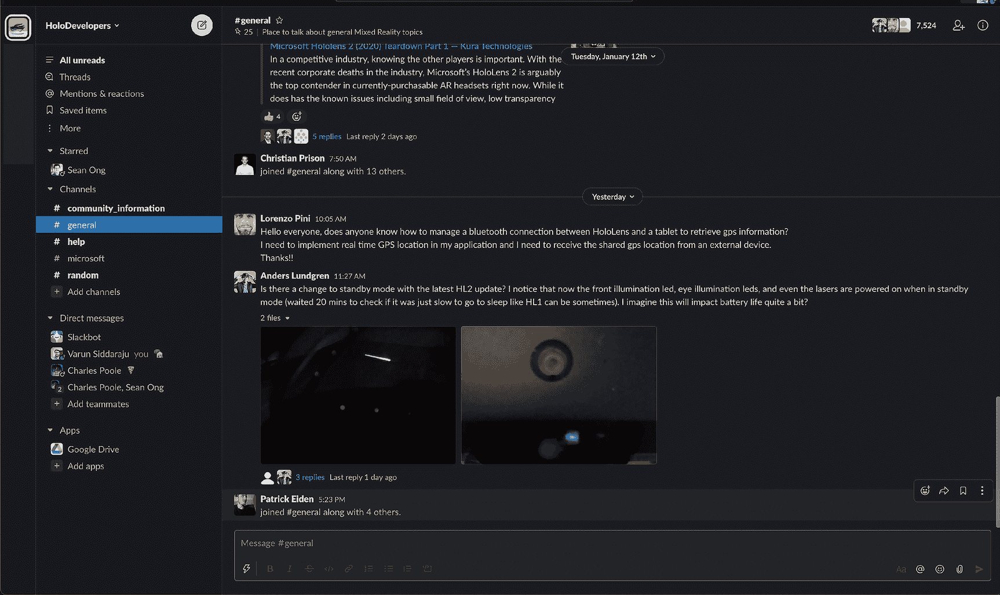
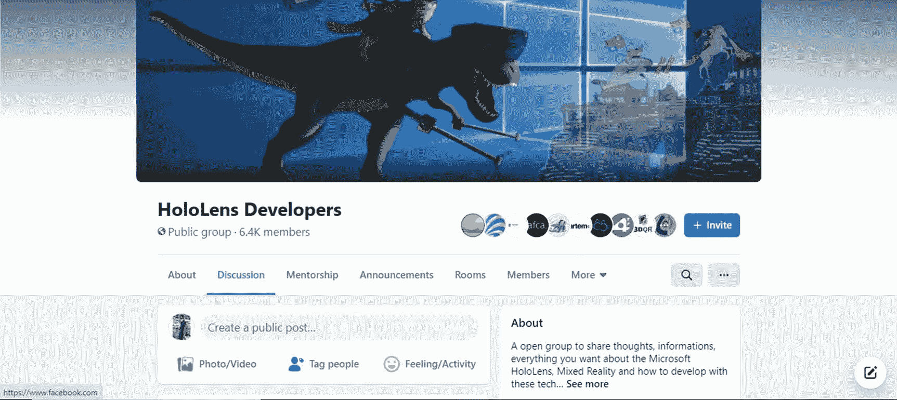
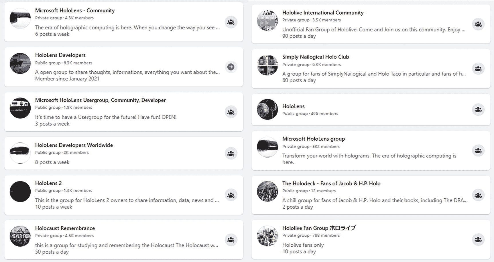
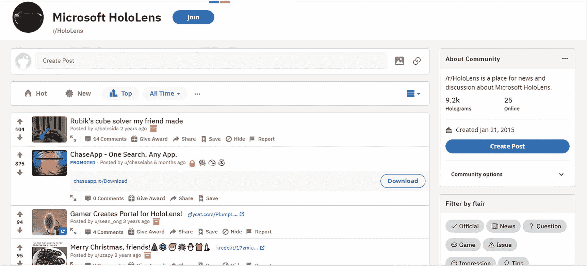
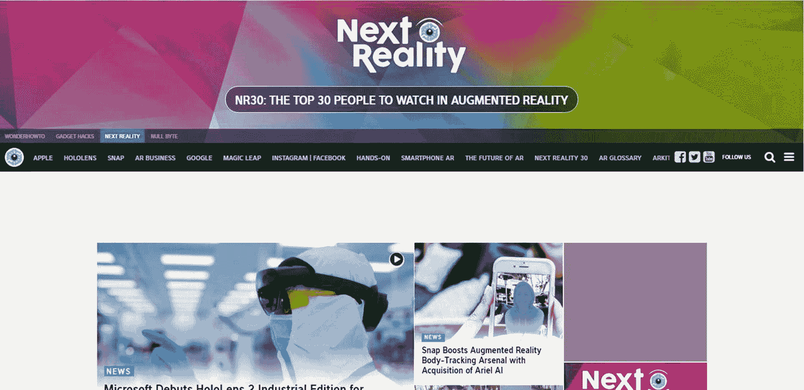
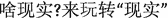

# 12. 社区资源

在本章中，我将向你介绍一些宝贵的在线和社区资源，这些资源将帮助你作为混合现实开发者的旅程。这些资源的例子包括相关的社区论坛、在线群组、知名活动以及其他在开发过程中有所帮助的信息。

我怎么强调在应用开发中利用社区资源的重要性都不为过。这对于混合现实开发来说尤其如此，因为该平台尚新，世界各地的开发者正在交流宝贵的经验教训。正如你在本书中听到我反复强调的那样，在沉浸式计算方面，世界尚未解锁良好的用户体验。我预计在未来几年内，随着我们（混合现实开发者）逐渐掌握这项革命性技术，将会出现数十个“尤里卡！”时刻。因此，加入社区以交流想法、互相帮助、并在他人的成功基础上再接再厉，将极为有利。

## HoloDevelopers Slack 团队

HoloDevelopers Slack 团队是我个人最喜欢的在线 HoloLens 和混合现实社区，并且我认为它绝对是新开发者最有用的社区。在本节中，我将介绍 HoloDevelopers Slack 团队，包括如何加入该群组以及参与该社区的最佳方式。

### 什么是 Slack？

对于不熟悉 Slack（[*https://slack.com/*](https://slack.com/)）的人来说，它是一个出色的团队协作与沟通工具。它可以被看作是一个大型聊天室平台，社区成员可以在这里跨多个聊天室讨论想法和分享内容。Slack 的强大之处在于其跨平台兼容性（Web、iOS、Android、Mac、Windows、Windows Phone、HoloLens 等），以及能够与大型群体在多个聊天室（称为“频道”）中聊天和互动，每个频道专注于特定的讨论主题。任何人都可以创建 Slack 团队，并且有成千上万个 Slack 团队涵盖广泛的主题。Slack 在企业中也很受欢迎，被用作员工沟通工具。

### 什么是 HoloDevelopers Slack 团队？

HoloDevelopers Slack 团队是“半官方”的开发者 Slack 团队，专注于所有与 HoloLens 和 Windows Mixed Reality 相关的内容。这是一个开发者可以分享经验、提问和讨论 Windows Mixed Reality 的地方。我说“半官方”，是因为这个 Slack 团队并非由微软创立，但它已变得如此重要，以至于微软现在在其网站上承认了这个资源（[*https://developer.microsoft.com/en-us/mixed-reality/*](https://developer.microsoft.com/en-us/mixed-reality/)），并且有来自 HoloLens 团队的数十名微软员工定期在 HoloDevelopers Slack 中贡献和参与。

HoloDevelopers Slack 团队由 Jesse McCulloch 创立，起因是他对微软官方 Windows Mixed Reality 开发者论坛的一些缺陷感到失望。该 Slack 团队旨在为 Mixed Reality 开发者提供更强的社区归属感，以及在提问时获得更快速、更具互动性的反馈。

HoloDevelopers Slack 团队包含一个不断更新的许多相关讨论频道列表，每个频道都有活跃的对话。图 12-1 展示了该 Slack 团队中一次对话的截图。在撰写本文时，HoloDevelopers Slack 拥有近 *10,000* 名成员，并以每周约 25 到 30 名新成员的速度增长。你可以通过以下网址找到该 Slack 团队：[`https://holodevelopers.slack.com/`](https://holodevelopers.slack.com/)。

图 12-1

HoloDevelopers Slack 团队是一个由 HoloLens 和 Windows Mixed Reality 开发者组成的活跃群体

### 如何加入 HoloDevelopers Slack 团队

加入 HoloDevelopers Slack 团队很简单。在此链接处输入你的电子邮件地址：[`https://holodevelopersslack.azurewebsites.net/`](https://holodevelopersslack.azurewebsites.net/)，如图 12-2 所示。你会立即收到加入该 Slack 团队的邀请，届时你可以注册你的账户。

图 12-2

使用注册链接即可立即获得邀请，加入 HoloDevelopers Slack 团队

### 参与 HoloDevelopers Slack 团队

一旦你成为 HoloDevelopers Slack 团队的成员，向社区介绍自己是开启对话的好方法。

我建议你使用 `#help` 频道来处理你可能遇到的与项目相关的问题。使用 `#general` 频道进行一般的 Windows Mixed Reality 讨论，并使用 `#random` 频道来讨论任何与 Mixed Reality 无关的内容，或者当你不确定你的内容是否适合在 `#general` 中讨论时使用。

以下是一些充分利用这个 Slack 社区的通用提示：

- 微软有 HoloLens 员工积极参与这个社区。记得在适当的时候联系他们！
- 不要害怕提出棘手的问题。这个 Slack 团队汇聚了惊人的人才，总有人乐于提供帮助。如果你的问题没有得到回答，坚持向社区提问！
- 赚点钱！定期查看 `#job-opportunities` 频道，寻找有趣的就业和合同机会。
- 请务必在你的手机和电脑上安装 Slack 应用，以便接收通知并轻松关注你感兴趣的讨论。
- 使用直接消息功能与个人进行一对一的对话。
- 分享你的工作！Mixed Reality 社区中的每个人都喜欢看到彼此的进展和成就。分享你的工作，并分享学到的经验教训。

总的来说，如果只能选择一个 Windows Mixed Reality 社区加入，我肯定会选择 HoloDevelopers Slack 团队。这个群体中的社区氛围、参与程度和开发者的素质使其无可匹敌。我强烈推荐你加入并定期关注这个社区。

## 其他在线社区和资源

在本节中，我将介绍其他你可以参与的在线 HoloLens 和 Windows Mixed Reality 社区和群体。

### HoloLens 开发者 Facebook 群组

如互联网常态，作为混合现实开发者，有数百（甚至数千）个在线群组、论坛和社区可供你加入和参与。话虽如此，我认为主要在线社区有两个。我们已经讨论过第一个——`HoloDevelopers` Slack 团队。第二个是“HoloLens 开发者”Facebook 群组，网址如下：[`www.facebook.com/groups/winholographicdevs/`](http://www.facebook.com/groups/winholographicdevs/)。

根据该 Facebook 群组的描述，HoloLens 开发者群组是一个“开放群组，用于分享关于 Microsoft HoloLens、混合现实以及如何使用这些技术进行开发的想法、信息以及你感兴趣的一切内容。”

截至撰写本文时，该群组拥有超过 6400 名成员，是 Facebook 上最大的 Windows 混合现实开发者群组。图 12-3 展示了你访问该群组时会看到的内容示例。Facebook 会提示你成为该群组成员，之后你才能在此群组中发帖或评论。七位管理员中的一位会批准你的加入请求，通常在申请加入后的几小时内即可完成。

**图 12-3** HoloLens 开发者群组是 Facebook 上最大的 Windows 混合现实开发者群组

该群组与我们之前介绍的其他热门在线社区之间存在一定程度的用户重叠。大多数时候，每个群组都有不同的活跃贡献者，并且各自分享和覆盖不同的内容。因此，我通常每周都会关注这些（以及其他）社区。

Facebook 群组通常更适用于分享和消费混合现实新闻与体验。新用户查看群组的照片、链接和历史记录比在 Slack 或论坛上更容易。对于熟悉 Facebook 并经常使用该平台的开发者来说，它也很方便。然而，该群组不适合实时聊天和讨论。在 Facebook 上跟进深入的开发者讨论也可能比较困难。

Facebook 上有数十个（甚至数百个）与 HoloLens 和混合现实相关的群组。图 12-4 展示了我在搜索“Windows 混合现实”Facebook 群组时出现的一小部分群组样本。其中一些群组拥有数千名成员。我尚未有机会探索所有这些群组——但如果你正在寻找某个特定的 Windows 混合现实社区，你一定能在 Facebook 上找到相关的内容。

**图 12-4** Facebook 上有众多 HoloLens 和 Windows 混合现实群组可供选择

### Unity 和 Unity HoloLens 论坛

对于任何基于 Unity 的应用程序（包括 Windows 混合现实应用程序）来说，最强大的开发资源之一就是 Unity 论坛。你可以在 [`https://forum.unity3d.com`](https://forum.unity3d.com) 找到 Unity 论坛。

当你向最喜欢的搜索引擎询问任何与 Unity 相关的问题时，你很可能会被引导至 Unity 论坛寻找答案。在混合现实领域之外，Unity 被广泛用于游戏开发。这是个好消息，因为这意味着有多年积累的教程、资源和论坛讨论，可以帮助你解答在开发混合现实应用程序时可能遇到的几乎所有问题。

### HoloLens Subreddit

如果你不熟悉 Reddit（[`www.reddit.com`](http://www.reddit.com)），它是世界上第 18 大最受欢迎的网站（截至撰写本文时）。Reddit 之所以受欢迎，是因为用户通过“投票”将相关的新闻和内容推到信息流的顶部，而不是由未知的搜索引擎算法策划内容或由媒体机构人工挑选。

Reddit 上有无数的话题组，称为“subreddits”。HoloLens subreddit（[`www.reddit.com/r/HoloLens/`](http://www.reddit.com/r/HoloLens/)）是 HoloLens 和 Windows 混合现实领域最受欢迎的 subreddit，截至撰写本文时拥有约 9238 多名订阅者。图 12-5 展示了访问 HoloLens subreddit 时你会看到的内容。

**图 12-5** 订阅 HoloLens subreddit，随时了解最相关、最精彩的 HoloLens 和 Windows 混合现实新闻

HoloLens subreddit 是筛选出相关 Windows 混合现实新闻并过滤无关或不重要内容的绝佳资源。自然，任何重要或相关的帖子都会获得更多的点赞，并上升到信息流的顶部。

Reddit 还有一个实用的功能，可以按不同时间段内获得最多点赞的帖子进行排序。如图 12-5 所示，我通过点击上方菜单中的“热门”和下方菜单栏中的“全部”列出了历史最佳帖子。这使得不常访问的用户可以每隔几天/几周/几个月查看一次，确保自己没有错过任何重大的 Windows 混合现实新闻或内容。

不要忘记阅读重要帖子的评论部分！Reddit 拥有一个活跃的“评论者”社区，他们分享观点和有价值的见解，为大多数提交的帖子增添了丰富的语境和幽默感。

### Next Reality News

在众多科技新闻网站中，我发现 Next Reality News（[`https://next.reality.news/`](https://next.reality.news/)）始终如一地提供关于 Windows 混合现实头显和软件的最佳报道。他们还定期发布对 HoloLens 和混合现实开发者有帮助的教程。

Next Reality News 是一个极佳的平台，可以阅读关于 Windows 混合现实（以及其他增强/虚拟现实）新闻的深度报道，并听取带有独特开发者视角的观点，这种视角你在其他新闻源很难找到。图 12-6 展示了访问 Next Reality News 时你会看到的内容。

**图 12-6** Next Reality News 是一个优秀的社区以及 Windows 混合现实及其他 VR/AR 新闻的来源

### YouTube

快速直观了解和体验另一种混合现实的最佳方式是观看视频。正因如此，`YouTube` 已成为开发者向世界分享其 Windows 混合现实应用的宝贵平台。以下是 HoloLens 和 Windows 混合现实领域值得订阅的几个 `YouTube` 频道：

-   **肖恩·翁的 YouTube 频道**：在此为我自己的 YouTube 频道打个广告，您可以在其中找到与我最新 Windows 混合现实项目相关的内容。截至撰写本文时，我的频道已拥有超过 50500 名订阅者，以科技相关教程、技巧、窍门和新闻而闻名，尤其侧重于 Windows 混合现实和微软产品。您可以在 [`www.youtube.com/c/seanong`](http://www.youtube.com/c/seanong) 找到我。

-   **官方 HoloLens YouTube 频道**：关注微软官方 HoloLens YouTube 频道，获取教程、应用功能以及为您下一个项目带来灵感的示例（[`www.youtube.com/channel/UCT2rZIAL-zNqeK1OmLLUa6g`](http://www.youtube.com/channel/UCT2rZIAL-zNqeK1OmLLUa6g)）。

-   **矩阵初始的 YouTube 频道**：截至撰写本文时，拥有 773 名订阅者的矩阵初始的 YouTube 频道正在崛起，其特色内容涵盖了 Windows 混合现实中一些最具创新性的概念，包括通过传送门发射激光、可在您自己的应用中使用的键盘、房间扫描技巧、评测等等！请在此频道查看：[`www.youtube.com/channel/UC5WLFKmv6BPFTBzOcZQzVag`](http://www.youtube.com/channel/UC5WLFKmv6BPFTBzOcZQzVag)。

## 本地活动与见面会

在本节中，我将介绍一些方法，帮助您参与附近的本地混合现实活动。虽然在线社区和群组提供了一种与世界各地众多开发者快速便捷沟通的方式，但在某个场所与志同道合的 Windows 混合现实爱好者和开发者面对面交流仍然具有巨大价值。

寻找本地见面会的一个热门资源是 `Meetup` 网站，网址为 [`www.meetup.com`](https://www.meetup.com)。以下列出了一个非详尽的全球各地城市的 HoloLens 和 Windows 混合现实见面会清单。其中有部分可能是范围更广的开发者或 VR/AR 群组，但已知其社群内有一名或多名 Windows 混合现实开发者。

### 欧洲见面会

-   西班牙，瓦伦西亚 [Valencia Virtual AVRE](https://www.meetup.com/realidad-virtual-aumentada-en-Valencia/)
-   瑞典，斯德哥尔摩 [Coding After Work](https://www.meetup.com/CodingAfterWork/)
-   荷兰，阿姆斯特丹 [VR 020 Meetup (Virtual Reality Amsterdam Meetup)](https://www.meetup.com/VR-020-Meetup/)
-   意大利，米兰 [3D/VR/AR//Khronos Milano Meetup](https://www.meetup.com/Khronos-Milano-Meetup/)
-   法国，巴黎 [Paris Glass User Group](https://www.meetup.com/ParisGlassUG/)
-   俄罗斯，伊万诺沃 [Ivanovo IT Garage](https://www.meetup.com/Ivanovo-IT-Garage/)
-   法国，巴黎 [Paris XR](https://www.meetup.com/parisXR/)
-   德国，柏林 [Reality Hackers VR/AR](https://www.meetup.com/varhackers/)
-   保加利亚，索菲亚 [VR Lab BG](https://www.meetup.com/Virtual_Reality_Meetup_-_Bulgaria/)
-   荷兰，赖斯韦克 [Mixed Reality User Group](https://www.meetup.com/Mixed-Reality-User-Group/)
-   德国，慕尼黑 [HoloLens Meetup Germany](https://www.meetup.com/HoloLens-Meetup-Germany/)
-   荷兰，赖斯韦克 [Global XR Talks](https://www.meetup.com/GlobalXRTalks/)
-   荷兰，阿姆斯特丹 [B Talks](https://www.meetup.com/Bit-Talks/)
-   瑞典，斯德哥尔摩 [Mixed reality Sweden](https://www.meetup.com/Mixed-reality-Sweden/)
-   英国，邓迪 [Dundee Tech Talks – All Things Technology](https://www.meetup.com/Dundee-Tech-Talks-All-Things-Technology/)
-   荷兰，阿姆斯特丹 [HoloLens Augmented Reality Fanatics](https://www.meetup.com/HoloLens-Augmented-Reality-Fanatics/)
-   瑞士，巴塞尔 [Basel AR & VR Group](https://www.meetup.com/Basel-AR-VR-Group/)
-   德国，柏林 [Football Technology Berlin](https://www.meetup.com/Football-Technology-Berlin/)
-   比利时，梅赫伦 [HOLUG](https://www.meetup.com/HOLUGbe/)
-   瑞典，斯德哥尔摩 [Stockholm AR Meetup](https://www.meetup.com/Stockholm-AR-Meetup/)
-   爱尔兰，都柏林 [Industrial and Commercial Applications of VR & AR](https://www.meetup.com/Industry-and-Commercial-Applications-of-VR-AR/)
-   法国，巴黎 [NUI Day Conférence et Meetup](https://www.meetup.com/NUIDay/)
-   瑞典，哥德堡 [Gothenburg Hololens Meetup](https://www.meetup.com/gbg-Hololens-Meetup/)
-   西班牙，巴塞罗那 [ERNI Innovation Community](https://www.meetup.com/innovation-barcelona/)
-   德国，菲林根-施文宁根 [XR Trainingszentrum (XRTZ) | Digital Mountains Hub](https://www.meetup.com/XR-Cyber-Makerspace-Digital-Mountains-Hub-imsimity/)

### 北美聚会

- 加利福尼亚州旧金山 [微软 HoloLens 与混合现实](https://www.meetup.com/hololens-mr/)
- 加利福尼亚州圣莫尼卡 [XReality：未来科技与超越](https://www.meetup.com/XReality-AR-VR-MR-and-Beyond/)
- 加拿大魁北克省 [CGI 魁北克聚会](https://www.meetup.com/Meetup-CGI-Quebec/)
- 加利福尼亚州洛杉矶 [XRLA（传承版）](https://www.meetup.com/XRLA_Legacy/)
- 田纳西州纳什维尔 [空间纳什维尔](https://www.meetup.com/Spatial-Nashville/)
- 加利福尼亚州旧金山 [微软 HoloLens 与混合现实](https://www.meetup.com/hololens-mr/)
- 纽约州纽约市 [微软创客与纽约市应用开发者 (#MMADNYC)](https://www.meetup.com/MMADNYC/)
- 德克萨斯州达拉斯 [达拉斯沉浸式设计与开发 – AR/VR/MR](https://www.meetup.com/Dallas-Virtual-Reality/)
- 华盛顿州西雅图 [建筑、施工和房地产中的 VR 与 AR](https://www.meetup.com/Virtual-Reality-AR-in-Architecture-Construction-Real-Estate/)
- 德克萨斯州奥斯汀 [AR/VR 工具与技术](https://www.meetup.com/AR-VR-Tools-Tech/)
- 纽约州纽约市 [纽约市 HoloLens 开发者聚会](https://www.meetup.com/NYC-HoloLens-Developers-Meetup/)
- 华盛顿州雷德蒙德 [Windows 全息用户组雷德蒙德 (WinHUGR)](https://www.meetup.com/WinHUGR/)
- 德克萨斯州奥斯汀 [奥斯汀微软开发者](https://www.meetup.com/ATX-MSFT-Devs/)
- 新泽西州伊瑟林 [微软创客与新泽西应用开发者 (#MMADNJ)](https://www.meetup.com/MMADNJ/)
- 俄勒冈州波特兰 [波特兰 HoloLens 聚会](https://www.meetup.com/hololenspdx/)
- 加利福尼亚州卡尔弗城 [探索混合现实](https://www.meetup.com/exploring-mixed-reality/)
- 加利福尼亚州洛杉矶 [洛杉矶 AR 与混合现实](https://www.meetup.com/AR-MR-Los-Angeles/)
- 不列颠哥伦比亚省温哥华 [AWE 之夜温哥华](https://www.meetup.com/AWENiteVancouver/)
- 魁北克省魁北克市 [CGI 魁北克聚会](https://www.meetup.com/Meetup-CGI-Quebec/)
- 新泽西州新不伦瑞克 [新泽西 Unity 用户组 – 在此学习 VR/AR/360 开发](https://www.meetup.com/UnityNJ/)
- 田纳西州诺克斯维尔 [VARDNet – 虚拟/增强现实开发者网络](https://www.meetup.com/VARDNet-The-Virtual-Augmented-Reality-Developers-Network/)
- 德克萨斯州奥斯汀 [奥斯汀 XR 聚会](https://www.meetup.com/Austin-XR-Meetup/)
- 华盛顿特区 [华盛顿特区增强现实聚会](https://www.meetup.com/DC-Augmented-Reality-Meetup/)
- 德克萨斯州圣安东尼奥 [圣安东尼奥虚拟现实](https://www.meetup.com/SAVRmeetup/)
- 德克萨斯州圣安东尼奥 [PH3AR：圣安东尼奥 – 极客与玩家](https://www.meetup.com/sa-ph3ar/)
- 不列颠哥伦比亚省温哥华 [温哥华 HoloLens 用户组](https://www.meetup.com/Vancouver-HoloLens-User-Group/)
- 纽约州纽约市 [沉浸式艺术与科技 || XR, VR, AR, MR](https://www.meetup.com/Immersive-Arts-Tech/)
- 新斯科舍省哈利法克斯 [哈利法克斯增强/超/混合/虚拟现实](https://www.meetup.com/Halifax-AHMVR/)
- 加利福尼亚州山景城 [硅谷 HoloLens 开发者聚会](https://www.meetup.com/Silicon-Valley-HoloLens-Developers-Meetup/)
- 华盛顿州西雅图 [西雅图 XR](https://www.meetup.com/SeattleXR/)
- 德克萨斯州休斯顿 [AWE 之夜休斯顿](https://www.meetup.com/awe-nite-houston/)

### 亚太地区聚会

- 印度尼西亚雅加达 [印度尼西亚混合现实社区](https://www.meetup.com/MR-Indo/)
- 澳大利亚悉尼 [混合现实基础](https://www.meetup.com/Mixed-Reality-Fundamentals/)
- 澳大利亚悉尼 [澳大利亚微软活动](https://www.meetup.com/Microsoft-events-in-Australia/)
- 澳大利亚墨尔本 [墨尔本增强现实](https://www.meetup.com/armelbourne/)
- 中国杭州 [现实杭州](https://www.meetup.com/reality-hangzhou/)()
- 澳大利亚墨尔本 [墨尔本全息](https://www.meetup.com/Melbourne-Holographic/)
- 中国北京 [中国 HoloLens 用户组](https://www.meetup.com/HoloLensChina/)
- 澳大利亚阿德莱德 [阿德莱德增强现实聚会](https://www.meetup.com/Adelaide-HoloLens-Meetup/)

同样地，如果您在上述列表中未找到自己所在的城市或地区，请务必检查 `meetup.com` 或在您常用的搜索引擎中进行搜索，以找到您附近的聚会。微软还在此处维护了一份最新的社区资源和聚会列表：[`https://developer.microsoft.com/en-us/windows/mixed-reality/community`](https://developer.microsoft.com/en-us/windows/mixed-reality/community)。

您也可以考虑加入或关注 VR/AR 协会的当地分会。您可以在此处查看当地分会及分会负责人列表：[`www.thevrara.com/team/`](http://www.thevrara.com/team/)。

## 黑客马拉松

黑客马拉松是一种活动，人们在此聚集一天或多天以快速开发应用程序。黑客马拉松迫使您解决问题、利用团队成员的专业知识并向专家寻求帮助。黑客马拉松通常会为您提供接触志愿者和专家的机会，他们可以帮助您摆脱困境，并向您展示应对具有挑战性的开发问题的最佳解决方案。一个可能需要您花费数小时搜索和在线查阅才能解决的编码问题，当有专家当面演示如何操作时，通常只需几分钟就能解决。

参加黑客马拉松需要投入一些时间（通常是一个周末）和精力，但这是一种极其宝贵的、在其他地方无法获得的体验。我强烈建议您寻找相关主题的黑客马拉松，即使您需要赶路去参加也值得。相关的黑客马拉松包括 HoloLens、混合现实、虚拟现实和增强现实黑客马拉松。VR 和 AR 黑客马拉松通常会包含大量的 HoloLens 和 Windows 混合现实设备及开发者。

黑客马拉松通常提前几个月进行规划。寻找黑客马拉松的最佳地点是您当地聚会团体的社区日历。您也可能在本章提到的任何在线社区团体上偶尔看到其广告。您可以随时询问当地或在线社区团体的成员，看他们是否知道即将举行的任何黑客马拉松，您一定会收到关于一系列黑客马拉松的多个回复。

## 值得关注的行业活动

行业活动和会议是了解混合现实行业动态的绝佳途径。各类大会和博览会为你提供了学习丰富知识、亲身体验大量演示、拓展人脉以及在社区群组中与平日线上交流的人线下会面的机会。

本地、全国乃至全球范围内从不缺乏各种会议、大会、博览会及其他活动。正如我在上一节提到的黑客马拉松，你可以通过社区日历以及本地或线上群组了解即将举办的活动。

我还整理了一份值得关注的行业活动清单，这些活动因对 HoloLens 和 Windows 混合现实开发者尤为重要而备受认可：

*   *Unity Unite*：`Unite`是一个汇聚全球开发者、激发灵感并促进学习的平台。通过 Unity 的 `Unite` 社交活动和空间，你可以从人与项目中获得灵感，在展会上发现新技术，并与合作伙伴在同一地点建立联系。活动内容包括按需提供的直播课程、充满灵感、实用技巧和惊人工作流程的主题演讲。最新 Unite 2020 的链接：[`https://unity.com/events/unite`](https://unity.com/events/unite)。

*   *增强现实世界博览会*：增强现实世界博览会（AWE）是全球最大的增强现实和虚拟现实活动。AWE 涵盖一系列混合现实技术，并重点关注增强现实。我曾参加 2017 年的 AWE，惊讶地发现展会上绝大多数展位都展示了 HoloLens 体验。AWE 还以更侧重于企业级和商业应用而闻名，而其他许多 VR/AR 会议则往往偏向社交和游戏领域。了解更多 AWE 信息，请访问 [`www.augmentedworldexpo.com/`](http://www.augmentedworldexpo.com/)。

*   *Microsoft Build*：Microsoft Build 是微软为其各类软件和硬件产品开发者举办的首要活动。微软通常会安排关于 Windows 混合现实的学院课程，发布重大的混合现实公告，并提供涵盖广泛主题的深入讲座。Microsoft Build 的门票通常在几分钟内售罄，但主题演讲会在线直播，所有课程在活动结束后均可免费按需观看。在此处了解更多关于 Build 的信息：[`https://news.microsoft.com/build2020/`](https://news.microsoft.com/build2020/)。

## 总结

祝贺你！你不仅读到了本章的结尾，也完成了整本书的阅读。在本章中，我向你介绍了作为开发者如何保持信息灵通并与社区保持联系。我介绍了值得参与的优秀线上社区、获取 Windows 混合现实新闻的最佳信息来源、如何亲身参与本地线下聚会，以及你可以参加的重要活动和黑客马拉松。正如本章开头所述，融入开发者社区至关重要，尤其是在混合现实仍是一个新兴领域，许多最佳实践尚待开发者社区共同探索的当下。

我们与这本书的旅程或许已告一段落，但你作为开发者的旅程才刚刚开始！从掌握 Unity 中的物理引擎到成为着色器优化专家，提升开发技能的方式数不胜数。在混合现实的世界里，仍有太多知识与未知等待我们去学习和发现。

我祝愿你在新的冒险中一切顺利，并迫不及待地想看到你创造的一切。现在，让我们一起开始构建我们的全息未来吧！

